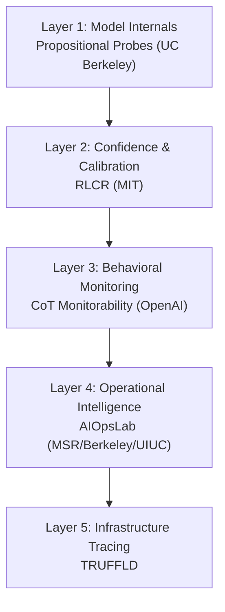
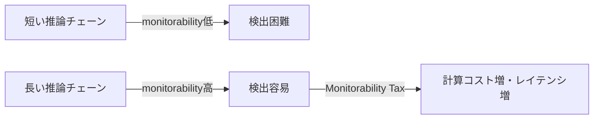
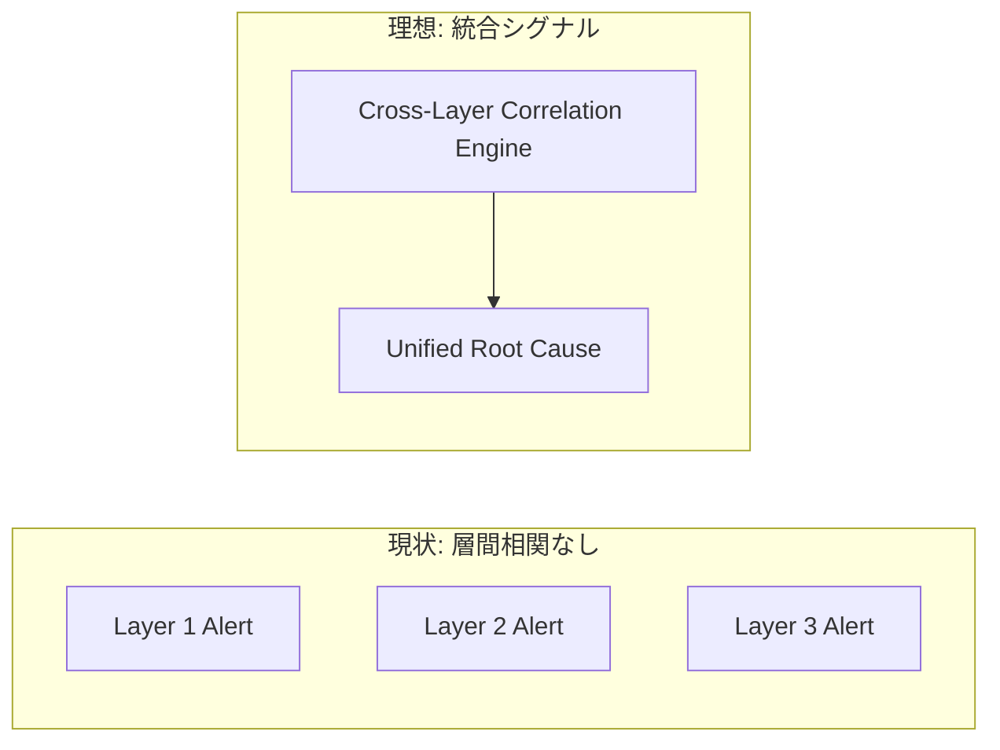
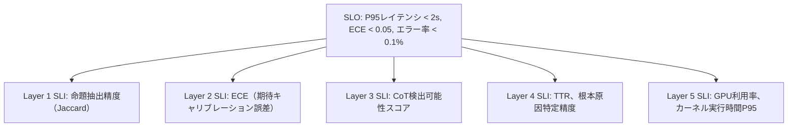

## 論文概要

本記事は https://arxiv.org/abs/2604.26152 の解説記事です。

本論文「AI Observability for Large Language Model Systems: A Multi-Layer Analysis of Monitoring Approaches from Confidence Calibration to Infrastructure Tracing」は、Twinkll Sisodia（2026年4月28日公開、arXiv:2604.26152、カテゴリ: cs.SE）によるサーベイ論文である。著者らは、LLMシステムの可観測性に関する2025〜2026年時点の主要研究5本を統合的に分析し、5層タクソノミー（five-layer observability taxonomy）として体系化することを試みたと述べている。個々の層では印象的な深さの研究成果が積み重なっている一方で、層をまたいだ統合的な取り組みは依然として限定的であるという核心的な結論を導き出している。

この記事は [Zenn記事: 分散AIエージェントのSLO設計とメトリクス戦略：信頼性を定量化する](https://zenn.dev/0h_n0/articles/f66f067f80e840) の深掘りです。

---

## 情報源

| 項目 | 内容 |
|---|---|
| 論文タイトル | AI Observability for Large Language Model Systems: A Multi-Layer Analysis of Monitoring Approaches from Confidence Calibration to Infrastructure Tracing |
| 著者 | Twinkll Sisodia |
| arXiv ID | 2604.26152 |
| 公開日 | 2026年4月28日 |
| カテゴリ | cs.SE（ソフトウェア工学） |
| URL | https://arxiv.org/abs/2604.26152 |
| 関連Zenn記事 | [分散AIエージェントのSLO設計とメトリクス戦略](https://zenn.dev/0h_n0/articles/f66f067f80e840) |

---

## 背景と動機

LLMシステムが本番環境へ広く展開されるようになった現在、モデルの推論品質・信頼性・インフラコストを継続的に把握するための可観測性（observability）は不可欠な技術課題となっている。しかし、LLMの可観測性研究はモデル内部の表現解析、確信度のキャリブレーション、推論チェーンの監視、クラウド運用インテリジェンス、GPUレベルのトレーシングと、互いに独立したコミュニティで進展してきた。著者らは、これらの研究を横断する統一的な視点が欠如していることを問題意識として挙げており、分散した成果を一つのタクソノミーの下に整理することで、研究上の空白と今後の方向性を明確化することを目的としたと述べている。特に、層間でのシグナル相関・統合評価ベンチマーク・リアルタイム適応監視・コストを意識した監視リソース配分という4つの未解決課題が、現状の研究コミュニティにおける重要なギャップとして浮き彫りになっている。

---

## 主要な貢献

著者らが本論文において報告している主要な貢献は以下の通りである。

1. **5層可観測性タクソノミーの提案**: モデル内部（Layer 1）から自信度キャリブレーション（Layer 2）、行動監視（Layer 3）、運用インテリジェンス（Layer 4）、インフラトレーシング（Layer 5）へと至る階層的な分類体系を構築したと述べている。
2. **主要研究5本の統合分析**: UC Berkeley の Propositional Probes、MIT の RLCR（Reinforcement Learning with Calibration Reward）、OpenAI の CoT Monitorability、MSR/Berkeley/UIUC の AIOpsLab、TRUFFLD の5研究を各層に対応させて詳細に分析したと報告している。
3. **4つのクリティカルギャップの同定**: 現在の研究が個々の層では高い深さに達している一方、統合的な取り組みが限定的であることを示す4種類の未解決課題を整理したと述べている。
4. **実用的な研究ロードマップの提示**: 各ギャップに対して具体的な研究方向性を示し、産業界と学術界の双方に向けた指針を提供したと報告している。

---

## 技術的詳細：5層タクソノミー

著者らは5層のタクソノミーを論文全体の骨格として用いており、それぞれの層において代表的な研究を一本ずつ取り上げて詳細分析を行ったと述べている。以下に各層の技術的詳細を示す。

### Layer 1 — Model Internals: Propositional Probes（UC Berkeley）

著者らは、Layer 1の代表研究としてUC Berkeleyが提案した「Propositional Probes」を取り上げており、モデルの内部活性化（activations）から論理命題（logical propositions）を直接抽出する手法であると説明している。

従来のプローブ手法がニューロンや注意ヘッドの重みを統計的に調べるものであったのに対し、Propositional Probes はモデルが内部表現として保持している命題的な知識構造（"AはBである"という形式の命題）を活性化空間から取り出すことを試みると著者らは述べている。

評価指標としてジャッカード指数（Jaccard Index）が用いられており、著者らは「スカイラインとの差が10%以内」という水準を達成したと報告している。スカイラインとは人間が手動でアノテーションした命題集合を指し、自動抽出された命題集合との重複率でモデルの知識構造把握精度を定量化するものである。

$$
J(A, B) = \frac{|A \cap B|}{|A \cup B|}
$$

ここで $A$ は自動抽出された命題集合、$B$ は人間アノテーションによるスカイライン命題集合を表す。著者らは、この水準の達成がLLMの内部知識状態をブラックボックスを開けずに把握する実用的な可能性を示すと述べている。

**可観測性上の意義**: モデルの内部状態が推論の根拠として何を「知っている」のかをリアルタイムで確認できれば、誤った前提に基づく出力の早期検出が可能になる。Layer 1はそのような内省的な監視の基盤を提供すると著者らは位置づけている。

---

### Layer 2 — Confidence & Calibration: RLCR（MIT）

著者らはLayer 2の代表研究としてMITが提案した「RLCR（Reinforcement Learning with Calibration Reward）」を詳細に分析している。RLCRはLLMの確信度（confidence）キャリブレーションを強化学習のフレームワークで改善する手法であると説明している。

**キャリブレーションとECE**

キャリブレーションとは、モデルが「80%の確率で正しい」と出力した回答が実際に80%の確率で正しいという対応関係を指す。この誤差を定量化する標準指標として期待キャリブレーション誤差（Expected Calibration Error, ECE）が用いられる。

$$
\text{ECE} = \sum_{m=1}^{M} \frac{|B_m|}{n} \left| \text{acc}(B_m) - \text{conf}(B_m) \right|
$$

ここで $B_m$ は $m$ 番目の確信度バケット、$n$ はサンプル総数、$\text{acc}(B_m)$ はバケット内の実際の正解率、$\text{conf}(B_m)$ はバケット内の平均確信度を表す。

**Brier スコアペナルティ**

著者らは、RLCRがBrierスコアをペナルティ項として報酬関数に組み込む点を強調している。

$$
\text{Brier Score} = \frac{1}{N} \sum_{i=1}^{N} (p_i - y_i)^2
$$

ここで $p_i$ はモデルの予測確率、$y_i$ は実際のラベル（0または1）を表す。Brierスコアが小さいほどキャリブレーションが良好であり、このペナルティを強化学習の報酬に取り込むことでモデルが適切な自信度を学習するよう誘導されると著者らは述べている。

**実験結果（論文より）**

著者らは、HotpotQAデータセットにおいてECEが 0.37 から 0.03 へと大幅に削減されたと報告している。これはモデルの確信度出力が実際の精度と高い整合性を持つようになったことを意味する。著者らはこの改善が多段階推論タスクにおける信頼性向上に直結すると述べている。

---

### Layer 3 — Behavioral Monitoring: CoT Monitorability（OpenAI）

著者らはLayer 3の代表研究としてOpenAIによる「Chain-of-Thought（CoT）Monitorability」研究を分析しており、推論チェーンの長さと監視可能性（monitorability）の関係を体系的に調査したものであると説明している。

**Monitorability の概念**

著者らはmonitorabilityを「外部観察者がモデルの推論過程を追跡・解釈できる程度」と定義しており、安全性評価やアライメント検証において重要な特性であると述べている。

**主要な知見**

著者らがOpenAI研究から引用している中心的な知見は、推論チェーンが長くなるほど行動の検出可能性（detectability）が向上するという点である。これは一見直感に反するように思われるが、チェーンが長い場合は中間ステップが明示的に記述されるため、不正な推論パターンや目標からの逸脱を検出しやすくなるという理屈によると著者らは説明している。

**"Monitorability Tax" の概念**

著者らが特に重要視している概念は、論文で提示された「monitorability tax」である。これは、高い監視可能性を維持するためにシステムが支払わなければならないコスト（計算コスト、レイテンシ、ユーザー体験の低下など）を指す。著者らは、このトレードオフが実運用システムにおける設計上の重要な考慮点であると述べており、監視の強度を動的に調整する必要性を示唆している。

---

### Layer 4 — Operational Intelligence: AIOpsLab（MSR/Berkeley/UIUC）

著者らはLayer 4の代表研究として、Microsoft Research・UC Berkeley・UIUCの共同研究による「AIOpsLab」を分析しており、クラウド運用エージェントのための標準化されたベンチマークフレームワークであると説明している。

**AIOpsLab の位置づけ**

著者らは、クラウド環境でのLLM運用において障害検知・根本原因分析・自動修復といった運用タスクを自動化するAIOpsエージェントが増加している現状を指摘している。しかし、これらエージェントの評価基準が統一されていないため、研究間での比較が困難であったと述べている。

AIOpsLabはそのギャップを埋める標準化ベンチマークとして設計されており、以下の要素を含むと著者らは報告している。

- **標準化されたタスク定義**: アラート分類、インシデントトリアージ、変更影響分析などの典型的なクラウド運用タスク
- **再現可能な評価環境**: コンテナ化されたマイクロサービス環境上での評価
- **メトリクス体系**: 解決時間（Time to Resolution, TTR）、誤検知率、根本原因特定精度など

**可観測性への接続**

著者らは、AIOpsLabがLayer 4（運用インテリジェンス）に位置する理由として、LLMエージェントがシステムメトリクス・ログ・トレースを入力として受け取り、運用判断を行うという点を挙げている。このため、AIシステム自体の可観測性と、AIが監視するシステムの可観測性という二重の観点が必要になると述べている。

---

### Layer 5 — Infrastructure Tracing: TRUFFLD

著者らはLayer 5の代表研究として「TRUFFLD」を分析しており、非侵襲的（non-intrusive）なGPUカーネルトレーシング手法であると説明している。

**手法の概要**

TRUFFLDはNVIDIAが提供するNVTX（NVIDIA Tools Extension）およびCUPTI（CUDA Profiling Tools Interface）を活用し、モデルのコードを変更することなくGPUレベルの実行プロファイルを取得すると著者らは述べている。

- **NVTX**: アプリケーションコードに注釈（annotations）を付加し、プロファイラがコードの意味論的な単位（例: Transformer層の前向き計算）を認識できるようにするAPI
- **CUPTI**: CUDAプログラムのカーネル実行時間、メモリ転送、キャッシュヒット率などをサンプリングまたはイベントドリブンで収集するプロファイリングインターフェイス

**非侵襲性の重要性**

著者らが強調しているのは、TRUFFLDが既存のモデルコードを一切変更せずにトレーシングを実現する点である。本番環境のLLMシステムにトレーシングコードを埋め込むことはメンテナンスコストや不具合リスクを生むため、非侵襲的な手法は実運用への適用可能性が高いと述べている。

---

## 5層タクソノミーの統合比較表

著者らが論文で提示した5層の統合比較を以下の表に示す。

| 層 | 名称 | 代表研究 | 組織 | 主要手法 | 主要メトリクス | 成熟度 |
|:---:|---|---|---|---|---|---|
| Layer 1 | Model Internals | Propositional Probes | UC Berkeley | 活性化空間からの命題抽出 | Jaccard Index（スカイライン比±10%） | 研究段階 |
| Layer 2 | Confidence & Calibration | RLCR | MIT | Brierスコアペナルティ付き強化学習 | ECE（0.37→0.03、HotpotQA） | 実験的 |
| Layer 3 | Behavioral Monitoring | CoT Monitorability | OpenAI | 推論チェーン長と検出可能性の分析 | Detectability、Monitorability Tax | 研究段階 |
| Layer 4 | Operational Intelligence | AIOpsLab | MSR/Berkeley/UIUC | クラウド運用エージェント標準ベンチマーク | TTR、誤検知率、根本原因特定精度 | 実験的 |
| Layer 5 | Infrastructure Tracing | TRUFFLD | — | 非侵襲的GPUカーネルトレーシング（NVTX/CUPTI） | カーネル実行時間、メモリ帯域幅、SM占有率 | 実験的 |

著者らは、この5層が互いに独立して研究されてきた結果、各層では高い深さが達成されているものの、層をまたいだ統合的な知見は得られていないという現状を「impressive depth at individual layers but limited integration across them」と総括している。

---

## 4つの未解決課題

著者らは論文において、現時点での研究コミュニティが直面する4つのクリティカルギャップを同定したと報告している。

### Gap 1: Cross-Layer Signal Correlation（層間シグナル相関）

著者らが最も根本的な課題として挙げているのが、異なる層で取得されたシグナルを相関させる仕組みが存在しないという点である。例えば、Layer 1でモデルが誤った命題を内部表現として保持していることが検出された場合、それがLayer 2の確信度スコアに与える影響、Layer 3の推論チェーンパターンへの影響という連鎖を追跡する手段がないと述べている。

著者らは、この相関の欠如が以下の問題を引き起こすと指摘している。

- 同一の異常が複数の層で独立して検出され、重複アラートが発生する
- ある層での劣化が他の層へ伝播するメカニズムが不明のまま残る
- 根本原因分析（Root Cause Analysis）において、どの層の問題が最上流にあるかを判定できない

### Gap 2: Unified Evaluation Benchmarks（統一評価ベンチマークの欠如）

著者らは、各層の研究が独自のデータセット・評価プロトコルを採用しているため、研究間の横断的比較が不可能であると述べている。Layer 2のRLCRがHotpotQAを用いている一方、Layer 4のAIOpsLabはクラウド運用シナリオを対象としており、共通のベースラインが存在しない。

著者らは、この問題が「可観測性スタック全体の効果を定量的に評価する」という要求を満たせない状況を作り出していると指摘しており、複数の層を同時に評価できる統合ベンチマークの設計が急務であると述べている。

### Gap 3: Real-Time Adaptive Monitoring（リアルタイム適応監視）

著者らは、現在の手法の多くがオフライン分析または静的な監視設定を前提としており、本番環境で発生するトラフィックパターンの変動・モデルの動的更新・負荷の急変に対応できないと述べている。

特にLayer 3の「Monitorability Tax」の概念と関連しており、監視の粒度を負荷状況に応じて動的に調整する適応的な監視アーキテクチャが必要であると著者らは指摘している。理想的なシステムは、以下のような適応的な動作を示すべきであると述べている。

- 高負荷時: 監視粒度を下げ、重要シグナルのみ収集
- 異常検知時: 対象の層のみ監視強度を自動的に増加
- 通常時: コスト効率的な軽量監視を維持

### Gap 4: Cost-Aware Monitoring Allocation（コストを意識した監視リソース配分）

著者らは、5層それぞれの監視には異なるコスト構造があるにもかかわらず、どの層にどれだけのリソースを割り当てるべきかの意思決定フレームワークが存在しないと述べている。例えば、Layer 1のプローブ解析は計算コストが高い一方でLayer 5のGPUトレーシングは比較的低コストであるが、これらのトレードオフを明示的に扱う研究はほとんどないと指摘している。

著者らは、コスト関数を明示的にモデル化し、予算制約下での最適な監視リソース配分を求める最適化問題として定式化することが今後の重要な研究課題であると述べている。

$$
\min_{\alpha_1, \ldots, \alpha_5} \sum_{l=1}^{5} c_l \cdot \alpha_l \quad \text{s.t.} \quad \sum_{l=1}^{5} \alpha_l \cdot q_l \geq Q_{\min}, \quad \sum_{l=1}^{5} \alpha_l \cdot r_l \leq R_{\max}
$$

ここで $\alpha_l$ は層 $l$ への監視リソース配分率、$c_l$ はコスト、$q_l$ は監視品質寄与度、$r_l$ はリソース消費量を表す（著者らが示唆する定式化の一例）。

---

## 実運用への応用 — OTelベースのアプローチとの対応

本論文が提示する5層タクソノミーは、関連するZenn記事「[分散AIエージェントのSLO設計とメトリクス戦略](https://zenn.dev/0h_n0/articles/f66f067f80e840)」で解説しているOpenTelemetry（OTel）ベースの実装アプローチと直接対応関係を持つ。以下にその対応を示す。

### OTelシグナルと5層タクソノミーのマッピング

| タクソノミー層 | OTelシグナル | 具体的な実装例 |
|---|---|---|
| Layer 1: Model Internals | Traces（カスタムスパン） | `gen_ai.token.usage`、活性化値をスパン属性として付加 |
| Layer 2: Confidence & Calibration | Metrics | `llm.confidence_score`、ECEをゲージメトリクスとして定期計測 |
| Layer 3: Behavioral Monitoring | Logs + Traces | CoTチェーンをログイベントとして構造化出力 |
| Layer 4: Operational Intelligence | Metrics + Logs | SLO計算に用いるエラーレート、TTRをメトリクスで追跡 |
| Layer 5: Infrastructure Tracing | Traces（低レベル） | GPU利用率をOTelメトリクスエクスポーターで収集 |

### SLOへの統合

Zenn記事で取り上げているSLO（Service Level Objective）設計の観点からは、5層タクソノミーの各層が異なるSLIに対応する。

### 実装上の優先順位

著者らが同定した4つのギャップを実運用の観点から優先順位付けすると、以下の順序が合理的と考えられる。

1. **Gap 4（コスト最適化）を先行**: OTelのサンプリングレートとメトリクス収集間隔をコスト関数に基づいて設定する
2. **Gap 3（適応的監視）を実装**: OTelのDynamic Samplerを活用し、エラーレート上昇時に自動的にサンプリングレートを引き上げる
3. **Gap 2（統一ベンチマーク）を整備**: 内部評価スイートを整備し、各層のSLIを定期的に計測する
4. **Gap 1（層間相関）は長期課題**: 相関分析はObservabilityバックエンド（Jaeger、Grafana Tempo等）のクエリ機能を活用して段階的に実装する

---

## 関連研究

著者らは本論文において以下の研究を参照・分析しており、LLM可観測性の文脈で重要な先行研究として位置づけている。

### 1. Propositional Probes（UC Berkeley）

LLMの内部活性化から論理命題を抽出する手法。モデルの「知識の内部状態」をブラックボックスを開けずに把握するアプローチとして、Layer 1の代表的研究とされている。従来の解釈可能性研究がニューロンや注意パターンの可視化に留まっていたのに対し、より意味論的なレベルでの解析を可能にする点が特徴である。

### 2. RLCR: Reinforcement Learning with Calibration Reward（MIT）

強化学習フレームワークにBrierスコアペナルティを組み込むことで確信度キャリブレーションを改善する手法。HotpotQAにおけるECE 0.37→0.03の改善は、多段階推論タスクでの信頼性向上に寄与すると著者らは述べている。近年のLLMキャリブレーション研究の中でも、学習時の損失関数レベルでキャリブレーションを組み込む点で特徴的なアプローチである。

### 3. AIOpsLab（Microsoft Research / UC Berkeley / UIUC）

クラウド運用エージェントの標準化ベンチマーク。LLMベースのAIOpsツールが乱立する中、共通評価基盤を提供する重要な取り組みである。障害検知から自動修復までの運用サイクル全体をカバーするタスク設計が特徴であり、産学連携によるベンチマーク整備の好例として著者らは評価している。

---

## まとめと今後の展望

著者らは本論文において、LLMシステムの可観測性を5層タクソノミーとして体系化し、2025〜2026年時点の主要研究5本を統合的に分析した結果を報告している。核心的な結論は「Impressive depth at individual layers but limited integration across them」であり、個々の層における研究の深さは印象的である一方、層をまたいだ統合的なアプローチが欠如しているという現状認識を示している。

**今後の研究方向性**として著者らが示唆しているのは以下の領域である。

1. **統合シグナル相関エンジンの設計**: 5層から収集されたシグナルを統一的な因果グラフとして表現し、層をまたいだ根本原因分析を可能にするフレームワーク
2. **クロスレイヤー統合ベンチマークの構築**: 単一のデータセットとプロトコルで5層すべてを評価できる標準ベンチマーク
3. **適応的監視アルゴリズムの開発**: コンテキストと負荷に応じて監視粒度を動的に調整する制御アルゴリズム
4. **コスト最適化フレームワーク**: 予算制約下での最適監視リソース配分を求める意思決定モデル

サーベイ論文としての本研究の最大の貢献は、分散した研究コミュニティを統一的な視点でまとめ、今後の統合研究への地図を提供したことにあると言える。LLMシステムが生産インフラの中核を担うようになった現在において、可観測性の体系化は産業界・学術界双方にとって急務の課題であり、本タクソノミーはその共通言語としての役割を果たすことが期待される。

---

## 参考文献

- **arXiv**: https://arxiv.org/abs/2604.26152
- **関連Zenn記事**: [分散AIエージェントのSLO設計とメトリクス戦略](https://zenn.dev/0h_n0/articles/f66f067f80e840)
