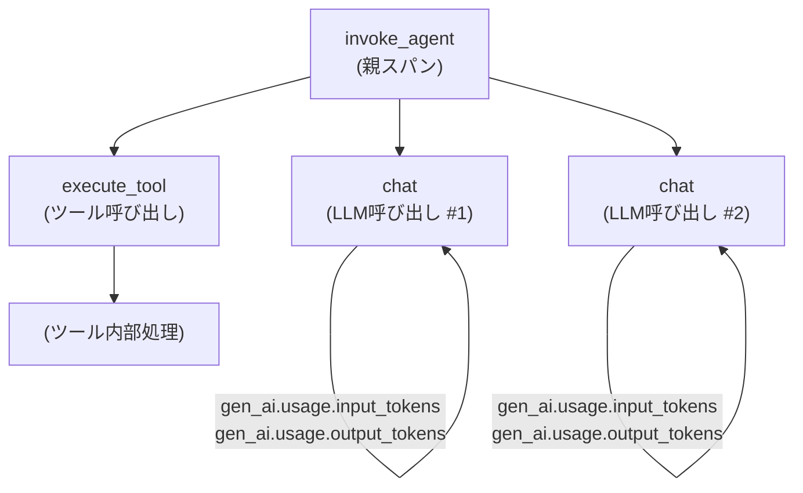
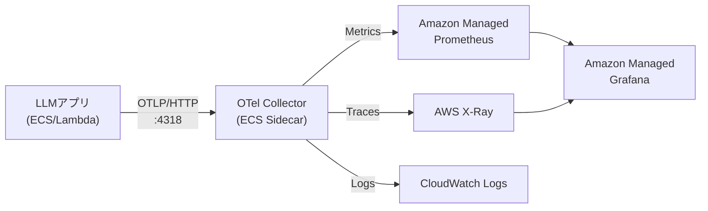

## ブログ概要

本記事は https://opentelemetry.io/blog/2026/genai-observability/ の解説記事です。

OpenTelemetry公式ブログに掲載された「Inside the LLM Call: GenAI Observability with OpenTelemetry」は、LLMアプリケーションの可観測性を標準化するためのGenAI Semantic Conventionsとその実装パターンを詳解した技術記事である。VS Code Copilot、OpenAI Codex、Claude Codeといった主要なAI開発ツールがOpenTelemetryのOTLPエクスポートに対応したことを受け、スパン階層・属性定義・メトリクス・プライバシー設計まで体系的に解説している。

この記事は [Zenn記事: 分散AIエージェントのSLO設計とメトリクス戦略：信頼性を定量化する](https://zenn.dev/0h_n0/articles/f66f067f80e840) の深掘り解説記事である。

## 情報源

- **種別**: 企業テックブログ／公式プロジェクトブログ
- **URL**: [opentelemetry.io/blog/2026/genai-observability/](https://opentelemetry.io/blog/2026/genai-observability/)
- **組織**: OpenTelemetry Project（Cloud Native Computing Foundation傘下）
- **発表年**: 2026年

## 技術的背景：GenAI可観測性が必要な理由

LLMアプリケーションのデバッグは従来のソフトウェアとは本質的に異なる。関数の戻り値は決定論的でなく、同一プロンプトでも実行ごとに異なる出力を生成する。エージェントが複数ツールを呼び出す複雑なワークフローでは、どのLLM呼び出しがレイテンシのボトルネックになっているか、どのツール呼び出しが失敗しているか、トークン消費がどの処理ステップに集中しているかが分からなければ、性能改善もコスト最適化もできない。

従来はプロバイダ固有のダッシュボード（OpenAI usage page等）か、自前のログ埋め込みで対応していた。しかしこれでは複数プロバイダを使うマルチモデル構成や、エージェントが再帰的にLLMを呼び出す構成では追跡が困難である。OpenTelemetry GenAI Semantic Conventionsはこの問題をベンダー中立な標準で解決しようとする試みである。

公式ブログによれば、GenAI Semantic Conventionsはモデルの種類を問わず同一のスキーマでトレース・メトリクス・イベントを記録できる設計になっており、バックエンドの可視化ツールも統一できる点が強調されている。

## 実装アーキテクチャ

### スパン階層設計（Span Hierarchy）

公式ブログが示すスパン階層は、エージェントワークフローの論理構造をそのままトレースに投影したものである。



- **`invoke_agent`**: エージェント全体の処理を囲む親スパン。ユーザーリクエストから最終応答までの総所要時間とトークン合計を記録する。
- **`chat`**: 個別のLLM API呼び出しを表すスパン。モデルID、入出力トークン数、フィニッシュ理由を属性として持つ。
- **`execute_tool`**: ツール呼び出しを表すスパン。ツール名、引数、戻り値を記録する（プライバシー設定でオプトイン）。

この3階層構造により、エージェントが「どのツールを何回呼んだか」「各LLM呼び出しにどれだけ時間がかかったか」「どのステップでトークンが多く消費されたか」を一つのトレースで把握できる。

### Semantic Convention属性（詳細）

公式ブログが定義するGenAI Semantic Conventionsの主要属性を以下に整理する。

| 属性名 | 型 | 説明 | デフォルト収集 |
|--------|-----|------|---------------|
| `gen_ai.request.model` | string | 要求したモデルID（例: `gpt-4o`） | ○ |
| `gen_ai.usage.input_tokens` | int | 入力トークン数 | ○ |
| `gen_ai.usage.output_tokens` | int | 出力トークン数 | ○ |
| `gen_ai.response.finish_reasons` | string[] | 停止理由（`stop`, `tool_calls`等） | ○ |
| `gen_ai.system_instructions` | string | システムプロンプト内容 | ✗（オプトイン） |
| `gen_ai.input.messages` | string | ユーザーメッセージ内容 | ✗（オプトイン） |
| `gen_ai.output.messages` | string | アシスタント応答内容 | ✗（オプトイン） |

ブログは「ツールスキーマ、ツール引数、ツール結果」も`captureContent`有効時に記録されることを明記している。デフォルトでコンテンツを収集しない設計は、機密データ（医療記録、個人情報、社内文書等）を含む可能性があるプロンプトを誤ってテレメトリに流出させないための意図的な選択である。

### メトリクス定義

公式ブログが定義する2つのコアメトリクスは以下の通りである。

| メトリクス名 | 種別 | 次元（ラベル） | 用途 |
|-------------|------|--------------|------|
| `gen_ai.client.operation.duration` | Histogram | model, operation, status | LLM呼び出しレイテンシの分布（p50/p95/p99）計測 |
| `gen_ai.client.token.usage` | Histogram | model, token_type（input/output） | トークン消費量の分布と集計 |

Histogramを使う理由は、平均値だけでは尾部レイテンシ（tail latency）が見えないためである。`gen_ai.client.operation.duration`のp99を監視することで、ユーザー体験を悪化させる外れ値を早期検出できる。

### 対応プラットフォームと設定

公式ブログは3つの主要AIコーディングツールの対応状況を記載している。

**VS Code Copilot**

3つの設定項目でOTLPエクスポートを有効化する。

| 設定キー | デフォルト | 説明 |
|---------|-----------|------|
| `github.copilot.chat.otel.enabled` | `false` | OTelテレメトリ送信の有効化 |
| `github.copilot.chat.otel.captureContent` | `false` | プロンプト・応答内容の収集 |
| `github.copilot.chat.otel.otlpEndpoint` | `http://localhost:4318` | OTLPエンドポイントURL |

**OpenAI Codex**

構造化ログとOTelメトリクスを出力する。

**Claude Code**

メトリクスとログをOTel経由で出力する。トレース機能はベータ版として提供されている。

## Pythonでの実装例：GenAI Semantic Conventionsを使ったエージェントトレーシング

### OTelセットアップとGenAI属性の付与

```python
"""
OpenTelemetry GenAI Semantic Conventionsを使ったエージェントトレーシングの実装例。
公式ブログ https://opentelemetry.io/blog/2026/genai-observability/ の
スパン階層設計に準拠したPython実装。
"""

from __future__ import annotations

import time
from typing import Any

from opentelemetry import trace, metrics
from opentelemetry.exporter.otlp.proto.http.trace_exporter import OTLPSpanExporter
from opentelemetry.exporter.otlp.proto.http.metric_exporter import OTLPMetricExporter
from opentelemetry.sdk.trace import TracerProvider
from opentelemetry.sdk.trace.export import BatchSpanProcessor
from opentelemetry.sdk.metrics import MeterProvider
from opentelemetry.sdk.metrics.export import PeriodicExportingMetricReader
from opentelemetry.sdk.resources import Resource


def setup_otel(
    service_name: str,
    otlp_endpoint: str = "http://localhost:4318",
) -> tuple[trace.Tracer, metrics.Meter]:
    """
    OTelトレーサーとメーターを初期化する。

    Args:
        service_name: サービス識別名（例: "my-agent-service"）
        otlp_endpoint: OTLPエンドポイントURL

    Returns:
        (tracer, meter) タプル
    """
    resource = Resource.create({"service.name": service_name})

    # トレースプロバイダの設定
    tracer_provider = TracerProvider(resource=resource)
    span_exporter = OTLPSpanExporter(
        endpoint=f"{otlp_endpoint}/v1/traces",
    )
    tracer_provider.add_span_processor(BatchSpanProcessor(span_exporter))
    trace.set_tracer_provider(tracer_provider)

    # メトリクスプロバイダの設定
    metric_exporter = OTLPMetricExporter(
        endpoint=f"{otlp_endpoint}/v1/metrics",
    )
    reader = PeriodicExportingMetricReader(metric_exporter, export_interval_millis=5000)
    meter_provider = MeterProvider(resource=resource, metric_readers=[reader])
    metrics.set_meter_provider(meter_provider)

    tracer = trace.get_tracer("gen-ai-agent", "1.0.0")
    meter = metrics.get_meter("gen-ai-agent", "1.0.0")
    return tracer, meter
```

### invoke_agent スパン：エージェントワークフロー全体の計測

```python
"""
GenAI Semantic Conventionsに準拠したスパン属性の設定例。
公式ブログが示す invoke_agent → chat → execute_tool 階層を実装する。
"""

from contextlib import contextmanager
from opentelemetry.trace import SpanKind


@contextmanager
def agent_span(
    tracer: trace.Tracer,
    agent_name: str,
    model_id: str,
):
    """
    エージェント全体を囲む invoke_agent スパンのコンテキストマネージャ。

    公式ブログのスパン階層設計に基づき、子スパン(chat/execute_tool)の
    親として機能する。

    Args:
        tracer: OTelトレーサー
        agent_name: エージェント名（スパン名に使用）
        model_id: 使用するモデルID（例: "gpt-4o", "claude-3-5-sonnet"）
    """
    with tracer.start_as_current_span(
        name=f"invoke_agent {agent_name}",
        kind=SpanKind.CLIENT,
    ) as span:
        # GenAI Semantic Conventions: モデルIDを属性として記録
        span.set_attribute("gen_ai.request.model", model_id)
        span.set_attribute("gen_ai.system", "openai")  # または "anthropic" 等
        try:
            yield span
        except Exception as e:
            span.record_exception(e)
            span.set_status(trace.StatusCode.ERROR, str(e))
            raise


@contextmanager
def chat_span(
    tracer: trace.Tracer,
    model_id: str,
    input_tokens: int | None = None,
    output_tokens: int | None = None,
    finish_reason: str | None = None,
):
    """
    個別のLLM API呼び出しを表す chat スパン。

    公式ブログが定義するGenAI属性（gen_ai.usage.input_tokens等）を
    レスポンス受信後にセットする設計。

    Args:
        tracer: OTelトレーサー
        model_id: 実際に使用されたモデルID（リクエスト時と異なる場合がある）
        input_tokens: 入力トークン数（レスポンスから取得後にセット）
        output_tokens: 出力トークン数
        finish_reason: 停止理由（"stop", "tool_calls", "length" 等）
    """
    with tracer.start_as_current_span(
        name="chat",
        kind=SpanKind.CLIENT,
    ) as span:
        span.set_attribute("gen_ai.request.model", model_id)
        yield span
        # レスポンス受信後に使用量を記録
        if input_tokens is not None:
            span.set_attribute("gen_ai.usage.input_tokens", input_tokens)
        if output_tokens is not None:
            span.set_attribute("gen_ai.usage.output_tokens", output_tokens)
        if finish_reason is not None:
            span.set_attribute("gen_ai.response.finish_reasons", [finish_reason])
```

### トークン使用量メトリクスの記録

```python
"""
gen_ai.client.token.usage と gen_ai.client.operation.duration を
GenAI Semantic Conventionsに準拠して記録するユーティリティ。
"""

import time
from opentelemetry import metrics


def create_genai_metrics(meter: metrics.Meter) -> dict[str, Any]:
    """
    公式ブログが定義する2つのコアGenAIメトリクスを作成する。

    Returns:
        {"operation_duration": Histogram, "token_usage": Histogram}
    """
    # LLM呼び出しレイテンシ（ミリ秒）のHistogram
    operation_duration = meter.create_histogram(
        name="gen_ai.client.operation.duration",
        description="Duration of GenAI client operation",
        unit="s",
    )

    # トークン消費量のHistogram（input/outputを次元として区別）
    token_usage = meter.create_histogram(
        name="gen_ai.client.token.usage",
        description="Measures number of input and output tokens used",
        unit="{token}",
    )

    return {
        "operation_duration": operation_duration,
        "token_usage": token_usage,
    }


def record_llm_call(
    genai_metrics: dict[str, Any],
    model_id: str,
    input_tokens: int,
    output_tokens: int,
    duration_seconds: float,
    operation: str = "chat",
    status: str = "ok",
) -> None:
    """
    LLM API呼び出しのメトリクスを記録する。

    Args:
        genai_metrics: create_genai_metrics()の戻り値
        model_id: モデルID（例: "gpt-4o"）
        input_tokens: 入力トークン数
        output_tokens: 出力トークン数
        duration_seconds: 呼び出し時間（秒）
        operation: 操作種別（通常は "chat"）
        status: ステータス（"ok" または "error"）
    """
    common_attrs = {
        "gen_ai.request.model": model_id,
        "gen_ai.operation.name": operation,
    }

    # 操作レイテンシを記録
    genai_metrics["operation_duration"].record(
        duration_seconds,
        attributes={**common_attrs, "error.type": None if status == "ok" else status},
    )

    # 入力トークンを記録（token_type次元で区別）
    genai_metrics["token_usage"].record(
        input_tokens,
        attributes={**common_attrs, "gen_ai.token.type": "input"},
    )

    # 出力トークンを記録
    genai_metrics["token_usage"].record(
        output_tokens,
        attributes={**common_attrs, "gen_ai.token.type": "output"},
    )
```

### エージェント実装の統合例

```python
"""
上記コンポーネントを統合した実際のエージェント実装例。
invoke_agent → chat → execute_tool の3階層トレースを実現する。
"""

import openai
import time
from typing import Any


class ObservableAgent:
    """
    OpenTelemetry GenAI Semantic Conventionsに準拠した可観測エージェント。

    公式ブログ (https://opentelemetry.io/blog/2026/genai-observability/) の
    スパン階層設計を実装している。
    """

    def __init__(
        self,
        model_id: str = "gpt-4o",
        otlp_endpoint: str = "http://localhost:4318",
    ) -> None:
        self.model_id = model_id
        self.client = openai.OpenAI()
        self.tracer, meter = setup_otel("observable-agent", otlp_endpoint)
        self.genai_metrics = create_genai_metrics(meter)

    def run(self, user_message: str) -> str:
        """
        エージェントを実行し、invoke_agent スパンで全体を計測する。

        Args:
            user_message: ユーザーからの入力テキスト

        Returns:
            エージェントの最終応答テキスト
        """
        with agent_span(self.tracer, "main-agent", self.model_id) as parent_span:
            messages = [{"role": "user", "content": user_message}]

            # 最大5ターンのエージェントループ
            for _ in range(5):
                response, duration = self._call_llm(messages)
                choice = response.choices[0]

                # finish_reason が "stop" なら終了
                if choice.finish_reason == "stop":
                    return choice.message.content

                # tool_calls の場合はツールを実行して会話を継続
                if choice.finish_reason == "tool_calls":
                    tool_results = self._execute_tools(choice.message.tool_calls)
                    messages.append(choice.message)
                    messages.extend(tool_results)

            return "最大ターン数に達しました"

    def _call_llm(
        self, messages: list[dict[str, Any]]
    ) -> tuple[Any, float]:
        """
        LLMを呼び出し、chat スパンでトークン使用量を記録する。

        Args:
            messages: 会話履歴

        Returns:
            (response, duration_seconds) タプル
        """
        start = time.monotonic()
        with chat_span(self.tracer, self.model_id) as span:
            response = self.client.chat.completions.create(
                model=self.model_id,
                messages=messages,
            )
            duration = time.monotonic() - start

            # レスポンスからトークン数を取得してスパン属性に設定
            usage = response.usage
            span.set_attribute("gen_ai.usage.input_tokens", usage.prompt_tokens)
            span.set_attribute("gen_ai.usage.output_tokens", usage.completion_tokens)
            span.set_attribute(
                "gen_ai.response.finish_reasons",
                [response.choices[0].finish_reason],
            )

        # メトリクスにも記録
        record_llm_call(
            self.genai_metrics,
            model_id=self.model_id,
            input_tokens=usage.prompt_tokens,
            output_tokens=usage.completion_tokens,
            duration_seconds=duration,
        )

        return response, duration

    def _execute_tools(self, tool_calls: list[Any]) -> list[dict[str, Any]]:
        """
        ツール呼び出しを実行し、execute_tool スパンで計測する。

        Args:
            tool_calls: LLMが要求したツール呼び出しのリスト

        Returns:
            ツール実行結果のメッセージリスト
        """
        results = []
        for tool_call in tool_calls:
            with self.tracer.start_as_current_span(
                name=f"execute_tool {tool_call.function.name}"
            ) as span:
                span.set_attribute("gen_ai.tool.name", tool_call.function.name)
                # ツール引数（captureContent有効時のみ記録を推奨）
                # span.set_attribute("gen_ai.tool.arguments", tool_call.function.arguments)

                result = self._dispatch_tool(
                    tool_call.function.name, tool_call.function.arguments
                )
                results.append({
                    "role": "tool",
                    "tool_call_id": tool_call.id,
                    "content": str(result),
                })
        return results

    def _dispatch_tool(self, name: str, arguments: str) -> Any:
        """ツール名に基づいて実際の処理を呼び出す（実装省略）。"""
        raise NotImplementedError(f"Tool {name} is not implemented")
```

## Production Deployment Guide

### Aspire Dashboardによるローカル開発環境

公式ブログが推奨するバックエンドは、.NET Aspire Dashboardの無料Dockerイメージである。以下のコマンドで即座に起動できる。

```bash
docker run --rm \
  -p 18888:18888 \
  -p 4317:18889 \
  -p 4318:18890 \
  -d \
  --name aspire-dashboard \
  -e ASPIRE_DASHBOARD_UNSECURED_ALLOW_ANONYMOUS=true \
  mcr.microsoft.com/dotnet/aspire-dashboard:latest
```

- **テレメトリ収集**: `http://localhost:4318`（OTLP/HTTP）
- **ダッシュボードUI**: `http://localhost:18888`

Aspire Dashboardはトレースビューア、メトリクスエクスプローラー、構造化ログページを統合した単一UIを提供する。加えてブログが紹介する「GenAI Telemetry Visualizer」は、会話フローをチャット形式でレンダリングする専用UIであり、JSONのパース作業なしにシステムプロンプト・ユーザーメッセージ・アシスタント応答・ツール引数と結果を確認できる。

### AWSでのプロダクション構成

Aspireはローカル開発向けであり、本番環境ではOTLPをサポートするコレクターと長期保存バックエンドが必要になる。AWSでの構成例を示す。



**OTel Collectorの設定（otel-collector-config.yaml）**

```yaml
# AWS環境向けOpenTelemetry Collector設定
# GenAI Semantic Conventionsのトレース・メトリクスを
# X-Ray / Amazon Managed Prometheusに転送する

receivers:
  otlp:
    protocols:
      http:
        endpoint: 0.0.0.0:4318
      grpc:
        endpoint: 0.0.0.0:4317

processors:
  batch:
    timeout: 10s
    send_batch_size: 1024

  # GenAI専用の属性フィルタリング
  # captureContent=false の環境ではコンテンツ属性を削除してPII漏洩を防止
  attributes/drop_content:
    actions:
      - key: gen_ai.system_instructions
        action: delete
      - key: gen_ai.input.messages
        action: delete
      - key: gen_ai.output.messages
        action: delete

  # カーディナリティ制御: モデルIDを正規化
  transform/normalize_model:
    trace_statements:
      - context: span
        statements:
          - replace_pattern(
              attributes["gen_ai.request.model"],
              "^gpt-4o-\\d{4}-\\d{2}-\\d{2}$",
              "gpt-4o"
            )

exporters:
  # AWS X-Ray へのトレース転送
  awsxray:
    region: ap-northeast-1
    indexed_attributes:
      - gen_ai.request.model
      - gen_ai.response.finish_reasons

  # Amazon Managed Prometheus へのメトリクス転送
  prometheusremotewrite:
    endpoint: https://aps-workspaces.ap-northeast-1.amazonaws.com/workspaces/ws-xxxxx/api/v1/remote_write
    auth:
      authenticator: sigv4auth

  awscloudwatchlogs:
    log_group_name: /otel/genai
    region: ap-northeast-1

extensions:
  sigv4auth:
    region: ap-northeast-1

service:
  extensions: [sigv4auth]
  pipelines:
    traces:
      receivers: [otlp]
      processors: [batch, attributes/drop_content, transform/normalize_model]
      exporters: [awsxray]
    metrics:
      receivers: [otlp]
      processors: [batch]
      exporters: [prometheusremotewrite]
    logs:
      receivers: [otlp]
      processors: [batch, attributes/drop_content]
      exporters: [awscloudwatchlogs]
```

**ECSサイドカーパターンによるデプロイ**

```json
{
  "family": "genai-agent-task",
  "containerDefinitions": [
    {
      "name": "agent",
      "image": "your-ecr-repo/genai-agent:latest",
      "environment": [
        {
          "name": "OTEL_EXPORTER_OTLP_ENDPOINT",
          "value": "http://localhost:4318"
        },
        {
          "name": "OTEL_SERVICE_NAME",
          "value": "genai-agent-prod"
        }
      ],
      "dependsOn": [
        {
          "containerName": "otel-collector",
          "condition": "HEALTHY"
        }
      ]
    },
    {
      "name": "otel-collector",
      "image": "public.ecr.aws/aws-observability/aws-otel-collector:latest",
      "command": [
        "--config=/etc/otel-config.yaml"
      ],
      "healthCheck": {
        "command": [
          "CMD",
          "/healthcheck"
        ],
        "interval": 5,
        "timeout": 3,
        "retries": 3
      }
    }
  ]
}
```

### Grafanaダッシュボードクエリ例

Amazon Managed Prometheusに転送されたGenAIメトリクスをGrafanaで可視化するPromQLクエリを示す。

```promql
# LLM呼び出しのp95レイテンシ（モデル別）
histogram_quantile(
  0.95,
  sum by (le, gen_ai_request_model) (
    rate(gen_ai_client_operation_duration_bucket[5m])
  )
)

# 1分あたりの入力トークン消費量（モデル別）
sum by (gen_ai_request_model) (
  rate(gen_ai_client_token_usage_sum{gen_ai_token_type="input"}[1m])
)

# エラー率（finish_reason="error" の割合）
sum(rate(gen_ai_client_operation_duration_count{error_type!=""}[5m]))
/
sum(rate(gen_ai_client_operation_duration_count[5m]))
```

### Lambda関数での実装パターン

AWS LambdaでLLMを呼び出す場合、コールドスタート時のOTel初期化コストとフラッシュタイミングに注意が必要である。

```python
"""
Lambda + OpenTelemetry GenAI の実装パターン。
Lambdaの実行モデルに合わせてトレースのフラッシュを確実に行う。
"""

import os
from functools import lru_cache
from opentelemetry.sdk.trace.export import SimpleSpanProcessor  # Lambda ではSimpleを推奨

@lru_cache(maxsize=1)
def get_tracer_and_metrics():
    """
    Lambdaのウォームスタート間でトレーサーを再利用する。
    lru_cacheにより初回実行時のみ初期化される。
    """
    # Lambda環境ではBatchSpanProcessorのフラッシュが保証されないため
    # SimpleSpanProcessorを使用するか、Lambda拡張機能を利用する
    return setup_otel(
        service_name=os.environ.get("OTEL_SERVICE_NAME", "genai-lambda"),
        otlp_endpoint=os.environ.get(
            "OTEL_EXPORTER_OTLP_ENDPOINT", "http://localhost:4318"
        ),
    )


def handler(event: dict, context: Any) -> dict:
    """Lambdaハンドラー。"""
    tracer, meter = get_tracer_and_metrics()
    genai_metrics = create_genai_metrics(meter)

    user_message = event.get("message", "")

    with agent_span(tracer, "lambda-agent", "gpt-4o") as span:
        # Lambda RequestIDをスパン属性に追加するとX-Rayとの相関が容易になる
        span.set_attribute("faas.invocation_id", context.aws_request_id)

        # LLM処理（省略）
        response_text = "処理結果"

        return {
            "statusCode": 200,
            "body": response_text,
            "trace_id": span.get_span_context().trace_id,
        }
```

## パフォーマンス最適化

### トークン追跡による不要なコスト検出

公式ブログが示す`gen_ai.client.token.usage`メトリクスは、トークン消費の分布を可視化するために設計されている。実運用での最適化観点を以下に整理する。

**不要なシステムプロンプトの膨張検出**

入力トークン数の急増はシステムプロンプトやコンテキストの肥大化を示すことが多い。`gen_ai_token_type="input"`のHistogram分布が右にシフトした場合、会話履歴の切り詰め戦略やプロンプト圧縮の検討タイミングである。

**モデル別コスト分析**

`gen_ai.request.model`次元を使ってモデル別のトークン消費を集計することで、コスト高のモデルを使っているリクエストパターンを特定できる。軽量なルーティングロジックでシンプルなクエリを安価なモデルに振り分けるFrugalGPT型の最適化に直結する情報である。

### レイテンシ分析：gen_ai.client.operation.duration

公式ブログが定義するHistogramのバケット設計は、LLM呼び出し特有のレイテンシ分布（数百ms〜数十秒の広いレンジ）をカバーするよう設計されている。

p50（中央値）とp99の差が大きい場合、ツール呼び出しの連鎖や長いコンテキストウィンドウに起因する外れ値が存在していることが多い。スパン階層を使って`invoke_agent`全体のp99と`chat`単体のp99を比較することで、オーバーヘッドの所在がエージェントループ制御にあるのかLLM呼び出し自体にあるのかを切り分けられる。

## 運用での学び

### プライバシー設計：デフォルト不収集の原則

公式ブログは明示的に「GenAIテレメトリではデフォルトでプロンプトコンテンツやツール引数を収集しない、なぜならこれらには機密データが含まれる可能性があるため」と述べている。

この設計は「プライバシー・バイ・デザイン」の原則に沿ったものである。実運用での推奨設定を以下に整理する。

| 環境 | captureContent | 理由 |
|------|---------------|------|
| 本番（医療・金融・個人情報を扱う） | `false`（デフォルト） | PII漏洩リスクの排除 |
| 本番（社内ツール・コード生成のみ） | 要件次第 | コンテンツ審査ポリシーを確認 |
| ステージング | `true`（限定的） | デバッグ目的、アクセス制御必須 |
| ローカル開発 | `true` | 開発効率のために有効化 |

テレメトリバックエンドへのアクセス制御も重要である。Aspire Dashboardはローカル専用（`ASPIRE_DASHBOARD_UNSECURED_ALLOW_ANONYMOUS=true`はローカルのみで使用すること）、本番ではIAMポリシーやネットワーク分離でOTLPエンドポイントを保護する。

### カーディナリティ管理

`gen_ai.request.model`属性は比較的カーディナリティが低い（モデルの種類は数十種類程度）が、モデルのバージョン管理が細かい場合（例: `gpt-4o-2024-11-20`, `gpt-4o-2024-08-06`など）はカーディナリティが増加する。OTel Collectorの`transform`プロセッサでバージョンを正規化することを推奨する（前掲のcollector設定参照）。

一方、プロンプトの内容そのものをメトリクスのラベルにすることは絶対に避けるべきである。無限カーディナリティを引き起こし、Prometheusやメトリクスバックエンドを機能不全にする。

### GenAI Visualizerによるデバッグ効率化

公式ブログが紹介するGenAI Telemetry Visualizerは、従来JSON形式でしか確認できなかった会話フロー（システムプロンプト、ユーザーメッセージ、ツール呼び出し、応答）をチャット形式のUIで表示する。これにより「特定のスパンIDに対応するLLM呼び出しがどういう会話コンテキストで発生したか」をトレースと照合しながら確認できる。

## 学術研究との関連

### OpenTelemetry GenAI SemConv v1.41との対応

公式ブログで紹介されているGenAI属性体系は、[OpenTelemetry Semantic Conventions for GenAI](https://opentelemetry.io/docs/specs/semconv/gen-ai/)として仕様化されており、2025〜2026年にかけて急速に安定化が進んでいる。

Zenn記事「分散AIエージェントのSLO設計とメトリクス戦略」で論じた`gen_ai.client.token.usage`と`gen_ai.client.operation.duration`は、このSemConv仕様の中心的なメトリクスであり、ブログの内容はSLO設計の実測データ収集基盤として直接活用できる。

### 分散トレーシング研究との接続

LLMエージェントの可観測性は、GoogleのDapper論文（2010年）に端を発する分散トレーシング研究の延長線上にある。しかしLLMエージェント特有の課題として以下がある。

- **非決定論的実行パス**: 同一入力でも実行するツールと回数が変わるため、従来の「期待されるスパン階層」と異なるトレースが生成される
- **トークン消費の分布的性質**: 実行時間がネットワークI/Oではなくトークン数に強く依存するため、レイテンシのモデルが異なる
- **セッション境界の曖昧さ**: 会話セッションをまたいだコンテキストウィンドウの再構成をどのスパンに帰属させるか

これらの課題に対し、OpenTelemetry GenAI SemConvの`invoke_agent` → `chat` → `execute_tool`階層は実用的な近似解を提供している。より精密なLLMエージェントの実行モデル分析については、LLMオーケストレーション框架の形式化研究（ReAct, Toolformer等）との接続が今後の研究課題となる。

### コスト・レイテンシのトレードオフ研究との関係

公式ブログが紹介するメトリクスは、FrugalGPT（Chen et al., 2023）が論じたLLMコスト最適化の実測基盤としても機能する。`gen_ai.client.token.usage`のHistogramから得られるクエリ別トークン分布データは、LLMカスケード選択アルゴリズムの入力特徴量として活用できる。

## まとめと実践への示唆

公式ブログ「Inside the LLM Call: GenAI Observability with OpenTelemetry」が示す最も重要なメッセージは、**LLMアプリケーションの可観測性を特定のプロバイダやツールに依存しない標準で実現できるようになった**という点である。

実践への示唆を3点に絞る。

**1. まずローカルでAspire Dashboardを起動する**

ブログが紹介する`docker run`コマンド一発でOTLPバックエンドが立ち上がり、VS Code CopilotやClaude Codeからのテレメトリを即座に可視化できる。開発環境での検証コストが極めて低い。

**2. プライバシーのデフォルト設定を本番に適用する**

`captureContent=false`（デフォルト）のままデプロイし、モデルID・トークン数・レイテンシのメタデータのみでSLO設計と異常検知を行う。プロンプト内容の収集は段階的に、アクセス制御とデータ保持ポリシーを整備してから追加する。

**3. スパン階層を既存のエージェントフレームワークに差し込む**

LangChain、LlamaIndex、Autogenといった既存フレームワークはすでにOTelコールバックやインテグレーションを提供しているものが多い。`invoke_agent`スパンをエントリポイントに追加するだけで、フレームワーク内部の`chat`・`execute_tool`スパンが自動的に子スパンとして記録されることが多い。

GenAI可観測性の標準化は、AIエージェントの信頼性工学を「アート」から「エンジニアリング」に変える基盤技術である。SLO設計、コスト最適化、デバッグ効率化のいずれも、まず計測できることから始まる。

## 参考文献

1. OpenTelemetry Project. "Inside the LLM Call: GenAI Observability with OpenTelemetry." OpenTelemetry Blog, 2026. https://opentelemetry.io/blog/2026/genai-observability/
2. OpenTelemetry. "Semantic Conventions for GenAI Systems." OpenTelemetry Specification. https://opentelemetry.io/docs/specs/semconv/gen-ai/
3. Chen, L., Zaharia, M., & Zou, J. "FrugalGPT: How to Use Large Language Models While Reducing Cost and Improving Performance." arXiv:2305.05176, 2023.
4. Sigelman, B. H., et al. "Dapper, a Large-Scale Distributed Systems Tracing Infrastructure." Google Technical Report, 2010.
5. Yao, S., et al. "ReAct: Synergizing Reasoning and Acting in Language Models." ICLR 2023. arXiv:2210.03629.
6. 0h-n0. "分散AIエージェントのSLO設計とメトリクス戦略：信頼性を定量化する." Zenn, 2026. https://zenn.dev/0h_n0/articles/f66f067f80e840
