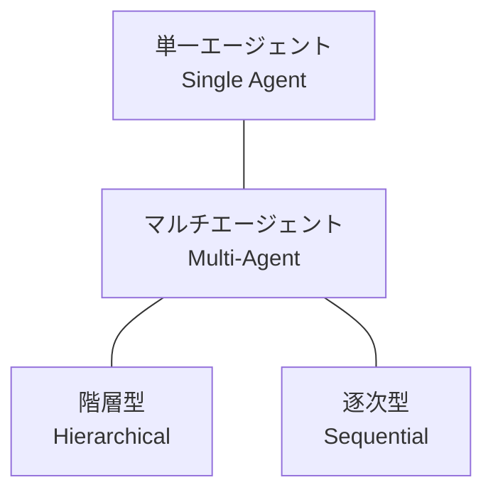
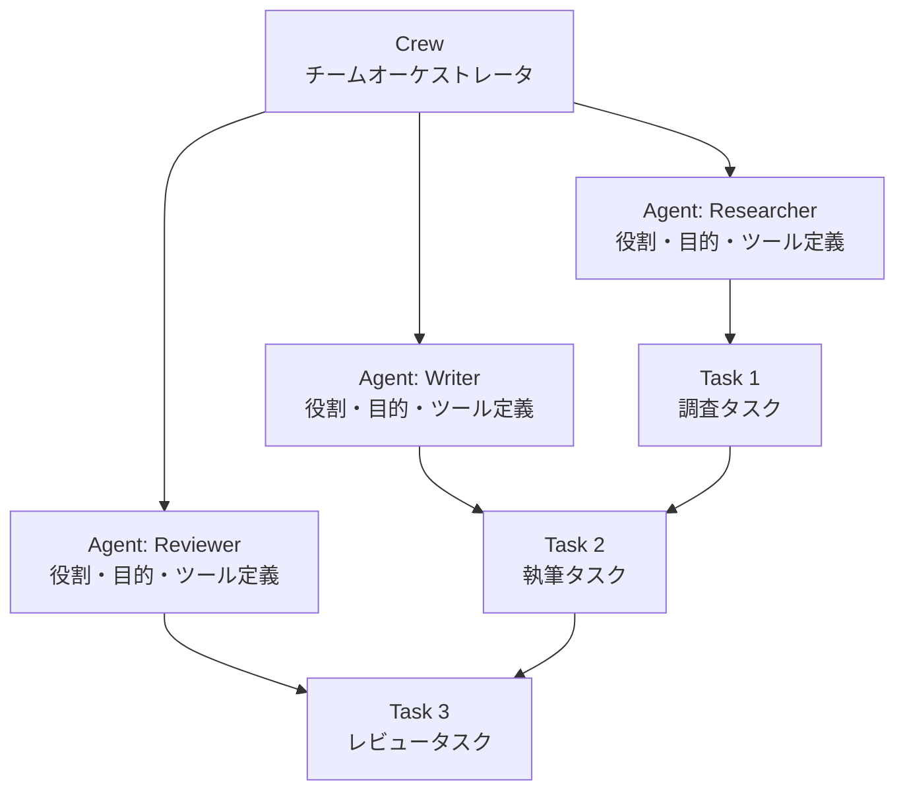
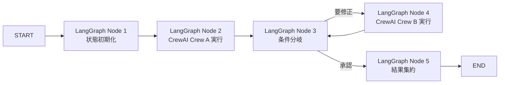
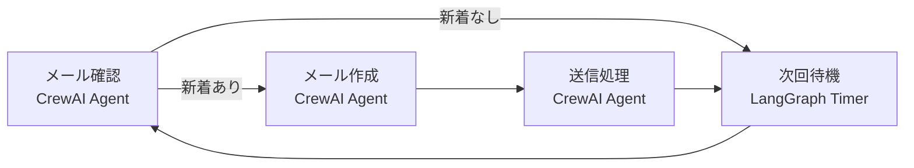

## 論文概要

本記事は https://arxiv.org/abs/2411.18241 の解説記事です。

本論文「Exploration of LLM Multi-Agent Application Implementation Based on LangGraph+CrewAI」は、Zhihua Duan、Jialin Wang（2024年11月27日公開、arXiv:2411.18241、カテゴリ: cs.MA, cs.AI）による研究論文である。著者らは、LLMを基盤とするマルチエージェントシステムの実装において、LangGraphのグラフベースアーキテクチャとCrewAIのロールベース協調機構を統合するアプローチを提案したと報告している。LangGraphによるプロセス制御の精密性と、CrewAIによるインテリジェントなタスク分配の組み合わせにより、複雑なマルチエージェントアプリケーションの構築が可能になると著者らは主張している。論文では、メール処理・コード生成・チケット処理の3つのケーススタディを通じてこの統合アプローチの有用性を定性的に示している。ただし、定量的な評価指標やベンチマーク比較は含まれていない点に留意が必要である。

この記事は [Zenn記事: A2Aプロトコルで異種フレームワークのエージェントを連携させる受発注自動化と障害分離設計](https://zenn.dev/0h_n0/articles/40993cd9ca8f6f) の深掘りです。

---

## 情報源

| 項目 | 内容 |
|---|---|
| 論文タイトル | Exploration of LLM Multi-Agent Application Implementation Based on LangGraph+CrewAI |
| 著者 | Zhihua Duan, Jialin Wang |
| arXiv ID | 2411.18241 |
| 公開日 | 2024年11月27日 |
| カテゴリ | cs.MA（マルチエージェントシステム）, cs.AI（人工知能） |
| URL | [https://arxiv.org/abs/2411.18241](https://arxiv.org/abs/2411.18241) |
| 関連Zenn記事 | [A2Aプロトコルで異種フレームワークのエージェントを連携させる受発注自動化と障害分離設計](https://zenn.dev/0h_n0/articles/40993cd9ca8f6f) |

---

## 背景と動機

大規模言語モデル（LLM）の急速な発展に伴い、単一のエージェントでは対処困難な複雑タスクを、複数エージェントの分業と協調によって解決するマルチエージェントシステムへの注目が高まっている。著者らは、既存のマルチエージェントフレームワークが個別には優れた機能を提供している一方で、ワークフロー制御の精密性とエージェント協調の柔軟性を同時に満たすことが困難であるという課題を指摘している。

具体的には、LangGraphはグラフベースのアーキテクチャにより状態遷移やループ処理を厳密に制御できるが、エージェント間の役割分担やタスク委譲の仕組みは開発者が自前で実装する必要がある。一方、CrewAIはロールベースのエージェント設計により直感的なチーム編成を可能にするが、ワークフロー全体の状態管理やフロー分岐の精密な制御には限界がある。著者らはこの相補的な特性に着目し、両フレームワークの統合によってそれぞれの弱点を補完するアプローチを探索したと述べている。

---

## 主要な貢献

著者らが本論文において報告している主要な貢献は以下の通りである。

1. **LangGraphによる精密なプロセス制御アーキテクチャの設計**: グラフ構造を用いて情報フローの効率化を図り、ループ・条件分岐・永続メモリを活用した制御フローを実現したと述べている。
2. **CrewAIによるロールベースエージェント協調の強化**: Agent・Task・Crew の階層的タスク構造を活用し、自動タスク委譲とインテリジェントなタスク分配による協調能力を実装したと報告している。
3. **統合アーキテクチャの提案**: LangGraphのノードとしてCrewAIのタスク実行を接続する統合ポイントを設計し、両フレームワークの強みを組み合わせたと述べている。
4. **3つのケーススタディによる有用性の実証**: メール処理・コード生成・チケット処理の実用的なシナリオを通じて、統合アプローチの適用可能性を定性的に示したと報告している。

---

## 技術的詳細

### LangGraph: グラフベースのワークフロー制御

LangGraphは、LangChainエコシステムの一部として開発されたエージェントオーケストレーションフレームワークである。2026年6月時点でv1.1系の安定版がリリースされており、分散ランタイムやディープエージェントテンプレートのサポートが追加されている。

コアとなる`StateGraph`クラスは、NetworkXに着想を得たインターフェースを提供し、状態オブジェクトをパラメータとして各ノード間で受け渡す仕組みを持つ。著者らが論文で述べている主要な特性は以下の通りである。

**制御フローパターン**:



- **単一エージェント**: 1つのエージェントが全タスクを処理する最もシンプルな構成
- **マルチエージェント**: 複数エージェントが並列または協調的にタスクを処理
- **階層型**: スーパーバイザーが下位エージェントに動的にタスクを委譲
- **逐次型**: エージェントが順番にタスクを処理し、結果を次のエージェントに渡す

**StateGraphの基本構造**:

```python
from typing import TypedDict
from langgraph.graph import StateGraph, START, END


class WorkflowState(TypedDict):
    """ワークフロー全体の状態を管理するスキーマ

    Attributes:
        messages: エージェント間のメッセージ履歴
        current_step: 現在の処理ステップ名
        metadata: ワークフローに関する追加情報
    """
    messages: list[str]
    current_step: str
    metadata: dict


def process_node(state: WorkflowState) -> dict:
    """ノードの処理関数

    Args:
        state: 現在のワークフロー状態

    Returns:
        更新する状態フィールドの辞書
    """
    return {"current_step": "processed"}


def route_decision(state: WorkflowState) -> str:
    """条件分岐のルーティング関数

    Args:
        state: 現在のワークフロー状態

    Returns:
        遷移先ノード名
    """
    if state["current_step"] == "needs_review":
        return "review_node"
    return "output_node"


# グラフの構築
builder = StateGraph(WorkflowState)
builder.add_node("process", process_node)
builder.add_node("review_node", lambda s: {"current_step": "reviewed"})
builder.add_node("output_node", lambda s: {"current_step": "done"})

# エッジの定義
builder.add_edge(START, "process")
builder.add_conditional_edges("process", route_decision)
builder.add_edge("review_node", "output_node")
builder.add_edge("output_node", END)

# コンパイルして実行可能なDAGを生成
graph = builder.compile()
```

上記の`compile()`メソッドは、グラフ構造の基本的な整合性チェック（全ノードの到達可能性、END への接続性など）を実行し、`invoke()`や`stream()`で実行可能なDAG（有向非巡回グラフ）を返す。ただし、LangGraphはDAGに限定されず、ループ構造もサポートしている点が従来のワークフローエンジンとの大きな違いである。

著者らは、このグラフベースのアプローチにより「プロセスと状態のきめ細かい制御」が可能になると述べている。特に、`InMemorySaver`のようなチェックポインターを用いた永続メモリにより、ワークフローの中断・再開がスレッドID単位で管理できる点を強調している。

### CrewAI: ロールベースのエージェント協調

CrewAIは、エージェント間の協調を人間のチーム構造になぞらえて設計するフレームワークである。2026年6月時点でv1.12がリリースされており、エージェントスキル機能、OpenAI互換プロバイダー（OpenRouter、DeepSeek、Ollama、vLLM等）のネイティブサポート、Qdrant Edgeメモリバックエンド、階層的メモリ分離が追加されている。

著者らが論文で述べているCrewAIの中核コンポーネントは以下の4つである。

**Agent・Task・Crew の階層構造**:



1. **Agent**: 特定の役割（role）、目的（goal）、背景（backstory）を持つ自律的なユニット。利用可能なツールも個別に指定する
2. **Task**: 実行すべき作業単位。説明（description）、担当エージェント、必要ツールを定義する
3. **Tool**: エージェントが利用できる外部機能（Web検索、ファイル操作、API呼び出しなど）
4. **Crew**: 複数のエージェントとタスクを束ねるオーケストレータ。実行プロセスを管理する

**CrewAI の実行パターン**:

```python
from crewai import Agent, Task, Crew, Process


# エージェントの定義
researcher = Agent(
    role="Senior Research Analyst",
    goal="Analyze and summarize technical papers accurately",
    backstory="Expert in ML/AI with 10 years of research experience",
    tools=[],  # 必要に応じてツールを追加
    verbose=True,
)

writer = Agent(
    role="Technical Writer",
    goal="Create clear, well-structured technical content",
    backstory="Experienced technical writer specializing in AI topics",
    tools=[],
    verbose=True,
)

# タスクの定義
research_task = Task(
    description="Analyze the given paper and extract key findings",
    expected_output="Structured summary with key contributions",
    agent=researcher,
)

writing_task = Task(
    description="Write a technical article based on the research analysis",
    expected_output="Complete article draft in Markdown format",
    agent=writer,
)

# Crew の構成と実行
crew = Crew(
    agents=[researcher, writer],
    tasks=[research_task, writing_task],
    process=Process.sequential,  # 逐次実行
    verbose=True,
)

result = crew.kickoff()
```

著者らは、CrewAIの`Process.sequential`（逐次実行）と`Process.hierarchical`（階層実行）の2つの実行パターンを取り上げている。逐次実行はresearch→write→reviewのような線形ワークフローに適しており、階層実行ではマネージャーエージェントがスペシャリストに動的にタスクを委譲するため、柔軟な問題解決に適していると述べている。

### 統合アーキテクチャ: LangGraph + CrewAI

論文の核心は、LangGraphのワークフロー制御能力とCrewAIのエージェント協調能力を1つのシステムに統合する設計パターンである。著者らが提案する統合アーキテクチャの構造は以下の通りである。

**統合アーキテクチャ概念図**:



**統合のポイント**:

- **LangGraphノードがワークフロー状態と遷移を定義**: 各ノードは`TypedDict`ベースの状態スキーマを受け取り、処理結果として状態の更新内容を返す
- **CrewAIエージェントが定義された役割と能力で実体化**: 各ノード内でCrewAIのCrew が`kickoff()`により実行され、その結果がLangGraphの状態に反映される
- **タスクが実行エージェントと必要ツールを指定**: CrewAIのTaskレベルでエージェントの割り当てとツール設定が行われる
- **統合ポイントがグラフノードをCrewAIタスク実行に接続**: ノード関数内でCrewAIを呼び出し、結果を状態更新として返すことで両フレームワークを橋渡しする

**統合実装パターン**:

```python
from typing import TypedDict
from langgraph.graph import StateGraph, START, END
from langgraph.checkpoint.memory import MemorySaver
from crewai import Agent, Task, Crew, Process


class IntegratedState(TypedDict):
    """LangGraph + CrewAI 統合ワークフローの状態

    Attributes:
        user_input: ユーザーからの入力テキスト
        research_result: 調査結果
        draft_content: 生成されたドラフト
        review_status: レビュー結果（approved / needs_revision）
        iteration_count: 修正イテレーション回数
    """
    user_input: str
    research_result: str
    draft_content: str
    review_status: str
    iteration_count: int


def research_node(state: IntegratedState) -> dict:
    """CrewAI Crew を使用して調査を実行するノード

    Args:
        state: 現在のワークフロー状態

    Returns:
        research_result を含む状態更新辞書
    """
    researcher = Agent(
        role="Research Analyst",
        goal=f"Research the topic: {state['user_input']}",
        backstory="Expert researcher with deep domain knowledge",
    )
    research_task = Task(
        description=f"Conduct thorough research on: {state['user_input']}",
        expected_output="Comprehensive research summary",
        agent=researcher,
    )
    crew = Crew(
        agents=[researcher],
        tasks=[research_task],
        process=Process.sequential,
    )
    result = crew.kickoff()
    return {"research_result": str(result), "review_status": "pending"}


def writing_node(state: IntegratedState) -> dict:
    """CrewAI Crew を使用して記事を執筆するノード

    Args:
        state: 現在のワークフロー状態

    Returns:
        draft_content を含む状態更新辞書
    """
    writer = Agent(
        role="Technical Writer",
        goal="Write a clear and accurate article",
        backstory="Experienced technical content creator",
    )
    writing_task = Task(
        description=f"Write an article based on: {state['research_result']}",
        expected_output="Complete article draft",
        agent=writer,
    )
    crew = Crew(
        agents=[writer],
        tasks=[writing_task],
        process=Process.sequential,
    )
    result = crew.kickoff()
    return {"draft_content": str(result)}


def review_node(state: IntegratedState) -> dict:
    """CrewAI Crew を使用してレビューを実行するノード

    Args:
        state: 現在のワークフロー状態

    Returns:
        review_status と iteration_count を含む状態更新辞書
    """
    reviewer = Agent(
        role="Quality Reviewer",
        goal="Review content for accuracy and completeness",
        backstory="Senior editor with expertise in technical content",
    )
    review_task = Task(
        description=f"Review this draft: {state['draft_content']}",
        expected_output="Review decision: approved or needs_revision",
        agent=reviewer,
    )
    crew = Crew(
        agents=[reviewer],
        tasks=[review_task],
        process=Process.sequential,
    )
    result = crew.kickoff()
    status = "approved" if "approved" in str(result).lower() else "needs_revision"
    return {
        "review_status": status,
        "iteration_count": state["iteration_count"] + 1,
    }


def route_after_review(state: IntegratedState) -> str:
    """レビュー結果に基づくルーティング

    Args:
        state: 現在のワークフロー状態

    Returns:
        遷移先ノード名
    """
    if state["review_status"] == "approved":
        return "end"
    if state["iteration_count"] >= 3:
        return "end"  # 最大イテレーション数に到達
    return "writing"


# 統合グラフの構築
builder = StateGraph(IntegratedState)
builder.add_node("research", research_node)
builder.add_node("writing", writing_node)
builder.add_node("review", review_node)

builder.add_edge(START, "research")
builder.add_edge("research", "writing")
builder.add_edge("writing", "review")
builder.add_conditional_edges(
    "review",
    route_after_review,
    {"writing": "writing", "end": END},
)

checkpointer = MemorySaver()
graph = builder.compile(checkpointer=checkpointer)
```

この実装パターンでは、LangGraphが状態遷移のフロー制御（逐次処理、条件分岐、ループ）を担い、各ノード内部でCrewAIが専門エージェントによるタスク実行を担当する。`MemorySaver`によるチェックポイントにより、ワークフローの中断・再開も可能である。

### ケーススタディ

著者らは3つのケーススタディを通じて統合アプローチの適用可能性を示している。

#### ケーススタディ1: メール処理

LangGraphが「新着メール確認→メール作成→送信待機→次回実行待ち」というプロセス状態を定義し、各状態でCrewAIエージェントが実行される構成である。



著者らは、LangGraphのループ制御により定期的なメール確認サイクルを実現し、CrewAIの各エージェントが「メール内容の分析」「返信文の生成」「送信処理」をそれぞれ担当すると述べている。CrewAI公式サイトのメール自動作成・送信サンプルをベースにLangGraphで包んだ構成であると報告している。

#### ケーススタディ2: コード生成

コード生成エージェントとコードレビューエージェントの間でリアルタイムに状態データを共有し、フィードバックループを形成する構成である。

著者らは、生成されたコードをレビューエージェントが検証し、問題があれば生成エージェントに差し戻すというイテレーティブな改善プロセスを、LangGraphの条件付きエッジで制御していると述べている。LangGraphの状態管理により、各イテレーションでの変更履歴が保持される点を利点として挙げている。

#### ケーススタディ3: チケット処理

複数のCrewAIエージェントがカスタマーサポートチケットの内容を分析し、適切な担当者への振り分けを行う構成である。著者らは、チケットのテキスト情報を深層分析するためにインテリジェントなエージェントを活用し、処理効率の向上を図ったと述べている。

---

## 実装のポイント

本論文の統合パターンを実際に実装する際に留意すべき点を以下にまとめる。

**状態管理の設計**:
- LangGraphの`TypedDict`ベースの状態スキーマは、CrewAIの実行結果を含む全ての中間データを保持できるよう設計する必要がある
- CrewAIの`kickoff()`の戻り値は文字列に変換してLangGraphの状態に格納するのが一般的なパターンである
- 状態が大きくなるとチェックポイントのシリアライゼーションコストが増大するため、要約やトリミングの仕組みを検討すべきである

**エラーハンドリング**:
- CrewAIのエージェント実行がLLM API呼び出しを内包するため、タイムアウト・レート制限・APIエラーへの対処が必須である
- LangGraphのノード関数内でtry/exceptによるリトライロジック（指数バックオフ＋ジッタ）を実装すること
- 最大イテレーション回数の上限設定により無限ループを防止する

**コスト制御**:
- 各ノードでCrewAIのCrewを`kickoff()`するたびにLLM API呼び出しが発生するため、ノード数とイテレーション回数がコストに直結する
- `verbose=False`に設定することで不要なログ出力を抑制し、デバッグ時のみ`True`に切り替える運用が推奨される

**フレームワーク選択の判断基準**:
- ワークフローの制御精度が重要な場合（監査要件、コンプライアンス）にはLangGraphの比重を高める
- プロトタイピング速度を優先する場合にはCrewAI単体で十分な場合も多い
- 両フレームワークの統合は、制御精度と協調柔軟性の両方が求められる場面で真価を発揮する

---

## Production Deployment Guide

本論文の統合アーキテクチャをAWS上で本番運用する際の構成ガイドを以下に示す。マルチエージェントシステムは複数のLLM API呼び出しを含むため、コスト管理と監視が特に重要である。なお、以下のコスト試算は2026年6月時点のAWS ap-northeast-1（東京）リージョンの概算値であり、実際のコストはトラフィックパターン、リージョン、バースト使用量により変動する。最新料金はAWS料金計算ツールで確認することを推奨する。

### AWS実装パターン（コスト最適化重視）

| 構成 | トラフィック | 主要サービス | 月額目安 |
|------|------------|-------------|---------|
| **Small** | ~100 req/日 | Lambda + Bedrock + DynamoDB | $50-150 |
| **Medium** | ~1,000 req/日 | ECS Fargate + Bedrock + ElastiCache | $300-800 |
| **Large** | 10,000+ req/日 | EKS + Spot Instances + Bedrock | $2,000-5,000 |

**Small構成（Serverless）の詳細**:
- **Lambda**: 256MB RAM, 5分タイムアウト, ARM64（Graviton2で約20%コスト削減）
- **Bedrock**: Claude / Titan モデル, Batch API で 50% 削減
- **DynamoDB**: On-Demand モード, ワークフロー状態の永続化
- **Step Functions**: LangGraph のグラフ制御を Step Functions Express Workflow にマッピング
- 月額内訳目安: Lambda $5 + Bedrock $30-120 + DynamoDB $5 + Step Functions $5-10

**Large構成（Container）の詳細**:
- **EKS**: コントロールプレーン $73/月 + Karpenter による Spot 優先ノード管理
- **EC2 Spot**: m6i.xlarge (4vCPU, 16GB) で最大90%削減、On-Demand比
- **ElastiCache Redis**: チェックポイント・セッション状態の高速永続化
- **Bedrock**: Prompt Caching 有効化で 30-90% 削減

**コスト削減テクニック**:
- Spot Instances 活用で EC2 コスト最大90%削減
- Reserved Instances 1年コミットで最大72%削減
- Bedrock Batch API 使用で推論コスト50%削減
- Prompt Caching 有効化で同一プロンプトパターンの繰り返し呼び出しコスト30-90%削減

### Terraformインフラコード

**Small構成（Serverless）**:

```hcl
# LangGraph+CrewAI マルチエージェント Serverless 構成
# 2026-06 時点の設定値

terraform {
  required_version = ">= 1.9"
  required_providers {
    aws = {
      source  = "hashicorp/aws"
      version = "~> 5.80"
    }
  }
}

provider "aws" {
  region = "ap-northeast-1"
}

# --- IAM: 最小権限 ---
resource "aws_iam_role" "agent_lambda_role" {
  name = "multi-agent-lambda-role"
  assume_role_policy = jsonencode({
    Version = "2012-10-17"
    Statement = [{
      Action = "sts:AssumeRole"
      Effect = "Allow"
      Principal = { Service = "lambda.amazonaws.com" }
    }]
  })
}

resource "aws_iam_role_policy" "agent_lambda_policy" {
  name = "multi-agent-lambda-policy"
  role = aws_iam_role.agent_lambda_role.id
  policy = jsonencode({
    Version = "2012-10-17"
    Statement = [
      {
        Effect   = "Allow"
        Action   = ["bedrock:InvokeModel", "bedrock:InvokeModelWithResponseStream"]
        Resource = "arn:aws:bedrock:ap-northeast-1::foundation-model/*"
      },
      {
        Effect   = "Allow"
        Action   = ["dynamodb:GetItem", "dynamodb:PutItem", "dynamodb:UpdateItem", "dynamodb:Query"]
        Resource = aws_dynamodb_table.workflow_state.arn
      },
      {
        Effect   = "Allow"
        Action   = ["logs:CreateLogGroup", "logs:CreateLogStream", "logs:PutLogEvents"]
        Resource = "arn:aws:logs:ap-northeast-1:*:*"
      }
    ]
  })
}

# --- Lambda: エージェント実行 ---
resource "aws_lambda_function" "agent_executor" {
  function_name = "multi-agent-executor"
  runtime       = "python3.12"
  handler       = "handler.lambda_handler"
  role          = aws_iam_role.agent_lambda_role.arn
  timeout       = 300  # 5分: CrewAI実行に十分な時間
  memory_size   = 256  # コスト最適化: 最小限のメモリ
  architectures = ["arm64"]  # Graviton2 で ~20% コスト削減
  filename      = "lambda_package.zip"

  environment {
    variables = {
      WORKFLOW_TABLE = aws_dynamodb_table.workflow_state.name
      MODEL_ID       = "anthropic.claude-sonnet-4-20250514"
    }
  }
}

# --- DynamoDB: ワークフロー状態永続化 ---
resource "aws_dynamodb_table" "workflow_state" {
  name         = "multi-agent-workflow-state"
  billing_mode = "PAY_PER_REQUEST"  # On-Demand: 低トラフィックに最適
  hash_key     = "thread_id"
  range_key    = "checkpoint_id"

  attribute {
    name = "thread_id"
    type = "S"
  }
  attribute {
    name = "checkpoint_id"
    type = "S"
  }

  # KMS暗号化
  server_side_encryption {
    enabled = true
  }

  # 30日後に古い状態を自動削除
  ttl {
    attribute_name = "ttl"
    enabled        = true
  }
}

# --- CloudWatch: コスト監視アラーム ---
resource "aws_cloudwatch_metric_alarm" "bedrock_cost_alarm" {
  alarm_name          = "bedrock-token-usage-spike"
  comparison_operator = "GreaterThanThreshold"
  evaluation_periods  = 1
  metric_name         = "InputTokenCount"
  namespace           = "AWS/Bedrock"
  period              = 3600  # 1時間
  statistic           = "Sum"
  threshold           = 100000  # 1時間あたり10万トークン超過でアラート
  alarm_actions       = []     # SNS ARN を設定
}
```

**Large構成（Container）**:

```hcl
# EKS + Karpenter + Spot 構成
module "eks" {
  source          = "terraform-aws-modules/eks/aws"
  version         = "~> 20.31"
  cluster_name    = "multi-agent-cluster"
  cluster_version = "1.31"

  vpc_id     = module.vpc.vpc_id
  subnet_ids = module.vpc.private_subnets

  # Karpenter 用 IRSA
  enable_cluster_creator_admin_permissions = true
}

# Karpenter: Spot優先の自動スケーリング
resource "kubectl_manifest" "karpenter_nodepool" {
  yaml_body = yamlencode({
    apiVersion = "karpenter.sh/v1"
    kind       = "NodePool"
    metadata   = { name = "agent-workers" }
    spec = {
      template = {
        spec = {
          requirements = [
            { key = "karpenter.sh/capacity-type", operator = "In", values = ["spot", "on-demand"] },
            { key = "node.kubernetes.io/instance-type", operator = "In", values = ["m6i.xlarge", "m6i.2xlarge", "m7i.xlarge"] },
          ]
        }
      }
      limits   = { cpu = "64", memory = "256Gi" }
      disruption = {
        consolidationPolicy = "WhenEmptyOrUnderutilized"
        consolidateAfter    = "30s"
      }
    }
  })
}

# AWS Budgets: 月額予算アラート
resource "aws_budgets_budget" "monthly_agent_budget" {
  name         = "multi-agent-monthly-budget"
  budget_type  = "COST"
  limit_amount = "3000"
  limit_unit   = "USD"
  time_unit    = "MONTHLY"

  notification {
    comparison_operator       = "GREATER_THAN"
    threshold                 = 80  # 80%到達で通知
    threshold_type            = "PERCENTAGE"
    notification_type         = "ACTUAL"
    subscriber_email_addresses = ["ops-team@example.com"]
  }
}
```

### 運用・監視設定

**CloudWatch Logs Insights クエリ**:

```
# コスト異常検知: 1時間あたりのBedrock トークン使用量
fields @timestamp, @message
| filter @message like /token/
| stats sum(input_tokens) as total_input, sum(output_tokens) as total_output by bin(1h)
| sort @timestamp desc

# レイテンシ分析: P95, P99
fields @timestamp, duration_ms
| stats percentile(duration_ms, 95) as p95, percentile(duration_ms, 99) as p99 by bin(5m)
| sort @timestamp desc
```

**X-Ray トレーシング設定**:

```python
import boto3
from aws_xray_sdk.core import xray_recorder, patch_all

# boto3 の自動計装
patch_all()


@xray_recorder.capture("agent_execution")
def execute_crew_task(task_name: str, input_data: dict) -> str:
    """CrewAI タスク実行をX-Rayでトレース

    Args:
        task_name: 実行するタスクの名称
        input_data: タスクへの入力データ

    Returns:
        タスク実行結果の文字列
    """
    subsegment = xray_recorder.current_subsegment()
    subsegment.put_annotation("task_name", task_name)
    subsegment.put_metadata("input_size", len(str(input_data)))

    # CrewAI タスク実行
    result = run_crew(task_name, input_data)

    subsegment.put_metadata("output_size", len(str(result)))
    return result
```

**Cost Explorer 自動レポート**:

```python
import boto3
from datetime import datetime, timedelta


def get_daily_agent_cost() -> dict:
    """日次のマルチエージェント関連AWSコストを取得

    Returns:
        サービス別コスト辞書
    """
    ce = boto3.client("ce")
    end = datetime.now().strftime("%Y-%m-%d")
    start = (datetime.now() - timedelta(days=1)).strftime("%Y-%m-%d")

    response = ce.get_cost_and_usage(
        TimePeriod={"Start": start, "End": end},
        Granularity="DAILY",
        Metrics=["UnblendedCost"],
        Filter={
            "Or": [
                {"Dimensions": {"Key": "SERVICE", "Values": ["Amazon Bedrock"]}},
                {"Dimensions": {"Key": "SERVICE", "Values": ["AWS Lambda"]}},
                {"Dimensions": {"Key": "SERVICE", "Values": ["Amazon Elastic Kubernetes Service"]}},
            ]
        },
        GroupBy=[{"Type": "DIMENSION", "Key": "SERVICE"}],
    )

    costs = {}
    for group in response["ResultsByTime"][0]["Groups"]:
        service = group["Keys"][0]
        amount = float(group["Metrics"]["UnblendedCost"]["Amount"])
        costs[service] = amount

    total = sum(costs.values())
    if total > 100:  # $100/日 超過で通知
        notify_cost_alert(costs, total)

    return costs
```

### コスト最適化チェックリスト

**アーキテクチャ選択**:
- [ ] トラフィック100 req/日以下 → Serverless（Lambda + Step Functions）
- [ ] トラフィック1,000 req/日前後 → Hybrid（ECS Fargate + Bedrock）
- [ ] トラフィック10,000+ req/日 → Container（EKS + Spot）

**リソース最適化**:
- [ ] EC2: Spot Instances を優先し On-Demand をフォールバックに設定
- [ ] Reserved Instances: 1年コミットで安定ワークロードのコスト削減
- [ ] Savings Plans: Compute Savings Plans の検討
- [ ] Lambda: メモリサイズを power-tuning で最適化
- [ ] ECS/EKS: アイドル時間帯のスケールダウン設定
- [ ] Graviton2 (ARM64) アーキテクチャで ~20% コスト削減

**LLMコスト削減**:
- [ ] Bedrock Batch API で非同期処理可能なタスクは 50% 削減
- [ ] Prompt Caching 有効化で繰り返しパターン 30-90% 削減
- [ ] モデル選択ロジック: 簡易タスクは軽量モデル、複雑タスクは高性能モデル
- [ ] 入出力トークン数の上限設定で暴走コスト防止
- [ ] CrewAI の verbose=False でデバッグ時以外のログ抑制

**監視・アラート**:
- [ ] AWS Budgets: 月額予算のアラート設定（80%, 100%）
- [ ] CloudWatch アラーム: Bedrock トークン使用量スパイク検知
- [ ] Cost Anomaly Detection: 自動異常検知の有効化
- [ ] 日次コストレポート: SNS/Slack 通知の設定
- [ ] X-Ray: エージェント実行のレイテンシ分散追跡

**リソース管理**:
- [ ] 未使用の Lambda 関数・ECS タスク定義の削除
- [ ] タグ戦略: Environment / Service / CostCenter タグの統一
- [ ] DynamoDB TTL: 古いワークフロー状態の自動削除
- [ ] 開発環境: 夜間・休日の自動停止スケジュール設定
- [ ] CloudTrail / Config: 監査ログの有効化

---

## 実運用への応用

本論文の統合アプローチは、関連Zenn記事で解説されているA2Aプロトコルベースのマルチエージェントシステムと密接に関連している。Zenn記事ではLangGraph製の受注エージェント、CrewAI製の在庫エージェント・配送エージェントをA2Aプロトコルで接続する受発注自動化システムが紹介されている。本論文の統合パターンは、このようなA2Aベースの設計において各サービス内部のワークフロー制御とエージェント協調に適用できる。

**プロダクション適用時の考慮事項**:

- **スケーリング**: マルチエージェントシステムはLLM API呼び出し数がエージェント数×イテレーション数に比例するため、バッチ処理やキュー（SQS/EventBridge）によるスロットリングが必要である
- **レイテンシ**: 逐次実行の場合、エージェント数×平均応答時間がEnd-to-Endレイテンシとなる。並列実行可能なタスクの識別と、LangGraphの並列ノード実行による短縮が有効である
- **可観測性**: LangSmithとの統合によりエージェント間のトランザクション追跡と監査が可能となる。プロダクション環境ではOpenTelemetryベースの計装を推奨する
- **障害分離**: A2Aプロトコルの障害分離設計と組み合わせることで、個々のCrewAI Crewの障害がワークフロー全体に波及することを防止できる

---

## 関連研究

- **AutoGen（Microsoft）**: マルチエージェント会話フレームワーク。エージェント間の自然言語による協調を重視しており、LangGraphのような明示的なグラフ制御とは対照的なアプローチをとる。2026年時点ではAG2としてリブランディングされている
- **Swarm（OpenAI）**: 軽量なマルチエージェントオーケストレーションフレームワーク。ハンドオフ機構によるエージェント間の制御移譲を特徴とする。本論文のLangGraph+CrewAI統合に対し、より簡潔な設計思想を持つ
- **LangGraph Supervisor Pattern**: LangGraph単体でもスーパーバイザーエージェントパターンによりマルチエージェント協調が実現可能であり、CrewAIとの統合は必須ではない。ただし、ロールベースの直感的なエージェント定義はCrewAIの強みである

---

## まとめと今後の展望

本論文は、LangGraphのグラフベースワークフロー制御とCrewAIのロールベースエージェント協調を統合するアプローチを提案し、3つのケーススタディを通じてその適用可能性を定性的に示した。両フレームワークの相補的な特性を活かすことで、精密な状態管理と柔軟なエージェント協調を両立するマルチエージェントシステムの構築が可能であると著者らは主張している。

ただし、本論文には定量的な評価が含まれておらず、「効率改善」は定性的な報告にとどまっている点は限界として指摘すべきである。レイテンシ・スループット・タスク成功率などの定量指標による比較評価、および統合のオーバーヘッド（CrewAI単体やLangGraph単体との比較）に関する実証的な検証は、今後の研究課題として残されている。

2026年の実務においては、マルチエージェントフレームワークの選定はユースケースの複雑さと制御要件に依存する。本論文の統合パターンは、「ワークフローの監査可能性」と「エージェントの協調柔軟性」の両方が求められる本番環境に適していると考えられる。

---

## 参考文献

- **arXiv**: [https://arxiv.org/abs/2411.18241](https://arxiv.org/abs/2411.18241)
- **LangGraph Documentation**: [https://docs.langchain.com/oss/python/langgraph/graph-api](https://docs.langchain.com/oss/python/langgraph/graph-api)
- **CrewAI Documentation**: [https://docs.crewai.com/en/concepts/agents](https://docs.crewai.com/en/concepts/agents)
- **Related Zenn article**: [https://zenn.dev/0h_n0/articles/40993cd9ca8f6f](https://zenn.dev/0h_n0/articles/40993cd9ca8f6f)
