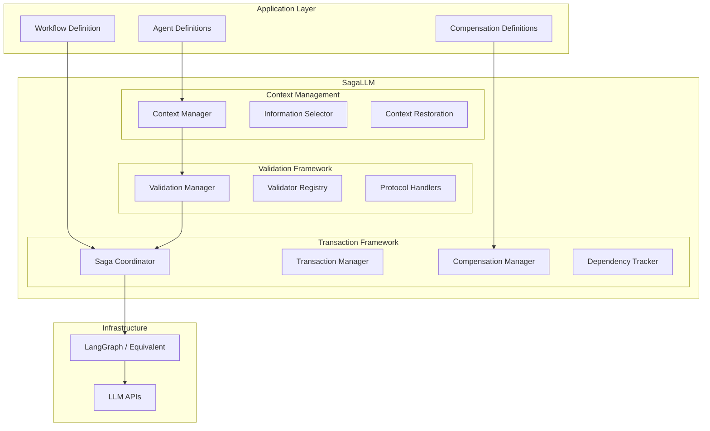

本記事は [arXiv:2503.11951](https://arxiv.org/abs/2503.11951) の解説記事です。

## 論文概要（Abstract）

Chang and Geng（2025）は、LLMベースのマルチエージェント計画システムが抱える4つの根本的限界 -- 信頼性の低い自己検証、コンテキスト喪失、トランザクション保証の欠如、エージェント間協調不足 -- に対処する構造化マルチエージェントアーキテクチャ「SagaLLM」を提案している。SagaLLMはデータベース分野の古典的Sagaトランザクションパターンを、永続メモリ・自動補償・独立検証エージェントと統合することで、分散ワークフロー全体の一貫性とロールバックを実現する。REALM-Benchの計画タスクを用いた評価では、スタンドアロンLLM（Claude 3.7, GPT-4o, GPT-o1, DeepSeek R1）が制約違反や障害回復に頻繁に失敗する一方、SagaLLMが一貫性・検証精度・適応的協調で改善を達成したと著者らは報告している。

この記事は [Zenn記事: A2Aプロトコルで異種フレームワークのエージェントを連携させる受発注自動化と障害分離設計](https://zenn.dev/0h_n0/articles/40993cd9ca8f6f) の深掘りです。

## 情報源

- **arXiv ID**: 2503.11951
- **URL**: [https://arxiv.org/abs/2503.11951](https://arxiv.org/abs/2503.11951)
- **著者**: Edward Y. Chang, Longling Geng（Stanford University）
- **発表年**: 2025（VLDB 2025採録、Proceedings of the VLDB Endowment, Vol. 18, No. 12）
- **分野**: cs.AI
- **コード**: [https://github.com/genglongling/SagaLLM](https://github.com/genglongling/SagaLLM)

## 背景と動機（Background & Motivation）

LLMベースのマルチエージェントシステム（MAS）は、AutoGen、CrewAI、LangGraphなどのフレームワークにより実用化が進んでいる。Zenn記事で取り上げたA2Aプロトコルも、異種フレームワーク間のエージェント連携を実現する仕組みである。しかし著者らは、現行のLLMベースMASに以下の4つの構造的限界が存在すると指摘している。

**限界1: 信頼性の低い自己検証**。LLMはGodelの不完全性定理（Godel, 1967）に通じる本質的制約を持ち、自己改善（self-refinement）技術を適用しても、固有の能力上限を超えて深い論理エラーを修正することは困難であると著者らは論じている。

**限界2: コンテキスト喪失（Context Narrowing）**。LLMのSelf-Attention機構は直近のトークンを優先する傾向があり、長いシーケンスでコンテキスト保持が劣化する。Liu et al.（2024, "Lost in the Middle"）の研究でも、中間位置の情報に対する想起精度の急落が報告されている。Chain-of-Thought推論はこの問題をさらに悪化させる場合がある。

**限界3: トランザクション保証の欠如**。LLMは各インタラクションを独立に処理するため、逐次的なインタラクション間で状態を維持するネイティブな機構を持たない。体系的なトランザクション管理なしでは、状態の不整合・操作の喪失・一貫性のない回復手順が発生するリスクがある。

**限界4: エージェント間協調不足**。タスクを複数エージェントに分散する際、エージェント間の状態変更を調整し制約充足を検証する監督機構が組み込まれていない。

## 主要な貢献（Key Contributions）

- **貢献1: 永続メモリと補償によるトランザクション一貫性**。Sagaトランザクションパターンの補償メカニズムと永続メモリを統合し、マルチエージェントワークフロー全体で一貫した状態回復を実現する
- **貢献2: 制約・依存関係の堅牢な検証**。時空間コンテキスト追跡と外部検証機構を導入し、エージェント間の依存関係を検証して不整合を防止する。LLM自己検証の根本的限界を回避する設計となっている
- **貢献3: LLMオーケストレーション知能**。状態追跡・制約チェック・ログスキーマ設計・補償ロジック・協調プロトコルをLLMの生成的推論能力で自動化する。従来は手動でコーディングが必要だった協調ロジックをLLMが生成する点が特徴である

## 技術的詳細（Technical Details）

### Saga定義と補償メカニズム

SagaLLMの基盤は、Garcia-Molina and Salem（1987）が提案したSagaパターンである。原論文では、長時間トランザクションを局所的にアトミックなサブトランザクション群に分解し、失敗時に補償トランザクションを逆順に実行してグローバルな一貫性を復元する手法が定義されている。

SagaLLMでは、操作列 $O = \{o_1, o_2, \ldots, o_n\}$ を論理的一貫性の単位として扱い、各操作 $o_i$ をローカルトランザクション $T_i$ と補償トランザクション $C_i$ のペアにマッピングする。Saga構造は以下の通りである（論文 Equation 1）:

$$
S = \{T_1, T_2, \ldots, T_n, C_n, \ldots, C_2, C_1\}
$$

ここで、
- $T_i$: 操作 $o_i$ に対応するローカルトランザクション（局所的にアトミック）
- $C_i$: $T_i$ が失敗した場合の補償トランザクション（逆順に実行）

**従来のSagaとの差異**: 従来のSagaでは補償トランザクションが事前に手動定義されるのに対し、SagaLLMではLLMの生成能力を活用して補償ロジックを自動生成し、独立した検証エージェントがその正当性を検証する。

著者らは以下の3つのトランザクション整合性保証を定義している:

- **一貫性保持（Consistency Preservation）**: 全状態遷移がグローバル不変条件 $I$ を尊重する。状態 $S \models I$ であれば、任意の結果状態 $S' \models I$ が保証される
- **分離保証（Isolation Guarantees）**: 並行実行するエージェントの最終状態が、ある直列実行順序と等価になる
- **永続保証（Durability Assurance）**: コミット済み状態とリカバリに必要なメタデータを永続記録する

### 3次元状態管理

SagaLLMは状態を3つの次元で管理する（論文 Table 2）:

**1. Application State $S_A$**（アプリケーション状態）: ドメイン固有のエンティティ、状態・ステータス、チェックポイント・スナップショットを保持する。旅行計画の例では、各都市の旅行日程、目的地順序、乗客名簿、予約確認番号、キャンセルポリシー、予算上限などが含まれる。

**2. Operation State $S_O$**（操作状態）: 実行ログ（入出力・タイムスタンプ・実行ステータス・完了指標）、意思決定推論（LLM生成の推論チェーンと根拠・代替案）、補償メタデータ（逆操作・前提条件・回復状態）を記録する。正確なリプレイ・デバッグ・補償を可能にする監査証跡として機能する。

**3. Dependency State $S_D$**（依存状態）: 因果依存関係（操作間制約・データフローマッピング）と制約充足（ブール条件チェック・充足証拠・タイムスタンプ）を追跡する。操作が明示的に宣言した依存関係と、実行中に発見された暗黙的依存関係の両方を管理する。

この3次元分離により、各次元が独立に更新・照会可能となり、障害発生時に影響範囲を正確に特定できる設計となっている。

### 2層検証アーキテクチャ

SagaLLMの検証は、タスクエージェントから独立した**GlobalValidationAgent**が統括する。このエージェントはトランザクション履歴全体、エージェント間通信、グローバル状態への完全な可視性を持つ。

**Layer 1 -- エージェント内出力検証（Intra-Agent）**:

| 検証タイプ | 実装例 |
|:---|:---|
| 構文検証（Syntactic） | 必須フィールド（departure_time, arrival_time, flight_number）を含むJSON構造の検証 |
| 意味検証（Semantic） | 宿泊予約が旅行期間全体をギャップなくカバーしていることの確認 |
| 事実検証（Factual） | 移動時間の一貫性維持（例: ホテル-駅間45分の移動時間） |
| 制約遵守（Constraint） | 予算上限の強制（例: 総額$5,000以下） |
| 推論検証（Reasoning） | 論理的意思決定チェーンの検証（例: 天候に基づくアクティビティ推奨） |

**Layer 2 -- エージェント間通信検証（Inter-Agent）**:

| 検証タイプ | 実装例 |
|:---|:---|
| 依存充足（Dependency） | フライト予約完了後にホテル予約を最終化 |
| 整合性チェック（Consistency） | 全エージェント間で位置データ形式を標準化 |
| 時間的検証（Temporal） | 全予約検証完了後に予算最終化をシーケンス化 |
| 相互合意（Mutual Agreement） | 交通エージェントと旅程エージェント間で実現可能な移動時間を調整 |
| トランザクション境界整合性 | フライト予約失敗時に補償カスケードをトリガー |

検証結果に応じて3つのプロトコルが発動する: **Rejection**（却下と補償）、**Augmentation**（補足情報で強化）、**Feedback**（将来の適応のために記録）。

著者らは、各検証エージェントのコンテキストを**1KB以下**に保つ設計とすることで、検証エージェント自体がAttention Narrowingに陥ることを防止していると述べている。

### 依存モデルの形式化

操作間の依存関係は有向グラフとしてモデル化される（論文 Equation 2）:

$$
D = \{(o_i, o_j, c_{ij}) \mid o_j \text{ depends on } o_i \text{ under condition } c_{ij}\}
$$

ここで、
- $o_i, o_j$: 操作
- $c_{ij}$: $o_j$ が $o_i$ に依存する条件

複数の前提条件を持つ複合依存関係は、ブール関数で表現される（論文 Equation 3）:

$$
c_{\{i_1, \ldots, i_n\}, j} = \mathcal{B}(c_{i_1 j}, \ldots, c_{i_n j})
$$

ここで $\mathcal{B}$ は前提条件に対するブール関数である。障害発生時、SagaLLMはこのグラフを走査して影響を受ける操作の最小集合を特定し、グローバルな一貫性を復元する補償アクションを実行する。

さらに、交通障害などの動的変化に対する補償計算も定式化されている（論文 Equations 4, 5）:

$$
T_{\text{affected}} = \max(0, T_{\text{total}} - T_{\text{elapsed}})
$$

$$
T_{\text{new}} = T_{\text{elapsed}} + (M \times T_{\text{affected}})
$$

ここで、$M$ は影響倍率（例: 事故による移動時間3倍化）。これにより、(1) 経路セグメントごとの部分旅程補償、(2) 必要に応じた戦略的リソース再配分、(3) 適切な補償アクションを伴う制約緩和が実現される。

### アルゴリズム: ワークフロー構築とエージェントコード生成

SagaLLMのワークフロー構築は3段階で行われる（論文 Algorithm 1）:

**入力**: 問題仕様 $O$、制約 $D$、性能指標 $M$

**出力**: 検証済みワークフローテンプレート $W = \{N, E\}$

```
Stage 1 -- ネットワーク構築（問題仕様からの情報抽出）:
  R <- ExtractRoles(O)                    // ロール抽出
  {(n_i, P_i)} <- map_role(O, R)          // ロールをノードにマッピング
  N <- {n_i}, E <- map_dep(N, D)          // ノード集合と依存エッジ
  W_template <- (N, E)

Stage 2 -- エージェント仕様（各ノード・エッジのエージェント生成）:
  for all n_i in N do:
      L_{n_i} <- DefineLogSchema(n_i, P_{n_i})   // ログスキーマ定義
      a_{n_i} <- DefineNodeAgent(n_i, L_{n_i})    // タスクエージェント
      a_{n_i}^comp <- DefineCompAgent(a_{n_i}, L_{n_i}) // 補償エージェント
  for all e_ij in E do:
      L_{e_ij} <- DefineLogSchema(e_ij, P_{e_ij})
      a_{e_ij} <- DefineEdgeAgent(e_ij, L_{e_ij})
      a_{e_ij}^comp <- DefineCompAgent(a_{e_ij}, L_{e_ij})

Stage 3 -- 検証と改善（コード検証と反復改善）:
  W_template <- UpdateWorkflow(N, E, a, a^comp)
  while not ValidateWorkflow(W_template, M) do:
      StructuralValidation(W_template)            // 構造検証
      ConstraintValidation(W_template, D)         // 制約検証
      CompensationValidation(W_template, {a^comp})// 補償検証
      W_template <- RefineWorkflow(W_template, M) // 改善
  return W_template
```

Stage 2でノードだけでなくエッジに対してもエージェントと補償エージェントを定義する点が特徴的である。これにより、エージェント間通信自体もトランザクション管理の対象となる。

### SagaLLMのアーキテクチャ全体像



トランザクション実行は5ステップで進行する:

1. **事前実行検証**: GlobalValidationAgentが入力と依存充足を検証
2. **トランザクション実行**: タスクエージェントが操作を実行
3. **出力検証**: GlobalValidationAgentが包括的出力検証を実施
4. **状態コミット**: 検証成功時、結果をシステム状態にコミット
5. **補償登録**: SagaCoordinatorAgentが潜在的ロールバック用に補償手順を記録

## 実装のポイント（Implementation）

SagaLLMの実装はLangGraphベースで構築されている（論文 Figure 3より）。以下に主要な実装上の考慮点を示す。

**コンテキスト管理の実装**: 検証エージェントのコンテキストウィンドウを1KB以下に制限することが、SagaLLMの信頼性において決定的に重要である。コンテキストが大きくなると、検証エージェント自体がAttention Narrowingに陥り、チェックすべき制約を見落とすリスクがある。Information Selectorがクリティカルセクション抽出・関連性フィルタリング・優先度ルールに基づいてコンテキストを選択する。

**不変アクションログ**: 実行済みアクションは不変（immutable）トランザクションとして記録される。これにより、リアクティブ計画時にLLMが過去のイベントを書き換える「健忘効果（amnesia effect）」を防止する。Operation State $S_O$ がこの役割を担う。

**補償の粒度設計**: 補償エージェントは各トランザクションに対して定義されるが、補償の粒度はドメインに依存する。旅行計画の例では、フライト補償 $C_1$ がフライトキャンセル・座席解放・返金に加えて、ホテル・列車予約の再評価トリガーまで含む。依存グラフの走査により、カスケード補償の範囲が自動決定される。

**コードリポジトリ構成**（論文 Figure 3より）:

```
SagaLLM/
├── context_management/
│   ├── select_context.py      # コンテキスト選択・フィルタリング
│   ├── restore_context.py     # チェックポイントからの復元
│   ├── RAG.py                 # 外部知識検索
│   └── app_state.py           # Application State管理
├── agent_validation/
│   ├── intra_agent.py         # Layer 1: エージェント内検証
│   ├── inter_agent.py         # Layer 2: エージェント間検証
│   ├── validators.py          # 検証ルール定義
│   └── protocols.py           # Rejection/Augmentation/Feedback
└── transaction_management/
    ├── transaction_manager.py  # トランザクションログ・状態管理
    ├── saga_coordinator.py     # Saga実行制御・障害検出
    ├── dependency.py           # 依存グラフ・条件評価
    └── compensation.py         # 補償バッグ・ロールバック
```

## Production Deployment Guide

SagaLLMのようなマルチエージェントトランザクション管理をAWS上で本番運用する際の構成を以下に示す。なお、以下のコスト試算は2026年6月時点のAWS ap-northeast-1（東京）リージョン料金に基づく概算値であり、実際のコストはトラフィックパターン・リージョン・バースト使用量により変動する。最新料金はAWS料金計算ツールで確認を推奨する。

### AWS実装パターン（コスト最適化重視）

| 構成 | トラフィック | 主要サービス | 月額概算 |
|:---|:---|:---|:---|
| Small | ~100 req/日 | Lambda + Bedrock + DynamoDB | $50-150 |
| Medium | ~1,000 req/日 | ECS Fargate + Bedrock + ElastiCache | $300-800 |
| Large | 10,000+ req/日 | EKS + Karpenter + Spot + Bedrock | $2,000-5,000 |

**Small構成（~100 req/日）**: Lambda関数でSagaCoordinator・各タスクエージェント・GlobalValidationAgentを個別に実装し、Step Functionsでワークフローを管理する。3次元状態はDynamoDBに永続化し、トランザクションログもDynamoDBのTTL機能で管理する。LLM推論はBedrock（Claude 3.5 Sonnet）を使用し、月額$50-150程度に収まる。

**Medium構成（~1,000 req/日）**: ECS FargateでSagaLLMコンテナを実行し、ElastiCacheで依存グラフと検証結果をキャッシュする。SQSで非同期補償キューを管理する。月額$300-800程度。

**Large構成（10,000+ req/日）**: EKSクラスタにKarpenterで自動スケーリングを構成し、Spot Instancesを優先的に使用してコストを削減する。月額$2,000-5,000程度。

**コスト削減テクニック**:
- Spot Instances活用: オンデマンド比最大90%削減（計算ノード）
- Reserved Instances: 1年コミットで最大72%削減（常時稼働ノード）
- Bedrock Batch API: 非リアルタイム検証に使用して50%削減
- Prompt Caching: 検証プロンプトのキャッシュで30-90%削減

### Terraformインフラコード

**Small構成（Serverless）**:

```hcl
# SagaLLM Small構成: Lambda + Step Functions + DynamoDB
# コスト最適化: NAT Gateway不使用、On-Demand DynamoDB

resource "aws_dynamodb_table" "saga_state" {
  name         = "sagallm-state"
  billing_mode = "PAY_PER_REQUEST"  # On-Demand: 低トラフィック時にコスト最適
  hash_key     = "saga_id"
  range_key    = "state_dimension"  # S_A / S_O / S_D の3次元状態

  attribute {
    name = "saga_id"
    type = "S"
  }
  attribute {
    name = "state_dimension"
    type = "S"
  }

  ttl {
    attribute_name = "expires_at"
    enabled        = true
  }

  server_side_encryption {
    enabled = true  # KMS暗号化
  }
}

resource "aws_iam_role" "saga_lambda" {
  name = "sagallm-lambda-role"
  assume_role_policy = jsonencode({
    Version = "2012-10-17"
    Statement = [{
      Action = "sts:AssumeRole"
      Effect = "Allow"
      Principal = { Service = "lambda.amazonaws.com" }
    }]
  })
}

resource "aws_iam_role_policy" "saga_lambda_policy" {
  name = "sagallm-lambda-policy"
  role = aws_iam_role.saga_lambda.id
  policy = jsonencode({
    Version = "2012-10-17"
    Statement = [
      {
        Effect   = "Allow"
        Action   = ["bedrock:InvokeModel"]
        Resource = "arn:aws:bedrock:ap-northeast-1::foundation-model/anthropic.claude-3-5-sonnet-*"
      },
      {
        Effect   = "Allow"
        Action   = ["dynamodb:GetItem", "dynamodb:PutItem", "dynamodb:UpdateItem", "dynamodb:Query"]
        Resource = aws_dynamodb_table.saga_state.arn
      },
      {
        Effect   = "Allow"
        Action   = ["logs:CreateLogGroup", "logs:CreateLogStream", "logs:PutLogEvents"]
        Resource = "arn:aws:logs:*:*:*"
      }
    ]
  })
}

resource "aws_lambda_function" "saga_coordinator" {
  function_name = "sagallm-coordinator"
  runtime       = "python3.12"
  handler       = "saga_coordinator.handler"
  role          = aws_iam_role.saga_lambda.arn
  timeout       = 300    # 5分: 複数エージェント呼び出しのため長めに設定
  memory_size   = 512    # MB: LLM応答パース用

  environment {
    variables = {
      STATE_TABLE    = aws_dynamodb_table.saga_state.name
      BEDROCK_MODEL  = "anthropic.claude-3-5-sonnet-20241022-v2:0"
    }
  }

  tracing_config {
    mode = "Active"  # X-Ray有効化
  }
}

resource "aws_cloudwatch_metric_alarm" "saga_cost" {
  alarm_name          = "sagallm-bedrock-cost-spike"
  comparison_operator = "GreaterThanThreshold"
  evaluation_periods  = 1
  metric_name         = "InvocationCount"
  namespace           = "AWS/Bedrock"
  period              = 3600
  statistic           = "Sum"
  threshold           = 1000  # 1時間あたり1000回超過でアラート
  alarm_actions       = []    # SNSトピックARNを設定
}
```

**Large構成（Container）**:

```hcl
# SagaLLM Large構成: EKS + Karpenter + Spot優先
module "eks" {
  source          = "terraform-aws-modules/eks/aws"
  version         = "~> 20.0"
  cluster_name    = "sagallm-cluster"
  cluster_version = "1.31"

  vpc_id     = module.vpc.vpc_id
  subnet_ids = module.vpc.private_subnets

  cluster_endpoint_public_access = false  # プライベートアクセスのみ
}

# Karpenter: Spot優先で自動スケーリング
resource "kubectl_manifest" "karpenter_nodepool" {
  yaml_body = yamlencode({
    apiVersion = "karpenter.sh/v1"
    kind       = "NodePool"
    metadata   = { name = "sagallm-pool" }
    spec = {
      template = {
        spec = {
          requirements = [
            { key = "karpenter.sh/capacity-type", operator = "In", values = ["spot", "on-demand"] },
            { key = "node.kubernetes.io/instance-type", operator = "In",
              values = ["m6i.xlarge", "m6a.xlarge", "m5.xlarge"] }
          ]
        }
      }
      limits   = { cpu = "100", memory = "400Gi" }
      disruption = { consolidationPolicy = "WhenEmpty", consolidateAfter = "30s" }
    }
  })
}

resource "aws_budgets_budget" "sagallm_monthly" {
  name         = "sagallm-monthly-budget"
  budget_type  = "COST"
  limit_amount = "5000"
  limit_unit   = "USD"
  time_unit    = "MONTHLY"

  notification {
    comparison_operator       = "GREATER_THAN"
    threshold                 = 80
    threshold_type            = "PERCENTAGE"
    notification_type         = "ACTUAL"
    subscriber_email_addresses = ["ops@example.com"]
  }
}
```

### 運用・監視設定

**CloudWatch Logs Insights -- コスト異常検知**:

```
fields @timestamp, saga_id, agent_name, token_count
| filter event = "bedrock_invocation"
| stats sum(token_count) as total_tokens by bin(1h) as hour
| sort hour desc
| limit 24
```

**CloudWatch Logs Insights -- レイテンシ分析**:

```
fields @timestamp, saga_id, duration_ms
| filter event = "saga_complete"
| stats avg(duration_ms) as avg_ms,
        percentile(duration_ms, 95) as p95_ms,
        percentile(duration_ms, 99) as p99_ms
  by bin(1h)
```

**Bedrockトークン使用量アラーム（Python）**:

```python
import boto3

cloudwatch = boto3.client("cloudwatch", region_name="ap-northeast-1")

cloudwatch.put_metric_alarm(
    AlarmName="sagallm-token-spike",
    MetricName="InputTokenCount",
    Namespace="AWS/Bedrock",
    Statistic="Sum",
    Period=3600,
    EvaluationPeriods=1,
    Threshold=500000,
    ComparisonOperator="GreaterThanThreshold",
    AlarmActions=["arn:aws:sns:ap-northeast-1:ACCOUNT:sagallm-alerts"],
)
```

**X-Ray トレーシング設定（Python）**:

```python
from aws_xray_sdk.core import xray_recorder, patch_all

patch_all()  # boto3自動計装

@xray_recorder.capture("saga_coordinator")
def execute_saga(saga_id: str, workflow: dict) -> dict:
    """Saga実行のトレーシング"""
    xray_recorder.current_subsegment().put_annotation("saga_id", saga_id)
    xray_recorder.current_subsegment().put_metadata(
        "workflow", workflow, "sagallm"
    )
    # ... Saga実行ロジック
```

**Cost Explorer日次レポート（Python）**:

```python
import boto3
from datetime import date, timedelta

ce = boto3.client("ce", region_name="ap-northeast-1")
sns = boto3.client("sns", region_name="ap-northeast-1")

def daily_cost_report() -> None:
    """日次コストレポート取得・通知"""
    today = date.today()
    resp = ce.get_cost_and_usage(
        TimePeriod={"Start": str(today - timedelta(1)), "End": str(today)},
        Granularity="DAILY",
        Metrics=["UnblendedCost"],
        Filter={"Tags": {"Key": "Project", "Values": ["sagallm"]}},
        GroupBy=[{"Type": "DIMENSION", "Key": "SERVICE"}],
    )
    total = sum(
        float(g["Metrics"]["UnblendedCost"]["Amount"])
        for r in resp["ResultsByTime"]
        for g in r["Groups"]
    )
    if total > 100:
        sns.publish(
            TopicArn="arn:aws:sns:ap-northeast-1:ACCOUNT:sagallm-alerts",
            Subject="SagaLLM Daily Cost Alert",
            Message=f"Yesterday cost: ${total:.2f} (threshold: $100)",
        )
```

### コスト最適化チェックリスト

**アーキテクチャ選択**:
- [ ] トラフィック ~100 req/日 → Serverless（Lambda + Step Functions）
- [ ] トラフィック ~1,000 req/日 → Hybrid（ECS Fargate + SQS）
- [ ] トラフィック 10,000+ req/日 → Container（EKS + Karpenter）

**リソース最適化**:
- [ ] EC2/EKSノード: Spot Instances優先（最大90%削減）
- [ ] 常時稼働ノード: Reserved Instances 1年コミット（最大72%削減）
- [ ] Savings Plans: Compute Savings Plans検討
- [ ] Lambda: メモリサイズ最適化（Power Tuning実行）
- [ ] ECS/EKS: Karpenter consolidationPolicy でアイドル時スケールダウン

**LLMコスト削減**:
- [ ] Bedrock Batch API: 非リアルタイム検証タスクに使用（50%削減）
- [ ] Prompt Caching: 検証プロンプトテンプレートをキャッシュ（30-90%削減）
- [ ] モデル選択ロジック: 簡易検証はHaiku、複雑な検証はSonnetで使い分け
- [ ] トークン数制限: 検証コンテキスト1KB上限の厳守
- [ ] レスポンスキャッシュ: ElastiCacheで同一入力の検証結果を再利用

**監視・アラート**:
- [ ] AWS Budgets: 月額予算アラート（80%/100%閾値）
- [ ] CloudWatch アラーム: Bedrockトークン使用量スパイク検知
- [ ] Cost Anomaly Detection: ML検知有効化
- [ ] 日次コストレポート: Cost Explorer + SNS通知

**リソース管理**:
- [ ] 未使用リソース: 定期的なCleanup（未使用ENI, EBS, ECRイメージ）
- [ ] タグ戦略: `Project=sagallm`, `Environment=prod/dev` 必須
- [ ] ライフサイクルポリシー: CloudWatch Logs 30日保持、S3 Glacier移行
- [ ] 開発環境: 夜間・週末自動停止（EventBridge + Lambda）
- [ ] ECRイメージ: ライフサイクルポリシーで古いイメージ自動削除

## 実験結果（Results）

著者らはREALM-Bench（Geng and Chang, 2025, arXiv:2502.18836）から選定したテストケースで評価を行っている。評価対象LLMはClaude 3.7、DeepSeek R1、GPT-4o、GPT-o1の4モデルで、実験期間は2025年3月12-17日と報告されている。

### 感謝祭ディナー計画（P6/P9）

**問題P6**: 5人家族がボストン郊外で18:00のディナーに全員集合する計画。Jamesは13:00にSFからBOS着、Emilyは14:30にシカゴからBOS着、MichaelはNYから15:00に車で到着、Grandmaは郊外在住でピックアップ必要。制約として、ターキー調理4時間、副菜2時間、火災安全のため誰かが常に自宅にいる必要がある、といった条件が課されている。

著者らの報告によると、Claude 3.7は実行可能なスケジュールを生成したが（論文 Figure 4）、JamesとEmilyの荷物受取り30分を省略していた。SagaLLMでは「常識補強エージェント（common-sense augmentation agent）」が空港での荷物受取り時間を補正したとされている。

**問題P9**（P6に障害追加: Jamesのフライトが遅延し16:00着に変更）: Claude 3.7のリアクティブ計画では4つの制約違反が発生したと著者らは報告している（論文 Figure 5）:

1. **火災安全違反**: Sarahが14:30に外出予定だが、オーブンが無人になる
2. **移動時間違反**: 自宅-BOS間60分のところ30分で計算
3. **副菜準備時間違反**: 必要120分に対し90分しか割り当てていない
4. **ディナー時刻違反**: 18:30にずれ、18:00の制約に違反

著者らはこの現象を「リアクティブ計画において、モデルは直近の調整に固執し、以前の制約を徐々に無視する」と分析している。

### 結婚式旅行計画（P5/P8）

**問題P8**（交通障害追加: 13:00にローガン空港付近で事故、空港発着の全移動時間が3倍化）:

著者らの報告によると、各LLMは以下の失敗パターンを示した:

- **Claude 3.7**（論文 Table 7）: 事故を認識するが、Patの空港出発後の移動時間を更新しなかった。「アラート状態への完全な遷移に失敗」と分析されている
- **DeepSeek R1**（論文 Table 8）: 時間的一貫性を維持できなかった。13:00のアラート発令時に実行履歴を破棄し、Patが12:40に既に空港到着済みであるにもかかわらず、13:00から空港への運転を再割り当てした。著者らはこれを「LLMが新条件への適応時に、不変の過去イベントを見失う」事例と説明している
- **GPT-4o**: DeepSeek R1と類似の時空間コンテキスト混乱を示したと報告されている
- **GPT-o1**（論文 Table 9）: 保守的な計画を生成し実現可能だったが、Patの現在位置を活用した精密な時空間推論は行わなかった

### SagaLLM vs スタンドアロンLLM（論文 Table 10）

| 能力 | スタンドアロンLLM | SagaLLM |
|:---|:---|:---|
| 過去アクションの保持 | 部分的/なし | 完全 |
| 部分旅程の補償 | まれ | 常時 |
| 制約一貫性チェック | アドホック | 体系的 |
| Attention Narrowing耐性 | 脆弱 | 耐性あり |
| 物理-時間的一貫性 | 不安定 | 保証 |

なお、論文の評価は主に定性的であり、具体的なシナリオウォークスルーによる制約違反の詳細分析が中心である。集約的な定量指標（成功率等）は報告されていない点に留意が必要である。

## 実運用への応用（Practical Applications）

SagaLLMの設計パターンは、Zenn記事で扱ったA2Aプロトコルベースのマルチエージェントシステムと直接的に関連する。A2Aが異種フレームワーク間の通信プロトコルを提供するのに対し、SagaLLMは通信上で実行されるワークフローのトランザクション保証を提供する。両者を組み合わせることで、異種エージェント間の連携に障害耐性を付加できる可能性がある。

**適用可能なユースケース**:

- **受発注自動化**: Zenn記事の受発注ワークフローでは、注文処理・在庫確認・決済・配送手配が逐次実行される。SagaLLMの補償メカニズムにより、決済失敗時の在庫戻し・注文キャンセルを体系的に管理できる
- **マルチステップRAG**: 複数の情報源から段階的に検索・統合するRAGパイプラインにおいて、中間ステップの失敗やコンテキスト喪失を3次元状態管理で防止できる
- **CI/CDパイプライン**: ビルド・テスト・デプロイの各ステージをトランザクション化し、デプロイ失敗時の自動ロールバックを補償エージェントで実現できる

**スケーリング上の考慮点**: 著者らは検証エージェントのコンテキストを1KB以下に制限する設計としているが、実際のプロダクション環境ではワークフローの複雑度に応じてこの制限の妥当性を検証する必要がある。また、各トランザクションステップでのLLM呼び出しがレイテンシとコストの主要因となるため、検証の粒度とコストのトレードオフを慎重に設計する必要がある。

## 関連研究（Related Work）

- **Garcia-Molina and Salem（1987）, "Sagas"**: SagaLLMの理論的基盤。長時間トランザクションを局所的にアトミックなサブトランザクションに分解し、補償トランザクションで障害回復する手法を定義した。SagaLLMはこの概念をLLMベースMASに拡張している。なお、論文の第一著者Chang氏はGarcia-Molina氏の指導学生であり、論文の謝辞でもその旨が記されている
- **REALM-Bench（Geng and Chang, 2025）**: SagaLLMの評価に使用されたベンチマーク。実世界の計画問題（旅行計画、ジョブスケジューリング等）を4段階の難易度で提供する
- **AutoGen（Wu et al., 2024）**: マルチエージェント会話フレームワーク。SagaLLMと異なり、トランザクション保証や体系的な補償メカニズムを持たない
- **CAMEL（Li et al., 2023）**: ロールプレイ型マルチエージェントフレームワーク。エージェント間の自律的協調を探索するが、状態管理や障害回復の仕組みは限定的である
- **ALAS（Chang and Geng, 2025, arXiv:2505.12501）**: SagaLLMの拡張論文。ジョブショップスケジューリング（JSSP）やサプライチェーン管理での追加実験が報告されている

## まとめと今後の展望

SagaLLMは、データベース分野の古典的Sagaパターンをマルチエージェントlm計画に適用し、永続メモリ・自動補償・独立検証の3つの機構でLLMの構造的限界に対処するフレームワークである。特に、LLMのAttention Narrowingによるコンテキスト喪失と、自己検証の不信頼性に対する体系的な解決策を提示している点が特徴的である。

論文では将来の方向性として、LLM生成補償コードの形式検証手法、自己回帰的コンテキスト制限への対処、科学的推論や不確実性下の意思決定への拡張が挙げられている。Zenn記事のA2Aプロトコルと組み合わせることで、異種フレームワーク間のトランザクション管理という未開拓の領域に進展が期待される。

## 参考文献

- **arXiv**: [https://arxiv.org/abs/2503.11951](https://arxiv.org/abs/2503.11951)
- **VLDB 2025**: Proceedings of the VLDB Endowment, Vol. 18, No. 12, pp. 4874-4886
- **Code**: [https://github.com/genglongling/SagaLLM](https://github.com/genglongling/SagaLLM)
- **REALM-Bench**: [https://arxiv.org/abs/2502.18836](https://arxiv.org/abs/2502.18836)
- **ALAS（companion paper）**: [https://arxiv.org/abs/2505.12501](https://arxiv.org/abs/2505.12501)
- **Garcia-Molina and Salem (1987)**: "Sagas." Proceedings of the 1987 ACM SIGMOD International Conference on Management of Data, pp. 249-259
- **Related Zenn article**: [https://zenn.dev/0h_n0/articles/40993cd9ca8f6f](https://zenn.dev/0h_n0/articles/40993cd9ca8f6f)
