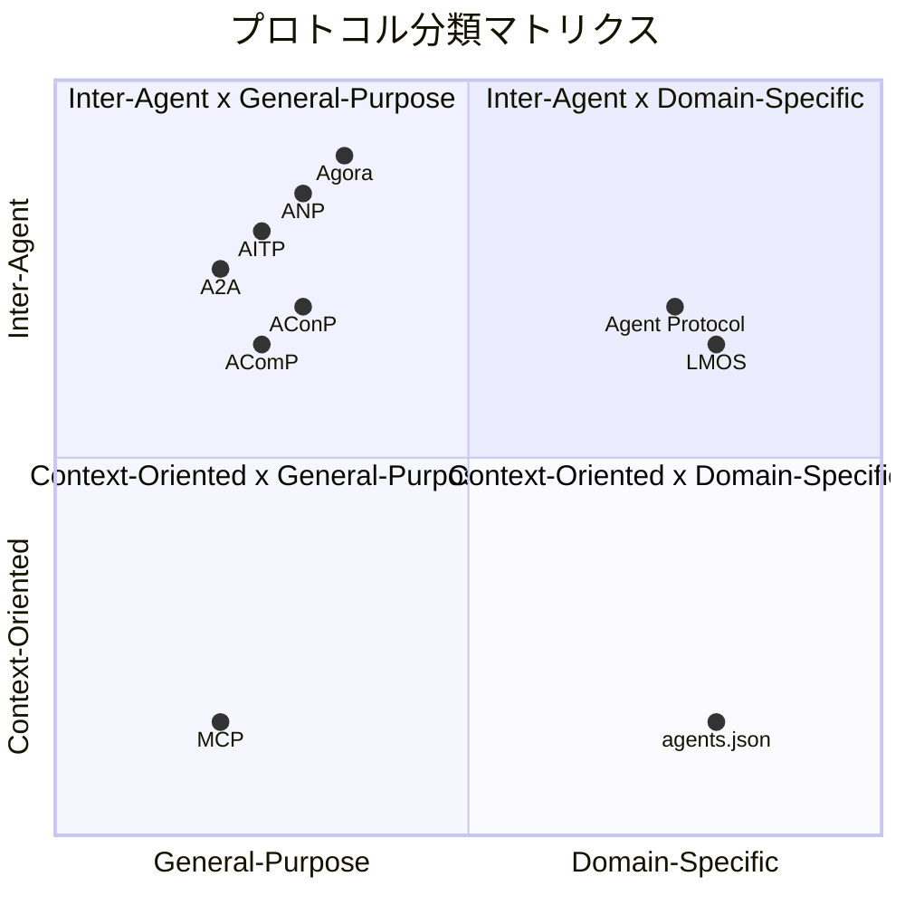
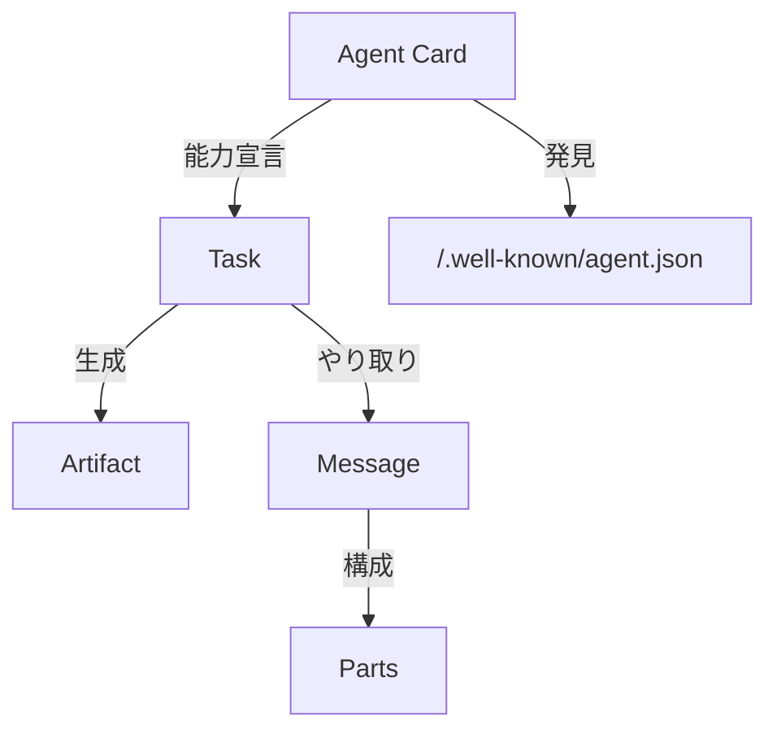
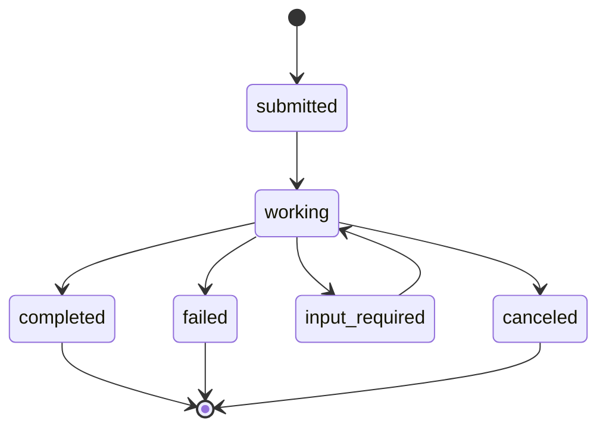

本記事は arXiv論文 "A Survey of AI Agent Protocols"（Yang et al., 2025）の解説記事です。LLMエージェント間の通信プロトコルを体系的に分類・評価した初のサーベイ論文について、分類法の構造、主要プロトコルの設計、評価指標フレームワークを中心に解説します。

## 論文概要（Abstract）

LLMベースのAIエージェントが産業界に広く展開される一方で、エージェント間の通信を標準化するプロトコルは乱立状態にある。本論文は、既存のエージェントプロトコルを**2次元分類法**（オブジェクト指向軸 x 応用シナリオ軸）で体系化し、**7次元の評価指標フレームワーク**を提案した初の包括的サーベイである。著者らは15以上のプロトコルを分類・比較し、MCP・A2A・ANP・AITPなどの設計原則とアーキテクチャを詳細に分析している。さらに、MCPの進化をケーススタディとして取り上げ、プロトコル設計の将来方向（短期・中期・長期）を議論している。

この記事は [Zenn記事: A2Aプロトコルで異種フレームワークのエージェントを連携させる受発注自動化と障害分離設計](https://zenn.dev/0h_n0/articles/40993cd9ca8f6f) の深掘りです。

## 情報源

- **arXiv ID**: 2504.16736
- **URL**: [https://arxiv.org/abs/2504.16736](https://arxiv.org/abs/2504.16736)
- **著者**: Yingxuan Yang, Huacan Chai, Yuanyi Song et al.（Shanghai Jiao Tong University）
- **投稿日**: 2025年4月23日（v1）、2025年6月21日（v3改訂）
- **分野**: cs.AI（Artificial Intelligence）

## 背景と動機

### エージェントプロトコル標準化の課題

2024年後半から2025年にかけて、LLMエージェントの産業応用が急速に進んだ。しかし、エージェント間の通信には統一的なプロトコルが存在せず、各フレームワーク（LangChain、CrewAI、AutoGen等）が独自の通信方式を採用していた。この状況は、インターネット黎明期にTCP/IPが標準化される以前の分断されたネットワーク環境に類似している。

著者らはこの課題を以下の3点に整理している。

1. **相互運用性の欠如**: 異なるフレームワークで構築されたエージェント同士が通信できない
2. **セキュリティの断片化**: 認証・認可メカニズムがプロトコルごとに異なり、エンタープライズ環境での採用障壁となっている
3. **評価基準の不在**: プロトコルの性能・安全性を横断的に比較する共通の評価フレームワークが存在しない

### なぜサーベイが必要なのか

2024年11月のMCP公開以降、A2A（Google、2025年4月）、ANP（ANP Community、2024年）、AITP（NEAR、2025年）など、複数のプロトコルが短期間に登場した。著者らは、この急速な発展を体系的に整理し、各プロトコルの設計思想・適用範囲・成熟度を明確化する必要性を指摘している。

## 主要な貢献

著者らは本論文の貢献を以下の3点にまとめている。

- **貢献1: 2次元分類法の提案** — オブジェクト指向（Context-Oriented vs Inter-Agent）と応用シナリオ（General-Purpose vs Domain-Specific）の2軸で15以上のプロトコルを分類する体系的フレームワークを構築した
- **貢献2: 7次元評価指標フレームワーク** — Efficiency、Scalability、Security、Reliability、Extensibility、Operability、Interoperabilityの7次元でプロトコルを横断的に評価する定量的フレームワークを提案した
- **貢献3: 将来方向の整理** — 短期（ベンチマーク整備）、中期（レイヤードアーキテクチャ）、長期（集合知スケーリング）の3段階でプロトコル進化のロードマップを示した

## 技術的詳細

### 2次元分類法の詳細

本論文の中核をなす分類法は、2つの直交する軸でプロトコル空間を4象限に分割する。

#### 第1軸: オブジェクト指向（Object Orientation）

エージェントが通信する**相手**に基づく分類である。

- **Context-Oriented（コンテキスト指向）**: エージェントが外部リソース（ツール、データベース、API等）にアクセスするためのプロトコル。MCPがこの代表例であり、エージェントに「手（tools）」を提供する位置づけである
- **Inter-Agent（エージェント間）**: エージェント同士が直接通信するためのプロトコル。A2A、ANP、AITPがこの分類に属し、エージェントに「言葉（communication）」を提供する

#### 第2軸: 応用シナリオ（Application Scenario）

プロトコルの**適用範囲**に基づく分類である。

- **General-Purpose（汎用）**: 特定のドメインに依存せず、幅広いエンティティに統一的なインターフェースを提供する。MCP、A2A、ANPなどが該当する
- **Domain-Specific（ドメイン特化）**: 特定のユースケースに最適化されたプロトコル。Agent Protocol（AI Engineer Foundation）、LMOS（Eclipse）などが該当する

以下の図は、この2次元分類法におけるプロトコルの配置を示している。

この分類法により、プロトコル選定時に「誰と通信するか（Context vs Agent）」と「どの範囲に適用するか（General vs Domain-Specific）」の2つの観点で判断できるようになる。

### プロトコル比較表

著者らは15以上のプロトコルを調査し、以下のように整理している（論文Table 1に基づく）。

| Protocol | 提案者 | 分類 | 主要技術 | 成熟度 |
|----------|--------|------|----------|--------|
| MCP | Anthropic (2024) | Context-Oriented, General | JSON-RPC, OAuth 2.1 | Factual Standard |
| agents.json | WildCardAI (2025) | Context-Oriented, Domain | /.well-known discovery | Drafting |
| A2A | Google (2025) | Inter-Agent, General | JSON-RPC, OAuth, SSE | Landing |
| ANP | ANP Community (2024) | Inter-Agent, General | JSON-LD, W3C DID | Landing |
| AITP | NEAR (2025) | Inter-Agent, General | Blockchain, HTTP | Drafting |
| AConP | Cisco (2025) | Inter-Agent, General | OpenAPI, JSON | Drafting |
| AComP | IBM (2025) | Inter-Agent, General | OpenAPI | Drafting |
| Agora | Oxford (2024) | Inter-Agent, General | Protocol Document | Concept |
| LMOS | Eclipse (2025) | Inter-Agent, Domain | WoT, DID | Landing |
| Agent Protocol | AI Engineer Foundation (2025) | Inter-Agent, Domain | RESTful API (OpenAPI v3) | Landing |
| LOKA | CMU (2025) | Inter-Agent, Domain | DECP | Concept |

著者らは成熟度を4段階で分類している。**Factual Standard**（事実上の標準）はMCPのみが達成しており、**Landing**（実装・展開段階）にはA2A・ANP・Agent Protocol等が、**Drafting**（仕様策定段階）にはAITP・AConP等が、**Concept**（概念段階）にはAgora・LOKA等が位置づけられている。

### A2Aプロトコルのアーキテクチャ

A2A（Agent-to-Agent）はGoogleが2025年4月に発表したエージェント間通信プロトコルである。著者らはA2Aの設計原則を以下の5点に整理している。

1. **Simplicity（簡素性）**: HTTP(S)、JSON-RPC 2.0、SSEなど既存のWeb標準を再利用し、新規プロトコルスタックの学習コストを最小化する
2. **Enterprise Readiness（企業対応）**: OAuth 2.1による認証・認可、監査ログ、データプライバシーをプロトコルレベルで組み込む
3. **Async-First（非同期優先）**: Taskオブジェクトを中心に設計し、長時間実行ワークフローを標準的にサポートする
4. **Modality Agnostic（モダリティ非依存）**: テキスト、ファイル、音声・動画、iframeなど複数のモダリティをネイティブに扱える
5. **Opaque Execution（不透明な実行）**: エージェントの内部実装を隠蔽しつつ、タスクメタデータを共有する

#### コア抽象

A2Aプロトコルは5つのコア抽象で構成される。

- **Agent Card**: JSON形式のケイパビリティ宣言。`/.well-known/agent.json`で公開され、エージェント名・説明・対応スキル・認証方式を記述する
- **Task**: 非同期実行の中核単位。一意のIDを持ち、状態遷移（submitted → working → completed/failed）を管理する
- **Artifact**: Taskの出力を格納するコンテナ。テキスト、ファイル、構造化データなど任意のモダリティを保持できる
- **Message**: エージェント間の通信単位。送信者のロール（user/agent）と1つ以上のPartsで構成される
- **Parts**: Messageの構成要素。TextPart、FilePart、DataPartなど型付けされたデータを格納する

#### タスクライフサイクル

Taskの状態遷移は以下のように定義されている。

関連するZenn記事では、この状態遷移に加えて`auth-required`状態を含む8状態のモデルが実装されており、受発注自動化システムでのCircuit BreakerやBulkheadパターンとの統合が示されている。

### MCPプロトコルの設計と進化

MCP（Model Context Protocol）はAnthropicが2024年11月に公開したContext-Orientedプロトコルである。著者らはMCPの進化をケーススタディとして分析し、プロトコル設計の一般的なパターンを抽出している。

#### MCPの進化タイムライン

著者らは、MCPの進化がインターネットにおけるTCP/IPからHTTPへの発展を追体験していると指摘している。

1. **初期版（2024年11月）**: stdio/SSE上のJSON-RPCによるローカルツール接続。HTTPサポートなし、認証機構なし
2. **HTTP-SSE追加**: リモートサーバーへの接続をサポート。ただしSSEの制約（片方向ストリーミング）が残存
3. **Streamable HTTP移行**: SSEを廃止し、双方向のHTTPストリーミングに移行。OAuth 2.1による認証を追加

この進化は、「最小限の機能で開始し、実運用のフィードバックを反映して拡張する」というプロトコル設計のアジャイルな手法を示している。

### ANPプロトコル

ANP（Agent Network Protocol）は分散型エージェントネットワークを志向するプロトコルである。著者らによれば、ANPは「数十億のエージェントによるオープンで安全かつ効率的な協調ネットワーク」の構築を目標としている。

ANPの特徴的な3層アーキテクチャは以下のとおりである。

1. **Identity/Encrypted Communication層**: W3C DID（Decentralized Identifiers）標準による分散型認証。中央認証局に依存せず、エージェントが自律的にアイデンティティを管理する
2. **Meta-Protocol層**: 自然言語を用いた通信プロトコルの自律的交渉。エージェント同士が通信方法そのものを動的に決定する
3. **Application Protocol層**: 標準化されたディスカバリ、ケイパビリティ記述、ドメイン固有タスクの実行

DIDの採用により、ANPはブロックチェーンベースの分散型アイデンティティを実現するが、DIDのエコシステム成熟度や実運用でのパフォーマンスについては著者らも課題として認識している。

### AITPプロトコル

AITP（AI Transfer Protocol）はNEARが提案するプロトコルであり、「異なる組織に属するエージェント間の自律的で安全な通信、交渉、価値交換」を重視している。著者らは、AITPの特徴を**信頼境界を跨ぐエージェント間インタラクション**への明示的なフォーカスにあると整理している。

AITPでは、エージェントがThread（スレッド）を通じて通信し、Transport層上で伝送される。ブロックチェーンを分散環境での信頼基盤として活用し、ドメイン固有のCapabilities（機能）を構造化データとして交換する。

### 評価指標フレームワーク

著者らが提案する7次元評価フレームワーク（論文Table 4）は、プロトコルの品質を定量的に比較するための基盤である。

#### 7次元の詳細

| 次元 | 説明 | 具体的指標 |
|------|------|-----------|
| **Efficiency** | 通信の速度とリソース効率 | レイテンシ、スループット、リソース利用率 |
| **Scalability** | 規模拡大に対する安定性 | Node Scalability、Link Scalability、CNS |
| **Security** | 認証・暗号化による信頼性 | 認証モード多様性、ACL粒度、コンテキスト非感作化 |
| **Reliability** | 一貫性・正確性・耐障害性 | パケット再送、フロー/輻輳制御、持続接続 |
| **Extensibility** | 既存システムを破壊しない拡張性 | 後方互換性、柔軟性・適応性、カスタマイズ・拡張 |
| **Operability** | 実装・統合の容易さ | プロトコルスタックコード量、デプロイ複雑度、可観測性 |
| **Interoperability** | クロスプラットフォーム協調 | クロスシステム互換性、クロスネットワーク適応性 |

#### Scalabilityの定量指標: CNS

著者らはScalability次元の指標として**Capability Negotiation Score（CNS）**を定義している。

$$
\text{CNS} = \frac{N_{\text{success}} / N_{\text{attempts}}}{T_{\text{avg}}}
$$

ここで、
- $N_{\text{success}}$: 成功した能力交渉の回数
- $N_{\text{attempts}}$: 能力交渉の試行回数
- $T_{\text{avg}}$: 平均交渉時間（秒）

CNSが高いほど、エージェントが効率的に能力交渉（どのエージェントが何を担当するかの決定）を完了できることを意味する。この指標は、マルチエージェントシステムのスケールアウト時に特に重要となる。

#### Securityの具体的指標

Security次元は以下の3指標で構成される。

1. **認証モード多様性（Authentication Mode Diversity）**: サポートする認証メカニズムの種類と、エージェント固有の認証への適用可能性を評価する。A2AはOAuth 2.1をネイティブサポートし、MCPもv3でOAuth 2.1を追加した
2. **ロール/ACL粒度（Role/ACL Granularity）**: アクセス制御の精密度を測定する。フィールドレベル、エンドポイントレベル、タスクレベルのいずれで制御可能かを評価する。粒度が高いほど、エージェントが特定のデータフィールドやタスクエンドポイントのみにアクセスする制御が可能になる
3. **コンテキスト非感作化（Context Desensitization）**: インタラクション中の機密データ保護を評価する。データマスキング、トークン化、選択的データ共有などの技術が対象である

## 実験結果（評価分析）

本論文はサーベイ論文であるため、独自の実験評価は実施されていない。著者らは「具体的な評価ベンチマークの提案」ではなく「重要な次元と課題の特定」に焦点を当てていると明記している。これは、エージェントプロトコル領域の急速な反復サイクルにおいて、静的な比較はすぐに陳腐化するためと述べている。

ただし、著者らは既存プロトコルの定性的評価を行っている。以下は論文の分析に基づく主要プロトコルの特性比較である。

| 特性 | MCP | A2A | ANP | AITP |
|------|-----|-----|-----|------|
| 通信対象 | Agent-to-Resource | Agent-to-Agent | Agent-to-Agent | Agent-to-Agent |
| 認証 | OAuth 2.1（v3で追加） | OAuth 2.1（初期から） | W3C DID | Blockchain |
| ディスカバリ | MCP Server設定 | /.well-known/agent.json | DID Document | Transport層経由 |
| 非同期サポート | 限定的 | Async-First | 対応 | Thread型 |
| 成熟度 | Factual Standard | Landing | Landing | Drafting |
| エコシステム | 広範（SDK多数） | 成長中（50社以上参画） | 初期段階 | 初期段階 |

著者らは、MCPが「事実上の標準」としてContext-Oriented領域で支配的地位を確立している一方、Inter-Agent領域ではA2AとANPが異なるアプローチ（中央集権的 vs 分散型）で競合していると分析している。

## 実運用への応用

### プロトコル選定の判断基準

著者らの分類法と評価フレームワークは、実務でのプロトコル選定に直接活用できる。以下に判断基準を整理する。

**ユースケース別推奨**:
- **ツール連携が主目的**（例: LLMからDB/API呼び出し）→ MCP（Context-Oriented, General）
- **異種フレームワーク間のエージェント協調**（例: LangGraphとCrewAIの連携）→ A2A（Inter-Agent, General）
- **分散型・信頼境界を跨ぐシステム**（例: 組織間エージェント連携）→ ANPまたはAITP
- **特定フレームワークへの標準インターフェース**（例: エージェントライフサイクル管理）→ Agent Protocol（Inter-Agent, Domain）

### MCPとA2Aの補完関係

著者らの分析は、MCPとA2Aが競合ではなく補完関係にあることを明確にしている。MCPはエージェントの「手」（外部リソースへのアクセス）、A2Aはエージェントの「言葉」（エージェント間コミュニケーション）を提供する。実運用では、1つのマルチエージェントシステム内でMCPとA2Aを共存させることが想定される。

関連するZenn記事では、A2Aプロトコルを用いた受発注自動化システムの実装が示されている。4つのエージェント（受注エージェント/LangGraph、在庫・出荷エージェント/CrewAI、決済エージェント）がA2Aで連携し、Circuit BreakerやBulkheadパターンで障害分離を実現している。本サーベイ論文のA2A設計原則（Async-First、Opaque Execution）が、Zenn記事の実装設計に直接反映されていることが確認できる。

### 7次元評価の実践的活用

プロダクション環境でのプロトコル選定では、7次元すべてが均等に重要なわけではない。ユースケースに応じた優先順位付けが必要である。

- **金融・ヘルスケア**: Security > Reliability > Interoperability
- **リアルタイムチャット**: Efficiency > Scalability > Reliability
- **マイクロサービスオーケストレーション**: Operability > Extensibility > Scalability

## 関連研究

著者らは以下の関連研究領域を参照している。

- **マルチエージェントシステム（MAS）**: AutoGen（Microsoft）、CrewAI、LangGraphなどのフレームワークがエージェント間協調の基盤を提供しているが、フレームワーク間の相互運用性は未解決である。本サーベイはフレームワークの上位レイヤーとしてのプロトコルに焦点を当てている
- **Webサービスプロトコル（SOAP/REST/gRPC）**: 従来のWebサービスプロトコルの設計パターン（ディスカバリ、ペイロードフォーマット、認証）がエージェントプロトコルに再利用されている。特にJSON-RPC 2.0やOpenAPI v3の採用は、既存のWeb技術エコシステムとの互換性を確保する設計判断である
- **分散型アイデンティティ（DID/VC）**: W3CのDID（Decentralized Identifiers）やVerifiable Credentials仕様がANPの認証基盤に採用されている。分散型ウェブの文脈で発展したこれらの技術が、エージェント間の信頼基盤として再定義されている
- **通信プロトコルの階層化（OSI参照モデル）**: 著者らは将来方向としてレイヤードアーキテクチャを提案しており、OSI参照モデルのようなプロトコルスタックの階層化がエージェント通信にも必要であると主張している

## まとめと今後の展望

### 論文の成果

本サーベイは、LLMエージェントプロトコル領域の初の体系的整理として3つの成果を残している。2次元分類法により15以上のプロトコルの位置づけが明確化され、7次元評価フレームワークにより定量的比較の基盤が整備された。そしてMCPの進化ケーススタディにより、プロトコル設計の発展パターンが実証的に示された。

### 著者らが示す将来方向

著者らは今後の展望を3段階で整理している。

**短期（Static to Evolvable）**:
- 評価・ベンチマークフレームワークの整備（現状では定量的比較が困難）
- プライバシー保護プロトコルの設計（データマスキング、選択的共有の標準化）
- Agent Meshプロトコルの開発（サービスメッシュのエージェント版）

**中期（Rules to Ecosystems）**:
- 組み込みプロトコル知識（エージェントがプロトコル仕様を内部知識として保持し、動的に適用する）
- レイヤードアーキテクチャ（OSI参照モデルに相当するエージェント通信のプロトコルスタック）

**長期（Protocols to Intelligence Infrastructure）**:
- 集合知スケーリング（多数のエージェントが協調することで個体を超える知性を実現するスケーリング則の探求）
- エージェントデータネットワーク（分散型データ共有基盤により、エージェント間で知識・経験を蓄積・共有する）

### 実務への示唆

エージェントプロトコルの標準化は黎明期にあり、MCPのみが「Factual Standard」の段階に達している。Inter-Agent領域ではA2AとANPが有力候補であるが、いずれもLanding段階であり、仕様の変更が続く可能性がある。実務者は、プロトコルの成熟度と自社のユースケースを照合した上で段階的に採用する戦略が推奨される。

## 参考文献

- **arXiv**: [https://arxiv.org/abs/2504.16736](https://arxiv.org/abs/2504.16736)
- **MCP仕様**: [https://modelcontextprotocol.io/](https://modelcontextprotocol.io/)
- **A2A仕様**: [https://github.com/google/A2A](https://github.com/google/A2A)
- **ANP仕様**: [https://github.com/agent-network-protocol/agentnetworkprotocol](https://github.com/agent-network-protocol/agentnetworkprotocol)
- **Related Zenn article**: [https://zenn.dev/0h_n0/articles/40993cd9ca8f6f](https://zenn.dev/0h_n0/articles/40993cd9ca8f6f)
