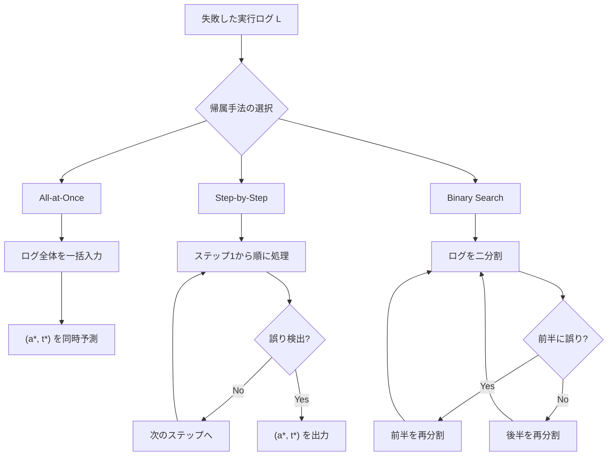
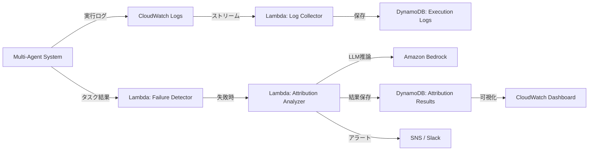

> **AI生成記事**: 本記事はClaude Opus 4.6によって生成されました。内容の正確性は論文原文に基づいていますが、解釈の誤りがある可能性があります。

本記事は [Which Agent Causes Task Failures and When? On Automated Failure Attribution of LLM Multi-Agent Systems](https://arxiv.org/abs/2505.00212) の解説記事です。

## 論文概要

マルチエージェントLLMシステムにおいて、タスク失敗時に「どのエージェントが原因か（Who）」「いつ失敗が起きたか（When）」を自動特定する**障害帰属（Failure Attribution）**の研究を体系化した論文である。著者らは127のマルチエージェントシステムから184件の障害タスクを収集し、3名の専門家による細粒度アノテーションを施した**Who&Whenデータセット**を構築した。3つの自動帰属手法を評価した結果、障害原因エージェントの特定精度は最大53.5%、障害ステップの特定精度は14.2%にとどまり、OpenAI o1やDeepSeek R1といった高度な推論モデルでも実用水準に達しないことが報告されている。本論文はICML 2025にSpotlight論文として採択された。

## 情報源

| 項目 | 内容 |
|------|------|
| arXiv ID | [2505.00212](https://arxiv.org/abs/2505.00212) |
| 著者 | Shaokun Zhang, Ming Yin, Jieyu Zhang et al. |
| 所属 | Penn State University, Duke University, Google DeepMind |
| 発表 | 2025年4月30日（v3: 2025年6月2日） |
| 採択 | ICML 2025 Spotlight |
| 分野 | cs.MA (Multiagent Systems), cs.CL (Computation and Language) |
| コード | [GitHub](https://github.com/mingyin1/Agents_Failure_Attribution) |
| ライセンス | MIT (コード), CC BY 4.0 (論文) |

## 背景と動機

マルチエージェントLLMシステムの実運用が拡大するにつれ、タスク失敗時のデバッグが深刻な課題となっている。単一エージェントのシステムであれば、入力と出力の対応関係から問題箇所を比較的容易に特定できる。しかしマルチエージェントシステムでは、複数のエージェントが自然言語で対話しながら協調的にタスクを遂行するため、以下の困難が生じる。

- **連鎖的な影響**: あるエージェントの小さな誤りが、後続エージェントの判断に伝播し、最終的なタスク失敗として顕在化する
- **長大な実行ログ**: エージェント間の対話ログは数十から百ステップ以上に及び、手動でのトレース分析は現実的でない（論文のデータセットでは最大130ステップ）
- **非決定性**: LLMの出力は確率的であり、同じ入力でも異なる実行パスを辿るため、再現性のあるデバッグが困難
- **責任の曖昧さ**: 複数エージェントが関与するため、根本原因となるエージェントと表面的に失敗するエージェントが異なる場合がある

著者らは、既存のLLMシステム評価研究がタスク成否の「判定」に注力してきた一方で、失敗の「原因特定」という問題は体系的に取り組まれてこなかったと指摘している。この研究は障害帰属を独立した研究課題として定式化した最初の取り組みである。

## 主要な貢献

1. **Failure Attributionの定式化**: マルチエージェントLLMシステムにおける障害帰属を、障害原因エージェント（Who）と障害発生ステップ（When）を同時に特定する問題として数学的に定式化
2. **Who&Whenデータセット**: CaptainAgent（アルゴリズム生成型）とMagnetic-One（手動設計型）の2種類のマルチエージェントシステムから184件の障害タスクを収集し、3名の専門家が計84.3時間をかけて細粒度アノテーションを実施
3. **3つの自動帰属手法**: All-at-Once、Step-by-Step、Binary Searchの3手法を提案し、7種類のLLM（GPT-4o、Llama-3.1、Qwen2.5等）で体系的に評価
4. **包括的な分析**: コンテキスト長の影響、ステップ許容度分析、推論モデルとの比較、ハイブリッド手法の評価など、多角的な実験を実施

## 技術的詳細

### 障害帰属の定式化

著者らは障害帰属を以下のように定式化している。マルチエージェントシステム $M$ がタスク $T$ を実行し、実行ログ $L = \{(a_1, s_1), (a_2, s_2), \ldots, (a_n, s_n)\}$ を生成したとする。ここで $a_k$ はステップ $k$ を実行したエージェント、$s_k$ はそのステップの内容である。

**決定的誤り（Decisive Error）** を、エージェント $a_i$ のステップ $t$ での行動を修正すれば、失敗した実行軌跡が成功に転じるような誤りと定義する。障害帰属の目標は、最も早い決定的誤りを特定することである：

$$
\text{FailureAttribution}(T, L) \rightarrow (a^*, t^*)
$$

ここで $a^*$ は障害原因エージェント（failure-responsible agent）、$t^*$ は決定的誤りステップ（decisive error step）である。形式的には：

$$
(a^*, t^*) = \arg\min_{(a_i, t)} \{ t \mid \text{Correct}(a_i, s_t) \Rightarrow \text{Success}(T) \}
$$

$\text{Correct}(a_i, s_t)$ はエージェント $a_i$ のステップ $t$ での行動が正しく修正された状態を表し、$\text{Success}(T)$ はタスク $T$ が成功する条件を表す。

### 3つの帰属手法

著者らが提案する3つの手法の比較を以下に示す。



**All-at-Once**: LLMに実行ログ全体を一括で入力し、障害原因エージェントと障害ステップを同時に予測させる。ログの全体像を把握できるため、エージェントレベルの精度が高い（GPT-4oで54.33%）。一方、長大なログではneedle-in-a-haystack問題により、ステップレベルの精度が低下する。推論コストは1回のLLM呼び出しで済む。

**Step-by-Step**: 実行ログをステップ1から順に処理し、各ステップで誤りが含まれるかをLLMに判定させる。誤りが検出された時点で帰属結果を出力する。逐次処理により細かい粒度での判定が可能で、ステップレベルの精度が相対的に高い（GPT-4oで25.51%）。ただし推論コストは $O(t^* \cdot C)$ と障害ステップ位置に比例する。

**Binary Search**: 実行ログを二分割し、どちらの半分に障害が含まれるかをLLMに判定させることを繰り返す。$\lceil \log_2(n) \rceil$ 回のイテレーションで障害ステップを絞り込める。All-at-OnceとStep-by-Stepの中間的な特性を持つ。

### Who&Whenデータセットの構成

| 属性 | アルゴリズム生成型 | 手動設計型 |
|------|-------------------|-----------|
| 生成システム | CaptainAgent | Magnetic-One |
| タスクソース | GAIA (98件), AssistantBench (28件) | GAIA (30件), AssistantBench (28件) |
| 障害タスク数 | 126件 | 58件 |
| 最大ログ長 | 10ステップ | 130ステップ |
| 最大エージェント数 | 5 | 5 |
| アノテータ | 3名の専門家 | 3名の専門家 |
| アノテーション時間 | 計84.3時間（30.9 + 30.2 + 23.2） | 同左 |
| 不確実アノテーション率 | 15-30% | 15-30% |

アルゴリズム生成型はCaptainAgentにより自動構築されたエージェントチームの実行ログであり、比較的短いインタラクションが特徴である。手動設計型はMicrosoft Research が開発したMagnetic-One（Orchestrator + WebSurfer + FileSurfer + Coder + ComputerTerminal の5エージェント構成）の実行ログであり、最大130ステップに及ぶ長大なログを含む。

## アルゴリズム: 障害帰属の実装例

以下に、論文で提案されている3手法の概念的な実装例を示す。

```python
from dataclasses import dataclass
from enum import Enum


class AttributionMethod(Enum):
    """障害帰属の手法を表す列挙型."""

    ALL_AT_ONCE = "all_at_once"
    STEP_BY_STEP = "step_by_step"
    BINARY_SEARCH = "binary_search"


@dataclass(frozen=True)
class Step:
    """マルチエージェント実行ログの1ステップを表す.

    Attributes:
        index: ステップ番号（0始まり）
        agent_name: 実行したエージェント名
        content: ステップの内容（エージェントの発話や行動）
    """

    index: int
    agent_name: str
    content: str


@dataclass(frozen=True)
class AttributionResult:
    """障害帰属の結果を表す.

    Attributes:
        agent: 障害原因エージェント名
        step: 障害ステップ番号
        explanation: 帰属理由の説明
    """

    agent: str
    step: int
    explanation: str


def attribute_all_at_once(
    task_description: str,
    steps: list[Step],
    llm_client: "LLMClient",
) -> AttributionResult:
    """All-at-Once手法: ログ全体を一括入力して帰属を推定する.

    論文Table 1より、GPT-4oでエージェントレベル54.33%、
    ステップレベル12.50%の精度が報告されている。

    Args:
        task_description: タスクの説明文
        steps: 実行ログのステップリスト
        llm_client: LLM推論クライアント

    Returns:
        AttributionResult: 障害原因エージェントとステップ
    """
    log_text = "\n".join(
        f"Step {s.index}: [{s.agent_name}] {s.content}" for s in steps
    )
    prompt = (
        f"Task: {task_description}\n\n"
        f"Execution Log:\n{log_text}\n\n"
        "This task failed. Identify:\n"
        "1. Which agent caused the failure (agent name)\n"
        "2. At which step the decisive error occurred (step number)\n"
        "3. Explain your reasoning step by step."
    )
    response = llm_client.generate(prompt)
    return _parse_attribution(response)


def attribute_step_by_step(
    task_description: str,
    steps: list[Step],
    llm_client: "LLMClient",
) -> AttributionResult:
    """Step-by-Step手法: ステップを順次処理して誤りを検出する.

    論文Table 1より、GPT-4oでエージェントレベル35.20%、
    ステップレベル25.51%の精度が報告されている。
    ステップレベルの精度はAll-at-Onceより高い。

    Args:
        task_description: タスクの説明文
        steps: 実行ログのステップリスト
        llm_client: LLM推論クライアント

    Returns:
        AttributionResult: 障害原因エージェントとステップ
    """
    context = f"Task: {task_description}\n\n"
    for step in steps:
        context += f"Step {step.index}: [{step.agent_name}] {step.content}\n"
        prompt = (
            f"{context}\n"
            "Does the latest step contain a decisive error "
            "that would cause task failure? "
            "Answer YES or NO with reasoning."
        )
        response = llm_client.generate(prompt)
        if _is_error_detected(response):
            return AttributionResult(
                agent=step.agent_name,
                step=step.index,
                explanation=response,
            )
    # 最終ステップまで明確な誤りが検出されなかった場合
    last = steps[-1]
    return AttributionResult(
        agent=last.agent_name,
        step=last.index,
        explanation="No decisive error detected; attributing to last step.",
    )


def attribute_binary_search(
    task_description: str,
    steps: list[Step],
    llm_client: "LLMClient",
) -> AttributionResult:
    """Binary Search手法: 二分探索で障害ステップを絞り込む.

    論文Table 1より、GPT-4oでエージェントレベル44.13%、
    ステップレベル23.98%の精度が報告されている。
    計算コストは O(log n) 回のLLM呼び出し。

    Args:
        task_description: タスクの説明文
        steps: 実行ログのステップリスト
        llm_client: LLM推論クライアント

    Returns:
        AttributionResult: 障害原因エージェントとステップ
    """
    low, high = 0, len(steps) - 1
    while low < high:
        mid = (low + high) // 2
        first_half = steps[low : mid + 1]
        log_text = "\n".join(
            f"Step {s.index}: [{s.agent_name}] {s.content}"
            for s in first_half
        )
        prompt = (
            f"Task: {task_description}\n\n"
            f"Partial Execution Log (steps {low}-{mid}):\n{log_text}\n\n"
            "Does this portion contain the decisive error "
            "that caused the task failure? Answer YES or NO."
        )
        response = llm_client.generate(prompt)
        if _is_error_detected(response):
            high = mid
        else:
            low = mid + 1
    target = steps[low]
    return AttributionResult(
        agent=target.agent_name,
        step=target.index,
        explanation=f"Binary search converged at step {low}.",
    )


def _parse_attribution(response: str) -> AttributionResult:
    """LLMの応答から帰属結果を解析する."""
    raise NotImplementedError("実装はLLMの出力フォーマットに依存")


def _is_error_detected(response: str) -> bool:
    """LLMの応答から誤り検出の判定を解析する."""
    return "YES" in response.upper()
```

## 実装のポイント

この手法を実際のマルチエージェントシステムに適用する際には、以下の点に留意する必要がある。

**コンテキスト長の制約**: 論文の実験（Figure 4）では、ログ長が増加するにつれて全手法の精度が低下し、93-130ステップのログではステップレベル精度がほぼ0%に近づくことが報告されている。実運用では、ログの要約や関連部分の抽出といった前処理が不可欠となる。

**手法の使い分け**: All-at-Onceはエージェント特定（Who）に強く、Step-by-Stepはステップ特定（When）に強い。著者らはハイブリッド手法（All-at-OnceでWho、Step-by-StepでWhen）で57.02%のエージェント精度を達成しているが、トークン消費が約8.7倍（149,177 vs 17,106トークン）に増加する点を考慮する必要がある。

**許容度の設定**: 正確なステップ特定が不要な場合、ステップ許容度（tolerance）の導入が有効である。論文Table 2では、$\pm 5$ ステップの許容度を設けることでAll-at-Onceのステップ精度が12.07%から43.10%に改善している。

**アノテーションの不確実性**: 専門家間でも15-30%のケースで帰属判断が一致しない（uncertain annotation）ことが報告されており、障害帰属には本質的な曖昧さが存在する。自動帰属結果は開発者の調査の出発点として活用し、最終判断は人間が行うワークフローが推奨される。

## Production Deployment Guide

障害帰属をマルチエージェントLLMシステムの本番環境に組み込むためのAWS実装パターンを解説する。ここでは、エージェント実行ログの収集、障害検出、帰属分析、結果の可視化までの一連のパイプラインを構築する。

### アーキテクチャ概要



### トラフィック別構成表

| 構成 | Small | Medium | Large |
|------|-------|--------|-------|
| 想定タスク数 | ~100件/日 | ~1,000件/日 | ~10,000件/日 |
| 障害率想定 | 10-20% | 10-20% | 10-20% |
| Log Collector | Lambda (128MB) | Lambda (256MB) | Kinesis + Lambda |
| Execution Logs | DynamoDB On-Demand | DynamoDB Provisioned | DynamoDB + S3 Tiering |
| Attribution Analyzer | Lambda (512MB) | Lambda (1GB) | Step Functions + Lambda |
| LLM推論 | Bedrock (Claude Sonnet) | Bedrock (Claude Sonnet) | Bedrock Batch + Provisioned |
| 結果保存 | DynamoDB On-Demand | DynamoDB Provisioned | DynamoDB + OpenSearch |
| 監視 | CloudWatch基本 | CloudWatch + X-Ray | CloudWatch + X-Ray + Grafana |
| 月額概算 | ~$50-150 | ~$300-800 | ~$2,000-5,000 |

### Terraform構成（Small構成）

```hcl
# --- DynamoDB: 実行ログテーブル ---
resource "aws_dynamodb_table" "execution_logs" {
  name         = "agent-execution-logs"
  billing_mode = "PAY_PER_REQUEST"
  hash_key     = "task_id"
  range_key    = "step_index"

  attribute {
    name = "task_id"
    type = "S"
  }

  attribute {
    name = "step_index"
    type = "N"
  }

  attribute {
    name = "created_at"
    type = "S"
  }

  global_secondary_index {
    name            = "created-at-index"
    hash_key        = "created_at"
    projection_type = "ALL"
  }

  ttl {
    attribute_name = "expires_at"
    enabled        = true
  }

  tags = {
    Project = "agent-failure-attribution"
  }
}

# --- DynamoDB: 帰属結果テーブル ---
resource "aws_dynamodb_table" "attribution_results" {
  name         = "agent-attribution-results"
  billing_mode = "PAY_PER_REQUEST"
  hash_key     = "task_id"

  attribute {
    name = "task_id"
    type = "S"
  }

  attribute {
    name = "attributed_agent"
    type = "S"
  }

  global_secondary_index {
    name            = "agent-index"
    hash_key        = "attributed_agent"
    projection_type = "ALL"
  }

  tags = {
    Project = "agent-failure-attribution"
  }
}

# --- Lambda: 障害帰属分析 ---
resource "aws_lambda_function" "attribution_analyzer" {
  function_name = "agent-attribution-analyzer"
  runtime       = "python3.12"
  handler       = "handler.lambda_handler"
  timeout       = 300
  memory_size   = 512

  filename         = "lambda/attribution_analyzer.zip"
  source_code_hash = filebase64sha256("lambda/attribution_analyzer.zip")

  role = aws_iam_role.attribution_lambda_role.arn

  environment {
    variables = {
      EXECUTION_LOGS_TABLE    = aws_dynamodb_table.execution_logs.name
      ATTRIBUTION_TABLE       = aws_dynamodb_table.attribution_results.name
      BEDROCK_MODEL_ID        = "anthropic.claude-sonnet-4-20250514"
      ATTRIBUTION_METHOD      = "all_at_once"
      SNS_TOPIC_ARN           = aws_sns_topic.attribution_alerts.arn
    }
  }
}

# --- CloudWatch: 障害検出トリガー ---
resource "aws_cloudwatch_event_rule" "task_failure" {
  name        = "agent-task-failure-trigger"
  description = "Trigger attribution analysis on task failure"

  event_pattern = jsonencode({
    source      = ["agent.execution"]
    detail-type = ["TaskCompleted"]
    detail = {
      status = ["FAILED"]
    }
  })
}

resource "aws_cloudwatch_event_target" "attribution_target" {
  rule = aws_cloudwatch_event_rule.task_failure.name
  arn  = aws_lambda_function.attribution_analyzer.arn
}

# --- SNS: アラート通知 ---
resource "aws_sns_topic" "attribution_alerts" {
  name = "agent-attribution-alerts"
}

# --- IAM Role ---
resource "aws_iam_role" "attribution_lambda_role" {
  name = "attribution-lambda-role"

  assume_role_policy = jsonencode({
    Version = "2012-10-17"
    Statement = [{
      Action = "sts:AssumeRole"
      Effect = "Allow"
      Principal = {
        Service = "lambda.amazonaws.com"
      }
    }]
  })
}

resource "aws_iam_role_policy" "attribution_lambda_policy" {
  name = "attribution-lambda-policy"
  role = aws_iam_role.attribution_lambda_role.id

  policy = jsonencode({
    Version = "2012-10-17"
    Statement = [
      {
        Effect = "Allow"
        Action = [
          "dynamodb:GetItem",
          "dynamodb:PutItem",
          "dynamodb:Query",
          "dynamodb:Scan"
        ]
        Resource = [
          aws_dynamodb_table.execution_logs.arn,
          "${aws_dynamodb_table.execution_logs.arn}/index/*",
          aws_dynamodb_table.attribution_results.arn,
          "${aws_dynamodb_table.attribution_results.arn}/index/*"
        ]
      },
      {
        Effect   = "Allow"
        Action   = ["bedrock:InvokeModel"]
        Resource = ["arn:aws:bedrock:*::foundation-model/*"]
      },
      {
        Effect   = "Allow"
        Action   = ["sns:Publish"]
        Resource = [aws_sns_topic.attribution_alerts.arn]
      },
      {
        Effect = "Allow"
        Action = [
          "logs:CreateLogGroup",
          "logs:CreateLogStream",
          "logs:PutLogEvents"
        ]
        Resource = ["arn:aws:logs:*:*:*"]
      }
    ]
  })
}
```

### 運用・監視設定

#### CloudWatch Logs Insights クエリ

障害帰属の傾向分析に有用なクエリ例を以下に示す。

```
# 直近7日間で最も障害原因となったエージェントのランキング
fields @timestamp, attributed_agent, task_id, attribution_step
| filter attribution_method = "all_at_once"
| stats count(*) as failure_count by attributed_agent
| sort failure_count desc
| limit 10
```

```
# 障害ステップの分布（ログ長に対する相対位置）
fields @timestamp, attribution_step, total_steps
| filter attribution_method = "step_by_step"
| stats avg(attribution_step / total_steps) as avg_relative_position,
        min(attribution_step) as earliest_failure,
        max(attribution_step) as latest_failure
  by attributed_agent
```

#### CloudWatch アラーム設定

```hcl
resource "aws_cloudwatch_metric_alarm" "high_failure_rate" {
  alarm_name          = "agent-high-failure-rate"
  comparison_operator = "GreaterThanThreshold"
  evaluation_periods  = 3
  metric_name         = "TaskFailureCount"
  namespace           = "AgentAttribution"
  period              = 300
  statistic           = "Sum"
  threshold           = 10
  alarm_description   = "5分間に10件以上のタスク失敗が発生"
  alarm_actions       = [aws_sns_topic.attribution_alerts.arn]
}

resource "aws_cloudwatch_metric_alarm" "attribution_latency" {
  alarm_name          = "agent-attribution-latency"
  comparison_operator = "GreaterThanThreshold"
  evaluation_periods  = 2
  metric_name         = "AttributionDuration"
  namespace           = "AgentAttribution"
  period              = 300
  statistic           = "p95"
  threshold           = 60000
  alarm_description   = "障害帰属分析のP95レイテンシが60秒を超過"
  alarm_actions       = [aws_sns_topic.attribution_alerts.arn]
}
```

#### AWS X-Ray トレーシング

Lambda関数にX-Rayトレーシングを追加することで、Bedrock呼び出しを含むエンドツーエンドの処理時間を可視化できる。

```hcl
resource "aws_lambda_function" "attribution_analyzer" {
  # ... 既存設定 ...

  tracing_config {
    mode = "Active"
  }
}
```

### コスト最適化チェックリスト

- [ ] DynamoDB TTLを設定し、古いログを自動削除（推奨: 30日）
- [ ] All-at-Once手法を基本とし、Step-by-Stepはトークンコストが高いため重要タスクに限定
- [ ] Bedrock Batch推論を活用し、リアルタイム性が不要な帰属分析はバッチ処理
- [ ] Lambda Provisioned Concurrencyは障害スパイク時のみ有効化（ScheduledAction）
- [ ] CloudWatch Logsの保持期間を適切に設定（推奨: 90日）
- [ ] S3 Intelligent-Tieringで長期ログを自動階層化
- [ ] 短いログ（10ステップ以下）はAll-at-Once、長いログ（50ステップ以上）はBinary Searchを選択し、トークンコストを最適化

## 実験結果

### 主要結果（論文Table 1より）

GPT-4oを用いた各手法の精度を以下に示す。

| 手法 | Agent精度（アルゴリズム生成） | Agent精度（手動設計） | Step精度（アルゴリズム生成） | Step精度（手動設計） |
|------|---------------------------|---------------------|---------------------------|---------------------|
| Random | 29.10% | 12.00% | 19.06% | 4.16% |
| All-at-Once | **54.33%** | **55.17%** | 12.50% | 5.26% |
| Step-by-Step | 35.20% | 34.48% | **25.51%** | 7.02% |
| Binary Search | 44.13% | 51.72% | 23.98% | 6.90% |

著者らは以下の知見を報告している。

**知見1**: All-at-Onceはログ全体の文脈を把握できるため、エージェントレベルの精度が最も高い。一方、Step-by-Stepは逐次処理によりステップレベルで優位性を示す。

**知見2**: 手動設計型（Magnetic-One）は最大130ステップのログを含み、アルゴリズム生成型（最大10ステップ）と比べてステップ特定が著しく困難である。Step精度は手動設計型で5-7%程度にとどまる。

**知見3**: 推論モデル（OpenAI o1, DeepSeek R1）の評価（論文Table 4）では、DeepSeek R1がAll-at-OnceのAgent精度で56.90%と最高値を記録したものの、全体として「実用水準には達しない」と結論づけられている。

**知見4**: ハイブリッド手法（All-at-Once + Step-by-Step の組み合わせ）はAgent精度57.02%を達成するが、トークン消費量が149,177と単独手法の約8.7倍に達する。

## 実運用への応用

本論文の手法は、LangSmithやLangfuse等の既存のLLMオブザーバビリティツールと組み合わせることで、実運用のマルチエージェントシステムに適用可能である。

[LangSmithでマルチエージェント協調障害を診断する実践手法](https://zenn.dev/0h_n0/articles/79f126082f4e6a)（関連Zenn記事）で解説されているLangSmithのトレーシング機能は、エージェント間の対話ログを構造化された形式で収集する基盤を提供する。本論文の障害帰属手法をLangSmithのトレースデータに適用することで、以下のワークフローが実現する。

1. **LangSmithでトレース収集**: LangGraphベースのマルチエージェントシステムの実行ログをノードレベルで記録
2. **障害検出**: タスク失敗を検知したら、トレースデータを障害帰属パイプラインに送信
3. **自動帰属**: All-at-Once手法で障害原因エージェントを推定し、開発者に通知
4. **調査支援**: LangSmithのUIでステップごとの入出力を確認し、帰属結果を検証

ただし、論文の精度（Agent: 53.5%, Step: 14.2%）を考慮すると、自動帰属の結果はあくまで調査の出発点であり、最終的な根本原因分析には人間の判断が不可欠である。2026年にACL採択されたTraceElephant（Chen et al., 2026）では、部分的なトレースではなく完全な実行トレースを用いることで帰属精度が最大76%向上することが報告されており、トレーシング基盤の充実が精度改善の鍵となる。

## 関連研究

1. **TraceElephant** (Chen et al., ACL 2026): Who&Whenデータセットの制約（部分的なトレースのみ）を指摘し、入力とコンテキストを含む完全なトレースを提供するベンチマークを提案。完全トレースにより帰属精度が最大76%向上すると報告している。[arXiv:2604.22708](https://arxiv.org/abs/2604.22708)

2. **FAMAS** (Ge et al., 2025): スペクトル分析に基づく障害帰属手法を提案。軌跡のリプレイと抽象化、エージェント行動パターンと行動活性化パターンの2因子による疑わしさスコアを算出し、Who&Whenベンチマーク上で12手法を上回る性能を達成。[arXiv:2509.13782](https://arxiv.org/abs/2509.13782)

3. **CaptainAgent** (Zhang et al., 2024): 複雑なユーザクエリに対して専門エージェントチームを自動構築するフレームワーク。Who&Whenデータセットのアルゴリズム生成型システムの基盤として使用されている。[arXiv:2405.19425](https://arxiv.org/abs/2405.19425)

4. **Magnetic-One** (Microsoft Research, 2024): Orchestrator、WebSurfer、FileSurfer、Coder、ComputerTerminalの5エージェントで構成されるマルチエージェントシステム。GPT-4oベースでモデル非依存の設計。Who&Whenデータセットの手動設計型システムとして使用されている。

## まとめと今後の展望

本論文は、マルチエージェントLLMシステムの障害帰属を独立した研究課題として定式化し、Who&Whenデータセットと3つの自動帰属手法を提供した点で、この分野の基礎的な貢献である。現時点の最高精度（Agent: 53.5%, Step: 14.2%）は実用には不十分であるが、問題の困難さと研究の方向性を明確にした意義は大きい。

今後の発展として、完全トレース情報の活用（TraceElephant）、スペクトル分析等の非LLMベース手法との統合（FAMAS）、LangSmith等のオブザーバビリティ基盤との連携による実運用フィードバックの獲得が期待される。障害帰属の自動化は、マルチエージェントシステムの信頼性向上と開発サイクルの高速化に直結する重要な課題であり、今後の研究の進展が注目される。

## 参考文献

- Zhang, S., Yin, M., Zhang, J. et al. "Which Agent Causes Task Failures and When? On Automated Failure Attribution of LLM Multi-Agent Systems." ICML 2025 Spotlight. [arXiv:2505.00212](https://arxiv.org/abs/2505.00212)
- GitHub リポジトリ: [https://github.com/mingyin1/Agents_Failure_Attribution](https://github.com/mingyin1/Agents_Failure_Attribution)
- 関連Zenn記事: [LangSmithでマルチエージェント協調障害を診断する実践手法](https://zenn.dev/0h_n0/articles/79f126082f4e6a)
- Chen, M. et al. "Seeing the Whole Elephant: A Benchmark for Failure Attribution in LLM-based Multi-Agent Systems." ACL 2026. [arXiv:2604.22708](https://arxiv.org/abs/2604.22708)
- Ge, Y. et al. "Who is Introducing the Failure? Automatically Attributing Failures of Multi-Agent Systems via Spectrum Analysis." [arXiv:2509.13782](https://arxiv.org/abs/2509.13782)
