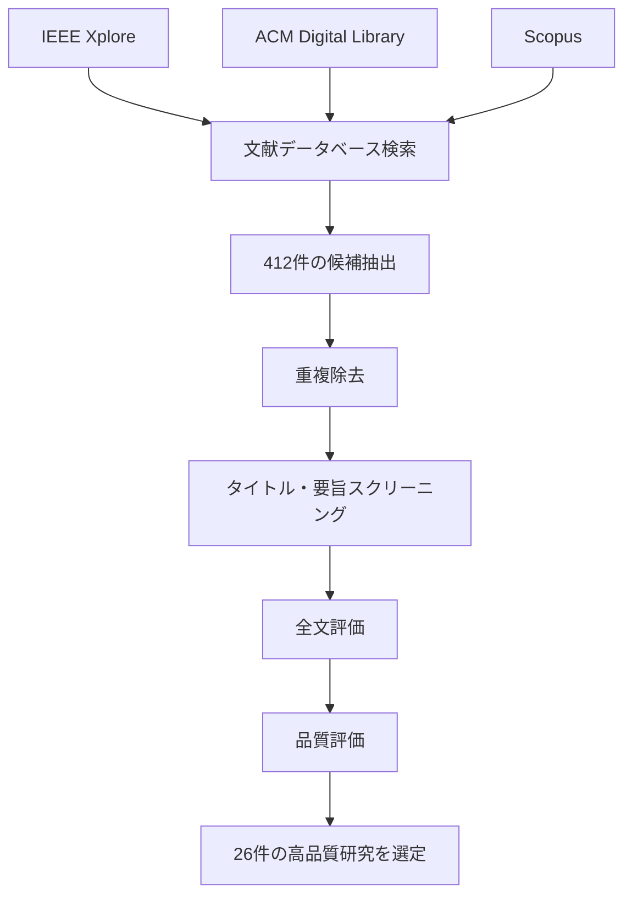
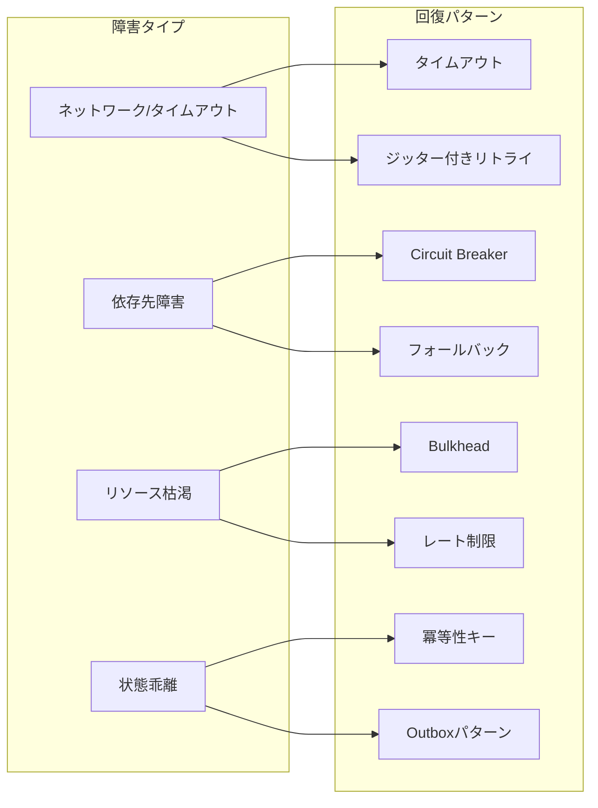

## 論文概要

本記事は [https://arxiv.org/abs/2512.16959](https://arxiv.org/abs/2512.16959) の解説記事です。

Mohammad（2025）は、マイクロサービスにおける回復パターン・戦略・評価フレームワークに関するPRISMA準拠の系統的文献レビューを実施した。2014年から2025年にかけてIEEE Xplore、ACM Digital Library、Scopusから収集された412件の文献を精査し、26件の高品質研究を選定している。著者はCircuit Breaker、リトライ（ジッター付き）、Saga補償、冪等性、Bulkhead、適応的背圧、可観測性、カオス検証を含む9つの耐障害性テーマを体系化した。さらに、障害タイプからパターンへのRecovery Pattern Taxonomy、標準化ベンチマーク用のResilience Evaluation Score（RES）チェックリスト、レイテンシ・一貫性・コストのトレードオフを回復メカニズムに対応付ける制約認識決定マトリクスを提案している。

---

**この記事は [Zenn記事: A2Aプロトコルで異種フレームワークのエージェントを連携させる受発注自動化と障害分離設計](https://zenn.dev/0h_n0/articles/40993cd9ca8f6f) の深掘りです。** Zenn記事で取り上げた「マイクロサービスにおける障害分離」「Circuit Breakerとフォールバック設計」について、本論文が示す26研究の系統的エビデンスに基づいて詳細に解説します。

---

## 情報源

| 項目 | 内容 |
|------|------|
| タイトル | Resilient Microservices: A Systematic Review of Recovery Patterns, Strategies, and Evaluation Frameworks |
| 著者 | Muzeeb Mohammad |
| arXiv ID | [2512.16959](https://arxiv.org/abs/2512.16959) |
| 初回投稿 | 2025年12月18日 |
| 分野 | cs.SE（ソフトウェアエンジニアリング） |
| 採択状況 | IEEE国際会議に採択（2026年最終版予定） |

---

## 背景と動機

マイクロサービスアーキテクチャは、独立したデプロイ・スケーリング・技術スタックの自由度といった利点から広く普及している。しかし著者は、サービス間の通信が増加するにつれて、ネットワーク分断・カスケード障害・状態乖離といった分散システム固有の障害モードが深刻化する点を指摘する。

従来の耐障害性パターン研究には大きく3つの問題があった。第一に、個別パターン（Circuit Breakerのみ、リトライのみ等）の評価に閉じており、パターン間の相互作用やトレードオフが体系化されていなかった。第二に、評価基準が研究ごとに異なり、成果の横断的比較が困難であった。第三に、「どの障害にどのパターンを適用すべきか」という実務的な意思決定指針が欠如していた。

著者はこれらのギャップを埋めるべく、2014-2025年の26件の実証研究を系統的にレビューし、障害タイプ・パターン選択・性能トレードオフを統合的に整理するフレームワークを構築した。

---

## 主要な貢献

著者が論文で述べている主な貢献は以下の通りである。

1. **9つの耐障害性テーマの体系化（T1-T9）**: 26件の研究から抽出された知見を、障害モード適合・Saga補償・リトライ動態・冪等性・Bulkhead・ヘッジング・一貫性vs可用性・可観測性・コスト便益の9テーマに分類
2. **Recovery Pattern Taxonomy**: 障害タイプ（ネットワーク、依存先障害、リソース枯渇、状態乖離）から適用すべきパターンへのマッピングを体系化
3. **Resilience Evaluation Score（RES）**: 10項目のチェックリストによる標準化された耐障害性評価指標
4. **制約認識決定マトリクス**: レイテンシ制約・重複リスク・一貫性要件といった運用制約からパターン選択を導く実務的ガイド
5. **実証的性能データ**: Locustベースの負荷試験による、リトライ戦略間の定量的比較

---

## 技術的詳細

### 文献選定プロセス（PRISMA準拠）

著者はPRISMA（Preferred Reporting Items for Systematic Reviews and Meta-Analyses）ガイドラインに準拠した文献選定を実施している。

対象期間は2014年から2025年であり、3つのデータベース（IEEE Xplore、ACM Digital Library、Scopus）から412件の候補論文が収集された。スクリーニング基準として、マイクロサービスの耐障害性に関する実証的知見を含む英語の査読付き論文であることが求められた。最終的に26件が選定されている。

---

### 9つの耐障害性テーマ（T1-T9）

著者は26件の研究から抽出された知見を9つのテーマに分類している。以下にそれぞれの要点を解説する。

#### T1: 障害モード適合（Fault-Mode Fit）

パターンの有効性は障害セマンティクス（障害の種類と特性）に依存するという原則である。著者は、Circuit Breakerの閾値設定が厳格すぎる場合、一時的なレイテンシスパイクを本格的な障害と誤認し、不必要な回路オープンによってスループットが低下することを報告している。逆に閾値が緩すぎると、実際の障害検知が遅れてカスケード障害を招く。

この知見が示す教訓は、パターンの選択と設定は障害の種類・頻度・持続時間に適合させなければならないという点にある。

#### T2: Saga / 補償（Compensation）

分散トランザクションにおけるSagaパターンの設計トレードオフに関するテーマである。著者は2種類のアプローチを整理している。

- **ローカル補償**: 各サービスが自身の操作をロールバックする。補償コストは最小化されるが、中間状態が一時的に可視化される
- **グローバルSaga**: オーケストレーターが全体の一貫性を維持する。一貫性は保たれるが、全サービスの補償完了まで収束に遅延が発生する

実務上の判断基準として、強い一貫性が求められる金融系トランザクションではグローバルSaga、一時的な不整合が許容されるECの在庫管理等ではローカル補償が適するとされている。

#### T3: リトライ動態（Retry Dynamics）

構造化されていないリトライ（固定間隔や上限なしの指数バックオフ）はリトライストームを誘発し、障害を増幅させる。著者は以下の安定化技法を挙げている。

- **ジッター**: リトライ間隔にランダムな揺らぎを加え、複数クライアントのリトライが同一時刻に集中することを防ぐ
- **リトライ予算**: 単位時間あたりのリトライ回数に上限を設け、下流サービスへの負荷を制限する

ジッター付きバックオフのリトライ間隔は一般に以下の式で表される。

$$
t_{\text{wait}} = \min\left(t_{\max},\; t_{\text{base}} \times 2^{n} \times \text{Uniform}(0, 1)\right)
$$

ここで、
- $t_{\text{base}}$: 基本待機時間（例: 100ms）
- $n$: リトライ回数
- $t_{\max}$: 最大待機時間の上限（例: 30s）
- $\text{Uniform}(0, 1)$: 0から1の一様乱数（ジッター成分）

#### T4: 冪等性 / Outboxパターン（Idempotency / Outbox）

著者は「正確に1回（exactly-once）の配信」は分散システムにおいて非現実的であると述べている。ネットワーク分断やプロセスクラッシュが存在する以上、メッセージの重複配信は避けられない。そこで標準的な対策として2つのパターンが挙げられている。

- **トランザクショナルOutbox**: ビジネスロジックのDB更新とメッセージの発行を同一トランザクションで実行し、別プロセス（CDC: Change Data Capture等）がOutboxテーブルからメッセージをブローカーに転送する
- **冪等性キー**: 各リクエストに一意のキーを付与し、受信側で重複を排除する。重複排除ストア（Redis、DynamoDB等）との組み合わせが典型的である

#### T5: Bulkhead / 背圧（Backpressure）

Bulkheadパターンはサービスやスレッドプールを分離し、障害の「爆発半径（blast radius）」を制限する。著者は、分離によってリソースの利用率が低下するトレードオフを指摘している。

論文によれば、適応的キュー管理（キューの深さに応じて動的にリソースを再配分する手法）を組み合わせることで、静的Bulkheadと比較してリソース効率が約15%改善されるとする研究結果が報告されている。

#### T6: ヘッジリクエスト / テイルレイテンシ（Hedging / Tail Latency）

ヘッジリクエストは、同一リクエストを複数のレプリカに同時送信し、最も早い応答を採用する手法である。著者は、P99レイテンシを最大40%削減できる一方で、リクエスト数の増大によりスループットに悪影響を与えるトレードオフがあると報告している。

この手法はレイテンシSLOが厳格なサービス（決済API等）で有効だが、コンピュートリソースのコスト増を伴うため、適用範囲の慎重な判断が必要とされる。

#### T7: 一貫性 vs 可用性（Consistency vs Availability）

CAP定理の文脈で、結果整合性（eventual consistency）を採用することでアップタイムが向上する一方、一時的な古いデータ（stale reads）が発生するトレードオフが議論されている。著者はドメイン固有の要件に基づいた判断を推奨しており、金融取引には強整合性、商品カタログの閲覧には結果整合性が適するとしている。

#### T8: 可観測性（Observability）

著者は可観測性を「他のすべての耐障害性パターンの前提条件」と位置付けている。具体的には以下の要素が必要とされる。

- **相関ID（Correlation ID）**: リクエストの一意識別子をサービス間で伝播させ、分散トレースを実現する
- **分散トレーシング**: OpenTelemetry等を用いた呼び出しチェーンの可視化
- **構造化ログ**: 障害発生時のロールバック判断に必要なコンテキスト情報の記録

著者は、相関IDと分散トレースがなければSagaの安全なロールバックも、Circuit Breakerの適切な閾値チューニングも実現できないと主張している。

#### T9: コスト-便益トレードオフ（Cost-Benefit Trade-off）

耐障害性パターンの導入は、レイテンシの増加（リトライ待機、Circuit Breaker判定のオーバーヘッド）とリソースコストの増大（ヘッジリクエストの重複コンピュート、Bulkheadの予約リソース）を伴う。著者は、パターン選択を「無料の保険」ではなく「コストを伴うエンジニアリング判断」として捉える必要性を強調している。

---

### Recovery Pattern Taxonomy

著者は障害タイプとパターンの対応関係を体系化したRecovery Pattern Taxonomyを提案している。以下は論文から整理したマッピングである。

| 障害タイプ | 一般的原因 | 推奨パターン |
|---|---|---|
| ネットワーク / タイムアウト | レイテンシスパイク、ネットワーク分断 | タイムアウト設定、ジッター付きリトライ |
| 依存先障害 | ダウンストリームサービスのエラー、リトライストーム | Circuit Breaker、フォールバック |
| リソース枯渇 | CPU/メモリリーク、スレッド枯渇 | Bulkhead、レート制限 |
| 状態乖離 | 非冪等リトライ、メッセージ重複 | 冪等性キー、Outboxパターン |

このTaxonomyの実務的な価値は、障害の「症状」ではなく「タイプ」からパターン選択を始められる点にある。たとえば、下流サービスの応答が遅い場合、それがネットワーク起因（タイムアウト+リトライで対処）なのかリソース枯渇起因（Bulkhead+レート制限で対処）なのかを切り分けることで、適切なパターンを選択できる。

---

### 制約認識決定マトリクス

著者は、運用上の制約条件からパターン選択を導く実務的なガイドとして、制約認識決定マトリクスを提案している。

| 制約条件 | 推奨パターン | 根拠 |
|---|---|---|
| タイトなP99レイテンシ要件 | ヘッジリクエスト、チューニングされたタイムアウト、Bulkhead | レイテンシの分散を抑え、テイル応答を排除する |
| 高い重複処理リスク | 冪等性キー、Outbox、DLQ（Dead Letter Queue） | メッセージの重複配信を前提とし、受信側で安全に処理する |
| 厳密な一貫性要件 | スコープ付き補償Saga、重複排除 | 結果整合性では不十分な金融・在庫管理ドメインに対応する |
| 高スループット・低コスト | 適応的Bulkhead、リトライ予算 | ヘッジリクエスト等のコスト増大パターンを避ける |

このマトリクスが従来のパターンカタログと異なるのは、パターンの「機能」ではなく「制約」を起点にしている点である。エンジニアは自身のシステムが持つ制約（SLO、コスト上限、一貫性要件等）を特定した上で、対応するパターン群を選択できる。

---

### Resilience Evaluation Score（RES）

著者は耐障害性の成熟度を定量化するための10項目チェックリスト、Resilience Evaluation Score（RES）を提案している。

RESのスコアリングは以下のように定義されている。

$$
\text{RES} = \sum_{i=1}^{10} s_i, \quad s_i \in \{0, 1\}
$$

ここで $s_i$ は各チェック項目（リトライポリシーの存在、Circuit Breakerの設定、冪等性の保証など）の充足を表すバイナリ値である。

| RESスコア | 成熟度レベル | 解釈 |
|---|---|---|
| $< 5$ | 予備的（Preliminary） | 基本的な耐障害性メカニズムが不足 |
| $5 - 7$ | 中程度（Moderate） | 主要パターンは実装されているが網羅性に課題 |
| $\geq 8$ | 高厳密（High Rigor） | 包括的な耐障害性設計がなされている |

RESの意義は、異なるシステム間の耐障害性を同一尺度で比較できる標準化された指標を提供する点にある。著者はレビュー対象の26研究に対してRESを適用し、研究の厳密性を評価している。

---

## 実験結果

著者はLocustベースの負荷試験により、異なるリトライ戦略の性能を定量的に比較している。実験条件は以下の通りである。

- **負荷生成ツール**: Locust
- **リクエストレート**: 200 req/s
- **試験時間**: 60秒間
- **ダウンストリーム遅延**: 300ms → 1500msに段階的増加

| リトライ戦略 | P99レイテンシ | エラー率 |
|---|---|---|
| 指数バックオフ（ジッターなし） | 2600ms | 17% |
| ジッター付きバックオフ | 1400ms | 6% |
| 制限付きリトライ + Circuit Breaker | 1100ms | 3% |

論文のデータから読み取れるポイントは以下の通りである。

**ジッターの効果**: ジッターの追加だけでP99レイテンシが2600msから1400msへ約46%削減され、エラー率も17%から6%へ低下している。これはT3（リトライ動態）で述べられたリトライストームの抑制効果を定量的に裏付けている。ジッターなしの場合、複数クライアントのリトライが同一タイミングに集中し、ダウンストリームサービスへの負荷がスパイク的に増大する。ジッターによりリトライタイミングが分散されることで、この集中が緩和される。

**Circuit Breakerの追加効果**: リトライ予算（制限付きリトライ）とCircuit Breakerを組み合わせることで、P99が1100msまで短縮され、エラー率は3%に抑えられている。Circuit Breakerがダウンストリームの障害を検知して回路をオープンにすることで、無駄なリトライ自体が発生しなくなるためである。

**段階的改善の明確さ**: 「ジッターなし → ジッターあり → リトライ制限+Circuit Breaker」という段階的な改善が定量的に示されており、パターンの組み合わせが個別適用より効果的であることが実証されている。

ただし著者自身が注記しているように、この実験は200 req/sという比較的小規模な負荷条件での結果であり、大規模トラフィック環境での再現性については追加検証が必要である。

---

## 実運用への応用

### Zenn記事との関連

Zenn記事「A2Aプロトコルで異種フレームワークのエージェントを連携させる受発注自動化と障害分離設計」では、マルチエージェントシステムにおけるCircuit Breakerとフォールバック設計が取り上げられている。本論文の知見を適用すると、以下の設計指針が得られる。

**障害タイプの分類から始める**: A2Aプロトコルでエージェント間通信が失敗した場合、それがネットワークタイムアウトなのか、依存先エージェントのクラッシュなのか、リソース枯渇なのかによって適用すべきパターンが異なる。Recovery Pattern Taxonomyを参照して障害タイプを切り分けることが、パターン選択の出発点となる。

**Circuit Breakerの閾値設計**: T1（障害モード適合）が示すように、閾値設定は障害の特性に合わせる必要がある。エージェントの応答遅延が正常時でもばらつく場合、厳格すぎる閾値は誤検知を増やしスループットを低下させる。

**Sagaパターンの選択**: マルチエージェントによる受発注フローでは、注文確定・在庫引当・決済といった複数ステップの整合性が必要になる。T2が示すローカル補償とグローバルSagaのトレードオフを踏まえ、ドメインの一貫性要件に応じた選択が求められる。

### 実務での適用ステップ

著者のフレームワークを実務に適用する場合、以下のステップが考えられる。

1. **現状評価**: RESチェックリストを用いて自システムの耐障害性成熟度を定量化する
2. **障害分類**: 過去のインシデントをRecovery Pattern Taxonomyの4カテゴリに分類する
3. **制約特定**: SLO（P99レイテンシ等）、コスト上限、一貫性要件を明文化する
4. **パターン選択**: 制約認識決定マトリクスに基づいて適用パターンを選定する
5. **段階的導入**: 実験結果が示すように、ジッター付きリトライから始め、Circuit Breakerを追加するという段階的アプローチが効果的である

---

## 関連研究

著者はレビュー対象の26研究を包括的に分析しているが、特に以下の先行研究との関連が深い。

- **Nygard（2007, 2018）"Release It!"**: Circuit Breaker、Bulkhead等の耐障害性パターンを最初に体系化した実務書。本論文はNygardが定性的に提示したパターンを、26件の実証研究に基づいて定量的に再評価している
- **Garcia-Molina & Salem（1987）"Sagas"**: 長時間トランザクションの補償メカニズムを初めて提案した論文。本論文のT2はこの概念をマイクロサービス文脈で再解釈している
- **Dean & Barroso（2013）"The Tail at Scale"**: テイルレイテンシとヘッジリクエストに関するGoogle社の知見。本論文のT6はこの研究を発展させ、スループットとのトレードオフを定量的に整理している
- **Richardson（2018）"Microservices Patterns"**: Sagaオーケストレーション、Outboxパターン等のマイクロサービス固有の設計パターンカタログ。本論文はRichardsonのパターンを障害タイプ別に再分類している

---

## まとめと今後の展望

本論文の主要な成果は、マイクロサービスの耐障害性に関する分散した知見を9つのテーマに体系化し、障害タイプからパターン選択を導くTaxonomyと、運用制約からパターンを絞り込む決定マトリクスを提供した点にある。特にLocustベースの実証データは、ジッターやCircuit Breakerの追加効果を定量的に裏付けるものとして価値がある。

一方で著者自身が述べているように、本研究にはいくつかの制約がある。レビュー対象が26件に限定されている点、実証データが比較的小規模（200 req/s）な負荷条件に基づいている点、そして個々のパターンの組み合わせ爆発に対する体系的な検証が不足している点である。

今後の研究方向として著者は、カオスエンジニアリング（Chaos MonkeyやLitmus等）との統合によるパターン有効性の自動検証、およびAIOpsとの連携による障害タイプの自動分類と動的なパターン適用を挙げている。マイクロサービスの耐障害性設計に携わるエンジニアにとって、本論文のRecovery Pattern TaxonomyとRESチェックリストは、既存システムの評価と改善の出発点として活用できるだろう。

---

## 参考文献

- **arXiv**: [https://arxiv.org/abs/2512.16959](https://arxiv.org/abs/2512.16959)
- **Related Zenn article**: [https://zenn.dev/0h_n0/articles/40993cd9ca8f6f](https://zenn.dev/0h_n0/articles/40993cd9ca8f6f)
- Nygard, M. T. (2018). *Release It! Design and Deploy Production-Ready Software* (2nd ed.). Pragmatic Bookshelf.
- Garcia-Molina, H., & Salem, K. (1987). Sagas. *ACM SIGMOD Record*, 16(3), 249-259.
- Dean, J., & Barroso, L. A. (2013). The Tail at Scale. *Communications of the ACM*, 56(2), 74-80.
- Richardson, C. (2018). *Microservices Patterns*. Manning Publications.
