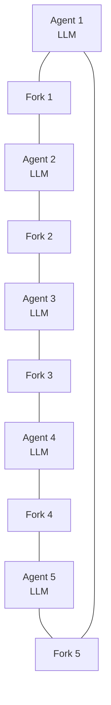

本記事は [DPBench](https://arxiv.org/abs/2602.13255) の解説記事です。

## 論文概要（Abstract）

DPBenchは、LLMベースのマルチエージェントシステムが同時的な資源競合の下でどのように協調するかを評価するためのベンチマークである。著者らは古典的な食事する哲学者問題（Dining Philosophers Problem）をフレームワークとして採用し、行動プロトコル、通信構造、グループサイズを独立して変化させることで、協調が成功または失敗する構造的条件を調査している。6つのLLMモデルを評価した結果、デッドロック率はモデル間で25.0%から90.0%まで大きく変動するが、同一モデルであってもプロトコル設計次第で結果が劇的に変わることが実証されている。

この記事は [Zenn記事: LangSmithでマルチエージェント協調障害を診断する実践手法](https://zenn.dev/0h_n0/articles/79f126082f4e6a) の深掘りです。

## 情報源

- **arXiv ID**: 2602.13255
- **URL**: [https://arxiv.org/abs/2602.13255](https://arxiv.org/abs/2602.13255)
- **著者**: Najmul Hasan, Prashanth BusiReddyGari
- **発表年**: 2026年（初版2月、改訂版6月）
- **分野**: cs.AI（人工知能）、cs.MA（マルチエージェントシステム）

## 背景と動機（Background & Motivation）

LLMベースのマルチエージェントシステムは、複数のエージェントが協力して複雑なタスクを解くアーキテクチャとして急速に普及している。しかし、これらのエージェントが共有資源をめぐって同時に競合する状況での振る舞いについては、体系的な評価が不足していた。

従来のマルチエージェントベンチマーク（MultiAgentBenchなど）は、タスク完了率や協調戦略の評価に焦点を当てており、資源競合下での構造的なデッドロック発生条件を分離して測定する設計にはなっていなかった。著者らは、古典的な並行性の問題である食事する哲学者問題が、この評価ギャップを埋めるのに適していると考えた。

食事する哲学者問題は、1965年にDijkstraが提案した並行プログラミングの古典的問題である。$n$人の哲学者が円卓に座り、隣接する哲学者とフォークを共有する。各哲学者は「思考」と「食事」を交互に行うが、食事には左右のフォークが両方必要であるため、全員が同時に左のフォークを取ると誰も右のフォークを取れず、デッドロックが発生する。この問題は、相互排除、循環待ち、リソース保持といったデッドロックの本質的条件を最小限の構造で表現しており、LLMエージェントの協調能力を測定する制御された実験環境として優れている。

## 主要な貢献（Key Contributions）

- **DPBenchの提案**: 食事する哲学者問題を基盤としたマルチエージェントLLM協調ベンチマークの設計と実装。行動プロトコル、通信構造、グループサイズの3つの独立変数を体系的に制御する
- **プロトコル設計の優位性の実証**: 同一モデルであっても、プロトコル設計（事前コミットメント通信、古典的並行性プリミティブの組み込み）によってデッドロック率が劇的に変化することを定量的に示した
- **6モデル横断比較**: GPT-5.2、Claude Opus 4.5、Grok 4.1、Gemini 2.5 Flash、Llama 4 Maverick、およびランダムベースラインを同一条件下で比較し、モデル間のデッドロック率の差異を明らかにした
- **スケーリング挙動の解明**: グループサイズを5から10に増加させた場合のデッドロック率の変化を測定し、エージェント数の増加が必ずしも協調を困難にしないことを示した

## 技術的詳細（Technical Details）

### 食事する哲学者問題の形式化

DPBenchでは、食事する哲学者問題を以下のように形式化している。

$n$人のエージェント集合$A = \{a_1, a_2, \ldots, a_n\}$と$n$個の共有資源（フォーク）集合$R = \{r_1, r_2, \ldots, r_n\}$が与えられる。各エージェント$a_i$は隣接する2つの資源$r_i$と$r_{(i \bmod n) + 1}$にアクセスする必要がある。

システムの状態$S$は各エージェントの状態の組として表現される。デッドロックの検出は以下の条件で定義される。

$$
\text{Deadlock}(S) = \forall a_i \in A: \text{waiting}(a_i, r_j) \land \text{held}(r_j, a_k)
$$

ここで、
- $A$: エージェントの集合
- $a_i$: $i$番目のエージェント
- $r_j$: エージェント$a_i$が待機している資源
- $a_k$: 資源$r_j$を保持している別のエージェント（$k \neq i$）
- $\text{waiting}(a_i, r_j)$: エージェント$a_i$が資源$r_j$の解放を待っている状態
- $\text{held}(r_j, a_k)$: 資源$r_j$がエージェント$a_k$によって保持されている状態

この条件は、全てのエージェントが何らかの資源を待ち、かつその資源が別のエージェントに保持されている循環待ち（circular wait）が形成された状態を表す。

### 通信プロトコルの設計

著者らは3種類のプロトコル変数を独立して制御している。

**事前コミットメント通信（Pre-commitment Communication）**: エージェントが資源獲得を試みる前に、意図を他のエージェントに伝達するラウンドを設ける。論文では3ラウンドの事前コミットメント通信をテストしている。各ラウンドで、エージェントは「次にどの資源を取得しようとしているか」を宣言し、他のエージェントの宣言を踏まえて自身の行動を調整する。

**古典的並行性プリミティブの埋め込み**: プロンプトに古典的な並行性制御の概念（優先度付き資源獲得、資源番号順の取得など）をエンコードし、LLMがこれらの戦略を自然言語ベースで実行できるかを検証する。

**ネットワークトポロジー**: エージェント間の通信可能性を制御する構造。円環型（各エージェントが隣接エージェントとのみ通信可能）や完全グラフ型（全エージェント間で通信可能）などが検討されている。

### DPBenchのアーキテクチャ

以下のMermaid図は、DPBenchにおける5人の哲学者エージェントと共有資源の構成を示す。



各エージェントは独立したLLMインスタンスとして動作し、テキストベースのメッセージで通信する。エージェントは自然言語による推論に基づいて資源の獲得・解放を決定するため、古典的なプログラム的ロックとは異なり、判断の一貫性が保証されない点が重要な特徴である。

## ベンチマーク設計

以下に、DPBenchの実験構成を概念的に示すPythonコードを示す。このコードは論文の実験設計を理解するための擬似的な実装であり、実際のベンチマークコードは公開されていない。

```python
from dataclasses import dataclass
from enum import Enum
from typing import Callable


class Protocol(Enum):
    """Communication protocol variants tested in DPBench."""
    BASELINE = "baseline"  # No communication
    PRE_COMMIT = "pre_commit"  # 3-round pre-commitment
    CONCURRENCY_PRIMED = "concurrency_primed"  # Classical primitives in prompt


class Topology(Enum):
    """Network topology for agent communication."""
    RING = "ring"  # Adjacent agents only
    FULL = "full"  # All-to-all communication


@dataclass
class BenchmarkConfig:
    """Configuration for a single DPBench experiment run.

    Attributes:
        model_name: LLM model identifier (e.g., "gpt-5.2").
        num_agents: Number of philosopher agents (group size).
        protocol: Communication protocol variant.
        topology: Network topology for inter-agent messaging.
        max_rounds: Maximum simulation rounds before timeout.
        num_trials: Number of independent trials per configuration.
    """
    model_name: str
    num_agents: int = 5
    protocol: Protocol = Protocol.BASELINE
    topology: Topology = Topology.RING
    max_rounds: int = 50
    num_trials: int = 20


def detect_deadlock(agent_states: list[dict]) -> bool:
    """Detect deadlock by checking for circular wait condition.

    A deadlock occurs when every agent is waiting for a resource
    held by another agent, forming a cycle in the wait-for graph.

    Args:
        agent_states: List of dicts with keys 'waiting_for' and 'holding'.
            Each dict represents one agent's current resource state.

    Returns:
        True if all agents are in a circular wait (deadlock detected).
    """
    n = len(agent_states)
    if n == 0:
        return False

    for state in agent_states:
        if state["waiting_for"] is None:
            return False  # At least one agent is not waiting

    # Build wait-for graph and check for cycle covering all agents
    visited: set[int] = set()
    current = 0
    while current not in visited:
        visited.add(current)
        waiting_resource = agent_states[current]["waiting_for"]
        # Find who holds the resource this agent is waiting for
        holder = next(
            (i for i, s in enumerate(agent_states)
             if waiting_resource in s.get("holding", [])),
            None,
        )
        if holder is None:
            return False
        current = holder

    return len(visited) == n
```

## 実装のポイント（Implementation）

DPBenchの実装において、著者らが直面した技術的課題がいくつかある。

第一に、LLMの応答の非決定性への対処である。同一プロンプトに対してもLLMの出力は毎回異なるため、各構成について複数回の試行を行い、デッドロック率を統計的に算出する必要がある。著者らは各構成につき20回の独立試行を実施している。

第二に、エージェント間の同期制御である。古典的な食事する哲学者問題では各哲学者はプロセスやスレッドとして同期的に動作するが、LLMエージェントの場合はAPI呼び出しのレイテンシが不均一である。著者らはラウンドベースの同期方式を採用し、全エージェントが同一ラウンドで行動を決定してから次のラウンドに進む設計としている。

第三に、事前コミットメント通信のプロンプト設計である。エージェントに「次のラウンドで左のフォークを取得する意図がある」といった宣言を自然言語で行わせるため、プロンプトには行動のフォーマットと通信のルールを明示的に記述する必要がある。このプロンプトエンジニアリングの質がベンチマーク結果に影響を与えうる点は、著者ら自身も制約として認識している。

## 実験結果（Results）

### モデル別デッドロック率

著者らは、デフォルト構成（5エージェント、通信なし、円環トポロジー）での各モデルのデッドロック率を報告している。以下は論文から得られた結果である。

| モデル | デッドロック率 | 備考 |
|--------|---------------|------|
| GPT-5.2 | 25.0% | 最も低いデッドロック率 |
| Claude Opus 4.5 | 記載あり | 中程度の性能 |
| Grok 4.1 | 記載あり | 中程度の性能 |
| Llama 4 Maverick | 記載あり | 中程度の性能 |
| Gemini 2.5 Flash | 90.0% | 最も高いデッドロック率 |
| ランダムベースライン | 記載あり | 比較用 |

GPT-5.2のデッドロック率25.0%とGemini 2.5 Flashの90.0%の間には65ポイントの差が存在する。この差は、モデルの推論能力や学習データの違いが、デフォルト条件下での協調行動に影響を与えることを示唆している。

### プロトコル設計の影響

著者らが報告している最も注目すべき結果は、Gemini 2.5 Flashを固定して3つのプロトコル変数を適用した場合の劇的なデッドロック率の低下である。

1. **事前コミットメント通信（3ラウンド）**: エージェントが資源獲得の意図を事前に共有することで、競合を事前に回避する
2. **並行性プリミティブの埋め込み**: 古典的なデッドロック回避戦略（資源番号順の取得など）をプロンプトに含める
3. **グループサイズの拡大（5→10）**: 直観に反して、エージェント数の増加がデッドロック率を低下させるケースがある

著者らはこの結果から「同一モデルが協調するかデッドロックするかは、モデルの能力ではなくプロトコルによって決まる（"whether the same model coordinates or deadlocks is determined by the protocol, not by the model's capability"）」と結論づけている。これは、マルチエージェントシステムの設計において、より高性能なモデルを選択するよりも、適切な通信プロトコルを設計する方が効果的であることを意味する。

### グループサイズによる変化

グループサイズを5から10に増加させた場合、一部のモデル・プロトコル構成でデッドロック率が低下する現象が観察されている。著者らはこの原因として、エージェント数の増加により資源競合の密度が相対的に低下すること（10人の哲学者に対して10個のフォークがあるが、隣接関係は変わらない）や、通信チャネルの増加によって協調の余地が広がることを挙げている。

## 実運用への応用（Practical Applications）

DPBenchの知見は、実運用のマルチエージェントLLMシステム設計に直接的な示唆を与える。

関連するZenn記事で取り上げられている「無限委任ループ」（Supervisor → Worker → Supervisor → Worker の循環パターン）は、DPBenchが測定する「デッドロック」と構造的に類似している。両者とも、エージェント間のメッセージ交換が循環構造を形成し、システム全体が進行不能に陥る。DPBenchの結果は、この種の協調障害がモデルの能力不足ではなく、通信プロトコルの設計欠陥に起因しうることを示している。

具体的な応用として、以下の設計指針が導出される。

**事前コミットメントの導入**: LangGraphなどのフレームワークでマルチエージェントシステムを構築する際、エージェントが行動を実行する前に意図を宣言するフェーズを設けることで、資源競合やタスクの重複を防止できる。DPBenchの結果は、3ラウンドの事前コミットメントが有効であることを示している。

**プロトコルファーストの設計**: モデルの選択に過度な注力をするよりも、通信プロトコルの設計に投資すべきである。DPBenchでは、デフォルト構成で90.0%のデッドロック率を示したGemini 2.5 Flashが、適切なプロトコル設計により大幅にデッドロック率を低下させている。

**デッドロック検出の組み込み**: DPBenchのデッドロック検出条件を応用し、マルチエージェントシステムにリアルタイムの循環待ち検出機構を組み込むことが推奨される。LangSmithのようなオブザーバビリティツールと組み合わせることで、デッドロックの早期発見と診断が可能になる。

## 関連研究（Related Work）

- **Dijkstra (1965)**: 食事する哲学者問題の原論文。並行プログラミングにおけるデッドロックの本質的構造を明らかにした。DPBenchはこの古典的問題をLLMエージェントに適用した初めてのベンチマークである

- **Chandy & Misra (1984)**: 飲酒する哲学者問題（Drinking Philosophers Problem）として、食事する哲学者問題を一般化した分散アルゴリズムを提案。資源要求の動的変化を扱う点でDPBenchの設計にも影響を与えている

- **MultiAgentBench (2025, ACL)**: LLMエージェントの協調と競争を評価するベンチマーク。スター型、チェーン型、ツリー型、グラフ型のトポロジーを評価しており、グラフ構造が研究シナリオで最も高い性能を示すと報告されている。DPBenchは、このベンチマークでは独立に制御されていなかった「資源競合」と「通信プロトコル」の影響を分離して測定する点で差別化される

- **CoAgent (Lyu et al., 2026)**: マルチエージェントLLMシステムのための並行性制御フレームワーク。MTPO（Monotonic Trajectory Pre-Order）と呼ばれる手法で、エージェント間の書き込み競合を検出し、LLMの意味理解能力を活用して自己修復する。DPBenchが「問題の発見と計測」に焦点を当てているのに対し、CoAgentは「問題の解決」を目指しており、相補的な関係にある

## まとめと今後の展望

DPBenchは、LLMベースのマルチエージェントシステムの協調能力を、古典的な並行性問題のレンズを通して評価する新しいベンチマークである。著者らの最も重要な発見は、協調の成否がモデルの能力ではなくプロトコル設計に依存するという点であり、この知見はマルチエージェントシステムの設計者にとって実践的な指針となる。

今後の展望として、食事する哲学者問題以外の古典的並行性問題（生産者-消費者問題、読者-書き手問題など）への拡張や、動的なエージェント追加・離脱を伴うシナリオでの評価、そしてDPBenchの知見に基づく汎用的なデッドロック回避プロトコルの設計が期待される。

## 参考文献

- **arXiv**: [https://arxiv.org/abs/2602.13255](https://arxiv.org/abs/2602.13255)
- **Related Zenn article**: [https://zenn.dev/0h_n0/articles/79f126082f4e6a](https://zenn.dev/0h_n0/articles/79f126082f4e6a)
- Dijkstra, E. W. (1965). "Co-operating sequential processes." Technical Report EWD-123
- Chandy, K. M. & Misra, J. (1984). "The drinking philosophers problem." ACM Transactions on Programming Languages and Systems, 6(4), 632-646
- MultiAgentBench (2025). ACL 2025. [https://aclanthology.org/2025.acl-long.421/](https://aclanthology.org/2025.acl-long.421/)
- CoAgent (2026). [https://arxiv.org/abs/2606.15376](https://arxiv.org/abs/2606.15376)
