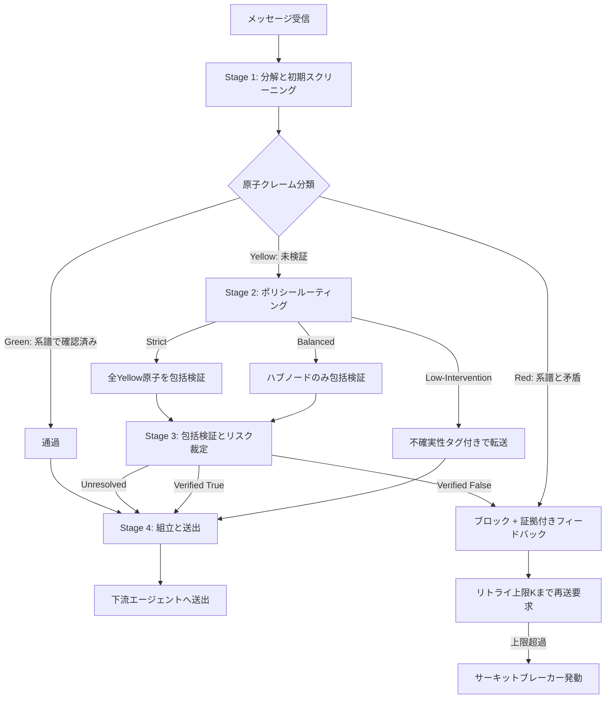

## 論文概要

Xie et al. (2026) による本論文は、LLMベースのマルチエージェントシステム（LLM-MAS）において、単一の小さな誤りがメッセージ伝播を通じてシステム全体の偽合意（false consensus）に発展するメカニズムを数理的にモデル化し、その防御手法を提案した研究である。著者らは協調構造を有向依存グラフとして抽象化し、3種類の脆弱性クラス（カスケード増幅・トポロジ感度・合意慣性）を6つの主要マルチエージェントフレームワーク上で実証的に特定した。提案された家系図グラフ型ガバナンス層（genealogy-graph governance layer）は、メッセージ層プラグインとして動作し、協調アーキテクチャを変更せずにエラー拡散を抑制する。防御成功率（BICR）はベースラインの0.32から0.89へ向上したと報告されている。

この記事は [Zenn記事: LangSmithでマルチエージェント協調障害を診断する実践手法](https://zenn.dev/0h_n0/articles/79f126082f4e6a) の深掘りです。

## 情報源

- **arXiv ID**: 2603.04474
- **URL**: [https://arxiv.org/abs/2603.04474](https://arxiv.org/abs/2603.04474)
- **著者**: Yizhe Xie, Congcong Zhu, Xinyue Zhang, Tianqing Zhu, Dayong Ye et al.
- **投稿日**: 2026年3月4日（改訂: 2026年5月11日）
- **分野**: cs.MA（マルチエージェントシステム）、cs.AI（人工知能）

## 背景と動機

LLMベースのマルチエージェントシステムは、ソフトウェア開発（MetaGPT, ChatDev）、データ分析（AutoGen）、意思決定（CrewAI, LangGraph）など多様な領域で利用が広がっている。しかし、従来の分散システムとは異なり、LLMエージェントは厳密な型システムを持たず、他エージェントの出力を構文的に正しければ検証済みの事実として受け入れる傾向がある。

この特性により、あるエージェントの些細な誤りが下流エージェントに伝播し、各エージェントが誤った前提の上に推論を積み重ねることで「推移的信頼連鎖（transitive trust chain）」が形成される。論文では、ラウンド2で導入された誤りがラウンド6までに平均3.9の「確認コンテキスト」を蓄積し、後続エージェントにとってあたかも検証済み情報のように見える現象が報告されている（論文Section 5.3より）。

既存の防御手法は、エージェント単位のガードレール（構造化プロンプト、出力フィルタ）やシステムレベルの監視（バリデータエージェント、ウォッチドッグ）に留まっており、エラーの伝播経路を追跡して根本原因を特定する機構が欠けていた。本論文は、この問題にシステムダイナミクスの観点からアプローチした初の研究として位置づけられている。

## 主要な貢献

著者らは以下の3点を主要な貢献として挙げている。

- **伝播ダイナミクスモデルの提案**: マルチエージェント協調を有向依存グラフとして抽象化し、隣接行列のスペクトル半径に基づく早期リスク判定基準を導出した。これにより、エラー増幅が「超臨界」状態に入る条件を定量的に予測できる
- **3種類の脆弱性クラスの同定**: 6つの主要フレームワーク（AutoGen, CrewAI, ChatDev, CAMEL, MetaGPT, LangGraph）上の実験を通じて、カスケード増幅・トポロジ感度・合意慣性の3脆弱性を体系的に分類した。単一の原子的誤り注入でシステム全体が感染する攻撃実証も含まれる
- **家系図グラフ型ガバナンス層の設計**: メッセージ層プラグインとして動作し、協調アーキテクチャを変更せずにエラー拡散を抑制する。防御成功率（BICR）はReflectionベースラインの0.32から、Speed方針で0.89、Strict方針で0.94まで向上したと報告されている（論文Table 4より）

## 技術的詳細

### エラー伝播の数理モデル

著者らはLLM-MASを有向グラフ $G = (V, E)$ としてモデル化する。ここで $V$ は $n$ 個のエージェントの集合、$E$ は情報フローを表す有向辺である。隣接行列 $A$ の要素 $a_{ij} = 1$ はエージェント $j$ の出力がエージェント $i$ のコンテキストに流入することを示す。

各エージェント $i$ の誤り採用確率 $s_i(t) \in [0, 1]$ の時間発展は以下の式で記述される（論文Section 3より）。

$$
s_i(t+1) = (1 - \delta) s_i(t) + (1 - s_i(t)) f_i(\{s_j(t)\}_{j \in N(i)}, G)
$$

ここで各変数は以下を意味する。

- $s_i(t)$: ラウンド $t$ におけるエージェント $i$ の誤り採用確率
- $\delta \in [0, 1]$: 実効減衰率（忘却、自己修正、検証による誤り排除）
- $N(i) = \{j \mid a_{ij} = 1\}$: エージェント $i$ の入力隣接集合
- $f_i(\cdot)$: 隣接エージェントからの影響を集約する感染関数

感染関数としては、ラウンドベースプロトコル向けの積型が用いられる。

$$
f_i^{\text{prod}}(t) = 1 - \prod_{j \in N(i)} (1 - \beta \cdot a_{ij} \cdot s_j(t))
$$

$\beta \in (0, 1]$ はホップあたりの伝播確率を表す。

### 早期リスク判定基準

感染初期段階（$s_i(t) \ll 1$）で線形化すると、システム全体の状態ベクトル $\mathbf{s}(t)$ の発展は以下で近似される。

$$
\mathbf{s}(t+1) \approx ((1 - \delta)I + \beta A) \mathbf{s}(t)
$$

ここからエラー増幅条件（超臨界体制）は以下のように導出される。

$$
\mathcal{R} \approx \frac{\beta \cdot \rho(A)}{\delta} > 1
$$

$\rho(A)$ は隣接行列 $A$ のスペクトル半径（最大固有値の絶対値）である。$\mathcal{R} > 1$ のとき、単一のシードエラーが主固有ベクトル方向に沿って急速に拡大する。この基準は、グラフトポロジとモデルパラメータから事前にリスク評価を行うための実用的指標となる。

### 家系図グラフ型ガバナンス層のアーキテクチャ

提案手法の中核であるガバナンス層は、4段階のパイプラインで構成される。



**Stage 1: 分解と初期スクリーニング**では、受信メッセージ $M$ を $N$ 個の原子クレーム $\{a_k\}_{k=1}^N$ に分解する（FActScoreプロトコルに準拠、GPT-4o-miniを使用）。各クレームを系譜グラフ $L$ の確認済みノードと照合し、Green（含意される）、Red（矛盾する）、Yellow（未検証）の3状態ラベルを付与する。含意判定にはDeBERTa-v3-smallによるNLIモジュールが使用される。

**Stage 2: ポリシールーティング**では、Yellow原子に対して3つの動作方針のいずれかが適用される。

- **Low-Intervention（Speed方針）**: 検証をスキップし、不確実性タグ付きで転送
- **Balanced方針**: スペクトル特性に基づき、機能ハブ（集約者・意思決定者）のみ包括検証を実施
- **Strict方針**: 全Yellow原子に包括検証を実施

**Stage 3: 包括検証とリスク裁定**では、外部エビデンスとLLMによる判定を組み合わせて、Yellow原子をVerified True（Greenに昇格）、Verified False（Redに再分類）、Unresolved（不確実性タグ維持）のいずれかに分類する。

**Stage 4: 組立と送出**では、Red原子が存在する場合はメッセージ送出をブロックし、矛盾証拠と書き換え指示を含むフィードバックパッケージを返送する。リトライ上限 $K$ 回を超えた場合はサーキットブレーカーが発動し、該当クレームは除外される。

系譜グラフ $L = (V_L, E_L)$ 自体は、ノード $V_L$ が原子クレーム（出典・タイムスタンプ付き）、辺 $E_L$ が支持・矛盾関係を表す有向グラフとして構成される。確認済みノードのみが信頼コンテキストとして下流に伝播し、未検証ノードは信頼チェーンから除外される。

### 攻撃モデル

著者らは実験で使用した攻撃パイプラインも公開している。攻撃はアプリケーション層のみで動作し、モデル重みの改変やコード実行は含まない。

1. **シード構築**: タスク形式と整合する原子的誤り $m^*$ を構築（依存関係の改変、制約の変更等）
2. **信頼性パッケージング**: Compliance（「社内ポリシーに基づく」等の権威的フレーミング）またはSecurity_FUD（「CVE-2024-0001の緊急パッチ」等の恐怖・不確実性・疑念の活用）で包装
3. **注入配置**: グレーボックス設定では $\rho(A)$ に基づくスペクトル指標で高影響ノードを特定、ブラックボックス設定では機能的役割（集約者、要約者等）を標的とする

## 実装のポイント

論文で提案された家系図グラフ型ガバナンス層を実装する場合、以下のような構造が考えられる。原子クレームの分解と系譜追跡の基盤となるデータ構造を示す。

```python
from __future__ import annotations

import uuid
from dataclasses import dataclass, field
from enum import Enum
from typing import Optional


class ClaimStatus(Enum):
    """原子クレームの検証状態を表す3状態ラベル。"""

    GREEN = "green"    # 系譜グラフの確認済みノードと整合
    RED = "red"        # 系譜グラフと矛盾
    YELLOW = "yellow"  # 未検証


@dataclass
class AtomicClaim:
    """メッセージから分解された原子クレーム。

    Attributes:
        claim_id: クレームの一意識別子
        content: クレームのテキスト内容
        source_agent: クレームを生成したエージェント名
        round_num: 生成されたラウンド番号
        status: 検証状態（Green/Red/Yellow）
        parent_claims: このクレームの根拠となった親クレームのID一覧
        evidence: 検証時の証拠テキスト（Redの場合は矛盾箇所）
    """

    content: str
    source_agent: str
    round_num: int
    status: ClaimStatus = ClaimStatus.YELLOW
    claim_id: str = field(default_factory=lambda: str(uuid.uuid4())[:8])
    parent_claims: list[str] = field(default_factory=list)
    evidence: Optional[str] = None


class GenealogyGraph:
    """原子クレーム間の依存関係を追跡する系譜グラフ。

    論文のLineage Graph L = (V, E) に対応する。
    確認済みノード（GREEN）のみを信頼コンテキストとして扱い、
    未検証ノード（YELLOW）は信頼チェーンから除外する。
    """

    def __init__(self) -> None:
        self._claims: dict[str, AtomicClaim] = {}
        self._edges: list[tuple[str, str, str]] = []  # (from, to, relation)

    def add_claim(self, claim: AtomicClaim) -> None:
        """クレームをグラフに登録する。"""
        self._claims[claim.claim_id] = claim
        for parent_id in claim.parent_claims:
            if parent_id in self._claims:
                self._edges.append((parent_id, claim.claim_id, "supports"))

    def get_confirmed_context(self) -> list[AtomicClaim]:
        """信頼コンテキスト（GREEN状態のクレーム一覧）を返す。"""
        return [c for c in self._claims.values() if c.status == ClaimStatus.GREEN]

    def check_entailment(self, new_claim: str) -> ClaimStatus:
        """新規クレームを確認済みコンテキストと照合し状態を判定する。

        実運用ではDeBERTa-v3等のNLIモデルで含意・矛盾を判定する。
        ここでは判定ロジックのインタフェースのみ示す。

        Args:
            new_claim: 判定対象のクレームテキスト

        Returns:
            ClaimStatus: GREEN（含意）、RED（矛盾）、YELLOW（判定不能）
        """
        confirmed = self.get_confirmed_context()
        if not confirmed:
            return ClaimStatus.YELLOW

        # 実装時はNLIモデルでentailment/contradictionを判定
        # entailed -> GREEN, contradicted -> RED, neutral -> YELLOW
        raise NotImplementedError("NLI判定モジュールを実装してください")

    def trace_error_lineage(self, claim_id: str) -> list[AtomicClaim]:
        """指定クレームの系譜を逆方向にたどり、根本原因を追跡する。

        Args:
            claim_id: 追跡対象のクレームID

        Returns:
            根本原因までのクレーム系列（時系列順）
        """
        lineage: list[AtomicClaim] = []
        visited: set[str] = set()
        queue = [claim_id]

        while queue:
            current_id = queue.pop(0)
            if current_id in visited or current_id not in self._claims:
                continue
            visited.add(current_id)
            claim = self._claims[current_id]
            lineage.append(claim)
            queue.extend(claim.parent_claims)

        return list(reversed(lineage))
```

上記の `GenealogyGraph` は論文の系譜グラフ $L$ の基本構造を実装したものである。実運用では、`check_entailment` にDeBERTa-v3-smallなどのNLIモデルを組み込み、`trace_error_lineage` の結果をOpenTelemetryスパンに関連付けることで、障害発生時のエラー伝播経路を可視化できる。

## 実験結果

### 攻撃成功率

著者らは3つの攻撃方針（ベースライン直接注入、Compliance、Security_FUD）を6フレームワーク上で評価した。論文Table 3によると、直接注入ではASR（Attack Success Rate）は多くのフレームワークで0-5%程度に留まるが、Complianceパッケージングを適用すると85-100%、Security_FUDでは76.7-100%まで上昇する。これはLLMの指示追従傾向が権威的フレーミングに対して脆弱であることを示している。

トポロジの影響も顕著に現れている。論文Table 3の結果では、星型トポロジのCrewAI・LangGraphではハブノード感染時のASRが100%に達する一方、リーフノード注入では15.9%（CrewAI）・9.7%（LangGraph）に留まり、影響係数はそれぞれ6.29倍・10.31倍と報告されている。

### 防御成功率

論文Table 4に報告されたBICR（Benign Infection Control Rate、1 - ASRで算出される防御成功率）の結果を以下に示す。

| 方針 | 平均BICR | トークンコスト | レイテンシ |
|------|---------|-------------|----------|
| Reflection（ベースライン） | 0.32 | 13,212 | 100.6 +/- 28.4s |
| Speed（Low-Intervention） | 0.89 | 20,789 | 149.9 +/- 40.3s |
| Balanced | 0.93 | 約30,000 | 約200s |
| Strict | 0.94 | 約40,000 | 約250s |

Speed方針でも防御成功率は0.89に達し、Reflectionベースラインの0.32から278%の相対的改善が得られている。より高保証のBalanced・Strict方針では残存感染率がそれぞれ0.07・0.06まで低下するが、トークンコストとレイテンシは倍増する。

### アブレーション分析

論文Table 5のアブレーション結果は、各コンポーネントの必要性を明確に示している。Strict方針からブロッキング機構を除去すると、検出は行われるものの阻止が行われないためBICRは3.1%まで崩壊する。検出機構の除去でも14.4%まで低下する。原子分解の除去では40.0%と部分的な防御は維持されるが、メッセージ単位の粗い検査では細粒度の誤りを見逃すことが示されている。

## Production Deployment Guide

### 小規模構成（AWS Lambda + ECS Fargate）

月間リクエスト数が10万件以下の小規模環境では、NLI判定をLambdaで、ガバナンス層のオーケストレーションをECS Fargateで構成する。

```hcl
# terraform/small-scale/main.tf

resource "aws_lambda_function" "nli_judge" {
  function_name = "genealogy-nli-judge"
  runtime       = "python3.12"
  handler       = "handler.lambda_handler"
  memory_size   = 1024
  timeout       = 30

  filename         = "lambda_nli.zip"
  source_code_hash = filebase64sha256("lambda_nli.zip")

  environment {
    variables = {
      MODEL_NAME    = "microsoft/deberta-v3-small"
      OTEL_EXPORTER = "otlp"
      OTEL_ENDPOINT = "https://otel-collector.internal:4317"
    }
  }
}

resource "aws_ecs_cluster" "governance" {
  name = "genealogy-governance"

  setting {
    name  = "containerInsights"
    value = "enabled"
  }
}

resource "aws_ecs_service" "governance_layer" {
  name            = "governance-layer"
  cluster         = aws_ecs_cluster.governance.id
  task_definition = aws_ecs_task_definition.governance.arn
  desired_count   = 2
  launch_type     = "FARGATE"

  network_configuration {
    subnets         = var.private_subnet_ids
    security_groups = [aws_security_group.governance.id]
  }
}

resource "aws_ecs_task_definition" "governance" {
  family                   = "governance-layer"
  requires_compatibilities = ["FARGATE"]
  cpu                      = "512"
  memory                   = "1024"
  network_mode             = "awsvpc"

  container_definitions = jsonencode([
    {
      name      = "governance"
      image     = "${var.ecr_repo_url}:latest"
      cpu       = 512
      memory    = 1024
      essential = true
      portMappings = [
        { containerPort = 8080, protocol = "tcp" }
      ]
      environment = [
        { name = "NLI_LAMBDA_ARN", value = aws_lambda_function.nli_judge.arn },
        { name = "LINEAGE_STORE", value = "dynamodb" },
        { name = "DYNAMODB_TABLE", value = aws_dynamodb_table.lineage.name }
      ]
      logConfiguration = {
        logDriver = "awslogs"
        options = {
          "awslogs-group"         = "/ecs/governance-layer"
          "awslogs-region"        = var.aws_region
          "awslogs-stream-prefix" = "governance"
        }
      }
    }
  ])
}

resource "aws_dynamodb_table" "lineage" {
  name         = "genealogy-lineage"
  billing_mode = "PAY_PER_REQUEST"
  hash_key     = "claim_id"
  range_key    = "round_num"

  attribute {
    name = "claim_id"
    type = "S"
  }

  attribute {
    name = "round_num"
    type = "N"
  }

  ttl {
    attribute_name = "expires_at"
    enabled        = true
  }
}
```

### 大規模構成（EKS + Karpenter）

月間リクエスト数が100万件を超える環境では、EKSクラスタ上でKarpenterによるオートスケーリングを構成する。NLI推論ノードにはGPUインスタンスの利用も検討する。

```hcl
# terraform/large-scale/main.tf

module "eks" {
  source  = "terraform-aws-modules/eks/aws"
  version = "~> 20.0"

  cluster_name    = "genealogy-governance-prod"
  cluster_version = "1.31"

  vpc_id     = var.vpc_id
  subnet_ids = var.private_subnet_ids

  cluster_addons = {
    coredns    = { most_recent = true }
    kube-proxy = { most_recent = true }
    vpc-cni    = { most_recent = true }
  }

  eks_managed_node_groups = {
    governance = {
      instance_types = ["m7i.xlarge"]
      min_size       = 3
      max_size       = 20
      desired_size   = 3

      labels = {
        role = "governance"
      }
    }

    nli-inference = {
      instance_types = ["g5.xlarge"]
      min_size       = 1
      max_size       = 8
      desired_size   = 2
      ami_type       = "AL2_x86_64_GPU"

      labels = {
        role = "nli-inference"
      }

      taints = [
        {
          key    = "nvidia.com/gpu"
          value  = "true"
          effect = "NO_SCHEDULE"
        }
      ]
    }
  }
}

resource "helm_release" "karpenter" {
  name       = "karpenter"
  repository = "oci://public.ecr.aws/karpenter"
  chart      = "karpenter"
  version    = "1.2.0"
  namespace  = "kube-system"

  set {
    name  = "settings.clusterName"
    value = module.eks.cluster_name
  }

  set {
    name  = "settings.interruptionQueue"
    value = aws_sqs_queue.karpenter_interruption.name
  }
}

resource "aws_sqs_queue" "karpenter_interruption" {
  name                      = "karpenter-interruption"
  message_retention_seconds = 300
}

resource "kubectl_manifest" "karpenter_node_pool" {
  yaml_body = yamlencode({
    apiVersion = "karpenter.sh/v1"
    kind       = "NodePool"
    metadata = {
      name = "governance-burst"
    }
    spec = {
      template = {
        spec = {
          requirements = [
            { key = "karpenter.sh/capacity-type", operator = "In", values = ["on-demand", "spot"] },
            { key = "node.kubernetes.io/instance-type", operator = "In", values = ["m7i.xlarge", "m7i.2xlarge", "m6i.xlarge"] }
          ]
          nodeClassRef = {
            group = "karpenter.k8s.aws"
            kind  = "EC2NodeClass"
            name  = "default"
          }
        }
      }
      limits = {
        cpu    = "160"
        memory = "640Gi"
      }
      disruption = {
        consolidationPolicy = "WhenEmptyOrUnderutilized"
        consolidateAfter    = "30s"
      }
    }
  })
}
```

### モニタリング: CloudWatch + OpenTelemetry

ガバナンス層の動作状況を可観測性基盤と統合するためのPythonコード例を示す。

```python
from opentelemetry import metrics, trace
from opentelemetry.exporter.otlp.proto.grpc.metric_exporter import (
    OTLPMetricExporter,
)
from opentelemetry.exporter.otlp.proto.grpc.trace_exporter import (
    OTLPSpanExporter,
)
from opentelemetry.sdk.metrics import MeterProvider
from opentelemetry.sdk.metrics.export import PeriodicExportingMetricReader
from opentelemetry.sdk.trace import TracerProvider
from opentelemetry.sdk.trace.export import BatchSpanProcessor


def setup_observability(service_name: str = "genealogy-governance") -> None:
    """OpenTelemetryのトレースとメトリクスを初期化する。

    Args:
        service_name: OTelリソース名
    """
    # Traces
    tracer_provider = TracerProvider()
    tracer_provider.add_span_processor(
        BatchSpanProcessor(OTLPSpanExporter())
    )
    trace.set_tracer_provider(tracer_provider)

    # Metrics
    metric_reader = PeriodicExportingMetricReader(
        OTLPMetricExporter(), export_interval_millis=10_000
    )
    meter_provider = MeterProvider(metric_readers=[metric_reader])
    metrics.set_meter_provider(meter_provider)


meter = metrics.get_meter("genealogy.governance")
tracer = trace.get_tracer("genealogy.governance")

# カスタムメトリクス定義
claims_screened = meter.create_counter(
    name="governance.claims.screened",
    description="スクリーニングされた原子クレーム総数",
    unit="1",
)

claims_blocked = meter.create_counter(
    name="governance.claims.blocked",
    description="ブロックされたRed原子クレーム数",
    unit="1",
)

verification_latency = meter.create_histogram(
    name="governance.verification.latency",
    description="包括検証の所要時間",
    unit="ms",
)

circuit_breaker_trips = meter.create_counter(
    name="governance.circuit_breaker.trips",
    description="サーキットブレーカー発動回数",
    unit="1",
)
```

### コスト試算チェックリスト

以下は月間50万リクエスト規模での概算コストである（2026年6月時点のAWS東京リージョン料金に基づく推定値）。

| 項目 | 小規模構成（Lambda + Fargate） | 大規模構成（EKS + Karpenter） |
|------|------|------|
| コンピュート（Fargate / EKS ノード） | $150-300/月 | $800-2,000/月 |
| NLI推論（Lambda / GPU ノード） | $50-100/月 | $500-1,500/月 |
| DynamoDB（系譜グラフ保存） | $30-80/月 | $100-400/月 |
| CloudWatch Logs + Metrics | $20-50/月 | $50-150/月 |
| OpenTelemetry Collector | $0（セルフホスト） | $50-100/月 |
| LLM API（GPT-4o-mini、検証用） | $200-500/月 | $1,000-3,000/月 |
| 合計（概算） | $450-1,030/月 | $2,500-7,150/月 |

LLM APIコストが支配的であるため、Balanced方針でハブノードのみ検証を実施する構成が費用対効果の面では合理的である。論文の結果ではBalanced方針（BICR: 0.93）とStrict方針（BICR: 0.94）の差は1ポイントに過ぎないが、トークンコストは約30%異なる。

## 実運用への応用

本論文の成果は以下の観点で実運用に適用可能である。

第一に、スペクトル半径に基づくリスク判定基準 $\mathcal{R}$ は、マルチエージェントシステムの設計段階でトポロジの脆弱性を事前評価する指標として利用できる。星型トポロジではハブノードの障害耐性が重要であり、メッシュ型では全ノードが等価にリスクを持つという知見は、アーキテクチャ選定の定量的根拠となる。

第二に、ガバナンス層のメッセージプラグインとしての設計は、既存システムへの段階的導入を可能にする。Speed方針から開始し、運用データに基づいてBalanced・Strictへ移行するアプローチが現実的である。

第三に、合意慣性の知見は、マルチエージェントシステムにおけるエラー検出タイミングの重要性を示している。ラウンド6での介入はラウンド2と比較して3.9倍の汚染コンテキストに対処する必要があるため、早期検出の価値は非線形に増大する。

## 関連研究

本論文と関連の深い研究として、以下が挙げられる。

**AgentMonitor** (Yu et al., 2024) は、マルチエージェントシステムの1,600以上のトレースを体系的に分析し、14の障害モードをシステム設計・エージェント間不整合・タスク検証の3カテゴリに分類した研究である。本論文はこの障害分類を前提として、エラーの伝播メカニズムの数理モデル化に踏み込んでいる。

**Indirect Prompt Injection** に関する一連の研究（Greshake et al., 2023等）は、プロンプト注入がマルチターン委任を通じて伝播する脅威を指摘している。本論文の攻撃モデルはこの知見を拡張し、注入位置のトポロジ的最適化を加えている。

**AutoDefense** (Zeng et al., 2024) はLLMエージェントに対する防御フレームワークを提案しているが、エージェント単体の防御に焦点を当てている。本論文はシステムレベルでの伝播経路追跡という点で差別化されている。

**EvoRAG** 等のRAGベースの検証手法は、外部知識による事実検証を行うが、エージェント間の依存関係グラフに基づく系譜追跡は本論文独自のアプローチである。

## Zenn記事との関連

関連するZenn記事「[LangSmithでマルチエージェント協調障害を診断する実践手法](https://zenn.dev/0h_n0/articles/79f126082f4e6a)」では、LangSmithのトレーシング機能を用いたマルチエージェント障害の診断手法が解説されている。具体的には、Supervisorパターンのトレース階層構造、ルーティング誤判定・無限委任ループ・コンテキスト汚染の3つの障害パターンの特定方法が実装コード付きで紹介されている。

本論文の家系図グラフ型ガバナンス層は、Zenn記事で扱われているLangSmithトレーシングと相補的な関係にある。LangSmithが「障害の検出と可視化」を担うのに対し、本論文のガバナンス層は「障害の伝播防止」を担う。実運用では、ガバナンス層で検出されたRed原子クレームの情報をLangSmithのカスタムメタデータとして記録することで、エラーの検出・追跡・防止を一貫したパイプラインとして構築できる。Zenn記事で紹介されているLangSmith Engineの自動障害診断機能と組み合わせることで、エラー伝播の根本原因分析から修正提案の自動生成までを統合することも技術的には可能である。

## まとめ

本論文は、LLMベースのマルチエージェントシステムにおけるエラーカスケードの問題を、システムダイナミクスの観点から初めて体系的にモデル化した研究である。スペクトル半径に基づく早期リスク判定基準、3種類の脆弱性分類、そしてメッセージ層プラグインとして動作する家系図グラフ型ガバナンス層の提案は、マルチエージェントシステムの信頼性工学に新たな理論的基盤を提供している。実運用への導入に際しては、Speed方針から段階的に開始し、コストと防御効果のトレードオフを運用データに基づいて調整するアプローチが現実的である。

## 参考文献

- Xie, Y., Zhu, C., Zhang, X., Zhu, T., Ye, D., Qi, M., Chen, H., & Zhou, W. (2026). From Spark to Fire: Modeling and Mitigating Error Cascades in LLM-Based Multi-Agent Collaboration. arXiv:2603.04474. [https://arxiv.org/abs/2603.04474](https://arxiv.org/abs/2603.04474)

> この記事はAI（Claude）による論文解説です。内容の正確性には注意を払っていますが、原論文も併せてご確認ください。
