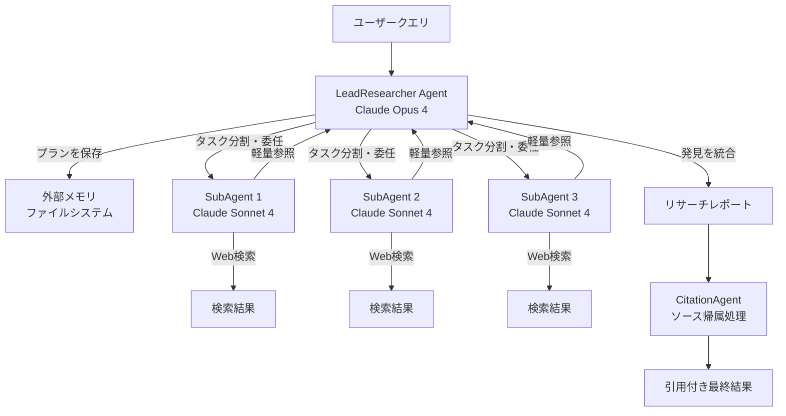

本記事は [How we built our multi-agent research system](https://www.anthropic.com/engineering/multi-agent-research-system) の解説記事です。

## ブログ概要（Summary）

Anthropicは、自社のResearch機能をorchestrator-workerパターンで構築したマルチエージェントシステムとして公開している。リードエージェント（Claude Opus 4）がクエリを分析して戦略を策定し、複数の特殊化サブエージェント（Claude Sonnet 4）を並列に生成してWeb検索を実行させる構成である。Anthropicのチームは、このマルチエージェント構成が単一エージェント（Claude Opus 4）と比較して90.2%の性能向上を達成したと報告している。一方で、リソース誤配分やタスク重複など5つの障害モードが確認されており、プロダクショントレーシング、レインボーデプロイメント、チェックポイント再開による対策が講じられている。

この記事は [Zenn記事: LangSmithでマルチエージェント協調障害を診断する実践手法](https://zenn.dev/0h_n0/articles/79f126082f4e6a) の深掘りです。

## 情報源

- **種別**: 企業テックブログ
- **URL**: [https://www.anthropic.com/engineering/multi-agent-research-system](https://www.anthropic.com/engineering/multi-agent-research-system)
- **組織**: Anthropic
- **発表日**: 2025年6月13日

## 技術的背景（Technical Background）

従来の単一エージェントによるリサーチ処理では、1つのコンテキストウィンドウ内で検索、評価、統合を逐次的に行う必要があった。この方式には2つの構造的制約がある。第一に、コンテキストウィンドウの上限（200,000トークン）に到達すると過去の調査結果が失われる。第二に、複数の情報源を並列に調査できないため、複雑なリサーチクエリの処理時間がサブエージェント数に比例して増大する。

RAG（Retrieval-Augmented Generation）も同様の制約を抱えている。事前にインデックス化された文書からの検索に依存するため、動的なWeb検索や探索的なリサーチには対応しにくい。Anthropicのチームは、これらの制約を解消するために、リサーチタスクを分解し並列実行するマルチエージェントアーキテクチャを採用した。ブログでは「multi-agent system with Claude Opus 4 as the lead agent and Claude Sonnet 4 subagents outperformed single-agent Claude Opus 4 by 90.2%」と報告されている。

## 実装アーキテクチャ（Architecture）

### Orchestrator-Workerパターンの詳細

Anthropicのリサーチシステムは、以下の5つのコンポーネントで構成されている。



**LeadResearcher Agent（Claude Opus 4）**: クエリを受け取り、リサーチ戦略を策定する。Anthropicのチームは、リードエージェントがアプローチを考え抜いた後、プランを外部メモリに保存すると説明している。これはコンテキストウィンドウが200,000トークンに近づいた際に過去の作業を失わないための設計である。

**特殊化サブエージェント（Claude Sonnet 4）**: リードエージェントから委任されたタスクを独立して実行する。各サブエージェントにはインターリーブド思考（extended thinking mode）が有効化されており、検索結果を評価しながら探索を進める。ブログによれば、サブエージェントは「pass lightweight references back to the coordinator」し、大きな出力をコンテキストにコピーするのではなく軽量な参照を返すことでトークンオーバーヘッドを削減している。

**CitationAgent**: リサーチレポートを受け取り、各主張に対する適切なソース帰属箇所を特定する専用エージェントである。

### コンテキスト管理とトークン効率

Anthropicのチームは、長期リサーチにおけるコンテキスト管理について以下の戦略を報告している。

1. **外部メモリへのプラン保存**: リードエージェントは作業の各フェーズを要約し、重要な情報を外部メモリに保存してから新しいタスクに進む
2. **クリーンコンテキストでのサブエージェント生成**: サブエージェントは毎回新しいコンテキストで起動し、リードエージェントからの「careful handoffs」で継続性を維持する
3. **アーティファクトシステム**: サブエージェントはファイルシステムに永続化する出力を作成し、会話履歴を介さず参照を返す

トークン使用量について、ブログでは「agents typically use about 4x more tokens than chat interactions, and multi-agent systems use about 15x more tokens than chats」と報告されている。ただし、トークン使用量の分散分析では「token usage by itself explains 80% of the variance」であり、モデル品質の影響も大きい。具体的には「upgrading to Claude Sonnet 4 is a larger performance gain than doubling the token budget on Claude Sonnet 3.7」と述べられている。

### リサーチ規模のスケーリングガイドライン

ブログでは、クエリの複雑さに応じた適切なリソース配分を以下のように示している。

| クエリタイプ | サブエージェント数 | ツール呼び出し回数 |
|-------------|------------------|------------------|
| 単純な事実確認 | 1 | 3-10回 |
| 直接比較 | 2-4 | 各10-15回 |
| 複雑なリサーチ | 10+ | 責任範囲を明確に分割 |

## Production Deployment Guide

Anthropicのブログで示されたorchestrator-workerパターンをAWS上で実装する際の構成を以下に示す。マルチエージェントシステムでは、リードエージェントとサブエージェントが並列に動作するため、コンピュートリソースの弾力的なスケーリングが重要になる。

### AWS実装パターン（コスト最適化重視）

**コスト試算の注意事項**: 以下のコスト試算は2026年6月時点のAWS ap-northeast-1（東京）リージョン料金に基づく概算値である。実際のコストはトラフィックパターン、リージョン、バースト使用量により変動する。最新料金は[AWS料金計算ツール](https://calculator.aws/)で確認を推奨する。

| 構成 | トラフィック | AWSサービス | 月額概算 |
|------|------------|------------|---------|
| Small | ~100 req/日 | Lambda + Bedrock + DynamoDB + SQS | $50-200 |
| Medium | ~1,000 req/日 | ECS Fargate + Bedrock + ElastiCache + SQS | $400-1,200 |
| Large | 10,000+ req/日 | EKS + Karpenter (Spot) + Bedrock + Redis | $3,000-8,000 |

マルチエージェント構成ではLLM APIコストが支配的になる。ブログの報告によればマルチエージェントはチャットの約15倍のトークンを消費するため、Bedrock Batch APIによる50%削減やPrompt Cachingによる30-90%削減が運用コストに直結する。

**Small構成の詳細**:
- Lambda（1024MB RAM, 300秒タイムアウト）: リードエージェント処理
- Step Functions: サブエージェントの並列実行オーケストレーション
- SQS: サブエージェントタスクキュー
- DynamoDB（On-Demand）: 外部メモリ（プラン保存・中間結果）
- Bedrock: Claude Sonnet呼び出し（リード/サブ共通）
- 月額: Lambda $5 + Step Functions $10 + DynamoDB $10 + Bedrock $25-175

**Large構成の詳細**:
- EKS（m7i.xlarge x 2 コントロールプレーン）: エージェントコンテナ実行
- Karpenter: Spot Instances優先の自動スケーリング（c7g.2xlarge Spot）
- Redis（ElastiCache）: 外部メモリ + 検索結果キャッシュ
- Bedrock: Claude Opus 4（リード）+ Claude Sonnet 4（サブ）
- 月額: EKS $73 + EC2 Spot $300-800 + Redis $200 + Bedrock $2,500-7,000

### Terraformインフラコード

**Small構成（Serverless: Lambda + Step Functions + DynamoDB）**:

```hcl
# --- VPC基盤（NAT Gateway不使用でコスト削減） ---
module "vpc" {
  source  = "terraform-aws-modules/vpc/aws"
  version = "~> 5.0"

  name = "multi-agent-vpc"
  cidr = "10.0.0.0/16"

  azs             = ["ap-northeast-1a", "ap-northeast-1c"]
  private_subnets = ["10.0.1.0/24", "10.0.2.0/24"]
  # NAT Gateway不使用: Lambda は VPC 外で実行しコスト削減
}

# --- IAMロール（最小権限原則） ---
resource "aws_iam_role" "lead_agent_role" {
  name = "multi-agent-lead-role"
  assume_role_policy = jsonencode({
    Version = "2012-10-17"
    Statement = [{
      Action = "sts:AssumeRole"
      Effect = "Allow"
      Principal = { Service = "lambda.amazonaws.com" }
    }]
  })
}

resource "aws_iam_role_policy" "lead_agent_policy" {
  name = "lead-agent-policy"
  role = aws_iam_role.lead_agent_role.id
  policy = jsonencode({
    Version = "2012-10-17"
    Statement = [
      {
        Effect   = "Allow"
        Action   = ["bedrock:InvokeModel"]
        Resource = "arn:aws:bedrock:ap-northeast-1::foundation-model/anthropic.claude-*"
      },
      {
        Effect   = "Allow"
        Action   = ["dynamodb:PutItem", "dynamodb:GetItem", "dynamodb:Query"]
        Resource = aws_dynamodb_table.agent_memory.arn
      },
      {
        Effect   = "Allow"
        Action   = ["states:StartExecution"]
        Resource = aws_sfn_state_machine.subagent_orchestrator.arn
      },
      {
        Effect   = "Allow"
        Action   = ["logs:CreateLogGroup", "logs:CreateLogStream", "logs:PutLogEvents"]
        Resource = "arn:aws:logs:ap-northeast-1:*:*"
      }
    ]
  })
}

# --- DynamoDB: 外部メモリ（プラン・中間結果保存） ---
resource "aws_dynamodb_table" "agent_memory" {
  name         = "agent-external-memory"
  billing_mode = "PAY_PER_REQUEST" # On-Demand でコスト最適化
  hash_key     = "session_id"
  range_key    = "memory_key"

  attribute {
    name = "session_id"
    type = "S"
  }
  attribute {
    name = "memory_key"
    type = "S"
  }

  ttl {
    attribute_name = "expires_at"
    enabled        = true
  }

  server_side_encryption {
    enabled = true # KMS暗号化
  }
}

# --- Lambda: リードエージェント処理 ---
resource "aws_lambda_function" "lead_agent" {
  function_name = "multi-agent-lead"
  runtime       = "python3.12"
  handler       = "lead_agent.handler"
  memory_size   = 1024
  timeout       = 300
  role          = aws_iam_role.lead_agent_role.arn

  environment {
    variables = {
      MEMORY_TABLE       = aws_dynamodb_table.agent_memory.name
      ORCHESTRATOR_ARN   = aws_sfn_state_machine.subagent_orchestrator.arn
      LEAD_MODEL_ID      = "anthropic.claude-sonnet-4-20250514-v1:0"
      SUBAGENT_MODEL_ID  = "anthropic.claude-sonnet-4-20250514-v1:0"
    }
  }

  tracing_config {
    mode = "Active" # X-Ray トレーシング有効化
  }
}

# --- CloudWatch アラーム（コスト監視） ---
resource "aws_cloudwatch_metric_alarm" "lambda_duration" {
  alarm_name          = "lead-agent-duration-high"
  comparison_operator = "GreaterThanThreshold"
  evaluation_periods  = 3
  metric_name         = "Duration"
  namespace           = "AWS/Lambda"
  period              = 300
  statistic           = "Average"
  threshold           = 240000 # 240秒超過でアラート
  alarm_actions       = [aws_sns_topic.alerts.arn]

  dimensions = {
    FunctionName = aws_lambda_function.lead_agent.function_name
  }
}
```

**Large構成（Container: EKS + Karpenter + Spot Instances）**:

```hcl
# --- EKSクラスタ ---
module "eks" {
  source  = "terraform-aws-modules/eks/aws"
  version = "~> 20.0"

  cluster_name    = "multi-agent-cluster"
  cluster_version = "1.31"

  vpc_id     = module.vpc.vpc_id
  subnet_ids = module.vpc.private_subnets

  cluster_endpoint_public_access = false # プライベートアクセスのみ

  eks_managed_node_groups = {
    system = {
      instance_types = ["m7i.large"]
      min_size       = 2
      max_size       = 2
      desired_size   = 2
    }
  }
}

# --- Karpenter Provisioner（Spot優先・自動スケーリング） ---
resource "kubectl_manifest" "karpenter_nodepool" {
  yaml_body = yamlencode({
    apiVersion = "karpenter.sh/v1"
    kind       = "NodePool"
    metadata   = { name = "agent-workers" }
    spec = {
      template = {
        spec = {
          requirements = [
            { key = "karpenter.sh/capacity-type", operator = "In", values = ["spot", "on-demand"] },
            { key = "node.kubernetes.io/instance-type", operator = "In",
              values = ["c7g.xlarge", "c7g.2xlarge", "m7g.xlarge"] },
          ]
          nodeClassRef = { name = "default" }
        }
      }
      limits   = { cpu = "128", memory = "256Gi" }
      disruption = {
        consolidationPolicy = "WhenEmptyOrUnderutilized"
        consolidateAfter    = "30s"
      }
    }
  })
}

# --- Secrets Manager（Bedrock設定） ---
resource "aws_secretsmanager_secret" "bedrock_config" {
  name                    = "multi-agent/bedrock-config"
  recovery_window_in_days = 7
}

# --- AWS Budgets（予算アラート） ---
resource "aws_budgets_budget" "monthly" {
  name         = "multi-agent-monthly"
  budget_type  = "COST"
  limit_amount = "5000"
  limit_unit   = "USD"
  time_unit    = "MONTHLY"

  notification {
    comparison_operator       = "GREATER_THAN"
    threshold                 = 80
    threshold_type            = "PERCENTAGE"
    notification_type         = "ACTUAL"
    subscriber_email_addresses = ["ops-team@example.com"]
  }
}
```

### 運用・監視設定

**CloudWatch Logs Insights クエリ（トークン使用量異常検知）**:

```
fields @timestamp, @message
| filter @message like /token_usage/
| stats sum(input_tokens) as total_input, sum(output_tokens) as total_output,
        count(*) as request_count by bin(1h)
| filter total_input > 500000
| sort @timestamp desc
```

**CloudWatch アラーム設定（Python）**:

```python
import boto3

def setup_token_usage_alarm(
    function_name: str,
    sns_topic_arn: str,
    threshold_ms: int = 240_000,
) -> dict:
    """Bedrock呼び出しのレイテンシ異常を検知するアラームを設定する

    Args:
        function_name: 監視対象のLambda関数名
        sns_topic_arn: アラート送信先のSNSトピックARN
        threshold_ms: アラーム閾値（ミリ秒）

    Returns:
        CloudWatch put_metric_alarm のレスポンス
    """
    cw = boto3.client("cloudwatch", region_name="ap-northeast-1")
    return cw.put_metric_alarm(
        AlarmName=f"{function_name}-duration-spike",
        MetricName="Duration",
        Namespace="AWS/Lambda",
        Statistic="p95",
        Period=300,
        EvaluationPeriods=2,
        Threshold=threshold_ms,
        ComparisonOperator="GreaterThanThreshold",
        AlarmActions=[sns_topic_arn],
        Dimensions=[{"Name": "FunctionName", "Value": function_name}],
    )
```

**X-Ray トレーシング設定（Python）**:

```python
from aws_xray_sdk.core import xray_recorder, patch_all

# boto3 の自動計装
patch_all()

@xray_recorder.capture("lead_agent_invoke")
def invoke_lead_agent(query: str, session_id: str) -> dict:
    """リードエージェントを呼び出し、X-Rayでトレースする

    Args:
        query: ユーザーのリサーチクエリ
        session_id: セッション識別子

    Returns:
        リードエージェントの実行結果
    """
    subsegment = xray_recorder.current_subsegment()
    subsegment.put_annotation("session_id", session_id)
    subsegment.put_metadata("query_length", len(query))

    # Bedrock 呼び出し（自動トレース対象）
    result = bedrock_client.invoke_model(
        modelId="anthropic.claude-sonnet-4-20250514-v1:0",
        body=build_request_body(query),
    )

    subsegment.put_metadata("output_tokens", result["usage"]["output_tokens"])
    return result
```

**Cost Explorer 自動レポート（Python）**:

```python
import boto3
from datetime import datetime, timedelta

def get_daily_cost_report(days_back: int = 1) -> dict:
    """日次コストレポートを取得し、閾値超過時にSNS通知する

    Args:
        days_back: 遡る日数（デフォルト1日）

    Returns:
        サービス別コスト辞書
    """
    ce = boto3.client("ce", region_name="us-east-1")
    end = datetime.utcnow().strftime("%Y-%m-%d")
    start = (datetime.utcnow() - timedelta(days=days_back)).strftime("%Y-%m-%d")

    response = ce.get_cost_and_usage(
        TimePeriod={"Start": start, "End": end},
        Granularity="DAILY",
        Metrics=["UnblendedCost"],
        Filter={
            "Or": [
                {"Dimensions": {"Key": "SERVICE", "Values": ["Amazon Bedrock"]}},
                {"Dimensions": {"Key": "SERVICE", "Values": ["AWS Lambda"]}},
                {"Dimensions": {"Key": "SERVICE", "Values": ["Amazon Elastic Kubernetes Service"]}},
            ]
        },
        GroupBy=[{"Type": "DIMENSION", "Key": "SERVICE"}],
    )

    costs: dict[str, float] = {}
    for group in response["ResultsByTime"][0].get("Groups", []):
        service = group["Keys"][0]
        amount = float(group["Metrics"]["UnblendedCost"]["Amount"])
        costs[service] = amount

    total = sum(costs.values())
    if total > 100.0:
        sns = boto3.client("sns", region_name="ap-northeast-1")
        sns.publish(
            TopicArn="arn:aws:sns:ap-northeast-1:123456789012:cost-alerts",
            Subject=f"Daily cost alert: ${total:.2f}",
            Message=f"Multi-agent system daily cost exceeded $100: {costs}",
        )

    return costs
```

### コスト最適化チェックリスト

**アーキテクチャ選択**:
- [ ] トラフィック量に応じた構成選択（~100 req/日: Serverless, ~1,000: Hybrid, 10,000+: Container）
- [ ] サブエージェント数の上限設定（クエリ複雑度別スケーリングルール適用）

**リソース最適化**:
- [ ] EC2/EKS: Spot Instances優先（Karpenter設定で最大90%削減）
- [ ] Reserved Instances: 1年コミットで最大72%削減
- [ ] Savings Plans: Compute Savings Plans検討
- [ ] Lambda: メモリサイズ最適化（Power Tuningで測定）
- [ ] EKS: Karpenter consolidationPolicy でアイドル時自動スケールダウン

**LLMコスト削減**:
- [ ] Bedrock Batch API使用（非同期リサーチで50%削減）
- [ ] Prompt Caching有効化（システムプロンプト共通部分で30-90%削減）
- [ ] モデル選択ロジック（リード: Opus、サブ: Sonnet で品質/コスト最適化）
- [ ] トークン数制限（サブエージェント出力を軽量参照に制限）
- [ ] 単純クエリの単一エージェント処理（不要なマルチエージェント起動を抑止）

**監視・アラート**:
- [ ] AWS Budgets設定（月次予算の80%でアラート）
- [ ] CloudWatch アラーム（Lambda実行時間、Bedrockレイテンシ）
- [ ] Cost Anomaly Detection有効化
- [ ] 日次コストレポート（Cost Explorer API + SNS通知）

**リソース管理**:
- [ ] 未使用リソース削除（定期チェック）
- [ ] タグ戦略（Project/Environment/Agent-Type でコスト配分）
- [ ] DynamoDB TTL設定（中間結果の自動削除）
- [ ] 開発環境夜間停止（EKSノードのスケールダウン）
- [ ] CloudWatch Logsのライフサイクルポリシー（30日保持）

## パフォーマンス最適化（Performance）

### 性能比較の定量分析

Anthropicのチームが報告したパフォーマンスデータを以下に整理する。

| 構成 | 性能（対単一Opus 4比） | トークン使用量（対チャット比） |
|------|----------------------|---------------------------|
| 単一 Claude Opus 4 | ベースライン (1.0x) | 約4倍 |
| マルチエージェント（Opus 4 + Sonnet 4） | +90.2% | 約15倍 |

ブログでは、トークン効率について「token usage by itself explains 80% of the variance」と報告されている。つまり、性能向上の大部分はより多くのトークンを使用して広範な検索と分析を行うことに起因する。

しかし、モデルの品質も無視できない要素である。ブログは「upgrading to Claude Sonnet 4 is a larger performance gain than doubling the token budget on Claude Sonnet 3.7」と述べている。この知見は、トークン予算の増加よりもモデルのアップグレードを優先すべき場面があることを示唆している。

並列ツール呼び出しの導入により、複雑なクエリの処理時間が最大90%短縮されたとも報告されている。この並列化には2つのレベルがある。

1. リードエージェントが3-5のサブエージェントを並列に起動する
2. 各サブエージェントが3つ以上のツールを並列に呼び出す

### トークン効率の定式化

マルチエージェントシステムのトークンコスト$C$は、以下のように概算できる。

$$
C = C_{\text{lead}} + \sum_{i=1}^{n} C_{\text{sub}_i} + C_{\text{citation}}
$$

ここで、$C_{\text{lead}}$はリードエージェントのトークンコスト、$C_{\text{sub}_i}$は$i$番目のサブエージェントのトークンコスト、$n$はサブエージェント数、$C_{\text{citation}}$は引用エージェントのトークンコストである。ブログの報告値を用いると、$C \approx 15 \times C_{\text{chat}}$となる。

## 運用での学び（Production Lessons）

### 5つの障害モードと対策

Anthropicのチームは、プロダクション運用で以下の5つの障害モードを確認したと報告している。

| 障害モード | 具体例 | 対策 |
|-----------|--------|------|
| リソース誤配分 | 単純なクエリに50サブエージェントを投入 | プロンプトにスケーリングルールを埋め込み |
| タスク重複 | 並列サブエージェントが同一検索を実行 | タスク記述に目的・出力形式・境界を明記 |
| ソース選択バイアス | SEO最適化コンテンツを選択、学術論文を無視 | ソース品質ヒューリスティクスをプロンプトに追加 |
| 検索非効率 | 過度に具体的なクエリで結果が少ない | 「短く広いクエリから始め、段階的に絞る」戦略を指示 |
| 無限探索 | 存在しないソースを延々と検索 | extended thinking modeで計画・評価を制御 |

ブログでは、これらの障害に対する根本的な解決策として「Claude 4 models can be excellent prompt engineers」と述べている。具体的には、プロンプトと障害モードを与えると、モデル自体が障害原因を診断し改善を提案できるという手法が紹介されている。

### レインボーデプロイメント

エージェントシステムに固有のデプロイ課題として、実行中のエージェントを中断できない点がある。ブログでは「rainbow deployments」という手法を採用し、「gradually shifting traffic from old to new versions while keeping both running simultaneously」していると報告されている。通常のブルーグリーンデプロイメントと異なり、複数バージョンが同時に稼働し段階的にトラフィックを移行する方式である。

### チェックポイント再開

ブログでは「minor system failures can be catastrophic for agents」と述べ、リトライロジックと定期的なチェックポイントの組み合わせを対策として報告している。ツールが失敗した場合、エージェントは通知を受けて戦略を調整できる設計になっており、ゼロから再実行する必要がない。

## 学術研究との関連（Academic Connection）

Anthropicのorchestrator-workerパターンは、マルチエージェントシステムの学術研究と密接に関連している。2024年のサーベイ論文「A Survey on LLM-based Multi-Agent System: Recent Advances and New Frontiers in Application」（arXiv:2412.17481）では、マルチエージェントの協調メカニズムとして(i)直列型マルチステージ、(ii)集合的意思決定（投票・議論）、(iii)自己改善型の3パターンが分類されている。Anthropicの設計はこのうち(i)と(iii)の要素を組み合わせたものと位置づけられる。リードエージェントによるステージ分割と、サブエージェントの結果に基づく追加リサーチ判断という自己改善ループが特徴的である。

また「Multi-Agent Collaboration Mechanisms: A Survey of LLMs」（arXiv:2501.06322）では、マルチエージェント協調が単一エージェントと比較して性能が向上する条件について分析されており、Anthropicの90.2%という改善率はこの知見と整合する。

## まとめと実践への示唆

Anthropicのマルチエージェントリサーチシステムは、orchestrator-workerパターンの実運用事例として以下の示唆を提供している。第一に、モデルの品質向上はトークン予算の増加よりもコストパフォーマンスが高い場合がある。第二に、マルチエージェント特有の5つの障害モードは、プロンプトへのスケーリングルール埋め込みとextended thinking modeで体系的に対処できる。第三に、レインボーデプロイメントやチェックポイント再開といったプロダクション運用の工夫は、エージェントシステムが従来のステートレスなAPIとは異なるデプロイ戦略を必要とすることを示している。関連するZenn記事「[LangSmithでマルチエージェント協調障害を診断する実践手法](https://zenn.dev/0h_n0/articles/79f126082f4e6a)」では、LangSmithを用いたマルチエージェント障害の診断手法が解説されており、本記事の運用での学びと併せて参照することで、構築から監視までの実践的な知識を得られる。

## 参考文献

- **Blog URL**: [How we built our multi-agent research system - Anthropic](https://www.anthropic.com/engineering/multi-agent-research-system)
- **Related Survey**: [A Survey on LLM-based Multi-Agent System (arXiv:2412.17481)](https://arxiv.org/abs/2412.17481)
- **Related Survey**: [Multi-Agent Collaboration Mechanisms: A Survey of LLMs (arXiv:2501.06322)](https://arxiv.org/abs/2501.06322)
- **AWS Reference**: [Deploy agentic systems on Amazon Bedrock with CrewAI and Terraform](https://docs.aws.amazon.com/prescriptive-guidance/latest/patterns/deploy-agentic-systems-on-amazon-bedrock-with-the-crewai-framework.html)
- **Related Zenn article**: [LangSmithでマルチエージェント協調障害を診断する実践手法](https://zenn.dev/0h_n0/articles/79f126082f4e6a)
