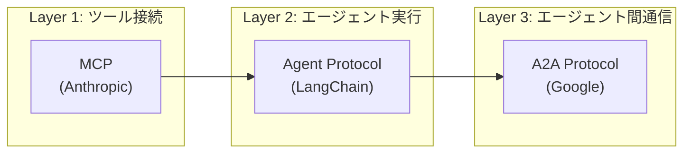
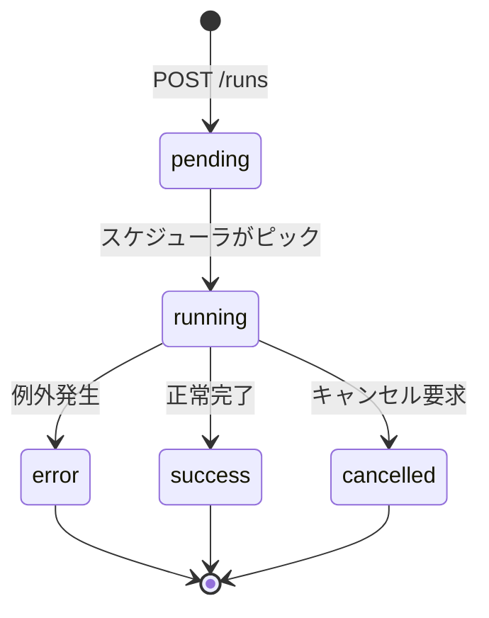
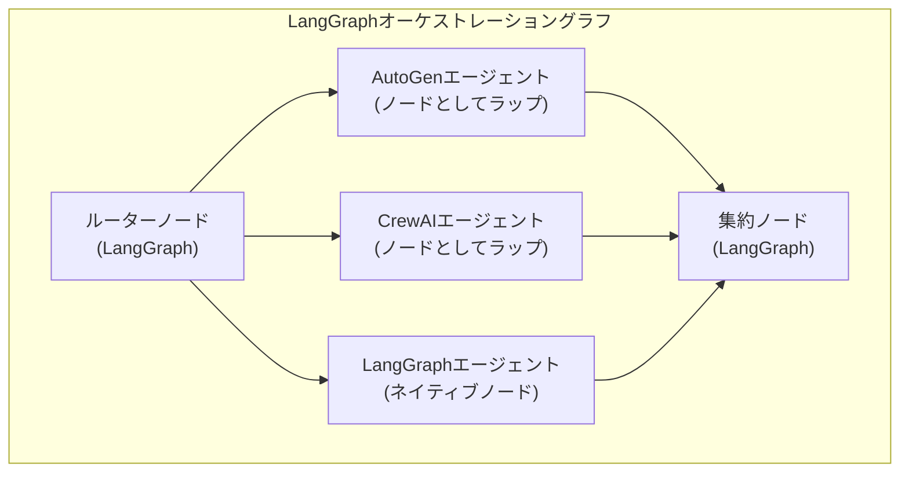

## ブログ概要（Summary）

本記事は [LangChain公式ブログ「Agent Protocol: Interoperability for LLM agents」](https://www.langchain.com/blog/agent-protocol-interoperability-for-llm-agents)（2024年11月19日公開、著者: Ankush Gola）の解説記事です。

LLMエージェントのフレームワークが乱立する中、異なるフレームワーク間でエージェントを連携させる標準的な方法が求められています。このブログでは、LangChainが発表した**Agent Protocol**（エージェント通信のオープンソース標準インターフェース）を中心に、4つの主要発表が紹介されています。Agent Protocolは**Runs**（エージェント実行API）、**Threads**（マルチターン会話管理）、**Store**（長期メモリ管理）の3つのコア概念で構成され、AutoGenやCrewAIといった他フレームワークのエージェントをLangGraphノードとしてラップし、単一のグラフ内で混合フレームワークのマルチエージェントシステムを実現する手法が示されています。

この記事は [Zenn記事: A2Aプロトコルで異種フレームワークのエージェントを連携させる受発注自動化と障害分離設計](https://zenn.dev/0h_n0/articles/40993cd9ca8f6f) の深掘りです。

## 情報源

- **種別**: 企業テックブログ（LangChain公式）
- **URL**: [https://www.langchain.com/blog/agent-protocol-interoperability-for-llm-agents](https://www.langchain.com/blog/agent-protocol-interoperability-for-llm-agents)
- **組織**: LangChain Inc.
- **著者**: Ankush Gola
- **発表日**: 2024年11月19日

## 技術的背景（Technical Background）

### エージェント相互運用性の課題

2024年後半の時点で、LLMエージェントフレームワークは群雄割拠の状態にありました。LangGraph、AutoGen（Microsoft）、CrewAI、LlamaIndex等がそれぞれ独自のAPIとデータモデルを持ち、あるフレームワークで構築したエージェントを別のフレームワークから呼び出すには、ラッパーコードを個別に実装する必要がありました。

この問題はマルチエージェントシステムにおいて特に深刻です。例えば、AutoGenのグループチャットで構築された意思決定エージェントと、CrewAIのCrew構造で構築されたリサーチエージェントを組み合わせたい場合、両フレームワークの内部APIに依存したアダプタ層を実装しなければなりません。フレームワークのバージョンアップに伴いAPIが変更されると、このアダプタ層が破綻するリスクがあります。

### プロトコル標準化の系譜

エージェント通信の標準化には、大きく分けて3つのレイヤーが存在します。

1. **ツール接続**: MCP（Model Context Protocol、Anthropic、2024年11月）がLLMとツール間の接続を標準化
2. **エージェント実行**: Agent Protocol（LangChain、2024年11月）がエージェントのライフサイクル管理を標準化
3. **エージェント間通信**: A2A（Agent-to-Agent Protocol、Google、2025年4月）がエージェント間のメッセージ交換を標準化

Zenn記事で解説されているA2Aプロトコルは、このうちレイヤー3に位置します。A2Aは2026年時点で150以上の組織が本番運用しており、Linux Foundation管理下でオープンスタンダードとして発展しています。一方、本記事で解説するAgent Protocolはレイヤー2に位置し、単一のエージェントをどのように実行・管理するかという問題に焦点を当てています。

LangChainチームは「MCPがツール側を標準化するならば、エージェント側にも同様の標準インターフェースが必要である」と述べており、Agent Protocolはこの認識に基づいて設計されています。



## 実装アーキテクチャ（Architecture）

### Agent Protocol仕様: 3つのコア概念

ブログでは、Agent Protocolを3つのコア概念で定義しています。

#### 1. Runs — エージェント実行API

Runはエージェントの単一実行を表す概念です。REST APIとして以下のエンドポイントが提供されます。

```
POST   /runs            # 新しいRunを作成・実行
GET    /runs/{run_id}   # Runの状態を取得
POST   /runs/{run_id}/cancel  # 実行中のRunをキャンセル
```

ブログによると、Runは以下の状態遷移を持ちます。



各Runは`input`（入力データ）と`output`（出力データ）を持ち、ストリーミング応答にも対応しています。重要な設計判断として、Runのインターフェースはフレームワーク非依存であり、LangGraph以外のフレームワークで構築されたエージェントも同じAPIで実行できます。

#### 2. Threads — マルチターン会話管理

Threadは複数のRunをまとめる会話セッションの概念です。

```
POST   /threads                    # 新しいThreadを作成
GET    /threads/{thread_id}        # Threadの状態を取得
POST   /threads/{thread_id}/runs   # Thread内で新しいRunを実行
GET    /threads/{thread_id}/state  # Threadの現在の状態を取得
```

Threadを使用することで、マルチターン会話においてエージェントが過去のやり取りを参照できます。LangGraphの`StateGraph`で定義された状態がThread単位で永続化され、Run間で共有されます。

```python
from langgraph_sdk import get_client

client = get_client(url="http://localhost:8123")

# Threadの作成
thread = await client.threads.create()

# Thread内でRunを実行（会話の1ターン目）
run = await client.runs.create(
    thread_id=thread["thread_id"],
    assistant_id="my_agent",
    input={"messages": [{"role": "user", "content": "RAGとは何ですか？"}]},
)

# 同じThread内で2ターン目を実行（過去の会話を保持）
run2 = await client.runs.create(
    thread_id=thread["thread_id"],
    assistant_id="my_agent",
    input={"messages": [{"role": "user", "content": "具体的な実装例を教えてください"}]},
)
```

#### 3. Store — 長期メモリ管理

Storeは会話セッション（Thread）を超えた長期記憶を提供する名前空間付きKey-Valueストアです。

```
PUT    /store/items                 # アイテムの保存
GET    /store/items                 # アイテムの検索
DELETE /store/items                 # アイテムの削除
POST   /store/items/search         # セマンティック検索
```

ブログでは、Storeの用途として以下が挙げられています。

- **ユーザープリファレンス**: ユーザーごとの設定・好みの永続化
- **学習結果**: エージェントが過去の実行から学んだ知識の蓄積
- **共有コンテキスト**: 複数エージェント間でのナレッジ共有

Storeは名前空間（namespace）でデータを分離し、マルチテナント環境での安全な運用を支援します。

```python
# ユーザーの好みを保存
await client.store.put_item(
    namespace=["users", "user_123", "preferences"],
    key="language",
    value={"preferred": "ja", "fallback": "en"},
)

# 保存した好みを検索
items = await client.store.search_items(
    namespace_prefix=["users", "user_123"],
)
```

### クロスフレームワーク統合アーキテクチャ

ブログの中核をなすのが、異なるフレームワークで構築されたエージェントをLangGraphのノードとしてラップし、単一のグラフで統合する手法です。



#### AutoGenエージェントのラップ

ブログでは、AutoGenのConversableAgentをLangGraphノードとしてラップする方法が示されています。

```python
from typing import TypedDict
from autogen import ConversableAgent
from langgraph.graph import StateGraph


class AgentState(TypedDict):
    """グラフ全体の共有状態"""
    messages: list[dict]
    research_result: str
    analysis_result: str


def create_autogen_node(agent: ConversableAgent):
    """AutoGenエージェントをLangGraphノード関数に変換するファクトリ"""
    def node_fn(state: AgentState) -> dict:
        last_message = state["messages"][-1]["content"]
        # AutoGenエージェントの実行
        reply = agent.generate_reply(
            messages=[{"role": "user", "content": last_message}]
        )
        return {"research_result": reply}
    return node_fn


# AutoGenエージェントの作成
research_agent = ConversableAgent(
    name="researcher",
    system_message="あなたは技術リサーチの専門家です。",
    llm_config={"model": "gpt-4o"},
)

# LangGraphノードとして登録
graph = StateGraph(AgentState)
graph.add_node("research", create_autogen_node(research_agent))
```

#### CrewAIエージェントのラップ

同様に、CrewAIのAgentとTaskもLangGraphノードとしてラップできます。

```python
from crewai import Agent, Task, Crew


def create_crewai_node(crew: Crew):
    """CrewAI Crewの実行結果をLangGraphノードとして返すファクトリ"""
    def node_fn(state: AgentState) -> dict:
        result = crew.kickoff(
            inputs={"query": state["messages"][-1]["content"]}
        )
        return {"analysis_result": result.raw}
    return node_fn


# CrewAIエージェントの作成
analyst = Agent(
    role="データ分析者",
    goal="定量的な分析結果を提供する",
    backstory="統計学と機械学習の専門家",
)

analysis_task = Task(
    description="以下のクエリについて分析してください: {query}",
    expected_output="分析レポート",
    agent=analyst,
)

crew = Crew(agents=[analyst], tasks=[analysis_task])

# LangGraphノードとして登録
graph.add_node("analysis", create_crewai_node(crew))
```

#### 統合グラフの構築

```python
from langgraph.graph import END


def router(state: AgentState) -> str:
    """入力内容に応じてルーティング"""
    content = state["messages"][-1]["content"]
    if "調査" in content or "research" in content.lower():
        return "research"
    elif "分析" in content or "analysis" in content.lower():
        return "analysis"
    return "native_agent"


def aggregate(state: AgentState) -> dict:
    """各エージェントの結果を集約"""
    results = []
    if state.get("research_result"):
        results.append(f"リサーチ結果: {state['research_result']}")
    if state.get("analysis_result"):
        results.append(f"分析結果: {state['analysis_result']}")
    combined = "\n\n".join(results)
    return {
        "messages": state["messages"] + [
            {"role": "assistant", "content": combined}
        ]
    }


graph.add_node("aggregate", aggregate)
graph.add_conditional_edges("__start__", router)
graph.add_edge("research", "aggregate")
graph.add_edge("analysis", "aggregate")
graph.add_edge("aggregate", END)

app = graph.compile()
```

### デプロイメント基盤

ブログの4つ目の発表として、LangGraph Platformでの非LangGraphフレームワークのデプロイサポートが紹介されています。LangChainチームは、LangGraph Platformが提供するインフラ機能として以下を挙げています。

- **水平スケーリング**: タスクキューベースのワーカー分散
- **永続化層**: チェックポイントとメモリの自動永続化
- **ストリーミング**: Server-Sent Events（SSE）による中間結果のリアルタイム配信
- **ヒューマン・イン・ザ・ループ**: 実行途中での人間の承認・介入

ローカル開発では、`pip install "langgraph-cli[inmem]==0.1.55"` を使用して `langgraph dev` コマンドでローカルサーバーを起動し、LangGraph Studio Localと呼ばれるIDEで可視化・デバッグが可能です。

```bash
# ローカル開発環境のセットアップ
pip install "langgraph-cli[inmem]==0.1.55"

# 開発サーバーの起動
langgraph dev --host 0.0.0.0 --port 8123
```

## Production Deployment Guide

### AWS実装パターン（コスト最適化重視）

Agent ProtocolベースのマルチエージェントシステムをAWSにデプロイする際の推奨構成を、トラフィック量別に示します。

| 項目 | Small (~100 req/日) | Medium (~1,000 req/日) | Large (10,000+ req/日) |
|------|--------------------|-----------------------|------------------------|
| **コンピュート** | Lambda (512MB, 300s timeout) | ECS Fargate (1vCPU, 2GB) | EKS + Karpenter (Spot優先) |
| **LLM** | Bedrock (Claude Sonnet) | Bedrock (Claude Sonnet) | Bedrock Batch API + Prompt Caching |
| **状態管理** | DynamoDB On-Demand | DynamoDB Provisioned + DAX | ElastiCache Redis + DynamoDB |
| **タスクキュー** | SQS Standard | SQS FIFO + Dead Letter Queue | Amazon MQ (RabbitMQ) |
| **永続化** | S3 Standard | S3 + EFS | S3 + EBS gp3 |
| **API Gateway** | API Gateway REST | API Gateway WebSocket | ALB + NLB |
| **月額概算** | $80-150 | $400-800 | $2,500-5,000 |

**注意**: 上記コスト試算は2026年6月時点のAWS ap-northeast-1（東京）リージョン料金に基づく概算値です。実際のコストはトラフィックパターン、リージョン、バースト使用量により変動します。最新料金は[AWS料金計算ツール](https://calculator.aws/)で確認してください。

**コスト削減テクニック**:
- **Spot Instances活用**: EKSワーカーノードでSpot Instancesを使用し、On-Demand比で最大90%削減（m6i.xlarge: On-Demand $0.192/h → Spot $0.019-0.057/h）
- **Reserved Instances**: 1年コミットで最大72%削減（Medium構成のECS Fargate向け）
- **Bedrock Batch API**: 非リアルタイム処理でBatch APIを使用し50%削減
- **Prompt Caching**: 繰り返しプロンプトのキャッシュで30-90%削減

### Terraformインフラコード

#### Small構成（Serverless）

```hcl
# =============================================================
# Agent Protocol Multi-Agent System — Small (Serverless)
# Lambda + Bedrock + DynamoDB + SQS
# =============================================================

terraform {
  required_version = ">= 1.9"
  required_providers {
    aws = {
      source  = "hashicorp/aws"
      version = "~> 5.60"
    }
  }
}

provider "aws" {
  region = "ap-northeast-1"
}

# --- VPC（NAT Gateway不使用でコスト削減） ---
resource "aws_vpc" "main" {
  cidr_block           = "10.0.0.0/16"
  enable_dns_support   = true
  enable_dns_hostnames = true
  tags = { Name = "agent-protocol-vpc" }
}

resource "aws_subnet" "private" {
  count             = 2
  vpc_id            = aws_vpc.main.id
  cidr_block        = cidrsubnet(aws_vpc.main.cidr_block, 8, count.index)
  availability_zone = data.aws_availability_zones.az.names[count.index]
  tags = { Name = "agent-protocol-private-${count.index}" }
}

data "aws_availability_zones" "az" { state = "available" }

# --- VPC Endpoints（Lambda → Bedrock/DynamoDB/SQS） ---
resource "aws_vpc_endpoint" "bedrock" {
  vpc_id              = aws_vpc.main.id
  service_name        = "com.amazonaws.ap-northeast-1.bedrock-runtime"
  vpc_endpoint_type   = "Interface"
  subnet_ids          = aws_subnet.private[*].id
  private_dns_enabled = true
}

resource "aws_vpc_endpoint" "dynamodb" {
  vpc_id       = aws_vpc.main.id
  service_name = "com.amazonaws.ap-northeast-1.dynamodb"
}

# --- IAMロール（最小権限） ---
resource "aws_iam_role" "lambda_exec" {
  name = "agent-protocol-lambda-role"
  assume_role_policy = jsonencode({
    Version = "2012-10-17"
    Statement = [{
      Action = "sts:AssumeRole"
      Effect = "Allow"
      Principal = { Service = "lambda.amazonaws.com" }
    }]
  })
}

resource "aws_iam_role_policy" "lambda_policy" {
  name = "agent-protocol-lambda-policy"
  role = aws_iam_role.lambda_exec.id
  policy = jsonencode({
    Version = "2012-10-17"
    Statement = [
      {
        Effect   = "Allow"
        Action   = ["bedrock:InvokeModel", "bedrock:InvokeModelWithResponseStream"]
        Resource = "arn:aws:bedrock:ap-northeast-1::foundation-model/anthropic.claude-*"
      },
      {
        Effect   = "Allow"
        Action   = ["dynamodb:GetItem", "dynamodb:PutItem", "dynamodb:Query", "dynamodb:UpdateItem"]
        Resource = aws_dynamodb_table.threads.arn
      },
      {
        Effect   = "Allow"
        Action   = ["sqs:SendMessage", "sqs:ReceiveMessage", "sqs:DeleteMessage"]
        Resource = aws_sqs_queue.task_queue.arn
      },
      {
        Effect   = "Allow"
        Action   = ["logs:CreateLogGroup", "logs:CreateLogStream", "logs:PutLogEvents"]
        Resource = "arn:aws:logs:ap-northeast-1:*:*"
      }
    ]
  })
}

# --- DynamoDB（Thread/Store永続化） ---
resource "aws_dynamodb_table" "threads" {
  name         = "agent-protocol-threads"
  billing_mode = "PAY_PER_REQUEST"  # On-Demand（Small構成向け）
  hash_key     = "thread_id"
  range_key    = "run_id"

  attribute {
    name = "thread_id"
    type = "S"
  }
  attribute {
    name = "run_id"
    type = "S"
  }

  point_in_time_recovery { enabled = true }
  server_side_encryption { enabled = true }  # KMS暗号化

  tags = { Environment = "production", Service = "agent-protocol" }
}

# --- SQS（タスクキュー） ---
resource "aws_sqs_queue" "task_queue" {
  name                       = "agent-protocol-tasks"
  visibility_timeout_seconds = 300  # Lambda timeout と合わせる
  message_retention_seconds  = 86400

  redrive_policy = jsonencode({
    deadLetterTargetArn = aws_sqs_queue.dlq.arn
    maxReceiveCount     = 3
  })
}

resource "aws_sqs_queue" "dlq" {
  name                      = "agent-protocol-tasks-dlq"
  message_retention_seconds = 1209600  # 14日
}

# --- Lambda関数 ---
resource "aws_lambda_function" "agent_runner" {
  function_name = "agent-protocol-runner"
  runtime       = "python3.12"
  handler       = "main.handler"
  role          = aws_iam_role.lambda_exec.arn
  timeout       = 300
  memory_size   = 512

  filename         = "lambda.zip"
  source_code_hash = filebase64sha256("lambda.zip")

  environment {
    variables = {
      THREADS_TABLE = aws_dynamodb_table.threads.name
      TASK_QUEUE    = aws_sqs_queue.task_queue.url
      MODEL_ID      = "anthropic.claude-sonnet-4-20250514"
    }
  }

  tracing_config { mode = "Active" }  # X-Ray有効化
}

# --- CloudWatchアラーム（コスト監視） ---
resource "aws_cloudwatch_metric_alarm" "lambda_errors" {
  alarm_name          = "agent-protocol-lambda-errors"
  comparison_operator = "GreaterThanThreshold"
  evaluation_periods  = 2
  metric_name         = "Errors"
  namespace           = "AWS/Lambda"
  period              = 300
  statistic           = "Sum"
  threshold           = 10
  alarm_description   = "Lambda errors exceeding threshold"
  dimensions = { FunctionName = aws_lambda_function.agent_runner.function_name }
}
```

#### Large構成（Container）

```hcl
# =============================================================
# Agent Protocol Multi-Agent System — Large (Container)
# EKS + Karpenter + Spot Instances
# =============================================================

module "eks" {
  source  = "terraform-aws-modules/eks/aws"
  version = "~> 20.24"

  cluster_name    = "agent-protocol-cluster"
  cluster_version = "1.31"

  vpc_id     = aws_vpc.main.id
  subnet_ids = aws_subnet.private[*].id

  cluster_endpoint_public_access = false  # セキュリティ: プライベートのみ

  eks_managed_node_groups = {
    system = {
      instance_types = ["m6i.large"]
      min_size       = 2
      max_size       = 4
      desired_size   = 2
    }
  }
}

# --- Karpenter Provisioner（Spot優先で90%削減） ---
resource "kubectl_manifest" "karpenter_nodepool" {
  yaml_body = yamlencode({
    apiVersion = "karpenter.sh/v1"
    kind       = "NodePool"
    metadata   = { name = "agent-workers" }
    spec = {
      template = {
        spec = {
          requirements = [
            { key = "karpenter.sh/capacity-type", operator = "In", values = ["spot", "on-demand"] },
            { key = "node.kubernetes.io/instance-type", operator = "In",
              values = ["m6i.xlarge", "m6i.2xlarge", "m7i.xlarge", "m7i.2xlarge"] },
          ]
          nodeClassRef = { group = "karpenter.k8s.aws", kind = "EC2NodeClass", name = "default" }
        }
      }
      limits   = { cpu = "100", memory = "400Gi" }
      disruption = {
        consolidationPolicy = "WhenEmptyOrUnderutilized"
        consolidateAfter    = "30s"
      }
    }
  })
}

# --- Secrets Manager（Bedrock設定） ---
resource "aws_secretsmanager_secret" "agent_config" {
  name       = "agent-protocol/config"
  kms_key_id = aws_kms_key.main.arn
}

# --- AWS Budgets（月次予算アラート） ---
resource "aws_budgets_budget" "monthly" {
  name         = "agent-protocol-monthly"
  budget_type  = "COST"
  limit_amount = "5000"
  limit_unit   = "USD"
  time_unit    = "MONTHLY"

  notification {
    comparison_operator       = "GREATER_THAN"
    threshold                 = 80
    threshold_type            = "PERCENTAGE"
    notification_type         = "FORECASTED"
    subscriber_email_addresses = ["ops@example.com"]
  }
}
```

### 運用・監視設定

#### CloudWatch Logs Insights クエリ

```
# コスト異常検知: 1時間あたりのBedrock呼び出し回数とトークン使用量
fields @timestamp, @message
| filter @message like /bedrock/
| stats count() as invocations,
        sum(input_tokens) as total_input_tokens,
        sum(output_tokens) as total_output_tokens
  by bin(1h) as hour
| sort hour desc
```

```
# レイテンシ分析: エージェント実行時間のP50/P95/P99
fields @timestamp, run_id, duration_ms
| filter event = "run.completed"
| stats pct(duration_ms, 50) as p50,
        pct(duration_ms, 95) as p95,
        pct(duration_ms, 99) as p99
  by bin(1h) as hour
```

#### CloudWatchアラーム設定

```python
import boto3

cloudwatch = boto3.client("cloudwatch", region_name="ap-northeast-1")


def create_token_usage_alarm(function_name: str, threshold: int = 100000) -> None:
    """Bedrockトークン使用量スパイク検知アラームを作成する"""
    cloudwatch.put_metric_alarm(
        AlarmName=f"agent-protocol-token-spike-{function_name}",
        MetricName="InputTokenCount",
        Namespace="AWS/Bedrock",
        Statistic="Sum",
        Period=3600,
        EvaluationPeriods=1,
        Threshold=threshold,
        ComparisonOperator="GreaterThanThreshold",
        AlarmActions=["arn:aws:sns:ap-northeast-1:ACCOUNT_ID:ops-alerts"],
        AlarmDescription="Bedrock input token usage exceeded threshold",
    )
```

#### X-Rayトレーシング設定

```python
from aws_xray_sdk.core import xray_recorder, patch_all

# boto3の自動計装
patch_all()


def trace_agent_run(run_id: str, agent_type: str) -> None:
    """エージェント実行のトレーシングにアノテーションとメタデータを記録する"""
    segment = xray_recorder.current_segment()
    segment.put_annotation("run_id", run_id)
    segment.put_annotation("agent_type", agent_type)
    segment.put_metadata("config", {
        "model": "anthropic.claude-sonnet-4-20250514",
        "max_tokens": 4096,
        "temperature": 0.7,
    })
```

#### Cost Explorer自動レポート

```python
import datetime

import boto3


def get_daily_cost_report() -> dict:
    """日次コストレポートを取得し、閾値超過時にSNS通知を送信する"""
    ce = boto3.client("ce", region_name="us-east-1")
    sns = boto3.client("sns", region_name="ap-northeast-1")

    today = datetime.date.today()
    yesterday = today - datetime.timedelta(days=1)

    response = ce.get_cost_and_usage(
        TimePeriod={
            "Start": yesterday.isoformat(),
            "End": today.isoformat(),
        },
        Granularity="DAILY",
        Metrics=["UnblendedCost"],
        Filter={
            "Tags": {
                "Key": "Service",
                "Values": ["agent-protocol"],
            }
        },
        GroupBy=[{"Type": "DIMENSION", "Key": "SERVICE"}],
    )

    total_cost = sum(
        float(g["Metrics"]["UnblendedCost"]["Amount"])
        for group in response["ResultsByTime"]
        for g in group["Groups"]
    )

    if total_cost > 100.0:
        sns.publish(
            TopicArn="arn:aws:sns:ap-northeast-1:ACCOUNT_ID:cost-alerts",
            Subject="Agent Protocol Daily Cost Alert",
            Message=f"Daily cost: ${total_cost:.2f} (threshold: $100.00)",
        )

    return {"date": yesterday.isoformat(), "total_cost": total_cost}
```

### コスト最適化チェックリスト

**アーキテクチャ選択**:
- [ ] トラフィック量に応じた構成を選択（100 req/日以下ならServerless、1,000+ならContainer）
- [ ] エージェント応答の即時性要件を確認（非同期許容ならBatch API活用）

**リソース最適化**:
- [ ] EC2/EKS: Spot Instances優先（On-Demand比90%削減）
- [ ] Reserved Instances: 1年コミットで72%削減
- [ ] Savings Plans: Compute Savings Plansの検討
- [ ] Lambda: メモリサイズの最適化（Power Tuningで検証）
- [ ] ECS/EKS: アイドル時のスケールダウン（Karpenter `consolidateAfter: 30s`）
- [ ] NAT Gateway: VPC Endpointで代替（$32/月 → $0）

**LLMコスト削減**:
- [ ] Bedrock Batch API: 非リアルタイム処理で50%削減
- [ ] Prompt Caching: system promptのキャッシュで30-90%削減
- [ ] モデル選択ロジック: 簡単なタスクはHaikuに振り分け
- [ ] トークン数制限: max_tokensの適切な設定
- [ ] レスポンスキャッシュ: 同一入力への応答をElastiCacheに保存

**監視・アラート**:
- [ ] AWS Budgets: 月次予算アラート（80%/100%閾値）
- [ ] CloudWatch アラーム: トークン使用量・Lambda実行時間
- [ ] Cost Anomaly Detection: 自動異常検知の有効化
- [ ] 日次コストレポート: Cost Explorer + SNS通知
- [ ] X-Rayトレーシング: ボトルネック分析

**リソース管理**:
- [ ] 未使用リソース削除: DynamoDB TTLでセッション自動削除
- [ ] タグ戦略: Service/Environment/Ownerタグの一貫付与
- [ ] ライフサイクルポリシー: S3チェックポイントの30日後Glacier移行
- [ ] 開発環境夜間停止: EKSノードの夜間スケールダウン
- [ ] CloudWatch Logs保持期間: 30日に設定（デフォルト無期限を変更）

## パフォーマンス最適化（Performance）

### エージェント実行レイテンシの分析

マルチエージェントシステムにおけるレイテンシは、主に3つの要因で構成されます。

$$
T_{\text{total}} = T_{\text{routing}} + \max_{i \in \text{agents}} T_{\text{agent}_i} + T_{\text{aggregation}}
$$

ここで、$T_{\text{routing}}$はルーティング判定の時間、$T_{\text{agent}_i}$は各エージェントの実行時間、$T_{\text{aggregation}}$は結果集約の時間です。並列実行時は最も遅いエージェントがボトルネックとなるため、$\max$を使用しています。

ブログではLangGraph Platformのタスクキューが水平スケーリングを実現すると述べられています。具体的には、以下のチューニングポイントが考えられます。

- **並列実行**: 独立したエージェントノードは並列に実行可能（`fan-out`パターン）
- **ストリーミング**: SSEによる中間結果の配信で体感レイテンシを短縮
- **チェックポイント粒度**: ノード単位でのチェックポイントにより、障害時の再実行コストを最小化

### フレームワーク間オーバーヘッド

異なるフレームワークのエージェントをラップする際のオーバーヘッドとして、以下が挙げられます。

| オーバーヘッド要因 | 影響度 | 対策 |
|------------------|--------|------|
| シリアライゼーション（State変換） | 低（数ms） | Pydanticモデルの共通化 |
| プロセス間通信（サブプロセス実行） | 中（10-50ms） | インプロセス実行を優先 |
| メモリコピー（State複製） | 低-中 | 参照渡し（CoW）の活用 |

## 運用での学び（Production Lessons）

### 1. フレームワーク間の状態変換に関する課題

ブログの内容から、運用時に注意すべき点として以下が推測されます。

- **状態モデルの不整合**: AutoGenの`ChatResult`、CrewAIの`TaskOutput`、LangGraphの`State`はそれぞれ異なるデータモデルを持つ。ラップ関数内での変換ロジックが重要
- **エラー伝播**: 子フレームワーク内で発生した例外が親グラフに適切に伝播されない場合、サイレント失敗のリスクがある
- **依存関係の衝突**: AutoGen、CrewAI、LangGraphが依存するライブラリバージョンが衝突する場合がある。Dockerコンテナ分離またはvirtualenv分離が推奨される

### 2. Agent Protocol APIのバージョニング

Agent Protocolは発表時点（2024年11月）ではバージョン1の位置づけであり、ブログ発表後もAPIに変更が加えられる可能性があります。本番運用ではAPIバージョンの固定とマイグレーション計画が必要です。

### 3. モニタリング戦略

マルチフレームワーク環境では、各フレームワークのログフォーマットが異なるため、構造化ログの統一が重要です。

```python
import json
import logging
import time
import uuid


def create_structured_logger(agent_type: str, framework: str) -> logging.Logger:
    """フレームワーク横断の構造化ログを生成するロガーを作成する"""
    logger = logging.getLogger(f"agent.{agent_type}")

    class StructuredFormatter(logging.Formatter):
        def format(self, record: logging.LogRecord) -> str:
            log_entry = {
                "event": record.getMessage(),
                "level": record.levelname,
                "ts": time.time(),
                "request_id": getattr(record, "request_id", str(uuid.uuid4())),
                "agent_type": agent_type,
                "framework": framework,
            }
            if record.exc_info:
                log_entry["error.type"] = record.exc_info[0].__name__ if record.exc_info[0] else None
                log_entry["error.message"] = str(record.exc_info[1]) if record.exc_info[1] else None
            return json.dumps(log_entry, default=str)

    handler = logging.StreamHandler()
    handler.setFormatter(StructuredFormatter())
    logger.addHandler(handler)
    return logger
```

## 学術研究との関連（Academic Connection）

### マルチエージェントシステムの通信プロトコル

エージェント間通信の標準化は、分散AIシステムの研究において古くから取り組まれてきた課題です。FIPAのACL（Agent Communication Language、2002年）は初期のエージェント通信標準でしたが、LLMベースのエージェントには直接適用が困難でした。Agent Protocolは、REST APIベースの実用的なアプローチでこの課題に取り組んでおり、FIPAの形式的な仕様とは異なるプラグマティックな路線をとっています。

### オーケストレーションパターン

ブログで示されたLangGraphによる統合パターンは、マイクロサービスアーキテクチャのオーケストレーションパターン（Saga Pattern等）と類似した設計思想を持っています。各エージェントを独立したサービスとして扱い、中央のオーケストレータ（LangGraph）が実行順序と状態管理を担当する構造は、分散システムの設計パターンを踏襲したものと解釈できます。Zenn記事で解説されているA2Aプロトコルの障害分離設計も、このオーケストレーションパターンの延長線上に位置づけられます。

### Agent Protocol と A2A の補完関係

Agent ProtocolとA2Aは競合するものではなく、補完的な関係にあります。Agent Protocolは「単一エージェントをどう実行・管理するか」（エージェントのライフサイクル管理）を規定し、A2Aは「複数のエージェントがどう相互通信するか」（エージェント間メッセージ交換）を規定します。2026年時点では、CrewAIがA2Aプロトコルサポートを追加済みであり、Google ADKがA2Aネイティブサポートを通じてLangGraphやCrewAIエージェントを呼び出せるようになっています。

## まとめと実践への示唆

LangChainが発表したAgent Protocolは、LLMエージェントのフレームワーク間相互運用性という実務上の課題に対して、REST APIベースの標準インターフェースを提供するものです。Runs・Threads・Storeの3つのコア概念により、エージェントの実行管理・会話永続化・長期メモリの標準化が図られています。

実務への示唆として、以下の3点が挙げられます。

1. **フレームワーク選択の柔軟性**: AutoGen、CrewAI等の既存エージェントをLangGraphノードとしてラップすることで、フレームワーク固有の強みを活かしつつ統合が可能になる
2. **段階的な採用**: 既存システムを一括移行する必要はなく、個々のエージェントを段階的にAgent Protocol対応にすることでリスクを低減できる
3. **A2Aとの組み合わせ**: Zenn記事で解説されているA2Aプロトコルとの組み合わせにより、ライフサイクル管理（Agent Protocol）と分散通信（A2A）の両方を標準化できる

## 参考文献

- **Blog URL**: [https://www.langchain.com/blog/agent-protocol-interoperability-for-llm-agents](https://www.langchain.com/blog/agent-protocol-interoperability-for-llm-agents)
- **Agent Protocol Spec**: [https://github.com/langchain-ai/agent-protocol](https://github.com/langchain-ai/agent-protocol)
- **LangGraph Documentation**: [https://langchain-ai.github.io/langgraph/](https://langchain-ai.github.io/langgraph/)
- **A2A Protocol**: [https://github.com/google/A2A](https://github.com/google/A2A)
- **MCP (Model Context Protocol)**: [https://modelcontextprotocol.io/](https://modelcontextprotocol.io/)
- **Related Zenn article**: [https://zenn.dev/0h_n0/articles/40993cd9ca8f6f](https://zenn.dev/0h_n0/articles/40993cd9ca8f6f)
