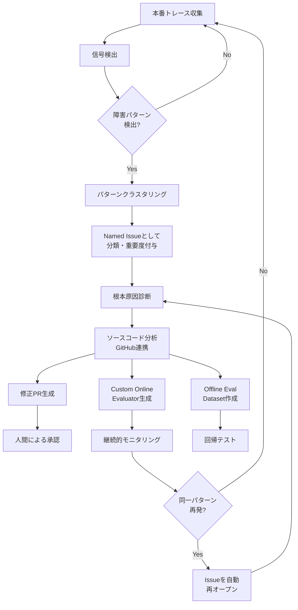

本記事は [Introducing LangSmith Engine](https://www.langchain.com/blog/introducing-langsmith-engine) の解説記事です。

## ブログ概要（Summary）

LangSmith Engineは、LangChainが2026年5月のInterrupt 2026カンファレンスでパブリックベータとして発表した機能である。本番環境のトレースデータを継続的に監視し、障害検出、パターンクラスタリング、根本原因診断、修正Pull Request生成、回帰防止用Evaluator作成までを自動化するクローズドループシステムとして設計されている。LangChainは「人間が介入するのは修正の承認ステップのみ」と説明しており、従来のObservabilityツールが提供する「可視化→人間の判断→手動修正」のワークフローを根本から変えることを目指している。

この記事は [Zenn記事: LangSmithでマルチエージェント協調障害を診断する実践手法](https://zenn.dev/0h_n0/articles/79f126082f4e6a) の深掘りです。

## 情報源

- **種別**: 企業テックブログ
- **URL**: [https://www.langchain.com/blog/introducing-langsmith-engine](https://www.langchain.com/blog/introducing-langsmith-engine)
- **組織**: LangChain
- **発表日**: 2026年5月13日

## 技術的背景（Technical Background）

LLMベースのエージェントシステムでは、障害の原因特定が従来のソフトウェアと比較して困難である。その理由は主に3つある。

第一に、LLMの出力は非決定的であるため、同一入力に対して異なるステップ系列が生成される。第二に、マルチエージェント構成では障害が伝搬し、根本原因と表面的なエラーの間に複数のエージェント呼び出しが挟まるため因果関係の追跡が難しい。第三に、プロンプトの微細な変更がシステム全体の挙動に予測困難な影響を与える。

従来のObservabilityツール（Weights & Biases、Arize Phoenix、Honeyhive等）は、トレースの可視化とメトリクス集約を提供するが、「可視化した結果を見て人間が判断し、手動で修正する」というワークフローが前提であった。LangSmith Engineは、この検出から修正までのループを自動化することで、障害対応の所要時間短縮を目指している。

この課題は学術的にも研究が進んでおり、LLMを活用した自動バグ局所化と自動プログラム修正の分野で多数の研究が発表されている。

## 実装アーキテクチャ（Architecture）

### Engineのクローズドループ設計

LangSmith Engineは、LangChainの説明によれば「トレースデータ、Evaluatorフィードバック、およびソースコード（リポジトリ接続時）にアクセスできるディープエージェント」として動作する。以下にそのワークフローを示す。



### 信号タイプの詳細（5種類）

Engineが検出する信号は以下の5カテゴリに分類される。

| 信号タイプ | 検出対象 | 具体例 |
|-----------|---------|--------|
| 明示的エラー | ツール呼び出し失敗、タイムアウト | API呼び出しの500エラー、外部ツールの応答遅延 |
| Online Evaluator失敗 | 事前定義されたEvaluatorの閾値違反 | ハルシネーション検出Evaluatorのスコア低下 |
| トレース異常 | レイテンシスパイク、トークン過剰消費、異常なステップ数 | 通常5ステップで完了する処理が20ステップ以上に増加 |
| ネガティブユーザーフィードバック | ユーザーからの否定的評価 | Thumbs down、不正確レポート |
| 想定外のエージェント動作 | 予期しない行動パターン | 定義されていないツールの呼び出し試行、無限ループ |

### パターンクラスタリングの仕組み

Engineは個々の障害を個別に通知するのではなく、複数のトレースにわたって繰り返し出現するパターンを検出し、単一の名前付きIssueにクラスタリングする。LangChainの説明によれば、各Issueには重要度が付与され、「high, affecting 12% of support sessions」のように影響範囲が定量的に示される。

このクラスタリングにより、アラート疲れ（Alert Fatigue）を軽減し、対処すべき問題の優先順位付けが自動化される。

### 生成される3つのアーティファクト

Engineは検出した各Issueに対して、以下の3種類のアーティファクトを生成する。

**1. Pull Request（修正提案）**

GitHubリポジトリが接続されている場合、Engineはソースコードを読み取り、根本原因に対する修正コードまたはプロンプト変更を含むPRをドラフトする。人間はこのPRをレビューし、承認またはフィードバックを返す。

**2. Custom Online Evaluator（再発検知用評価器）**

検出した問題に特化したOnline Evaluatorを自動生成する。これにより、同一パターンの再発を継続的に監視できる。Evaluatorは既存のLangSmithトレーシングパイプラインに組み込まれ、本番トレースに対してリアルタイムで評価を実行する。

**3. Offline Eval Dataset（回帰テスト用データセット）**

障害が発生した本番トレースの入力データを抽出し、オフライン評価用のデータセットとして保存する。これにより、修正適用後の回帰テストを実行でき、修正が意図した効果を持つことを検証できる。

## Production Deployment Guide

EngineはSaaSとして提供されるため、インフラ構築の焦点はEngine連携アプリケーション、カスタムEvaluatorの実行基盤、修正PR適用後の回帰テスト自動化に置く。

### AWS実装パターン（コスト最適化重視）

**トラフィック量別の推奨構成**:

| 構成 | 想定規模 | AWSサービス | LangSmith + AWS月額概算 |
|------|---------|------------|----------------------|
| Small | ~100 traces/日 | Lambda + EventBridge + DynamoDB | $50-150 + LangSmith Plus $39/seat |
| Medium | ~1,000 traces/日 | ECS Fargate + SQS + RDS | $300-600 + LangSmith Plus $39/seat |
| Large | 10,000+ traces/日 | EKS + Karpenter + ElastiCache | $2,000-4,000 + LangSmith Enterprise |

**Small構成**: Lambda（256MB, ARM64） + EventBridge + DynamoDB（On-Demand）。月額内訳: Lambda $5-10、DynamoDB $10-30、計$50-150。

**Medium構成**: ECS Fargate（0.5 vCPU, 1GB） + SQS + RDS PostgreSQL（db.t4g.micro）。月額内訳: Fargate $30-60、RDS $30-50、NAT $45、計$300-600。

**Large構成**: EKS + Karpenter（Spot優先） + ElastiCache Redis。月額内訳: EKS $75、Spot $200-600、ElastiCache $100-200、計$2,000-4,000。

**主要コスト削減**: Spot Instancesで最大90%削減、Reserved 1年コミットで最大42%削減、ARM64で20%削減。

### Terraformインフラコード

**Small構成（Serverless）: Lambda + EventBridge + DynamoDB**

```hcl
# LangSmith Engine連携 - Small構成
# 2026年6月時点 ap-northeast-1リージョン料金に基づく概算

terraform {
  required_version = ">= 1.9"
  required_providers {
    aws = { source = "hashicorp/aws", version = "~> 5.80" }
  }
}

provider "aws" { region = "ap-northeast-1" }

# --- Secrets Manager: LangSmith APIキー ---
resource "aws_secretsmanager_secret" "langsmith_api_key" {
  name                    = "langsmith/api-key"
  recovery_window_in_days = 7
}

# --- DynamoDB: Issue状態管理 ---
resource "aws_dynamodb_table" "engine_issues" {
  name         = "langsmith-engine-issues"
  billing_mode = "PAY_PER_REQUEST"  # On-Demand: 低トラフィック時コスト最適
  hash_key     = "issue_id"
  range_key    = "detected_at"

  attribute { name = "issue_id",    type = "S" }
  attribute { name = "detected_at", type = "S" }

  point_in_time_recovery  { enabled = true }
  server_side_encryption  { enabled = true }
  tags = { Project = "langsmith-engine" }
}

# --- Lambda: Engine Webhook + Evaluator実行 ---
resource "aws_lambda_function" "engine_webhook" {
  function_name = "langsmith-engine-webhook"
  runtime       = "python3.12"
  handler       = "handler.lambda_handler"
  role          = aws_iam_role.engine_lambda.arn
  architectures = ["arm64"]  # Graviton: 20%コスト削減
  memory_size   = 256
  timeout       = 30
  filename      = "lambda_placeholder.zip"

  environment {
    variables = {
      LANGSMITH_SECRET_ARN = aws_secretsmanager_secret.langsmith_api_key.arn
      ISSUES_TABLE         = aws_dynamodb_table.engine_issues.name
    }
  }
}

# --- EventBridge: 6時間毎のEngine結果ポーリング ---
resource "aws_scheduler_schedule" "engine_poll" {
  name                = "langsmith-engine-poll"
  schedule_expression = "rate(6 hours)"
  flexible_time_window { mode = "OFF" }
  target {
    arn      = aws_lambda_function.engine_webhook.arn
    role_arn = aws_iam_role.engine_lambda.arn
  }
}
```

**Large構成（Container）: EKS + Karpenter + Spot**

```hcl
# EKS 1.31 + Karpenter v1.1 (2026年6月時点最新安定版)
module "eks" {
  source          = "terraform-aws-modules/eks/aws"
  version         = "~> 20.30"
  cluster_name    = "langsmith-engine-cluster"
  cluster_version = "1.31"
  vpc_id          = module.vpc.vpc_id
  subnet_ids      = module.vpc.private_subnets
  cluster_endpoint_public_access = false  # セキュリティ: Private Only

  eks_managed_node_groups = {
    system = {
      instance_types = ["t4g.medium"]  # ARM64
      min_size = 1, max_size = 2, desired_size = 1
      capacity_type = "ON_DEMAND"
    }
  }
}

# Karpenter NodePool: Spot優先でワーカーコスト90%削減
resource "kubectl_manifest" "karpenter_nodepool" {
  yaml_body = yamlencode({
    apiVersion = "karpenter.sh/v1"
    kind       = "NodePool"
    metadata   = { name = "engine-workers" }
    spec = {
      template.spec.requirements = [
        { key = "karpenter.sh/capacity-type", operator = "In",
          values = ["spot", "on-demand"] },
        { key = "node.kubernetes.io/instance-type", operator = "In",
          values = ["m7g.large", "m7g.xlarge", "c7g.large"] }
      ]
      disruption = {
        consolidationPolicy = "WhenEmptyOrUnderutilized"
        consolidateAfter    = "30s"
      }
      limits = { cpu = "32", memory = "64Gi" }
    }
  })
}
```

### 運用・監視設定

**CloudWatch Logs Insights: Engine Issue検知状況の可視化**

```
fields @timestamp, issue_id, severity, affected_percentage
| filter event_type = "engine_issue_detected"
| stats count(*) as issue_count by bin(1h)
| sort @timestamp desc
```

**CloudWatch Alarm + X-Ray: Evaluator実行監視（Python）**

```python
import boto3
from aws_xray_sdk.core import xray_recorder, patch_all
from typing import Any

patch_all()  # boto3, requests等を自動計装


def create_evaluator_alarm(
    function_name: str,
    sns_topic_arn: str,
) -> dict[str, Any]:
    """Engine生成Evaluatorの実行時間異常を検知するアラームを作成する。

    Args:
        function_name: 監視対象のLambda関数名
        sns_topic_arn: 通知先SNSトピックARN

    Returns:
        CloudWatch PutMetricAlarm APIのレスポンス
    """
    client = boto3.client("cloudwatch", region_name="ap-northeast-1")
    return client.put_metric_alarm(
        AlarmName=f"engine-evaluator-duration-{function_name}",
        MetricName="Duration",
        Namespace="AWS/Lambda",
        Statistic="p95",
        Period=300,
        EvaluationPeriods=2,
        Threshold=25000,  # 25秒
        ComparisonOperator="GreaterThanThreshold",
        AlarmActions=[sns_topic_arn],
        Dimensions=[{"Name": "FunctionName", "Value": function_name}],
    )


@xray_recorder.capture("langsmith_engine_poll")
def poll_engine_issues(project_id: str) -> list[dict]:
    """LangSmith Engine APIからIssue一覧を取得しX-Rayでトレースする。

    Args:
        project_id: LangSmithプロジェクトID

    Returns:
        検出されたIssueのリスト
    """
    subsegment = xray_recorder.current_subsegment()
    subsegment.put_annotation("langsmith_project", project_id)
    from langsmith import Client
    issues = Client().list_engine_issues(project_id=project_id)
    subsegment.put_metadata("issue_count", len(issues))
    return issues
```

**Cost Explorer: 日次コスト監視（Python）**

```python
import boto3
from datetime import date, timedelta


def get_daily_engine_cost(
    tag_key: str = "Project",
    tag_value: str = "langsmith-engine",
) -> dict[str, float]:
    """LangSmith Engine関連AWSリソースの日次コストを取得する。

    Args:
        tag_key: コストフィルタリング用タグキー
        tag_value: コストフィルタリング用タグ値

    Returns:
        サービス別コスト内訳
    """
    ce = boto3.client("ce", region_name="us-east-1")
    today = date.today()
    resp = ce.get_cost_and_usage(
        TimePeriod={"Start": (today - timedelta(1)).isoformat(),
                    "End": today.isoformat()},
        Granularity="DAILY",
        Metrics=["UnblendedCost"],
        Filter={"Tags": {"Key": tag_key, "Values": [tag_value]}},
        GroupBy=[{"Type": "DIMENSION", "Key": "SERVICE"}],
    )
    breakdown = {g["Keys"][0]: float(g["Metrics"]["UnblendedCost"]["Amount"])
                 for g in resp["ResultsByTime"][0]["Groups"]}
    total = sum(breakdown.values())

    if total > 100:  # $100/日超過でSNS通知
        boto3.client("sns", region_name="ap-northeast-1").publish(
            TopicArn="arn:aws:sns:ap-northeast-1:ACCOUNT:engine-cost-alert",
            Subject=f"Engine daily cost: ${total:.2f}",
            Message=str(breakdown),
        )
    return breakdown
```

### コスト最適化チェックリスト

**アーキテクチャ選択**: トレース量 ~100/日 → Serverless、~1,000/日 → Hybrid（Fargate）、10,000+/日 → Container（EKS）

**リソース最適化**:
- [ ] Spot Instances優先（Karpenter spot-first）
- [ ] Reserved Instances 1年コミット（RDS/ElastiCache最大42%削減）
- [ ] Lambda ARM64（Graviton）で20%コスト削減
- [ ] Lambda Power Tuningでメモリサイズ最適化
- [ ] Karpenter consolidationでアイドル時スケールダウン

**LCUコスト削減**:
- [ ] スキャン頻度調整（6h→12hで約50%削減）
- [ ] 対象プロジェクト絞り込み（本番のみ）
- [ ] Evaluator閾値チューニング
- [ ] Offline Datasetサイズ上限設定

**監視・アラート**:
- [ ] AWS Budgets月額上限（80%/100%閾値）
- [ ] CloudWatch Alarm: Lambda/ECS異常検知
- [ ] Cost Anomaly Detection有効化
- [ ] 日次Cost Explorer + SNS通知

**リソース管理**:
- [ ] 未使用Lambda削除（90日未実行）
- [ ] タグ戦略: `Project=langsmith-engine`
- [ ] DynamoDB TTL: 90日で自動削除
- [ ] CloudWatch Logs保持期間30日
- [ ] 開発環境EventBridge夜間無効化

## パフォーマンス最適化（Performance）

LangSmith Engineの初回分析には約20分を要するとLangChainは説明している。以下に導入前後の運用指標の比較を示す。

| 指標 | Engine導入前（手動分析） | Engine導入後 |
|------|----------------------|-------------|
| 障害検出から原因特定 | 数時間～数日 | 20分（初回）、6時間毎の定期スキャン |
| 修正PR作成 | 人間が手動で作成 | Engine自動生成 + 人間レビュー |
| 回帰テスト整備 | Adhocまたは未実施 | Offline Datasetとして自動作成 |
| アラート粒度 | 個別トレース単位 | クラスタリングされたIssue単位 |

LangChainの発表によれば、CogentやCampfireといった企業がEngineを利用し、数千件のトレースに影響する問題の解決に活用している。ただし、具体的な定量的改善指標（MTTR短縮率等）は公開時点では示されていない。

Engineの実効性は、接続されたリポジトリの品質とトレースデータの充実度に依存する。トレース量が少ないプロジェクトではクラスタリングの精度が低下し、リポジトリ未接続の場合はPR生成機能が利用できない点に注意が必要である。

## 運用での学び（Production Lessons）

### LCUコスト分析

LangSmith EngineはLCU（LangChain Compute Unit）で課金される。[LangSmithの料金ページ](https://www.langchain.com/pricing)によれば、1 LCUあたり$1.50であり、LCUにはEngine実行に必要なコンピューティング、インフラ、およびモデル利用料が含まれている。

| 処理 | LCU消費量 | コスト（$1.50/LCU） |
|------|----------|-------------------|
| 初期化（初回分析） | 30-40 LCU | $45-$60 |
| 定期スキャン（6時間毎） | 10-15 LCU | $15-$22.5 |
| 月額概算（4回/日 x 30日） | 1,200-1,800 LCU | $1,800-$2,700 |

LangChainはこれらの値を「推定値」としており、実際の消費量はトレースボリューム、検出されるIssue数、生成される修正提案数、アプリケーションの複雑さによって変動すると説明している。なお、LCU料金にはモデル利用料が含まれるため、別途LLM APIコストは発生しない。

### 導入判断基準（規模別）

| チーム規模 | 推奨 | 理由 |
|-----------|------|------|
| 個人/小規模（~3名） | 手動分析 | LCUコストが月額$1,800-$2,700であり、手動対応の方がコスト効率が高い |
| 中規模（5-20名） | 条件付き導入 | 本番トレース量が十分で、障害対応頻度が週次以上の場合に費用対効果が見込める |
| 大規模（20名以上） | 導入検討推奨 | 障害対応の人件費がLCUコストを上回る可能性が高い |

### 手動分析 vs Engine の使い分け

Engineは全ての障害分析を自動化するものではなく、以下の判断基準で使い分けることが推奨される。

- **Engineが適するケース**: パターン化された繰り返し障害、トレース量が多い環境、24/7の継続監視が必要な本番環境
- **手動分析が適するケース**: 初回発生の未知の障害、ビジネスロジック起因の問題、サードパーティ起因の障害

## 学術研究との関連（Academic Connection）

LangSmith Engineのアプローチは、ソフトウェア工学における自動バグ局所化（Fault Localization）と自動プログラム修正（Automated Program Repair, APR）の研究と密接に関連している。

APR分野のサーベイ論文（arXiv:2506.23749, 2025年）は、LLMベースAPR手法の課題を体系的に整理している。また、Fault Localizationコンテキストの研究（arXiv:2604.05481, 2026年）は、ファイルレベルの局所化が修正精度に15-17倍の改善をもたらすと報告しており、EngineがGitHubリポジトリ連携でソースコードにアクセスする設計の合理性を裏付けている。

## まとめと実践への示唆

LangSmith Engineは、エージェント障害の検出から修正・回帰防止まで自動化するクローズドループシステムである。5種類の信号検出、パターンクラスタリング、3種類のアーティファクト生成により、手動デバッグの工数削減が見込める。LCUコストが月額$1,800-$2,700と見積もられるため、チーム規模に応じた費用対効果の検討が必要である。パブリックベータの段階であり、プロダクション実績の蓄積を注視すべきである。

## 参考文献

- **Blog URL**: [Introducing LangSmith Engine](https://www.langchain.com/blog/introducing-langsmith-engine)
- **LangSmith Pricing**: [LangSmith Plans and Pricing](https://www.langchain.com/pricing)
- **VentureBeat Coverage**: [LangSmith Engine closes the agent debugging loop automatically](https://venturebeat.com/orchestration/langsmith-engine-closes-the-agent-debugging-loop-automatically-but-multi-model-enterprises-still-need-a-neutral-layer)
- **AI2Work Coverage**: [LangChain Ships LangSmith Engine and Managed Deep Agents at Interrupt](https://ai2.work/blog/langchain-ships-langsmith-engine-and-managed-deep-agents-at-interrupt)
- **Related Survey**: [A Survey of LLM-based Automated Program Repair](https://arxiv.org/abs/2506.23749)
- **Fault Localization Research**: [On the Role of Fault Localization Context for LLM-Based Program Repair](https://arxiv.org/abs/2604.05481)
- **Related Zenn article**: [LangSmithでマルチエージェント協調障害を診断する実践手法](https://zenn.dev/0h_n0/articles/79f126082f4e6a)
