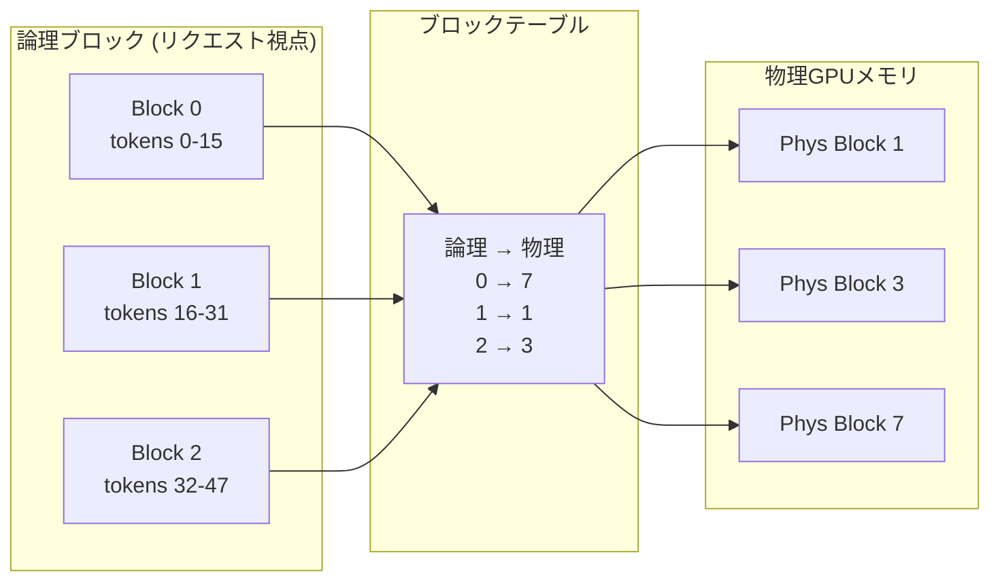

## 論文概要（Abstract）

本記事は、Kwon et al. による論文 "Efficient Memory Management for Large Language Model Serving with PagedAttention" の解説記事です。

LLMの高スループットサービングにはリクエストのバッチ処理が不可欠であるが、既存システムはKVキャッシュの静的連続メモリ割り当てによるメモリ非効率に苦しんでいる。著者らは、OS仮想メモリとページングに着想を得たattentionアルゴリズム「PagedAttention」を提案し、KVキャッシュを非連続メモリブロックに格納・アクセスする手法を実現した。このPagedAttentionに基づくLLMサービングシステムvLLMは、KVキャッシュの浪費をほぼゼロに抑え、FasterTransformerおよびOrca比で2-4倍のスループット向上を達成したと報告されている。

この記事は [Zenn記事: プロンプトキャッシュのROI最大化](https://zenn.dev/0h_n0/articles/9c9b01c307ad5e) の深掘りです。Zenn記事ではAPIレベルのプロンプトキャッシュの仕組みを前提としていますが、vLLMのPagedAttentionはそのキャッシュ機構の基盤技術にあたります。特にprefix sharing機能は、Anthropic/OpenAI/Googleが提供するキャッシュ機構の根幹を支えており、「同一system promptの再利用」の低レベル実装に直結します。

## 情報源

- **会議名**: SOSP 2023（ACM Symposium on Operating Systems Principles）
- **年**: 2023
- **URL**: [https://arxiv.org/abs/2309.06180](https://arxiv.org/abs/2309.06180)
- **著者**: Woosuk Kwon, Zhuohan Li, Siyuan Zhuang, Ying Sheng, Lianmin Zheng et al.（UC Berkeley）
- **採択率**: SOSPは通常15-20%程度（2023年は約18%）
- **GitHub**: [https://github.com/vllm-project/vllm](https://github.com/vllm-project/vllm)（Apache 2.0ライセンス）

## カンファレンス情報

SOSP（ACM Symposium on Operating Systems Principles）は、オペレーティングシステム分野における最高峰の国際会議の1つであり、1967年の創設以来隔年で開催されている。採択率は通常15-20%と非常に競争率が高い。本論文がシステム分野のトップ会議に採択されたことは、LLM推論の効率化が単なるMLの最適化ではなく、OSレベルのメモリ管理の課題として捉えられた点を示唆している。

## 背景と動機

LLMのサービングにおいて、GPUメモリは最も希少なリソースである。例えば、OPT-13Bモデルのパラメータは26GBを占有し、A100 GPU（40GB）の残りわずか14GBでKVキャッシュを管理する必要がある。

KVキャッシュはTransformerのattention計算における中間状態であり、過去のトークンのKey・Valueベクトルを保持する。自己回帰生成では、新しいトークンを生成するたびに過去のすべてのKey・Valueを参照するため、これらを保持し続けることが不可欠である。

論文によれば、既存システム（FasterTransformer、Orcaなど）では、リクエストごとに最大シーケンス長分のメモリを連続領域として事前確保する方式を採用していた。この方式には以下の3種の浪費が存在すると著者らは指摘している。

1. **予約メモリ浪費（Reservation waste）**: 将来のトークン生成に備えて確保されたが、まだ使用されていないメモリ。生成が完了するまで他のリクエストが利用できない
2. **内部フラグメンテーション（Internal fragmentation）**: 出力が事前確保された最大長に達しない場合に生じる未使用メモリ。論文のFigure 2によれば、既存システムでは最大80%に達する場合がある
3. **外部フラグメンテーション（External fragmentation）**: 連続メモリ確保の制約により、空き領域があっても使用できない断片化

著者らの分析（論文Section 3）によれば、これらの浪費により、既存システムでは実際のKVキャッシュデータが使用するGPUメモリは全体のわずか20.4-38.2%に過ぎないと報告されている。

## 主要な貢献

1. **PagedAttentionアルゴリズム**: OSの仮想メモリとページングの概念をattention計算に導入し、KVキャッシュを非連続メモリブロックに格納・アクセスする手法を提案
2. **vLLMサービングシステム**: PagedAttentionに基づく高スループットLLMサービングエンジンの設計と実装。ブロックテーブルによるメモリ管理、Copy-on-Writeによる効率的なメモリ共有を実現
3. **メモリ共有メカニズム**: 並列サンプリング（beam search等）やprefix sharingにおいて、同一KVキャッシュブロックの物理メモリ共有を可能にし、メモリ使用量を大幅に削減
4. **定量的評価**: 複数のモデル（OPT-13B、OPT-66B、OPT-175B）および実データセット（ShareGPT、Alpaca）で、既存システム比2-4倍のスループット向上を実証

## 技術的詳細

### KVキャッシュのメモリサイズ

1トークンあたりのKVキャッシュサイズは以下の式で計算される（論文Section 2.2）：

$$
\lvert \text{KVcache} \rvert = 2 \times h \times d \times l \times \text{sizeof}(\text{dtype})
$$

ここで、

- $h$: attention headの数
- $d$: headあたりの次元数
- $l$: Transformerのレイヤー数
- $2$: KeyとValueの2つのテンソル
- $\text{sizeof}(\text{dtype})$: データ型のバイト数（FP16なら2バイト）

例えば、OPT-13B（$h=40$, $d=128$, $l=40$, FP16）の場合：

$$
\lvert \text{KVcache} \rvert = 2 \times 40 \times 128 \times 40 \times 2 = 819{,}200 \text{ bytes} \approx 0.8 \text{ MB/トークン}
$$

2048トークンのシーケンスでは約1.6GBに達する。A100 40GBにOPT-13Bのパラメータ（26GB）を載せた場合、残り14GBでは約8.7シーケンスしか同時処理できない計算になる。

### PagedAttentionアルゴリズム

PagedAttentionの核心は、KVキャッシュを固定サイズ$B$トークン（デフォルト$B=16$）の**ブロック**に分割し、各ブロックを非連続なGPUメモリ位置に格納できるようにする点にある。

ブロック$j$のKeyとValueは以下のように定義される：

$$
\mathbf{K}_j = (\mathbf{k}_{(j-1)B+1}, \ldots, \mathbf{k}_{jB}) \in \mathbb{R}^{B \times d}
$$

$$
\mathbf{V}_j = (\mathbf{v}_{(j-1)B+1}, \ldots, \mathbf{v}_{jB}) \in \mathbb{R}^{B \times d}
$$

ここで、$\mathbf{k}_i, \mathbf{v}_i \in \mathbb{R}^d$ は$i$番目のトークンのKey・Valueベクトルである。

ブロック単位のattention計算は以下のように行われる：

$$
\mathbf{A}_j = \exp\left(\frac{\mathbf{q}_i \cdot \mathbf{K}_j^T}{\sqrt{d}}\right) \in \mathbb{R}^{B}
$$

$$
\mathbf{o}_i = \frac{\sum_j \mathbf{A}_j \cdot \mathbf{V}_j}{\sum_j \mathbf{1}^T \mathbf{A}_j}
$$

ここで、

- $\mathbf{q}_i \in \mathbb{R}^d$: 現在のトークン$i$のQueryベクトル
- $\mathbf{A}_j$: ブロック$j$に対するattentionスコア（softmax正規化前）
- $\mathbf{o}_i$: トークン$i$のattention出力

この計算は各ブロックに対して独立に行われ、最後に正規化定数で割ることでsoftmax正規化を達成する。ブロックが非連続メモリに配置されていても、ブロックテーブルを介して正しい物理メモリ位置にアクセスできる。



### ブロックテーブルによるメモリ管理

ブロックテーブルはOSのページテーブルに直接対応する概念である。各リクエストは論理ブロック番号の列を持ち、ブロックテーブルが論理ブロック番号から物理GPUメモリブロックの位置へのマッピングを保持する。

```python
from dataclasses import dataclass, field


@dataclass
class PhysicalBlock:
    """物理GPUメモリ上のKVキャッシュブロック

    Attributes:
        block_id: 物理ブロックの一意識別子
        ref_count: 参照カウント（CoW用）
        block_size: ブロックあたりのトークン数
    """
    block_id: int
    ref_count: int = 1
    block_size: int = 16


@dataclass
class BlockTable:
    """論理ブロック→物理ブロックのマッピング

    OS仮想メモリのページテーブルに対応する。
    """
    mapping: dict[int, PhysicalBlock] = field(default_factory=dict)

    def translate(self, logical_block: int) -> int:
        """論理ブロック番号を物理ブロックIDに変換

        Args:
            logical_block: 論理ブロック番号

        Returns:
            物理ブロックID

        Raises:
            KeyError: マッピングが存在しない場合
        """
        return self.mapping[logical_block].block_id

    def allocate(self, logical_block: int, physical_block: PhysicalBlock) -> None:
        """新しいブロックマッピングを追加

        Args:
            logical_block: 論理ブロック番号
            physical_block: 割り当てる物理ブロック
        """
        self.mapping[logical_block] = physical_block
```

### Copy-on-Write（CoW）メカニズム

並列サンプリング（beam search等）では、複数の候補シーケンスが共通のprefillフェーズのKVキャッシュを共有する。著者らはOSのCopy-on-Write機構を導入し、物理ブロックの参照カウントを管理している。

- **共有時**: 複数の論理ブロックが同一物理ブロックを参照（参照カウント増加）
- **分岐時**: いずれかのシーケンスがブロックに新しいトークンを書き込む場合、参照カウントが2以上であれば新しい物理ブロックを割り当ててデータをコピーし、そこに書き込む

論文Section 4.4によれば、この仕組みにより並列サンプリング時のメモリ使用量を最大55%削減できると報告されている。

### Prefix Sharing

同一のsystem promptを持つ複数リクエスト間で、prefixに対応するKVキャッシュの物理ブロックを共有する。この機能はZenn記事で解説された「同一system promptの再利用」の低レベル実装に直結する。

例えば、1000トークンのsystem prompt（$B=16$で63ブロック）を100リクエストで共有する場合：

- **共有なし**: $63 \times 100 = 6{,}300$ブロック
- **prefix sharing**: $63 + 37 \times 100 = 3{,}763$ブロック（可変部分のみ個別割り当て、固定部分37ブロックを仮定）

論文Table 5によれば、prefix sharingにより50%以上のKVキャッシュ削減が可能であると報告されている。

### スワップメカニズム

GPUメモリが不足した場合、KVキャッシュブロックをCPU DRAM（ホストメモリ）にスワップアウトする。OSのページスワップに類似しているが、PCIe帯域がボトルネックとなる。著者らはスワップをリクエスト単位（全ブロックまたは非スワップ）で行い、OSのスラッシングに相当する現象を回避している。

## 実装のポイント

### GPUカーネル設計

PagedAttentionのGPUカーネルは、非連続メモリアクセスを効率的に処理するために設計されている。著者らは以下の最適化を適用している（論文Section 5）：

- **ブロック単位の並列化**: 各ブロックの処理を独立したGPUスレッドブロックに割り当て、ブロック間の依存関係を排除
- **メモリコアレッシング**: ブロック内のアクセスパターンを連続化し、GPUメモリ帯域を最大限活用
- **Fused kernel**: softmax正規化と加重和の計算を1つのカーネルに統合し、中間結果のメモリ書き戻しを削減

### ブロックサイズの選択

ブロックサイズ$B$はメモリ効率とカーネル性能のトレードオフを制御するパラメータである（論文Section 5.2）：

- **$B$が小さい場合**: 内部フラグメンテーションが減少（最後のブロックの無駄が$B-1$トークン以下）するが、カーネルのオーバーヘッドが増大
- **$B$が大きい場合**: カーネル効率が向上するが、内部フラグメンテーションが増加

論文の実験（Table 3）では$B=16$がデフォルトとして使用されており、内部フラグメンテーション率は4%未満であったと報告されている。

### vLLMの主要コンポーネント

```python
from enum import Enum


class SchedulerPolicy(Enum):
    """スケジューリングポリシー"""
    FCFS = "first_come_first_served"


def schedule_requests(
    waiting: list[dict],
    running: list[dict],
    swapped: list[dict],
    gpu_blocks_free: int,
    cpu_blocks_free: int,
    policy: SchedulerPolicy = SchedulerPolicy.FCFS,
) -> dict:
    """vLLMスケジューラの簡略化モデル

    リクエストのライフサイクル:
    waiting → running → (swapped ↔ running) → finished

    Args:
        waiting: 待機中リクエスト
        running: 実行中リクエスト
        swapped: スワップ済みリクエスト
        gpu_blocks_free: 空きGPUブロック数
        cpu_blocks_free: 空きCPUブロック数
        policy: スケジューリングポリシー

    Returns:
        スケジューリング結果（実行・スワップ・プリエンプト対象）
    """
    to_run: list[dict] = []
    to_swap_in: list[dict] = []
    to_preempt: list[dict] = []

    # Phase 1: 実行中リクエストの継続判定
    for req in running:
        blocks_needed = req.get("blocks_needed", 1)
        if gpu_blocks_free >= blocks_needed:
            to_run.append(req)
            gpu_blocks_free -= blocks_needed
        else:
            # GPUメモリ不足 → CPUへスワップ
            to_preempt.append(req)

    # Phase 2: スワップ済みリクエストの復帰
    for req in swapped:
        blocks_needed = req.get("total_blocks", 1)
        if gpu_blocks_free >= blocks_needed:
            to_swap_in.append(req)
            gpu_blocks_free -= blocks_needed

    # Phase 3: 新規リクエストのスケジューリング（FCFS）
    for req in waiting:
        blocks_needed = req.get("initial_blocks", 1)
        if gpu_blocks_free >= blocks_needed:
            to_run.append(req)
            gpu_blocks_free -= blocks_needed
        else:
            break  # メモリ不足で残りは待機

    return {
        "to_run": to_run,
        "to_swap_in": to_swap_in,
        "to_preempt": to_preempt,
        "gpu_blocks_remaining": gpu_blocks_free,
    }
```

## Production Deployment Guide

vLLMベースのLLM推論サービスをAWS上にデプロイする場合の構成を以下に示す。vLLMはGPU推論サーバとして機能するため、Bedrockではなく自前のGPUインスタンスまたはコンテナでの運用が前提となる。

### AWS実装パターン（コスト最適化重視）

以下のコスト試算は2026年6月時点のAWS ap-northeast-1（東京）リージョン料金に基づく概算値である。実際のコストはトラフィックパターン、リージョン、バースト使用量により変動する。最新料金はAWS料金計算ツール（[https://calculator.aws/](https://calculator.aws/)）で確認を推奨する。

| 構成 | トラフィック | 主要サービス | 月額概算 |
|------|------------|------------|---------|
| Small | ~100 req/日 | EC2 g5.xlarge (Spot) + ALB | $300-500 |
| Medium | ~1,000 req/日 | ECS Fargate + g5.2xlarge × 2 | $1,500-2,500 |
| Large | 10,000+ req/日 | EKS + Karpenter + g5.12xlarge Spot | $5,000-15,000 |

**Small構成（~100 req/日）**:

- EC2 g5.xlarge（NVIDIA A10G 24GB、4 vCPU、16GB RAM）: Spotで$0.30-0.40/時（オンデマンド$1.006/時の約60-70%削減）
- ALB: $0.0243/時 + データ処理料金
- S3（モデルキャッシュ）: $0.025/GB/月
- CloudWatch: $3-5/月

**Medium構成（~1,000 req/日）**:

- ECS Fargate + GPU対応タスク定義: g5.2xlarge × 2（冗長構成）
- Application Auto Scaling: CPU/メモリ使用率ベース
- ElastiCache Redis（リクエストキュー）: cache.r6g.large $0.167/時
- NAT Gateway: $0.062/時 + $0.062/GB

**Large構成（10,000+ req/日）**:

- EKS コントロールプレーン: $0.10/時
- Karpenter: Spot g5.12xlarge（4 x A10G 96GB）を自動プロビジョニング
- Spot割引: オンデマンド$7.09/時 → Spot約$2.13-2.84/時（60-70%削減）
- Horizontal Pod Autoscaler: リクエストキュー長ベース

**コスト削減テクニック**:

- Spot Instances活用で最大60-70%削減（GPU Spot割引はCPUの90%削減より低い点に注意）
- Reserved Instances（1年、全前払い）で約40%削減
- Savings Plans（Compute、1年）で約30%削減
- モデル量子化（FP16→INT8/INT4）でGPUメモリ半減→小型インスタンス使用可

### Terraformインフラコード

**Small構成（EC2 Spot + vLLM）**:

```hcl
# Small構成: EC2 Spot + vLLM + ALB
# 2026年6月時点のリージョン: ap-northeast-1

terraform {
  required_version = ">= 1.9"
  required_providers {
    aws = {
      source  = "hashicorp/aws"
      version = "~> 5.80"
    }
  }
}

provider "aws" {
  region = "ap-northeast-1"
}

# --- VPC基盤 ---
module "vpc" {
  source  = "terraform-aws-modules/vpc/aws"
  version = "~> 5.16"

  name = "vllm-small-vpc"
  cidr = "10.0.0.0/16"

  azs             = ["ap-northeast-1a", "ap-northeast-1c"]
  public_subnets  = ["10.0.1.0/24", "10.0.2.0/24"]
  private_subnets = ["10.0.10.0/24", "10.0.11.0/24"]

  enable_nat_gateway = false # コスト削減: NATなし（パブリックサブネット使用）
}

# --- IAMロール（最小権限） ---
resource "aws_iam_role" "vllm_instance" {
  name = "vllm-instance-role"
  assume_role_policy = jsonencode({
    Version = "2012-10-17"
    Statement = [{
      Action = "sts:AssumeRole"
      Effect = "Allow"
      Principal = { Service = "ec2.amazonaws.com" }
    }]
  })
}

resource "aws_iam_role_policy" "vllm_s3_read" {
  name = "vllm-s3-model-read"
  role = aws_iam_role.vllm_instance.id
  policy = jsonencode({
    Version = "2012-10-17"
    Statement = [{
      Effect   = "Allow"
      Action   = ["s3:GetObject", "s3:ListBucket"]
      Resource = [
        "arn:aws:s3:::vllm-models-bucket",
        "arn:aws:s3:::vllm-models-bucket/*"
      ]
    }]
  })
}

resource "aws_iam_instance_profile" "vllm" {
  name = "vllm-instance-profile"
  role = aws_iam_role.vllm_instance.name
}

# --- Spot Fleet ---
resource "aws_spot_fleet_request" "vllm" {
  iam_fleet_role                      = aws_iam_role.vllm_instance.arn
  target_capacity                     = 1
  terminate_instances_with_expiration = true
  allocation_strategy                 = "lowestPrice"

  launch_specification {
    instance_type          = "g5.xlarge" # NVIDIA A10G 24GB
    ami                    = data.aws_ami.deep_learning.id
    subnet_id              = module.vpc.public_subnets[0]
    iam_instance_profile   = aws_iam_instance_profile.vllm.name
    spot_price             = "0.50"

    root_block_device {
      volume_size = 100
      volume_type = "gp3"
      encrypted   = true # KMS暗号化
    }

    user_data = base64encode(<<-EOF
      #!/bin/bash
      # vLLMサーバ起動
      pip install vllm
      python -m vllm.entrypoints.openai.api_server \
        --model meta-llama/Llama-3.1-8B-Instruct \
        --port 8000 \
        --max-model-len 4096
    EOF
    )
  }
}

data "aws_ami" "deep_learning" {
  most_recent = true
  owners      = ["amazon"]
  filter {
    name   = "name"
    values = ["Deep Learning AMI GPU PyTorch *-Ubuntu 22.04-*"]
  }
}

# --- CloudWatchアラーム ---
resource "aws_cloudwatch_metric_alarm" "gpu_utilization" {
  alarm_name          = "vllm-gpu-utilization-high"
  comparison_operator = "GreaterThanThreshold"
  evaluation_periods  = 3
  metric_name         = "GPUUtilization"
  namespace           = "Custom/vLLM"
  period              = 300
  statistic           = "Average"
  threshold           = 90
  alarm_description   = "GPU使用率が90%を超過"
}
```

**Large構成（EKS + Karpenter + Spot）**:

```hcl
# Large構成: EKS + Karpenter + Spot Instances
# 2026年6月時点のリージョン: ap-northeast-1

module "eks" {
  source  = "terraform-aws-modules/eks/aws"
  version = "~> 20.31"

  cluster_name    = "vllm-production"
  cluster_version = "1.31"

  vpc_id     = module.vpc.vpc_id
  subnet_ids = module.vpc.private_subnets

  # コントロールプレーンのみ（$0.10/時）
  cluster_endpoint_public_access = false

  # KMS暗号化
  cluster_encryption_config = {
    provider_key_arn = aws_kms_key.eks.arn
    resources        = ["secrets"]
  }
}

resource "aws_kms_key" "eks" {
  description = "EKS Secrets encryption key"
}

# --- Karpenter Provisioner（Spot優先） ---
resource "kubectl_manifest" "karpenter_provisioner" {
  yaml_body = <<-YAML
    apiVersion: karpenter.sh/v1
    kind: NodePool
    metadata:
      name: gpu-spot
    spec:
      template:
        spec:
          requirements:
            - key: node.kubernetes.io/instance-type
              operator: In
              values: ["g5.xlarge", "g5.2xlarge", "g5.4xlarge", "g5.12xlarge"]
            - key: karpenter.sh/capacity-type
              operator: In
              values: ["spot", "on-demand"]
            - key: topology.kubernetes.io/zone
              operator: In
              values: ["ap-northeast-1a", "ap-northeast-1c"]
          nodeClassRef:
            group: karpenter.k8s.aws
            kind: EC2NodeClass
            name: gpu
      limits:
        gpu: "16"    # 最大GPU数を制限
      disruption:
        consolidationPolicy: WhenEmptyOrUnderutilized
        consolidateAfter: 30s
  YAML
}

# --- Secrets Manager ---
resource "aws_secretsmanager_secret" "vllm_config" {
  name        = "vllm/production/config"
  description = "vLLM configuration secrets"
}

# --- AWS Budgets ---
resource "aws_budgets_budget" "vllm_monthly" {
  name         = "vllm-monthly-budget"
  budget_type  = "COST"
  limit_amount = "15000"
  limit_unit   = "USD"
  time_unit    = "MONTHLY"

  notification {
    comparison_operator       = "GREATER_THAN"
    threshold                 = 80
    threshold_type            = "PERCENTAGE"
    notification_type         = "ACTUAL"
    subscriber_email_addresses = ["alerts@example.com"]
  }
}
```

### 運用・監視設定

**CloudWatch Logs Insights クエリ**（vLLMメトリクス分析）:

```
# 1時間あたりのリクエスト数とレイテンシ分析
fields @timestamp, @message
| filter @message like /request_completed/
| stats count() as request_count,
        avg(latency_ms) as avg_latency,
        pct(latency_ms, 95) as p95_latency,
        pct(latency_ms, 99) as p99_latency
  by bin(1h)
| sort @timestamp desc

# GPU メモリ使用率の異常検知
fields @timestamp, gpu_memory_used_mb, gpu_memory_total_mb
| stats avg(gpu_memory_used_mb / gpu_memory_total_mb * 100) as avg_usage_pct
  by bin(5m)
| filter avg_usage_pct > 95
```

**CloudWatch アラーム設定（Python boto3）**:

```python
import boto3


def create_vllm_alarms(instance_id: str, sns_topic_arn: str) -> None:
    """vLLM用CloudWatchアラームを設定

    Args:
        instance_id: EC2インスタンスID
        sns_topic_arn: 通知先SNSトピックARN
    """
    cw = boto3.client("cloudwatch", region_name="ap-northeast-1")

    # GPU使用率スパイク検知
    cw.put_metric_alarm(
        AlarmName=f"vllm-{instance_id}-gpu-spike",
        MetricName="GPUUtilization",
        Namespace="Custom/vLLM",
        Statistic="Average",
        Period=300,
        EvaluationPeriods=3,
        Threshold=95.0,
        ComparisonOperator="GreaterThanThreshold",
        AlarmActions=[sns_topic_arn],
        Dimensions=[{"Name": "InstanceId", "Value": instance_id}],
    )

    # リクエストレイテンシP99
    cw.put_metric_alarm(
        AlarmName=f"vllm-{instance_id}-latency-p99",
        MetricName="RequestLatencyP99",
        Namespace="Custom/vLLM",
        Statistic="Maximum",
        Period=300,
        EvaluationPeriods=2,
        Threshold=5000.0,  # 5秒
        ComparisonOperator="GreaterThanThreshold",
        AlarmActions=[sns_topic_arn],
    )
```

**X-Ray トレーシング設定（Python）**:

```python
from aws_xray_sdk.core import xray_recorder, patch_all


def configure_xray_tracing(service_name: str = "vllm-proxy") -> None:
    """X-Rayトレーシングの初期化

    Args:
        service_name: X-Rayに登録するサービス名
    """
    xray_recorder.configure(
        service=service_name,
        sampling=True,
        context_missing="LOG_ERROR",
    )
    patch_all()  # boto3, requests等を自動計装


def trace_inference_request(
    model_name: str,
    input_tokens: int,
    output_tokens: int,
    latency_ms: float,
) -> None:
    """推論リクエストのトレース記録

    Args:
        model_name: 使用モデル名
        input_tokens: 入力トークン数
        output_tokens: 出力トークン数
        latency_ms: レイテンシ（ミリ秒）
    """
    segment = xray_recorder.current_segment()
    segment.put_annotation("model", model_name)
    segment.put_metadata("inference", {
        "input_tokens": input_tokens,
        "output_tokens": output_tokens,
        "latency_ms": latency_ms,
        "tokens_per_second": output_tokens / (latency_ms / 1000),
    })
```

**Cost Explorer自動レポート（Python）**:

```python
import boto3
from datetime import datetime, timedelta


def get_daily_vllm_cost(sns_topic_arn: str, threshold_usd: float = 500.0) -> dict:
    """日次vLLMコストレポートを取得し、閾値超過時にSNS通知

    Args:
        sns_topic_arn: 通知先SNSトピックARN
        threshold_usd: アラート閾値（USD）

    Returns:
        サービス別コスト辞書
    """
    ce = boto3.client("ce", region_name="us-east-1")
    today = datetime.utcnow().strftime("%Y-%m-%d")
    yesterday = (datetime.utcnow() - timedelta(days=1)).strftime("%Y-%m-%d")

    response = ce.get_cost_and_usage(
        TimePeriod={"Start": yesterday, "End": today},
        Granularity="DAILY",
        Metrics=["UnblendedCost"],
        Filter={
            "Tags": {
                "Key": "Project",
                "Values": ["vllm-production"],
            }
        },
        GroupBy=[{"Type": "DIMENSION", "Key": "SERVICE"}],
    )

    costs = {}
    total = 0.0
    for group in response["ResultsByTime"][0]["Groups"]:
        service = group["Keys"][0]
        amount = float(group["Metrics"]["UnblendedCost"]["Amount"])
        costs[service] = amount
        total += amount

    if total > threshold_usd:
        sns = boto3.client("sns", region_name="ap-northeast-1")
        sns.publish(
            TopicArn=sns_topic_arn,
            Subject=f"vLLM Daily Cost Alert: ${total:.2f}",
            Message=f"日次コストが${threshold_usd}を超過: ${total:.2f}\n{costs}",
        )

    return costs
```

### コスト最適化チェックリスト

**アーキテクチャ選択**:

- [ ] トラフィック量に応じた構成選択（Small: EC2 Spot / Medium: ECS / Large: EKS）
- [ ] GPU不要な前処理・後処理はCPUインスタンスに分離
- [ ] モデルサイズに適したGPUインスタンス選択（8B→g5.xlarge、70B→g5.12xlarge/p4d）

**リソース最適化**:

- [ ] EC2: Spot Instances優先（GPU Spotで60-70%削減）
- [ ] Reserved Instances: 1年全前払いで約40%削減
- [ ] Savings Plans（Compute）: 1年コミットで約30%削減
- [ ] EKS: Karpenterで未使用ノード自動回収（consolidateAfter: 30s）
- [ ] EBS: gp3ボリューム使用（gp2比20%安価、IOPS/スループット独立設定可）

**vLLM固有の最適化**:

- [ ] `--max-model-len`を必要最小限に設定（KVキャッシュメモリ削減）
- [ ] `--gpu-memory-utilization`を0.9に設定（デフォルト0.9、過剰確保を防止）
- [ ] モデル量子化（AWQ/GPTQ）でメモリ使用量50-75%削減→小型インスタンス使用
- [ ] `--enable-prefix-caching`有効化（共通prefix持つリクエストでKVキャッシュ共有）
- [ ] continuous batchingのmax-batch-sizeをGPUメモリに応じて調整

**監視・アラート**:

- [ ] AWS Budgets: 月次予算アラート（80%/100%閾値）
- [ ] CloudWatch: GPU使用率、リクエストレイテンシP95/P99
- [ ] Cost Anomaly Detection: 日次コスト異常検知
- [ ] 日次コストレポート: Cost Explorer API + SNS通知
- [ ] vLLMメトリクス: Prometheus `/metrics`エンドポイント監視

**リソース管理**:

- [ ] 未使用EBSボリューム・スナップショット定期削除
- [ ] タグ戦略: `Project=vllm`, `Environment=prod/dev`, `CostCenter=ML`
- [ ] ECRイメージライフサイクルポリシー（古いイメージ自動削除）
- [ ] 開発環境: 夜間・週末の自動停止（EventBridge + Lambda）
- [ ] S3モデルキャッシュ: Intelligent-Tieringで低頻度アクセスモデルの保管コスト削減

**セキュリティ**:

- [ ] IAMロール: 最小権限の原則（S3読み取り、CloudWatch書き込みのみ）
- [ ] VPC: プライベートサブネット + VPCエンドポイント（S3, ECR, CloudWatch）
- [ ] Security Group: 推論ポート（8000）はALBからのみ許可
- [ ] EBS/S3: KMS暗号化有効化
- [ ] CloudTrail: API操作の監査ログ有効化

## 実験結果

著者らは、OPT-13B、OPT-66B、OPT-175Bの3モデルを用いて、NVIDIA A100 GPU上で評価を行っている（論文Section 6）。

### スループット比較

論文Table 2より、ShareGPTデータセット（平均入力長~161トークン、平均出力長~338トークン）での正規化スループット：

| モデル | GPU構成 | vLLM | FasterTransformer | Orca | 改善率（対FT） |
|--------|---------|------|-------------------|------|---------------|
| OPT-13B | 1×A100-40GB | 1.0x（基準） | 0.3-0.4x | 0.5-0.6x | 2.2x |
| OPT-66B | 4×A100-40GB | 1.0x | - | 0.4-0.5x | - |
| OPT-175B | 8×A100-80GB | 1.0x | - | 0.4-0.5x | - |

論文Figure 12によれば、リクエストレートが増加するにつれて、vLLMと既存システムのスループット差はさらに拡大する。これは、高負荷時にメモリ効率の差がバッチサイズに直接影響するためと著者らは分析している。

### メモリ効率

論文Table 3より：

- **vLLM**: 内部フラグメンテーション < 4%（ブロックサイズ$B=16$）
- **FasterTransformer**: 内部フラグメンテーション最大80%（最大シーケンス長を事前確保）

この差は、vLLMがブロック単位のオンデマンド割り当てを行うのに対し、FasterTransformerがシーケンス全体分のメモリを事前確保することに起因する。

### 並列サンプリング性能

論文Table 4より、beam width=6での並列デコーディング：

| 手法 | メモリ使用量（正規化） | スループット（正規化） |
|------|----------------------|---------------------|
| ナイーブ（ブロック共有なし） | 1.0x | 1.0x |
| vLLM（CoW有効） | 0.45x | 2.2x |

Copy-on-Writeにより、共通prefixのKVキャッシュを物理メモリ上で共有し、約55%のメモリ削減と2.2倍のスループット向上が報告されている。

### 限界と制約

著者らは以下の限界も報告している：

- **非連続メモリアクセスオーバーヘッド**: 小バッチ（1-2リクエスト）で10-20%の性能低下（論文Section 6.3）。大バッチではメモリ効率の改善がこのオーバーヘッドを上回る
- **ブロックサイズのトレードオフ**: $B=1$（フラグメンテーションゼロ）ではカーネル効率が著しく低下
- **スワップレイテンシ**: PCIe帯域（Gen4で64GB/s）がボトルネック。大規模モデルでは数十ミリ秒のレイテンシ
- **Transformerアーキテクチャ依存**: アーキテクチャごとにカーネル実装が必要

## 実運用への応用

### プロンプトキャッシュとの関連

Zenn記事で解説されている「プロンプトキャッシュのROI最大化」の観点から、vLLMのprefix sharing機能は以下のように位置づけられる：

- **APIレベル**: Anthropic Claude / OpenAI / Google Geminiのプロンプトキャッシュ機能は、内部的にprefix sharingに類似したKVキャッシュ共有を行っている
- **サーバレベル**: vLLMの`--enable-prefix-caching`オプションにより、自前サーバでも同等の効率化が可能
- **コスト効果**: 1000トークンのsystem promptを100リクエストで共有する場合、KVキャッシュメモリを50%以上削減でき、同一GPUでより多くのリクエストをバッチ処理可能

### スケーリング戦略

本番環境でのvLLM運用において、以下の戦略が有効と考えられる：

- **水平スケーリング**: 複数vLLMインスタンスをALB/Envoy経由でロードバランス。テンソル並列（同一モデルを複数GPU分割）とパイプライン並列（レイヤー分割）の使い分け
- **キュー管理**: SQSやRedisを用いたリクエストキューにより、バースト時のOOMを防止
- **graceful degradation**: GPUメモリ不足時のスワップ閾値を監視し、閾値到達前にスケールアウト

## 関連研究

- **FlashAttention** [Dao et al., 2022]: attention計算のメモリアクセスパターンを最適化し、HBM⇔SRAMの転送量を削減。PagedAttentionとは相補的で、vLLMの内部でFlashAttentionカーネルを使用可能
- **Orca** [Yu et al., 2022]: continuous batching（反復レベルのスケジューリング）を導入。vLLMはOrcaのcontinuous batchingの上にPagedAttentionを統合
- **DejaVu** [Liu et al., 2023]: attention headのスパース化によりKVキャッシュを削減。PagedAttentionのメモリ管理とは独立に適用可能
- **Speculative Decoding** [Leviathan et al., 2023]: 小型モデルでドラフト生成→大型モデルで検証。vLLMのスケジューリングと組み合わせることでさらなるスループット向上が見込まれる

## まとめと今後の展望

vLLMはOS仮想メモリの概念をLLM推論に応用し、KVキャッシュのメモリ管理を根本的に改善した。PagedAttentionによる非連続メモリ管理、Copy-on-Writeによるメモリ共有、prefix sharingによるキャッシュ再利用により、既存システム比で2-4倍のスループット向上を達成したと報告されている。

2026年現在、vLLMはLLM推論サーバのデファクトスタンダードの1つとなっており、GitHub上で40,000以上のスターを獲得している。後続の研究として、SGLang（RadixAttentionによるprefix tree管理）、TensorRT-LLM（NVIDIA最適化）、FlashInfer（柔軟なattentionカーネルライブラリ）などが登場し、KVキャッシュ管理のさらなる効率化が進んでいる。

今後の方向性として、(1) マルチモーダルモデル（画像・音声のKVキャッシュ管理）、(2) 分散推論における複数ノード間のKVキャッシュ共有、(3) 非Transformerアーキテクチャ（Mamba、RWKV等）への適用拡大が挙げられる。

## 参考文献

- **Conference URL**: [https://arxiv.org/abs/2309.06180](https://arxiv.org/abs/2309.06180)
- **Code**: [https://github.com/vllm-project/vllm](https://github.com/vllm-project/vllm)（Apache 2.0）
- **FlashAttention**: Dao et al., "FlashAttention: Fast and Memory-Efficient Exact Attention with IO-Awareness," NeurIPS 2022
- **Orca**: Yu et al., "Orca: A Distributed Serving System for Transformer-Based Generative Models," OSDI 2022
- **DejaVu**: Liu et al., "Deja Vu: Contextual Sparsity for Efficient LLMs at Inference Time," ICML 2023
- **Speculative Decoding**: Leviathan et al., "Fast Inference from Transformers via Speculative Decoding," ICML 2023
- **Related Zenn article**: [https://zenn.dev/0h_n0/articles/9c9b01c307ad5e](https://zenn.dev/0h_n0/articles/9c9b01c307ad5e)
