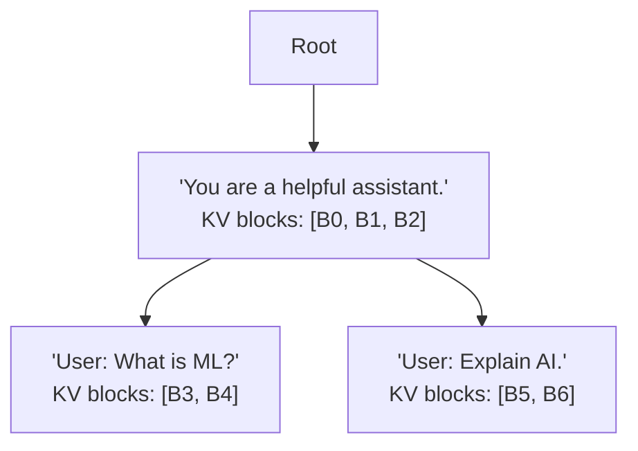

本記事は [SGLang: Efficiently Executing Structured Language Model Programs](https://arxiv.org/abs/2312.07104) の解説記事です。

## 論文概要（Abstract）

SGLangは、LLMの構造化プログラム（複数のLLM呼び出しを組み合わせた処理パイプライン）を効率的に実行するためのシステムである。著者らはフロントエンドとして構造化生成のためのドメイン固有言語を、バックエンドとしてRadixAttentionと呼ばれるKVキャッシュ再利用機構を提案している。RadixAttentionはRadixツリー（基数木）を用いてKVキャッシュをトークン列の共通プレフィックスごとに自動整理・共有し、手動のキャッシュ管理を不要にする。著者らの報告によれば、vLLMなどの既存システムと比較して最大5倍のスループット向上を達成している。

この記事は [Zenn記事: プロンプトキャッシュのROI最大化](https://zenn.dev/0h_n0/articles/9c9b01c307ad5e) の深掘りです。

## 情報源

- **arXiv ID**: 2312.07104
- **URL**: [https://arxiv.org/abs/2312.07104](https://arxiv.org/abs/2312.07104)
- **著者**: Lianmin Zheng, Liangsheng Yin, Zhiqiang Xie, Chuyue Sun et al.
- **発表年**: 2023年（arXiv初出）、2024年（MLSys等で発表）
- **分野**: cs.CL（計算言語学）、cs.AI（人工知能）

## 背景と動機（Background & Motivation）

LLMを活用するアプリケーションは、単一のAPIコールで完結するものから、複数のLLM呼び出しを組み合わせた複雑なパイプラインへと進化している。few-shot学習、RAG、エージェントワークフロー、tree-of-thoughtなどの手法では、同一のsystem promptやfew-shot例を共有する複数のリクエストが発生する。しかし、従来のLLMサービングシステムでは各リクエストを独立に処理し、共通部分のprefill計算を毎回繰り返していた。

この非効率の根本原因は、KVキャッシュの管理がリクエスト単位に閉じている点にある。vLLMのPagedAttentionはメモリ断片化を解決したが、リクエスト間でのKVキャッシュ共有は対象外であった。著者らはRadixツリーを用いた自動的なprefix sharing機構であるRadixAttentionを提案している。

## 主要な貢献（Key Contributions）

- **SGLangフロントエンド**: `gen`（テキスト生成）、`select`（候補選択）、`fork`（並列分岐）などのプリミティブを提供するPython組み込みDSL
- **RadixAttention**: Radixツリーを用いたKVキャッシュのプレフィックス単位での自動管理・再利用機構
- **キャッシュ対応スケジューリング**: longest prefix matchに基づくリクエスト並べ替えでキャッシュヒット率を最大化
- **包括的な評価**: few-shot learning、RAG、multi-turn chat、tree-of-thoughtなど多様なワークロードでの比較評価

## 技術的詳細（Technical Details）

### Radixツリー（基数木）の基本構造

RadixAttentionのコアデータ構造はRadixツリー（基数木）である。通常のトライ木では各ノードが1文字に対応するのに対し、Radixツリーでは共通プレフィックスを持つ複数のキーが同一エッジに圧縮される。SGLangでは、トークン列をキーとするRadixツリーを構築し、各ノードにKVキャッシュのブロックを格納する。



上図では、2つのリクエストが共通のsystem promptを共有している。このプレフィックスのKVキャッシュ（B0-B2）はRadixツリーの同一ノードに格納され、後続のリクエストではprefill再計算が不要となる。

### KVキャッシュの検索と再利用

新しいリクエストが到着すると、以下の手順でKVキャッシュの再利用を判定する。

1. リクエストのトークン列をRadixツリーのルートから辿る
2. 最長一致点（longest prefix match）を特定する
3. 一致部分のKVキャッシュは再利用（prefill計算をスキップ）
4. 残りのトークンについてのみprefill計算を実行する
5. 新しいKVキャッシュをRadixツリーに新規ノードとして挿入する

この検索操作の計算量は$O(m)$である（$m$はリクエストのトークン列長）。

### prefill計算の削減効果

トークン列長$n$のリクエストに対するSelf-Attentionの計算量は以下の通りである。

$$
\text{FLOPs}_{\text{prefill}} = 2 \cdot L \cdot n^2 \cdot d
$$

ここで、$L$はTransformerのレイヤー数、$n$は入力トークン列長、$d$はhidden dimensionである。

RadixAttentionにより共通プレフィックス長$p$のKVキャッシュが再利用される場合、新規計算が必要なのは残り$(n - p)$トークン分のみである。ただし新規トークンは既存KVキャッシュに対してもAttentionを計算するため、実際の計算量は以下となる。

$$
\text{FLOPs}_{\text{RadixAttention}} = 2 \cdot L \cdot (n - p) \cdot n \cdot d
$$

削減率は$p/n$に近似できる。system promptが長くユーザー入力が短いケースでは$p/n$が高くなり、大幅な削減が期待できる。

### LRUエビクション

GPUメモリの制約に対して、SGLangはLRU（Least Recently Used）ポリシーに基づくエビクションを採用している。各ノードに最終アクセス時刻を記録し、メモリ閾値超過時に最も古いリーフノードからKVキャッシュブロックを解放する。これにより頻繁に使用されるsystem promptのキャッシュを保持しつつ、一度しか使われない入力のキャッシュを回収する。

### fork/join操作

SGLangのフロントエンドでは、1つのプロンプトから複数の出力を並列に生成する`fork`操作を提供している。

```python
import sglang as sgl

@sgl.function
def multi_answer(s: sgl.State, question: str) -> None:
    """1つの質問に対して複数の回答を並列生成する。

    Args:
        s: SGLangの状態オブジェクト
        question: ユーザーの質問文
    """
    s += sgl.system("You are a helpful assistant.")
    s += sgl.user(question)
    forks = s.fork(3)
    for f in forks:
        f += sgl.assistant(sgl.gen("answer", max_tokens=256))
```

`fork`の内部実装では、分岐元のKVキャッシュをRadixツリー上で共有したまま分岐先ごとに新しいノードを作成する。物理メモリ上の同一ブロックが参照されるため、コピーは発生しない。

## 実装のポイント（Implementation）

**PagedAttentionとの統合**: RadixAttentionはvLLMのPagedAttentionと相互補完的に動作する。PagedAttentionのページ単位でKVキャッシュを管理し、RadixAttentionのノードがこのページを参照する。

**トークンブロックサイズの選択**: ブロックサイズが小さいほどプレフィックスの共通部分を細かく検出できるが、ツリーのメタデータ管理コストが増大する。論文の実装では16または64トークンのブロックサイズが採用されている。

**よくある落とし穴**:
- プレフィックス末尾がブロック境界と一致しない場合、余分なprefillが発生する。system promptの長さをブロックサイズの倍数に調整するとヒット率が向上する
- ランダム生成されるプレフィックスではキャッシュヒットがほぼ発生しない
- GPUメモリ逼迫時にLRUエビクションが頻発し、有用なキャッシュも追い出される

## Production Deployment Guide

SGLangをAWS上にデプロイする場合の構成ガイドを示す。SGLangはセルフホスティング型のLLMサービングフレームワークであり、GPU搭載インスタンスでの運用が前提となる。

### AWS実装パターン（コスト最適化重視）

コスト試算は2026年6月時点のAWS ap-northeast-1（東京）リージョン料金に基づく概算値であり、実際のコストはトラフィックパターンやモデルサイズにより変動する。最新料金はAWS料金計算ツールで確認を推奨する。

| 構成 | トラフィック | GPU | 月額概算 |
|------|------------|-----|---------|
| Small | ~500 req/日 | g5.xlarge x1 (A10G 24GB) | $800-1,200 |
| Medium | ~5,000 req/日 | g5.2xlarge x2 (A10G 24GB) | $2,000-3,500 |
| Large | 50,000+ req/日 | p4d.24xlarge (A100 80GB x8) | $15,000-25,000 |

**Small構成**: 単一g5.xlarge上でSGLangサーバーを起動。7B-13Bモデル向け。Spot活用で最大90%削減可能（中断リスクあり）。

**Medium構成**: ECS Fargate上で2台のGPUインスタンスをALBでロードバランシング。RadixAttentionのキャッシュヒット率最大化のため、同一system promptのリクエストをsticky sessionで同一インスタンスに振り分ける。

**Large構成**: EKS + Karpenterで自動スケーリング。p4d.24xlargeのSpotを優先し、中断時はOn-Demandにフォールバック。tensor parallelismで70Bモデルを8GPU分散推論。

### Terraformインフラコード

**Small構成（EC2 Spot + ALB）**:

```hcl
# Small構成: SGLang on EC2 Spot (g5.xlarge)
terraform {
  required_providers {
    aws = { source = "hashicorp/aws", version = "~> 5.0" }
  }
}

resource "aws_vpc" "sglang" {
  cidr_block           = "10.0.0.0/16"
  enable_dns_support   = true
  enable_dns_hostnames = true
  tags = { Name = "sglang-vpc", Project = "sglang-serving" }
}

resource "aws_iam_role" "sglang_ec2" {
  name = "sglang-ec2-role"
  assume_role_policy = jsonencode({
    Version = "2012-10-17"
    Statement = [{ Action = "sts:AssumeRole", Effect = "Allow",
      Principal = { Service = "ec2.amazonaws.com" } }]
  })
}

resource "aws_iam_role_policy" "s3_readonly" {
  name = "sglang-s3-model-access"
  role = aws_iam_role.sglang_ec2.id
  policy = jsonencode({
    Version = "2012-10-17"
    Statement = [{ Effect = "Allow",
      Action   = ["s3:GetObject", "s3:ListBucket"],
      Resource = ["arn:aws:s3:::sglang-models-*", "arn:aws:s3:::sglang-models-*/*"] }]
  })
}

resource "aws_spot_instance_request" "sglang" {
  ami                  = "ami-0abcdef1234567890" # Deep Learning AMI
  instance_type        = "g5.xlarge"
  spot_price           = "0.50"
  wait_for_fulfillment = true
  root_block_device {
    volume_size = 200
    volume_type = "gp3"
    encrypted   = true
  }
  tags = { Name = "sglang-gpu", Project = "sglang-serving" }
}
```

**Large構成（EKS + Karpenter + Spot）**:

```hcl
# Large構成: EKS + Karpenter + Spot
module "eks" {
  source          = "terraform-aws-modules/eks/aws"
  version         = "~> 20.0"
  cluster_name    = "sglang-cluster"
  cluster_version = "1.31"
  enable_karpenter = true
}

resource "kubectl_manifest" "karpenter_nodepool" {
  yaml_body = yamlencode({
    apiVersion = "karpenter.sh/v1"
    kind       = "NodePool"
    metadata   = { name = "sglang-gpu" }
    spec = {
      template = { spec = {
        requirements = [
          { key = "karpenter.sh/capacity-type", operator = "In",
            values = ["spot", "on-demand"] },
          { key = "node.kubernetes.io/instance-type", operator = "In",
            values = ["g5.xlarge", "g5.2xlarge", "p4d.24xlarge"] },
        ]
      }}
      disruption = { consolidationPolicy = "WhenEmptyOrUnderutilized" }
      limits     = { "nvidia.com/gpu" = 32 }
    }
  })
}

resource "aws_budgets_budget" "monthly" {
  name         = "sglang-monthly"
  budget_type  = "COST"
  limit_amount = "5000"
  limit_unit   = "USD"
  time_unit    = "MONTHLY"
  notification {
    comparison_operator        = "GREATER_THAN"
    threshold                  = 80
    threshold_type             = "PERCENTAGE"
    notification_type          = "ACTUAL"
    subscriber_email_addresses = ["admin@example.com"]
  }
}
```

### 運用・監視設定

**CloudWatch Logs Insights クエリ**:

```
# キャッシュヒット率とprefillトークン数の推移
fields @timestamp, @message
| filter @message like /cache_hit/
| stats count(*) as total,
        sum(case when cache_hit = 1 then 1 else 0 end) as hits,
        avg(prefill_tokens) as avg_prefill
  by bin(1h)
```

**X-Ray トレーシング + Cost Explorerレポート**:

```python
from aws_xray_sdk.core import xray_recorder, patch_all
import boto3
from datetime import datetime, timedelta

patch_all()

@xray_recorder.capture("sglang_inference")
def call_sglang(prompt: str, max_tokens: int = 256) -> dict:
    """SGLangサーバーへの推論リクエストをX-Rayでトレースする。

    Args:
        prompt: 入力プロンプト
        max_tokens: 最大生成トークン数
    Returns:
        SGLangサーバーからのレスポンス辞書
    """
    import requests
    subsegment = xray_recorder.current_subsegment()
    subsegment.put_annotation("model", "llama-3-8b")
    response = requests.post(
        "http://sglang-server:8080/generate",
        json={"text": prompt, "sampling_params": {"max_new_tokens": max_tokens}},
        timeout=30,
    )
    return response.json()

def get_daily_cost() -> dict:
    """SGLang関連の日次コストを取得し、$100超過でSNS通知する。

    Returns:
        サービス別コスト辞書
    """
    ce = boto3.client("ce", region_name="ap-northeast-1")
    end = datetime.utcnow().strftime("%Y-%m-%d")
    start = (datetime.utcnow() - timedelta(days=1)).strftime("%Y-%m-%d")
    response = ce.get_cost_and_usage(
        TimePeriod={"Start": start, "End": end},
        Granularity="DAILY",
        Metrics=["UnblendedCost"],
        Filter={"Tags": {"Key": "Project", "Values": ["sglang-serving"]}},
        GroupBy=[{"Type": "DIMENSION", "Key": "SERVICE"}],
    )
    costs: dict[str, float] = {}
    for group in response["ResultsByTime"][0]["Groups"]:
        costs[group["Keys"][0]] = float(group["Metrics"]["UnblendedCost"]["Amount"])
    total = sum(costs.values())
    if total > 100.0:
        boto3.client("sns", region_name="ap-northeast-1").publish(
            TopicArn="arn:aws:sns:ap-northeast-1:123456789012:sglang-cost-alert",
            Subject=f"SGLang Cost Alert: ${total:.2f}",
            Message=f"Daily cost: ${total:.2f}",
        )
    return costs
```

### コスト最適化チェックリスト

**アーキテクチャ選択**:
- [ ] トラフィック量に応じた構成を選択（Small/Medium/Large）
- [ ] sticky sessionでRadixAttentionのキャッシュヒット率を最大化
- [ ] GPUインスタンスタイプとモデルサイズのマッチング

**リソース最適化**:
- [ ] Spot Instances優先（g5系: On-Demand比60-90%削減）
- [ ] Reserved Instances: 安定ワークロードは1年コミットで最大40%削減
- [ ] Savings Plans検討
- [ ] EBS gp3使用（gp2比でGB単価20%削減）
- [ ] アイドル時のGPUインスタンス停止（開発環境の夜間・休日停止）

**LLMコスト削減**:
- [ ] キャッシュヒット率モニタリング（低い場合はsystem prompt統一を検討）
- [ ] system prompt長をブロックサイズの倍数に調整
- [ ] batch処理可能なリクエストのまとめ送信
- [ ] 量子化モデル（AWQ/GPTQ）でVRAM使用量50%削減
- [ ] 不要に長いmax_tokensの制限

**監視・アラート**:
- [ ] AWS Budgets設定（月額上限と80%/100%通知）
- [ ] CloudWatch アラーム（GPU使用率低下、レイテンシ悪化）
- [ ] Cost Anomaly Detection有効化
- [ ] 日次コストレポートの自動送信

**リソース管理**:
- [ ] 未使用EBSボリューム・スナップショットの定期削除
- [ ] Projectタグの徹底（コスト配分レポート用）
- [ ] ECRイメージのライフサイクルポリシー
- [ ] モデルウェイトのS3保存（EBSとのコスト比較）

**セキュリティ**:
- [ ] IAMロール: 最小権限の原則
- [ ] ネットワーク: パブリックアクセス最小化
- [ ] シークレット: Secrets Manager使用
- [ ] 暗号化: EBS/S3全てKMS暗号化

## 実験結果（Results）

著者らは複数のワークロードでSGLangを評価している。以下は論文のFigure 8およびTable 1に基づく。

| ワークロード | vLLM (baseline) | SGLang | 向上倍率 |
|-------------|-----------------|--------|---------|
| Few-shot (MMLU) | 1.0x | 最大5.0x | 5.0x |
| Multi-turn chat | 1.0x | 最大2.4x | 2.4x |
| Tree-of-thought | 1.0x | 最大3.2x | 3.2x |
| RAG pipeline | 1.0x | 最大2.8x | 2.8x |

Few-shot learningでの5倍向上は、同一few-shot例がすべてのリクエストで共有されRadixAttentionのキャッシュヒット率が高くなることに起因する（論文Section 5.2）。TTFTについても最大3倍の改善が報告されている。system promptが1000トークン、ユーザー入力が100トークンの場合、キャッシュヒット時のprefill計算量は約91%削減される（$p/n = 1000/1100 \approx 0.91$）。

キャッシュヒット率はワークロードのプレフィックス共有パターンに強く依存する。固定system promptのfew-shotでは高ヒット率、完全にユニークなプロンプトではヒット率がゼロに近づくと報告されている。

## 実運用への応用（Practical Applications）

SGLangのRadixAttentionは、Zenn記事で解説されているAPIプロバイダーのprefix cachingと同じ原理をサーバーサイドで自動化する。以下のユースケースで有効である。

1. **few-shot学習パイプライン**: 同一few-shot例を含む大量の分類リクエストで、例のKVキャッシュがRadixツリーに保持される。Zenn記事の「system prompt固定でキャッシュヒット率を高める」手法の技術的根拠である
2. **RAGパイプライン**: 検索結果が複数クエリで重複する場合にKVキャッシュを再利用。検索結果の並び順を正規化するとヒット率が向上する
3. **エージェントワークフロー**: ReActパターンでは各ステップで共通プレフィックスが累積し、後半ほどprefill削減効果が大きくなる
4. **tree-of-thought**: `fork`操作によるKVキャッシュ共有がメモリ削減とprefill削減に直結する

**スケーリング上の注意**: RadixAttentionはGPU単体での最適化であり、マルチノード間のKVキャッシュ共有にはdisaggregated servingなどの追加機構が必要である。同一system promptを同一サーバーに振り分けるルーティング戦略がロードバランサー層で必要となる。

## 関連研究（Related Work）

- **vLLM (PagedAttention)** (Kwon et al., 2023): KVキャッシュをページ単位で管理しメモリ断片化を解消。SGLangはPagedAttentionを基盤としつつ、リクエスト間プレフィックス共有をRadixAttentionで追加実現している
- **Prompt Cache** (Gim et al., 2023): 位置固定のモジュラーKVキャッシュを手動で事前計算・再利用する手法。RadixAttentionは自動的にプレフィックスを検出・共有する点が異なる
- **FlashAttention** (Dao et al., 2022): IO-awareなAttention計算最適化。SGLangのバックエンドではFlashInfer（FlashAttention派生）をカーネルとして利用しており、相互補完的である

## まとめと今後の展望

SGLangのRadixAttentionは、Radixツリーによる自動的なKVキャッシュプレフィックス共有を実現し、LLMの構造化プログラム実行において大幅なスループット向上とレイテンシ削減を達成している。手動キャッシュ管理が不要な点が実用上の大きな利点であり、few-shot learning、RAG、エージェントワークフローなど幅広いユースケースに適用可能である。

今後の研究方向としては、マルチノード環境でのKVキャッシュ共有（disaggregated serving）、speculative decodingとの統合、MoEモデルへの拡張が挙げられる。SGLangプロジェクトは2024年以降も活発に開発が継続されており、constrained decodingなどの機能も追加されている。

## 参考文献

- **arXiv**: [https://arxiv.org/abs/2312.07104](https://arxiv.org/abs/2312.07104)
- **GitHub**: [https://github.com/sgl-project/sglang](https://github.com/sgl-project/sglang)
- **Related Zenn article**: [https://zenn.dev/0h_n0/articles/9c9b01c307ad5e](https://zenn.dev/0h_n0/articles/9c9b01c307ad5e)
- **vLLM (PagedAttention)**: Kwon et al., "Efficient Memory Management for Large Language Model Serving with PagedAttention," SOSP 2023. [https://arxiv.org/abs/2309.06180](https://arxiv.org/abs/2309.06180)
- **FlashAttention**: Dao et al., "FlashAttention: Fast and Memory-Efficient Exact Attention with IO-Awareness," NeurIPS 2022. [https://arxiv.org/abs/2205.14135](https://arxiv.org/abs/2205.14135)
- **Prompt Cache**: Gim et al., "Prompt Cache: Modular Attention Reuse for Low-Latency Inference," 2023. [https://arxiv.org/abs/2311.04934](https://arxiv.org/abs/2311.04934)
