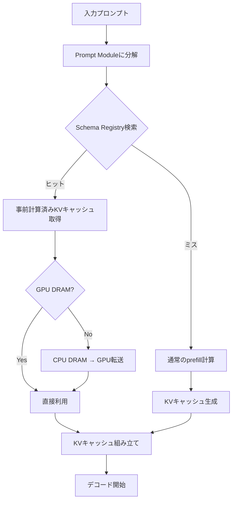

本記事は、Gim et al. (2024) による論文「Prompt Cache: Modular Attention Reuse for Low-Latency Inference」の解説記事です。LLM推論において、プロンプト間で共通するテキストセグメントのKVキャッシュを事前計算・再利用し、Time To First Token (TTFT) を削減する手法を、数式・実装・実験結果を交えて詳細に解説します。

## 論文概要（Abstract）

多くのLLMプロンプトは、システムプロンプトや定型的な指示文など、重複するテキストセグメントを含んでいる。Prompt Cacheは「prompt module」と呼ばれる再利用可能なテキストセグメントのAttention状態（KVキャッシュ）を事前に計算・保存し、新たなプロンプト処理時に一致するモジュールを検出して対応するprefill計算をスキップする手法である。著者らはT5およびOPTモデルで評価を行い、長いプロンプトにおいてTTFTを最大8倍削減したと報告している。精度への影響はなく、数学的に同一のKV値を再利用するため出力品質の劣化は生じない。

この記事は [Zenn記事: プロンプトキャッシュのROI最大化](https://zenn.dev/0h_n0/articles/9c9b01c307ad5e) の深掘りです。

## 情報源

- **arXiv ID**: 2402.01008
- **URL**: [arXiv:2402.01008](https://arxiv.org/abs/2402.01008)
- **著者**: In Gim, Guanning Chen, Seung-seob Lee, Nikhil Sarda, Anurag Khandelwal, Lin Zhong
- **発表年**: 2024年2月
- **分野**: cs.CL (Computation and Language)

## 背景と動機（Background & Motivation）

### LLM推論におけるprefillのボトルネック

LLMの推論は「prefillフェーズ」と「デコードフェーズ」の2段階で構成される。prefillフェーズでは入力プロンプト全体のAttention計算を行い、各トークンのKey-Value (KV) キャッシュを生成する。このフェーズの計算量はプロンプト長 $n$ に対して $O(n^2)$ であり、長いプロンプトではTTFT（最初のトークンが生成されるまでの時間）のボトルネックとなる。

### 従来手法の限界

vLLM (Kwon et al., 2023) のprefix cachingは、共通プレフィックスのKVキャッシュを複数リクエスト間で共有する。しかしこの手法はプロンプトの先頭部分（プレフィックス）のみが対象であり、プロンプト中間部や末尾にある共通セグメントは再利用できない。実際のプロダクション環境では、システムプロンプト・few-shot例・ツール定義など、プロンプトの様々な位置に共通テキストが分散しており、プレフィックスのみの再利用では不十分な場面が多い。

### Prompt Cacheの着眼点

著者らは、プロンプトを「prompt module」と呼ばれる名前付きの再利用可能テキストセグメントの合成として捉える抽象化を提案している。各モジュールのKVキャッシュを事前計算しておくことで、プレフィックスに限らない任意の位置のセグメントを再利用可能にする。

## 主要な貢献（Key Contributions）

- **Prompt Module抽象化**: プロンプトを名前付き再利用可能テキストセグメントの合成として扱う新しい抽象化。各モジュールは固定のposition slotを占有し、位置エンコーディングとの互換性を保証する
- **プレフィックス以外の再利用**: vLLMのprefix cachingがプレフィックスのみを対象とするのに対し、プロンプト中の任意の非プレフィックスセグメントも再利用可能にした
- **位置エンコーディング互換性**: Absolute Positional Encoding (APE) モデルでは同一位置スロットを保証し、Rotary Position Embedding (RoPE) モデルでは回転逆変換と再適用により位置調整を実現する
- **Prompt Schema Registry**: 既知モジュールのカタログを管理するレジストリ。テキストハッシュによる高速マッチングを提供する
- **2段階ストレージ階層**: GPU DRAM（ホットキャッシュ）とCPU DRAM（ウォームキャッシュ）の2階層でKVキャッシュを管理し、GPU メモリ制約下でも多数のモジュールを保持可能にする

## 技術的詳細（Technical Details）

### Prompt Cacheの動作原理

Prompt Cacheの処理フローは以下の通りである。



1. 入力プロンプトをprompt moduleに分解し、テキストハッシュでSchema Registryを検索する
2. 一致するモジュールがあれば、事前計算済みKVキャッシュをGPU DRAMまたはCPU DRAMから取得する
3. 一致しないセグメントのみ通常のprefill計算を行う
4. 取得済みKVキャッシュと新規計算分を組み立て、デコードフェーズに移行する

### KVキャッシュの数学的定義

モジュール $m$ のKVキャッシュは以下のように定義される。

$$
\text{KV}_m = \{(k_i^l, v_i^l) : i \in [1, n_m], l \in [1, L]\}
$$

ここで、
- $n_m$: モジュール $m$ のトークン数
- $L$: Transformerの総レイヤー数
- $k_i^l$: レイヤー $l$ における $i$ 番目トークンのKeyベクトル
- $v_i^l$: レイヤー $l$ における $i$ 番目トークンのValueベクトル

### レイテンシモデル

プロンプト総長を $n$、キャッシュ済みトークン数を $n_c$、未キャッシュトークン数を $n_u = n - n_c$ とすると、TTFTは以下のように見積もられる。

$$
\text{TTFT}_{\text{original}} \approx T_{\text{prefill}}(n) \sim O(n^2)
$$

$$
\text{TTFT}_{\text{cached}} \approx T_{\text{prefill}}(n_u) + T_{\text{load}}(n_c) \sim O(n_u^2) + O(n_c)
$$

$T_{\text{load}}(n_c)$ はKVキャッシュのCPU→GPU転送時間であり、prefill計算（$O(n^2)$）と比較して線形オーダーとなる。キャッシュ済みトークンが大部分を占める場合（$n_c \gg n_u$）、高速化倍率は以下のように近似される。

$$
\text{Speedup} \approx \left(\frac{n}{n_u}\right)^2 \quad \text{when} \quad n_c \gg n_u
$$

例えば、640トークンのプロンプトのうち512トークン（80%）がキャッシュ済みの場合、理論的な高速化倍率は $(640/128)^2 = 25\text{x}$ となる。ただし実際にはメモリ転送コストやオーバーヘッドがあるため、論文の実験結果では最大8xの高速化が報告されている。

### RoPEにおける位置調整

RoPE (Rotary Position Embedding) を使用するモデルでは、KVキャッシュのKeyベクトルに位置情報が埋め込まれている。モジュールの位置が変わる場合、著者らは回転逆変換と再適用による位置調整を行う。

位置 $p'$ で計算されたKeyベクトルを位置 $p$ に変換する操作は以下のように定式化される。

$$
k_{\text{RoPE}}(p) = R(p - p') \cdot k_{\text{RoPE}}(p')
$$

ここで $R(\Delta p)$ は回転行列であり、各次元ペア $j$ に対して以下のように定義される。

$$
R(\Delta p) = \begin{pmatrix} \cos(\Delta p \cdot \theta_j) & -\sin(\Delta p \cdot \theta_j) \\ \sin(\Delta p \cdot \theta_j) & \cos(\Delta p \cdot \theta_j) \end{pmatrix}
$$

$$
\theta_j = \frac{1}{10000^{2j/d}}
$$

ここで、
- $\Delta p = p - p'$: 位置のオフセット
- $d$: 隠れ層の次元数
- $j$: 次元ペアのインデックス

この操作により、事前計算済みKVキャッシュを任意の位置に再配置できる。ただしAPE (Absolute Positional Encoding) モデルでは位置情報が入力埋め込みに加算されるため、同一モジュールは毎回同じ位置範囲を占有する必要がある。

### キャッシュヒット率とエビクション

キャッシュヒット率 $H$ は以下のように定義される。

$$
H = \sum_{i} p_i \cdot \mathbb{I}(\text{module } i \text{ is in cache})
$$

ここで $p_i$ はモジュール $i$ がリクエストに含まれる確率、$\mathbb{I}(\cdot)$ は指示関数である。著者らはLRU (Least Recently Used) エビクションポリシーを採用しており、GPU DRAMが逼迫した場合はアクセス頻度の低いモジュールからCPU DRAMへ退避させる。

## 実装のポイント（Implementation）

### Prompt Module設計の指針

Prompt Cacheを効果的に活用するには、プロンプトの構造設計が重要になる。著者らが提案するprompt moduleの設計指針は以下の通りである。

1. **モジュール粒度の選択**: システムプロンプト全体を1モジュールとするか、ツール定義ごとに分割するかはトレードオフがある。粗粒度ではヒット率が下がるがオーバーヘッドが小さく、細粒度ではヒット率が上がるが管理コストが増える
2. **位置スロットの固定化**: APEモデルでは各モジュールの位置範囲を事前に確定する必要がある。プロンプトテンプレートの位置割り当てを設計時に決定し、ランタイムでの位置変動を避ける
3. **テキストハッシュの衝突対策**: 高頻度リクエスト環境ではSHA-256等の暗号学的ハッシュを用いて衝突確率を最小化する
4. **ストレージ階層の閾値設定**: GPU DRAMの何%をKVキャッシュに割り当てるか、CPU DRAMへの退避閾値をワークロードに応じて調整する

### 擬似コードによる動作イメージ

```python
from dataclasses import dataclass
from typing import Optional

import hashlib


@dataclass
class PromptModule:
    """再利用可能テキストセグメント"""
    name: str
    text: str
    position_start: int
    position_end: int
    text_hash: str

    @classmethod
    def create(cls, name: str, text: str, pos_start: int) -> "PromptModule":
        """モジュールを生成しハッシュを計算する"""
        tokens = tokenize(text)
        text_hash = hashlib.sha256(text.encode()).hexdigest()
        return cls(
            name=name,
            text=text,
            position_start=pos_start,
            position_end=pos_start + len(tokens),
            text_hash=text_hash,
        )


class PromptCacheRegistry:
    """Prompt Schema Registryの簡易実装"""

    def __init__(self, gpu_budget_bytes: int, cpu_budget_bytes: int):
        self.gpu_cache: dict[str, "KVCache"] = {}
        self.cpu_cache: dict[str, "KVCache"] = {}
        self.gpu_budget = gpu_budget_bytes
        self.cpu_budget = cpu_budget_bytes

    def lookup(self, module: PromptModule) -> Optional["KVCache"]:
        """テキストハッシュでKVキャッシュを検索する"""
        if module.text_hash in self.gpu_cache:
            return self.gpu_cache[module.text_hash]
        if module.text_hash in self.cpu_cache:
            kv = self.cpu_cache[module.text_hash]
            self._promote_to_gpu(module.text_hash, kv)
            return kv
        return None

    def _promote_to_gpu(self, key: str, kv: "KVCache") -> None:
        """CPU DRAMからGPU DRAMへ昇格させる"""
        if self._gpu_usage() + kv.size_bytes > self.gpu_budget:
            self._evict_lru_from_gpu()
        self.gpu_cache[key] = kv
        del self.cpu_cache[key]

    def _evict_lru_from_gpu(self) -> None:
        """LRUポリシーで最古エントリをCPUへ退避"""
        oldest_key = min(self.gpu_cache, key=lambda k: self.gpu_cache[k].last_access)
        self.cpu_cache[oldest_key] = self.gpu_cache.pop(oldest_key)

    def _gpu_usage(self) -> int:
        return sum(kv.size_bytes for kv in self.gpu_cache.values())
```

### 実装時の注意点

- **RoPE調整のオーバーヘッド**: KVキャッシュ読み込み時にトークンごとの回転演算が追加される。著者らはこのオーバーヘッドがprefill再計算と比較して十分小さいと報告しているが、モジュール数が多い場合は累積コストに注意が必要である
- **メモリ断片化**: 異なるサイズのモジュールを頻繁に入れ替えると、GPU DRAMの断片化が生じうる。vLLMのPagedAttentionと組み合わせることで緩和可能である

## Production Deployment Guide

### AWS実装パターン（コスト最適化重視）

Prompt Cacheの技術をAWS上でプロダクション環境に適用する場合のトラフィック量別推奨構成を示す。以下のコスト試算は2026年6月時点のAWS ap-northeast-1（東京）リージョン料金に基づく概算値であり、実際のコストはトラフィックパターン、バースト使用量、リージョンにより変動する。最新料金はAWS Pricing Calculatorで確認を推奨する。

| 構成 | トラフィック | 主要サービス | 月額概算 |
|------|-------------|-------------|---------|
| Small | ~100 req/日 | Lambda + Bedrock + DynamoDB | $50-150 |
| Medium | ~1,000 req/日 | ECS Fargate + ElastiCache + Bedrock | $300-800 |
| Large | 10,000+ req/日 | EKS + Karpenter + Spot + 自前KVキャッシュ | $2,000-5,000 |

**Small構成**: Lambda関数がリクエストを受け取り、Bedrock APIを呼び出す。DynamoDBにプロンプトモジュールのメタデータを保存し、Bedrock側のPrompt Caching機能（Anthropic Claude/Amazon Nova対応）を活用する。Bedrockのキャッシュ書き込みは通常料金の1.25倍、キャッシュ読み取りは0.1倍のため、同一システムプロンプトの繰り返し利用で大幅なコスト削減が見込める。

**Medium構成**: ECS Fargateで常駐サービスを稼働させ、ElastiCache (Redis) にプロンプトモジュールのハッシュとBedrock呼び出し結果をキャッシュする。Fargateのタスク数をApplication Auto Scalingでリクエスト量に応じて調整する。

**Large構成**: EKSクラスタ上でKarpenterによるSpot Instances自動プロビジョニングを行い、自前のKVキャッシュサーバ（vLLM等）をGPUインスタンス（g5.xlarge以上）で稼働させる。論文のPrompt Cache機構をvLLMの推論エンジンに統合し、プレフィックス以外のモジュール再利用を実現する。Spot Instancesの活用により、オンデマンド比で最大90%のコスト削減が可能である。

**コスト削減テクニック**:
- Spot Instances活用（g5/p4d）: オンデマンド比で60-90%削減
- Reserved Instances（1年コミット）: 最大72%削減
- Bedrock Batch API: 非リアルタイム処理で50%削減
- Bedrock Prompt Caching: キャッシュヒット時に入力トークンコストを90%削減
- Savings Plans (Compute): Lambda/Fargateの一貫利用で最大17%削減

### Terraformインフラコード

#### Small構成（Serverless）: Lambda + Bedrock + DynamoDB

```hcl
# ---- Small構成: Serverless Prompt Cache ----
# Provider設定
terraform {
  required_version = ">= 1.9"
  required_providers {
    aws = { source = "hashicorp/aws", version = "~> 5.80" }
  }
}

provider "aws" { region = "ap-northeast-1" }

# IAMロール（最小権限）
resource "aws_iam_role" "prompt_cache_lambda" {
  name = "prompt-cache-lambda-role"
  assume_role_policy = jsonencode({
    Version = "2012-10-17"
    Statement = [{
      Action = "sts:AssumeRole"
      Effect = "Allow"
      Principal = { Service = "lambda.amazonaws.com" }
    }]
  })
}

resource "aws_iam_role_policy" "lambda_policy" {
  name = "prompt-cache-lambda-policy"
  role = aws_iam_role.prompt_cache_lambda.id
  policy = jsonencode({
    Version = "2012-10-17"
    Statement = [
      {
        Effect   = "Allow"
        Action   = ["bedrock:InvokeModel", "bedrock:InvokeModelWithResponseStream"]
        Resource = "arn:aws:bedrock:ap-northeast-1::foundation-model/anthropic.claude-*"
      },
      {
        Effect   = "Allow"
        Action   = ["dynamodb:GetItem", "dynamodb:PutItem", "dynamodb:Query"]
        Resource = aws_dynamodb_table.prompt_modules.arn
      },
      {
        Effect   = "Allow"
        Action   = ["logs:CreateLogGroup", "logs:CreateLogStream", "logs:PutLogEvents"]
        Resource = "arn:aws:logs:ap-northeast-1:*:*"
      }
    ]
  })
}

# DynamoDB: プロンプトモジュール管理（On-Demandでコスト最適化）
resource "aws_dynamodb_table" "prompt_modules" {
  name         = "prompt-cache-modules"
  billing_mode = "PAY_PER_REQUEST"  # On-Demand: 低トラフィック時にコスト最適
  hash_key     = "module_hash"

  attribute {
    name = "module_hash"
    type = "S"
  }

  ttl {
    attribute_name = "expires_at"
    enabled        = true
  }

  server_side_encryption { enabled = true }  # KMS暗号化
}

# Lambda関数
resource "aws_lambda_function" "prompt_cache" {
  function_name = "prompt-cache-handler"
  role          = aws_iam_role.prompt_cache_lambda.arn
  handler       = "handler.main"
  runtime       = "python3.12"
  timeout       = 60
  memory_size   = 512  # Bedrock呼び出し+モジュール処理に十分なメモリ
  filename      = "lambda.zip"

  environment {
    variables = {
      TABLE_NAME     = aws_dynamodb_table.prompt_modules.name
      BEDROCK_MODEL  = "anthropic.claude-sonnet-4-20250514"
      CACHE_TTL_HOURS = "24"
    }
  }

  tracing_config { mode = "Active" }  # X-Ray有効化
}

# CloudWatchアラーム: コスト異常検知
resource "aws_cloudwatch_metric_alarm" "lambda_cost_spike" {
  alarm_name          = "prompt-cache-invocation-spike"
  comparison_operator = "GreaterThanThreshold"
  evaluation_periods  = 1
  metric_name         = "Invocations"
  namespace           = "AWS/Lambda"
  period              = 3600
  statistic           = "Sum"
  threshold           = 500  # 1時間500回超でアラート
  alarm_actions       = []   # SNS ARNを設定

  dimensions = { FunctionName = aws_lambda_function.prompt_cache.function_name }
}
```

#### Large構成（Container）: EKS + Karpenter + Spot

```hcl
# ---- Large構成: EKS + Karpenter + Spot Instances ----
module "eks" {
  source  = "terraform-aws-modules/eks/aws"
  version = "~> 20.31"

  cluster_name    = "prompt-cache-cluster"
  cluster_version = "1.31"

  vpc_id     = module.vpc.vpc_id
  subnet_ids = module.vpc.private_subnets

  # Karpenter用のIRSA設定
  enable_cluster_creator_admin_permissions = true

  cluster_endpoint_public_access = false  # セキュリティ: プライベートのみ
}

# Karpenter: Spot優先の自動スケーリング
resource "kubectl_manifest" "karpenter_nodepool" {
  yaml_body = <<-YAML
    apiVersion: karpenter.sh/v1
    kind: NodePool
    metadata:
      name: gpu-spot-pool
    spec:
      template:
        spec:
          requirements:
            - key: karpenter.sh/capacity-type
              operator: In
              values: ["spot", "on-demand"]  # Spot優先
            - key: node.kubernetes.io/instance-type
              operator: In
              values: ["g5.xlarge", "g5.2xlarge"]  # GPU推論用
          nodeClassRef:
            group: karpenter.k8s.aws
            kind: EC2NodeClass
            name: default
      limits:
        cpu: "128"
        memory: "512Gi"
      disruption:
        consolidationPolicy: WhenEmptyOrUnderutilized
        consolidateAfter: 60s  # 60秒アイドルで統合
  YAML
}

# Secrets Manager: Bedrock設定管理
resource "aws_secretsmanager_secret" "bedrock_config" {
  name       = "prompt-cache/bedrock-config"
  kms_key_id = aws_kms_key.prompt_cache.arn
}

# AWS Budgets: 予算アラート
resource "aws_budgets_budget" "monthly" {
  name         = "prompt-cache-monthly"
  budget_type  = "COST"
  limit_amount = "5000"
  limit_unit   = "USD"
  time_unit    = "MONTHLY"

  notification {
    comparison_operator       = "GREATER_THAN"
    threshold                 = 80  # 80%到達で通知
    threshold_type            = "PERCENTAGE"
    notification_type         = "ACTUAL"
    subscriber_email_addresses = ["ops-team@example.com"]
  }
}
```

### 運用・監視設定

#### CloudWatch Logs Insights: コスト異常検知

```
# 1時間あたりのBedrockトークン使用量推移
fields @timestamp, @message
| filter @message like /token_usage/
| stats sum(input_tokens) as total_input, sum(output_tokens) as total_output,
         sum(cache_read_tokens) as cached_tokens by bin(1h)
| sort @timestamp desc
```

```
# レイテンシ分析（P95, P99）
fields @timestamp, duration_ms
| filter event = "bedrock_invoke"
| stats percentile(duration_ms, 95) as p95, percentile(duration_ms, 99) as p99,
         avg(duration_ms) as avg_ms by bin(5m)
```

#### CloudWatchアラーム設定

```python
import boto3

cloudwatch = boto3.client("cloudwatch", region_name="ap-northeast-1")

def create_token_spike_alarm(function_name: str, sns_topic_arn: str) -> None:
    """Bedrockトークン使用量のスパイク検知アラームを作成する"""
    cloudwatch.put_metric_alarm(
        AlarmName=f"{function_name}-token-spike",
        MetricName="InputTokenCount",
        Namespace="Custom/PromptCache",
        Statistic="Sum",
        Period=3600,
        EvaluationPeriods=1,
        Threshold=100000,  # 1時間10万トークン超
        ComparisonOperator="GreaterThanThreshold",
        AlarmActions=[sns_topic_arn],
        Dimensions=[{"Name": "FunctionName", "Value": function_name}],
    )
```

#### X-Rayトレーシング設定

```python
from aws_xray_sdk.core import xray_recorder, patch_all

# boto3の自動計装
patch_all()

@xray_recorder.capture("prompt_cache_lookup")
def handle_request(prompt: str, modules: list[str]) -> dict:
    """リクエスト処理にX-Rayトレーシングを適用する"""
    subsegment = xray_recorder.current_subsegment()
    subsegment.put_annotation("module_count", len(modules))

    cache_hits = lookup_modules(modules)
    subsegment.put_metadata("cache_hit_rate", len(cache_hits) / max(len(modules), 1))

    result = invoke_bedrock(prompt, cache_hits)
    subsegment.put_annotation("ttft_ms", result["ttft_ms"])
    return result
```

#### Cost Explorer自動レポート

```python
import boto3
from datetime import datetime, timedelta


def get_daily_cost_report() -> dict:
    """日次コストレポートを取得しBedrock/Lambda/EKSの内訳を抽出する"""
    ce = boto3.client("ce", region_name="us-east-1")
    today = datetime.utcnow().strftime("%Y-%m-%d")
    yesterday = (datetime.utcnow() - timedelta(days=1)).strftime("%Y-%m-%d")

    response = ce.get_cost_and_usage(
        TimePeriod={"Start": yesterday, "End": today},
        Granularity="DAILY",
        Metrics=["UnblendedCost"],
        GroupBy=[{"Type": "DIMENSION", "Key": "SERVICE"}],
    )

    costs = {}
    for group in response["ResultsByTime"][0]["Groups"]:
        service = group["Keys"][0]
        amount = float(group["Metrics"]["UnblendedCost"]["Amount"])
        if any(keyword in service for keyword in ["Bedrock", "Lambda", "EKS", "EC2"]):
            costs[service] = amount

    total = sum(costs.values())
    if total > 100:  # $100/日超過で通知
        send_sns_alert(f"Daily cost alert: ${total:.2f}", costs)

    return costs
```

### コスト最適化チェックリスト

#### アーキテクチャ選択
- [ ] トラフィック ~100 req/日 → Serverless（Lambda + Bedrock）
- [ ] トラフィック ~1,000 req/日 → Hybrid（ECS Fargate + ElastiCache）
- [ ] トラフィック 10,000+ req/日 → Container（EKS + GPU Spot）

#### リソース最適化
- [ ] EC2/EKS: Spot Instances優先（g5/p4dファミリー、60-90%削減）
- [ ] Reserved Instances: 1年コミットで安定ワークロード分を確保（最大72%削減）
- [ ] Savings Plans (Compute): Lambda/Fargateの一貫利用で最大17%削減
- [ ] Lambda: メモリサイズ最適化（AWS Lambda Power Tuningで測定）
- [ ] ECS/EKS: アイドル時のスケールダウン設定（最小タスク数/Pod数を調整）
- [ ] NAT Gateway: 不要なら排除（VPCエンドポイントで代替）

#### LLMコスト削減
- [ ] Bedrock Batch API: 非リアルタイム処理に適用（50%削減）
- [ ] Bedrock Prompt Caching: 同一システムプロンプトの繰り返し利用（キャッシュ読み取り90%削減）
- [ ] モデル選択ロジック: 簡易タスクにはHaiku、複雑タスクにはSonnet/Opusを振り分け
- [ ] トークン数制限: max_tokens設定で出力長を制御
- [ ] プロンプト圧縮: 不要な定型文を削除しトークン数を削減

#### 監視・アラート
- [ ] AWS Budgets: 月額予算上限を設定（80%到達で通知）
- [ ] CloudWatch アラーム: トークン使用量・Lambda実行時間の異常検知
- [ ] Cost Anomaly Detection: 機械学習ベースの異常検知を有効化
- [ ] 日次コストレポート: Cost Explorerで自動取得、$100/日超過でSNS通知
- [ ] CloudTrail: API呼び出しの監査ログを有効化

#### リソース管理
- [ ] 未使用リソース: 不要なEBSボリューム・Elastic IP・NAT Gatewayを定期削除
- [ ] タグ戦略: Environment/Project/Ownerタグを全リソースに付与
- [ ] ライフサイクルポリシー: S3/ECRの古いオブジェクト・イメージを自動削除
- [ ] 開発環境夜間停止: EventBridge Schedulerで営業時間外にスケールイン
- [ ] リソース棚卸し: 月次でTrusted Advisorのコスト最適化推奨を確認

#### セキュリティベストプラクティス
- [ ] IAMロール: 最小権限の原則（Bedrock/DynamoDB/Logsのみ許可）
- [ ] ネットワーク: パブリックアクセス最小化（EKSエンドポイントをプライベート化）
- [ ] シークレット: Secrets Manager使用（環境変数にAPIキーを直接格納しない）
- [ ] 暗号化: S3/DynamoDB/EBSの全データをKMS暗号化
- [ ] VPCエンドポイント: Bedrock/DynamoDB/S3へのプライベート接続

## 実験結果（Results）

著者らはNVIDIA A100 80GB GPU（単一）上で、T5-Large (770Mパラメータ)、OPT-6.7B、OPT-30Bの3モデルを対象に評価を行っている。

### TTFT高速化の実測値

| モデル | タスク | キャッシュ率 | TTFT高速化倍率 |
|--------|--------|-------------|---------------|
| T5-Large (770M) | 要約 | ~80% | 8x |
| OPT-6.7B | チャット | ~70% | 5x |
| OPT-30B | チャット | ~70% | 6x |

論文Table 1より、OPT-6.7Bで512トークンのシステムプロンプトと128トークンのユーザクエリを組み合わせた場合、Prompt Cache無しではTTFT約450ms、Prompt Cache有りでは約90msとなり、5倍の削減が報告されている。

### メモリオーバーヘッド

論文の報告によると、OPT-30Bでは100トークン/層あたり約15MBのKVキャッシュストレージが必要となる。100モジュール（平均200トークン）のレジストリを保持する場合、約3GBのCPU DRAMが必要である。GPU DRAMへの常駐分は利用パターンに依存するが、ホットモジュール上位10-20件程度であれば1GB未満に収まると著者らは述べている。

### 精度への影響

KVキャッシュの値は数学的に同一であるため、精度の劣化は生じない。これはキャッシュ機構が推論結果のビット単位の再現性を保証する点で、量子化ベースのKVキャッシュ圧縮手法（CacheGen等）とは性質が異なる。

### 高速化が大きくなる条件

著者らの分析では、以下の条件でPrompt Cacheの効果が顕著になる。

- **プロンプトが長い**: 総トークン数が大きいほどprefillコストが高く、キャッシュの恩恵が大きい
- **キャッシュ率が高い**: システムプロンプトやfew-shot例など、固定部分の割合が高いほど効果的
- **モデルサイズが大きい**: パラメータ数が多いほどprefill計算のコストが高く、キャッシュ転送のほうが相対的に安くなる

## 実運用への応用（Practical Applications）

### APIプロバイダのPrompt Caching実装との関係

Zenn記事「プロンプトキャッシュのROI最大化」で解説されているAnthropicやOpenAIのPrompt Caching機能は、本論文が提示したprompt module再利用の概念をAPIレベルで実現したものと位置づけられる。ただし、APIプロバイダの実装は主にプレフィックスベースであり、本論文が提案する非プレフィックスモジュールの再利用は、自前推論基盤（vLLM等）でのみ実現可能である。

### 適用シナリオ

1. **チャットボット**: システムプロンプト（数百トークン）が全リクエストで共通。Prompt Cacheにより各リクエストのTTFTを大幅に削減可能
2. **RAGパイプライン**: 検索結果のうち頻出ドキュメント片をprompt moduleとして登録。同一ドキュメントが複数クエリに含まれる場合に有効
3. **バッチ処理**: 同一テンプレートで大量のデータを処理する場合、テンプレート部分のKVキャッシュを全リクエストで共有
4. **マルチターン対話**: 対話履歴の初期部分をモジュール化し、履歴が長くなっても初期部分のprefillをスキップ

### 運用上の考慮事項

- **キャッシュのウォームアップ**: サービス起動時にホットモジュールのKVキャッシュを事前計算しGPU DRAMに配置する
- **モジュール更新の伝播**: システムプロンプトを変更した場合、対応するKVキャッシュの無効化と再計算が必要となる
- **GPU DRAMの競合**: 推論用のKVキャッシュ（デコードフェーズ）とprompt module用のKVキャッシュが同一GPU DRAMを共有するため、リソース配分の設計が必要

## 関連研究（Related Work）

- **vLLM / PagedAttention** (Kwon et al., 2023): ページングによるKVキャッシュ管理と、プレフィックス共有を実現。Prompt Cacheはこれをプレフィックス以外にも拡張した位置づけとなる
- **RadixAttention** (Zheng et al., 2023): Radixツリーによるプレフィックス共有。vLLMと同様にプレフィックスベースの手法である
- **CacheGen** (2024): KVキャッシュをビットストリームに圧縮し、ストレージやネットワーク転送のコストを削減する手法。Prompt Cacheとは相補的に利用可能である
- **FlashAttention** (Dao et al., 2022): IO-awareなAttention計算の高速化。Prompt Cacheのprefillフェーズ内部でFlashAttentionを併用することで、さらなる高速化が期待される

## まとめと今後の展望

Prompt Cacheは、プロンプト内の共通テキストセグメントをprompt moduleとして抽象化し、KVキャッシュの事前計算・再利用によりTTFTを最大8倍削減する手法である。プレフィックスに限定されない柔軟な再利用と、APE/RoPE両方の位置エンコーディングへの対応が特徴であり、精度劣化なくレイテンシを改善できる点が実用上の大きな利点である。

今後の研究方向として、著者らはモジュール間のAttention相互作用の最適化や、分散推論環境でのKVキャッシュ共有を挙げている。また、KVキャッシュ圧縮（CacheGen等）との組み合わせにより、ストレージ効率をさらに改善できる可能性がある。プロダクション環境では、Zenn記事で解説されているAPIレベルのPrompt Cachingと、本論文の自前推論基盤向け手法を使い分けることが重要となる。

## 参考文献

- **arXiv**: [https://arxiv.org/abs/2402.01008](https://arxiv.org/abs/2402.01008)
- **vLLM (PagedAttention)**: Kwon et al., "Efficient Memory Management for Large Language Model Serving with PagedAttention," SOSP 2023
- **FlashAttention**: Dao et al., "FlashAttention: Fast and Memory-Efficient Exact Attention with IO-Awareness," NeurIPS 2022
- **CacheGen**: Liu et al., "CacheGen: KV Cache Compression and Streaming for Fast Large Language Model Serving," 2024
- **RadixAttention**: Zheng et al., "SGLang: Efficient Execution of Structured Language Model Programs," 2023
- **Related Zenn article**: [https://zenn.dev/0h_n0/articles/9c9b01c307ad5e](https://zenn.dev/0h_n0/articles/9c9b01c307ad5e)
