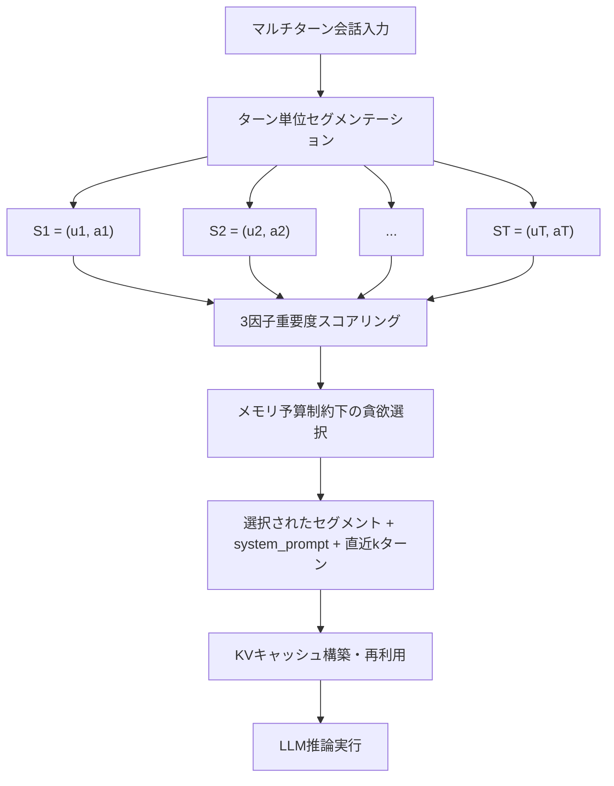
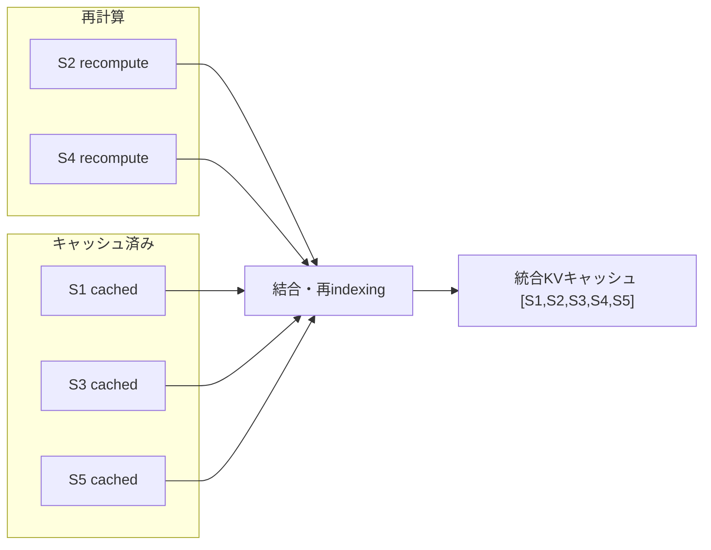
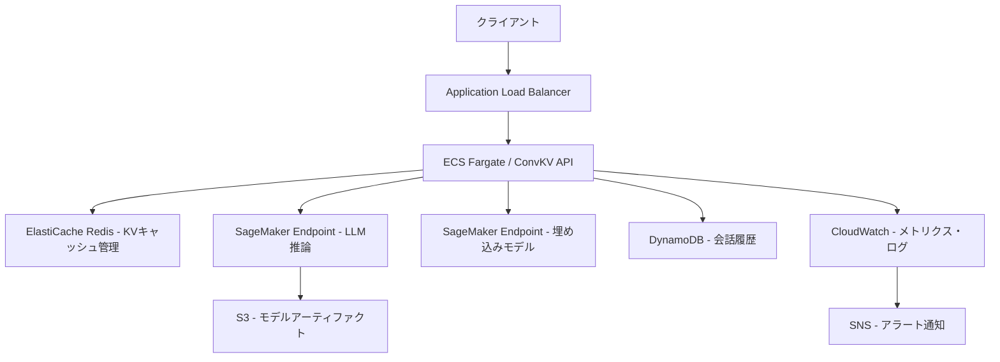

## 論文概要

本記事は、Liu et al. (2024) による論文「Cost-Efficient Large Language Model Serving for Multi-turn Conversations」（arXiv:2409.08239）の解説記事です。ConvKVは、マルチターン会話におけるLLM推論コストの増大問題に対し、会話ターン単位のセグメンテーションと3因子重要度スコアリングを組み合わせた選択的KVキャッシュ管理手法です。著者らは、LLaMA-2-7B/13B、Mistral-7Bでの実験において、50%のキャッシュ予算で49-54%のコスト削減を達成し、品質低下を2%未満に抑えたと報告しています。

この記事は [Zenn記事: プロンプトキャッシュのROI最大化](https://zenn.dev/0h_n0/articles/9c9b01c307ad5e) の深掘りです。

## 情報源

- **arXiv ID**: 2409.08239
- **URL**: [arXiv:2409.08239](https://arxiv.org/abs/2409.08239)
- **著者**: Wanlong Liu, Junyi Cao, Haipeng Luo, Jian Dong, Yang Zhou, Hua Xing, Haikang Diao, Cen Chen
- **発表**: 2024年9月
- **分野**: Computation and Language (cs.CL)

## 背景と動機

マルチターン会話はLLMの主要なユースケースの一つであるが、会話が進むにつれてコンテキスト長が累積的に増加し、推論コストが増大するという構造的課題がある。具体的には、ターン数Tの会話でターンT+1を処理する際、入力トークン数nはTに比例して増加し、prefill（プロンプト処理）フェーズの計算コストは$$O(n^2)$$で増大する。10ターンの会話では初回ターンの数十倍の計算資源が必要になる場合もある。

既存のKVキャッシュ管理手法（vLLM、PagedAttention等）は主に単一リクエスト内のメモリ効率化や固定プレフィックスの共有を対象としており、マルチターン会話特有の「どのターンの情報が現在の応答に重要か」という動的な判断は行っていない。また、単純に直近ターンのみを保持する手法では、会話初期に提示された重要なコンテキスト（ユーザーの前提条件、タスク定義等）が失われ、応答品質が低下するリスクがある。ConvKVは、この「コスト」と「品質」のトレードオフに対して、会話構造を活用した選択的キャッシュ管理で解決を図る。

## 主要な貢献

1. **ターンレベルセグメンテーション**: トークン単位ではなく会話ターン(ユーザー発話, アシスタント応答)を管理単位とし、意味的まとまりを保持
2. **3因子重要度スコアリング**: 直近性(recency)、関連性(relevance)、情報量(information content)の3軸でターンの重要度を定量評価
3. **メモリ予算制約下の貪欲選択アルゴリズム**: 予算内で最大の情報価値を保持する選択戦略
4. **選択的KVキャッシュ再利用**: 不連続ターンのキャッシュを効率的に結合する再利用メカニズム
5. **実験的検証**: 複数モデル・ベンチマークで49-54%のコスト削減と品質維持を実証

## 技術的詳細

### 会話構造のモデリング

ConvKVは、マルチターン会話を以下のように形式化する。

$$C = (u_1, a_1, u_2, a_2, \ldots, u_T, a_T)$$

ここで$$u_t$$はターンtのユーザー発話、$$a_t$$はアシスタント応答を表す。セグメント$$S_t$$は1ターン分の交換を単位とする：

$$S_t = (u_t, a_t) \quad \text{for } t = 1, \ldots, T$$

ターンT+1での入力シーケンスは以下の通り：

$$\text{Input} = [\text{system\_prompt}, u_1, a_1, \ldots, u_T, a_T, u_{T+1}]$$

この入力のトークン総数$$n$$はターン数$$T$$に比例して増加するため、Self-Attentionのprefillコストは$$O(n^2)$$で増大する。



### 3因子重要度スコアリング

各セグメント$$S_t$$の重要度スコアは、3つの因子の重み付き和として計算される：

$$\text{score}(S_t) = \alpha \cdot \text{recency}(t) + \beta \cdot \text{relevance}(t, u_{T+1}) + \gamma \cdot \text{info\_content}(S_t)$$

ここで$$\alpha + \beta + \gamma = 1$$であり、著者らの実験では$$\alpha = 0.4, \beta = 0.4, \gamma = 0.2$$が経験的な最適値として報告されている。

#### 直近性（Recency）

直近性はターンの時間的近さを反映する。直近のターンほど現在の会話に関連が高いという仮定に基づく。著者らは指数減衰関数や線形減衰等の複数の関数を検討しており、一般的には以下のような形式となる：

$$\text{recency}(t) = f(T - t)$$

ここで$$f$$は単調減少関数であり、ターンtが現在のターンTから遠いほど低い値を返す。

#### 関連性（Relevance）

関連性は、セグメント$$S_t$$の内容が次のユーザー発話$$u_{T+1}$$とどの程度意味的に関連しているかを測定する：

$$\text{relevance}(t, u_{T+1}) = \cos\_sim(\text{embed}(S_t), \text{embed}(u_{T+1}))$$

ここで$$\text{embed}(\cdot)$$は軽量な埋め込みモデル（sentence-transformers等）による文ベクトル表現である。コサイン類似度により、意味的に関連するターンが高い値を持つ。

著者らは、この関連性計算に軽量な埋め込みモデルを使用することで、オーバーヘッドをターンあたり10ms程度に抑えていると報告している。ただし、このオーバーヘッドがターン数に比例して蓄積する点は留意が必要である。

#### 情報量（Information Content）

情報量はセグメント内のコンテンツの密度や独自性を評価する。著者らの手法では、セグメントに含まれるトークンの多様性や、他のセグメントとの重複度合い等が考慮される。

### 貪欲選択アルゴリズム

メモリ予算$$B$$（トークン数で指定）の制約下で、スコア降順にセグメントを選択する。ただし、以下の要素は常時保持される：

- **system_prompt**: タスク定義やペルソナ設定を含む
- **直近kターン**（$$k=2$$がデフォルト）: 会話の流れの連続性を保証

```python
from dataclasses import dataclass

@dataclass
class Segment:
    """会話ターンセグメント."""
    turn_id: int
    tokens: list[int]
    score: float

def greedy_select(
    segments: list[Segment],
    budget: int,
    always_keep_last_k: int = 2,
) -> list[Segment]:
    """メモリ予算制約下でスコア上位のセグメントを選択する.

    Args:
        segments: 全ターンのセグメントリスト（時系列順）
        budget: メモリ予算（トークン数）
        always_keep_last_k: 常時保持する直近ターン数

    Returns:
        選択されたセグメントリスト（時系列順にソート）
    """
    n = len(segments)
    # 直近kターンは常時保持
    always_kept = segments[max(0, n - always_keep_last_k):]
    candidates = segments[:max(0, n - always_keep_last_k)]

    used_budget = sum(len(s.tokens) for s in always_kept)
    remaining = budget - used_budget

    # スコア降順でソートし、予算内で選択
    scored = sorted(candidates, key=lambda s: s.score, reverse=True)
    selected = []
    for seg in scored:
        token_count = len(seg.tokens)
        if token_count <= remaining:
            selected.append(seg)
            remaining -= token_count

    # 時系列順にソートして返す
    result = sorted(selected + list(always_kept), key=lambda s: s.turn_id)
    return result
```

### 選択的KVキャッシュ再利用

ConvKVの核心的な工夫の一つが、不連続なターンのKVキャッシュを効率的に再利用するメカニズムである。著者らは2つの戦略を提案している。

#### 戦略1: ターンレベルプレフィックス拡張

ターン1からkまでのKVキャッシュが既に計算済みで、ターンk+1が新規に追加される場合、k+1のKVのみを追加計算する。これは従来のプレフィックスキャッシュの自然な拡張である。

#### 戦略2: 選択的ターン再利用

より複雑なケースとして、不連続なターン（例: ターン1, 3, 5）がキャッシュ済みの場合を扱う。

1. キャッシュ済みターンのKV値をロード
2. evicted（排除された）ターン（例: ターン2, 4）のKVを再計算
3. 全体を正しい順序で結合



#### 位置エンコーディングの取り扱い

セグメントの選択的保持により、元の位置インデックスに不連続なギャップが生じる。著者らは**compact re-indexing**を採用している。これは、保持されたトークンを$$0, 1, \ldots, n'-1$$（$$n'$$は保持トークン総数）に連続的に再番号付けする手法である。

ただし、この再番号付けにより、元の位置関係が変化する。例えば、ターン1とターン5の間に本来存在していたターン2-4が排除されると、ターン1とターン5のトークン間の位置距離が圧縮される。著者らはこの影響が実験上は限定的であったと報告しているが、位置エンコーディングに強く依存するモデル（特にRoPEベースのモデル）での影響は今後の検討課題として挙げられている。

## 実装のポイント

ConvKVを実装する際に考慮すべき技術的ポイントを整理する。

### 埋め込みモデルの選択

関連性スコアの計算には軽量な埋め込みモデルが必要である。著者らはsentence-transformers系のモデルを使用しており、推論時のオーバーヘッドをターンあたり10ms程度に抑えている。実装時には以下を考慮する必要がある：

- **レイテンシ**: 埋め込み計算がターンごとに発生するため、モデルサイズとレイテンシのトレードオフを検討
- **多言語対応**: 日本語等の非英語会話に対応する場合、多言語対応の埋め込みモデル（multilingual-e5-large等）が必要
- **バッチ処理**: 過去ターンの埋め込みはキャッシュし、新規ユーザー発話の埋め込みのみをリアルタイム計算

### ターン境界の検出

ConvKVは明確なターン境界を前提としている。チャットAPIのように構造化された入力では自然にターン境界が得られるが、以下のケースでは追加の考慮が必要となる：

- **ストリーミング入力**: ユーザー発話の終端判定
- **マルチモーダル入力**: 画像・音声を含むターンのセグメント化
- **システムメッセージの挿入**: 途中でsystem_promptが変更される場合

### スコアリング重みのチューニング

著者らの報告する最適値（$$\alpha=0.4, \beta=0.4, \gamma=0.2$$）はMT-Benchでの実験に基づく。タスクの性質によって最適な重みは異なる可能性がある：

- **事実確認型会話**: 関連性$$\beta$$の重みを上げる
- **連続的な議論**: 直近性$$\alpha$$の重みを上げる
- **要約・分析タスク**: 情報量$$\gamma$$の重みを上げる

```python
from dataclasses import dataclass
from enum import Enum


class ConversationType(Enum):
    """会話タイプに応じた重みプリセット."""
    FACTUAL = "factual"
    SEQUENTIAL = "sequential"
    ANALYTICAL = "analytical"
    DEFAULT = "default"


@dataclass(frozen=True)
class ScoringWeights:
    """重要度スコアリングの重み."""
    alpha: float  # recency
    beta: float   # relevance
    gamma: float  # info_content

    def __post_init__(self) -> None:
        total = self.alpha + self.beta + self.gamma
        if abs(total - 1.0) > 1e-6:
            msg = f"Weights must sum to 1.0, got {total}"
            raise ValueError(msg)


WEIGHT_PRESETS: dict[ConversationType, ScoringWeights] = {
    ConversationType.DEFAULT: ScoringWeights(0.4, 0.4, 0.2),
    ConversationType.FACTUAL: ScoringWeights(0.2, 0.6, 0.2),
    ConversationType.SEQUENTIAL: ScoringWeights(0.6, 0.2, 0.2),
    ConversationType.ANALYTICAL: ScoringWeights(0.2, 0.3, 0.5),
}
```

## Production Deployment Guide

ConvKVを組み込んだマルチターン会話サービスをAWS上にデプロイする場合の構成を以下に示す。

### アーキテクチャ構成



#### Small構成（開発・検証用、月額目安: $800-1,500）

| コンポーネント | サービス | スペック |
|---|---|---|
| API | ECS Fargate | 1 vCPU, 2GB RAM x 2タスク |
| LLM推論 | SageMaker (ml.g5.xlarge) | 1インスタンス |
| 埋め込み | SageMaker (ml.m5.large) | 1インスタンス |
| KVキャッシュ | ElastiCache Redis | cache.t3.small |
| 会話履歴 | DynamoDB | オンデマンドキャパシティ |

#### Medium構成（本番初期、月額目安: $3,000-5,000）

| コンポーネント | サービス | スペック |
|---|---|---|
| API | ECS Fargate | 2 vCPU, 4GB RAM x 4タスク |
| LLM推論 | SageMaker (ml.g5.2xlarge) | 2インスタンス（Auto Scaling） |
| 埋め込み | SageMaker (ml.g4dn.xlarge) | 2インスタンス |
| KVキャッシュ | ElastiCache Redis | cache.r6g.large（クラスタモード） |
| 会話履歴 | DynamoDB | プロビジョンドキャパシティ |

#### Large構成（大規模本番、月額目安: $10,000-20,000）

| コンポーネント | サービス | スペック |
|---|---|---|
| API | ECS Fargate | 4 vCPU, 8GB RAM x 8タスク |
| LLM推論 | SageMaker (ml.g5.12xlarge) | 4インスタンス（Auto Scaling） |
| 埋め込み | SageMaker (ml.g4dn.xlarge) | 4インスタンス |
| KVキャッシュ | ElastiCache Redis | cache.r6g.xlarge（マルチAZクラスタ） |
| 会話履歴 | DynamoDB | Global Tables（マルチリージョン） |
| CDN | CloudFront | WebSocket対応 |

### Terraformインフラコード

以下は、Medium構成の主要コンポーネントを定義するTerraformコードである。

```hcl
# --- VPC & ネットワーク ---
module "vpc" {
  source  = "terraform-aws-modules/vpc/aws"
  version = "~> 5.0"

  name = "convkv-vpc"
  cidr = "10.0.0.0/16"

  azs             = ["ap-northeast-1a", "ap-northeast-1c"]
  private_subnets = ["10.0.1.0/24", "10.0.2.0/24"]
  public_subnets  = ["10.0.101.0/24", "10.0.102.0/24"]

  enable_nat_gateway   = true
  single_nat_gateway   = false
  enable_dns_hostnames = true
}

# --- ElastiCache Redis（KVキャッシュ管理用）---
resource "aws_elasticache_replication_group" "convkv_cache" {
  replication_group_id = "convkv-kv-cache"
  description          = "ConvKV KV cache management"
  engine               = "redis"
  engine_version       = "7.0"
  node_type            = "cache.r6g.large"
  num_cache_clusters   = 2

  automatic_failover_enabled = true
  multi_az_enabled           = true
  at_rest_encryption_enabled = true
  transit_encryption_enabled = true

  subnet_group_name  = aws_elasticache_subnet_group.convkv.name
  security_group_ids = [aws_security_group.redis_sg.id]

  parameter_group_name = aws_elasticache_parameter_group.convkv.name

  tags = {
    Project     = "convkv"
    Environment = "production"
  }
}

resource "aws_elasticache_parameter_group" "convkv" {
  name   = "convkv-redis-params"
  family = "redis7"

  parameter {
    name  = "maxmemory-policy"
    value = "allkeys-lru"
  }
}

# --- DynamoDB（会話履歴保存）---
resource "aws_dynamodb_table" "conversations" {
  name         = "convkv-conversations"
  billing_mode = "PROVISIONED"
  hash_key     = "session_id"
  range_key    = "turn_id"

  read_capacity  = 50
  write_capacity = 25

  attribute {
    name = "session_id"
    type = "S"
  }

  attribute {
    name = "turn_id"
    type = "N"
  }

  ttl {
    attribute_name = "expires_at"
    enabled        = true
  }

  point_in_time_recovery {
    enabled = true
  }

  tags = {
    Project     = "convkv"
    Environment = "production"
  }
}

# --- SageMaker Endpoint（LLM推論）---
resource "aws_sagemaker_endpoint_configuration" "llm" {
  name = "convkv-llm-endpoint-config"

  production_variants {
    variant_name           = "primary"
    model_name             = aws_sagemaker_model.llm.name
    instance_type          = "ml.g5.2xlarge"
    initial_instance_count = 2

    model_data_download_timeout_in_seconds = 1800
    container_startup_health_check_timeout_in_seconds = 600
  }
}

resource "aws_sagemaker_endpoint" "llm" {
  name                 = "convkv-llm-endpoint"
  endpoint_config_name = aws_sagemaker_endpoint_configuration.llm.name
}

# --- ECS Fargate（API サービス）---
resource "aws_ecs_service" "convkv_api" {
  name            = "convkv-api"
  cluster         = aws_ecs_cluster.main.id
  task_definition = aws_ecs_task_definition.convkv_api.arn
  desired_count   = 4
  launch_type     = "FARGATE"

  network_configuration {
    subnets         = module.vpc.private_subnets
    security_groups = [aws_security_group.ecs_sg.id]
  }

  load_balancer {
    target_group_arn = aws_lb_target_group.convkv_api.arn
    container_name   = "convkv-api"
    container_port   = 8080
  }
}
```

### 運用・監視設定

#### CloudWatch メトリクスとアラーム

```hcl
# --- CloudWatch アラーム ---
resource "aws_cloudwatch_metric_alarm" "cache_hit_rate" {
  alarm_name          = "convkv-cache-hit-rate-low"
  comparison_operator = "LessThanThreshold"
  evaluation_periods  = 3
  metric_name         = "CacheHitRate"
  namespace           = "ConvKV/Custom"
  period              = 300
  statistic           = "Average"
  threshold           = 60
  alarm_description   = "KVキャッシュヒット率が60%を下回った"
  alarm_actions       = [aws_sns_topic.alerts.arn]
}

resource "aws_cloudwatch_metric_alarm" "inference_latency" {
  alarm_name          = "convkv-inference-latency-high"
  comparison_operator = "GreaterThanThreshold"
  evaluation_periods  = 3
  metric_name         = "InferenceLatencyP99"
  namespace           = "ConvKV/Custom"
  period              = 300
  statistic           = "p99"
  threshold           = 5000
  alarm_description   = "推論レイテンシP99が5秒を超過"
  alarm_actions       = [aws_sns_topic.alerts.arn]
}

resource "aws_cloudwatch_metric_alarm" "cost_per_turn" {
  alarm_name          = "convkv-cost-per-turn-high"
  comparison_operator = "GreaterThanThreshold"
  evaluation_periods  = 6
  metric_name         = "CostPerTurn"
  namespace           = "ConvKV/Custom"
  period              = 3600
  statistic           = "Average"
  threshold           = 0.05
  alarm_description   = "ターンあたりコストが$0.05を超過"
  alarm_actions       = [aws_sns_topic.alerts.arn]
}
```

#### X-Ray トレーシング

推論パイプラインの各段階（埋め込み計算、スコアリング、KVキャッシュ操作、LLM推論）をX-Rayでトレースし、ボトルネックを特定する構成とする。ECS TaskDefinitionに`AWS_XRAY_DAEMON_ADDRESS`環境変数を設定し、X-Rayデーモンをサイドカーとして起動する。

#### Cost Explorer 連携

ConvKVの導入効果を定量的に測定するため、以下のタグベースのコスト配分を設定する：

- `Project: convkv` — プロジェクト全体コスト
- `Component: inference` / `embedding` / `cache` / `api` — コンポーネント別コスト
- `ConvKV-Enabled: true/false` — A/Bテスト時のコスト比較

### コスト最適化チェックリスト

#### インフラストラクチャ（8項目）

1. SageMakerエンドポイントのAuto Scalingポリシーを設定し、低負荷時にインスタンス数を削減
2. ElastiCacheのmaxmemory-policyをallkeys-lruに設定し、メモリ不足時に自動eviction
3. DynamoDBのTTLを設定し、不要な会話履歴を自動削除（推奨: 24-72時間）
4. ECS Fargateのスポットキャパシティプロバイダーを非クリティカルワーカーに適用
5. SageMaker Savings Plansで1年/3年コミットメントによる割引を検討
6. NAT Gatewayの代替としてVPCエンドポイント（S3, DynamoDB, SageMaker Runtime）を活用
7. CloudWatch Logsの保持期間を適切に設定（推奨: 30日、長期はS3 + Athena）
8. Reserved Instancesを安定負荷のSageMakerエンドポイントに適用

#### ConvKV固有の最適化（7項目）

9. メモリ予算Bを50%に設定し、品質と効率のバランスを確保（論文推奨値）
10. 埋め込みモデルのバッチ推論で複数セッションの関連性計算を集約
11. 過去ターンの埋め込みベクトルをRedisにキャッシュし、再計算を回避
12. スコアリング重みをワークロードタイプに応じて動的に調整
13. 直近kターン(k=2)の常時保持によりcache miss時の再計算を最小化
14. ターンセグメントのKVキャッシュをRedisに永続化し、セッション復帰時の再計算を回避
15. compact re-indexingの事前計算テーブルをメモリに保持

#### 運用効率（5項目）

16. カスタムメトリクス（cache hit rate, cost per turn, eviction rate）をCloudWatchに送信
17. コスト異常検出（Cost Anomaly Detection）を有効化し、急激なコスト増を即座に検知
18. 週次のコストレポートをSlack/メールに自動送信
19. SageMaker Model Monitorでモデル品質劣化を監視
20. 負荷テスト（Locust等）を月次で実施し、Auto Scalingポリシーの妥当性を検証

#### セキュリティ（5項目）

21. SageMakerエンドポイントをVPC内に配置し、パブリックアクセスを遮断
22. ElastiCache Redisの暗号化（at-rest + in-transit）を有効化
23. DynamoDBの暗号化をAWS KMSカスタマーマネージドキーで設定
24. IAMロールの最小権限原則を適用し、各コンポーネントに必要な権限のみ付与
25. VPC Flow Logsを有効化し、異常なネットワークトラフィックを検出

### セキュリティベストプラクティス

- **ネットワーク分離**: LLM推論エンドポイントとAPIサーバーはプライベートサブネットに配置し、インターネットからの直接アクセスを遮断。ALBのみパブリックサブネットに配置する
- **シークレット管理**: API キー、モデルエンドポイントURL等のシークレットはAWS Secrets Managerに保存し、ECSタスクからIAMロール経由で取得する。環境変数への直接埋め込みは避ける
- **データ保護**: 会話データはDynamoDBに保存する際、KMSカスタマーマネージドキーで暗号化する。PIIを含む可能性がある会話データには、Amazon Macie等でのスキャンを検討する
- **アクセス制御**: SageMakerエンドポイントへのアクセスはVPCエンドポイント経由に限定し、IAMポリシーで呼び出し元を制限する
- **監査**: CloudTrailで全APIコールを記録し、AWS Configで設定変更の監査証跡を維持する

## 実験結果

### メインの性能評価

著者らは、LLaMA-2-7B、LLaMA-2-13B、Mistral-7Bの3モデルで実験を行い、以下の結果を報告している。

| モデル | データセット | キャッシュ予算 | コスト削減率 | 品質低下 |
|---|---|---|---|---|
| LLaMA-2-7B | MT-Bench | 50% | 49% | <2%（論文Table 1） |
| LLaMA-2-13B | MT-Bench | 50% | 51% | <2%（論文Table 1） |
| Mistral-7B | MT-Bench | 50% | 54% | <1.5%（論文Table 1） |

MT-BenchはGPT-4をジャッジとした自動評価ベンチマークであり、著者らはこの評価基準でConvKVの品質維持を確認している。

### ベースラインとの比較

著者らは以下のベースライン手法と比較を行っている：

- **全コンテキスト保持（baseline）**: コスト削減なし、品質100%
- **直近ターンのみ切り詰め**: 初期コンテキストを必要とするタスクでConvKVが5-10 ROUGEポイント優位と報告（論文Section 5.2）
- **ランダム選択**: MT-Benchスコアで6.8 vs 5.9（+0.9ポイント）とConvKVが上回る（論文Table 2）

直近のみ切り詰めは実装が容易であるが、会話初期に提示された重要な条件（例: 「日本語で回答してください」「JSONフォーマットで出力してください」等）が失われるリスクがある。ConvKVの関連性スコアがこのような重要ターンを保持する役割を果たしている。

### 重要度スコアのアブレーション

著者らは3因子の各組み合わせでアブレーション実験を行い、以下の結果を報告している（論文Table 3）：

| スコアリング構成 | MT-Benchスコア |
|---|---|
| 全3因子（α=0.4, β=0.4, γ=0.2） | 6.8 |
| 関連性のみ | 6.5 |
| 直近性のみ | 6.4 |
| ランダム選択 | 5.9 |

3因子の組み合わせが単一因子に対して一貫して優位であり、特に関連性と直近性の組み合わせが相補的に機能していることが示されている。

### メモリ予算の感度分析

著者らはメモリ予算を30%から70%まで変化させた実験を報告しており（論文Figure 3）、以下の傾向が確認されている：

- **30%予算**: 約5%の品質低下。コスト削減効果は大きいが、長い会話では重要なコンテキストが排除される
- **50%予算（デフォルト）**: 2%未満の品質低下。コスト効率と品質のバランスが良好
- **70%予算**: 全コンテキスト保持とほぼ同等の品質。コスト削減効果は限定的

著者らは50%を推奨デフォルト値としているが、タスクの特性に応じて調整が必要であることも指摘している。

## 実運用への応用

### カスタマーサポートチャットボット

マルチターン会話が長期化しやすいカスタマーサポートでは、ConvKVの適用効果が高いと考えられる。顧客の初期問い合わせ内容（商品名、注文番号等）はrecencyが低くてもrelevanceが高いため保持され、中間の確認やあいさつは自然にevictされる。

### コーディングアシスタント

プログラミング支援では、ユーザーが提示したコードスニペットやエラーメッセージは高い情報量を持つ一方、「ありがとう」「はい」等の応答は低情報量である。ConvKVの情報量因子がこの区別を実現する。

### 適用時の注意点

- **重要な事実ターンの誤排除リスク**: スコアリングモデルが重要なターンを低評価する可能性がある。安全策として、ユーザーが明示的に「重要」とマークしたターンをalways-keepリストに追加する機構が有用
- **埋め込みモデルの品質**: 関連性スコアの精度は埋め込みモデルの品質に依存する。ドメイン固有の会話データでfine-tuneした埋め込みモデルを使用することで精度向上が期待できる
- **位置エンコーディング**: compact re-indexingはRoPEベースモデルとの互換性に注意が必要。ALiBi等の相対位置エンコーディングとの組み合わせも検討に値する

## 関連研究

ConvKVの位置づけを理解するため、関連する研究を整理する。

### メモリ効率化手法

- **vLLM / PagedAttention** (Kwon et al., 2023): KVキャッシュをページ単位で管理し、メモリの断片化を解消。主に単一リクエスト内のメモリ効率化を対象としており、マルチターン間のセマンティックな選択は行わない
- **Prompt Cache** (Gim et al., 2023): 固定的なプロンプトモジュール（system prompt等）のKVキャッシュを再利用。ConvKVが動的な会話ターンを対象とするのに対し、Prompt Cacheは静的コンテンツが主な対象

### トークンレベルKVエビクション

- **H2O** (Zhang et al., 2023): attention scoreに基づきKVキャッシュから個別トークンをevict。ConvKVがターン単位でセマンティックなまとまりを保持するのに対し、H2Oはトークン単位の操作であり、意味的な一貫性は保証しない
- **StreamingLLM** (Xiao et al., 2023): 初期トークン（attention sink）と直近ウィンドウのトークンのみを保持。長い会話でも固定メモリで動作するが、初期と直近の間のターンは完全に失われる
- **ScissorHands** (Liu et al., 2023): attention scoreの持続性に基づくトークンレベルのeviction。「pivotal token」（持続的に高いattention scoreを持つトークン）を保持する戦略

### ConvKVの差別化

ConvKVの特徴は、(1) トークンではなくターン単位の管理により意味的まとまりを保持する点、(2) attention scoreではなく埋め込みベースの関連性と直近性・情報量を組み合わせたスコアリングにより、現在の発話に応じた動的選択を行う点にある。一方で、トークンレベルの手法（H2O, StreamingLLM）はターン境界の前提が不要であり、より汎用的に適用できるという利点がある。

## まとめと今後の展望

ConvKVは、マルチターン会話におけるKVキャッシュ管理の問題に対し、会話構造を活用した選択的保持戦略を提案している。3因子重要度スコアリング（直近性、関連性、情報量）とターンレベルのセグメンテーションにより、50%のメモリ予算で49-54%のコスト削減を達成しつつ、品質低下を2%未満に抑えたことが著者らの実験で示されている。

ただし、以下の限界と今後の研究課題が存在する：

- **関連性推定のオーバーヘッド**: ターンごとに10ms以上の埋め込み計算が発生し、超低レイテンシが要求される環境では問題となる可能性がある
- **位置エンコーディングの不整合**: compact re-indexingにより元の位置関係が変化するため、位置情報に敏感なタスクでの影響を検証する必要がある
- **ターン境界の前提**: 明確な対話構造を前提としており、自由形式のテキスト入力や連続的な対話には追加の適応が必要
- **スケーラビリティ**: 100ターン超の長期会話での有効性は未検証であり、スコアリングの計算コストもターン数に比例する

マルチターン会話のコスト最適化は、LLMの商用展開において重要性を増しており、ConvKVのアプローチはトークンレベルのeviction手法と相補的な解決策を提供している。Zenn記事で取り上げたプロンプトキャッシュのROI設計と組み合わせることで、より体系的なコスト最適化が可能になると考えられる。

## 参考文献

1. Liu, W., Cao, J., Luo, H., Dong, J., Zhou, Y., Xing, H., Diao, H., & Chen, C. (2024). Cost-Efficient Large Language Model Serving for Multi-turn Conversations. arXiv:2409.08239. [https://arxiv.org/abs/2409.08239](https://arxiv.org/abs/2409.08239)
2. Kwon, W., Li, Z., Zhuang, S., Sheng, Y., Zheng, L., Yu, C. H., ... & Stoica, I. (2023). Efficient Memory Management for Large Language Model Serving with PagedAttention. SOSP 2023. [https://arxiv.org/abs/2309.06180](https://arxiv.org/abs/2309.06180)
3. Zhang, Z., Sheng, Y., Zhou, T., Chen, T., Zheng, L., Cai, R., ... & Jia, Z. (2023). H2O: Heavy-Hitter Oracle for Efficient Generative Inference of Large Language Models. NeurIPS 2023. [https://arxiv.org/abs/2306.14048](https://arxiv.org/abs/2306.14048)
4. Xiao, G., Tian, Y., Chen, B., Han, S., & Lewis, M. (2023). Efficient Streaming Language Models with Attention Sinks. ICLR 2024. [https://arxiv.org/abs/2309.17453](https://arxiv.org/abs/2309.17453)
5. Liu, Z., Desai, A., Liao, F., Wang, W., Xie, V., Xu, Z., ... & Shrivastava, A. (2023). ScissorHands: Exploiting the Persistence of Importance Hypothesis for LLM KV Cache Compression at Test Time. NeurIPS 2023. [https://arxiv.org/abs/2305.17118](https://arxiv.org/abs/2305.17118)
6. Gim, I., Chen, G., Lee, S. S., Sarda, N., Kailasa, A., & Bansal, A. (2023). Prompt Cache: Modular Attention Reuse for Low-Latency Inference. MLSys 2024. [https://arxiv.org/abs/2311.04934](https://arxiv.org/abs/2311.04934)
