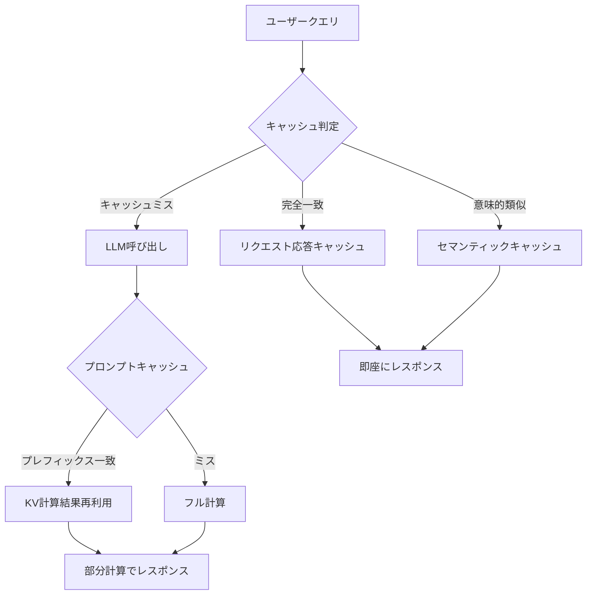
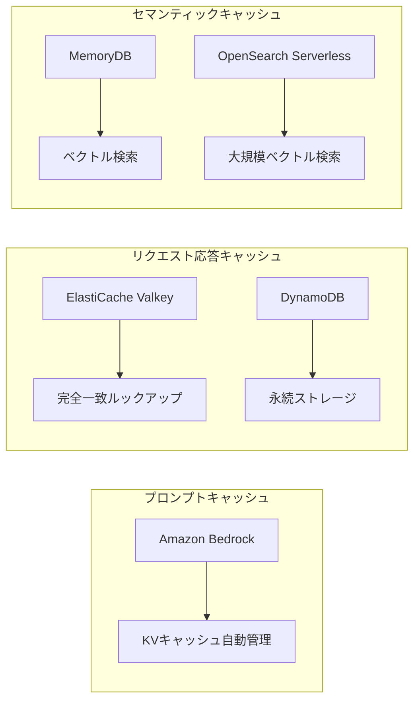

## ブログ概要

本記事はAWS公式ブログ「Optimize LLM response costs and latency with effective caching」の解説記事です。AWSはLLMアプリケーションのコスト・レイテンシ課題に対し、プロンプトキャッシュ、リクエスト応答キャッシュ、セマンティックキャッシュの3種を組み合わせた多層キャッシュ戦略を提唱しています。ブログでは、Amazon Bedrock・ElastiCache・MemoryDB等のマネージドサービスを活用し、キャッシュヒット率やセキュリティ要件に応じた実装パターンを体系的に整理しています。プロンプトキャッシュでは最大90%のコスト削減・85%のレイテンシ改善が見込まれると解説されており、リクエスト応答キャッシュではLLM呼び出しを完全にバイパスする構成が提案されています。

この記事は [Zenn記事: プロンプトキャッシュのROI最大化](https://zenn.dev/0h_n0/articles/9c9b01c307ad5e) の深掘りです。

## 情報源

- **種別**: 企業テックブログ（AWS Database Blog）
- **URL**: [Optimize LLM response costs and latency with effective caching](https://aws.amazon.com/blogs/database/optimize-llm-response-costs-and-latency-with-effective-caching/)
- **組織**: Amazon Web Services（AWS）
- **著者**: Hanish Garg, Mike Kuentz, Parnab Basak
- **発表日**: 2026年2月2日

## 技術的背景

LLMをプロダクション環境で運用する際、コストとレイテンシは避けて通れない課題です。Foundation Modelへのリクエストは入力・出力トークン数に応じた従量課金であり、同一・類似のクエリが繰り返される場面では、毎回LLMを呼び出すことがコスト非効率となります。

AWSブログでは、この課題を3つの観点から分析しています。第一に、system promptやfew-shot examplesなど静的プレフィックスの再計算コスト。第二に、FAQ・定型業務における同一クエリの重複呼び出し。第三に、表現は異なるが意味的に同等なクエリの重複処理です。それぞれに対応するキャッシュ戦略として、プロンプトキャッシュ・リクエスト応答キャッシュ・セマンティックキャッシュが整理されています。

Zenn記事ではプロバイダーレベルのプロンプトキャッシュ（Anthropic/OpenAI/Google）に焦点を当てていましたが、AWSブログはそれに加えてアプリケーション層のキャッシュ戦略を含む包括的な多層アプローチを提案しています。

## 実装アーキテクチャ

### 3種のキャッシュ戦略

AWSブログでは、LLMキャッシュを以下の3種類に分類し、それぞれの特性と適用場面を解説しています。



#### 1. プロンプトキャッシュ（Prompt Caching）

プロンプトキャッシュは、LLM呼び出し時の内部的な最適化です。Transformerモデルでは入力トークン列に対してKey-Value（KV）ペアを計算しますが、system promptやfew-shot examplesなど繰り返し使用されるプレフィックス部分のKV計算結果をキャッシュし、後続リクエストで再利用します。

ブログでは、以下の条件でプロンプトキャッシュが有効であると解説されています。

- **長い静的プレフィックス**: system prompt + RAGコンテキスト + few-shot examplesの合計が数百トークン以上
- **高頻度リクエスト**: キャッシュ有効期間（TTL）内に同一プレフィックスのリクエストが繰り返し発生
- **適用例**: ドキュメントQA、コードアシスタント、カスタマーサポートBot

ブログによれば、プロンプトキャッシュにより最大90%のコスト削減および最大85%のレイテンシ改善が見込まれるとのことです。Amazon Bedrockではこの機能がAPI設定で有効化可能です。

#### 2. リクエスト応答キャッシュ（Request-Response Caching）

リクエスト応答キャッシュは、完全なクエリと回答のペアをキャッシュ層に保存し、同一のリクエストが来た場合にLLMを一切呼び出さずにキャッシュから直接返却する方式です。

```python
import hashlib
import json
from typing import Optional

import boto3


class RequestResponseCache:
    """リクエスト応答キャッシュの実装例

    DynamoDBに完全一致のクエリ-回答ペアを保存し、
    同一リクエスト時にLLM呼び出しをバイパスする。
    """

    def __init__(self, table_name: str, ttl_seconds: int = 3600) -> None:
        self.dynamodb = boto3.resource("dynamodb")
        self.table = self.dynamodb.Table(table_name)
        self.ttl_seconds = ttl_seconds

    def _compute_key(self, prompt: str, model_id: str) -> str:
        """プロンプトとモデルIDからキャッシュキーを生成"""
        payload = json.dumps({"prompt": prompt, "model_id": model_id}, sort_keys=True)
        return hashlib.sha256(payload.encode()).hexdigest()

    def get(self, prompt: str, model_id: str) -> Optional[str]:
        """キャッシュルックアップ（完全一致）"""
        key = self._compute_key(prompt, model_id)
        response = self.table.get_item(Key={"cache_key": key})
        item = response.get("Item")
        if item:
            return item["response"]
        return None

    def put(self, prompt: str, model_id: str, response: str) -> None:
        """キャッシュに保存"""
        import time

        key = self._compute_key(prompt, model_id)
        self.table.put_item(
            Item={
                "cache_key": key,
                "prompt": prompt,
                "model_id": model_id,
                "response": response,
                "expires_at": int(time.time()) + self.ttl_seconds,
            }
        )
```

ブログでは、この方式はFAQ応答や定型レポート生成など、同一クエリが高頻度で発生するユースケースに適していると述べられています。レイテンシはDynamoDBの単一読み取り（数ミリ秒）まで短縮されます。

#### 3. セマンティックキャッシュ（Semantic Caching）

セマンティックキャッシュは、完全一致ではなく意味的な類似性に基づいてキャッシュをルックアップする方式です。ユーザークエリを埋め込みモデルでベクトル化し、ベクトルデータベース上で類似度検索を行います。

$$
\text{similarity}(\mathbf{q}, \mathbf{c}_i) = \frac{\mathbf{q} \cdot \mathbf{c}_i}{\|\mathbf{q}\| \|\mathbf{c}_i\|}
$$

ここで、
- $\mathbf{q}$: 入力クエリの埋め込みベクトル
- $\mathbf{c}_i$: キャッシュ内$i$番目のエントリの埋め込みベクトル

ブログでは、類似度が閾値$\tau$を超えた場合にキャッシュヒットとして扱うと解説されています。$\tau$の設定はドメインに依存し、低すぎると不正確な回答を返すリスクがあり、高すぎるとヒット率が低下します。

```python
import numpy as np
import redis


class SemanticCache:
    """セマンティックキャッシュの実装例

    Amazon MemoryDB（Valkey互換）のベクトル検索機能を使用し、
    意味的に類似したクエリのキャッシュルックアップを行う。
    """

    def __init__(
        self,
        host: str,
        port: int = 6379,
        similarity_threshold: float = 0.92,
        index_name: str = "cache_idx",
    ) -> None:
        self.client = redis.Redis(host=host, port=port, ssl=True)
        self.threshold = similarity_threshold
        self.index_name = index_name

    def lookup(self, query_embedding: np.ndarray, top_k: int = 1) -> list[dict]:
        """ベクトル類似度によるキャッシュルックアップ

        Args:
            query_embedding: クエリの埋め込みベクトル (dim=1536)
            top_k: 返却する上位件数

        Returns:
            類似度が閾値を超えたキャッシュエントリのリスト
        """
        query_blob = query_embedding.astype(np.float32).tobytes()
        results = self.client.execute_command(
            "FT.SEARCH",
            self.index_name,
            f"*=>[KNN {top_k} @embedding $vec AS score]",
            "PARAMS",
            "2",
            "vec",
            query_blob,
            "SORTBY",
            "score",
            "DIALECT",
            "2",
        )
        hits = []
        for i in range(1, len(results), 2):
            fields = dict(zip(results[i + 1][::2], results[i + 1][1::2]))
            score = float(fields.get(b"score", 0))
            similarity = 1.0 - score  # cosine distanceをsimilarityに変換
            if similarity >= self.threshold:
                hits.append(
                    {
                        "response": fields[b"response"].decode(),
                        "similarity": similarity,
                    }
                )
        return hits
```

ブログでは、Amazon MemoryDBがベクトル検索をネイティブサポートしており、セマンティックキャッシュの実装基盤として推奨されています。

### キャッシュ無効化戦略

ブログでは3つのキャッシュ無効化パターンが解説されています。

| 戦略 | 適用場面 | 実装複雑度 |
|------|---------|-----------|
| TTLベース | 定期更新で十分なデータ | 低 |
| プロアクティブ手動無効化 | コンテンツ更新が頻繁 | 中 |
| プリロード/バッチ更新 | 新データ統合時 | 高 |

**TTLベースの無効化**では、各キャッシュエントリに有効期限を設定します。ブログでは、TTL値にランダムなジッタ（jitter）を追加することで、多数のキャッシュが同時に失効する「thundering herd」問題を回避することが推奨されています。

$$
\text{TTL}_{\text{effective}} = \text{TTL}_{\text{base}} + \text{Uniform}(0, \text{jitter\_range})
$$

ここで、
- $\text{TTL}_{\text{base}}$: 基本有効期限（例: 3600秒）
- $\text{jitter\_range}$: ジッタの最大幅（例: 600秒）

### AWSサービスマッピング

ブログでは各キャッシュ戦略に対応するAWSサービスが以下のように整理されています。



**各サービスの役割**:
- **Amazon Bedrock**: プロンプトキャッシュ機能を内蔵。Guardrailsとの統合によりキャッシュ対象の入出力バリデーションも可能
- **Amazon ElastiCache（Redis OSS / Valkey）**: リクエスト応答キャッシュのインメモリストア。サブミリ秒のレイテンシ
- **Amazon MemoryDB**: ベクトル検索対応のインメモリデータベース。セマンティックキャッシュに適する
- **Amazon DynamoDB**: リクエスト応答ペアの永続ストレージ。TTLによる自動削除をサポート
- **Amazon OpenSearch Service/Serverless**: 大規模なベクトル検索。数百万件以上のキャッシュエントリに対応

### ベストプラクティス

ブログでは、キャッシュ導入に関する4つのベストプラクティスが提示されています。

1. **60%ルール**: キャッシュがシステム呼び出しの60%以上をカバーする場合にのみ導入を検討する。これ以下では、キャッシュ層の運用複雑性がコスト削減を上回る可能性がある
2. **PIIバリデーション**: 個人情報（PII）がキャッシュに保存されないよう、Bedrock Guardrailsなどで入出力のバリデーションを実施する
3. **ネームスペース分離**: ドメインごとにキャッシュのネームスペースを分離し、クロスコンタミネーション（異なるドメインのキャッシュが混在すること）を防止する
4. **TTLジッタ**: 前述の通り、キャッシュ失効の雪崩効果（thundering herd）を防止するためにTTL値にランダムジッタを付加する

## Production Deployment Guide

### AWS実装パターン（コスト最適化重視）

AWSブログで解説されている多層キャッシュ戦略をプロダクション環境に構築する際の推奨構成を、トラフィック量別に整理します。

**トラフィック量別の推奨構成**:

| 構成 | トラフィック | サービス構成 | 月額コスト |
|------|------------|------------|-----------|
| Small | ~100 req/日 | Lambda + Bedrock + DynamoDB + ElastiCache（cache.t4g.micro） | $80-200 |
| Medium | ~1,000 req/日 | ECS Fargate + Bedrock + ElastiCache（cache.r7g.large）+ DynamoDB | $400-1,000 |
| Large | 10,000+ req/日 | EKS + Bedrock + MemoryDB（db.r7g.xlarge）+ OpenSearch Serverless | $2,500-6,000 |

**Small構成（~100 req/日）**:
- Lambda（512MB, 60秒タイムアウト）でリクエスト受付。リクエスト応答キャッシュとしてDynamoDB（On-Demand）を使用
- ElastiCache（cache.t4g.micro, 1ノード）でセッション管理とリクエスト応答の高速ルックアップ
- Bedrock（Claude 3.5 Haiku）でLLM推論。プロンプトキャッシュを有効化
- **月額内訳**: Bedrock $30-100（トークン量依存）、Lambda $5、DynamoDB $5-15、ElastiCache $15-25、CloudWatch $5

**Medium構成（~1,000 req/日）**:
- ECS Fargate（0.5 vCPU, 1GB）でアプリケーションサーバーを常時起動
- ElastiCache（cache.r7g.large, 2ノード Multi-AZ）でリクエスト応答キャッシュ + セマンティックキャッシュの簡易版
- DynamoDBでキャッシュの永続化バックアップ
- Bedrock（Claude 3.5 Sonnet）のプロンプトキャッシュ有効化
- **月額内訳**: Bedrock $150-500、Fargate $50-100、ElastiCache $150-300、DynamoDB $10-30、ALB $20

**Large構成（10,000+ req/日）**:
- EKS上にキャッシュ管理サービスをデプロイ。Karpenter + Spot Instancesで自動スケーリング
- MemoryDB（db.r7g.xlarge, 2ノード）でベクトル検索対応のセマンティックキャッシュを本格運用
- OpenSearch Serverlessで数百万件規模のキャッシュインデックスを管理
- Bedrock（Claude 3.5 Sonnet / Opus）のプロンプトキャッシュ + Guardrails統合
- **月額内訳**: Bedrock $1,000-3,000、EKS $75、EC2 Spot $200-500、MemoryDB $500-1,000、OpenSearch $300-600、CloudWatch $50

**コスト削減テクニック**:
- Spot Instances: EKSワーカーノードで最大90%削減（キャッシュサービスはステートレスなため中断耐性あり）
- ElastiCache Reserved Nodes: 1年コミットで最大33%、3年で最大55%削減
- Bedrock Prompt Caching: 長いsystem promptの再計算を回避し30-90%のトークンコスト削減
- DynamoDB On-Demand: 低トラフィック時のプロビジョニング過剰を回避

**コスト試算の注意事項**: 上記は2026年6月時点のAWS ap-northeast-1（東京）リージョン概算値です。実際のコストはトラフィックパターン、キャッシュヒット率、レスポンスサイズにより変動します。Bedrockのトークン料金はモデル・リージョンにより異なるため、最新料金はAWS料金計算ツール（AWS Pricing Calculator）で確認してください。

### Terraformインフラコード

**Small構成（Serverless: Lambda + Bedrock + DynamoDB + ElastiCache）**:

```hcl
# --- IAM（最小権限） ---
resource "aws_iam_role" "cache_lambda" {
  name = "llm-cache-lambda-role"
  assume_role_policy = jsonencode({
    Version = "2012-10-17"
    Statement = [{
      Action    = "sts:AssumeRole"
      Effect    = "Allow"
      Principal = { Service = "lambda.amazonaws.com" }
    }]
  })
}

resource "aws_iam_role_policy" "cache_lambda_policy" {
  name = "llm-cache-lambda-policy"
  role = aws_iam_role.cache_lambda.id
  policy = jsonencode({
    Version = "2012-10-17"
    Statement = [
      {
        Effect   = "Allow"
        Action   = ["bedrock:InvokeModel"]
        Resource = "arn:aws:bedrock:ap-northeast-1::foundation-model/anthropic.*"
      },
      {
        Effect = "Allow"
        Action = [
          "dynamodb:GetItem",
          "dynamodb:PutItem",
          "dynamodb:Query"
        ]
        Resource = aws_dynamodb_table.llm_cache.arn
      },
      {
        Effect = "Allow"
        Action = [
          "logs:CreateLogGroup",
          "logs:CreateLogStream",
          "logs:PutLogEvents"
        ]
        Resource = "arn:aws:logs:*:*:*"
      }
    ]
  })
}

# --- DynamoDB（リクエスト応答キャッシュ、KMS暗号化） ---
resource "aws_dynamodb_table" "llm_cache" {
  name         = "llm-response-cache"
  billing_mode = "PAY_PER_REQUEST" # 低トラフィック時のコスト最適化
  hash_key     = "cache_key"

  attribute {
    name = "cache_key"
    type = "S"
  }

  server_side_encryption { enabled = true } # KMS暗号化
  ttl { attribute_name = "expires_at"; enabled = true }

  tags = { Project = "llm-cache", Environment = "production" }
}

# --- ElastiCache（高速キャッシュルックアップ） ---
resource "aws_elasticache_cluster" "llm_cache" {
  cluster_id           = "llm-cache"
  engine               = "valkey"
  node_type            = "cache.t4g.micro" # Small構成用
  num_cache_nodes      = 1
  parameter_group_name = "default.valkey8"
  port                 = 6379

  # セキュリティ: VPC内配置
  subnet_group_name  = aws_elasticache_subnet_group.private.name
  security_group_ids = [aws_security_group.cache_sg.id]

  tags = { Project = "llm-cache" }
}

# --- Lambda ---
resource "aws_lambda_function" "llm_cache_handler" {
  function_name = "llm-cache-handler"
  runtime       = "python3.12"
  handler       = "handler.lambda_handler"
  role          = aws_iam_role.cache_lambda.arn
  memory_size   = 512
  timeout       = 60
  filename      = "lambda.zip"

  environment {
    variables = {
      MODEL_ID          = "anthropic.claude-3-5-haiku-20241022-v1:0"
      CACHE_TABLE       = aws_dynamodb_table.llm_cache.name
      ELASTICACHE_HOST  = aws_elasticache_cluster.llm_cache.cache_nodes[0].address
      CACHE_TTL_SECONDS = "3600"
    }
  }

  vpc_config {
    subnet_ids         = var.private_subnet_ids
    security_group_ids = [aws_security_group.lambda_sg.id]
  }
}

# --- CloudWatch アラーム（コスト監視） ---
resource "aws_cloudwatch_metric_alarm" "lambda_errors" {
  alarm_name          = "llm-cache-lambda-errors"
  comparison_operator = "GreaterThanThreshold"
  evaluation_periods  = 2
  metric_name         = "Errors"
  namespace           = "AWS/Lambda"
  period              = 300
  statistic           = "Sum"
  threshold           = 5
  alarm_actions       = [var.sns_topic_arn]

  dimensions = {
    FunctionName = aws_lambda_function.llm_cache_handler.function_name
  }
}
```

**Large構成（Container: EKS + MemoryDB + Bedrock）**:

```hcl
# --- EKS クラスタ ---
module "eks" {
  source          = "terraform-aws-modules/eks/aws"
  version         = "~> 20.0"
  cluster_name    = "llm-cache-cluster"
  cluster_version = "1.31"

  vpc_id     = var.vpc_id
  subnet_ids = var.private_subnet_ids

  # パブリックアクセス制限（セキュリティ）
  cluster_endpoint_public_access = false

  eks_managed_node_groups = {
    cache_service = {
      instance_types = ["m7g.large"]
      capacity_type  = "SPOT" # コスト最適化: Spot優先
      min_size       = 2
      max_size       = 10
      desired_size   = 3
    }
  }
}

# --- Karpenter（Spot優先オートスケーリング） ---
resource "kubectl_manifest" "karpenter_nodepool" {
  yaml_body = yamlencode({
    apiVersion = "karpenter.sh/v1"
    kind       = "NodePool"
    metadata   = { name = "cache-workers" }
    spec = {
      template = {
        spec = {
          requirements = [
            { key = "karpenter.sh/capacity-type", operator = "In", values = ["spot", "on-demand"] },
            { key = "node.kubernetes.io/instance-type", operator = "In",
              values = ["m7g.large", "m7g.xlarge", "m6g.large", "m6g.xlarge"] }
          ]
        }
      }
      limits   = { cpu = "100", memory = "200Gi" }
      disruption = {
        consolidationPolicy = "WhenEmptyOrUnderutilized"
        consolidateAfter    = "30s"
      }
    }
  })
}

# --- Amazon MemoryDB（セマンティックキャッシュ用ベクトル検索） ---
resource "aws_memorydb_cluster" "semantic_cache" {
  cluster_name       = "llm-semantic-cache"
  node_type          = "db.r7g.xlarge"
  num_shards         = 1
  num_replicas_per_shard = 1 # Multi-AZ
  engine             = "valkey"
  acl_name           = aws_memorydb_acl.cache_acl.name
  subnet_group_name  = aws_memorydb_subnet_group.private.name
  security_group_ids = [aws_security_group.memorydb_sg.id]

  tls_enabled = true # 通信暗号化

  tags = { Project = "llm-cache", Environment = "production" }
}

# --- Secrets Manager（設定管理） ---
resource "aws_secretsmanager_secret" "cache_config" {
  name = "llm-cache/config"
}

resource "aws_secretsmanager_secret_version" "cache_config" {
  secret_id = aws_secretsmanager_secret.cache_config.id
  secret_string = jsonencode({
    memorydb_endpoint     = aws_memorydb_cluster.semantic_cache.cluster_endpoint[0].address
    similarity_threshold  = 0.92
    cache_ttl_seconds     = 7200
    bedrock_model_id      = "anthropic.claude-3-5-sonnet-20241022-v2:0"
  })
}

# --- AWS Budgets（予算アラート） ---
resource "aws_budgets_budget" "llm_cache_monthly" {
  name         = "llm-cache-monthly-budget"
  budget_type  = "COST"
  limit_amount = "6000"
  limit_unit   = "USD"
  time_unit    = "MONTHLY"

  notification {
    comparison_operator       = "GREATER_THAN"
    threshold                 = 80
    threshold_type            = "PERCENTAGE"
    notification_type         = "ACTUAL"
    subscriber_sns_topic_arns = [var.sns_topic_arn]
  }

  notification {
    comparison_operator       = "GREATER_THAN"
    threshold                 = 100
    threshold_type            = "PERCENTAGE"
    notification_type         = "FORECASTED"
    subscriber_sns_topic_arns = [var.sns_topic_arn]
  }
}
```

### 運用・監視設定

**CloudWatch Logs Insights クエリ**（キャッシュヒット率・コスト異常検知）:

```
# キャッシュヒット率の時系列分析
fields @timestamp, cache_type, cache_hit
| stats count(*) as total,
        sum(case when cache_hit = true then 1 else 0 end) as hits
  by bin(1h), cache_type
| sort @timestamp desc
```

```
# Bedrockトークン使用量の異常検知（1時間あたり）
fields @timestamp, bedrock_input_tokens, bedrock_output_tokens
| stats sum(bedrock_input_tokens) as total_input,
        sum(bedrock_output_tokens) as total_output
  by bin(1h)
| filter total_input > 500000 or total_output > 100000
```

**CloudWatch アラーム設定（Python）**:

```python
import boto3


def create_cache_alarms(function_name: str, sns_topic_arn: str) -> None:
    """キャッシュ関連のCloudWatchアラームを設定

    Args:
        function_name: Lambda関数名
        sns_topic_arn: 通知先SNSトピックARN
    """
    cloudwatch = boto3.client("cloudwatch")

    # キャッシュミス率が40%を超えた場合（60%ルール違反）
    cloudwatch.put_metric_alarm(
        AlarmName=f"{function_name}-cache-miss-rate-high",
        MetricName="CacheMissRate",
        Namespace="LLMCache/Custom",
        Statistic="Average",
        Period=3600,
        EvaluationPeriods=3,
        Threshold=40.0,
        ComparisonOperator="GreaterThanThreshold",
        AlarmActions=[sns_topic_arn],
        AlarmDescription="キャッシュミス率が40%超過。キャッシュ戦略の見直しを検討",
    )

    # Bedrock呼び出しのレイテンシP95
    cloudwatch.put_metric_alarm(
        AlarmName=f"{function_name}-bedrock-latency-p95",
        MetricName="Duration",
        Namespace="AWS/Lambda",
        ExtendedStatistic="p95",
        Period=300,
        EvaluationPeriods=2,
        Threshold=30000,  # 30秒
        ComparisonOperator="GreaterThanThreshold",
        AlarmActions=[sns_topic_arn],
        Dimensions=[{"Name": "FunctionName", "Value": function_name}],
    )
```

**X-Ray トレーシング設定（Python）**:

```python
from aws_xray_sdk.core import xray_recorder, patch_all

# boto3の自動計装
patch_all()


@xray_recorder.capture("cache_lookup")
def cache_lookup(query: str, cache_type: str) -> dict:
    """キャッシュルックアップにX-Rayトレースを付加

    Args:
        query: ユーザークエリ
        cache_type: キャッシュ種別（exact / semantic）

    Returns:
        キャッシュ結果とメタデータ
    """
    subsegment = xray_recorder.current_subsegment()
    subsegment.put_annotation("cache_type", cache_type)
    subsegment.put_metadata("query_length", len(query))

    # キャッシュルックアップ実行
    result = _perform_lookup(query, cache_type)

    subsegment.put_annotation("cache_hit", result.get("hit", False))
    return result
```

**Cost Explorer自動レポート（Python）**:

```python
from datetime import datetime, timedelta

import boto3


def generate_daily_cost_report(sns_topic_arn: str) -> dict:
    """日次コストレポートを生成しSNS通知

    Args:
        sns_topic_arn: 通知先SNSトピックARN

    Returns:
        コストレポートの辞書
    """
    ce = boto3.client("ce")
    sns = boto3.client("sns")

    end = datetime.utcnow().strftime("%Y-%m-%d")
    start = (datetime.utcnow() - timedelta(days=1)).strftime("%Y-%m-%d")

    response = ce.get_cost_and_usage(
        TimePeriod={"Start": start, "End": end},
        Granularity="DAILY",
        Metrics=["UnblendedCost"],
        Filter={
            "Tags": {
                "Key": "Project",
                "Values": ["llm-cache"],
            }
        },
        GroupBy=[{"Type": "DIMENSION", "Key": "SERVICE"}],
    )

    total = 0.0
    breakdown = {}
    for group in response["ResultsByTime"][0]["Groups"]:
        service = group["Keys"][0]
        cost = float(group["Metrics"]["UnblendedCost"]["Amount"])
        breakdown[service] = cost
        total += cost

    # $100/日超過でアラート
    if total > 100:
        sns.publish(
            TopicArn=sns_topic_arn,
            Subject="LLM Cache Daily Cost Alert",
            Message=f"日次コスト ${total:.2f} が閾値 $100 を超過\n内訳: {breakdown}",
        )

    return {"total": total, "breakdown": breakdown}
```

### コスト最適化チェックリスト

**アーキテクチャ選択**:
- [ ] トラフィック ~100 req/日 → Small（Serverless: Lambda + DynamoDB + ElastiCache）
- [ ] トラフィック ~1,000 req/日 → Medium（Hybrid: ECS + ElastiCache + DynamoDB）
- [ ] トラフィック 10,000+ req/日 → Large（Container: EKS + MemoryDB + OpenSearch）

**リソース最適化**:
- [ ] EKSワーカーノード: Spot Instances優先（ステートレスサービスのため中断耐性あり）
- [ ] ElastiCache Reserved Nodes: 1年コミットで33%削減
- [ ] Lambda: メモリサイズ512MBから開始し、Power Tuningで最適化
- [ ] DynamoDB: On-Demandモードで低トラフィック時の過剰プロビジョニング回避
- [ ] ECS/EKS: アイドル時のmin_instances設定によるスケールダウン

**LLMコスト削減**:
- [ ] Bedrock Prompt Caching有効化（長いsystem promptで30-90%削減）
- [ ] リクエスト応答キャッシュでFAQ・定型クエリのLLM呼び出し完全回避
- [ ] セマンティックキャッシュで類似クエリのLLM呼び出し削減
- [ ] モデル選択ロジック: 単純なクエリにはHaiku、複雑なクエリにはSonnetを自動振り分け
- [ ] max_tokens制限: 応答長の上限設定でトークン消費を制御

**監視・アラート**:
- [ ] AWS Budgets: 月次予算アラート（80%/100%で通知）
- [ ] CloudWatch: キャッシュヒット率・ミス率の継続監視（60%ルール）
- [ ] Cost Anomaly Detection: Bedrockコストの異常スパイク検知
- [ ] 日次コストレポート: Cost Explorer APIで自動生成・SNS通知

**リソース管理**:
- [ ] 未使用ElastiCacheノードの削除
- [ ] リソースタグ戦略: `Project=llm-cache` タグの一貫適用
- [ ] DynamoDB TTL: キャッシュエントリの自動削除で不要データ蓄積を防止
- [ ] 開発環境の夜間停止: ECS/EKSの開発クラスタを業務時間外にスケールダウン
- [ ] CloudWatch Logsの保持期間設定: 90日で自動削除

**セキュリティ**:
- [ ] Bedrock Guardrails: PII（個人情報）がキャッシュに混入しないよう入出力フィルタリング
- [ ] MemoryDB/ElastiCache: TLS有効化 + VPC内配置
- [ ] IAM最小権限: Lambda/ECSにBedrock InvokeModelとDynamoDB CRUDのみ許可
- [ ] KMS暗号化: DynamoDB・S3・EBSのサーバーサイド暗号化

## パフォーマンス最適化

### キャッシュ戦略別の効果

AWSブログでは定量的なベンチマーク結果は掲載されていませんが、各キャッシュ戦略の効果を以下のように整理しています。

| キャッシュ戦略 | レイテンシ改善 | コスト削減 | 適用条件 |
|--------------|-------------|-----------|---------|
| プロンプトキャッシュ | 最大85% | 最大90% | 長い静的プレフィックス |
| リクエスト応答キャッシュ | ~99%（LLMバイパス） | ~100%（LLMコストゼロ） | 同一クエリの高頻度発生 |
| セマンティックキャッシュ | ~95%（LLMバイパス） | ~95% | 類似クエリの高頻度発生 |

**チューニングポイント**:

セマンティックキャッシュの閾値$\tau$は、ドメインとユースケースにより最適値が異なります。ブログでは具体的な推奨値は明示されていませんが、一般的には以下のトレードオフがあります。

- $\tau = 0.95$以上: 高精度だがヒット率が低い（保守的）
- $\tau = 0.85$-$0.90$: ヒット率と精度のバランス
- $\tau = 0.80$以下: ヒット率は高いが誤った回答を返すリスク

実運用では、A/Bテストにより閾値を段階的に調整し、キャッシュヒット率と回答品質のバランスを評価することが推奨されます。

## 運用での学び

### 学び1: キャッシュ層の複雑性管理

ブログでは、多層キャッシュを導入する際の運用複雑性について「キャッシュがシステム呼び出しの60%以上をカバーする場合にのみ導入を検討する」という明確な基準を示しています。この基準は、キャッシュ層の運用コスト（監視、無効化、デバッグ）がキャッシュによるコスト削減を上回らないようにするためのものです。

導入前には、プロダクション環境のクエリログを分析し、クエリの重複率・類似率を定量的に評価することが重要です。

### 学び2: セマンティックキャッシュの品質リスク

セマンティックキャッシュでは、類似度閾値の設定によってはユーザーの意図と異なる回答がキャッシュから返却されるリスクがあります。ブログでは明示的に言及されていませんが、この問題に対する実用的な対策として以下が考えられます。

- **フォールバック機構**: キャッシュヒット時にも、ユーザーが「再生成」を要求できるUIを提供する
- **ドメイン別閾値**: 医療・法律など正確性が求められるドメインでは閾値を高く設定する
- **A/Bテスト**: キャッシュ有無での回答品質をユーザー満足度で比較する

### 学び3: キャッシュ無効化の運用負荷

TTLベースの無効化は実装が容易ですが、LLMのモデル更新やRAGデータの更新タイミングとキャッシュの整合性を取る必要があります。ブログが推奨するプロアクティブ手動無効化では、コンテンツ更新パイプラインとキャッシュフラッシュを連動させることで、古い回答がキャッシュから返却される問題を回避できます。

## 学術研究との関連

セマンティックキャッシュの基盤技術であるベクトル類似度検索は、最近傍探索（Approximate Nearest Neighbor: ANN）の分野で活発に研究されています。HNSW（Hierarchical Navigable Small World）アルゴリズムがAmazon MemoryDBのベクトル検索に採用されており、Malkov & Yashunin (2020) の研究に基づいています。

また、LLMのKVキャッシュ最適化については、Kwon et al. (2023) の「Efficient Memory Management for Large Language Model Serving with PagedAttention」がvLLMとして実装され、プロンプトキャッシュの内部機構に影響を与えています。AWSブログが解説するプロンプトキャッシュは、これらの学術的知見をマネージドサービスとして実用化したものと位置付けられます。

## まとめと実践への示唆

### まとめ

AWSブログでは、LLMアプリケーションのコスト・レイテンシ最適化のために、3種のキャッシュ戦略を多層的に組み合わせるアプローチが提案されています。プロンプトキャッシュはLLM内部の計算効率化、リクエスト応答キャッシュは完全一致クエリのLLMバイパス、セマンティックキャッシュは意味的類似クエリの再利用を担い、それぞれが補完関係にあります。

### Zenn記事との統合的な実践

Zenn記事「プロンプトキャッシュのROI最大化」ではプロバイダーレベルのプロンプトキャッシュ（Anthropic/OpenAI/Google）を詳細に解説していますが、AWSブログはそれをアプリケーション層まで拡張しています。

| レイヤー | Zenn記事の内容 | AWSブログの追加要素 |
|---------|-------------|------------------|
| プロバイダー層 | Anthropic/OpenAI/Googleのプロンプトキャッシュ | Amazon Bedrockのプロンプトキャッシュ |
| アプリケーション層 | ヒット率診断 | リクエスト応答キャッシュ + セマンティックキャッシュ |
| インフラ層 | - | ElastiCache / MemoryDB / DynamoDB |

実践的には、まずZenn記事のヒット率診断でプロンプトキャッシュの効果を定量評価し、ヒット率が60%を超えるユースケースではAWSブログのアプリケーション層キャッシュ（リクエスト応答 + セマンティック）の導入を検討する、という段階的アプローチが有効です。

## 参考文献

- **Blog URL**: [Optimize LLM response costs and latency with effective caching - AWS Database Blog](https://aws.amazon.com/blogs/database/optimize-llm-response-costs-and-latency-with-effective-caching/)
- **Amazon Bedrock**: [Amazon Bedrock - AWS](https://aws.amazon.com/bedrock/)
- **Amazon ElastiCache**: [Amazon ElastiCache - AWS](https://aws.amazon.com/elasticache/)
- **Amazon MemoryDB**: [Amazon MemoryDB - AWS](https://aws.amazon.com/memorydb/)
- **Related Zenn article**: [プロンプトキャッシュのROI最大化](https://zenn.dev/0h_n0/articles/9c9b01c307ad5e)
- **HNSW Algorithm**: Malkov, Y. A., & Yashunin, D. A. (2020). Efficient and Robust Approximate Nearest Neighbor Using Hierarchical Navigable Small World Graphs. IEEE TPAMI.
- **PagedAttention**: Kwon, W., et al. (2023). Efficient Memory Management for Large Language Model Serving with PagedAttention. SOSP 2023.
