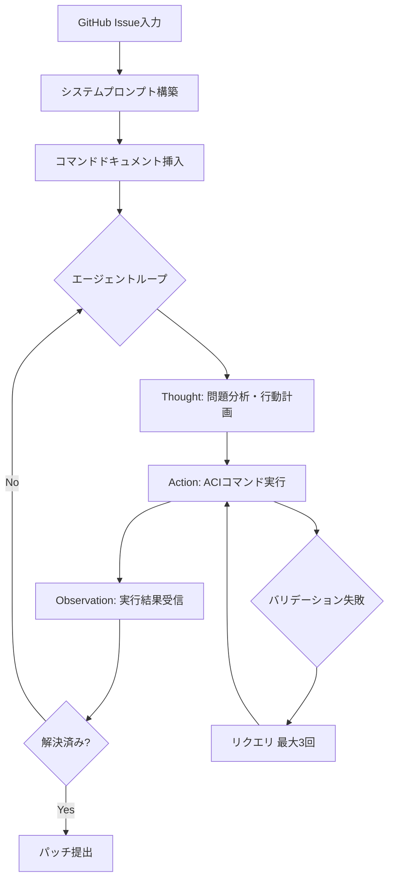

本記事は [SWE-agent: Agent-Computer Interfaces Enable Automated Software Engineering](https://arxiv.org/abs/2405.15793) の解説記事です。

## 論文概要（Abstract）

言語モデル（LM）エージェントによるソフトウェアエンジニアリングタスクの自動化において、エージェントがコンピュータ環境と対話するインタフェースの設計が性能に大きな影響を与えることを示した研究である。著者らは Agent-Computer Interface（ACI）という概念を提唱し、ファイルの閲覧・編集・検索・テスト実行のためのカスタムコマンド群を設計した。SWE-benchにおいてGPT-4 Turboで12.47% pass@1（先行最良値3.8%の約3倍）、HumanEvalFixで87.7% pass@1を達成し、ACIの設計がエージェント性能の鍵であることを実験的に示した。

この記事は [Zenn記事: Codex×AGENTS.md×MCPで大規模リポジトリのバグ修正精度を高める実装ガイド](https://zenn.dev/0h_n0/articles/ff39679e7b4b27) の深掘りです。

## 情報源

- **会議名**: NeurIPS 2024（The 38th Annual Conference on Neural Information Processing Systems）
- **年**: 2024
- **URL**: [https://arxiv.org/abs/2405.15793](https://arxiv.org/abs/2405.15793)
- **著者**: John Yang, Carlos E. Jimenez, Alexander Wettig, Kilian Lieret, Shunyu Yao, Ofir Press, Karthik Narasimhan（Princeton University）
- **採択率**: 25.8%（15,671件中4,044件採択）
- **GitHub**: [https://github.com/SWE-agent/SWE-agent](https://github.com/SWE-agent/SWE-agent)（MIT License）

## カンファレンス情報

NeurIPSは機械学習・人工知能分野における最高峰の国際会議の1つであり、2024年は12月10日から15日にカナダ・バンクーバーで開催された。採択率は25.8%であり、本論文はソフトウェアエンジニアリング（cs.SE）と人工知能（cs.AI）の交差領域に位置する研究として採択された。

## 技術的詳細（Technical Details）

### Agent-Computer Interface（ACI）の設計

SWE-agentの核心的な貢献は、LMエージェント専用のインタフェース「ACI」の設計である。著者らは、人間向けのIDE（色やマウス操作を前提）やbashシェル（膨大な出力でコンテキストウィンドウを汚染）はLMに不適であると指摘し、テキストベースかつ出力整形済みのインタフェースを提案した。ACIは以下の4つのコマンドグループで構成される。

**(A) ファイル閲覧・ナビゲーション**: `open`、`scroll_up`/`scroll_down`、`goto`の4コマンドで構成される。ファイルビューワーは100行のウィンドウサイズで表示し、`cat`による全文表示を避けてコンテキスト消費を抑制する。スクロール時には2行のオーバーラップ（98行移動）を設け、ウィンドウ間の連続性を保つ。`goto`は指定行をウィンドウの約1/6の位置に配置する。

**(B) ファイル編集**: `edit`コマンドは行範囲指定のブロック編集方式を採用している。編集後にflake8リンターが自動実行され、ルールセット（`--select=F821,F822,F831,E111,E112,E113,E999,E902`）でチェックが行われる。構文エラーが検出された場合は編集がロールバックされ、修正前後のコードが行番号付きで並べて表示される。スタイル警告は意図的に除外されている。

**(C) リポジトリ検索**: `find_file`、`search_file`、`search_dir`の3コマンドで構成される。`grep`/`find`のラッパーであるが、出力が整形されている点が重要である。特に`search_dir`はマッチしたファイル名のみを返し、周辺コンテキストを表示しない。著者らは周辺コンテキストの表示がモデルを混乱させたと報告している。検索結果は100件を上限とする。

**(D) テスト実行・bash実行**: bashコマンドの直接実行を用いる。エラー出力が長い場合は切り詰め処理が行われる。コマンドが出力を生成しなかった場合は「Your command ran successfully and did not produce any output.」というメッセージが返され、空出力による混乱を防止する。

### ReActスタイルのエージェントループ

SWE-agentはReActスタイルのエージェントループで動作する。各ステップでThought（思考）、Action（行動）、Observation（観測）の3フェーズを繰り返す。



### アルゴリズム

```python
from dataclasses import dataclass


@dataclass
class AgentState:
    """エージェントの内部状態。

    Attributes:
        history: (thought, action, observation)のタプルリスト
        cost_total: 累計API呼び出しコスト（USD）
    """
    history: list[tuple[str, str, str]]
    cost_total: float = 0.0


def swe_agent_loop(
    issue: str,
    model: str = "gpt-4-turbo",
    max_cost: float = 3.0,
    max_retries: int = 3,
) -> str:
    """SWE-agentのメインエージェントループ。

    Args:
        issue: GitHub Issueのテキスト
        model: 使用するLMモデル名
        max_cost: 1インスタンスあたりの最大コスト（USD）
        max_retries: アクション失敗時の最大リトライ回数

    Returns:
        生成されたパッチ（unified diff形式）
    """
    state = AgentState(history=[])
    system_prompt = build_system_prompt(
        command_docs=render_command_docs(),  # YAML定義から自動生成
        issue=issue,
    )

    while state.cost_total < max_cost:
        # 履歴をレンダリング（直近5観測のみ保持でコンテキスト圧縮）
        prompt = render_history(state.history, last_n_observations=5)
        response, cost = call_model(model, system_prompt, prompt)
        state.cost_total += cost
        thought, action = parse_response(response)

        # バリデーション（ブロックリスト + bash -n 構文チェック）
        for _ in range(max_retries):
            if validate_action(action):
                break
            response, cost = call_model(model, system_prompt, prompt)
            state.cost_total += cost
            thought, action = parse_response(response)

        observation = execute_in_sandbox(action)
        state.history.append((thought, action, observation))

        if "<<SWE_AGENT_SUBMISSION>>" in observation:
            return extract_patch(state)

    return ""  # コスト上限到達
```

ここで、`last_n_observations=5`は直近5回の観測のみを保持するコンテキスト圧縮戦略であり、長いタスクにおけるスケーラビリティを確保する。`validate_action`はブロックリストチェックと`bash -n`による構文検証を組み合わせている。

## 実験結果（Results）

### SWE-benchにおける主要結果

著者らはSWE-benchとHumanEvalFixの2つのベンチマークで評価を行い、以下の結果を報告している（論文Table 1より）。

| ベンチマーク | モデル | SWE-agent | 先行最良値 (RAG) | 改善倍率 |
|---|---|---|---|---|
| SWE-bench (Full) | GPT-4 Turbo | 12.47% | 3.8% | 約3.3倍 |
| SWE-bench Lite | GPT-4 Turbo | 18.00% | - | - |
| SWE-bench (Full) | Claude 3 Opus | 3.79% | - | - |
| HumanEvalFix | GPT-4 Turbo | 87.7% | - | - |

SWE-bench VerifiedではClaude 3.5 Sonnetとリトライ機構の併用により53.8%に到達したと報告されている。コストは1インスタンスあたり平均約2ドル（上限4ドル）で、デフォルトのコスト上限は3.00ドルに設定されている。

### アブレーション実験

著者らはSWE-bench Liteの300インスタンスのサブセットを用いてアブレーション実験を実施した。bashシェルのみのベースラインと比較して、SWE-agentは10.7ポイント高い解決率を示した。

| 設計決定 | 内容 | 効果 |
|---|---|---|
| ファイルビューワー | ウィンドウ型（100行） vs `cat`全文表示 | ウィンドウ型が有意に優位 |
| 編集コマンド | ブロック編集 vs 行単位の挿入/削除 | ブロック編集が安定 |
| リンター統合 | 編集後にflake8で構文チェック | 構文エラーの即時ロールバックが有効 |
| コマンドドキュメント | 詳細docstringをシステムプロンプトに含む | ツール使用精度が向上 |
| エラーメッセージ設計 | 構造化された分かりやすいエラー文 | 再試行ループの回避に有効 |

同じGPT-4モデルでもACIツールの有無でスコアが約12%から約3%へと変動し、インタフェース設計だけで約4倍の性能差が生じることが示されている。

## 実装のポイント

SWE-agentはOSSとして公開されており、ACIコマンドはYAML形式の設定ファイルで管理されている。実装時の要点を以下に示す。

**ウィンドウサイズの調整**: デフォルトの100行は多くのケースで適切であるが、ウィンドウサイズの増加はコンテキスト消費増加とのトレードオフがある。

**リンタールールの選択**: flake8のルールセットは構文エラーと未定義変数のみに絞られている。スタイル警告を含めるとエージェントの行動が過度に制約される可能性がある。

**エラーメッセージの設計**: 編集失敗時に「DO NOT re-run the same failed edit command.」というメッセージを含めることで、同一編集の無限ループを防止する。このメッセージがないとエージェントが同じ失敗コマンドを繰り返す傾向が確認されたと報告されている。

**履歴のコンテキスト圧縮**: `last_n_observations=5`により直近5回の観測のみを保持し、ステップ数増加に対するスケーラビリティを確保する。

## Production Deployment Guide

SWE-agentはMITライセンスのOSSであり、CI/CDパイプラインへの統合が可能である。

### AWS実装パターン（コスト最適化重視）

SWE-agentの1インスタンスあたり平均コストは約2ドル（LM API費用）であり、インフラコストよりもLM API呼び出しが支配的なコスト要因となる。

| 構成 | 想定規模 | AWSサービス | 月額概算 |
|---|---|---|---|
| Small | ~10件/日 | Lambda + SQS + DynamoDB | $50-150 + LM API費用 |
| Medium | ~50件/日 | ECS Fargate + SQS + RDS | $300-800 + LM API費用 |
| Large | 100件+/日 | EKS + Karpenter + Spot | $2,000-5,000 + LM API費用 |

Small構成の内訳: Lambda（15分実行、1024MB）~$5/月、SQS ~$1/月、DynamoDB（On-Demand）~$3/月、CloudWatch Logs ~$5/月、LM API費用 ~$600/月（10件/日 x $2/件 x 30日）。

注意事項: 上記は2026年6月時点のAWS ap-northeast-1リージョン料金に基づく概算値である。最新料金は [AWS料金計算ツール](https://calculator.aws/) で確認を推奨する。

コスト削減テクニック: Bedrock Batch APIで50%削減、Prompt Caching（Claude使用時）で30-90%削減、Spot Instancesで最大90%のインフラコスト削減、Reserved Instances（1年コミット）で最大72%削減。

### Terraformインフラコード

#### Small構成（Serverless）

```hcl
# SWE-agent Serverless構成 - Lambda + SQS + DynamoDB
# 2026年6月時点 Terraform AWS Provider v5.x対応
terraform {
  required_version = ">= 1.9.0"
  required_providers {
    aws = { source = "hashicorp/aws", version = "~> 5.80" }
  }
}

provider "aws" { region = "ap-northeast-1" }

# IAMロール（最小権限）
resource "aws_iam_role" "swe_agent" {
  name = "swe-agent-lambda-role"
  assume_role_policy = jsonencode({
    Version = "2012-10-17"
    Statement = [{ Action = "sts:AssumeRole", Effect = "Allow",
      Principal = { Service = "lambda.amazonaws.com" } }]
  })
}

resource "aws_iam_role_policy" "swe_agent" {
  name = "swe-agent-policy"
  role = aws_iam_role.swe_agent.id
  policy = jsonencode({
    Version = "2012-10-17"
    Statement = [
      { Effect = "Allow", Action = ["logs:CreateLogGroup","logs:CreateLogStream","logs:PutLogEvents"], Resource = "arn:aws:logs:*:*:*" },
      { Effect = "Allow", Action = ["sqs:ReceiveMessage","sqs:DeleteMessage","sqs:GetQueueAttributes"], Resource = aws_sqs_queue.issues.arn },
      { Effect = "Allow", Action = ["dynamodb:PutItem","dynamodb:GetItem","dynamodb:UpdateItem","dynamodb:Query"], Resource = aws_dynamodb_table.results.arn },
      { Effect = "Allow", Action = ["secretsmanager:GetSecretValue"], Resource = aws_secretsmanager_secret.api_keys.arn }
    ]
  })
}

# SQSキュー + DLQ
resource "aws_sqs_queue" "issues" {
  name = "swe-agent-issues"
  visibility_timeout_seconds = 900  # Lambda最大実行時間
  redrive_policy = jsonencode({ deadLetterTargetArn = aws_sqs_queue.dlq.arn, maxReceiveCount = 3 })
}
resource "aws_sqs_queue" "dlq" { name = "swe-agent-issues-dlq" }

# DynamoDB（On-Demand + KMS暗号化）
resource "aws_dynamodb_table" "results" {
  name = "swe-agent-results"; billing_mode = "PAY_PER_REQUEST"
  hash_key = "issue_id"; range_key = "timestamp"
  attribute { name = "issue_id"; type = "S" }
  attribute { name = "timestamp"; type = "S" }
  server_side_encryption { enabled = true }
  point_in_time_recovery { enabled = true }
}

resource "aws_secretsmanager_secret" "api_keys" { name = "swe-agent/api-keys" }

# Lambda関数
resource "aws_lambda_function" "swe_agent" {
  function_name = "swe-agent-runner"; runtime = "python3.12"
  handler = "handler.lambda_handler"; role = aws_iam_role.swe_agent.arn
  timeout = 900; memory_size = 1024
  filename = "lambda_package.zip"
  source_code_hash = filebase64sha256("lambda_package.zip")
  environment { variables = { RESULTS_TABLE = aws_dynamodb_table.results.name, SECRET_ARN = aws_secretsmanager_secret.api_keys.arn, MAX_COST = "3.0" } }
}

resource "aws_lambda_event_source_mapping" "trigger" {
  event_source_arn = aws_sqs_queue.issues.arn
  function_name = aws_lambda_function.swe_agent.arn; batch_size = 1
}
```

#### Large構成（Container）

```hcl
# SWE-agent Container構成 - EKS + Karpenter + Spot
# 2026年6月時点 EKS v1.31対応
module "eks" {
  source = "terraform-aws-modules/eks/aws"; version = "~> 20.31"
  cluster_name = "swe-agent"; cluster_version = "1.31"
  vpc_id = module.vpc.vpc_id; subnet_ids = module.vpc.private_subnets
  cluster_endpoint_public_access = false  # プライベートのみ
}

# Karpenter NodePool（Spot優先でコスト90%削減）
resource "kubectl_manifest" "nodepool" {
  yaml_body = yamlencode({
    apiVersion = "karpenter.sh/v1"; kind = "NodePool"
    metadata = { name = "swe-agent-workers" }
    spec = {
      template = { spec = { requirements = [
        { key = "karpenter.sh/capacity-type", operator = "In", values = ["spot", "on-demand"] },
        { key = "node.kubernetes.io/instance-type", operator = "In", values = ["m5.large","m6i.large"] }
      ] } }
      limits = { cpu = "100", memory = "400Gi" }
      disruption = { consolidationPolicy = "WhenEmptyOrUnderutilized", consolidateAfter = "30s" }
    }
  })
}

resource "aws_budgets_budget" "monthly" {
  name = "swe-agent-monthly"; budget_type = "COST"
  limit_amount = "5000"; limit_unit = "USD"; time_unit = "MONTHLY"
  notification { comparison_operator = "GREATER_THAN", threshold = 80, threshold_type = "PERCENTAGE", notification_type = "ACTUAL", subscriber_email_addresses = ["ops@example.com"] }
}
```

### 運用・監視設定

```python
import boto3


def create_monitoring(function_name: str, sns_arn: str) -> None:
    """SWE-agent向けCloudWatchアラームを作成する。

    Args:
        function_name: Lambda関数名
        sns_arn: 通知先SNSトピックARN
    """
    cw = boto3.client("cloudwatch", region_name="ap-northeast-1")
    # LM APIコスト異常検知（1時間あたり$100超過）
    cw.put_metric_alarm(
        AlarmName=f"{function_name}-high-cost", MetricName="LMAPICost",
        Namespace="SWEAgent", Statistic="Sum", Period=3600,
        EvaluationPeriods=1, Threshold=100.0,
        ComparisonOperator="GreaterThanThreshold", AlarmActions=[sns_arn],
        Dimensions=[{"Name": "FunctionName", "Value": function_name}],
    )
    # Lambda実行時間P99監視（14分 = 15分上限の93%）
    cw.put_metric_alarm(
        AlarmName=f"{function_name}-duration", MetricName="Duration",
        Namespace="AWS/Lambda", Statistic="p99", Period=3600,
        EvaluationPeriods=2, Threshold=840000,
        ComparisonOperator="GreaterThanThreshold", AlarmActions=[sns_arn],
        Dimensions=[{"Name": "FunctionName", "Value": function_name}],
    )
```

CloudWatch Logs Insightsクエリ例: コスト異常検知には`filter @message like /cost_total/ | stats avg(cost_total) by bin(1h) | filter avg_cost > 3.0`、レイテンシ分析には`stats percentile(duration_ms, 95) as p95, percentile(duration_ms, 99) as p99 by bin(1h)`を使用する。X-Rayトレーシングは`aws_xray_sdk.core`の`patch_all()`でboto3を自動計装し、モデル名やコスト上限をアノテーションとして記録する。日次コストレポートはCost Explorer APIで`BlendedCost`をサービス別に取得し、$100/日超過時にSNS通知を発行する構成が推奨される。

### コスト最適化チェックリスト

**アーキテクチャ選択**: トラフィック量で判断（~10件/日: Serverless、~50件/日: Hybrid、100件+/日: Container）。LM APIコストがインフラコストを上回ることを考慮。

**リソース最適化**: Spot Instances優先（Karpenter設定）、Reserved Instances 1年コミット（最大72%削減）、Savings Plans検討、Lambda メモリサイズ最適化（Power Tuning推奨）、EKS アイドル時スケールダウン（Karpenter consolidation）。

**LLMコスト削減**: Bedrock Batch API（50%削減）、Prompt Caching（Claude使用時30-90%削減）、モデル選択ロジック（難易度別使い分け）、トークン数制限（max_cost上限）、履歴圧縮（last_n_observations=5）。

**監視・アラート**: AWS Budgets設定（月額80%で通知）、CloudWatch アラーム（Lambda エラー率・実行時間）、Cost Anomaly Detection有効化、日次コストレポート（Cost Explorer + SNS）。

**リソース管理**: 未使用リソース定期削除、タグ戦略（Project: swe-agent）、DLQ 14日保持、開発環境夜間停止、DynamoDB TTL設定。

## 実運用への応用（Practical Applications）

SWE-agentのACI設計思想は、Zenn記事で紹介されているExplorer→Workerパターンと直接的に関連する。AGENTS.mdによるリポジトリ構造情報の提供はACIのコマンドドキュメントに相当し、MCPサーバーがACIのカスタムコマンド群に相当する。適切なインタフェース設計はモデル自体の性能向上と同等以上のインパクトをもたらす可能性がある。

CI/CDパイプラインへの統合では、GitHub WebhookからSQSにIssueイベントを送信し、SWE-agentがバックグラウンドで修正パッチを生成しPull Requestを作成するワークフローが実現可能である。1インスタンスあたり約2ドル・15分未満の実行時間は実用的な要件を満たす。

## 関連研究（Related Work）

- **SWE-bench** (Jimenez et al., 2024): 実際のGitHubリポジトリの2,294件のIssueとPull Requestから構成されたベンチマーク。SWE-agentの性能評価の基盤データセットである。

- **Agentless** (Xia et al., 2024): エージェントループを用いずLMに直接バグ特定とパッチ生成を行うアプローチ。SWE-agentとは対照的にシンプルさを追求する設計哲学を持つ。

- **ReAct** (Yao et al., 2023): SWE-agentが採用するThought→Action→Observationループの基盤フレームワーク。共著者Shunyu YaoはReActの提唱者でもある。

## まとめと今後の展望

SWE-agentは、LMエージェントのソフトウェアエンジニアリング能力がインタフェース設計に大きく依存することを実験的に示した。5つのACI設計要素（ウィンドウ型ファイルビューワー、ブロック編集、リンター統合、コマンドドキュメント、エラーメッセージ設計）の組み合わせにより、bashシェルのみのベースラインに対して約4倍の改善を達成した。今後は言語固有のACI拡張（型チェッカー統合等）やマルチエージェント構成でのACI分担が研究課題である。

## 参考文献

- **Conference URL**: [https://arxiv.org/abs/2405.15793](https://arxiv.org/abs/2405.15793)
- **Code**: [https://github.com/SWE-agent/SWE-agent](https://github.com/SWE-agent/SWE-agent)（MIT License）
- **SWE-agent公式サイト**: [https://swe-agent.com/](https://swe-agent.com/)
- **Related Zenn article**: [https://zenn.dev/0h_n0/articles/ff39679e7b4b27](https://zenn.dev/0h_n0/articles/ff39679e7b4b27)
