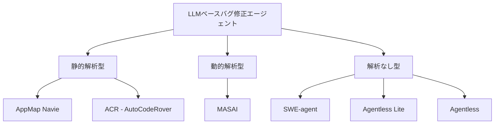
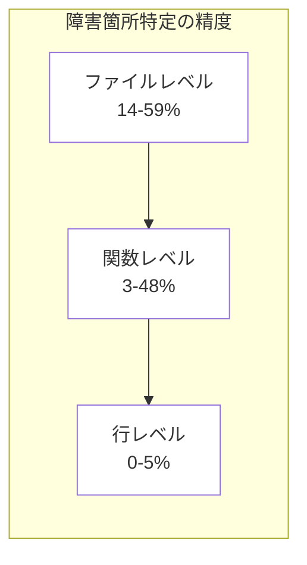

## 論文概要（Abstract）

本記事は [LLM-based Agents for Automated Bug Fixing: How Far Are We?](https://arxiv.org/abs/2411.10213) の解説記事です。

この論文は、LLMベースの6種のバグ修正エージェントをSWE-bench Lite（300件のGitHub Issue）上で体系的に評価した実証研究です。著者らは、解決率（Resolved Rate）、コスト効率、パッチ特性、タスク特性の影響、障害箇所特定（Fault Localization）の5つの軸で分析を行いました。最も高い解決率を達成したのはAgentless（40.67%）ですが、行レベルの障害箇所特定精度は全エージェントで0-5.13%にとどまることが報告されています。

この記事は [Zenn記事: Codex×AGENTS.md×MCPで大規模リポジトリのバグ修正精度を高める実装ガイド](https://zenn.dev/0h_n0/articles/ff39679e7b4b27) の深掘りです。

## 情報源

- **会議名**: ICSE 2026（International Conference on Software Engineering）
- **年**: 2026
- **URL**: [https://arxiv.org/abs/2411.10213](https://arxiv.org/abs/2411.10213)
- **著者**: Anh Nhan Nguyen, Quang-Huy Luu, Thi My Hang Vu, Dominik Sobania, Carol Hanna, Frank Neumann, Justyna Petke
- **採択率**: 19.8%（2026年、1,469件中321件採択）

## カンファレンス情報

ICSE（International Conference on Software Engineering）は、ソフトウェア工学分野の最高峰国際会議です。第48回となるICSE 2026は2026年4月12-18日に開催されました。採択率は19.8%と厳しい選考を経ており、査読後に直接採択72件、Major Revision後の採択88件を含む321件が採択されています。ソフトウェアテスティング、プログラム解析、自動プログラム修復など幅広い研究が対象であり、本論文はLLMエージェントによる自動バグ修正の実証的評価として採択されています。

## 技術的詳細（Technical Details）

### 実験設計

本論文の特徴は、既存のLLMベースバグ修正エージェント6種を統一的なベンチマーク（SWE-bench Lite）上で比較評価する点にあります。SWE-bench Liteは、12のPythonリポジトリから収集された300件のGitHub Issueで構成されるベンチマークです。各Issueには開発者が作成したテストパッチが付属しており、エージェントが生成したパッチの正否をテスト通過で判定します。

### 評価対象エージェント

著者らが評価した6種のエージェントは、その設計思想において大きく異なります。

**AppMap Navie**は静的解析に基づくエージェントで、コードの構造情報を活用して修正箇所を特定します。**ACR（AutoCodeRover）**も静的解析型で、AST（抽象構文木）ベースのコード検索とLLMを組み合わせたアプローチを取ります。

**MASAI（Modular Architecture for Software-engineering AI agents）**は動的解析を活用するエージェントです。テスト実行やデバッグ情報を修正プロセスに組み込む設計が特徴です。

**SWE-agent**はOpenAIの研究グループが開発したエージェントで、コードリポジトリとのインタラクティブな対話を通じてバグを修正します。静的解析・動的解析のいずれにも依存しない設計です。

**Agentless**はその名の通り、複雑なエージェント設計を排し、シンプルなLocalization-Repairパイプラインでバグ修正を行います。Agentless（Lite）はそのリソース削減版です。

### 使用LLMモデル

エージェント間の比較で注目すべき点として、使用するLLMが異なります。MASAI、Agentless（Lite）、AgentlessはClaude-3.5-Sonnetを使用し、AppMap Navie、SWE-agent、ACRはGPT-4系モデルを使用しています。著者らは、この違いが解決率に影響を与えている可能性を指摘しています。

### 5つの研究質問（Research Questions）

著者らは以下の5つの研究質問を設定しています。

- **RQ1（Resolved Rate）**: 各エージェントのバグ解決率はどの程度か
- **RQ2（Cost Analysis）**: エージェントの実行コスト（トークン消費量・金額）はどの程度か
- **RQ3（Patch Analysis）**: 解決可能なバグと不可能なバグのパッチにはどのような特性の違いがあるか
- **RQ4（Task Performance）**: リポジトリの特性（コードカバレッジ、コード量、ディレクトリ深度）は解決率にどう影響するか
- **RQ5（Fault Localization）**: 各エージェントの障害箇所特定精度はどの程度か

## 実験結果

### RQ1: バグ解決率

著者らの報告によると、Agentless（Claude-3.5-Sonnet使用）が300件中122件を解決し、40.67%の最高解決率を達成しています（論文Table 1より）。

| エージェント | 解析手法 | 解決Issue数 | 解決率 |
|---|---|---|---|
| AppMap Navie | 静的解析 | 44/300 | 14.67% |
| SWE-agent | なし | 72/300 | 24.00% |
| ACR (AutoCodeRover) | 静的解析 | 77/300 | 25.67% |
| MASAI* | 動的解析 | 66/193 | 34.20% |
| Agentless (Lite)* | なし | 108/300 | 36.00% |
| Agentless* | なし | 122/300 | 40.67% |

*印はClaude-3.5-Sonnetを使用するエージェントです。注目すべきは、Claude-3.5-Sonnetを使用するエージェント群がGPT-4系を使用するエージェント群よりも一貫して高い解決率を示している点です。MASAIは300件中193件のみを処理対象としていますが、処理した範囲では34.20%の解決率を記録しています。

### RQ2: コスト分析

エージェントの実行コストについて、著者らは1 Issueあたりの平均トークン消費量と費用を報告しています（論文Table 2より）。

| エージェント | 平均トークン数/Issue | コスト/Issue ($) |
|---|---|---|
| ACR | 116,128 | N/A |
| Agentless (Lite)* | 534,232 | N/A |
| SWE-agent | 557,810 | 6.03 |
| MASAI* | 714,804 | N/A |
| Agentless* | 1,161,408 | 10.10 |

著者らは、コストと解決率の間にピアソン相関係数 $r = -0.52$ の負の相関があることを報告しています。すなわち、コストが高いエージェントが必ずしも高い解決率を達成するわけではないことを示唆しています。ACRは最も少ないトークン数（116,128）で25.67%の解決率を達成しており、コスト効率の観点で優れています。

$$
r = \frac{\sum_{i=1}^{n}(x_i - \bar{x})(y_i - \bar{y})}{\sqrt{\sum_{i=1}^{n}(x_i - \bar{x})^2} \cdot \sqrt{\sum_{i=1}^{n}(y_i - \bar{y})^2}} = -0.52
$$

ここで $x_i$ はエージェント $i$ のトークン消費量、$y_i$ は解決率です。

### RQ3: パッチ特性分析

パッチの特性と解決率の関係について、以下の知見が報告されています。

**パッチサイズの影響**: 著者らは、解決されたIssueのパッチが有意に小さいことを報告しています。すべてのエージェントにおいて $p < 0.05$（Mann-Whitney U検定）であり、Cliff's deltaは中〜大の効果量を示しています。

**Hunk数による分析**:
- **シングルHunkパッチ**: 最も高い解決率（Agentlessで47.52%）
- **マルチHunkパッチ**: 解決率が低下
- **マルチファイルパッチ**: AppMap NavieとSWE-agentでは解決率が0.00%

この結果は、現在のLLMエージェントが複数ファイルにまたがるバグ修正に大きな課題を抱えていることを示しています。修正対象が1ファイル・1箇所に限定されるバグほどエージェントにとって解決が容易であり、変更の局所性が解決率を大きく左右するという知見が得られています。

### RQ4: タスク特性の影響

リポジトリの特性と解決率の関係について、著者らはピアソン相関分析の結果を報告しています。

| 特性 | 解決率との相関 (Pearson r) | 解釈 |
|---|---|---|
| コードカバレッジ | +0.41 | 正の相関（テストが充実したリポジトリほど解決しやすい） |
| コード行数 | +0.43 | 正の相関（大規模リポジトリほど解決しやすい） |
| リポジトリ深度 | -0.40 | 負の相関（ディレクトリが深いほど解決しにくい） |

コードカバレッジと解決率の正の相関（$r = +0.41$）は、テストが充実しているリポジトリではバグの再現や検証が容易であることを反映しています。コード行数との正の相関（$r = +0.43$）は一見直感に反しますが、大規模で成熟したプロジェクトほどドキュメントやテストが充実しており、エージェントがコンテキストを理解しやすいことが背景にあると著者らは考察しています。

リポジトリ深度との負の相関（$r = -0.40$）は、ディレクトリ構造が深いプロジェクトではファイルの特定自体が困難であることを示唆しています。

### RQ5: 障害箇所特定（Fault Localization）

著者らが報告する障害箇所特定精度は、ファイルレベル・関数レベル・行レベルの3段階で測定されています（論文Table 5より）。

| エージェント | ファイルレベル | 関数レベル | 行レベル |
|---|---|---|---|
| AppMap Navie | 14.40% | 2.97% | 0.00% |
| SWE-agent | 22.67% | 10.53% | 0.00% |
| ACR | 32.86% | 14.35% | 0.77% |
| MASAI | 37.31% | 27.46% | 1.04% |
| Agentless (Lite) | 56.73% | 36.85% | 4.60% |
| Agentless | 59.17% | 47.89% | 5.13% |

この結果は、LLMエージェントにとって障害箇所特定が依然として最大の課題であることを示しています。最も優れたAgentlessでさえ、行レベルでの正確な特定は5.13%にとどまっています。ファイルレベルでは59.17%と比較的高い精度を達成しているものの、修正すべき具体的な行を特定する能力は極めて限定的です。

AppMap NavieとSWE-agentは行レベルで0.00%であり、関数レベルでもそれぞれ2.97%、10.53%と低い精度です。一方、Agentlessはファイルレベル59.17%、関数レベル47.89%、行レベル5.13%と、すべての粒度で最高精度を達成しています。

上図は、障害箇所特定の粒度が細かくなるほど精度が急激に低下することを示しています。ファイルの特定からさらに関数・行へと絞り込む過程で、エージェントの能力が大きく制限されることがわかります。

## 実装のポイント

本論文の知見から、LLMベースバグ修正エージェントの設計において以下の教訓が得られます。

### パッチサイズの制約を考慮した設計

現在のエージェントはシングルHunk・シングルファイルの修正に強く、マルチファイルの修正にはほぼ対応できていません。エージェントの実運用では、修正対象をまず1ファイルの変更で完結するIssueに限定するフィルタリングが有効です。

### 動的解析の優位性

MASAIのように動的解析（テスト実行やデバッグ情報の活用）を組み込んだエージェントは、処理対象の範囲内で高い解決率を示しています。エージェント設計において、テスト実行結果のフィードバックループを組み込むことが解決率向上の鍵となります。

### コスト効率の最適化

コストと解決率の負の相関（$r = -0.52$）は、トークンを大量に消費する探索戦略が必ずしも有効でないことを示しています。ACRのような効率的なコード検索（AST構造の活用）を用いたアプローチは、低コストで競争力のある解決率を実現しています。

### LLMモデル選択の影響

Claude-3.5-Sonnetベースのエージェントがすべてのケースでより高い解決率を記録しているため、バグ修正タスクにおけるモデル選択が性能に直結することが示されています。

## 実運用への応用

### Zenn記事のExplorer-Workerパターンとの関連

関連するZenn記事「Codex×AGENTS.md×MCPで大規模リポジトリのバグ修正精度を高める実装ガイド」では、Explorer（コード探索）とWorker（修正実行）を分離するパターンが提案されています。本論文の知見はこのパターンの有効性を裏付けるものです。

Agentlessが最高の解決率を達成している背景には、障害箇所の特定（Localization）とパッチ生成（Repair）を明確に分離したパイプライン設計があります。これはExplorer-Workerパターンと設計思想が共通しており、「まず正確にファイル・関数を絞り込み、次にそこに集中して修正を生成する」というアプローチの合理性を示しています。

一方、行レベルの障害箇所特定が最大5.13%にとどまるという結果は、Explorerフェーズの精度がボトルネックであることを意味しています。AGENTS.mdやMCPを通じたリポジトリ構造情報の事前投入は、このボトルネック（特にリポジトリ深度の負の相関 $r = -0.40$ で示される問題）を軽減する手段として有効と考えられます。

また、マルチファイルパッチの解決率が0%となるエージェントが存在するという知見は、Workerフェーズでの変更範囲を限定し、段階的に修正を適用するアプローチの必要性を示唆しています。

## 関連研究

- **SWE-bench** (Jimenez et al., 2024): 本論文が評価に使用したベンチマーク。12のPythonリポジトリから実際のGitHub Issueとその修正パッチを収集したデータセットであり、LLMベースコード修正の標準評価基盤として広く利用されています。
- **Agentless** (Xia et al., 2024): Localization-Repairの2段階パイプラインによるシンプルな設計で、複雑なエージェント設計を用いる手法を上回る性能を達成しました。本論文でも最高解決率を記録しています。
- **SWE-agent** (Yang et al., 2024): リポジトリとのインタラクティブな対話を通じたバグ修正を行うエージェントです。Agent-Computer Interface (ACI)の概念を導入し、エージェントがコードリポジトリを効率的に操作するためのインターフェースを提供しています。
- **MASAI** (Arora et al., 2024): モジュラーアーキテクチャに基づくエージェントで、サブエージェントが各タスク（テスト生成、障害箇所特定、パッチ生成など）を分担するアプローチを採用しています。

## まとめと今後の展望

本論文は、LLMベースのバグ修正エージェントが実用に向けて着実に進歩している一方、いくつかの根本的な課題が残されていることを実証的に示しています。最大40.67%の解決率は期待できる数値ですが、行レベルの障害箇所特定が5.13%にとどまること、マルチファイルバグへの対応が困難であることは、今後の研究で克服すべき課題です。

著者らは、LLM自体の能力向上とエージェントフロー設計の最適化の両面からの改善が必要であると結論付けています。特に、障害箇所特定の精度向上（行レベル特定の改善）、マルチファイル修正への対応、コスト効率のさらなる最適化が今後の研究方向として挙げられます。

## 参考文献

- **Conference URL**: [https://arxiv.org/abs/2411.10213](https://arxiv.org/abs/2411.10213)
- **ICSE 2026**: [https://conf.researchr.org/home/icse-2026](https://conf.researchr.org/home/icse-2026)
- **SWE-bench**: [https://www.swebench.com/](https://www.swebench.com/)
- **Related Zenn article**: [https://zenn.dev/0h_n0/articles/ff39679e7b4b27](https://zenn.dev/0h_n0/articles/ff39679e7b4b27)
