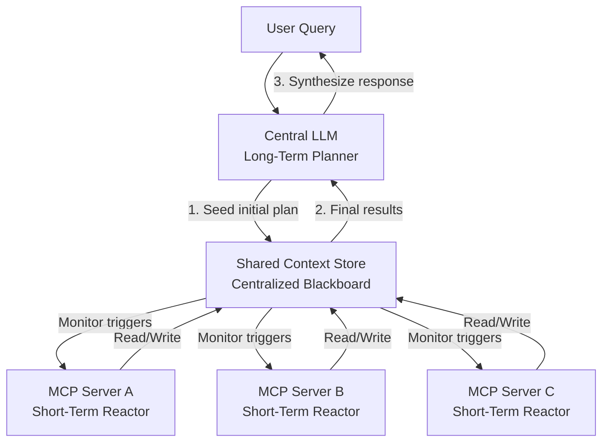
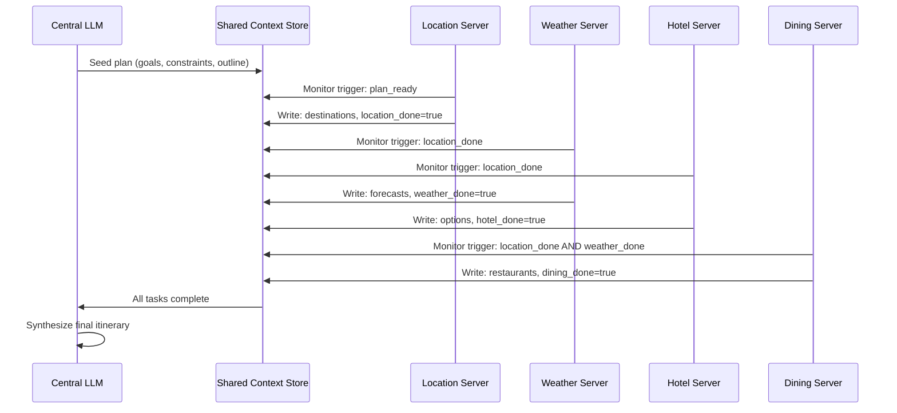

## 論文概要（Abstract）

本記事は [Enhancing Model Context Protocol (MCP) with Context-Aware Server Collaboration](https://arxiv.org/abs/2601.11595) の解説記事です。

著者らは、Model Context Protocol（MCP）の拡張として Context-Aware MCP（CA-MCP）を提案している。従来のMCPでは中央のLLMがステップごとにツール呼び出しを発行しタスク状態を管理するのに対し、CA-MCPでは Shared Context Store（SCS）と呼ばれる共有メモリを導入し、MCPサーバーがイベント駆動で自律的に協調する。TravelPlanner（500クエリ）およびREALM-Benchベンチマークでの実験では、実行時間を67.8-73.5%削減し、LLM呼び出し回数を50-60%削減したと報告されている。

この記事は [Zenn記事: Codex×AGENTS.md×MCPで大規模リポジトリのバグ修正精度を高める実装ガイド](https://zenn.dev/0h_n0/articles/ff39679e7b4b27) の深掘りです。Zenn記事ではMCPサーバーを活用した大規模リポジトリのバグ修正パイプラインを扱っていますが、本論文はそのMCPサーバー間の協調を根本的に改善するアーキテクチャを提案しており、複数MCPサーバーを組み合わせた実運用の効率化に直結します。

## 情報源

- **arXiv ID**: 2601.11595
- **URL**: [https://arxiv.org/abs/2601.11595](https://arxiv.org/abs/2601.11595)
- **著者**: Meenakshi Amulya Jayanti, X.Y. Han（University of Chicago）
- **発表年**: 2026（v2: 2026-01-22）
- **分野**: cs.DC（分散・並列・クラスタコンピューティング）, cs.LG, cs.SE
- **コード**: [https://github.com/Research-Anonymous-25/Context-Aware-MCP-Framework](https://github.com/Research-Anonymous-25/Context-Aware-MCP-Framework)
- **ライセンス**: CC BY-NC-SA 4.0

## 背景と動機（Background & Motivation）

Model Context Protocol（MCP）は、Anthropic社が2024年に公開したオープンプロトコルであり、LLMと外部ツール・データソースの接続を標準化する。MCPの登場により、コード補完、データベースクエリ、Webスクレイピングなど多様なサーバーをLLMに接続できるようになったが、著者らは従来型MCPに以下の構造的課題があると指摘している。

1. **中央集権的オーケストレーション**: LLMがすべてのサーバー呼び出しをステップごとに制御するため、タスクが複雑化するとLLM推論のボトルネックが発生する
2. **サーバーのステートレス性**: 各MCPサーバーは独立して動作し、他のサーバーの出力や中間状態を参照できない。これにより同一情報の再取得や冗長な処理が発生する
3. **コンテキスト喪失**: 長いタスクチェーンにおいてLLMがコンテキストウィンドウの制約により制約条件を忘却し、カスケード的なエラーやハルシネーションを引き起こす
4. **スケーラビリティの限界**: サーバー数やタスク複雑度の増加に対して、LLM呼び出し回数が線形に増加し、レイテンシとコストが悪化する

著者らは、これらの課題が「LLM単体にオーケストレーション責任を集中させている」ことに起因すると分析し、サーバー間で共有メモリを介した自律的協調を可能にするCA-MCPを提案している。

## 主要な貢献（Key Contributions）

- **Shared Context Store（SCS）の導入**: サーバー間で状態・制約・中間結果を共有する集中型黒板（blackboard）を設計。LLMが初期シードを行い、以後はサーバーが自律的に読み書きする
- **イベント駆動型サーバー協調**: 各サーバーがSCS上のトリガーを監視し、条件充足時に自動実行する反応型アーキテクチャを実現。LLMの継続的介入を排除
- **LLM呼び出しの大幅削減**: ワークフローあたりのLLM呼び出しを5回から2回に削減（60%減）。初期計画と最終統合のみにLLMを限定
- **実証的評価**: TravelPlanner（500クエリ）とREALM-Bench（結婚式ロジスティクス）の2ベンチマークで統計的に有意な改善を実証
- **後方互換性**: 既存のMCPサーバーをそのまま利用可能。SCS対応は段階的に追加できる設計

## 技術的詳細（Technical Details）

### CA-MCPアーキテクチャ

CA-MCPは3つの主要コンポーネントで構成される。



#### 1. Central LLM（Long-Term Planner）

中央のLLMは、ユーザーの高レベル目標を解釈し、タスクを分解し、SCSに初期計画をシードする役割を担う。従来型MCPではLLMがすべてのステップを逐次制御するのに対し、CA-MCPでは「計画フェーズ」と「統合フェーズ」のみに関与し、実行中は基本的にアイドル状態となる。

#### 2. MCP Servers（Short-Term Reactors）

各MCPサーバーはステートフルなエージェントとして動作し、SCS上の関連トリガーを監視する。条件が満たされると、サーバーは以下のサイクルを実行する。

1. SCSからコンテキストを読み取り
2. 計算またはデータ取得を実行
3. 中間結果をSCSに書き込み
4. 後続タスクへのトリガーをシグナル

この方式により、サーバー間のデータフローがLLMを経由せずに直接共有メモリを介して行われる。

#### 3. Shared Context Store（SCS）

SCSは「集中型黒板（centralized blackboard）」として機能し、タスク状態・制約条件・中間出力の単一真実源（single source of truth）を提供する。LLMが初期シードした計画に基づき、サーバーが実行中に継続的に更新する。SCSはJSON構造でタスク計画を保持し、各サーバーが必要な情報にアクセスできるようにしている。

### 従来型MCPとの処理フロー比較

従来型MCPでは、$n$ 個のサーバーを用いるタスクに対して、LLMは少なくとも $n$ 回の推論呼び出しを行う必要がある。

$$
T_{\text{traditional}} = \sum_{i=1}^{n} (T_{\text{LLM}_i} + T_{\text{server}_i})
$$

ここで、$T_{\text{LLM}_i}$ は $i$ 番目のステップにおけるLLM推論時間、$T_{\text{server}_i}$ は $i$ 番目のサーバー実行時間である。

CA-MCPでは、LLM呼び出しを初期計画と最終統合の2回に限定し、サーバー実行はイベント駆動で並行処理される。

$$
T_{\text{CA-MCP}} = T_{\text{plan}} + \max_{i \in \text{critical path}}(T_{\text{server}_i}) + T_{\text{synthesize}}
$$

ここで、$T_{\text{plan}}$ はLLMによる初期計画時間、$T_{\text{synthesize}}$ は最終統合時間である。サーバー実行時間はクリティカルパス上の最遅サーバーのみに依存するため、並列化可能なタスクでは大幅な時間短縮が期待できる。

### イベント駆動型協調モデル

各サーバーはSCS上のトリガーフィールドを監視する。例えば、旅行計画タスクにおいてlocationサーバーが目的地情報をSCSに書き込むと、`location_done` トリガーが発火し、weatherサーバーとhotelサーバーが並行して実行を開始する。



## アルゴリズム（Algorithm）

論文ではCA-MCPの動作を明示的な擬似コードとしては示していないが、記述内容から以下のようなイベント駆動型協調アルゴリズムを再構成できる。

```python
from dataclasses import dataclass, field
from typing import Any, Callable


@dataclass
class SharedContextStore:
    """Shared Context Store: centralized blackboard for server coordination.

    Servers read/write to this store, enabling event-driven coordination
    without repeated LLM intervention.
    """

    state: dict[str, Any] = field(default_factory=dict)
    triggers: dict[str, bool] = field(default_factory=dict)
    _watchers: dict[str, list[Callable]] = field(default_factory=dict)

    def seed(self, plan: dict[str, Any]) -> None:
        """LLM seeds the initial plan into the store.

        Args:
            plan: Structured JSON plan with goals, constraints, and outline.
        """
        self.state.update(plan)
        self.triggers["plan_ready"] = True
        self._notify("plan_ready")

    def read(self, key: str) -> Any:
        """Read a value from the shared context.

        Args:
            key: The context key to read.

        Returns:
            The stored value, or None if not found.
        """
        return self.state.get(key)

    def write(self, key: str, value: Any, trigger: str | None = None) -> None:
        """Write a value and optionally fire a trigger.

        Args:
            key: The context key to write.
            value: The value to store.
            trigger: Optional trigger name to signal completion.
        """
        self.state[key] = value
        if trigger:
            self.triggers[trigger] = True
            self._notify(trigger)

    def watch(self, trigger: str, callback: Callable) -> None:
        """Register a callback to fire when a trigger is set.

        Args:
            trigger: The trigger name to watch.
            callback: Function to call when the trigger fires.
        """
        if trigger not in self._watchers:
            self._watchers[trigger] = []
        self._watchers[trigger].append(callback)

    def _notify(self, trigger: str) -> None:
        """Notify all watchers of a fired trigger."""
        for cb in self._watchers.get(trigger, []):
            cb(self)


@dataclass
class MCPReactorServer:
    """Short-Term Reactor: stateful MCP server monitoring SCS for triggers.

    Each server watches specific triggers, reads context upon activation,
    performs computation, and writes results back to the SCS.
    """

    server_id: str
    watch_triggers: list[str]
    output_trigger: str

    def register(self, scs: SharedContextStore) -> None:
        """Register this server with the Shared Context Store.

        Args:
            scs: The shared context store to register with.
        """
        for trigger in self.watch_triggers:
            scs.watch(trigger, self._on_trigger)

    def _on_trigger(self, scs: SharedContextStore) -> None:
        """Handle trigger activation from SCS.

        Args:
            scs: The shared context store that fired the trigger.
        """
        if all(scs.triggers.get(t, False) for t in self.watch_triggers):
            result = self.execute(scs)
            scs.write(
                key=f"{self.server_id}_result",
                value=result,
                trigger=self.output_trigger,
            )

    def execute(self, scs: SharedContextStore) -> Any:
        """Execute server-specific computation. Override in subclasses.

        Args:
            scs: The shared context store for reading input context.

        Returns:
            Computation result to be written back to SCS.
        """
        raise NotImplementedError
```

上記コードは論文の記述に基づく筆者の再構成であり、論文著者らの公開実装とは異なる可能性がある点に留意されたい。

## 実装のポイント（Implementation）

論文著者らは、実装コードをGitHubリポジトリ（[Context-Aware-MCP-Framework](https://github.com/Research-Anonymous-25/Context-Aware-MCP-Framework)）として公開しており、計画・SCSオーケストレーション・自律サーバー実行・評価パイプラインの完全な実装が含まれると記載されている。

実装上の主要なポイントは以下の通りである。

- **SCSの実装**: SCSは集中型のJSON構造でタスク状態を管理する。トリガーベースの通知機構により、サーバーはポーリングではなくイベント駆動で動作する
- **サーバーのステートフル化**: 従来のステートレスなMCPサーバーを、SCSの読み書きが可能なステートフルリアクターに拡張する。既存のMCPツール定義はそのまま利用可能
- **LLM呼び出しの最小化**: 初期計画（タスク分解・サーバー選択・SCSシード）と最終統合（結果の集約・自然言語応答の生成）の2回のみにLLM推論を限定する
- **トリガー設計**: タスクの依存関係をトリガーの連鎖として表現する。`location_done -> weather_done AND hotel_done -> dining_done` のようにDAG構造を形成する
- **実験環境**: 論文では直接的な技術スタック（フレームワーク名等）への言及はないが、ストレートフォワードな実装を用いたとされ、並列マルチスレッド等のハードウェア最適化は行っていないと明記されている

## Production Deployment Guide

CA-MCPのSCSベースアーキテクチャをプロダクション環境にデプロイする場合のAWS実装パターンを示す。以下のガイドは論文の設計を基に筆者が構成したものであり、論文著者らの推奨ではない点に留意されたい。

### AWS実装パターン（コスト最適化重視）

CA-MCPの中核コンポーネントであるSCSは、低レイテンシの共有状態管理とイベント通知を必要とする。トラフィック量別の推奨構成を以下に示す。

| 構成 | トラフィック | 主要サービス | 月額概算 |
|------|------------|------------|---------|
| Small | ~100 req/日 | Lambda + ElastiCache (t4g.micro) + DynamoDB | $80-150 |
| Medium | ~1,000 req/日 | ECS Fargate + ElastiCache (r7g.large) + DynamoDB | $400-900 |
| Large | 10,000+ req/日 | EKS + ElastiCache Cluster + DynamoDB + Bedrock | $2,500-5,500 |

**注意**: 上記コスト試算は2026年6月時点のAWS ap-northeast-1（東京）リージョン料金に基づく概算値である。実際のコストはトラフィックパターン、リージョン、バースト使用量により変動する。最新料金は[AWS料金計算ツール](https://calculator.aws/)で確認を推奨する。

**Small構成のポイント**:
- SCSをElastiCache（Redis互換、t4g.micro: $12/月）で実装し、トリガー通知にはRedis Pub/Subを活用
- 各MCPサーバーをLambda関数として実装（128MB-512MB、月間30,000呼び出しで$5-15）
- タスク計画・結果の永続化にDynamoDB On-Demand（$2-5/月）
- LLM推論にBedrock（Claude Sonnet: $3/1M input tokens、1日100クエリで$30-80/月）
- NAT Gatewayを省略しVPCエンドポイント経由でコスト削減

**Large構成のポイント**:
- SCSをElastiCache Cluster Mode（3ノード、r7g.large: $500/月）で水平スケール
- MCPサーバーをEKS Pod + Karpenter Spot Instances（m7i.xlarge Spot: $0.06/h、オンデマンド比70%削減）
- Bedrock Batch APIで50%コスト削減、Prompt Cachingで30-90%追加削減

**コスト削減テクニック**:
- Spot Instances活用でEC2コストを最大90%削減
- Reserved Instances（1年コミット）でElastiCacheを最大40%削減
- Bedrock Batch API使用で非リアルタイムタスクのLLMコストを50%削減
- Prompt Caching有効化でシステムプロンプト部分のトークンコストを30-90%削減

### Terraformインフラコード

#### Small構成（Serverless）

```hcl
# CA-MCP Small構成: Lambda + ElastiCache + DynamoDB
# 2026年6月時点の最新Terraform AWS Provider v5.x対応

terraform {
  required_version = ">= 1.9.0"
  required_providers {
    aws = {
      source  = "hashicorp/aws"
      version = "~> 5.80"
    }
  }
}

provider "aws" {
  region = "ap-northeast-1"
}

# --- VPC基盤（NAT Gateway不使用でコスト削減） ---
module "vpc" {
  source  = "terraform-aws-modules/vpc/aws"
  version = "~> 5.16"

  name = "ca-mcp-vpc"
  cidr = "10.0.0.0/16"

  azs             = ["ap-northeast-1a", "ap-northeast-1c"]
  private_subnets = ["10.0.1.0/24", "10.0.2.0/24"]

  enable_nat_gateway = false  # コスト削減: VPCエンドポイント経由

  tags = {
    Project     = "ca-mcp"
    Environment = "production"
    ManagedBy   = "terraform"
  }
}

# VPCエンドポイント（Lambda -> DynamoDB, Bedrock）
resource "aws_vpc_endpoint" "dynamodb" {
  vpc_id       = module.vpc.vpc_id
  service_name = "com.amazonaws.ap-northeast-1.dynamodb"
  vpc_endpoint_type = "Gateway"
  route_table_ids   = module.vpc.private_route_table_ids
}

# --- ElastiCache（SCS: Shared Context Store） ---
resource "aws_elasticache_cluster" "scs" {
  cluster_id           = "ca-mcp-scs"
  engine               = "redis"
  engine_version       = "7.1"
  node_type            = "cache.t4g.micro"  # $12/月
  num_cache_nodes      = 1
  parameter_group_name = "default.redis7"
  subnet_group_name    = aws_elasticache_subnet_group.scs.name
  security_group_ids   = [aws_security_group.scs.id]

  tags = {
    Project = "ca-mcp"
    Role    = "shared-context-store"
  }
}

resource "aws_elasticache_subnet_group" "scs" {
  name       = "ca-mcp-scs-subnet"
  subnet_ids = module.vpc.private_subnets
}

resource "aws_security_group" "scs" {
  name_prefix = "ca-mcp-scs-"
  vpc_id      = module.vpc.vpc_id

  ingress {
    from_port       = 6379
    to_port         = 6379
    protocol        = "tcp"
    security_groups = [aws_security_group.lambda.id]
  }
}

# --- DynamoDB（タスク計画・結果の永続化） ---
resource "aws_dynamodb_table" "tasks" {
  name         = "ca-mcp-tasks"
  billing_mode = "PAY_PER_REQUEST"  # On-Demand: 低トラフィックに最適
  hash_key     = "task_id"
  range_key    = "created_at"

  attribute {
    name = "task_id"
    type = "S"
  }
  attribute {
    name = "created_at"
    type = "S"
  }

  server_side_encryption {
    enabled = true  # KMS暗号化
  }

  point_in_time_recovery {
    enabled = true
  }

  tags = {
    Project = "ca-mcp"
  }
}

# --- IAMロール（最小権限原則） ---
resource "aws_iam_role" "lambda_reactor" {
  name = "ca-mcp-lambda-reactor"

  assume_role_policy = jsonencode({
    Version = "2012-10-17"
    Statement = [{
      Action = "sts:AssumeRole"
      Effect = "Allow"
      Principal = { Service = "lambda.amazonaws.com" }
    }]
  })
}

resource "aws_iam_role_policy" "lambda_reactor" {
  name = "ca-mcp-reactor-policy"
  role = aws_iam_role.lambda_reactor.id

  policy = jsonencode({
    Version = "2012-10-17"
    Statement = [
      {
        Effect = "Allow"
        Action = [
          "dynamodb:GetItem",
          "dynamodb:PutItem",
          "dynamodb:UpdateItem",
          "dynamodb:Query"
        ]
        Resource = aws_dynamodb_table.tasks.arn
      },
      {
        Effect = "Allow"
        Action = [
          "bedrock:InvokeModel"
        ]
        Resource = "arn:aws:bedrock:ap-northeast-1::foundation-model/anthropic.claude-sonnet-*"
      },
      {
        Effect = "Allow"
        Action = [
          "logs:CreateLogGroup",
          "logs:CreateLogStream",
          "logs:PutLogEvents"
        ]
        Resource = "arn:aws:logs:*:*:*"
      }
    ]
  })
}

# --- Lambda（MCPサーバー: Short-Term Reactor） ---
resource "aws_security_group" "lambda" {
  name_prefix = "ca-mcp-lambda-"
  vpc_id      = module.vpc.vpc_id

  egress {
    from_port   = 0
    to_port     = 0
    protocol    = "-1"
    cidr_blocks = ["0.0.0.0/0"]
  }
}

resource "aws_lambda_function" "reactor" {
  function_name = "ca-mcp-reactor"
  role          = aws_iam_role.lambda_reactor.arn
  runtime       = "python3.13"
  handler       = "handler.lambda_handler"
  timeout       = 300  # SCS監視+外部API呼び出し
  memory_size   = 512

  filename = "lambda_package.zip"

  vpc_config {
    subnet_ids         = module.vpc.private_subnets
    security_group_ids = [aws_security_group.lambda.id]
  }

  environment {
    variables = {
      SCS_REDIS_HOST = aws_elasticache_cluster.scs.cache_nodes[0].address
      DYNAMODB_TABLE = aws_dynamodb_table.tasks.name
    }
  }

  tags = {
    Project = "ca-mcp"
    Role    = "mcp-reactor-server"
  }
}

# --- CloudWatch アラーム（コスト監視） ---
resource "aws_cloudwatch_metric_alarm" "lambda_errors" {
  alarm_name          = "ca-mcp-lambda-errors"
  comparison_operator = "GreaterThanThreshold"
  evaluation_periods  = 2
  metric_name         = "Errors"
  namespace           = "AWS/Lambda"
  period              = 300
  statistic           = "Sum"
  threshold           = 10
  alarm_description   = "CA-MCP Lambda reactor error rate exceeded"

  dimensions = {
    FunctionName = aws_lambda_function.reactor.function_name
  }
}
```

#### Large構成（Container）

```hcl
# CA-MCP Large構成: EKS + Karpenter + ElastiCache Cluster
# Spot Instances優先でコスト最適化

module "eks" {
  source  = "terraform-aws-modules/eks/aws"
  version = "~> 20.31"

  cluster_name    = "ca-mcp-cluster"
  cluster_version = "1.31"

  vpc_id     = module.vpc.vpc_id
  subnet_ids = module.vpc.private_subnets

  cluster_endpoint_public_access = false  # セキュリティ: プライベートのみ

  tags = {
    Project     = "ca-mcp"
    Environment = "production"
  }
}

# Karpenter Provisioner（Spot優先、自動スケーリング）
resource "kubectl_manifest" "karpenter_provisioner" {
  yaml_body = <<-YAML
    apiVersion: karpenter.sh/v1
    kind: NodePool
    metadata:
      name: ca-mcp-reactors
    spec:
      template:
        spec:
          requirements:
            - key: karpenter.sh/capacity-type
              operator: In
              values: ["spot", "on-demand"]  # Spot優先
            - key: node.kubernetes.io/instance-type
              operator: In
              values: ["m7i.xlarge", "m7i.2xlarge", "m6i.xlarge"]
          nodeClassRef:
            group: karpenter.k8s.aws
            kind: EC2NodeClass
            name: default
      limits:
        cpu: "100"
        memory: "400Gi"
      disruption:
        consolidationPolicy: WhenEmptyOrUnderutilized
        consolidateAfter: 30s
  YAML
}

# ElastiCache Cluster Mode（SCS水平スケール）
resource "aws_elasticache_replication_group" "scs_cluster" {
  replication_group_id = "ca-mcp-scs-cluster"
  description          = "CA-MCP Shared Context Store - Cluster Mode"
  engine               = "redis"
  engine_version       = "7.1"
  node_type            = "cache.r7g.large"
  num_node_groups      = 3
  replicas_per_node_group = 1
  automatic_failover_enabled = true
  at_rest_encryption_enabled = true  # KMS暗号化
  transit_encryption_enabled = true

  subnet_group_name  = aws_elasticache_subnet_group.scs.name
  security_group_ids = [aws_security_group.scs.id]
}

# AWS Budgets（予算アラート）
resource "aws_budgets_budget" "ca_mcp" {
  name         = "ca-mcp-monthly"
  budget_type  = "COST"
  limit_amount = "5500"
  limit_unit   = "USD"
  time_unit    = "MONTHLY"

  notification {
    comparison_operator       = "GREATER_THAN"
    threshold                 = 80
    threshold_type            = "PERCENTAGE"
    notification_type         = "ACTUAL"
    subscriber_email_addresses = ["ops@example.com"]
  }
}
```

### 運用・監視設定

#### CloudWatch Logs Insights クエリ

```
# SCS読み書きレイテンシ分析（P95, P99）
fields @timestamp, server_id, operation, duration_ms
| filter operation in ["scs_read", "scs_write"]
| stats percentile(duration_ms, 95) as p95,
        percentile(duration_ms, 99) as p99,
        avg(duration_ms) as avg_ms
  by server_id, bin(1h) as hour

# LLM呼び出しコスト異常検知
fields @timestamp, input_tokens, output_tokens
| filter event = "bedrock_invoke"
| stats sum(input_tokens) as total_input,
        sum(output_tokens) as total_output
  by bin(1h) as hour
| filter total_input > 500000
```

#### CloudWatch アラーム設定（Python）

```python
import boto3


def create_scs_latency_alarm(
    cloudwatch: boto3.client,
    function_name: str,
    threshold_ms: float = 100.0,
) -> dict:
    """SCSアクセスレイテンシのCloudWatchアラームを作成する。

    Args:
        cloudwatch: CloudWatch boto3クライアント。
        function_name: 監視対象のLambda関数名。
        threshold_ms: アラーム発火閾値（ミリ秒）。

    Returns:
        CloudWatch put_metric_alarm APIレスポンス。
    """
    return cloudwatch.put_metric_alarm(
        AlarmName=f"ca-mcp-scs-latency-{function_name}",
        ComparisonOperator="GreaterThanThreshold",
        EvaluationPeriods=3,
        MetricName="Duration",
        Namespace="AWS/Lambda",
        Period=300,
        Statistic="p99",
        Threshold=threshold_ms,
        ActionsEnabled=True,
        AlarmDescription="CA-MCP SCS access latency P99 exceeded threshold",
        Dimensions=[
            {"Name": "FunctionName", "Value": function_name},
        ],
    )
```

#### X-Ray トレーシング設定（Python）

```python
from aws_xray_sdk.core import xray_recorder, patch_all


def configure_xray_tracing(service_name: str = "ca-mcp-reactor") -> None:
    """X-Rayトレーシングを設定し、boto3呼び出しを自動計装する。

    Args:
        service_name: X-Rayに記録するサービス名。
    """
    xray_recorder.configure(service=service_name)
    patch_all()  # boto3, requests等を自動計装


def trace_scs_operation(
    operation: str,
    server_id: str,
    key: str,
) -> None:
    """SCS操作をX-Rayサブセグメントとして記録する。

    Args:
        operation: 操作種別（read/write/trigger）。
        server_id: 実行元のMCPサーバーID。
        key: アクセスしたコンテキストキー。
    """
    subsegment = xray_recorder.begin_subsegment(f"scs_{operation}")
    subsegment.put_annotation("server_id", server_id)
    subsegment.put_annotation("operation", operation)
    subsegment.put_metadata("context_key", key)
    xray_recorder.end_subsegment()
```

#### Cost Explorer自動レポート（Python）

```python
from datetime import datetime, timedelta

import boto3


def get_daily_cost_report(
    ce_client: boto3.client,
    sns_client: boto3.client,
    topic_arn: str,
    daily_threshold: float = 100.0,
) -> dict:
    """日次コストレポートを取得し、閾値超過時にSNS通知を送信する。

    Args:
        ce_client: Cost Explorer boto3クライアント。
        sns_client: SNS boto3クライアント。
        topic_arn: 通知先のSNSトピックARN。
        daily_threshold: 日次コスト閾値（USD）。

    Returns:
        Cost Explorerのレスポンスデータ。
    """
    end = datetime.utcnow().strftime("%Y-%m-%d")
    start = (datetime.utcnow() - timedelta(days=1)).strftime("%Y-%m-%d")

    response = ce_client.get_cost_and_usage(
        TimePeriod={"Start": start, "End": end},
        Granularity="DAILY",
        Metrics=["BlendedCost"],
        GroupBy=[
            {"Type": "DIMENSION", "Key": "SERVICE"},
        ],
        Filter={
            "Tags": {
                "Key": "Project",
                "Values": ["ca-mcp"],
            }
        },
    )

    total_cost = sum(
        float(group["Metrics"]["BlendedCost"]["Amount"])
        for result in response["ResultsByTime"]
        for group in result["Groups"]
    )

    if total_cost > daily_threshold:
        sns_client.publish(
            TopicArn=topic_arn,
            Subject=f"CA-MCP Daily Cost Alert: ${total_cost:.2f}",
            Message=(
                f"CA-MCP daily cost ${total_cost:.2f} exceeded "
                f"threshold ${daily_threshold:.2f}.\n"
                f"Period: {start} to {end}"
            ),
        )

    return response
```

### コスト最適化チェックリスト

**アーキテクチャ選択**:
- [ ] トラフィック量に応じてServerless/Hybrid/Container構成を選択
- [ ] SCSのElastiCacheノードタイプをワーキングセットサイズに合わせて選定

**リソース最適化**:
- [ ] EC2/EKS: Spot Instances優先（m7i/m6i、最大90%削減）
- [ ] ElastiCache: Reserved Nodes 1年コミット（最大40%削減）
- [ ] Savings Plans: Compute Savings Plans検討（最大20%削減）
- [ ] Lambda: メモリサイズをPower Tuningで最適化
- [ ] EKS: Karpenter consolidation設定でアイドルノード自動回収

**LLMコスト削減**:
- [ ] Bedrock Batch API使用（非リアルタイムの計画フェーズに適用、50%削減）
- [ ] Prompt Caching有効化（システムプロンプト部分で30-90%削減）
- [ ] モデル選択ロジック（計画フェーズにはSonnet、軽量タスクにはHaiku）
- [ ] max_tokens制限（計画出力を2,000トークン以内に制約）

**監視・アラート**:
- [ ] AWS Budgets月次・日次アラート設定
- [ ] CloudWatch Lambda/EKSメトリクスアラーム
- [ ] Cost Anomaly Detection有効化
- [ ] 日次コストレポートSNS通知
- [ ] SCSレイテンシP99アラーム

**リソース管理**:
- [ ] 未使用ElastiCacheスナップショット定期削除
- [ ] タグ戦略（Project/Environment/ManagedBy統一）
- [ ] CloudWatch Logsライフサイクル（30日保持）
- [ ] DynamoDBバックアップライフサイクル（90日保持）
- [ ] 開発環境の夜間停止（EKSノード/ElastiCacheスケールダウン）

## 実験結果（Results）

著者らは2つのベンチマークでCA-MCPの有効性を評価している。いずれも対照実験として従来型MCP（LLMがステップごとに制御）との比較を行っている。

### TravelPlanner（500クエリ）

TravelPlannerは、予算・時間・好みの制約下で複数日の旅行計画を生成するベンチマークである。1,200以上のマルチターンタスクから500クエリをサンプリングして評価が行われた。

| 指標 | 従来型MCP | CA-MCP | 改善率 |
|------|----------|--------|--------|
| 実行時間 | 41.99s | 13.52s | -67.8% |
| Completeness | 0.764 | 1.000 | +30.9% |
| BERTScore F1 | 0.745 | 0.757 | +1.6% |
| ROUGE-L | 0.031 | 0.027 | -12.9% |
| LLM呼び出し回数 | 5 | 2 | -60% |

（論文 Table 2 より）

統計的検定として対応ありt検定が実施され、実行時間の差（平均差28.465s, SD=18.059）のp値は $1.60 \times 10^{-137}$、Completenessの差（平均差0.236, SD=0.2408）のp値は $4.39 \times 10^{-75}$ と報告されている。BERTScoreについても $p = 2.35 \times 10^{-8}$ で統計的に有意である。

ROUGE-Lスコアはわずかに低下しているが（$p = 1.24 \times 10^{-13}$）、著者らはCompleteness 1.000（全制約充足）とBERTScoreの改善を踏まえ、意味的な品質は維持されていると議論している。

### REALM-Bench Wedding Logistics

REALM-Benchの結婚式ロジスティクスタスクは、ゲスト到着・用事・共有車両の調整を期限・容量制約下で行うベンチマークである。arrival_tracker、errand_tracker、transportの3サーバーがSCSを介して協調する。

| 指標 | 従来型MCP | CA-MCP | 改善率 |
|------|----------|--------|--------|
| Goal Satisfaction | 1.0 | 1.0 | -- |
| Constraint Satisfaction | 1.0 | 1.0 | -- |
| Makespan | 330 min | 180 min | -45.5% |
| Coordination Score | 0 | 1 | +1.0 |
| LLM呼び出し回数 | 2 | 1 | -50% |
| 実行時間 | 8.52s | 2.26s | -73.5% |

（論文 Table 3 より）

特筆すべきは、Coordination Scoreが0から1に改善されている点である。従来型MCPではサーバー間の調整がLLM経由でしか行われないため、タイミング制約の管理が困難であったのに対し、CA-MCPではSCS上の共有状態により、arrival_trackerとtransportサーバーが直接的に情報を共有し、効率的なスケジューリングが実現されたと著者らは報告している。

### 関連手法との比較

著者らは論文Table 1において、CA-MCPを以下の関連パラダイムと比較している。

| 側面 | CA-MCP | RL Orchestrator | SagaLLM | Blackboard MAS |
|------|--------|-----------------|---------|----------------|
| LLMの役割 | 計画+統合のみ | 継続的動的制御 | トランザクション調整 | エージェント選択 |
| サーバーの役割 | 自律的リアクター | LLM制御の実行器 | ドメインエージェント | LLMが選択する貢献者 |
| コンテキスト機構 | 動的SCS | LLMが集約 | 永続的構造化台帳 | 公開黒板メモリ |
| 協調方式 | イベント駆動自律協調 | 継続的ルーティング | 集中型バリデーション | LLMが黒板に基づき選択 |

（論文 Table 1 を簡略化）

## 実運用への応用（Practical Applications）

Zenn記事「Codex×AGENTS.md×MCPで大規模リポジトリのバグ修正精度を高める実装ガイド」で扱われているMCPサーバー構成（filesystem、GitHub、grep等の複数サーバー連携）は、CA-MCPのSCSアーキテクチャによる効率化が期待できる領域である。

**バグ修正パイプラインでの適用例**:
- **コンテキスト共有**: grepサーバーが発見したエラー箇所をSCSに書き込み、filesystemサーバーが即座に関連ファイルを読み込むことで、LLMを介した中継を排除
- **並列調査**: 複数のMCPサーバー（コード検索、テスト実行、依存関係分析）がSCS上のバグ報告を同時に読み取り、並列に調査を実行
- **LLMコスト削減**: 大規模リポジトリの探索では多数のツール呼び出しが発生するが、CA-MCPにより中間ステップのLLM推論を削減し、API呼び出しコストを抑制

**制約と実現可能性**: CA-MCPは理論的提案から実証段階に移行した研究であるが、2つのベンチマーク（旅行計画・結婚式ロジスティクス）での評価に限定されている。バグ修正のような複雑な推論を要するタスクでの有効性は未検証であり、SCSのスキーマ設計やトリガーの粒度設計には追加の研究が必要である。

## 関連研究（Related Work）

- **Blackboard Architecture（Hayes-Roth, 1985）**: CA-MCPのSCSは古典的な黒板アーキテクチャの影響を受けている。黒板システムでは複数の知識源が共有データ構造を介して協調するが、CA-MCPはこれをLLM+MCPサーバーの文脈に適応した形態と位置づけられる
- **SagaLLM**: LLMエージェントのトランザクション管理に焦点を当てた研究。永続的な構造化台帳を用いて長期的な一貫性とロールバック機能を提供する。CA-MCPがリアルタイムの効率化を重視するのに対し、SagaLLMは信頼性・回復性を重視する
- **Marvin / G-Memory**: 個々のエージェントのメモリ拡張に焦点を当てた研究群。Marvinはベクトルストアによるエージェント個別の記憶を、G-Memoryはグラフベースのクロストライアル学習を提案している。CA-MCPはエージェント間の即時的な状態共有に焦点を当てており、長期記憶との補完が考えられる

## まとめと今後の展望

CA-MCPは、MCPフレームワークにShared Context Store（SCS）を導入することで、LLM呼び出し回数の大幅な削減（50-60%）と実行時間の短縮（67.8-73.5%）を実現した。中央のLLMの役割を初期計画と最終統合に限定し、MCPサーバーをイベント駆動型の自律リアクターとして動作させるアーキテクチャは、マルチサーバー連携の効率化に有望なアプローチである。

**今後の課題として著者らは以下を挙げている**:
- 並列・非同期実行による大規模計画タスクへの拡張
- サーバーレベルでの実行履歴からの学習
- マルチモーダル統合（視覚・音声・構造化データ）
- セキュリティ・プライバシーの考慮（SCSへのアクセス制御）

**本論文の制約**:
- 評価が2つのベンチマーク（TravelPlanner, REALM-Bench）に限定されている
- ハードウェア最適化（並列マルチスレッド等）を適用していないストレートフォワードな実装での比較である
- クロスタスク学習や長期的な知識蓄積には対応していない

## 参考文献

- **arXiv**: [https://arxiv.org/abs/2601.11595](https://arxiv.org/abs/2601.11595)
- **Code**: [https://github.com/Research-Anonymous-25/Context-Aware-MCP-Framework](https://github.com/Research-Anonymous-25/Context-Aware-MCP-Framework)
- **Related Zenn article**: [https://zenn.dev/0h_n0/articles/ff39679e7b4b27](https://zenn.dev/0h_n0/articles/ff39679e7b4b27)
