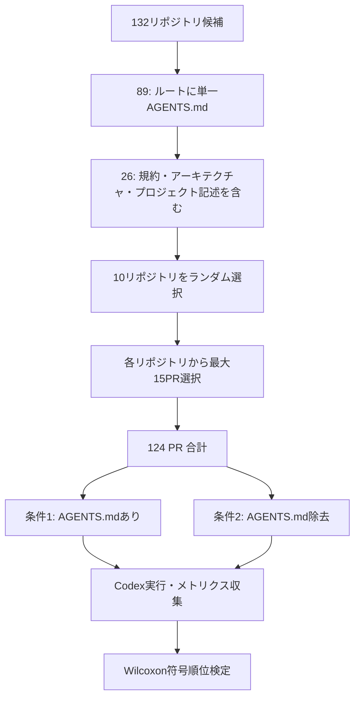

## 論文概要（Abstract）

本記事は [On the Impact of AGENTS.md Files on the Efficiency of AI Coding Agents](https://arxiv.org/abs/2601.20404) の解説記事です。

AIコーディングエージェント（Codex、Claude Code等）がソフトウェアリポジトリに自律的にコントリビュートする場面が増加する中、リポジトリレベルの設定ファイルがエージェントの運用効率にどう影響するかを実証的に調査した研究である。著者らは10リポジトリ・124プルリクエストを対象に、AGENTS.mdファイルの有無による実行時間とトークン消費量の差を測定した。その結果、AGENTS.mdの存在下で**ランタイム中央値28.64%削減**、**出力トークン消費中央値16.58%削減**が確認された一方、タスク完了率には有意な差が見られなかったと報告している。

この記事は [Zenn記事: Codex×AGENTS.md×MCPで大規模リポジトリのバグ修正精度を高める実装ガイド](https://zenn.dev/0h_n0/articles/ff39679e7b4b27) の深掘りです。

## 情報源

- **arXiv ID**: 2601.20404
- **URL**: [https://arxiv.org/abs/2601.20404](https://arxiv.org/abs/2601.20404)
- **著者**: Jai Lal Lulla, Seyedmoein Mohsenimofidi, Matthias Galster, et al.
- **発表年**: 2026年1月（ICSE 2026 JAWs Workshop採択）
- **分野**: Software Engineering (cs.SE), Artificial Intelligence (cs.AI), Emerging Technologies (cs.ET), Human-Computer Interaction (cs.HC)

## 背景と動機（Background & Motivation）

### AIコーディングエージェントの台頭

2025年から2026年にかけて、OpenAI Codex、Anthropic Claude Code、GitHub Copilot Workspaceといった自律型コーディングエージェントが急速に普及した。これらのエージェントはGitHubのIssueやPull Requestの内容を読み取り、コード変更を自律的に生成・提案する。SWE-benchでの成功率は1年で10%未満から70%超へと急伸しており、実用性は確実に向上している。

### 従来の課題

しかし、エージェントがリポジトリに対して効率的に作業するためには、プロジェクト固有の情報（コーディング規約、アーキテクチャ構成、テスト実行方法など）を理解する必要がある。従来はエージェントがこれらの情報をファイル探索によって自力で推定しており、以下の問題が生じていた。

- **不要なファイル探索**: リポジトリ構造を把握するまでに多くのトークンと時間を消費
- **規約違反**: プロジェクト固有のコーディング規約を知らずに生成するため、レビューコストが増大
- **実行時間の増大**: 試行錯誤的なアプローチにより、タスク完了までの壁時計時間が長期化

このような背景から、リポジトリルートにAGENTS.mdファイルを配置し、エージェントに事前情報を与えるプラクティスが広まった。しかし、その効果を定量的に検証した研究は本論文まで存在しなかった。

## 主要な貢献（Key Contributions）

著者らの貢献は以下の通りである。

- **初の定量的実証**: AGENTS.mdファイルの効果を、制御された実験環境で定量的に測定した初の研究
- **運用効率への影響の定量化**: ランタイム28.64%削減、出力トークン16.58%削減という具体的な数値を提示
- **タスク完了率の非影響**: 効率改善がタスク品質の低下を伴わないことを確認
- **実践的な配備指針**: リポジトリ運用者に対し、AGENTS.mdの内容設計に関する具体的な推奨事項を提示
- **研究アジェンダの提示**: リポジトリレベル設定ファイルの効果に関する今後の研究方向を体系的に整理

## 技術的詳細（Technical Details）

### 研究設計の全体像



### リサーチクエスチョン

著者らが設定したリサーチクエスチョンは次の通りである。

> **RQ**: AGENTS.mdファイルがリポジトリルートに存在することで、自律型AIコーディングエージェントがタスクを完了するために必要なリソース（トークン使用量および壁時計時間）は削減されるか？

### リポジトリ選択プロセス

リポジトリの選択は厳密なフィルタリングプロセスを経ている。

1. **初期コーパス**: エージェント指示ファイルを含む132リポジトリを収集
2. **構造フィルタ**: ルートに単一のAGENTS.mdのみを持つ89リポジトリに絞り込み
3. **内容フィルタ**: AGENTS.mdの記述内容をLLMベース分類器（gpt-oss-120b via Ollama）で分析し、以下の3カテゴリのいずれかを含む26リポジトリを抽出
   - コーディング規約・ベストプラクティス
   - アーキテクチャ・プロジェクト構造
   - プロジェクト記述
4. **ランダム選択**: 26リポジトリから10リポジトリをランダムに選択

### PR選択基準

各リポジトリから最大15個のマージ済みPRを以下の基準で選択している。

- **サイズ制約**: 追加+削除が100行以下
- **スコープ制約**: 変更ファイル数が5以下
- **ステータス**: マージ済みのみ
- **タイミング**: AGENTS.md導入以降に作成・マージされたもの
- **種別**: コード変更のみ（ドキュメント・設定変更は除外）

### 実験実行環境

著者らは再現性と信頼性を確保するため、以下の環境を構築している。

- **エージェント**: OpenAI Codex（gpt-5.2-codex）
- **隔離**: タスクごとにDockerコンテナを使用
- **状態管理**: タスク間で状態を共有しない（バージョン管理されたファイル以外）
- **事前状態復元**: マージ前のコミットにチェックアウトし、当該時点のAGENTS.mdを使用

各PRについて、以下の2条件で同一タスクを実行する対応のある設計（within-subject design）を採用している。

- **条件1**: AGENTS.mdありのリポジトリスナップショット
- **条件2**: AGENTS.mdを除去した同一スナップショット

### 測定メトリクス

収集したメトリクスは以下の2軸である。

$$
\text{Resource} = \{T_{\text{wall}}, \, T_{\text{tokens}}\}
$$

ここで、
- $T_{\text{wall}}$: 壁時計時間（エージェント開始から最終出力までの秒数）
- $T_{\text{tokens}}$: トークン使用量（入力トークン + キャッシュ入力トークン + 出力トークン）

改善率は以下の式で計算される。

$$
\Delta\% = \frac{M_{\text{with}} - M_{\text{without}}}{M_{\text{without}}} \times 100
$$

ここで、$M_{\text{with}}$はAGENTS.mdあり条件でのメトリクス値、$M_{\text{without}}$はなし条件でのメトリクス値である。

### 統計検定

データの正規性が仮定できないため、**Wilcoxon符号順位検定**（有意水準 $p < 0.05$）を使用している。これはノンパラメトリックな対応のある標本検定であり、各PRに対する2条件の差分を対としている。

## 実装のポイント（Implementation）

### 効果的なAGENTS.mdの構成

本論文の結果を踏まえ、AGENTS.mdの設計において重要なポイントを整理する。著者らの分類では、効果が確認されたAGENTS.mdは以下の3カテゴリの記述を含んでいた。

```markdown
# AGENTS.md

## コーディング規約（Conventions）
- 命名規則: snake_case for Python, camelCase for TypeScript
- インポート順序: 標準ライブラリ → サードパーティ → ローカル
- エラーハンドリング: 例外は具体的な型で捕捉

## アーキテクチャ（Architecture）
- src/api/ : REST APIエンドポイント
- src/services/ : ビジネスロジック
- src/models/ : データモデル（Pydantic）
- tests/ : pytestテスト

## テスト実行（Testing）
- `uv run pytest -q` で全テスト実行
- CI/CDではGitHub Actionsを使用
```

### 注意すべき点

関連研究（Gloaguen et al., 2026）では、過度に詳細なAGENTS.mdが逆効果になるケースも報告されている。著者らは以下を推奨している。

- **最小限かつ具体的な記述**: テスト実行コマンド、非自明なアーキテクチャ制約、禁止事項の3セクション構成
- **過度に長い記述は避ける**: エージェントのコンテキストウィンドウを圧迫し、本来の作業に使えるトークンが減少
- **バージョン管理との連動**: AGENTS.mdをコードベースの進化に合わせて更新

```python
from pathlib import Path
from dataclasses import dataclass, field


@dataclass
class AgentsMdValidator:
    """AGENTS.mdの品質チェッカー

    Args:
        file_path: AGENTS.mdのパス
        max_lines: 推奨最大行数
        required_sections: 必須セクション一覧
    """

    file_path: Path
    max_lines: int = 200
    required_sections: list[str] = field(
        default_factory=lambda: ["conventions", "architecture", "testing"]
    )

    def validate(self) -> dict[str, bool]:
        """AGENTS.mdの品質を検証する

        Returns:
            セクション名 -> 存在有無のマッピング
        """
        content = self.file_path.read_text()
        lines = content.split("\n")

        results: dict[str, bool] = {}
        for section in self.required_sections:
            results[section] = any(
                section.lower() in line.lower()
                for line in lines
                if line.startswith("#")
            )

        results["within_line_limit"] = len(lines) <= self.max_lines
        return results
```

## 実験結果（Results）

### リソース使用量の比較

論文Table 1より、主要なメトリクスの比較結果を以下に示す。

| メトリクス | AGENTS.mdなし | AGENTS.mdあり | 差分 | 改善率 |
|-----------|-------------|-------------|------|--------|
| **壁時計時間（中央値, 秒）** | 98.57 | 70.34 | -28.23 | **-28.64%*** |
| **壁時計時間（平均, 秒）** | 162.94 | 129.91 | -33.03 | -20.27% |
| **出力トークン（中央値）** | 2,925 | 2,440 | -485 | **-16.58%*** |
| **出力トークン（平均）** | 5,744 | 4,591 | -1,153 | **-20.08%*** |
| **入力トークン（中央値）** | 116,609 | 120,587 | +3,978 | +3.41% |
| **総トークン（中央値）** | 223,707 | 226,582 | +2,875 | +1.29% |

*はWilcoxon符号順位検定で統計的に有意（$p < 0.05$）を示す。

### 結果の解釈

著者らの分析から以下の点が読み取れる。

1. **壁時計時間の大幅削減**: 中央値で28.64%の削減は、AGENTS.mdがエージェントの「探索フェーズ」を短縮していることを示唆する
2. **出力トークンの選択的削減**: 入力トークンはほぼ変化がない（+3.41%）一方、出力トークンが16.58%削減されている。これはエージェントが「考える量」が減ったことを意味する
3. **標準偏差の大幅削減**: 壁時計時間の標準偏差が24.91%減少しており、AGENTS.mdがエージェント動作の安定性を向上させている可能性がある
4. **平均値と中央値の乖離**: 平均改善率が中央値より小さいケースがあり、著者らは「効率改善は少数の高コストタスクに集中している」と分析している

### 品質の担保

著者らは50件のPRタスクをランダムにサンプリングし、エージェント出力を人間が書いたマージ済みPRと手動比較する健全性チェック（sanity check）を実施している。その結果、エージェントが自明な出力や退化した出力を生成していないことを確認したと報告している。

## Production Deployment Guide

本論文はAGENTS.mdの設計指針を含む実装的な内容であるため、Production Deployment Guideを記載する。ここでは、AGENTS.mdを中核としたAIコーディングエージェントの運用基盤をAWS上に構築するパターンを示す。

### AWS実装パターン（コスト最適化重視）

AGENTS.mdの効果を最大化するには、エージェント実行基盤自体のコスト最適化が重要である。トラフィック量（エージェント実行頻度）別に推奨構成を示す。

**コスト試算の注意事項**: 以下は2026年6月時点のAWS ap-northeast-1（東京）リージョン料金に基づく概算値である。実際のコストはトラフィックパターン、リージョン、バースト使用量により変動する。最新料金はAWS料金計算ツールで確認されたい。

| 構成 | 想定負荷 | 月額コスト | 主要サービス |
|------|---------|-----------|-------------|
| Small | ~100タスク/日 | $50-150 | Lambda + Bedrock + DynamoDB |
| Medium | ~1,000タスク/日 | $300-800 | ECS Fargate + Bedrock + Aurora Serverless |
| Large | 10,000+タスク/日 | $2,000-5,000 | EKS + Spot Instances + Bedrock Batch API |

**Small構成の内訳**:
- Lambda（512MB, 平均60秒/タスク）: ~$5/月
- Bedrock API（Claude/Codex呼び出し、平均5Kトークン/タスク）: ~$30-100/月
- DynamoDB（On-Demand, タスクログ保存）: ~$5/月
- S3（AGENTS.mdバージョン管理・ログ保存）: ~$1/月
- CloudWatch（ログ・メトリクス）: ~$5/月

**コスト削減テクニック**:
- **Spot Instances活用**: EKSワーカーノードで最大90%削減（バッチ処理向け）
- **Reserved Instances**: ECS/EKSの常駐ノードに1年コミットで最大72%削減
- **Bedrock Batch API**: 非リアルタイムタスクに使用して50%削減
- **Prompt Caching有効化**: AGENTS.md内容のキャッシュで30-90%削減

### Terraformインフラコード

#### Small構成（Serverless）

```hcl
# AGENTS.md管理基盤 - Small構成 (Lambda + Bedrock + DynamoDB)
terraform {
  required_version = ">= 1.10"
  required_providers {
    aws = { source = "hashicorp/aws", version = "~> 5.80" }
  }
}

provider "aws" { region = "ap-northeast-1" }

# IAMロール（最小権限: Bedrock + DynamoDB + CloudWatch Logs）
resource "aws_iam_role" "agent_runner" {
  name = "agent-runner-role"
  assume_role_policy = jsonencode({
    Version = "2012-10-17"
    Statement = [{ Action = "sts:AssumeRole", Effect = "Allow",
                    Principal = { Service = "lambda.amazonaws.com" } }]
  })
}

resource "aws_iam_role_policy" "agent_runner_policy" {
  name = "agent-runner-policy"
  role = aws_iam_role.agent_runner.id
  policy = jsonencode({
    Version = "2012-10-17"
    Statement = [
      { Effect = "Allow",
        Action = ["bedrock:InvokeModel", "bedrock:InvokeModelWithResponseStream"],
        Resource = "arn:aws:bedrock:ap-northeast-1::foundation-model/*" },
      { Effect = "Allow",
        Action = ["dynamodb:PutItem", "dynamodb:GetItem", "dynamodb:Query"],
        Resource = aws_dynamodb_table.task_logs.arn },
      { Effect = "Allow",
        Action = ["logs:CreateLogGroup", "logs:CreateLogStream", "logs:PutLogEvents"],
        Resource = "arn:aws:logs:ap-northeast-1:*:*" }
    ]
  })
}

# DynamoDB（タスクログ、On-Demand + KMS暗号化）
resource "aws_dynamodb_table" "task_logs" {
  name         = "agent-task-logs"
  billing_mode = "PAY_PER_REQUEST"
  hash_key     = "task_id"
  range_key    = "timestamp"
  attribute { name = "task_id", type = "S" }
  attribute { name = "timestamp", type = "S" }
  server_side_encryption { enabled = true }
  point_in_time_recovery { enabled = true }
}

# Lambda関数（AGENTS.md効果で平均70秒完了、timeout=300秒）
resource "aws_lambda_function" "agent_task_runner" {
  function_name = "agent-task-runner"
  role          = aws_iam_role.agent_runner.arn
  handler       = "handler.lambda_handler"
  runtime       = "python3.13"
  timeout       = 300
  memory_size   = 512
  environment { variables = {
    DYNAMODB_TABLE = aws_dynamodb_table.task_logs.name
    BEDROCK_REGION = "ap-northeast-1"
  }}
  tracing_config { mode = "Active" }  # X-Ray有効化
  filename         = "lambda_package.zip"
  source_code_hash = filebase64sha256("lambda_package.zip")
}
```

#### Large構成（Container）

Large構成ではEKS + Karpenter + Spot Instancesを採用する。主要な設計ポイントは以下の通りである。

- **EKSクラスタ**: `terraform-aws-modules/eks/aws` v20.31、Kubernetes 1.31、プライベートエンドポイントのみ
- **Karpenter NodePool**: Spot優先（`spot`, `on-demand`の順）、m6i/m6a/m5.xlargeインスタンス、CPU 100コア/メモリ400Gi上限
- **自動縮退**: `consolidationPolicy: WhenEmptyOrUnderutilized`、30秒猶予で未使用ノードを削除
- **AWS Budgets**: 月額$5,000上限、80%到達でメール通知

### 運用・監視設定

#### CloudWatch Logs Insights クエリ

```
# コスト異常検知: 1時間あたりのトークン使用量
fields @timestamp, task_id, output_tokens, wall_clock_time
| filter output_tokens > 0
| stats sum(output_tokens) as total_tokens,
        avg(wall_clock_time) as avg_time,
        count(*) as task_count
  by bin(1h)
| filter total_tokens > 100000
| sort @timestamp desc
```

#### CloudWatch アラーム

Bedrockトークン使用量のスパイク検知には、`AWS/Bedrock`名前空間の`OutputTokenCount`メトリクスに対し、1時間あたり50,000トークン超過でSNS通知するアラームを設定する。`put_metric_alarm` APIで`Period=3600`、`Statistic=Sum`として構成する。

#### X-Ray トレーシング・Cost Explorer

- **X-Ray**: `aws_xray_sdk.core`の`patch_all()`でboto3を自動計装。`task_id`、`repo_name`、`has_agents_md`をアノテーションとして記録し、AGENTS.md有無による性能差をトレース単位で可視化する
- **Cost Explorer**: 日次でBedrock/Lambda/EKSコストを`get_cost_and_usage` APIで取得し、$100/日超過時にSNS通知を送信する構成を推奨

### コスト最適化チェックリスト

#### アーキテクチャ選択

- [ ] トラフィック量で構成を選択（~100/日: Serverless, ~1,000/日: Hybrid, 10,000+/日: Container）
- [ ] AGENTS.mdによるトークン削減効果（~16%）をコスト試算に反映

#### リソース最適化

- [ ] Spot Instances優先（バッチ処理で最大90%削減）
- [ ] Reserved Instances: 常駐ワーカーに1年コミット（最大72%削減）
- [ ] Savings Plans: Compute Savings Plansで柔軟に割引
- [ ] Lambda: Power Tuningで512MB-1024MBを検証
- [ ] Karpenterでアイドル時自動スケールダウン

#### LLMコスト削減

- [ ] Bedrock Batch API使用（50%削減）
- [ ] Prompt Caching: AGENTS.md部分のキャッシュ（30-90%削減）
- [ ] モデル選択ロジック: タスク難易度でHaiku/Sonnet/Opusを切替
- [ ] max_tokens適正化（論文結果: 中央値2,440で完了するケースあり）
- [ ] AGENTS.md最適化: 簡潔で効果的な記述に

#### 監視・リソース管理

- [ ] AWS Budgets: 月次80%/100%閾値でアラート
- [ ] CloudWatch: トークンスパイク・実行時間異常検知
- [ ] Cost Anomaly Detection有効化
- [ ] タグ戦略: Project/Environment/Owner徹底
- [ ] ログ自動削除（90日）、開発環境夜間停止

## 実運用への応用（Practical Applications）

### Zenn記事との関連

Zenn記事「[Codex×AGENTS.md×MCPで大規模リポジトリのバグ修正精度を高める実装ガイド](https://zenn.dev/0h_n0/articles/ff39679e7b4b27)」では、AGENTS.mdとMCPを組み合わせた実践的なバグ修正ワークフローが紹介されている。本論文の知見は、その実践を定量的に裏付けるものである。

### プロダクション視点

本論文の結果を実運用に適用する際のポイントは以下の通りである。

- **コスト削減**: 出力トークン16.58%削減は、大量のエージェントタスクを実行する組織にとって直接的なコスト削減になる。月間10,000タスクの場合、出力トークンだけで月額$150-300の削減が見込まれる
- **レイテンシ改善**: 28.64%のランタイム削減は、CI/CDパイプラインへのエージェント統合において開発者体験を大きく改善する
- **動作の安定性**: 標準偏差の24.91%削減は、SLA設計やタイムアウト設定の最適化を可能にする
- **多ツール対応**: 2026年現在、AGENTS.mdはCodex以外にもCursor、Copilot、Gemini CLI、Aider等28以上のツールでネイティブサポートされており、一度の記述で広範なツールチェーンに対応できる

## 関連研究（Related Work）

- **Mohsenimofidi et al. (2026)** "[Context Engineering for AI Agents in Open-Source Software](https://arxiv.org/abs/2510.21413)": AGENTS.mdの出現と採用パターンを体系的に調査。本論文の著者とも重複しており、AGENTS.mdの内容分類タクソノミーの基盤となった研究である
- **Gloaguen et al. (2026)** "[Evaluating AGENTS.md: Are Repository-Level Context Files Helpful for Coding Agents?](https://arxiv.org/abs/2602.11988)": AGENTS.mdがタスク成功率を低下させるケースを報告。過度に詳細なコンテキストファイルが逆効果になりうることを示しており、本論文の「効率改善」との対比が興味深い
- **Galster et al. (2026)** "[Configuring Agentic AI Coding Tools: An Exploratory Study](https://arxiv.org/abs/2602.14690)": 2,853リポジトリを対象に8種類の設定メカニズム（AGENTS.md、CLAUDE.md、.cursorrules等）の採用状況を調査。AGENTS.mdがツール横断的な標準として定着しつつあることを報告している
- **Jimenez et al. (2024)** "SWE-bench": 実際のGitHub IssueとPRを基にしたコーディングエージェント評価ベンチマーク。本論文の実験設計にも影響を与えている

## まとめと今後の展望

本論文は、AGENTS.mdファイルがAIコーディングエージェントの効率に与える影響を初めて定量的に実証した研究である。10リポジトリ・124PRを対象とした実験で、ランタイム中央値28.64%削減、出力トークン消費中央値16.58%削減という具体的な効果が確認された。

今後の研究方向として、著者らは以下を挙げている。

- 複数のエージェントシステム（Claude Code、Cursor等）での検証
- より大規模・複雑なPRへの適用拡大
- 効率だけでなく正確性・保守性の評価
- AGENTS.mdの記述内容の具体性・構成が性能に与える影響の分析
- エージェント実行トレースの分析による改善メカニズムの解明

実務者にとって重要なのは、AGENTS.mdは「存在すれば効果がある」のではなく、「適切な内容で記述することが効果を左右する」という点である。テスト実行コマンド、アーキテクチャ制約、禁止事項の3点を簡潔に記述することが、現時点での最良の実践である。

## 参考文献

- **arXiv**: [https://arxiv.org/abs/2601.20404](https://arxiv.org/abs/2601.20404)
- **ICSE 2026 JAWs Workshop**: [https://conf.researchr.org/details/icse-2026/jaws-2026-papers/31/On-the-Impact-of-AGENTS-md-Files-on-the-Efficiency-of-AI-Coding-Agents](https://conf.researchr.org/details/icse-2026/jaws-2026-papers/31/On-the-Impact-of-AGENTS-md-Files-on-the-Efficiency-of-AI-Coding-Agents)
- **Related Zenn article**: [https://zenn.dev/0h_n0/articles/ff39679e7b4b27](https://zenn.dev/0h_n0/articles/ff39679e7b4b27)
