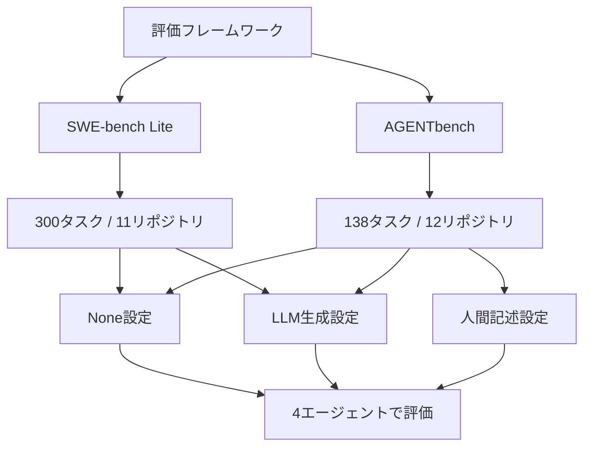

本記事は [Evaluating AGENTS.md: Are Repository-Level Context Files Helpful for Coding Agents?](https://arxiv.org/abs/2602.11988) の解説記事です。

## 論文概要（Abstract）

AGENTS.mdやCLAUDE.mdといったリポジトリレベルのコンテキストファイルは、コーディングエージェントをリポジトリに適応させる手段として広く普及している。しかし、その効果は厳密に検証されていなかった。本論文では、複数のエージェントとLLMを用いた横断評価により、コンテキストファイルがタスク成功率を低下させ、推論コストを20%以上増加させることを実証している。著者らは、人間が記述するコンテキストファイルは最小限の要件のみを含めるべきだと結論づけている。

この記事は [Zenn記事: Codex×AGENTS.md×MCPで大規模リポジトリのバグ修正精度を高める実装ガイド](https://zenn.dev/0h_n0/articles/ff39679e7b4b27) の深掘りです。

## 情報源

- **arXiv ID**: 2602.11988
- **URL**: [https://arxiv.org/abs/2602.11988](https://arxiv.org/abs/2602.11988)
- **著者**: Thibaud Gloaguen, Niels Mundler, Mark Muller, Veselin Raychev, Martin Vechev（ETH Zurich）
- **発表年**: 2026
- **分野**: cs.SE（ソフトウェア工学）, cs.AI（人工知能）
- **ライセンス**: CC BY 4.0

## 背景と動機（Background & Motivation）

2025年後半から2026年にかけて、Codex、Claude Code、Qwen Codeといったコーディングエージェントの実用化が急速に進んだ。これに伴い、各エージェントの開発元は「リポジトリにコンテキストファイルを配置すること」を推奨するようになった。OpenAIはAGENTS.md、AnthropicはCLAUDE.md、GitHubはcopilot-instructions.mdと、それぞれ独自のフォーマットを提供している。

これらのファイルには、リポジトリのアーキテクチャ概要、ビルドコマンド、コーディング規約、テスト方針といった情報を記述し、エージェントがリポジトリの文脈を理解した上でタスクに取り組めるようにする意図がある。しかし、この慣行が実際にタスク完了率の向上に寄与するのか、あるいは単にコストを増大させるだけなのかについて、厳密な実証研究は存在しなかった。

先行研究であるLulla et al.（arXiv: 2601.20404）は、AGENTS.mdの存在がランタイムを28.64%短縮し、出力トークン消費を16.58%削減すると報告していた。しかし、この研究は効率性（実行時間・トークン量）に焦点を当てており、タスク成功率への影響は十分に分析されていなかった。本論文は、タスク成功率という最も重要な指標に正面から取り組んだ初の大規模実証研究である。

## 主要な貢献（Key Contributions）

- **大規模横断評価**: 4つのコーディングエージェント（Claude Code、Codex GPT-5.2、Codex GPT-5.1 mini、Qwen Code）を、2つのベンチマーク（SWE-bench Lite、AGENTbench）上で体系的に評価した
- **新規ベンチマーク構築**: 開発者がコミットしたコンテキストファイルを含む12リポジトリ・138タスクからなるAGENTbenchを構築した。5,694のPull Requestから厳選されている
- **LLM生成 vs 人間記述の比較**: LLMが自動生成したコンテキストファイルと、開発者が手動で記述したファイルの効果を定量的に比較した
- **行動分析**: コンテキストファイルがエージェントのツール使用パターン、探索行動、推論トークン消費にどのような影響を与えるかを詳細に分析した
- **実践的提言**: 現在のエージェント開発元の推奨事項と実測結果のギャップを明示し、具体的な改善指針を提示した

## 技術的詳細（Technical Details）

### 実験設計

著者らは3つのコンテキスト設定（None / LLM生成 / 人間記述）と4つのエージェントの組み合わせで評価を行った。



**SWE-bench Lite**: 人気のあるPythonリポジトリ11個から抽出された300タスクで構成される。これらのリポジトリには開発者によるコンテキストファイルが存在しないため、None設定とLLM生成設定の2条件で評価が行われた。

**AGENTbench**: 著者らが新たに構築したベンチマークで、開発者がコミットしたコンテキストファイルを含む12のニッチなPythonリポジトリから138のユニークなタスクを収集した。タスクは5,694のPull Requestから厳選され、平均PR本文415.3語（範囲: 5-4,961語）、平均Issue記述211.6語（範囲: 96-500語）の規模を持つ。コードベースの平均ファイル数は3,337（範囲: 151-26,602）、コンテキストファイルの平均語数は641語・9.7セクションであった。

### 評価対象エージェントとモデル

| エージェント | ベースモデル | 特徴 |
|------------|------------|------|
| Claude Code | Sonnet 4.5 | Anthropic開発、CLAUDE.md形式 |
| Codex | GPT-5.2 | OpenAI開発、AGENTS.md形式 |
| Codex | GPT-5.1 mini | OpenAI開発、軽量モデル |
| Qwen Code | Qwen3-30b-coder | Alibaba開発、AGENTS.md形式 |

### コンテキストファイル生成方法

LLM生成コンテキストファイルは、各エージェント開発元が推奨する初期化手順に従って作成された。例えばClaude Codeの場合は`claude`コマンドでCLAUDE.mdを自動生成し、Codexの場合は`codex --init`でAGENTS.mdを生成する。著者らはさらに、Codex用プロンプトでClaude Codeのファイルを生成するクロスプロンプト実験も実施し、プロンプトの影響を分離した。

### 評価指標

タスク成功率は、エージェントが生成したパッチが対象リポジトリの既存テストスイートをすべて通過するかどうかで判定された。副次的指標として、総ステップ数、推論コスト（ドル換算）、最初のファイル操作までのステップ数、ツール呼び出し頻度が測定された。

## 実装のポイント（Implementation）

### 効果的なコンテキストファイルの特徴

論文の分析から、効果的なコンテキストファイルとそうでないものの特徴が浮かび上がる。

**効果的な記述（人間記述で成功率が向上したケース）**:

```markdown
# 最小限の要件記述の例
## ビルド・テスト
- `uv run pytest tests/` でテスト実行
- テスト追加時は tests/ 配下に配置

## 必須ルール
- 型ヒント必須（mypy strict）
- public API変更時は CHANGELOG.md を更新
```

**逆効果な記述（LLM生成で成功率が低下したケース）**:

```markdown
# 過剰な記述の例
## プロジェクト概要
このプロジェクトは...（500語のアーキテクチャ説明）

## ディレクトリ構成
src/
├── models/     # データモデル定義
├── services/   # ビジネスロジック
...（詳細なツリー構造）

## コーディング規約
- 変数名はキャメルケース
- 関数は50行以内
- コメントは英語で記述
...（20項目以上の規約リスト）
```

著者らの分析によると、LLM生成ファイルの95-100%がコードベース概要を含んでいたのに対し、人間記述ファイルでは12個中8個のみが概要を含んでいた。コードベース概要はファイル発見速度の向上に寄与しなかった。

### ドキュメント冗長性の問題

興味深い発見として、既存ドキュメント（.mdファイル、examplesディレクトリ、docsディレクトリ）を除去した環境では、LLM生成コンテキストファイルの成功率が平均2.7%向上した。これは、LLM生成ファイルがリポジトリ内の既存ドキュメントと重複する情報を含んでおり、ドキュメントが充実したリポジトリでは冗長なノイズとなっていることを示唆している。

## 実験結果（Results）

### タスク成功率

論文のTable 2およびFigure 3に基づく主要な結果を以下に示す。

| ベンチマーク | コンテキスト設定 | 成功率変化 | 備考 |
|------------|----------------|-----------|------|
| SWE-bench Lite | LLM生成 | **-0.5%**（平均） | 4エージェント平均 |
| AGENTbench | LLM生成 | **-2.0%**（平均） | 4エージェント平均 |
| AGENTbench | 人間記述 | **+4.0%**（平均） | ただしコスト増を伴う |

著者らは、8つの設定（4エージェント x 2ベンチマーク）のうち5つで、LLM自動生成AGENTS.mdがタスク成功率を悪化させたと報告している（論文Figure 3より）。

### 推論コストとステップ数

| エージェント | 設定 | 平均ステップ数 | 平均コスト |
|------------|------|-------------|-----------|
| Claude Code (Sonnet 4.5) | None | 54.4 | $1.30 |
| Claude Code (Sonnet 4.5) | LLM生成 | 57.2 | $1.51 (+16%) |
| Codex (GPT-5.2) | None | 12.5 | $0.32 |
| Codex (GPT-5.2) | LLM生成 | 12.7 | $0.43 (+34%) |

SWE-bench Liteでは平均20%、AGENTbenchでは平均23%のコスト増加が観測された。ステップ数は平均2.45-3.92ステップ増加した。

### エージェント行動の変化

コンテキストファイルの存在は、エージェントの行動パターンに顕著な変化をもたらした。

**ツール使用頻度の変化**（論文Figure 6より）:
- テスト実行呼び出し: **+27%** 増加
- ファイル検索: **+22%** 増加
- ファイル読み取り: **+18%** 増加
- リポジトリ固有ツール: コンテキストファイルで言及された場合、使用頻度が**16-50倍**に増加

**推論トークンの増加**（論文Figure 7より）:
- LLM生成コンテキスト: 推論トークンが**14-22%**増加
- 人間記述コンテキスト: 推論トークンが**2-20%**増加

著者らは、コンテキストファイルに記載されたツールをエージェントが確実に使用する傾向（instruction-following）を確認している。例えば、コンテキストファイルでリポジトリ固有ツールが言及された場合、インスタンスあたり平均2.5回使用されたのに対し、言及がない場合は0.05回未満であった。

### 人間記述 vs LLM生成の詳細比較

人間記述ファイルはLLM生成ファイルを全4エージェントで上回ったが、その差は限定的であった。

- Claude Code: 人間記述ファイルによる改善なし
- GPT-5.2、GPT-5.1 mini、Qwen3-30b: 人間記述ファイルがLLM生成に対して2-5%の改善

クロスプロンプト実験（Codex用プロンプトでClaude Code向けファイルを生成、またはその逆）では、プロンプトの種類による一貫した差は見られなかった。

## 実運用への応用（Practical Applications）

### Zenn記事との関連

[Zenn記事「Codex×AGENTS.md×MCPで大規模リポジトリのバグ修正精度を高める実装ガイド」](https://zenn.dev/0h_n0/articles/ff39679e7b4b27)では、AGENTS.mdとMCPサーバーの併用によるバグ修正精度の向上が議論されている。本論文の知見は、この実装ガイドに重要な補足を提供する。

### 2601.20404との矛盾の解消

Lulla et al.（arXiv: 2601.20404）はAGENTS.mdがランタイムを28.64%短縮すると報告しており、一見すると本論文（2602.11988）と矛盾するように見える。しかし、両者は異なる指標を測定している。

| 研究 | 主要指標 | 結果 |
|------|---------|------|
| Lulla et al. (2601.20404) | 実行時間・トークン消費量 | 改善（-28.64%ランタイム） |
| Gloaguen et al. (2602.11988) | タスク成功率 | 悪化（-0.5%〜-2.0%） |

つまり、コンテキストファイルはエージェントの「効率」を改善する可能性がある一方で、「正確性」を犠牲にしている可能性がある。実運用においては、速度よりもタスク完了の正確性が重視されるケースが多いため、本論文の知見はより実践的な示唆を持つ。

### 実務への提言

本論文の知見を踏まえた実務での活用指針は以下の通りである。

1. **LLM自動生成のコンテキストファイルは使わない**: `codex --init`や`claude`による自動生成ファイルは、既存ドキュメントとの冗長性が高く、成功率を低下させる傾向がある
2. **人間記述は最小限に**: 記述する場合は、ビルドコマンド・テストコマンド・必須の制約条件のみに絞る
3. **コードベース概要は不要**: ディレクトリ構造やアーキテクチャの説明は、エージェントのファイル発見速度を向上させない
4. **ドキュメントが充実したリポジトリでは特に注意**: 既存ドキュメントとの重複がノイズになりやすい
5. **MCP連携を活用する方向へ**: コンテキストファイルに静的情報を詰め込むより、MCPサーバーで動的にツールを提供する方が効果的である可能性がある

## 関連研究（Related Work）

- **Lulla et al. (2026)**: 「On the Impact of AGENTS.md Files on the Efficiency of AI Coding Agents」（[arXiv: 2601.20404](https://arxiv.org/abs/2601.20404)）。10リポジトリ・124 PRで実行時間とトークン消費量を分析。AGENTS.mdの存在がランタイムを28.64%短縮し、出力トークンを16.58%削減すると報告。ただしタスク成功率は分析していない。JAWs@ICSE 2026に採択されている

- **Galster et al. (2026)**: 「Configuring Agentic AI Coding Tools: An Exploratory Study」（[arXiv: 2602.14690](https://arxiv.org/abs/2602.14690)）。Claude Code、GitHub Copilot、Cursor、Gemini、Codexの構成メカニズムを体系的に分析。2,926のGitHubリポジトリを調査し、コンテキストファイル、スキル、サブエージェント、MCPサーバーなど8つの構成メカニズムを特定した

- **Jimenez et al. (2024)**: 「SWE-bench: Can Language Models Resolve Real-World GitHub Issues?」。本論文の主要ベンチマークの基盤となったSWE-benchの原論文。実世界のGitHub Issueを用いたコーディングエージェント評価の標準的フレームワークを確立した

- **Chatlatanagulchai et al. (2025)**: コンテキストファイルの内容を体系的に分類した先行研究。本論文はこの分類を参考に、コンテキストファイルの構成要素（コードベース概要、ビルド手順、コーディング規約など）ごとの効果を分析している

## まとめと今後の展望

本論文は、AGENTS.md等のコンテキストファイルの効果について「効率改善vs成功率低下」という重要なトレードオフを実証した。LLM自動生成ファイルは8設定中5設定で成功率を悪化させ、推論コストを20%以上増加させた。人間記述ファイルは若干の改善を示したが、そのコスト対効果は限定的であった。

著者らは「エージェント開発元の推奨事項と実測結果の間に具体的なギャップが存在する」と指摘しており、今後はコンテキストファイルの原則的な生成手法の研究が求められる。コンテキストファイルの最適な記述粒度、動的コンテキスト注入（MCPなど）との比較、タスク種別ごとの効果分析が今後の研究課題として挙げられる。

## 参考文献

- **arXiv**: [https://arxiv.org/abs/2602.11988](https://arxiv.org/abs/2602.11988)
- **Related Work (Lulla et al.)**: [https://arxiv.org/abs/2601.20404](https://arxiv.org/abs/2601.20404)
- **Related Work (Galster et al.)**: [https://arxiv.org/abs/2602.14690](https://arxiv.org/abs/2602.14690)
- **Related Zenn article**: [https://zenn.dev/0h_n0/articles/ff39679e7b4b27](https://zenn.dev/0h_n0/articles/ff39679e7b4b27)
