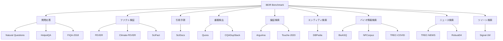

## 論文概要（Abstract）

本記事は [BEIR: A Heterogeneous Benchmark for Zero-shot Evaluation of Information Retrieval Models](https://arxiv.org/abs/2104.08663)（NeurIPS 2021 Dataset and Benchmark Track）の解説記事です。

著者らは、既存のニューラル情報検索（IR）モデルが均質で限定的な実験設定でのみ評価されてきたことを問題視し、**18の公開データセット**を用いた異種ベンチマーク「BEIR（Benchmarking-IR）」を提案しています。9つの異なるタスク領域にまたがるデータセットで**10のSOTA検索モデル**をゼロショット（学習データなし）で評価した結果、BM25がドメイン横断で堅牢なベースラインであること、Re-rankingとlate-interactionモデルがゼロショットで最高精度を達成する一方で計算コストが高いこと、Dense/Sparse Retrievalは効率的だが汎化に大きな課題があることを明らかにしました。

この記事は [Zenn記事: BM25×ベクトル検索のハイブリッド検索をPythonで実装する](https://zenn.dev/0h_n0/articles/20dde6d2d10b46) の深掘りです。Zenn記事内でBEIRベンチマークが直接参照されており、ハイブリッド検索の設計判断を裏付ける1次情報として本論文を詳細に解説します。

## 情報源

- **会議名**: NeurIPS 2021（Neural Information Processing Systems）Dataset and Benchmark Track
- **年**: 2021
- **URL**: [https://arxiv.org/abs/2104.08663](https://arxiv.org/abs/2104.08663)
- **著者**: Nandan Thakur, Nils Reimers, Andreas Rücklé, Abhishek Srivastava, Iryna Gurevych
- **arXiv ID**: 2104.08663
- **GitHub**: [https://github.com/beir-cellar/beir](https://github.com/beir-cellar/beir)

## カンファレンス情報

**NeurIPS（Neural Information Processing Systems）について**:
NeurIPSは機械学習・人工知能分野における最高峰の国際会議の1つです。2021年のNeurIPSでは、メイントラックに加えて**Dataset and Benchmark Track**が設けられ、高品質なデータセットやベンチマークの貢献を独立して評価する仕組みが整備されました。BEIR論文はこのトラックに採択されており、情報検索分野の標準評価基盤としての重要性が認められた形です。

## 背景と動機

2020年代初頭、ニューラル情報検索の研究はMS-MARCOなどの大規模データセットを中心に急速に進展していました。しかし、著者らは以下の構造的な問題を指摘しています。

**第一に、in-domain評価への偏り**です。多くの研究がMS-MARCOでfine-tuningしたモデルをMS-MARCOのテストセットで評価しており、同一分布内での性能しか測れていませんでした。

**第二に、タスクの多様性の欠如**です。情報検索にはファクト検証、質問応答、引用予測、重複検出など多様なタスクが存在しますが、単一データセットでの評価ではこれらの違いを捉えられません。

**第三に、ドメイン横断の汎化能力が不明**です。生物医学文献（BioASQ）、金融QA（FiQA）、科学論文（SciFact）など、異なる専門分野への汎化能力は、MS-MARCOの評価だけでは判定できません。

BEIRはこれらの問題に対処するため、「訓練データを使わないゼロショット評価」を統一プロトコルとして定義し、モデルの真の汎化能力を横断的に測定可能にしました。

## 主要な貢献

1. **18の異種データセットによるベンチマーク**: 9つのタスク領域（ファクト検証、質問応答、引用予測、重複検出等）を網羅する統一評価フレームワークを構築
2. **10のSOTA検索モデルのゼロショット評価**: Lexical（BM25）、Sparse（DocT5query, DeepCT, SPARTA）、Dense（DPR, ANCE, TAS-B, GenQ）、Late-interaction（ColBERT）、Re-ranking（CE）の5カテゴリを横断的に比較
3. **BM25の堅牢性とDense Retrievalの汎化課題の定量的実証**: Dense retrieverがin-domain（MS-MARCO）では高性能だが、ゼロショットではBM25を下回るケースが多いことを実験的に示した
4. **オープンソース評価フレームワーク**: `pip install beir` でインストール可能な再現性の高い評価基盤を公開

## 技術的詳細（Technical Details）

### 18データセットの分類

著者らは18のデータセットを9つのタスク領域に分類しています。



各データセットのコーパスサイズはNFCorpusの約3,600文書からMS-MARCOの約880万文書まで幅広く、クエリ数も300〜10,000以上と多様です。この異種性こそがBEIRの設計意図であり、特定のデータ分布に過適合したモデルを識別できるようになっています。

### 10モデルの分類

評価対象の10モデルは、検索アーキテクチャの観点から以下の5カテゴリに整理されます。

| カテゴリ | モデル | 特徴 |
|---------|--------|------|
| **Lexical** | BM25 | TF-IDF系、学習不要 |
| **Sparse** | DocT5query, DeepCT, SPARTA | ニューラル拡張付きスパース検索 |
| **Dense** | DPR, ANCE, TAS-B, GenQ | Bi-encoderベース密ベクトル検索 |
| **Late-interaction** | ColBERT | トークンレベルのマッチング |
| **Re-ranking** | Cross-Encoder (CE) | BM25上位候補をCross-Encoderで再ランク |

### 評価プロトコル

BEIRではすべてのモデルを**ゼロショット**で評価します。つまり、各データセットの訓練分割は使用せず、MS-MARCOで訓練済みの重みをそのまま適用します。BM25は学習不要のため、元々ゼロショットモデルです。

主要評価指標は**NDCG@10**（Normalized Discounted Cumulative Gain at 10）です。

$$
\text{NDCG@}k = \frac{\text{DCG@}k}{\text{IDCG@}k}
$$

ここで DCG@k は以下のように定義されます。

$$
\text{DCG@}k = \sum_{i=1}^{k} \frac{2^{rel_i} - 1}{\log_2(i + 1)}
$$

$rel_i$ は $i$ 番目の検索結果の関連度ラベル（通常0-3の段階的評価）、IDCG@k は理想的な順序で並べた場合のDCG@k です。NDCG@10は上位10件の検索結果の質を0〜1の範囲で定量化し、段階的関連度を適切に評価できる指標です。

補助指標として**Recall@100**も使用されます。これはRe-rankingパイプラインにおいて、第1段階の検索（retrieval）が十分な候補を取得できているかを測る指標です。

## 実装のポイント

### BEIRフレームワークの基本的な使い方

BEIRはPythonパッケージとして提供されており、数行のコードでベンチマーク評価を実行できます。

```python
from beir import util
from beir.datasets.data_loader import GenericDataLoader
from beir.retrieval.evaluation import EvaluateRetrieval
from beir.retrieval.search.lexical import BM25Search

# データセットのダウンロードとロード
dataset = "scifact"
url = f"https://public.ukp.informatik.tu-darmstadt.de/thakur/BEIR/datasets/{dataset}.zip"
data_path = util.download_and_unzip(url, "datasets")
corpus, queries, qrels = GenericDataLoader(data_path).load(split="test")

# BM25で検索を実行
model = BM25Search(index_name=dataset, hostname="localhost")
retriever = EvaluateRetrieval(model)
results = retriever.retrieve(corpus, queries)

# NDCG@10, Recall@100 等を計算
metrics = retriever.evaluate(qrels, results, [1, 3, 5, 10, 100])
print(f"NDCG@10: {metrics['NDCG@10']:.4f}")
```

### 自分のモデルでBEIR評価を実行する手順

1. **データセット選択**: 目的に応じて評価対象を絞る（例: RAGシステムならNQ, HotpotQA, FiQA, SciFact）
2. **モデルラッパー実装**: `beir.retrieval.models`のインターフェースに合わせてエンコード関数を実装
3. **評価実行**: `EvaluateRetrieval`クラスでNDCG@10を算出
4. **BM25との比較**: ベースラインとしてBM25のスコアを必ず測定し、差分を報告

### データセット選択のガイドライン

- **RAGシステムの評価**: NQ, HotpotQA, FiQA, SciFact（多様なQAタスク）
- **バイオ医学ドメイン**: BioASQ, TREC-COVID, NFCorpus
- **汎用検索エンジン**: MS-MARCO, DBPedia, Robust04
- **ファクトチェック**: FEVER, Climate-FEVER, SciFact

## Production Deployment Guide

### AWS実装パターン（BEIR評価パイプライン）

BEIRフレームワークを用いた検索モデルの評価パイプラインをAWSにデプロイする構成を示します。ユースケースは「新規検索モデルの品質評価を定期的・自動的に実行し、NDCG@10の推移を監視する」ことです。

| 規模 | 評価頻度 | 推奨構成 | 月額コスト目安 | 主要サービス |
|------|---------|---------|-------------|------------|
| **Small** | 週1回・数データセット | Serverless | $50-150 | Lambda + S3 + SageMaker Processing Job |
| **Medium** | 日次・全データセット | Hybrid | $300-800 | ECS Fargate + S3 + SageMaker Endpoint |
| **Large** | 随時・複数モデル比較 | Container | $2,000-5,000 | EKS + S3 + SageMaker Multi-Model Endpoint |

**Small構成の詳細**（月額$50-150）:
- **Lambda**: BEIR評価ジョブのトリガーとオーケストレーション ($5/月)
- **S3**: 18データセットの格納・キャッシュ（約10GB、$3/月）
- **SageMaker Processing Job**: GPU評価の実行（ml.g5.xlarge、週1回2時間で$30-80/月）
- **CloudWatch**: 評価結果の記録・アラート ($5/月)
- **EventBridge**: 定期実行スケジュール ($1/月未満)

**Medium構成の詳細**（月額$300-800）:
- **ECS Fargate**: 評価ワーカーの常駐実行（2vCPU, 8GB RAM、$150/月）
- **S3**: データセット格納 ($3/月)
- **SageMaker Endpoint**: モデル推論用エンドポイント（ml.g5.xlarge、$200-500/月）
- **DynamoDB**: 評価結果のメタデータ管理 ($5/月)
- **CloudWatch + SNS**: 監視・通知 ($10/月)

**Large構成の詳細**（月額$2,000-5,000）:
- **EKS**: 評価ワーカークラスタ（3-5ノード、$500-1,000/月）
- **S3**: データセット + モデルアーティファクト格納 ($10/月)
- **SageMaker Multi-Model Endpoint**: 複数モデルの同時評価（ml.g5.2xlarge x 2、$1,500-3,500/月）
- **RDS PostgreSQL**: 評価結果の永続化・クエリ ($100/月)
- **Grafana on ECS**: ダッシュボード ($50/月)

**コスト試算の注意事項**: 上記は2026年6月時点のAWS ap-northeast-1（東京）リージョン料金に基づく概算値です。実際のコストはモデルサイズや評価頻度により変動します。最新料金は [AWS料金計算ツール](https://calculator.aws/) で確認してください。

### Terraformインフラコード

**Small構成 (Serverless): Lambda + S3 + SageMaker Processing Job**

```hcl
module "vpc" {
  source  = "terraform-aws-modules/vpc/aws"
  version = "~> 5.0"

  name = "beir-eval-vpc"
  cidr = "10.0.0.0/16"
  azs  = ["ap-northeast-1a", "ap-northeast-1c"]
  private_subnets = ["10.0.1.0/24", "10.0.2.0/24"]

  enable_nat_gateway   = true
  single_nat_gateway   = true
  enable_dns_hostnames = true
}

resource "aws_s3_bucket" "beir_datasets" {
  bucket = "beir-eval-datasets-${data.aws_caller_identity.current.account_id}"
}

resource "aws_s3_bucket_versioning" "beir_datasets" {
  bucket = aws_s3_bucket.beir_datasets.id
  versioning_configuration {
    status = "Enabled"
  }
}

resource "aws_iam_role" "lambda_beir" {
  name = "lambda-beir-eval-role"

  assume_role_policy = jsonencode({
    Version = "2012-10-17"
    Statement = [{
      Action    = "sts:AssumeRole"
      Effect    = "Allow"
      Principal = { Service = "lambda.amazonaws.com" }
    }]
  })
}

resource "aws_iam_role_policy" "beir_eval_policy" {
  role = aws_iam_role.lambda_beir.id

  policy = jsonencode({
    Version = "2012-10-17"
    Statement = [
      {
        Effect   = "Allow"
        Action   = ["s3:GetObject", "s3:PutObject", "s3:ListBucket"]
        Resource = [
          aws_s3_bucket.beir_datasets.arn,
          "${aws_s3_bucket.beir_datasets.arn}/*"
        ]
      },
      {
        Effect   = "Allow"
        Action   = ["sagemaker:CreateProcessingJob", "sagemaker:DescribeProcessingJob"]
        Resource = "arn:aws:sagemaker:ap-northeast-1:*:processing-job/beir-eval-*"
      },
      {
        Effect   = "Allow"
        Action   = ["iam:PassRole"]
        Resource = aws_iam_role.sagemaker_beir.arn
      }
    ]
  })
}

resource "aws_iam_role" "sagemaker_beir" {
  name = "sagemaker-beir-eval-role"

  assume_role_policy = jsonencode({
    Version = "2012-10-17"
    Statement = [{
      Action    = "sts:AssumeRole"
      Effect    = "Allow"
      Principal = { Service = "sagemaker.amazonaws.com" }
    }]
  })
}

resource "aws_lambda_function" "beir_trigger" {
  filename      = "lambda.zip"
  function_name = "beir-eval-trigger"
  role          = aws_iam_role.lambda_beir.arn
  handler       = "index.handler"
  runtime       = "python3.12"
  timeout       = 300
  memory_size   = 512

  environment {
    variables = {
      DATASETS_BUCKET    = aws_s3_bucket.beir_datasets.id
      SAGEMAKER_ROLE_ARN = aws_iam_role.sagemaker_beir.arn
      EVAL_DATASETS      = "scifact,nq,fiqa,hotpotqa"
      EVAL_METRICS       = "ndcg@10,recall@100"
    }
  }
}

resource "aws_scheduler_schedule" "weekly_eval" {
  name = "beir-weekly-eval"

  flexible_time_window {
    mode = "OFF"
  }

  schedule_expression = "cron(0 3 ? * SUN *)"

  target {
    arn      = aws_lambda_function.beir_trigger.arn
    role_arn = aws_iam_role.lambda_beir.arn
  }
}

resource "aws_cloudwatch_metric_alarm" "eval_job_failure" {
  alarm_name          = "beir-eval-job-failure"
  comparison_operator = "GreaterThanThreshold"
  evaluation_periods  = 1
  metric_name         = "Errors"
  namespace           = "AWS/Lambda"
  period              = 86400
  statistic           = "Sum"
  threshold           = 0
  alarm_description   = "BEIR評価ジョブの失敗を検知"

  dimensions = {
    FunctionName = aws_lambda_function.beir_trigger.function_name
  }
}

data "aws_caller_identity" "current" {}
```

**Large構成 (Container): EKS + S3 + SageMaker Multi-Model Endpoint**

```hcl
module "vpc" {
  source  = "terraform-aws-modules/vpc/aws"
  version = "~> 5.0"

  name = "beir-eval-large-vpc"
  cidr = "10.0.0.0/16"
  azs  = ["ap-northeast-1a", "ap-northeast-1c", "ap-northeast-1d"]
  private_subnets = ["10.0.1.0/24", "10.0.2.0/24", "10.0.3.0/24"]
  public_subnets  = ["10.0.101.0/24", "10.0.102.0/24", "10.0.103.0/24"]

  enable_nat_gateway   = true
  single_nat_gateway   = true
  enable_dns_hostnames = true
}

module "eks" {
  source  = "terraform-aws-modules/eks/aws"
  version = "~> 20.0"

  cluster_name    = "beir-eval-cluster"
  cluster_version = "1.30"
  vpc_id          = module.vpc.vpc_id
  subnet_ids      = module.vpc.private_subnets

  eks_managed_node_groups = {
    workers = {
      instance_types = ["m6i.xlarge"]
      min_size       = 2
      max_size       = 5
      desired_size   = 3
    }
  }
}

resource "aws_s3_bucket" "beir_models" {
  bucket = "beir-eval-models-${data.aws_caller_identity.current.account_id}"
}

resource "aws_sagemaker_model" "multi_model" {
  name               = "beir-multi-model-endpoint"
  execution_role_arn = aws_iam_role.sagemaker_multi.arn

  container {
    image          = "763104351884.dkr.ecr.ap-northeast-1.amazonaws.com/pytorch-inference:2.1-gpu-py311-cu121-ubuntu22.04-sagemaker"
    mode           = "MultiModel"
    model_data_url = "s3://${aws_s3_bucket.beir_models.id}/models/"
  }
}

resource "aws_sagemaker_endpoint_configuration" "multi_model" {
  name = "beir-multi-model-config"

  production_variants {
    variant_name           = "primary"
    model_name             = aws_sagemaker_model.multi_model.name
    initial_instance_count = 2
    instance_type          = "ml.g5.2xlarge"
  }
}

resource "aws_sagemaker_endpoint" "multi_model" {
  name                 = "beir-multi-model-endpoint"
  endpoint_config_name = aws_sagemaker_endpoint_configuration.multi_model.name
}

resource "aws_iam_role" "sagemaker_multi" {
  name = "sagemaker-beir-multi-role"

  assume_role_policy = jsonencode({
    Version = "2012-10-17"
    Statement = [{
      Action    = "sts:AssumeRole"
      Effect    = "Allow"
      Principal = { Service = "sagemaker.amazonaws.com" }
    }]
  })
}

resource "aws_db_instance" "results_db" {
  identifier           = "beir-eval-results"
  engine               = "postgres"
  engine_version       = "16.3"
  instance_class       = "db.t4g.medium"
  allocated_storage    = 50
  db_name              = "beir_results"
  username             = "beir_admin"
  manage_master_user_password = true
  skip_final_snapshot  = false
  multi_az             = false
  vpc_security_group_ids = [aws_security_group.rds.id]
  db_subnet_group_name = aws_db_subnet_group.main.name
  storage_encrypted    = true
}

resource "aws_db_subnet_group" "main" {
  name       = "beir-eval-db-subnet"
  subnet_ids = module.vpc.private_subnets
}

resource "aws_security_group" "rds" {
  name_prefix = "beir-eval-rds-"
  vpc_id      = module.vpc.vpc_id

  ingress {
    from_port       = 5432
    to_port         = 5432
    protocol        = "tcp"
    security_groups = [module.eks.cluster_security_group_id]
  }
}

data "aws_caller_identity" "current" {}
```

### セキュリティベストプラクティス

- **S3**: データセットバケットはパブリックアクセス完全ブロック、VPCエンドポイント経由のみ
- **IAM**: 最小権限（SageMaker CreateProcessingJob + S3 Read/Write のみ）
- **Secrets Manager**: DB認証情報はハードコード禁止、`manage_master_user_password`を使用
- **暗号化**: S3 SSE-S3 + RDS保管時暗号化 + TLS 1.2以上の転送暗号化
- **ネットワーク**: SageMaker・RDSはプライベートサブネットに配置、パブリックアクセス禁止

### 運用・監視設定

```python
import boto3

cloudwatch = boto3.client("cloudwatch")

# BEIR評価ジョブの所要時間を監視
cloudwatch.put_metric_alarm(
    AlarmName="beir-eval-duration",
    ComparisonOperator="GreaterThanThreshold",
    EvaluationPeriods=1,
    MetricName="Duration",
    Namespace="AWS/Lambda",
    Period=86400,
    Statistic="Maximum",
    Threshold=280000,
    AlarmDescription="BEIR評価トリガーのタイムアウト接近を検知",
)

# SageMaker Processing Jobの失敗を監視
cloudwatch.put_metric_alarm(
    AlarmName="beir-sagemaker-job-failure",
    ComparisonOperator="GreaterThanThreshold",
    EvaluationPeriods=1,
    MetricName="ProcessingJobsFailed",
    Namespace="/aws/sagemaker/ProcessingJobs",
    Period=86400,
    Statistic="Sum",
    Threshold=0,
    AlarmDescription="SageMaker Processing Jobの失敗を検知",
)

# NDCG@10の回帰検知（カスタムメトリクス）
cloudwatch.put_metric_alarm(
    AlarmName="beir-ndcg-regression",
    ComparisonOperator="LessThanThreshold",
    EvaluationPeriods=2,
    MetricName="NDCG10_Average",
    Namespace="BEIR/Evaluation",
    Period=604800,
    Statistic="Average",
    Threshold=0.40,
    AlarmDescription="NDCG@10の平均値が閾値を下回り、モデル品質の回帰を検知",
)
```

### コスト最適化チェックリスト

- [ ] 週1回評価 → Lambda + SageMaker Processing Job（$50-150/月）
- [ ] 日次評価 → ECS Fargate + SageMaker Endpoint（$300-800/月）
- [ ] 随時評価 → EKS + SageMaker Multi-Model Endpoint（$2,000-5,000/月）
- [ ] SageMaker Processing Job: ジョブ完了後に自動停止（常駐コスト$0）
- [ ] S3 Intelligent-Tiering: アクセス頻度に応じた自動ストレージクラス変更
- [ ] SageMaker Spot Instances: 評価ジョブにスポットインスタンスを使用して最大90%削減
- [ ] データセットキャッシュ: S3からローカルにキャッシュし、重複ダウンロードを回避
- [ ] 評価対象の絞り込み: 18データセット全てではなくドメインに関連する4-6データセットに限定
- [ ] CloudWatch: Lambda Duration と SageMaker Job Status を監視
- [ ] AWS Budgets: 月額予算設定（80%/100%アラート）

## 実験結果（Results）

論文のメイン結果テーブル（Table 2相当）より、各モデルの18データセットにおけるNDCG@10の平均値を示します。

| モデル | カテゴリ | NDCG@10 平均 | 特徴 |
|--------|---------|-------------|------|
| BM25 | Lexical | 0.428 | 学習不要、堅牢なベースライン |
| DocT5query | Sparse | 0.441 | BM25 + ニューラル文書拡張 |
| DeepCT | Sparse | 0.378 | ニューラルterm weighting |
| DPR | Dense | 0.312 | MS-MARCOで訓練したBi-encoder |
| ANCE | Dense | 0.388 | Approximate Nearest Neighbor |
| TAS-B | Dense | 0.437 | Topic-Aware Sampling |
| GenQ | Dense | 0.399 | クエリ生成によるデータ拡張 |
| ColBERT | Late-interaction | 0.447 | トークンレベルの遅延相互作用 |
| CE (Cross-Encoder) | Re-ranking | **0.497** | BM25 + Cross-Encoder再ランク |

**主要な発見**（著者らの報告による）:

1. **BM25の堅牢性**: BM25はNDCG@10の平均0.428を達成し、DPR（0.312）やDeepCT（0.378）を大幅に上回りました。特にBioASQ（0.465 vs DPRの0.188）やSignal-1M（0.330 vs DPRの0.175）で差が顕著です

2. **Dense Retrieverの汎化課題**: DPRはMS-MARCOでのin-domain評価では高い性能を示しますが、ゼロショット評価ではBM25を下回るデータセットが過半数を占めました。著者らはこれを「dense modelの汎化能力に大きな改善余地がある」と結論づけています

3. **Re-ranking + Late-interactionの高精度**: Cross-Encoder Re-rankingが平均0.497で最高精度を達成しました。ColBERT（0.447）も良好な結果を示しています。ただし、Cross-EncoderはBM25の上位100件を再ランクするため、レイテンシが大きく実用上の制約があります

4. **TAS-Bの健闘**: Dense Retrieverの中ではTAS-B（0.437）がBM25に匹敵する性能を示し、効率的なBi-encoderでも適切な訓練戦略により汎化能力を向上できることを示唆しています

## 実運用への応用（Practical Applications）

BEIRの結果は、ハイブリッド検索システムのモデル選定に直接活用できます。

**RAGシステムのリトリーバー選定**: Zenn記事で解説されている「BM25 + ベクトル検索のハイブリッド検索」は、BEIRの結果が裏付ける設計判断です。BM25が堅牢なベースラインである一方、Dense Retrieverは特定ドメインで追加的な検索能力を提供するため、両者を組み合わせることでドメイン横断の汎化性能と特定ドメインの精度を両立できます。

**新規モデル導入の評価プロセス**: 新しいEmbeddingモデルやRetrieverを導入する際、MS-MARCOの数値だけで判断するのは危険です。BEIRの複数データセットで評価し、特に自社ドメインに近いデータセット（例: 法務なら引用予測のSciDocs、医療ならBioASQ）でBM25ベースラインと比較することが推奨されます。

**コスト対性能のトレードオフ**: Cross-Encoder Re-rankingが最高精度ですが、計算コストが高いです。実運用ではBM25 + Dense Retrieverのハイブリッドで第1段階検索を行い、上位N件のみにCross-Encoder Re-rankingを適用する2段階パイプラインが現実的な選択肢となります。

## 関連研究（Related Work）

- **MS-MARCO**: Microsoftが公開した大規模QAデータセット。BEIRの多くのモデルはMS-MARCOで訓練されているが、BEIRはMS-MARCOのin-domain評価の限界を補完する位置づけ
- **MTEB（Massive Text Embedding Benchmark）**: BEIRの後続として2022年に提案された、56データセットによるテキスト埋め込みモデルの包括的評価フレームワーク。BEIRの検索タスクに加え、分類・クラスタリング・意味類似度等を含む
- **KILT（Knowledge Intensive Language Tasks）**: ファクト検証・エンティティリンキング等のknowledge-intensiveタスクのベンチマーク。BEIRとは評価対象が部分的に重複するが、KILTはWikipediaベースの統一コーパスを使用する点が異なる

## まとめと今後の展望

BEIRは、情報検索モデルのゼロショット汎化能力を18データセットで体系的に評価するベンチマークとして、検索分野の研究と実務の両方に大きな影響を与えました。BM25の堅牢性、Dense Retrieverの汎化課題、Re-rankingの高精度と高コストというトレードオフは、2026年現在のRAGシステム設計においても依然として有効な知見です。

BEIRの公開以降、TAS-B、GTR、E5、BGEといった後続のDense Retrieverが汎化能力の改善に取り組んでおり、MTEBなどの拡張ベンチマークも登場しています。BEIRが提起した「ゼロショット汎化」という評価軸は、情報検索モデルの品質を測る標準的な視点として定着しています。

## 参考文献

- **arXiv**: [https://arxiv.org/abs/2104.08663](https://arxiv.org/abs/2104.08663)
- **GitHub**: [https://github.com/beir-cellar/beir](https://github.com/beir-cellar/beir)
- **NeurIPS 2021 Proceedings**: [https://proceedings.neurips.cc/paper/2021](https://proceedings.neurips.cc/paper/2021)
- **Related Zenn article**: [https://zenn.dev/0h_n0/articles/20dde6d2d10b46](https://zenn.dev/0h_n0/articles/20dde6d2d10b46)
