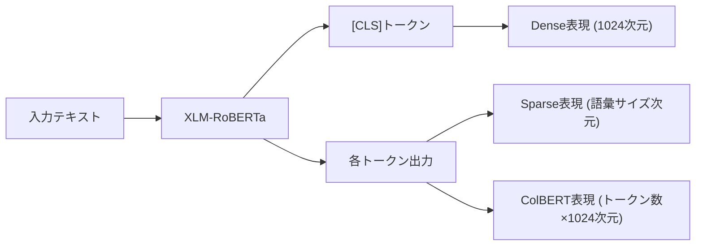
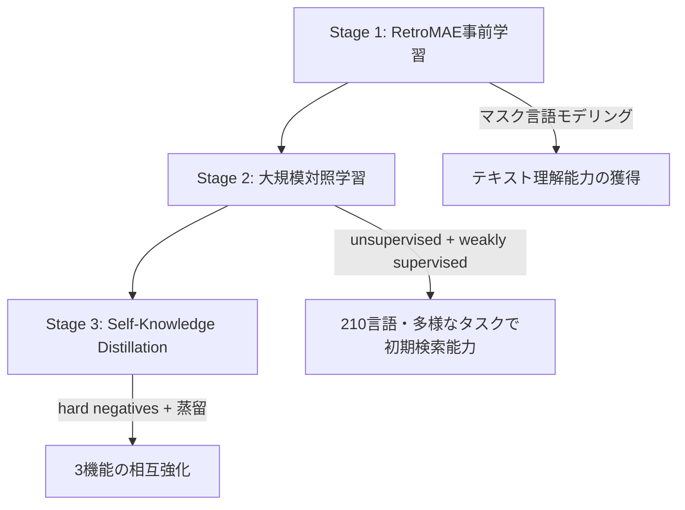

本記事は [M3-Embedding: Multi-Linguality, Multi-Functionality, Multi-Granularity Text Embeddings Through Self-Knowledge Distillation](https://arxiv.org/abs/2402.03216) の解説記事です。

## 論文概要（Abstract）

M3-Embedding（BGE-M3）は、1つのモデルからdense retrieval、sparse（lexical）retrieval、multi-vector（ColBERT）retrievalの3種類の検索表現を同時に生成する埋め込みモデルである。著者らはSelf-Knowledge Distillationという手法を提案し、3つの検索機能が互いに教師信号として機能することで、外部モデルへの依存なしに統合的な学習を実現している。100以上の言語に対応し、最大8192トークンの長文入力を処理できる。BEIR、MS-MARCO、MIRACLの各ベンチマークで当時の最先端性能を達成したと報告されている。

この記事は [Zenn記事: BM25×ベクトル検索のハイブリッド検索をPythonで実装する](https://zenn.dev/0h_n0/articles/20dde6d2d10b46) の深掘りです。

## 情報源

- **arXiv ID**: 2402.03216
- **URL**: [https://arxiv.org/abs/2402.03216](https://arxiv.org/abs/2402.03216)
- **著者**: Jianlv Chen, Shitao Xiao, Peitian Zhang et al.（BAAI / 中国科学技術大学）
- **発表年**: 2024（初版 February 2024、改訂 December 2025）
- **分野**: cs.CL（計算言語学）, cs.AI, cs.LG
- **ライセンス**: MIT

## 背景と動機（Background & Motivation）

情報検索においてdense retrieval（ベクトル類似度検索）とsparse retrieval（BM25に代表される語彙マッチング）はそれぞれ異なる強みを持つ。Dense retrievalは意味的類似性の捕捉に優れるが、固有名詞や専門用語の完全一致が求められる場面では精度が低下する。一方、sparse retrievalは語彙的な正確性に強いが、同義語や言い換えへの対応が困難である。

従来のハイブリッド検索システムでは、これらの異なるモデルを個別に訓練・管理する必要があり、インフラコストとメンテナンスの負担が大きかった。さらに、ColBERTのようなmulti-vector表現を加えた3種類の表現を統合する場合、モデル管理の複雑さは一層増大する。加えて、多くの既存モデルは英語中心に設計されており、100以上の言語をカバーする汎用的なembeddingモデルは不足していた。

M3-Embeddingは「Multi-Linguality（多言語）、Multi-Functionality（多機能）、Multi-Granularity（多粒度）」の3つのMを統合し、1つのモデルで複数の検索パラダイムをカバーするアプローチを提案している。

## 主要な貢献（Key Contributions）

- **3種類の検索表現の統合**: 1つのモデルからdense、sparse、multi-vector（ColBERT）の3種類の表現を同時に生成。モデル管理コストを大幅に削減する
- **Self-Knowledge Distillation**: 3つの検索機能の関連スコアを相互に教師信号として活用する学習手法を提案。外部の教師モデルを必要としない
- **100以上の言語への対応**: XLM-RoBERTaベースのアーキテクチャにより、100以上の言語での検索を単一モデルで実現
- **長文対応**: 最大8192トークンの入力に対応。従来の512トークン制限を大幅に拡張し、文書レベルの検索精度を向上

## 技術的詳細（Technical Details）

### 3種類の検索表現の生成

M3-Embeddingは、XLM-RoBERTa-largeをバックボーンとし、入力テキストから以下の3つの表現を同時に生成する。



**Dense表現**: `[CLS]`トークンの隠れ状態に正規化を適用して得られる固定長ベクトルである。

$$
\mathbf{e}_d = \text{normalize}(\mathbf{h}_{\text{[CLS]}}) \in \mathbb{R}^{1024}
$$

クエリ $q$ と文書 $d$ のdenseスコアは内積で計算される。

$$
s_{\text{dense}}(q, d) = \mathbf{e}_d^{(q)} \cdot \mathbf{e}_d^{(d)}
$$

**Sparse表現**: 各トークンの隠れ状態に線形層とReLU活性化を適用し、語彙空間上の重みを算出する。これはBM25のterm frequencyに相当する学習済みの語彙的重みである。

$$
w_t = \text{ReLU}(\mathbf{W}_{\text{lex}} \mathbf{h}_t + b_{\text{lex}})
$$

ここで $w_t$ はトークン $t$ のlexical weight、$\mathbf{W}_{\text{lex}} \in \mathbb{R}^{1 \times H}$ は線形変換の重み行列、$\mathbf{h}_t \in \mathbb{R}^{H}$ はトークン $t$ の隠れ状態である。同一トークンが複数回出現する場合は最大値を採用する。クエリと文書のsparseスコアは、共通トークンの重みの積の総和で計算される。

$$
s_{\text{sparse}}(q, d) = \sum_{t \in q \cap d} w_t^{(q)} \cdot w_t^{(d)}
$$

**Multi-vector（ColBERT）表現**: 各トークンの隠れ状態を正規化したベクトル列として保持する。late-interaction方式により、クエリの各トークンと文書の全トークンの最大類似度を集約する。

$$
s_{\text{colbert}}(q, d) = \frac{1}{|q|} \sum_{i=1}^{|q|} \max_{j \in \{1, \ldots, |d|\}} \mathbf{e}_i^{(q)} \cdot \mathbf{e}_j^{(d)}
$$

ここで $\mathbf{e}_i^{(q)}$ はクエリの $i$ 番目のトークンベクトル、$\mathbf{e}_j^{(d)}$ は文書の $j$ 番目のトークンベクトルである。

### ハイブリッドスコアの統合

3種類のスコアは重み付き線形結合で統合される。

$$
s_{\text{hybrid}}(q, d) = w_1 \cdot s_{\text{dense}}(q, d) + w_2 \cdot s_{\text{sparse}}(q, d) + w_3 \cdot s_{\text{colbert}}(q, d)
$$

著者らはデフォルトで $w_1 = w_2 = w_3 = 1$ を推奨しているが、タスクに応じた重みチューニングで精度が向上する場合がある。

### Self-Knowledge Distillation

M3-Embeddingの訓練における中核的な技術がSelf-Knowledge Distillationである。3つの検索機能それぞれが算出する関連スコアを統合し、各機能の教師信号として活用する。

具体的には、クエリ $q$ に対する文書 $d$ の統合スコアを教師分布とする。

$$
p(d \mid q) = \frac{\exp(s_{\text{hybrid}}(q, d) / \tau)}{\sum_{d' \in \mathcal{D}} \exp(s_{\text{hybrid}}(q, d') / \tau)}
$$

ここで $\tau$ は温度パラメータ、$\mathcal{D}$ はバッチ内の文書集合である。各検索機能の損失は、この教師分布とのKLダイバージェンスとInfoNCE損失の加重和で構成される。

$$
\mathcal{L}_{\text{func}} = \mathcal{L}_{\text{InfoNCE}} + \alpha \cdot \text{KL}(p \| q_{\text{func}})
$$

ここで $q_{\text{func}}$ は各検索機能（dense / sparse / colbert）が出力する分布、$\alpha$ は蒸留損失の重みである。全体の損失は3機能の損失の和となる。

$$
\mathcal{L}_{\text{total}} = \mathcal{L}_{\text{dense}} + \mathcal{L}_{\text{sparse}} + \mathcal{L}_{\text{colbert}}
$$

この手法により、精度の高い機能が低い機能を引き上げる効果がある。例えばdenseとcolbertのスコアが高い文書ペアに対して、sparse機能もそのペアを高く評価するように学習が進む。

### 訓練パイプライン

訓練は3段階で構成される。



**Stage 1（RetroMAE）**: XLM-RoBERTa-largeに対してRetroMAEによるマスク付き自己符号化器の事前学習を実施。テキスト表現の基盤能力を獲得する。

**Stage 2（大規模対照学習）**: 教師なし・弱教師ありデータを用いた大規模な対照学習。200以上の言語の多様なテキストペアを使用し、初期的な検索能力を獲得する。この段階ではバッチサイズの最適化が重要で、著者らはGPU間でバッチ内の負例を共有することで実効バッチサイズを拡大している。

**Stage 3（Self-Knowledge Distillation）**: ハードネガティブを含むファインチューニング。3つの検索機能が互いに教師信号として機能し、全体の精度を底上げする。

## 実装のポイント（Implementation）

### FlagEmbeddingライブラリの使用

BGE-M3はHuggingFace Hub（`BAAI/bge-m3`）で公開されており、`FlagEmbedding`ライブラリから容易に利用できる。

```python
from FlagEmbedding import BGEM3FlagModel

model = BGEM3FlagModel("BAAI/bge-m3", use_fp16=True)

# 3種類の表現を同時取得
sentences: list[str] = ["ハイブリッド検索の実装方法", "BM25とベクトル検索の統合"]
output: dict = model.encode(
    sentences,
    return_dense=True,
    return_sparse=True,
    return_colbert_vecs=True,
)

dense_vecs = output["dense_vecs"]       # shape: (2, 1024)
sparse_weights = output["lexical_weights"]  # list of dict[token_id -> weight]
colbert_vecs = output["colbert_vecs"]    # list of ndarray, shape: (seq_len, 1024)
```

### ベクトルDBへの格納パターン

**Qdrant**: denseベクトルをnamed vectorとして格納し、sparseベクトルは`SparseVector`として別途インデックスできる。

**Milvus**: denseベクトルは`FloatVector`フィールド、sparseベクトルは`SparseFloatVector`フィールドとしてコレクションに格納可能。Milvus 2.4以降ではハイブリッド検索をネイティブにサポートしている。

### メモリ効率の考慮

ColBERTベクトルはトークン数に比例してメモリを消費する。例えば、1文書が平均200トークンの場合、ColBERT表現は $200 \times 1024 \times 4\text{bytes} \approx 800\text{KB/文書}$ となる。100万文書では約800GBに達するため、プロダクション環境ではdense + sparseのハイブリッドに絞り、ColBERTはリランキング段階で使用する設計が現実的である。

## Production Deployment Guide

BGE-M3は公開モデルであり、FlagEmbeddingライブラリを通じてセルフホスティングが可能なため、AWS上でのプロダクションデプロイ構成を示す。

### AWS実装パターン（コスト最適化重視）

BGE-M3の推論はGPUを活用することでスループットが大幅に向上するため、トラフィック量に応じた構成を選択する。

| 構成 | トラフィック | サービス | 月額概算 |
|------|------------|---------|---------|
| Small | ~100 req/日 | Lambda + SageMaker Serverless Inference | $50-150 |
| Medium | ~1,000 req/日 | ECS Fargate + SageMaker Endpoint (ml.g5.xlarge) | $300-800 |
| Large | 10,000+ req/日 | EKS + GPU Spot Instances (g5.xlarge) | $2,000-5,000 |

**注意**: コスト試算は2026年6月時点のAWS ap-northeast-1（東京）リージョンの料金に基づく概算値です。実際のコストはトラフィックパターン、リージョン、バースト使用量により変動します。最新料金はAWS料金計算ツールで確認を推奨します。

**Small構成（~100 req/日）**: SageMaker Serverless Inferenceでモデルをホストし、API GatewayとLambdaで呼び出しを制御する。コールドスタートに5-15秒かかるが、低頻度アクセスでは許容範囲である。SageMaker Serverless（$30-80/月）+ Lambda（$5-10/月）+ DynamoDB結果キャッシュ（$5-10/月）+ API Gateway（$5/月）で構成する。

**Medium構成（~1,000 req/日）**: SageMaker Endpointに`ml.g5.xlarge`（NVIDIA A10G, 24GB VRAM）を常時起動し、ECS Fargateのアプリケーション層から呼び出す。SageMaker Endpoint（$200-400/月）+ ECS Fargate（$50-100/月）+ ElastiCache Redis（$30-60/月）+ ALB（$20-30/月）で構成する。

**Large構成（10,000+ req/日）**: EKS上にBGE-M3推論Podを展開し、Karpenterで`g5.xlarge` Spot Instancesを自動スケーリングする。Spot活用でオンデマンド比最大70%削減が見込める。EKS + Spot GPU（$1,200-3,000/月）+ OpenSearch Serverless（$500-1,000/月）+ ALB + NAT Gateway（$200-300/月）で構成する。

**コスト削減テクニック**:
- **Spot Instances活用**: g5.xlargeのSpot価格はオンデマンド比60-70%割引。中断耐性はリクエストのリトライで対応可能
- **FP16推論**: `use_fp16=True`でVRAM使用量を半減し、より小さいインスタンスで運用可能
- **バッチ推論**: 複数リクエストをバッチ化し、GPU利用効率を向上
- **結果キャッシュ**: 同一クエリの再計算を回避するDynamoDB/ElastiCacheキャッシュ

### Terraformインフラコード

**Small構成（Serverless）**:

```hcl
# --- Small構成: Lambda + SageMaker Serverless + DynamoDB ---

provider "aws" {
  region = "ap-northeast-1"
}

# IAMロール（最小権限）
resource "aws_iam_role" "lambda_role" {
  name = "bge-m3-lambda-role"

  assume_role_policy = jsonencode({
    Version = "2012-10-17"
    Statement = [{
      Action = "sts:AssumeRole"
      Effect = "Allow"
      Principal = { Service = "lambda.amazonaws.com" }
    }]
  })
}

resource "aws_iam_role_policy" "lambda_policy" {
  name = "bge-m3-lambda-policy"
  role = aws_iam_role.lambda_role.id

  policy = jsonencode({
    Version = "2012-10-17"
    Statement = [
      {
        Effect   = "Allow"
        Action   = ["sagemaker:InvokeEndpoint"]
        Resource = aws_sagemaker_endpoint.bge_m3.arn
      },
      {
        Effect   = "Allow"
        Action   = ["dynamodb:GetItem", "dynamodb:PutItem"]
        Resource = aws_dynamodb_table.embedding_cache.arn
      },
      {
        Effect   = "Allow"
        Action   = ["logs:CreateLogGroup", "logs:CreateLogStream", "logs:PutLogEvents"]
        Resource = "arn:aws:logs:*:*:*"
      }
    ]
  })
}

# DynamoDBキャッシュ（On-Demand、KMS暗号化）
resource "aws_dynamodb_table" "embedding_cache" {
  name         = "bge-m3-embedding-cache"
  billing_mode = "PAY_PER_REQUEST"
  hash_key     = "query_hash"

  attribute {
    name = "query_hash"
    type = "S"
  }

  ttl {
    attribute_name = "expires_at"
    enabled        = true
  }

  server_side_encryption {
    enabled = true  # AWS managed KMS
  }

  tags = {
    Project = "bge-m3-embedding"
    Env     = "production"
  }
}

# CloudWatchアラーム（コスト監視）
resource "aws_cloudwatch_metric_alarm" "lambda_errors" {
  alarm_name          = "bge-m3-lambda-errors"
  comparison_operator = "GreaterThanThreshold"
  evaluation_periods  = 2
  metric_name         = "Errors"
  namespace           = "AWS/Lambda"
  period              = 300
  statistic           = "Sum"
  threshold           = 5
  alarm_description   = "Lambda error rate exceeded threshold"

  dimensions = {
    FunctionName = "bge-m3-inference"
  }
}
```

**Large構成（EKS + Karpenter + GPU Spot）**:

```hcl
# --- Large構成: EKS + Karpenter + Spot GPU ---

module "eks" {
  source          = "terraform-aws-modules/eks/aws"
  version         = "~> 20.0"
  cluster_name    = "bge-m3-cluster"
  cluster_version = "1.31"

  vpc_id     = module.vpc.vpc_id
  subnet_ids = module.vpc.private_subnets

  cluster_endpoint_public_access = false  # プライベートアクセスのみ

  eks_managed_node_groups = {
    system = {
      instance_types = ["m6i.large"]
      min_size       = 2
      max_size       = 3
      desired_size   = 2
    }
  }

  tags = {
    Project = "bge-m3-embedding"
    Env     = "production"
  }
}

# Karpenter Provisioner（Spot優先、GPU）
resource "kubectl_manifest" "karpenter_provisioner" {
  yaml_body = yamlencode({
    apiVersion = "karpenter.sh/v1"
    kind       = "NodePool"
    metadata   = { name = "gpu-spot" }
    spec = {
      template = {
        spec = {
          requirements = [
            { key = "node.kubernetes.io/instance-type", operator = "In", values = ["g5.xlarge", "g5.2xlarge"] },
            { key = "karpenter.sh/capacity-type", operator = "In", values = ["spot", "on-demand"] },
            { key = "topology.kubernetes.io/zone", operator = "In", values = ["ap-northeast-1a", "ap-northeast-1c"] }
          ]
          nodeClassRef = { name = "default" }
        }
      }
      limits   = { cpu = "64", "nvidia.com/gpu" = "8" }
      disruption = {
        consolidationPolicy = "WhenEmptyOrUnderutilized"
        consolidateAfter    = "30s"
      }
    }
  })
}

# Secrets Manager（モデル設定）
resource "aws_secretsmanager_secret" "model_config" {
  name                    = "bge-m3/model-config"
  recovery_window_in_days = 7

  tags = {
    Project = "bge-m3-embedding"
  }
}

# AWS Budgets（予算アラート）
resource "aws_budgets_budget" "monthly" {
  name         = "bge-m3-monthly-budget"
  budget_type  = "COST"
  limit_amount = "5000"
  limit_unit   = "USD"
  time_unit    = "MONTHLY"

  notification {
    comparison_operator       = "GREATER_THAN"
    threshold                 = 80
    threshold_type            = "PERCENTAGE"
    notification_type         = "ACTUAL"
    subscriber_email_addresses = ["ops-team@example.com"]
  }
}
```

### 運用・監視設定

**CloudWatch Logs Insights クエリ**:

```
# 推論レイテンシ分析（P95, P99）
fields @timestamp, @message
| filter @message like /inference_latency/
| stats percentile(latency_ms, 95) as p95,
        percentile(latency_ms, 99) as p99,
        avg(latency_ms) as avg_latency
  by bin(1h)

# トークン数別コスト分析
fields @timestamp, token_count, latency_ms
| filter @message like /encode_request/
| stats sum(token_count) as total_tokens,
        count(*) as request_count
  by bin(1h)
```

**CloudWatchアラーム設定（Python）**:

```python
import boto3

cloudwatch = boto3.client("cloudwatch", region_name="ap-northeast-1")

def create_gpu_utilization_alarm(instance_id: str) -> None:
    """GPU利用率の異常検知アラームを作成する"""
    cloudwatch.put_metric_alarm(
        AlarmName=f"bge-m3-gpu-util-{instance_id}",
        MetricName="GPUUtilization",
        Namespace="CWAgent",
        Statistic="Average",
        Period=300,
        EvaluationPeriods=3,
        Threshold=90.0,
        ComparisonOperator="GreaterThanThreshold",
        AlarmDescription="GPU utilization exceeded 90% for 15 minutes",
        Dimensions=[{"Name": "InstanceId", "Value": instance_id}],
        AlarmActions=["arn:aws:sns:ap-northeast-1:ACCOUNT:bge-m3-alerts"],
    )
```

**X-Rayトレーシング設定（Python）**:

```python
from aws_xray_sdk.core import xray_recorder, patch_all

# boto3自動計装
patch_all()

@xray_recorder.capture("bge_m3_encode")
def encode_with_tracing(text: str, model: "BGEM3FlagModel") -> dict:
    """X-Rayトレース付きでエンコードを実行する"""
    subsegment = xray_recorder.current_subsegment()
    subsegment.put_annotation("model", "bge-m3")
    subsegment.put_metadata("input_length", len(text))

    result = model.encode([text], return_dense=True, return_sparse=True)

    subsegment.put_metadata("dense_dim", result["dense_vecs"].shape[1])
    return result
```

**Cost Explorer自動レポート（Python）**:

```python
import boto3
from datetime import datetime, timedelta

ce = boto3.client("ce", region_name="us-east-1")
sns = boto3.client("sns", region_name="ap-northeast-1")

def daily_cost_report() -> dict:
    """日次コストレポートを取得し、閾値超過時にSNS通知する"""
    end = datetime.utcnow().strftime("%Y-%m-%d")
    start = (datetime.utcnow() - timedelta(days=1)).strftime("%Y-%m-%d")

    response = ce.get_cost_and_usage(
        TimePeriod={"Start": start, "End": end},
        Granularity="DAILY",
        Metrics=["UnblendedCost"],
        Filter={
            "Tags": {
                "Key": "Project",
                "Values": ["bge-m3-embedding"],
            }
        },
    )

    cost = float(
        response["ResultsByTime"][0]["Total"]["UnblendedCost"]["Amount"]
    )
    if cost > 100.0:
        sns.publish(
            TopicArn="arn:aws:sns:ap-northeast-1:ACCOUNT:bge-m3-alerts",
            Subject="BGE-M3 Daily Cost Alert",
            Message=f"Daily cost: ${cost:.2f} (threshold: $100)",
        )
    return {"date": start, "cost_usd": cost}
```

### コスト最適化チェックリスト

**アーキテクチャ選択**:
- [ ] トラフィック量に応じた構成を選択（Small: Serverless / Medium: Hybrid / Large: Container）
- [ ] GPU要否を判断（バッチサイズ小ならCPU推論も検討、FP16で十分か確認）
- [ ] リージョンの料金差を比較（us-east-1は東京比約10-20%安価）

**リソース最適化**:
- [ ] EC2/EKS: g5.xlarge Spot Instancesを優先（オンデマンド比60-70%削減）
- [ ] Reserved Instances: 安定トラフィックには1年コミットで最大40%削減
- [ ] Savings Plans: コンピューティング全体で最大20%削減
- [ ] Lambda: メモリサイズを実測に基づき最適化（Power Tuning Tool活用）
- [ ] ECS/EKS: 夜間・週末のスケールダウン設定
- [ ] SageMaker: Auto Scalingポリシーの最小インスタンス数を最小化

**推論最適化**:
- [ ] FP16推論を有効化（`use_fp16=True`でVRAM半減、精度影響は無視できる水準）
- [ ] INT8量子化を検討（さらなるメモリ削減、ただし精度低下の検証が必要）
- [ ] バッチ推論でGPU利用効率を向上（バッチサイズ32-64を推奨）
- [ ] 結果キャッシュ（DynamoDB/ElastiCache）で再計算を回避
- [ ] ColBERTベクトルはリランキング段階のみに限定（ストレージコスト削減）

**監視・アラート**:
- [ ] AWS Budgets: 月額予算を設定し、80%到達時にアラート
- [ ] CloudWatch: GPU利用率・メモリ使用量・推論レイテンシのアラーム
- [ ] Cost Anomaly Detection: 異常コストの自動検知を有効化
- [ ] 日次コストレポート: Cost Explorer APIで自動取得、SNS通知

**リソース管理**:
- [ ] 未使用のSageMaker Endpointを定期削除
- [ ] タグ戦略: `Project=bge-m3-embedding`タグを全リソースに適用
- [ ] S3ライフサイクルポリシー: 古いモデルアーティファクトを自動アーカイブ
- [ ] 開発環境: 営業時間外は自動停止（EventBridge + Lambda）

## 実験結果（Results）

### BEIRベンチマーク

著者らはBEIRの18データセットでNDCG@10を評価している。論文Table 3より、BGE-M3のdense表現単独でBEIR平均NDCG@10が48.2を達成し、当時のdenseモデルの中で最高性能であった。さらに、dense + sparseのハイブリッド構成では49.5（+1.3pt）、dense + sparse + colbertの3方式統合では50.1（+1.9pt）に向上したと報告されている。

| 検索方式 | BEIR NDCG@10 | 備考 |
|---------|-------------|------|
| Dense単独 | 48.2 | [CLS]ベクトルのみ |
| Dense + Sparse | 49.5 | +1.3ptの改善 |
| Dense + Sparse + ColBERT | 50.1 | +1.9ptの改善 |

### MIRACL（多言語ベンチマーク）

MIRACLは18言語の情報検索ベンチマークである。論文Table 5より、BGE-M3は多言語検索においても既存モデルを上回る性能を示している。特にアラビア語、ベンガル語、フィンランド語といったリソースが限られた言語でも安定した検索精度を発揮している。著者らは、XLM-RoBERTaの多言語事前学習と大規模多言語対照学習データの組み合わせが、この汎用性に寄与していると分析している。

### MS-MARCO

MS-MARCO Passage Ranking（論文Table 4）においても、BGE-M3はMRR@10およびRecall@1000で既存のdenseモデルと同等以上の性能を達成したと報告されている。dense単独でもE5-mistral-7bに匹敵し、ハイブリッド構成ではさらに改善が見られた。

## 実運用への応用（Practical Applications）

### RAGパイプラインへの統合

Zenn記事「BM25×ベクトル検索のハイブリッド検索をPythonで実装する」で解説されているハイブリッド検索パイプラインに、BGE-M3を直接適用できる。従来はBM25エンジン（Elasticsearch等）とベクトル検索エンジン（Qdrant等）を別々に管理していたが、BGE-M3を使えば1回のエンコードでdenseとsparseの両方の表現が得られるため、インデックス構築とクエリ処理のパイプラインが簡素化される。

### 多言語検索

100以上の言語に対応しているため、Cross-lingual retrievalが実現できる。例えば日本語クエリで英語文書を検索する、あるいは多言語のFAQデータベースを単一モデルでカバーするといったユースケースに適している。

### Eコマース検索

商品検索では「iPhone 15 Pro Max ケース」のような固有名詞を含むクエリと「スマートフォン用保護アクセサリ」のような意味的クエリの両方に対応する必要がある。BGE-M3のハイブリッド表現は、sparse表現が商品名・型番の完全一致を担い、dense表現が意味的類似性を補完する構成を1モデルで実現する。

## 関連研究（Related Work）

- **SPLADE**: sparse表現の学習に特化したモデル。MLMヘッドを用いて語彙空間上の重みを学習する。M3-EmbeddingのSparse表現はSPLADEに着想を得ているが、dense・colbertとの統合学習により単独モデル以上の性能を実現している
- **E5-Mistral**: Mistral-7Bをバックボーンとしたdense embeddingモデル。BEIRで高い性能を示すが、sparse表現やmulti-vector表現には対応していない
- **GTE-Qwen2**: Qwen2ベースのembeddingモデル。多言語対応と長文対応を両立するが、M3-Embeddingのような3方式統合は提供していない
- **ColBERT v2**: late-interactionに基づくmulti-vector検索モデル。精度は高いがストレージコストが大きく、M3-Embeddingは必要に応じてColBERT表現のon/offを選択できる柔軟性を持つ

## まとめと今後の展望

M3-Embeddingは、1つのモデルでdense、sparse、multi-vectorの3種類の検索表現を統合的に生成するアプローチを確立した。Self-Knowledge Distillationによる相互学習は、外部教師モデルなしで各機能の精度を底上げする点で実用的である。100以上の言語への対応と8192トークンの長文処理能力は、グローバルなRAGシステムの構築に直接貢献する。

今後の研究方向として、著者らはより効率的なColBERT表現の圧縮、instruction-tuningとの統合、さらなる長文対応（16K+トークン）を挙げている。実務的には、BGE-M3のsparse表現がElasticsearchのBM25を完全に代替できるかどうかの検証が重要な課題である。

## 参考文献

- **arXiv**: [https://arxiv.org/abs/2402.03216](https://arxiv.org/abs/2402.03216)
- **Code**: [https://github.com/FlagOpen/FlagEmbedding](https://github.com/FlagOpen/FlagEmbedding)
- **HuggingFace Model**: [https://huggingface.co/BAAI/bge-m3](https://huggingface.co/BAAI/bge-m3)
- **Related Zenn article**: [https://zenn.dev/0h_n0/articles/20dde6d2d10b46](https://zenn.dev/0h_n0/articles/20dde6d2d10b46)
