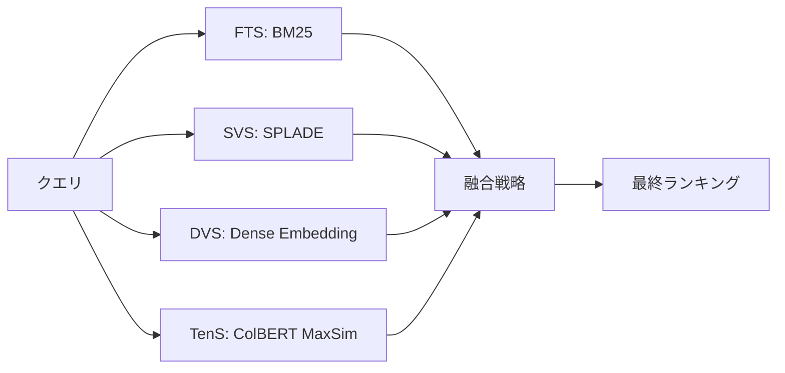
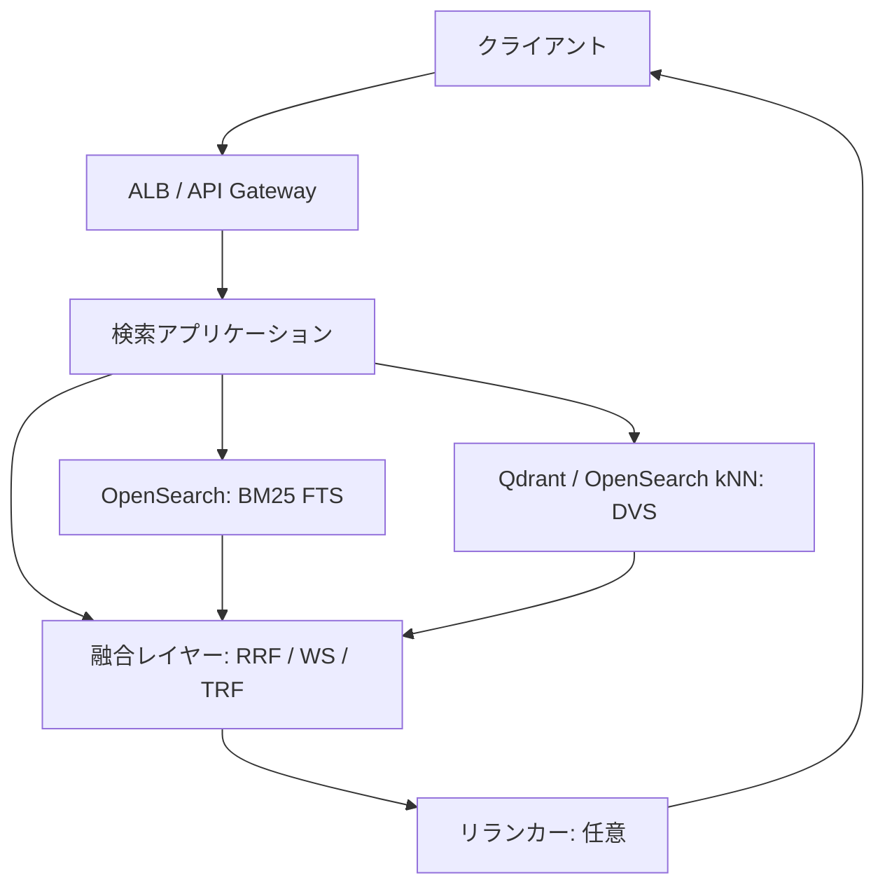
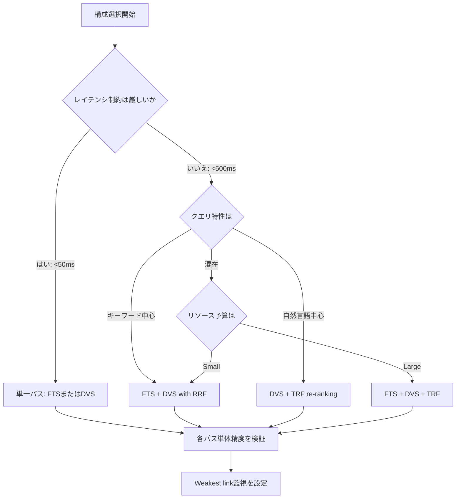

本記事は [Balancing the Blend: An Experimental Analysis of Trade-offs in Hybrid Search](https://arxiv.org/abs/2508.01405) の解説記事です。

## 論文概要（Abstract）

ハイブリッド検索は、RAGパイプラインや情報検索システムにおいて検索精度を向上させる手法として広く採用されている。しかし、複数の検索パスを組み合わせることで生じる効果とコストのトレードオフについて、体系的な分析は行われていなかった。本論文では、4つの検索パラダイム（Full-Text Search, Sparse Vector Search, Dense Vector Search, Tensor Search）のあらゆる組み合わせと3種類の融合戦略を、11の実世界データセット上で包括的に評価している。著者らは「Weakest link現象」「One-size-fits-allの不在」「Tensor-based Re-ranking Fusionの有効性」という3つの重要な知見を報告しており、実務におけるハイブリッド検索の設計指針を提示している。

この記事は [Zenn記事: BM25×ベクトル検索のハイブリッド検索をPythonで実装する](https://zenn.dev/0h_n0/articles/20dde6d2d10b46) の深掘りです。

## 情報源

- **arXiv ID**: 2508.01405
- **URL**: [https://arxiv.org/abs/2508.01405](https://arxiv.org/abs/2508.01405)
- **著者**: Mengzhao Wang, Boyu Tan, Yunjun Gao, Hai Jin, Yingfeng Zhang, Xiangyu Ke, Xiaoliang Xu, Yifan Zhu
- **発表年**: 2025（v1: 2025年8月2日、v2: 2025年11月3日改訂）
- **分野**: cs.DB（データベース）
- **DOI**: [10.48550/arXiv.2508.01405](https://doi.org/10.48550/arXiv.2508.01405)

## 背景と動機（Background & Motivation）

RAG（Retrieval-Augmented Generation）の普及に伴い、検索品質がLLMの回答精度を左右する重要な要素として認識されるようになった。従来のBM25による全文検索は語彙の不一致（vocabulary mismatch）問題を抱え、ベクトル検索は正確なキーワードマッチで劣る。この相互補完的な特性から、両者を組み合わせるハイブリッド検索が実務の標準構成となりつつある。

しかし、ハイブリッド検索の設計には多くの選択肢が存在する。どの検索パラダイムを組み合わせるか、どの融合戦略を用いるか、各パスの候補数をどう設定するか。これらの選択がシステム全体の精度・レイテンシ・メモリ消費にどのような影響を与えるかについて、包括的な実証分析は行われていなかった。既存研究の多くはBM25とDense Vectorの2パス構成に限定されており、SPLADEのようなSparse Vector SearchやColBERT風のTensor Searchを含めた多パス構成の評価は欠如していた。

著者らはオープンソースデータベース「Infinity」の開発経験を通じて、ハイブリッド検索の構成選択が性能に決定的な影響を与えることを認識し、4パラダイム全組み合わせの体系的評価に着手した。

## 主要な貢献（Key Contributions）

- **初の4パラダイム包括評価**: FTS・SVS・DVS・TenSの全15組み合わせ（1-path: 4, 2-path: 6, 3-path: 4, 4-path: 1）を11データセットで評価した初の研究
- **Weakest link現象の定量的実証**: 低精度パスがハイブリッド全体を劣化させる現象を複数データセットで再現性をもって確認
- **Tensor-based Re-ranking Fusion（TRF）の提案と評価**: MaxSim演算による候補再スコアリングが、RRFやWeighted Sumを上回る精度をメモリ86%削減で実現することを示した
- **設計指針の体系化**: リソース制約・データ特性に応じた構成選択のガイドラインを整理し、「万能な構成は存在しない」ことを実験的に裏付けた

## 技術的詳細（Technical Details）

### 4つの検索パラダイムの定義と比較



**Full-Text Search (FTS)**: BM25スコアリング関数に基づく全文検索である。文書中の各クエリ項のTF-IDF重みを計算する。著者らはBlock-Max WAND（BMW）による動的枝刈りを適用し、高速化を実現している。

$$
\text{BM25}(Q, D) = \sum_{i=1}^{n} \text{IDF}(q_i) \cdot \frac{f(q_i, D) \cdot (k_1 + 1)}{f(q_i, D) + k_1 \cdot \left(1 - b + b \cdot \frac{|D|}{\text{avgdl}}\right)}
$$

ここで $k_1 = 1.2$, $b = 0.75$ が標準パラメータである。正確なキーワードマッチに優れるが、語彙の不一致問題を抱える。

**Sparse Vector Search (SVS)**: SPLADEなどのニューラルモデルで学習されたスパース表現を用いる。各項に学習済みの重みが付与され、項の展開（term expansion）によりBM25の語彙不一致問題を緩和する。

$$
\text{sim}(Q, D) = \mathbf{q}^\top \mathbf{d} = \sum_{t} q_t \cdot d_t
$$

Block-Max Pruning（BMP、ブロックサイズ8）による高速化が適用されている。

**Dense Vector Search (DVS)**: Bi-encoderにより文書とクエリをそれぞれ単一の固定次元ベクトルに変換し、コサイン類似度で検索する。HNSW（Hierarchical Navigable Small World）グラフによる近似最近傍探索を使用する（$M=16$, $\text{efconstruction}=200$）。Locally-adaptive Vector Quantization（LVQ）による量子化も適用されている。文書全体の意味を捉える能力に優れるが、正確な用語一致では劣る。

**Tensor Search (TenS)**: ColBERTアーキテクチャに基づくマルチベクトル表現である。クエリとドキュメントの各トークンに対して個別の埋め込みを生成し、MaxSim演算で類似度を計算する。

$$
\text{MaxSim}(Q, D) = \sum_{i=1}^{N} \max_{j=1}^{M} \mathbf{q}_i^\top \mathbf{d}_j
$$

ここで $N$ はクエリトークン数、$M$ はドキュメントトークン数である。トークン単位の細粒度なセマンティックアラインメントを実現するが、ストレージオーバーヘッドはDVSと比較して桁違いに大きい。

| パラダイム | 表現 | 強み | 弱み | インデックス |
|-----------|------|------|------|------------|
| FTS | 転置インデックス | 正確なキーワードマッチ | 語彙不一致 | BMW |
| SVS | 学習スパースベクトル | 項展開で語彙不一致を緩和 | 依然として語彙ベース | BMP |
| DVS | 単一密ベクトル | 全体的意味理解 | 正確な用語一致で劣る | HNSW+LVQ |
| TenS | 多ベクトル（トークン単位） | 細粒度セマンティック | ストレージ大 | EMVB |

### 融合戦略

著者らは3種類の融合戦略を評価している。

**Reciprocal Rank Fusion (RRF)**: スコアに依存せず、順位のみに基づく融合手法である。

$$
\text{RRF}(c) = \sum_{i=1}^{n} \frac{1}{\kappa + \text{rank}_i(c)}
$$

スムージングパラメータ $\kappa = 60$ が使用されている。実装が容易で、スコアの正規化が不要である点が利点だが、各パスの検索品質の差を反映できない。

**Weighted Sum (WS)**: 各パスのスコアを重み付き線形結合する手法である。

$$
\text{WS}(c) = \sum_{i=1}^{n} w_i \cdot \text{score}_i(c)
$$

重み $w_i$ は各パス単体のnDCG@10に設定されている。スコア分布が異なるパス間では正規化が必要となる。

**Tensor-based Re-ranking Fusion (TRF)**: 候補集合に対してMaxSim演算でトークンレベルの再スコアリングを行う手法である。事前にインデックス化されたドキュメントトークンテンソルを用いて、候補のみを対象に計算するため、全文書に対するTensor Searchよりも大幅にリソースを削減できる。

### Weakest link現象の定量的説明

著者らが報告する「Weakest link現象」とは、ハイブリッド検索において低精度の検索パスが全体の性能を引き下げる現象である。

具体的な例として、TOUC(en)データセットでは、FTS単体でnDCG@10=0.650を達成するが、DVS（nDCG@10=0.390）と組み合わせてRRFで融合すると、結果は0.604に低下する。すなわち、精度の低いパスを追加したことで、単一パスよりも性能が悪化している。

著者らは、この現象が「不可逆的」であると指摘している。低精度パスが候補集合に不適切な文書を混入させると、後段の融合戦略やリランキングでその影響を打ち消すことは困難である。この知見は、パスを増やせば精度が向上するという素朴な期待に対する重要な警告である。

## 実装のポイント（Implementation Notes）

### データ特性に基づく検索パラダイム選択ガイドライン

論文の実験結果から、以下の選択指針が導出される。

**短いキーワードクエリ中心の場合**: FTSまたはFTS+SVSの組み合わせが有効である。語彙ベースの手法は短いクエリでの正確なマッチに優れる。

**長文クエリ・自然言語質問の場合**: DVSまたはDVS+TenSが有効である。セマンティック系のパスは長い文脈の理解に優れる。

**多様なクエリ分布の場合**: FTS+DVSの2パス構成が基本であるが、各パスの単体精度を事前に評価し、Weakest link現象の回避を優先すべきである。

### 融合戦略の実装時の注意点

1. **RRFの落とし穴**: 実装は容易だが、パス間の品質差を無視するため、低品質パスの影響を受けやすい。候補数 $k_0 = 10$ が推奨される
2. **Weighted Sumのスコア正規化**: BM25スコアとコサイン類似度はスケールが異なるため、Min-Max正規化またはZ-score正規化が必要である
3. **TRFの適用条件**: ColBERTモデルのトークンテンソルを事前にインデックス化する必要があるため、ストレージ要件を事前に見積もること。ただし、全文書検索と比較してメモリを最大86%削減できると報告されている

## Production Deployment Guide

本セクションでは、論文の知見をAWSインフラ上で実装するパターンを3段階のスケールで示す。

### アーキテクチャ概観



### Small構成: Lambda + OpenSearch Serverless ($50-150/月)

月間クエリ数10万件以下、インデックス文書100万件以下の小規模ワークロード向け。

**構成要素**:
- API Gateway + Lambda（Python 3.12）: 検索リクエスト処理
- OpenSearch Serverless: BM25全文検索 + kNN（Dense Vector）検索を1クラスタで提供
- S3: ドキュメントソース保存

**Terraformインフラコード**:

```hcl
# Small構成: OpenSearch Serverless + Lambda

resource "aws_opensearchserverless_collection" "hybrid_search" {
  name        = "hybrid-search"
  description = "Hybrid search collection for BM25 + kNN"
  type        = "SEARCH"

  tags = {
    Environment = "production"
    Project     = "hybrid-search"
  }
}

resource "aws_opensearchserverless_security_policy" "encryption" {
  name = "hybrid-search-encryption"
  type = "encryption"
  policy = jsonencode({
    Rules = [
      {
        Resource     = ["collection/hybrid-search"]
        ResourceType = "collection"
      }
    ]
    AWSOwnedKey = true
  })
}

resource "aws_opensearchserverless_access_policy" "data_access" {
  name = "hybrid-search-access"
  type = "data"
  policy = jsonencode([
    {
      Rules = [
        {
          Resource     = ["collection/hybrid-search"]
          ResourceType = "collection"
          Permission   = [
            "aoss:CreateCollectionItems",
            "aoss:ReadCollectionItems",
            "aoss:UpdateCollectionItems"
          ]
        },
        {
          Resource     = ["index/hybrid-search/*"]
          ResourceType = "index"
          Permission   = [
            "aoss:CreateIndex",
            "aoss:ReadDocument",
            "aoss:WriteDocument"
          ]
        }
      ]
      Principal = [aws_iam_role.lambda_role.arn]
    }
  ])
}

# Lambda関数
resource "aws_lambda_function" "search_handler" {
  function_name = "hybrid-search-handler"
  runtime       = "python3.12"
  handler       = "handler.lambda_handler"
  timeout       = 30
  memory_size   = 512

  filename         = data.archive_file.lambda_zip.output_path
  source_code_hash = data.archive_file.lambda_zip.output_base64sha256
  role             = aws_iam_role.lambda_role.arn

  environment {
    variables = {
      OPENSEARCH_ENDPOINT = aws_opensearchserverless_collection.hybrid_search.collection_endpoint
      COLLECTION_NAME     = "hybrid-search"
      RRF_K               = "60"
    }
  }
}

resource "aws_iam_role" "lambda_role" {
  name = "hybrid-search-lambda-role"

  assume_role_policy = jsonencode({
    Version = "2012-10-17"
    Statement = [
      {
        Action = "sts:AssumeRole"
        Effect = "Allow"
        Principal = {
          Service = "lambda.amazonaws.com"
        }
      }
    ]
  })
}

resource "aws_iam_role_policy_attachment" "lambda_basic" {
  role       = aws_iam_role.lambda_role.name
  policy_arn = "arn:aws:iam::aws:policy/service-role/AWSLambdaBasicExecutionRole"
}

resource "aws_iam_role_policy" "opensearch_access" {
  name = "opensearch-serverless-access"
  role = aws_iam_role.lambda_role.id

  policy = jsonencode({
    Version = "2012-10-17"
    Statement = [
      {
        Effect   = "Allow"
        Action   = "aoss:APIAccessAll"
        Resource = aws_opensearchserverless_collection.hybrid_search.arn
      }
    ]
  })
}
```

**Lambda検索ハンドラの実装例**:

```python
"""ハイブリッド検索Lambda関数 — BM25 + kNN (RRF融合)"""

import json
import os
from typing import Any

import boto3
from opensearchpy import AOSS, OpenSearch, RequestsHttpConnection


def get_opensearch_client() -> OpenSearch:
    """OpenSearch Serverlessクライアントを生成する。"""
    endpoint = os.environ["OPENSEARCH_ENDPOINT"].replace("https://", "")
    credentials = boto3.Session().get_credentials()
    auth = AOSS(credentials, boto3.Session().region_name)
    return OpenSearch(
        hosts=[{"host": endpoint, "port": 443}],
        http_auth=auth,
        use_ssl=True,
        verify_certs=True,
        connection_class=RequestsHttpConnection,
    )


def rrf_fusion(
    bm25_hits: list[dict], knn_hits: list[dict], k: int = 60
) -> list[dict]:
    """Reciprocal Rank Fusionでスコアを統合する。

    RRF(c) = Σ 1 / (k + rank_i(c))
    論文推奨パラメータ k=60 を使用。
    """
    scores: dict[str, float] = {}
    doc_map: dict[str, dict] = {}

    for rank, hit in enumerate(bm25_hits, start=1):
        doc_id = hit["_id"]
        scores[doc_id] = scores.get(doc_id, 0.0) + 1.0 / (k + rank)
        doc_map[doc_id] = hit

    for rank, hit in enumerate(knn_hits, start=1):
        doc_id = hit["_id"]
        scores[doc_id] = scores.get(doc_id, 0.0) + 1.0 / (k + rank)
        doc_map[doc_id] = hit

    sorted_ids = sorted(scores, key=lambda d: scores[d], reverse=True)
    return [
        {**doc_map[doc_id], "_rrf_score": scores[doc_id]}
        for doc_id in sorted_ids
    ]


def lambda_handler(
    event: dict[str, Any], context: Any
) -> dict[str, Any]:
    """ハイブリッド検索エンドポイント。"""
    body = json.loads(event.get("body", "{}"))
    query_text: str = body.get("query", "")
    query_vector: list[float] = body.get("query_vector", [])
    top_k: int = body.get("top_k", 10)
    rrf_k: int = int(os.environ.get("RRF_K", "60"))

    if not query_text:
        return {"statusCode": 400, "body": json.dumps({"error": "query is required"})}

    client = get_opensearch_client()
    index_name = "documents"

    # BM25検索
    bm25_response = client.search(
        index=index_name,
        body={"size": top_k, "query": {"match": {"content": query_text}}},
    )
    bm25_hits = bm25_response["hits"]["hits"]

    # kNN Dense Vector検索
    knn_response = client.search(
        index=index_name,
        body={
            "size": top_k,
            "query": {
                "knn": {
                    "embedding": {
                        "vector": query_vector,
                        "k": top_k,
                    }
                }
            },
        },
    )
    knn_hits = knn_response["hits"]["hits"]

    # RRF融合
    fused = rrf_fusion(bm25_hits, knn_hits, k=rrf_k)[:top_k]

    return {
        "statusCode": 200,
        "body": json.dumps(
            {
                "results": [
                    {
                        "id": hit["_id"],
                        "score": hit["_rrf_score"],
                        "content": hit["_source"].get("content", "")[:500],
                    }
                    for hit in fused
                ],
                "metadata": {
                    "bm25_count": len(bm25_hits),
                    "knn_count": len(knn_hits),
                    "fused_count": len(fused),
                    "rrf_k": rrf_k,
                },
            }
        ),
    }
```

### Medium構成: ECS + OpenSearch ($300-800/月)

月間クエリ数100万件以下、インデックス文書1000万件以下の中規模ワークロード向け。

**構成要素**:
- ECS Fargate: 検索APIコンテナ
- OpenSearch Service（マネージド）: BM25 + kNN検索
- ElastiCache Redis: クエリキャッシュ
- CloudWatch + X-Ray: 監視・トレーシング

**ECSタスク定義のポイント**:

```python
"""Medium構成: ECS上の検索サービス — Weighted Sum融合対応"""

from dataclasses import dataclass


@dataclass(frozen=True)
class FusionConfig:
    """融合戦略の設定。

    論文の知見に基づき、Weighted Sum使用時は
    各パスのnDCG@10を重みとして設定する。
    """
    strategy: str  # "rrf" | "weighted_sum"
    rrf_k: int = 60
    bm25_weight: float = 0.5
    dense_weight: float = 0.5


def weighted_sum_fusion(
    bm25_hits: list[dict],
    knn_hits: list[dict],
    bm25_weight: float,
    dense_weight: float,
) -> list[dict]:
    """Weighted Sum融合。

    WS(c) = w_bm25 * score_bm25(c) + w_dense * score_dense(c)

    注意: BM25スコアとコサイン類似度はスケールが異なるため、
    Min-Max正規化を適用してからスコアを統合する。
    """
    def normalize(hits: list[dict]) -> list[dict]:
        if not hits:
            return hits
        scores = [h["_score"] for h in hits]
        min_s, max_s = min(scores), max(scores)
        range_s = max_s - min_s if max_s != min_s else 1.0
        for h in hits:
            h["_norm_score"] = (h["_score"] - min_s) / range_s
        return hits

    bm25_hits = normalize(bm25_hits)
    knn_hits = normalize(knn_hits)

    scores: dict[str, float] = {}
    doc_map: dict[str, dict] = {}

    for hit in bm25_hits:
        doc_id = hit["_id"]
        scores[doc_id] = bm25_weight * hit["_norm_score"]
        doc_map[doc_id] = hit

    for hit in knn_hits:
        doc_id = hit["_id"]
        scores[doc_id] = scores.get(doc_id, 0.0) + dense_weight * hit["_norm_score"]
        doc_map[doc_id] = hit

    sorted_ids = sorted(scores, key=lambda d: scores[d], reverse=True)
    return [
        {**doc_map[doc_id], "_ws_score": scores[doc_id]}
        for doc_id in sorted_ids
    ]
```

### Large構成: EKS + OpenSearch + Qdrant ($2,000-5,000/月)

月間クエリ数1000万件以上、インデックス文書1億件以上の大規模ワークロード向け。論文で評価された4パラダイム全ての組み合わせを実装可能な構成である。

**構成要素**:
- EKS: 検索サービスクラスタ（水平スケーリング）
- OpenSearch Service: BM25 + Sparse Vector検索
- Qdrant: Dense Vector検索（専用ベクトルDB）
- ColBERT推論サービス: Tensor Search / TRF re-ranking
- ElastiCache Redis: クエリキャッシュ + セッション管理
- CloudWatch + X-Ray + Prometheus + Grafana: 包括的監視

**Terraformインフラコード**:

```hcl
# Large構成: EKS + OpenSearch + Qdrant

module "eks" {
  source  = "terraform-aws-modules/eks/aws"
  version = "~> 20.0"

  cluster_name    = "hybrid-search-cluster"
  cluster_version = "1.31"

  vpc_id     = module.vpc.vpc_id
  subnet_ids = module.vpc.private_subnets

  eks_managed_node_groups = {
    search_api = {
      name           = "search-api"
      instance_types = ["m7i.xlarge"]
      min_size       = 2
      max_size       = 10
      desired_size   = 3

      labels = {
        workload = "search-api"
      }
    }

    colbert_inference = {
      name           = "colbert-inference"
      instance_types = ["g5.xlarge"]
      min_size       = 1
      max_size       = 4
      desired_size   = 2

      labels = {
        workload = "colbert-inference"
      }

      taints = [
        {
          key    = "nvidia.com/gpu"
          value  = "true"
          effect = "NO_SCHEDULE"
        }
      ]
    }
  }
}

resource "aws_opensearch_domain" "hybrid_search" {
  domain_name    = "hybrid-search-large"
  engine_version = "OpenSearch_2.17"

  cluster_config {
    instance_type            = "r6g.2xlarge.search"
    instance_count           = 3
    dedicated_master_enabled = true
    dedicated_master_type    = "m6g.large.search"
    dedicated_master_count   = 3
    zone_awareness_enabled   = true

    zone_awareness_config {
      availability_zone_count = 3
    }
  }

  ebs_options {
    ebs_enabled = true
    volume_type = "gp3"
    volume_size = 500
    iops        = 3000
    throughput  = 250
  }

  encrypt_at_rest {
    enabled = true
  }

  node_to_node_encryption {
    enabled = true
  }

  domain_endpoint_options {
    enforce_https       = true
    tls_security_policy = "Policy-Min-TLS-1-2-PFQ-2023-10"
  }

  tags = {
    Environment = "production"
    Project     = "hybrid-search"
  }
}

# Qdrant on EKS (Helmリリース)
resource "helm_release" "qdrant" {
  name       = "qdrant"
  repository = "https://qdrant.github.io/qdrant-helm"
  chart      = "qdrant"
  namespace  = "vector-search"
  version    = "0.13.0"

  values = [
    yamlencode({
      replicaCount = 3
      persistence = {
        size         = "100Gi"
        storageClass = "gp3"
      }
      resources = {
        requests = {
          memory = "8Gi"
          cpu    = "4"
        }
        limits = {
          memory = "16Gi"
          cpu    = "8"
        }
      }
      config = {
        storage = {
          optimizers = {
            memmap_threshold_kb = 20000
          }
        }
      }
    })
  ]
}
```

### 運用・監視設定

論文の知見から、ハイブリッド検索システムでは各パスのレイテンシとP99テールレイテンシの監視が特に重要である。著者らは4パス構成で単一パス比3.7倍のレイテンシ増加を報告しており、最も遅いパスがボトルネックになる。

**CloudWatch + X-Ray設定**:

```python
"""監視メトリクス定義 — ハイブリッド検索の各パスを個別に計測"""

import time
from contextlib import contextmanager
from typing import Generator

import boto3

cloudwatch = boto3.client("cloudwatch")


@contextmanager
def track_search_latency(
    path_name: str, namespace: str = "HybridSearch"
) -> Generator[None, None, None]:
    """各検索パスのレイテンシをCloudWatchに記録する。

    論文の知見: P99テールレイテンシは最も遅いパスに支配される。
    パスごとの個別計測により、ボトルネック特定を容易にする。
    """
    start = time.perf_counter()
    try:
        yield
    finally:
        duration_ms = (time.perf_counter() - start) * 1000
        cloudwatch.put_metric_data(
            Namespace=namespace,
            MetricData=[
                {
                    "MetricName": "SearchLatency",
                    "Dimensions": [
                        {"Name": "SearchPath", "Value": path_name},
                    ],
                    "Value": duration_ms,
                    "Unit": "Milliseconds",
                    "StorageResolution": 1,
                },
            ],
        )


# 使用例: 各パスを個別に計測
async def hybrid_search(query: str, query_vector: list[float]) -> dict:
    """ハイブリッド検索（各パスのレイテンシを個別計測）。"""
    with track_search_latency("BM25_FTS"):
        bm25_results = await search_bm25(query)

    with track_search_latency("Dense_DVS"):
        dense_results = await search_dense(query_vector)

    with track_search_latency("RRF_Fusion"):
        fused = rrf_fusion(bm25_results, dense_results)

    return fused
```

**CloudWatchアラーム設定（Terraform）**:

```hcl
resource "aws_cloudwatch_metric_alarm" "search_p99_latency" {
  alarm_name          = "hybrid-search-p99-latency"
  comparison_operator = "GreaterThanThreshold"
  evaluation_periods  = 3
  metric_name         = "SearchLatency"
  namespace           = "HybridSearch"
  period              = 60
  statistic           = "p99"
  threshold           = 500  # 500ms
  alarm_description   = "P99レイテンシが500msを超過。論文知見: 最遅パスがボトルネック"
  alarm_actions       = [aws_sns_topic.alerts.arn]

  dimensions = {
    SearchPath = "RRF_Fusion"
  }
}

resource "aws_cloudwatch_metric_alarm" "weakest_link_detector" {
  alarm_name          = "weakest-link-quality-drop"
  comparison_operator = "LessThanThreshold"
  evaluation_periods  = 5
  metric_name         = "FusedRelevanceScore"
  namespace           = "HybridSearch"
  period              = 300
  statistic           = "Average"
  threshold           = 0.5
  alarm_description   = "融合後の関連性スコアが低下 — Weakest link現象の可能性"
  alarm_actions       = [aws_sns_topic.alerts.arn]
}
```

### コスト最適化チェックリスト

| 項目 | 対策 | 期待効果 |
|------|------|---------|
| 不要なパス排除 | Weakest link検出で低品質パスを無効化 | レイテンシ削減 + インフラコスト削減 |
| OpenSearch Reserved Instances | 1年/3年リザーブド購入 | 最大50%コスト削減 |
| Qdrantメモリ最適化 | memmapスレッショルド調整 + 量子化 | メモリ使用量50-70%削減 |
| ColBERTバッチ推論 | リクエストバッチングでGPU稼働率向上 | GPU台数削減 |
| キャッシュ層 | 頻出クエリのRedisキャッシュ（TTL 5分） | OpenSearch/Qdrantへの負荷軽減 |
| スポットインスタンス | EKS検索ノードにスポット活用 | 最大70%コスト削減 |
| TRF活用 | 全TenS検索をTRFに置換 | 論文報告: メモリ86%削減 |

## 実験結果（Experimental Results）

### 精度（nDCG@10）

著者らは11データセットでの包括的な評価を行っている（論文Table 2より）。以下に代表的な結果を示す。

**TOUC(en)**: FTS単体=0.650、DVS単体=0.390、FTS+DVS(RRF)=0.604。DVSの低精度がWeakest linkとなり、ハイブリッドが単一パスを下回る典型例である。

**DBPE(en)**: FTS+DVS(RRF)=0.668に対し、FTS+DVS(TRF)=0.722。TRFがRRFに対してnDCG@10で8.1ポイントの改善を示している。

**MLDR(en)**: TRFを使用することで、Full TenS検索パスと比較してメモリを86%削減しながら、競争力のある精度を維持したと報告されている。

**代替指標**: 論文Table 3では、MLDR(en)に対してRecall@10およびMRR@10でも評価を行い、nDCG@10の傾向と一致することを確認している。

### 効率性

**レイテンシ**: 4パス構成（FTS+SVS+DVS+TenS）はCQAD(en)で単一パスの3.7倍のレイテンシを記録している（論文Table 6より）。P99テールレイテンシは最も遅いコンポーネントに支配される。

**メモリ**: TenSのストレージフットプリントはDVSと比較して桁違いに大きいが、TRFに切り替えることで大幅に削減可能である（論文Figures 9-11より）。

### 収穫逓減

パス数の増加に伴い精度向上は逓減する傾向が確認されている。2パスから3パスへの拡張で得られる精度向上は、1パスから2パスへの拡張よりも小さく、4パス構成ではレイテンシ・メモリコストの増加に見合わない場合が多い。

## 実運用への応用（Practical Applications）

### 構成選択の意思決定フレームワーク

論文の知見を実運用に適用する際、以下の意思決定フレームワークが有効である。



**ステップ1: 各パスの単体精度を評価する**。論文が示す通り、低精度パスの追加はハイブリッド全体を劣化させる。代表的なクエリセットで各パスのnDCG@10を計測し、0.4未満のパスは除外を検討すべきである。

**ステップ2: 融合戦略を選択する**。RRFは実装が容易でベースラインとして適するが、セマンティック品質が重要な場合はTRFの採用を検討する。TRFはRRF比でnDCG@10を最大8.1ポイント改善するが、ColBERTモデルのインデックス構築が必要である。

**ステップ3: 継続的モニタリング**。データ分布の変化（ドリフト）により、パスの相対的な品質が変動する可能性がある。各パスの精度とレイテンシを定常的に監視し、Weakest link現象の発生を検知する仕組みが必要である。

## 関連研究（Related Work）

本論文は、情報検索とデータベースの両分野にまたがる研究である。BM25（Robertson et al., 1994）はFTSの基盤アルゴリズムとして広く使われ、SPLADE（Formal et al., 2021）がSVSの代表手法である。DVSにはDPR（Karpukhin et al., 2020）以降の密ベクトル検索が含まれ、TenSはColBERT（Khattab & Zaharia, 2020）のlate-interactionアーキテクチャに基づく。融合手法としてRRF（Cormack et al., 2009）が広く採用されている。著者らの評価基盤であるInfinityデータベースは、これら4パラダイムを統合的に扱えるオープンソースシステムとして開発されている。

## まとめと今後の展望

本論文は、ハイブリッド検索における4つの検索パラダイムの組み合わせと融合戦略を11データセットで体系的に評価した初の研究である。Weakest link現象の定量的実証、One-size-fits-allの不在の確認、TRFの有効性という3つの知見は、ハイブリッド検索システムの設計において直接的に活用できる。

今後の課題として、著者らはデータ特性を自動認識して構成を動的に最適化する適応的なアプローチの必要性を指摘している。また、クエリ単位での融合戦略の切り替えや、新たな検索パラダイムの登場に対応した拡張可能な評価フレームワークの構築も残された課題である。

## 参考文献

- Wang, M., Tan, B., Gao, Y., Jin, H., Zhang, Y., Ke, X., Xu, X., & Zhu, Y. (2025). Balancing the Blend: An Experimental Analysis of Trade-offs in Hybrid Search. arXiv:2508.01405.
- Robertson, S. E., Walker, S., Jones, S., Hancock-Beaulieu, M. M., & Gatford, M. (1994). Okapi at TREC-3. TREC.
- Formal, T., Piwowarski, B., & Clinchant, S. (2021). SPLADE: Sparse Lexical and Expansion Model for First Stage Ranking. SIGIR.
- Khattab, O., & Zaharia, M. (2020). ColBERT: Efficient and Effective Passage Search via Contextualized Late Interaction over BERT. SIGIR.
- Karpukhin, V., Oguz, B., Min, S., Lewis, P., Wu, L., Edunov, S., Chen, D., & Yih, W. (2020). Dense Passage Retrieval for Open-Domain Question Answering. EMNLP.
- Cormack, G. V., Clarke, C. L. A., & Buettcher, S. (2009). Reciprocal Rank Fusion outperforms Condorcet and individual Rank Learning Methods. SIGIR.
- Malkov, Y. A., & Yashunin, D. A. (2020). Efficient and Robust Approximate Nearest Neighbor Search Using Hierarchical Navigable Small World Graphs. IEEE TPAMI.
