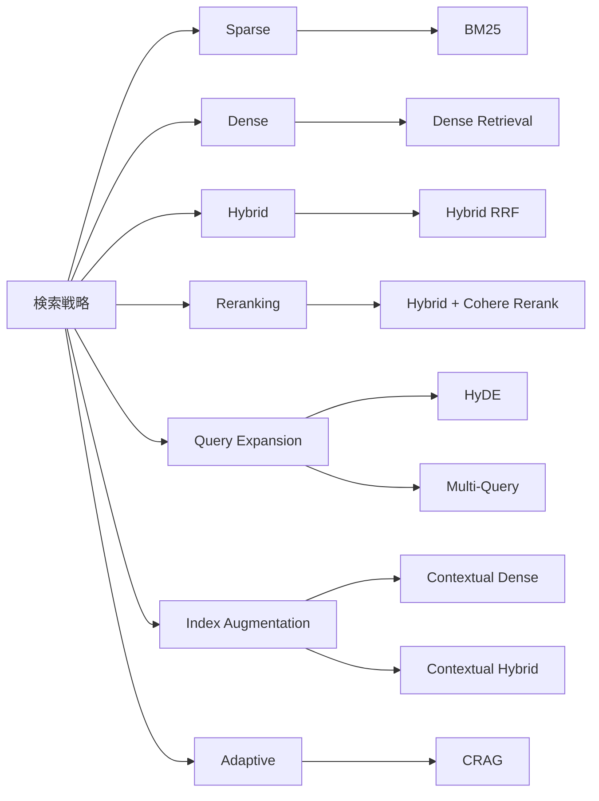
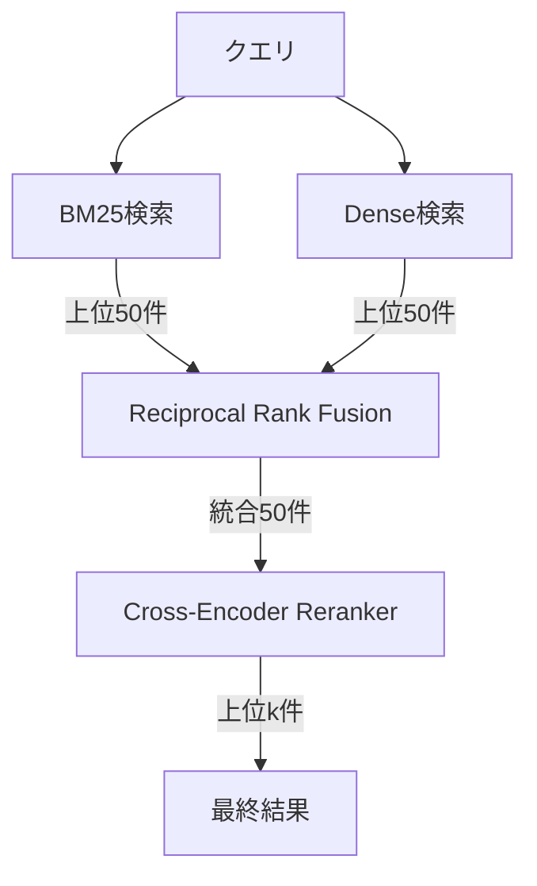
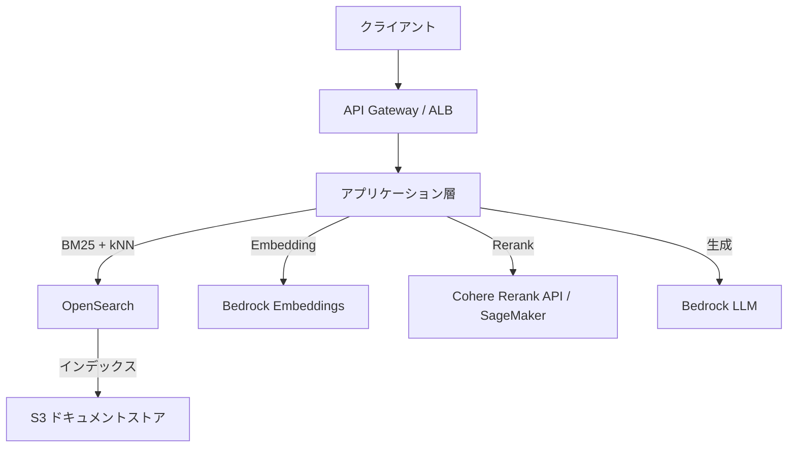

本記事は [From BM25 to Corrective RAG: Benchmarking Retrieval Strategies for Text-and-Table Documents](https://arxiv.org/abs/2604.01733) の解説記事です。

## 論文概要（Abstract）

Retrieval-Augmented Generation（RAG）システムにおける検索品質の重要性にもかかわらず、テキストとテーブルが混在する異種文書に対する最新の検索手法の体系的な比較研究は存在しなかった。著者らは金融QAベンチマーク（23,088クエリ、7,318文書）上で、Sparse・Dense・Hybrid fusion・Cross-encoder reranking・Query expansion・Index augmentation・Adaptive retrievalの7カテゴリにまたがる10の検索戦略をベンチマークした。2段パイプライン（Hybrid + Neural reranking）がRecall@5 = 0.816、MRR@3 = 0.605で全手法中最高を記録し、BM25が金融文書においてDense retrievalを上回るという結果が報告されている。

この記事は [Zenn記事: BM25×ベクトル検索のハイブリッド検索をPythonで実装する](https://zenn.dev/0h_n0/articles/20dde6d2d10b46) の深掘りです。

## 情報源

- **arXiv ID**: [2604.01733](https://arxiv.org/abs/2604.01733)
- **URL**: [https://arxiv.org/abs/2604.01733](https://arxiv.org/abs/2604.01733)
- **著者**: Meftun Akarsu, Recep Kaan Karaman, Christopher Mierbach
- **発表日**: 2026年4月2日
- **分野**: cs.IR（Information Retrieval）、cs.CL（Computation and Language）
- **ページ数**: 11ページ、6図、6表
- **ライセンス**: CC BY 4.0
- **DOI**: [10.48550/arXiv.2604.01733](https://doi.org/10.48550/arXiv.2604.01733)

## 背景と動機

RAGシステムの性能はretrieverの品質に大きく依存する。しかし、既存のベンチマーク（MTEB、BEIR等）は主に均質なテキスト文書を対象としており、金融文書のようにテキストとテーブルが混在する文書に対する検索手法の比較は十分に行われていなかった。

金融文書には以下の特有の課題がある。

- **テーブルとテキストの混在**: 財務諸表やアニュアルレポートには構造化テーブルと非構造化テキストが同居しており、テーブル内の数値とテキスト内の説明を横断的に検索する必要がある
- **数値精度の要求**: 「2023年第3四半期のEBITDAは?」のような問いに対して、曖昧な意味的類似性ではなく正確な数値の一致が求められる
- **専門用語と固有表現**: 企業名、ティッカーシンボル、財務指標ラベルなど、セマンティック検索よりも字句一致が有効な要素が多い

著者らはこれらの課題に対して、10の検索戦略を同一条件で公平に比較し、Paired bootstrap有意性検定（B=10,000、Bonferroni補正）による統計的に厳密な評価を行うことを目的とした。

## 主要な貢献

1. **10の検索戦略の体系的ベンチマーク**: Sparse・Dense・Hybrid・Reranking・Query expansion・Index augmentation・Adaptive retrievalの7カテゴリにまたがる10手法を同一データセット上で比較した初の研究
2. **2段パイプラインの優位性の実証**: Hybrid RRF → Cross-encoder rerankingの2段構成がRecall@5 = 0.816を達成し、全単一手法を大幅に上回ることを示した
3. **BM25のドメイン依存的優位性**: 金融文書においてBM25がstate-of-the-artのDense retrievalを全主要指標で上回り、セマンティック検索が普遍的に優位であるという一般的な想定に反する結果を提示した
4. **Query expansion手法の限界の特定**: HyDE・Multi-queryが数値精度を要求するクエリでは効果が限定的である一方、Contextual retrievalが一貫した改善を示すことを明らかにした

## 技術的詳細（Technical Details）

### 10の検索戦略

著者らが評価した10の検索戦略は以下のとおりである。



| # | 戦略 | カテゴリ | 概要 |
|---|------|---------|------|
| 1 | **BM25** | Sparse | TF-IDF系の字句マッチング（k₁=1.2, b=0.75） |
| 2 | **Dense Retrieval** | Dense | OpenAI text-embedding-3-large + FAISS |
| 3 | **Hybrid RRF** | Hybrid | BM25 + DenseをReciprocal Rank Fusionで統合 |
| 4 | **Hybrid + Cohere Rerank** | Reranking | 2段パイプライン: Hybrid RRFで50候補 → Cross-encoderで上位10件に絞り込み |
| 5 | **HyDE** | Query Expansion | GPT-4.1-miniで仮想文書を生成し、その埋め込みで検索 |
| 6 | **Multi-Query** | Query Expansion | 3つのクエリバリアントを生成しRRFで統合 |
| 7 | **Contextual Dense** | Index Augmentation | LLM生成要約を文書に付与してからDense検索 |
| 8 | **Contextual Hybrid** | Index Augmentation | 文書コンテキスト付与 + Hybrid fusion |
| 9 | **CRAG** | Adaptive | 検索結果の関連性を評価し、低品質時にクエリ書き換え |
| 10 | **各手法のアブレーション** | - | RRFパラメータ、Reranker深さ等の変動実験 |

### 2段パイプライン: Hybrid RRF → Cross-Encoder Reranking

本論文で最高性能を達成したパイプラインの構造を示す。



**Reciprocal Rank Fusion（RRF）** は複数のランキングを統合する手法であり、スコアは以下の式で計算される。

$$
\text{RRF}(d) = \sum_{r \in R} \frac{1}{k + r(d)}
$$

ここで、$$R$$ はランキングの集合、$$r(d)$$ は文書 $$d$$ のランキング $$r$$ における順位、$$k$$ はスムージングパラメータ（論文ではデフォルト $$k=60$$）である。

著者らはアブレーション実験で、Convex Combination（$$\alpha=0.5$$）がRRF（$$k=60$$）を上回る場合があることも報告している（Recall@5: 0.726 vs. 0.695）。

### 評価指標

**検索品質指標**:

$$
\text{MRR}@k = \frac{1}{|Q|} \sum_{q \in Q} \frac{1}{\text{rank}_q}
$$

ここで、$$\text{rank}_q$$ はクエリ $$q$$ に対する最初の正解文書の順位（$$k$$ 以内に存在しない場合は0）である。

$$
\text{nDCG}@k = \frac{\text{DCG}@k}{\text{IDCG}@k}, \quad \text{DCG}@k = \sum_{i=1}^{k} \frac{2^{\text{rel}_i} - 1}{\log_2(i + 1)}
$$

$$
\text{Recall}@k = \frac{|\text{relevant docs in top-}k|}{|\text{total relevant docs}|}
$$

**生成品質指標**: Number Match（NM、$$\epsilon = 10^{-2}$$）を主要指標とし、Token F1、ROUGE-L、BERTScoreを補助指標として使用。

**統計検定**: Paired bootstrap（B=10,000）にBonferroni補正を適用し、多重比較における偽陽性を抑制している。

### T2-RAGBenchデータセット

| サブセット | クエリ数 | 特徴 |
|-----------|---------|------|
| FinQA | 8,281 | 財務テーブル上の数値推論 |
| ConvFinQA | 3,458 | 対話形式の財務QA |
| TAT-DQA | 11,349 | テーブル+テキスト混在のQA |
| **合計** | **23,088** | **7,318文書、平均~920トークン/文書** |

クエリはLlama 3.3-70Bを用いて文脈非依存（self-contained）な形式に再構成されている。

## 実装のポイント

### Hybrid + Rerankerパイプラインの構築手順

著者らの実験結果に基づく実装上の推奨事項を以下にまとめる。

**Reranker深さ（候補数）の設定**: アブレーション実験により、Rerankerに渡す候補数が性能に大きく影響することが判明している。20候補ではRecall@5 = 0.458と不十分であるのに対し、50候補でRecall@5 = 0.826に達し、それ以上は漸減する。著者らは50候補を推奨している。

**BM25 vs. Denseの使い分け**: 金融文書のように専門用語・固有表現・数値が支配的なドメインではBM25が優位であり、セマンティックな意味理解が重要な汎用QAではDense検索が優位となる。本論文の結果は、MTEBやBEIRでの汎用ランキングがドメイン固有の性能を予測しないことを示唆している。

**HyDEの適用判断**: HyDEはLLMが仮想文書を生成する際に、もっともらしいが不正確な数値を「幻覚」するため、数値精度が重要なドメインでは逆効果となる（Dense単独: Recall@5 = 0.587 vs. HyDE: 0.544）。テキスト主体のドメインでは有効な可能性があるが、数値クエリが多いドメインでは避けるべきである。

**Contextual Retrievalの効果**: LLM生成要約を文書に付与するインデクシング時の前処理は、Dense（+2.8pp）、Hybrid（+2.2pp）ともに一貫した改善を示しており、比較的低コストで導入できる手法として推奨される。

## Production Deployment Guide

### AWS実装パターン（金融QAシステム: OpenSearch + Bedrock + Reranker API）

本論文のHybrid + Rerankerパイプラインを金融QAシステムとしてAWSに展開する場合の構成を示す。



**トラフィック量別の推奨構成**:

| 規模 | 月間クエリ | 推奨構成 | 月額コスト | 主要サービス |
|------|-----------|---------|-----------|------------|
| **Small** | ~3,000 (100/日) | Serverless | $50-150 | Lambda + OpenSearch Serverless + Cohere Rerank API |
| **Medium** | ~30,000 (1,000/日) | Container | $300-800 | ECS + OpenSearch + Bedrock |
| **Large** | 300,000+ (10,000/日) | Kubernetes | $2,000-5,000 | EKS + OpenSearch + SageMaker Endpoint (Cross-Encoder) |

**Small構成の詳細**（月額$50-150）:
- **Lambda**: API Gateway + 検索・生成エンドポイント ($15-30/月)
- **OpenSearch Serverless**: BM25 + kNNインデックス、2 OCU最小 ($50-70/月)
- **Cohere Rerank API**: 外部API呼び出し、1,000リクエスト/日で $10-30/月
- **Bedrock Embeddings**: text-embedding-3-large相当 ($5-15/月)
- **S3**: 文書ストレージ ($1-5/月)

**Medium構成の詳細**（月額$300-800）:
- **ECS Fargate**: アプリケーション層、2タスク常時稼働 ($100-200/月)
- **OpenSearch**: r6g.large.search × 2ノード ($250-400/月)
- **Bedrock**: Embeddings + LLM生成 ($50-150/月)
- **Cohere Rerank API**: $30-50/月

**Large構成の詳細**（月額$2,000-5,000）:
- **EKS**: コントロールプレーン + ワーカーノード ($500-800/月)
- **OpenSearch**: r6g.xlarge.search × 3ノード + マスターノード ($800-1,500/月)
- **SageMaker Endpoint**: Cross-Encoder rerankerモデルホスティング、ml.g5.xlarge ($500-1,000/月)
- **Bedrock**: Embeddings + LLM ($200-500/月)
- **ALB + CloudWatch + X-Ray**: $100-200/月

### Terraformインフラコード

**Small構成（Lambda + OpenSearch Serverless）**:

```hcl
# --- OpenSearch Serverless Collection (BM25 + kNN) ---
resource "aws_opensearchserverless_collection" "financial_qa" {
  name        = "financial-qa-hybrid"
  type        = "SEARCH"
  description = "Hybrid search: BM25 + kNN for financial QA"
}

resource "aws_opensearchserverless_security_policy" "encryption" {
  name = "financial-qa-encryption"
  type = "encryption"
  policy = jsonencode({
    Rules = [{
      ResourceType = "collection"
      Resource     = ["collection/financial-qa-hybrid"]
    }]
    AWSOwnedKey = true
  })
}

resource "aws_opensearchserverless_access_policy" "data_access" {
  name = "financial-qa-access"
  type = "data"
  policy = jsonencode([{
    Rules = [{
      ResourceType = "index"
      Resource     = ["index/financial-qa-hybrid/*"]
      Permission   = [
        "aoss:CreateIndex", "aoss:ReadDocument",
        "aoss:WriteDocument", "aoss:UpdateIndex"
      ]
    }]
    Principal = [aws_iam_role.lambda_role.arn]
  }])
}

# --- Lambda Function (検索 + 生成エンドポイント) ---
resource "aws_lambda_function" "hybrid_search" {
  function_name = "financial-qa-hybrid-search"
  runtime       = "python3.12"
  handler       = "handler.lambda_handler"
  timeout       = 30
  memory_size   = 512

  environment {
    variables = {
      OPENSEARCH_ENDPOINT = aws_opensearchserverless_collection.financial_qa.collection_endpoint
      COHERE_API_KEY_ARN  = aws_secretsmanager_secret.cohere_key.arn
      RERANKER_TOP_K      = "50"  # 論文推奨: 50候補 → Rerank
      FINAL_TOP_K         = "5"
    }
  }

  filename         = data.archive_file.lambda_zip.output_path
  source_code_hash = data.archive_file.lambda_zip.output_base64sha256
  role             = aws_iam_role.lambda_role.arn
}

# --- API Gateway ---
resource "aws_apigatewayv2_api" "financial_qa" {
  name          = "financial-qa-api"
  protocol_type = "HTTP"
}

resource "aws_apigatewayv2_integration" "lambda" {
  api_id             = aws_apigatewayv2_api.financial_qa.id
  integration_type   = "AWS_PROXY"
  integration_uri    = aws_lambda_function.hybrid_search.invoke_arn
  payload_format_version = "2.0"
}

# --- CloudWatch アラーム ---
resource "aws_cloudwatch_metric_alarm" "search_latency" {
  alarm_name          = "financial-qa-search-latency-p99"
  comparison_operator = "GreaterThanThreshold"
  evaluation_periods  = 2
  metric_name         = "Duration"
  namespace           = "AWS/Lambda"
  period              = 300
  statistic           = "p99"
  threshold           = 5000  # 5秒（Rerank含む）
  alarm_description   = "検索+Rerank p99レイテンシ5秒超過"
  dimensions = {
    FunctionName = aws_lambda_function.hybrid_search.function_name
  }
}
```

**Large構成（EKS + SageMaker Cross-Encoder）**:

```hcl
# --- EKS Cluster ---
module "eks" {
  source  = "terraform-aws-modules/eks/aws"
  version = "~> 20.0"

  cluster_name    = "financial-qa-cluster"
  cluster_version = "1.31"
  vpc_id          = module.vpc.vpc_id
  subnet_ids      = module.vpc.private_subnets

  eks_managed_node_groups = {
    app = {
      instance_types = ["m6i.xlarge"]
      min_size       = 2
      max_size       = 8
      desired_size   = 3
    }
  }
}

# --- SageMaker Endpoint (Cross-Encoder Reranker) ---
resource "aws_sagemaker_model" "cross_encoder" {
  name               = "cross-encoder-reranker"
  execution_role_arn = aws_iam_role.sagemaker_role.arn

  primary_container {
    image          = "763104351884.dkr.ecr.ap-northeast-1.amazonaws.com/huggingface-pytorch-inference:2.6-transformers4.52-gpu-py312-cu126-ubuntu22.04"
    model_data_url = "s3://${aws_s3_bucket.models.bucket}/cross-encoder/model.tar.gz"
    environment = {
      HF_MODEL_ID            = "cross-encoder/ms-marco-MiniLM-L-12-v2"
      SAGEMAKER_PROGRAM       = "inference.py"
      MAX_BATCH_SIZE          = "64"
      RERANKER_CANDIDATE_DEPTH = "50"  # 論文推奨値
    }
  }
}

resource "aws_sagemaker_endpoint_configuration" "cross_encoder" {
  name = "cross-encoder-reranker-config"

  production_variants {
    variant_name           = "primary"
    model_name             = aws_sagemaker_model.cross_encoder.name
    instance_type          = "ml.g5.xlarge"
    initial_instance_count = 1

    managed_instance_scaling {
      status                 = "ENABLED"
      min_instance_count     = 1
      max_instance_count     = 4
    }
  }
}

resource "aws_sagemaker_endpoint" "cross_encoder" {
  name                 = "cross-encoder-reranker"
  endpoint_config_name = aws_sagemaker_endpoint_configuration.cross_encoder.name
}

# --- OpenSearch Domain ---
resource "aws_opensearch_domain" "financial_qa" {
  domain_name    = "financial-qa"
  engine_version = "OpenSearch_2.17"

  cluster_config {
    instance_type          = "r6g.xlarge.search"
    instance_count         = 3
    zone_awareness_enabled = true

    zone_awareness_config {
      availability_zone_count = 3
    }

    dedicated_master_enabled = true
    dedicated_master_type    = "m6g.large.search"
    dedicated_master_count   = 3
  }

  ebs_options {
    ebs_enabled = true
    volume_size = 100
    volume_type = "gp3"
    throughput  = 250
    iops        = 3000
  }

  encrypt_at_rest {
    enabled = true
  }

  node_to_node_encryption {
    enabled = true
  }
}

# --- CloudWatch ダッシュボード ---
resource "aws_cloudwatch_dashboard" "financial_qa" {
  dashboard_name = "financial-qa-monitoring"
  dashboard_body = jsonencode({
    widgets = [
      {
        type   = "metric"
        properties = {
          title   = "Reranker Latency (SageMaker)"
          metrics = [
            ["AWS/SageMaker", "ModelLatency", "EndpointName", "cross-encoder-reranker"]
          ]
          period = 300
          stat   = "p99"
        }
      },
      {
        type   = "metric"
        properties = {
          title   = "OpenSearch Search Latency"
          metrics = [
            ["/aws/OpenSearch", "SearchLatency", "DomainName", "financial-qa"]
          ]
          period = 300
          stat   = "p99"
        }
      }
    ]
  })
}
```

### 運用・監視設定

```python
"""金融QA Hybrid + Rerankerパイプラインの監視設定。

OpenSearch + Cohere Rerank / SageMaker Cross-Encoderの
レイテンシ・スループット・品質を監視する。
"""

import boto3

cloudwatch = boto3.client("cloudwatch")


def put_retrieval_quality_alarm() -> None:
    """検索品質の監視アラームを設定する。

    Recall@5が閾値を下回った場合にアラートを発火する。
    アプリケーション側でカスタムメトリクスとしてRecall@5を送信する前提。
    """
    cloudwatch.put_metric_alarm(
        AlarmName="financial-qa-recall-at-5",
        ComparisonOperator="LessThanThreshold",
        EvaluationPeriods=3,
        MetricName="RecallAt5",
        Namespace="FinancialQA/Retrieval",
        Period=3600,
        Statistic="Average",
        Threshold=0.75,  # 論文結果0.816の約92%をアラート閾値
        AlarmDescription="Recall@5が0.75を下回った場合にアラート",
    )


def put_reranker_latency_alarm() -> None:
    """Rerankerレイテンシの監視アラームを設定する。"""
    cloudwatch.put_metric_alarm(
        AlarmName="financial-qa-reranker-latency-p99",
        ComparisonOperator="GreaterThanThreshold",
        EvaluationPeriods=2,
        MetricName="RerankerLatencyMs",
        Namespace="FinancialQA/Retrieval",
        Period=300,
        Statistic="p99",
        Threshold=2000,  # Rerank 50候補で2秒以内を目標
        AlarmDescription="Reranker p99レイテンシ2秒超過",
    )


def put_hybrid_search_metrics() -> None:
    """ハイブリッド検索のカスタムメトリクスを送信する。

    アプリケーションコードから呼び出し、
    BM25/Dense/Hybrid各段の検索結果を記録する。
    """
    cloudwatch.put_metric_data(
        Namespace="FinancialQA/Retrieval",
        MetricData=[
            {
                "MetricName": "BM25CandidateCount",
                "Value": 50,
                "Unit": "Count",
            },
            {
                "MetricName": "DenseCandidateCount",
                "Value": 50,
                "Unit": "Count",
            },
            {
                "MetricName": "RerankInputCount",
                "Value": 50,  # 論文推奨: 50候補
                "Unit": "Count",
            },
            {
                "MetricName": "FinalResultCount",
                "Value": 5,
                "Unit": "Count",
            },
        ],
    )
```

### コスト最適化チェックリスト

- [ ] ~100 req/日 → Lambda + OpenSearch Serverless ($50-150/月)
- [ ] ~1,000 req/日 → ECS + OpenSearch マネージド ($300-800/月)
- [ ] 10,000+ req/日 → EKS + OpenSearch + SageMaker ($2,000-5,000/月)
- [ ] Cohere Rerank APIは1,000 req/日以下ならSageMaker Endpointより安価
- [ ] SageMaker Endpoint: Managed Instance Scalingで最小1台、ピーク時自動スケール
- [ ] OpenSearch Reserved Instances（1年コミット）で約30%割引
- [ ] Reranker候補数は50に設定（論文推奨値、20では性能不足、100以上は費用対効果低下）
- [ ] Bedrock Embeddings: バッチ推論でコスト50%削減（インデクシング時）
- [ ] Contextual Retrieval用のLLM要約はインデクシング時に一度だけ生成しS3に保存
- [ ] OpenSearch kNNインデックス: FP16量子化でメモリ使用量を50%削減
- [ ] HyDEは金融ドメインでは逆効果のため導入しない（コスト増+品質低下）
- [ ] CloudWatch Anomaly Detectionで検索レイテンシ・Recall異常を自動検知
- [ ] タグ戦略: env/project/teamでコスト可視化
- [ ] Savings Plans（Compute）でLambda/Fargate/SageMakerを横断的に割引

**コスト試算の注意事項**:
- 上記は2026年6月時点のAWS ap-northeast-1（東京）リージョン料金に基づく概算値です
- Cohere Rerank APIの料金は利用量に応じて変動します
- 最新料金は [AWS料金計算ツール](https://calculator.aws/) で確認してください

## 実験結果（Results）

### 10戦略の比較（論文Table Iより）

| 戦略 | Recall@5 | MRR@3 | nDCG@10 |
|------|----------|-------|---------|
| **Hybrid + Cohere Rerank** | **0.816** | **0.605** | **0.683** |
| Contextual Hybrid | 0.717 | 0.454 | 0.571 |
| Hybrid RRF | 0.695 | 0.433 | 0.551 |
| CRAG | 0.658 | - | - |
| BM25 | 0.644 | 0.411 | 0.515 |
| Multi-Query | 0.640 | - | - |
| Dense | 0.587 | 0.351 | 0.466 |
| HyDE | 0.544 | 0.318 | 0.433 |

Hybrid + Cohere Rerankは2位のContextual Hybridに対して+9.9ppのRecall@5差を示しており、Paired bootstrap検定で統計的に有意であると報告されている。

### BM25 vs. Dense Retrieval

BM25（Recall@5 = 0.644）がDense Retrieval（0.587）を+5.7pp上回った。著者らはこの理由として、金融文書における企業名、ティッカーシンボル、財務指標ラベルなどの専門用語が字句一致に適しているためと分析している。ただし、Recall@20ではDenseがBM25を上回る場合があると報告されており、上位候補の精度と網羅性のトレードオフが存在する。

### エラー分析

7,188件（全体の31.1%）の検索失敗を分析した結果、以下の失敗モードが特定されている。

| 失敗モード | 割合 | 説明 |
|-----------|------|------|
| テーブル構造不一致 | 73% | テーブルの行列構造を正しく解釈できない |
| 数値推論 | 20% | 計算を要するクエリへの対応失敗 |
| 語彙不一致 | 5% | 同義語・略語の不一致 |
| クエリ曖昧性 | 1% | 質問の意図が不明確 |
| 長文書 | 1% | 文書長がモデルの処理能力を超過 |

テーブル構造不一致が73%を占めることから、テーブル理解の改善が最大の改善余地であることが示唆されている。

### End-to-End生成品質（論文Table IIIより）

| 検索手法 | GPT-4.1-mini NM | GPT-5.4 NM |
|---------|-----------------|------------|
| Oracle（正解文書） | 0.350 | 0.403 |
| Hybrid RRF | 0.282 | 0.346 |
| BM25 | 0.251 | - |

Recall@5と Number Match の相関係数は r > 0.99 であり、検索品質の改善が生成品質に直結することが実証されている。

### Fusion手法のアブレーション

| 手法 | Recall@5 | 備考 |
|------|----------|------|
| Convex Combination (α=0.5) | 0.726 | RRF k=60より優位 |
| RRF (k=10) | 0.716 | 低kが有効 |
| RRF (k=60, デフォルト) | 0.695 | 標準設定 |

## 実運用への応用（Practical Applications）

### 金融以外のドメインへの汎化可能性

本論文の結果は金融QAに限定されているが、以下のドメインへの適用可能性が示唆される。

**BM25が有効と考えられるドメイン**:
- **医療文書**: 薬品名、ICD-10コード、検査値など固有表現・数値が多い
- **法律文書**: 法令番号、判例番号、条文の正確な引用が必要
- **特許検索**: 特許番号、国際分類（IPC）、請求項の字句一致が重要

**Dense検索が有効と考えられるドメイン**:
- **一般的なFAQ**: 自然言語の言い換えが多く、意味的類似性が重要
- **ナレッジベース**: 概念的な質問が多く、字句一致では不十分

**Hybrid + Rerankingの普遍的推奨**: 著者らの結果に基づけば、ドメインを問わずHybrid RRF → Cross-encoder rerankingの2段パイプラインが安全な選択肢である。BM25単独かDense単独かの選択で迷う場合、Hybridにすることで両方の強みを活かせる。

**実運用上の注意点**: 著者らは本研究の限界として、金融ドメインのみでの評価であること、全回答が数値であること（Number Matchバイアス）、チャンキングの検討がないこと、単一の埋め込みモデルのみの評価であることを明示している。他ドメインへの適用時には、ドメイン固有のデータで検証することが必須である。

## 関連研究（Related Work）

- **RAG基盤**: Lewis et al. (2020) がRAGの基本フレームワークを提案。本論文はRAGのretriever部分に焦点を当て、10手法を体系的に比較した
- **Corrective RAG (CRAG)**: Yan et al. (2024) が提案した適応型検索手法。本論文ではCRAGが63%のクエリで補正パスを発動したが、単純なHybrid RRFを下回る結果となった
- **HyDE**: Gao et al. (2023) が提案した仮想文書生成による検索手法。金融ドメインでは数値の幻覚により逆効果となることが本論文で示された
- **Contextual Retrieval**: Anthropic (2024) が提案したインデクシング時のコンテキスト付与手法。本論文で一貫した改善が確認された
- **Cross-encoder reranking**: Nogueira & Cho (2020) 以降のreranking研究。本論文で2段パイプラインの有効性が金融ドメインでも確認された

## まとめと今後の展望

本論文は、金融QAという実用的なドメインにおいて10の検索戦略を統一的に比較した貴重な実証研究である。Hybrid RRF → Cross-encoder rerankingの2段パイプラインが最高性能（Recall@5 = 0.816）を達成し、BM25が金融文書でDense検索を上回るという実務上重要な知見が示された。

今後の課題として、著者らはテーブル構造の理解改善（エラーの73%を占める）、チャンキング戦略の検討、複数の埋め込みモデルでの検証、および金融以外のドメインへの一般化を挙げている。検索品質と生成品質の高い相関（r > 0.99）は、RAGシステム全体の改善においてretrieverの最適化が最優先事項であることを裏付けている。

## 参考文献

- **arXiv**: [https://arxiv.org/abs/2604.01733](https://arxiv.org/abs/2604.01733)
- **DOI**: [https://doi.org/10.48550/arXiv.2604.01733](https://doi.org/10.48550/arXiv.2604.01733)
- **Related Zenn article**: [https://zenn.dev/0h_n0/articles/20dde6d2d10b46](https://zenn.dev/0h_n0/articles/20dde6d2d10b46)
