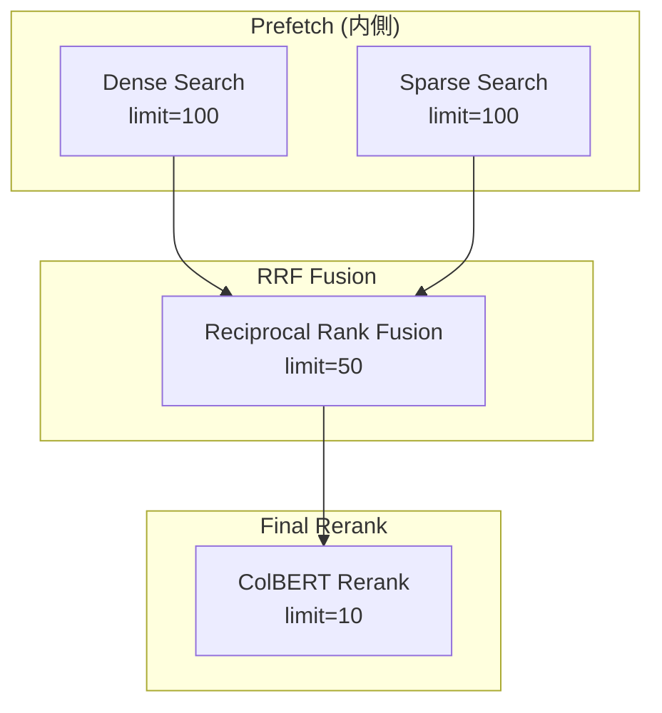
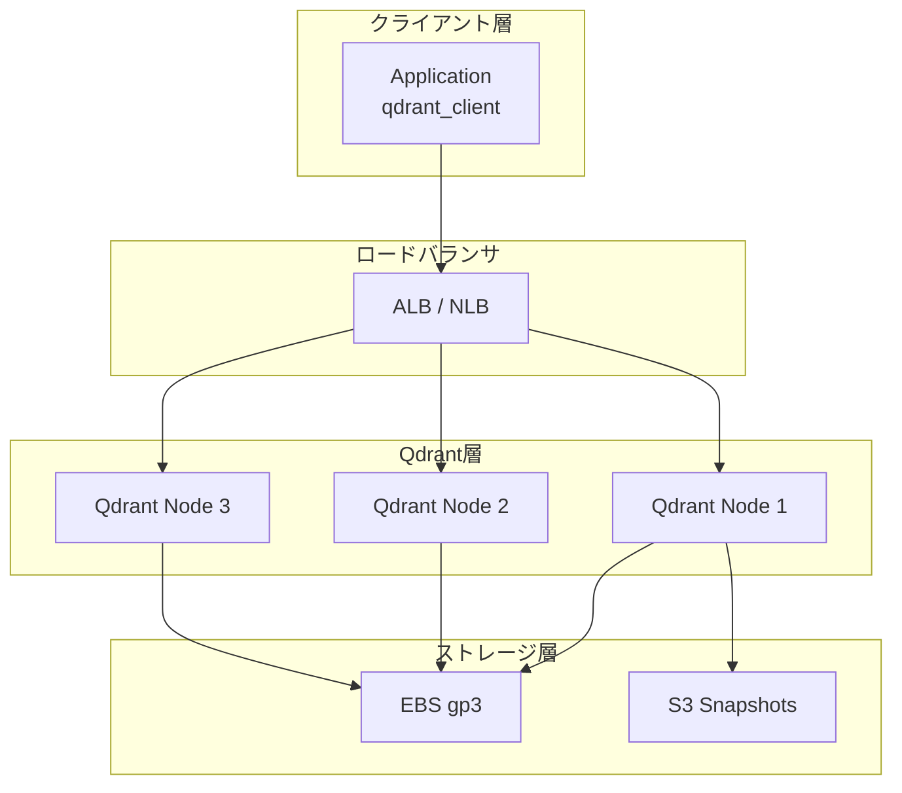

## ブログ概要（Summary）

本記事は [Qdrant公式ブログ「Hybrid Search Revamped — Building with Qdrant's Query API」](https://qdrant.tech/articles/hybrid-search/) の解説記事です。

Qdrant社のKacper Łukawski氏が2024年7月に公開した本ブログ記事では、Qdrant 1.10で導入された**Query API**を中心に、ハイブリッド検索をサーバーサイドで完結させるアーキテクチャが解説されています。従来はDense検索とSparse検索の結果をクライアント側で統合する必要がありましたが、**Prefetch機構**と**RRF（Reciprocal Rank Fusion）**の組み合わせにより、ネットワークラウンドトリップの削減と検索パイプラインの簡素化を実現しています。本稿では、このブログの技術的内容を整理し、AWS上での本番デプロイメントパターンまでを含めて解説します。

この記事は [Zenn記事: BM25×ベクトル検索のハイブリッド検索をPythonで実装する](https://zenn.dev/0h_n0/articles/20dde6d2d10b46) の深掘りです。

## 情報源

- **種別**: 企業テックブログ
- **URL**: [https://qdrant.tech/articles/hybrid-search/](https://qdrant.tech/articles/hybrid-search/)
- **組織**: Qdrant（Rust製ベクトルデータベース。Tripadvisor、HubSpot、OpenTable等が本番採用）
- **著者**: Kacper Łukawski（Developer Advocate）
- **発表日**: 2024年7月25日

## 技術的背景（Technical Background）

### ハイブリッド検索の必要性

情報検索の分野では、単一の検索手法だけでは全てのクエリに対応できないことが知られています。Qdrantチームは本ブログで具体例として「**cybersport desk**」というクエリを挙げています。BM25（キーワードベース）では「desk」という単語にマッチして一般的なデスクが返されるのに対し、ベクトル検索では「cybersport」の文脈を理解してゲーミングデスクが返されます。一方で、製品名や型番のような正確なキーワードマッチが必要なクエリではBM25が優位です。

このため、Dense（ベクトル）検索とSparse（BM25的）検索を組み合わせた**ハイブリッド検索**が本番環境で広く採用されています。

### 従来のクライアント側統合の課題

Qdrant 1.10以前は、ハイブリッド検索を行うには以下の手順が必要でした。

1. Dense検索のAPIコールを実行
2. Sparse検索のAPIコールを実行
3. クライアント側で両結果をマージ・スコア統合
4. 必要に応じてリランキングを実行

この方法には**ネットワークラウンドトリップの増加**、**クライアント側ロジックの複雑化**、**スコア正規化の困難さ**という3つの課題がありました。Query APIは、これらの処理をサーバーサイドに統合することで解決しています。

## 実装アーキテクチャ（Architecture）

### Query APIの設計思想

Qdrant 1.10のQuery APIは、従来個別に存在していた`search`、`recommend`、`discover`の各エンドポイントを**単一の`query_points`エンドポイント**に統合したものです。Qdrantチームは「nested multistage queries（ネストされた多段クエリ）」をサポートすることで、複雑な検索パイプラインを単一リクエストで構築可能にしたと述べています。

### Prefetch機構の動作

Prefetch機構は、検索パイプラインの各段階を**ネスト構造**で定義する仕組みです。内側のPrefetchが先に実行され、その結果が外側のリランキングに渡されます。



この階層構造により、「Dense+Sparseの結果をRRFで統合し、さらにColBERTでリランキング」といった多段パイプラインが**1回のAPIコール**で実行されます。

### RRF Fusionのサーバーサイド実行

RRF（Reciprocal Rank Fusion）は、複数の検索結果を統合する手法として事実上の標準です。各ランキングにおけるドキュメントの順位から統合スコアを計算します。

$$
\text{RRF}(d) = \sum_{r \in R} \frac{1}{k + r(d)}
$$

ここで $R$ は各検索手法のランキング集合、$r(d)$ はランキング $r$ におけるドキュメント $d$ の順位、$k$ は定数（通常60）です。

Qdrantでは以下のようにサーバーサイドでRRFを実行できます。

```python
from qdrant_client import QdrantClient, models

client = QdrantClient("http://localhost:6333")

results = client.query_points(
    collection_name="my-collection",
    prefetch=[
        # Dense検索
        models.Prefetch(
            query=[0.1, 0.2, 0.3, ...],  # dense embedding
            using="dense",
            limit=100,
        ),
        # Sparse検索
        models.Prefetch(
            query=models.SparseVector(
                indices=[1, 42, 100, 355],
                values=[0.1, 0.8, 0.4, 0.9],
            ),
            using="sparse",
            limit=100,
        ),
    ],
    # RRF Fusionでスコア統合
    query=models.FusionQuery(fusion=models.Fusion.RRF),
    limit=10,
)
```

`models.FusionQuery` を指定した場合、クエリベクトルの指定は不要です。Prefetchで取得された各結果のランキング情報のみからRRFスコアが計算されます。

### 対応ベクトル型

Query APIは以下の4種類のベクトル型をサポートしています。

| ベクトル型 | 特徴 | 用途 |
|-----------|------|------|
| **Dense（float/uint8）** | 標準的な浮動小数点ベクトル。uint8は高速だが精度が低い | 汎用セマンティック検索 |
| **Sparse** | `indices` + `values` のペアで表現 | BM25的なキーワード検索、SPLADE |
| **Multi-vector** | 1ドキュメントに複数ベクトルを格納 | ColBERT等のlate interaction |
| **Matryoshka** | 同一モデルで複数次元の表現を持つ | 段階的な候補絞り込み |

### Named Vectorsによる複数モデル管理

Qdrantの**Named Vectors**は、1つのコレクション内に異なる次元・異なるモデルのベクトルを共存させる機能です。

```python
client.create_collection(
    collection_name="hybrid-collection",
    vectors_config={
        "dense": models.VectorParams(
            size=768,
            distance=models.Distance.COSINE,
        ),
        "late-interaction": models.VectorParams(
            size=128,
            distance=models.Distance.COSINE,
            multivector_config=models.MultiVectorConfig(
                comparator=models.MultiVectorComparator.MAX_SIM,
            ),
            # ColBERTをリランク専用にする場合はHNSW無効化
            hnsw_config=models.HnswConfigDiff(m=0),
        ),
    },
    sparse_vectors_config={
        "sparse": models.SparseVectorParams(
            modifier=models.Modifier.IDF,
        ),
    },
)
```

この例では、`dense`（768次元）、`late-interaction`（ColBERT用128次元Multi-vector）、`sparse`（Sparse Vector）の3種を1コレクションに格納しています。

### ColBERT最適化：HNSW無効化

ColBERT（Contextualized Late Interaction over BERT）のようなlate interactionモデルは、1ドキュメントあたり数百のベクトルを生成します。これらをリランキング専用（検索の初段には使わない）で利用する場合、HNSWインデックスの構築は不要です。

Qdrantチームは「ColBERT-like models create hundreds of embeddings for each document, so the overhead is significant」と述べ、以下の設定でHNSWグラフ作成を無効化することを推奨しています。

```python
hnsw_config=models.HnswConfigDiff(m=0)
```

`m=0` に設定するとHNSWグラフが構築されず、インデックス時間とメモリ使用量を大幅に削減できます。ただし、このベクトルでの独立した検索（ANN検索）はできなくなるため、Prefetchの後段リランキングとしてのみ使用する設計です。

### 多段パイプラインの完全な例

以下は、Matryoshkaの段階的絞り込みとRRF Fusion、ColBERTリランキングを組み合わせた本格的なパイプラインです。

```python
results = client.query_points(
    collection_name="hybrid-collection",
    prefetch=[
        # Branch 1: Matryoshka段階的リランキング
        models.Prefetch(
            prefetch=[
                models.Prefetch(
                    query=[0.1, 0.2, ...],  # 64次元で粗い検索
                    using="matryoshka-64",
                    limit=100,
                ),
            ],
            query=[0.1, 0.2, 0.3, ...],  # 256次元で精密リランク
            using="matryoshka-256",
            limit=50,
        ),
        # Branch 2: Dense + Sparse → RRF
        models.Prefetch(
            prefetch=[
                models.Prefetch(
                    query=[0.5, 0.6, ...],
                    using="dense",
                    limit=100,
                ),
                models.Prefetch(
                    query=models.SparseVector(
                        indices=[1, 42, 355],
                        values=[0.1, 0.8, 0.9],
                    ),
                    using="sparse",
                    limit=100,
                ),
            ],
            query=models.FusionQuery(fusion=models.Fusion.RRF),
            limit=50,
        ),
    ],
    # 最終段: ColBERTでリランキング
    query=[0.1, 0.2, 0.3, ...],  # ColBERT multi-vector
    using="late-interaction",
    limit=10,
)
```

このパイプラインでは、2つのブランチ（Matryoshka段階リランクとDense+Sparse RRF統合）の結果をColBERTで最終リランキングしています。Qdrantチームは「you rarely need to build such a complex search pipeline（ここまで複雑なパイプラインが必要になることは稀）」と注記しつつ、Query APIの柔軟性を示す例として提示しています。

## Production Deployment Guide

Qdrant Query APIを用いたハイブリッド検索システムを本番環境にデプロイするためのAWS実装パターンを、規模別に整理します。

### アーキテクチャ概要



### Small構成：EC2 + Docker（$50-150/月）

PoC・社内ツール・10万件未満のドキュメント向けの構成です。

**インフラ構成**:

| コンポーネント | 仕様 | 月額概算 |
|--------------|------|---------|
| EC2 | t3.medium (2 vCPU, 4 GB RAM) | $30-35 |
| EBS | gp3 30GB | $3 |
| Application | 同一EC2上でPython app + Qdrant | $0 |
| データ転送 | 内部通信のみ | $5-10 |

**Terraformコード**:

```hcl
# small_qdrant.tf — EC2 + Docker Compose

provider "aws" {
  region = "ap-northeast-1"
}

resource "aws_security_group" "qdrant_sg" {
  name_prefix = "qdrant-"

  ingress {
    from_port   = 6333
    to_port     = 6334
    protocol    = "tcp"
    cidr_blocks = ["10.0.0.0/16"]  # VPC内部のみ
  }

  ingress {
    from_port   = 22
    to_port     = 22
    protocol    = "tcp"
    cidr_blocks = ["YOUR_IP/32"]
  }

  egress {
    from_port   = 0
    to_port     = 0
    protocol    = "-1"
    cidr_blocks = ["0.0.0.0/0"]
  }
}

resource "aws_instance" "qdrant" {
  ami           = "ami-0abcdef1234567890"  # Amazon Linux 2023
  instance_type = "t3.medium"

  root_block_device {
    volume_size = 30
    volume_type = "gp3"
    iops        = 3000
    throughput  = 125
  }

  user_data = <<-EOF
    #!/bin/bash
    dnf install -y docker
    systemctl enable --now docker

    # Qdrant起動
    docker run -d \
      --name qdrant \
      --restart unless-stopped \
      -p 6333:6333 \
      -p 6334:6334 \
      -v /data/qdrant:/qdrant/storage \
      qdrant/qdrant:v1.10.1

    EOF

  security_groups = [aws_security_group.qdrant_sg.name]

  tags = {
    Name = "qdrant-hybrid-search"
  }
}

output "qdrant_endpoint" {
  value = "http://${aws_instance.qdrant.private_ip}:6333"
}
```

**Docker Compose（アプリケーション同梱）**:

```yaml
# docker-compose.yml
version: "3.8"
services:
  qdrant:
    image: qdrant/qdrant:v1.10.1
    ports:
      - "6333:6333"
      - "6334:6334"  # gRPC
    volumes:
      - qdrant_storage:/qdrant/storage
    environment:
      - QDRANT__SERVICE__GRPC_PORT=6334
    deploy:
      resources:
        limits:
          memory: 2G
    restart: unless-stopped

  app:
    build: .
    depends_on:
      - qdrant
    environment:
      - QDRANT_URL=http://qdrant:6333
    ports:
      - "8000:8000"

volumes:
  qdrant_storage:
```

### Medium構成：ECS Fargate + Qdrant Cloud（$300-800/月）

スタートアップ・中規模サービス・100万件未満のドキュメント向けです。

**インフラ構成**:

| コンポーネント | 仕様 | 月額概算 |
|--------------|------|---------|
| Qdrant Cloud | Starter (4 GB RAM, 2 vCPU) | $150-300 |
| ECS Fargate | 0.5 vCPU, 1 GB RAM x 2タスク | $50-80 |
| ALB | アプリケーション用 | $20-30 |
| CloudWatch | ログ・メトリクス | $10-20 |

この構成ではQdrantの運用をQdrant Cloud（マネージドサービス）に委譲し、アプリケーション層のみをECS Fargateで管理します。

```python
# app/search_service.py
from qdrant_client import QdrantClient, models

def create_qdrant_client() -> QdrantClient:
    """Qdrant Cloudへの接続"""
    return QdrantClient(
        url="https://your-cluster.cloud.qdrant.io:6333",
        api_key="your-api-key",
        timeout=30,
    )

def hybrid_search(
    client: QdrantClient,
    query_dense: list[float],
    query_sparse: models.SparseVector,
    collection: str = "products",
    limit: int = 10,
) -> list[models.ScoredPoint]:
    """Prefetch + RRFによるハイブリッド検索"""
    return client.query_points(
        collection_name=collection,
        prefetch=[
            models.Prefetch(
                query=query_dense,
                using="dense",
                limit=100,
            ),
            models.Prefetch(
                query=query_sparse,
                using="sparse",
                limit=100,
            ),
        ],
        query=models.FusionQuery(fusion=models.Fusion.RRF),
        limit=limit,
    ).points
```

### Large構成：EKS + Qdrant Distributed（$2,000-5,000/月）

大規模サービス・1000万件以上のドキュメント・高可用性が必要なシステム向けです。

**インフラ構成**:

| コンポーネント | 仕様 | 月額概算 |
|--------------|------|---------|
| EKS Control Plane | マネージド | $73 |
| EC2 (Qdrant) | r6i.xlarge x 3 (4 vCPU, 32 GB RAM) | $700-900 |
| EC2 (App) | c6i.large x 2 | $120-160 |
| ALB | gRPC + HTTP対応 | $30-50 |
| EBS | gp3 100GB x 3 | $25-30 |
| S3 | スナップショットバックアップ | $5-10 |
| CloudWatch + Grafana | モニタリング | $50-100 |

**Terraformコード（EKS + Qdrant Cluster）**:

```hcl
# large_qdrant_eks.tf

module "eks" {
  source          = "terraform-aws-modules/eks/aws"
  version         = "~> 20.0"
  cluster_name    = "qdrant-hybrid-search"
  cluster_version = "1.30"
  vpc_id          = module.vpc.vpc_id
  subnet_ids      = module.vpc.private_subnets

  eks_managed_node_groups = {
    qdrant_nodes = {
      instance_types = ["r6i.xlarge"]
      min_size       = 3
      max_size       = 6
      desired_size   = 3

      labels = {
        workload = "qdrant"
      }

      taints = [{
        key    = "dedicated"
        value  = "qdrant"
        effect = "NO_SCHEDULE"
      }]
    }

    app_nodes = {
      instance_types = ["c6i.large"]
      min_size       = 2
      max_size       = 10
      desired_size   = 2

      labels = {
        workload = "application"
      }
    }
  }
}
```

**Qdrant分散クラスタ Kubernetes マニフェスト**:

```yaml
# qdrant-statefulset.yaml
apiVersion: apps/v1
kind: StatefulSet
metadata:
  name: qdrant
  namespace: search
spec:
  serviceName: qdrant-headless
  replicas: 3
  selector:
    matchLabels:
      app: qdrant
  template:
    metadata:
      labels:
        app: qdrant
    spec:
      nodeSelector:
        workload: qdrant
      tolerations:
        - key: "dedicated"
          value: "qdrant"
          effect: "NoSchedule"
      containers:
        - name: qdrant
          image: qdrant/qdrant:v1.10.1
          ports:
            - containerPort: 6333
              name: http
            - containerPort: 6334
              name: grpc
            - containerPort: 6335
              name: internal
          env:
            - name: QDRANT__CLUSTER__ENABLED
              value: "true"
          resources:
            requests:
              memory: "24Gi"
              cpu: "3"
            limits:
              memory: "28Gi"
              cpu: "4"
          volumeMounts:
            - name: qdrant-storage
              mountPath: /qdrant/storage
          livenessProbe:
            httpGet:
              path: /healthz
              port: 6333
            initialDelaySeconds: 30
            periodSeconds: 10
          readinessProbe:
            httpGet:
              path: /readyz
              port: 6333
            initialDelaySeconds: 10
            periodSeconds: 5
  volumeClaimTemplates:
    - metadata:
        name: qdrant-storage
      spec:
        accessModes: ["ReadWriteOnce"]
        storageClassName: gp3
        resources:
          requests:
            storage: 100Gi
---
apiVersion: v1
kind: Service
metadata:
  name: qdrant-headless
  namespace: search
spec:
  type: ClusterIP
  clusterIP: None
  selector:
    app: qdrant
  ports:
    - port: 6333
      name: http
    - port: 6334
      name: grpc
    - port: 6335
      name: internal
```

### 運用・監視設定

Qdrantは`/metrics`エンドポイントでPrometheus形式のメトリクスを公開しています。

**主要メトリクス**:

| メトリクス | 説明 | アラート閾値 |
|-----------|------|------------|
| `app_info` | バージョン情報 | - |
| `collections_total` | コレクション数 | - |
| `rest_responses_duration_seconds` | REST API応答時間 | p99 > 500ms |
| `grpc_responses_duration_seconds` | gRPC API応答時間 | p99 > 200ms |
| `app_status_recovery` | リカバリ状態 | != 0 |

**Grafanaダッシュボード設定例**:

```yaml
# prometheus-scrape-config.yaml
scrape_configs:
  - job_name: "qdrant"
    metrics_path: "/metrics"
    static_configs:
      - targets:
          - "qdrant-0.qdrant-headless.search:6333"
          - "qdrant-1.qdrant-headless.search:6333"
          - "qdrant-2.qdrant-headless.search:6333"
    scrape_interval: 15s
```

**CloudWatch Alarmの設定**:

```hcl
resource "aws_cloudwatch_metric_alarm" "qdrant_latency" {
  alarm_name          = "qdrant-high-latency"
  comparison_operator = "GreaterThanThreshold"
  evaluation_periods  = 3
  metric_name         = "TargetResponseTime"
  namespace           = "AWS/ApplicationELB"
  period              = 60
  statistic           = "p99"
  threshold           = 0.5
  alarm_description   = "Qdrant API p99 latency > 500ms"
  alarm_actions       = [aws_sns_topic.alerts.arn]

  dimensions = {
    LoadBalancer = aws_lb.qdrant.arn_suffix
  }
}
```

### コスト最適化チェックリスト

- **Quantization（量子化）**: float32 → uint8でメモリ使用量を約75%削減。精度への影響はデータセットに依存するが、Qdrantチームはスカラー量子化で「negligible quality loss」と報告
- **HNSW m パラメータ**: デフォルト16だが、リコール要件に応じて12-32の範囲で調整。`m`を下げるとメモリ削減、上げると検索精度向上
- **Payload index**: フィルタリングに使用するフィールドにはペイロードインデックスを作成し、フルスキャンを回避
- **gRPC利用**: REST APIよりgRPC（ポート6334）を使用することでシリアライゼーション/デシリアライゼーションのオーバーヘッドを削減
- **Reserved Instances**: Qdrantノードは常時稼働のため、RI（1年/3年）で30-60%のコスト削減が可能
- **Spot Instances**: アプリケーション層（ステートレス）にはスポットインスタンスを適用可能

## パフォーマンス最適化（Performance Tuning）

### HNSWパラメータのチューニング

HNSWインデックスは検索精度と速度のトレードオフを制御する2つの主要パラメータを持ちます。

| パラメータ | デフォルト | 影響 |
|-----------|----------|------|
| `m` | 16 | グラフの接続数。大きいほど高精度だがメモリ増加 |
| `ef_construct` | 100 | インデックス構築時の探索幅。大きいほど高品質だが構築時間増加 |

```python
client.create_collection(
    collection_name="optimized",
    vectors_config=models.VectorParams(
        size=768,
        distance=models.Distance.COSINE,
        hnsw_config=models.HnswConfigDiff(
            m=24,              # 高精度設定
            ef_construct=200,  # 構築品質向上
        ),
    ),
)
```

### Quantization（量子化）

Qdrantは3種類の量子化をサポートしています。

| 方式 | メモリ削減率 | 精度影響 | 推奨用途 |
|------|-----------|---------|---------|
| **Scalar（uint8）** | 約75% | 小 | 汎用・最初に試す |
| **Product** | 約90%以上 | 中 | 大規模データ |
| **Binary** | 約97% | 大 | 候補のプレフィルタ |

```python
client.update_collection(
    collection_name="products",
    quantization_config=models.ScalarQuantization(
        scalar=models.ScalarQuantizationConfig(
            type=models.ScalarType.INT8,
            quantile=0.99,
            always_ram=True,  # 量子化ベクトルを常にRAMに保持
        ),
    ),
)
```

### Payload Indexing

フィルタ付き検索を高速化するために、頻繁に使用されるペイロードフィールドにインデックスを作成します。

```python
client.create_payload_index(
    collection_name="products",
    field_name="category",
    field_schema=models.PayloadSchemaType.KEYWORD,
)
```

### Sharding戦略

大規模データセットでは、データを複数シャードに分割して並列処理を実現します。

- **Auto-sharding**: ノード数に基づく自動分割（デフォルト）
- **Custom sharding**: `shard_number` を明示的に指定（データ量に応じて調整）
- **Resharding**: v1.10以降、オンラインでのシャード数変更が可能

## 運用での学び（Operational Insights）

### ベクトルDBのスケーリングパターン

Qdrantの分散モードでは、**レプリケーション**と**シャーディング**の両方をサポートしています。読み取り負荷の増加にはレプリカ数を増やし、データ量の増加にはシャード数を増やします。EKSの場合、StatefulSetの`replicas`を変更し、Qdrantのクラスタメンバーシップに新ノードを追加する手順で水平スケーリングが可能です。

### ハイブリッド検索でのインデックス管理

Dense、Sparse、Multi-vectorの各インデックスは独立して管理されます。Sparseベクトルのインデックスは追記に強い反転インデックスベースですが、Denseベクトルの場合はHNSWグラフの更新コストが発生します。大量の一括挿入時は`optimizers_config`のセグメントしきい値を調整し、インデックスの再構築頻度を制御することが推奨されます。

### バックアップ・復旧戦略

Qdrantのスナップショット機能（`/snapshots`エンドポイント）を使用し、定期的にS3にバックアップを取得します。分散クラスタでは各シャードのスナップショットが個別に作成されるため、全ノードのスナップショットを同一タイミングで取得する運用スクリプトを用意する必要があります。

```bash
# 全コレクションのスナップショット取得
curl -X POST "http://localhost:6333/collections/products/snapshots"

# S3へのアップロード
aws s3 cp /qdrant/storage/snapshots/ \
  s3://backup-bucket/qdrant/$(date +%Y%m%d)/ \
  --recursive
```

## 学術研究との関連（Academic Context）

Qdrant Query APIのハイブリッド検索は、以下の学術研究に基づいています。

- **RRF（Reciprocal Rank Fusion）**: Cormack et al. (2009) が提案した教師なしランク統合手法。学習不要でロバストな性能を示すことから、本番システムで広く採用されています。
- **ColBERT**: Khattab & Zaharia (2020) によるlate interaction検索モデル。トークンレベルのMaxSim演算により、事前計算済みベクトルを用いた高速かつ高精度な検索を実現します。Qdrantの`MultiVectorConfig(comparator=MAX_SIM)`はこのMaxSim演算に対応しています。
- **BGE-M3**: BAAI (2024) による多言語・Multi-Granularity・Multi-Functionality対応の埋め込みモデル。Dense、Sparse、ColBERTの3種類の表現を単一モデルで生成でき、Qdrantの Named Vectors と組み合わせることで、1回のエンコードで3種類のベクトルを格納・検索可能です。

## まとめと実践への示唆（Conclusion）

Qdrant 1.10のQuery APIは、ハイブリッド検索の実装パターンを大きく簡素化しました。Prefetch機構によるネスト型パイプラインとRRF Fusionのサーバーサイド実行により、クライアント側のコード複雑性とネットワークラウンドトリップの両方が削減されます。

実践への示唆として、以下の3点が挙げられます。

1. **まずDense + Sparse + RRFから始める**: 多くのユースケースでは、この基本構成で十分な検索品質が得られます。ColBERTやMatryoshkaの追加は、ベースライン構築後にA/Bテストで効果を検証してから導入すべきです。
2. **Small構成で検証、段階的にスケール**: PoC段階ではEC2 + Dockerの最小構成（月額$50-150）で十分です。トラフィック増加に応じてECS/EKS構成に移行する段階的なアプローチが推奨されます。
3. **量子化とHNSW無効化を活用**: ColBERTのリランク専用利用時の`m=0`設定やScalar Quantizationは、品質への影響が小さいまま大幅なリソース節約を実現します。

## 参考文献

1. Łukawski, K. (2024). "Hybrid Search Revamped — Building with Qdrant's Query API". Qdrant Tech Blog. [https://qdrant.tech/articles/hybrid-search/](https://qdrant.tech/articles/hybrid-search/)
2. Cormack, G. V., Clarke, C. L. A., & Buettcher, S. (2009). "Reciprocal Rank Fusion outperforms Condorcet and individual Rank Learning Methods". *Proceedings of the 32nd International ACM SIGIR Conference on Research and Development in Information Retrieval*.
3. Khattab, O. & Zaharia, M. (2020). "ColBERT: Efficient and Effective Passage Search via Contextualized Late Interaction over BERT". *Proceedings of the 43rd International ACM SIGIR Conference on Research and Development in Information Retrieval*. arXiv: 2004.12832.
4. Chen, J., Xiao, S., Zhang, P., et al. (2024). "BGE M3-Embedding: Multi-Lingual, Multi-Functionality, Multi-Granularity Text Embeddings Through Self-Knowledge Distillation". arXiv: 2402.03216.
5. Qdrant Documentation. "Query API". [https://qdrant.tech/documentation/concepts/search/#query-api](https://qdrant.tech/documentation/concepts/search/#query-api)
