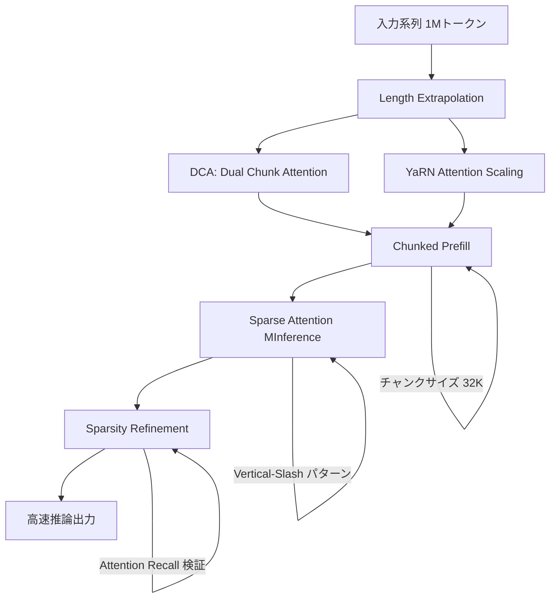

## 論文概要

本記事は [Qwen2.5-1M Technical Report (arXiv 2501.15383)](https://arxiv.org/abs/2501.15383) の解説記事です。

Qwen2.5-1Mは、Alibaba Qwen Teamが開発した100万トークンのコンテキスト長を処理可能な大規模言語モデルである。長文データ合成・段階的事前学習・マルチステージSFTによる学習パイプラインと、Dual Chunk Attention（DCA）・疎アテンション・Chunked Prefillを統合した推論最適化フレームワークを提案している。著者らは、1Mトークンのprefillにおいて3.2倍から6.7倍の高速化を達成したと報告している。

この記事は [Zenn記事: vLLM疎アテンションで長文脈RAGのTTFTを最大9倍削減する実装ガイド](https://zenn.dev/0h_n0/articles/8328900aa76407) の深掘りです。

## 情報源

- **arXiv ID**: 2501.15383
- **URL**: [https://arxiv.org/abs/2501.15383](https://arxiv.org/abs/2501.15383)
- **著者**: An Yang et al.（Alibaba Qwen Team、28名共著）
- **発表年**: January 2025
- **分野**: cs.CL（Computation and Language）

## 背景と動機

大規模言語モデルのコンテキスト長拡張は、長文書の要約、大規模コードベースの理解、マルチドキュメントRAGなどの実用シナリオを可能にする重要な研究課題である。しかし、128Kトークンから1Mトークンへの拡張には複数の技術的障壁が存在する。

第一に、学習データの問題がある。自然言語コーパスに含まれる高品質な超長文テキストの絶対量が限られているため、モデルが1Mトークン規模の文脈依存関係を学習する機会が不足する。第二に、推論コストの問題がある。標準的なSelf-Attentionの計算量は系列長の二乗 $O(n^2)$ に比例し、コンテキスト長が1Mトークンに達するとアテンション計算がforward pass全体の90%以上を占めるようになる（論文Section 3より）。第三に、位置エンコーディングの外挿問題がある。RoPE（Rotary Positional Embeddings）は学習時に見た最大系列長を超える位置に対して性能が劣化するため、学習長を超えるコンテキストを扱うには追加の技術が必要となる。

Qwen2.5-1Mは、これらの課題に対して学習・推論の両面から統合的にアプローチした研究であり、7Bおよび14Bパラメータのモデルをオープンソースで公開している点も特筆に値する。

## 主要な貢献

- **長文脈学習パイプライン**: 長文データ合成（Fill in the Middle、キーワードベース検索、段落並べ替え）と5段階のProgressive Pre-trainingにより、4Kから262Kトークンまで段階的にコンテキスト長を拡張する学習手法を確立
- **統合的推論最適化フレームワーク**: DCA（Dual Chunk Attention）による位置エンコーディング外挿、MInferenceベースの疎アテンション、Chunked Prefill、Sparsity Refinementを統合し、1Mトークンにおいて3.2倍から6.7倍のprefill高速化を実現
- **オープンソースモデルの公開**: Qwen2.5-7B-Instruct-1MおよびQwen2.5-14B-Instruct-1Mの2モデルをApache 2.0ライセンスで公開。14Bモデルは複数の長文脈ベンチマークでGPT-4o-miniを上回る性能を達成
- **短文脈性能の維持**: 1Mトークン対応の追加学習後も、MMLU、HumanEval等の短文脈ベンチマークで128Kバージョンと同等の性能を維持

## 技術的詳細

### 長文データ合成（Long Data Synthesis）

自然コーパス（Common Crawl、arXiv、書籍、コードリポジトリ）から長文テキストを収集した上で、著者らは3種類の合成タスクで学習データを拡張している。

1. **Fill in the Middle（FIM）**: 文書の様々な位置・長さでギャップを挿入し、モデルに欠損部分を予測させる
2. **キーワード・位置ベース検索**: 特定のキーワードや文書内位置に基づいて段落を検索・想起させる
3. **段落並べ替え**: シャッフルされた段落の元の順序を復元させる

これらの合成タスクにより、長距離の文脈依存関係を学習するためのデータ量を確保している。

### 段階的事前学習（Progressive Pre-training）

著者らは5段階でコンテキスト長を段階的に拡張する事前学習を行っている。各段階でRoPEのベース周波数をABF（Adjusted Base Frequency）技術で調整し、位置エンコーディングがより長い系列に対応できるようにしている。

| ステージ | コンテキスト長 | RoPEベース周波数 | データ構成 |
|---------|-------------|----------------|----------|
| Stage 1 | 4,096 | 10,000 | Qwen2.5中間チェックポイント |
| Stage 2 | 32,768 | 1,000,000 | Qwen2.5中間チェックポイント |
| Stage 3 | 65,536 | 1,000,000 | 75%最大長 + 25%短文 |
| Stage 4 | 131,072 | 5,000,000 | 75%最大長 + 25%短文 |
| Stage 5 | 262,144 | 10,000,000 | 75%最大長 + 25%短文 |

（論文Table 2より作成）

Stage 3以降では、各段階で75%のデータを最大系列長で構成し、残り25%を短い系列で構成するバランス配分を採用している。RoPEベース周波数は10,000から最終的に10,000,000まで3桁引き上げられており、これにより位置エンコーディングの解像度が長距離の位置差を表現できるように調整されている。

### マルチステージSFT

Supervised Fine-Tuning（SFT）も2段階で実施されている。

**Stage 1**（短文指示データ）: 32,768トークン以下の短文指示データのみで微調整。Qwen2.5の128Kバージョンと同じデータを使用する。

**Stage 2**（短文＋長文混合）: 32,768から262,144トークンの長文指示データを短文データと混合して学習。長文指示データは、事前学習コーパスの長文書からQwen2.5を用いてクエリを自動生成し、Qwen-Agentフレームワーク（RAG、チャンク単位読解、段階的推論）で高品質な応答を生成する方式で作成されている。

**強化学習（DPO）**: DPO（Direct Preference Optimization）を短文（8,192トークン以下）のみで実施。著者らは、短文での強化学習が長文脈性能にも有効に汎化すると報告している。論文Table 3によると、RL適用後のLongBench-Chatスコアは7Bモデルで7.32から8.08へ、14Bモデルで8.56から8.76へ向上している。

### 推論フレームワーク

Qwen2.5-1Mの推論フレームワークは、4つの要素技術を統合している。



#### Length Extrapolation（長さ外挿）

学習時の最大系列長（262,144トークン）を超えるコンテキストを処理するために、DCAとYaRNの2つの手法を組み合わせている。

**Dual Chunk Attention（DCA）** は、入力系列を複数のチャンクに分割し、トークン間の相対位置を再マッピングすることで、任意の2トークン間の位置距離が事前学習時の最大長を超えないようにする。DCAには3つのアテンションパターンがある。

1. **Intra-Chunk Attention**: 同一チャンク内のトークン間。元の相対位置を保持する
2. **Inter-Chunk Attention**: 異なるチャンク間のトークン。繰り返しシーケンスとして相対位置を再マッピングし、最大距離が学習長を超えないようにする
3. **Successive-Chunk Attention**: 隣接チャンク間の連続性を保証。ローカルウィンドウ内では元の位置を保持し、それ以外はInter-Chunkアプローチを採用する

**YaRN Attention Scaling** は、アテンションスコアに温度パラメータ $t$ を導入する手法である。

$$
\text{Attention}(\mathbf{q}, \mathbf{k}) = \text{softmax}\left(\frac{\mathbf{q}^T \mathbf{k}}{t \cdot \sqrt{D}}\right)
$$

ここで、
- $\mathbf{q}$, $\mathbf{k}$: クエリおよびキーベクトル
- $D$: 各アテンションヘッドの次元数
- $t$: 温度パラメータ、$\sqrt{1/t} = 0.1 \cdot \ln(s) + 1$（$s$は推論長と学習長の比率）

著者らは、DCAにより学習長が32Kトークンのモデル（128Kバージョン）でも、追加学習なしで1Mトークンまで80%以上のPasskey Retrieval精度を達成できると報告している（論文Section 3.1より）。

#### 疎アテンション（Sparse Attention）

MInferenceフレームワークをベースに、**Vertical-Slashパターン** と呼ばれる疎アテンションを適用している。アテンションマップにおいて、重要なトークンは垂直線（vertical）と対角線（slash）のパターンで現れるという観察に基づき、以下の手順で計算量を削減する。

1. オフライン検索で各ヘッドの最適な疎化構成（垂直線・対角線の本数）を決定
2. 推論時に末尾のクエリトークン（last_q）と全キートークン間のアテンションを計算
3. Vertical-Slashパターンに従って重要トークン（critical tokens）を動的に選択
4. 選択されたトークンのみでアテンションを計算

著者らは、この疎アテンションにより計算・メモリアクセスコストを約10倍削減できると報告している。

#### Chunked Prefill

1Mトークンの系列を一括処理すると、Qwen2.5-7BのMLP層1つの活性化値だけで71GBのVRAMを消費する（論文Section 3.2より）。Chunked Prefillは系列を32,768トークンのチャンクに分割して逐次処理することで、活性化メモリの使用量を**96.7%削減**する。

疎アテンションとの統合では、各チャンク内の末尾64トークン（グローバルな末尾トークンではなく）を用いて重要トークンを識別する工夫が施されている。

#### Sparsity Refinement

MInferenceのオフライン疎化探索は計算量の制約から32K以下の短い系列で実行されるため、1Mトークン系列では疎化構成が最適でない場合がある。Sparsity Refinementは1Mトークンの較正用系列を用いて疎化構成を改善する。

改善の指標として**Attention Recall**が定義されている。

$$
\text{softmax\_lse\_full} = \log\left(\sum_{0 \leq j \leq i} \exp\left(\frac{\mathbf{q}^T \mathbf{k}_j}{\sqrt{D}}\right)\right)
$$

$$
\text{softmax\_lse\_sparse} = \log\left(\sum_{j \in \mathcal{C}} \exp\left(\frac{\mathbf{q}^T \mathbf{k}_j}{\sqrt{D}}\right)\right)
$$

$$
\text{Attention\_Recall} = \exp(\text{softmax\_lse\_sparse} - \text{softmax\_lse\_full})
$$

ここで、
- $\mathbf{q}$: クエリベクトル
- $\mathbf{k}_j$: $j$番目の位置のキーベクトル
- $D$: ヘッド次元数
- $\mathcal{C}$: 重要トークンの集合（疎アテンションで選択されたトークン）

Attention Recallは0から1の値を取り、疎アテンションが完全アテンションの重み分布をどれだけ忠実に再現しているかを示す。この値が閾値を下回るヘッドに対して、Vertical・Slashの予算（選択トークン数）を増加させることで精度を回復する。

著者らは、Sparsity Refinement前のMInferenceでは400Kトークンを超えるNeedle-in-a-Haystackタスクで検索精度が60%以下に低下するのに対し、連続相対位置の復元とSparsity Refinementの組み合わせにより、約4倍のprefill高速化を維持しつつ性能を回復できたと報告している（論文Section 3.3より）。

### アルゴリズム: DCAと疎アテンションの統合

DCAでは非連続な相対位置を使用するため、MInferenceの「slash（対角線）」パターンが崩れる問題がある。著者らの解決策は以下の通りである。

```python
def sparse_attention_with_dca(
    query: torch.Tensor,     # (batch, n_heads, seq_len, d_k)
    key: torch.Tensor,       # (batch, n_kv_heads, seq_len, d_k)
    value: torch.Tensor,     # (batch, n_kv_heads, seq_len, d_k)
    chunk_size: int = 32768,
    last_q: int = 64,
) -> torch.Tensor:
    """DCA + Sparse Attention + Chunked Prefill の統合推論

    Args:
        query: クエリテンソル
        key: キーテンソル
        value: バリューテンソル
        chunk_size: Chunked Prefillのチャンクサイズ
        last_q: 重要トークン選択に使う末尾クエリ数

    Returns:
        アテンション出力テンソル
    """
    seq_len = query.shape[2]
    outputs = []

    for chunk_start in range(0, seq_len, chunk_size):
        chunk_end = min(chunk_start + chunk_size, seq_len)
        q_chunk = query[:, :, chunk_start:chunk_end, :]

        # Step 1: 連続相対位置でcritical tokens選択
        # (slashパターンの検出精度を維持)
        critical_indices = select_critical_tokens_continuous_pos(
            q_chunk[:, :, -last_q:, :], key, pattern="vertical_slash"
        )

        # Step 2: DCAの非連続相対位置でアテンション計算
        # (位置外挿の効果を適用)
        chunk_output = compute_attention_dca(
            q_chunk, key, value, critical_indices
        )
        outputs.append(chunk_output)

    return torch.cat(outputs, dim=2)
```

ポイントは、重要トークンの選択時には連続的な相対位置を使用し（slashパターンの検出精度を維持）、実際のアテンション重み計算時にはDCAの非連続相対位置を使用する（位置外挿の効果を適用する）という二段階構成にある。

## 実装のポイント

### vLLMとの統合

Qwen2.5-1Mの推論にはQwen Teamがフォークした専用のvLLMブランチが必要である。

```bash
# 専用ブランチのインストール
git clone -b dev/dual-chunk-attn https://github.com/QwenLM/vllm.git
cd vllm && pip install -e . -v

# 7Bモデルの起動（4GPU、1Mトークン対応）
vllm serve Qwen/Qwen2.5-7B-Instruct-1M \
  --tensor-parallel-size 4 \
  --max-model-len 1010000 \
  --enable-chunked-prefill \
  --max-num-batched-tokens 131072 \
  --enforce-eager \
  --max-num-seqs 1
```

### ハードウェア要件

1Mトークンのコンテキストを処理するために必要なGPUメモリは以下の通りである。

| モデル | 最低VRAM | 推奨GPU構成 | Tensor Parallelism |
|-------|---------|-----------|-------------------|
| 7B | 120GB以上 | 4x A100 80GBまたは4x H20 96GB | 4-way |
| 14B | 320GB以上 | 8x A100 80GBまたは8x H20 96GB | 8-way |

（HuggingFaceモデルカードおよび論文Figure 11より）

推奨GPUアーキテクチャはNVIDIA AmpereまたはHopperシリーズで、CUDA 12.1以上が必要である。標準的なvLLM（非カスタムブランチ）を使用した場合、262,144トークンを超えるコンテキストで精度劣化が発生する点に注意が必要である。

### 主要パラメータの推奨値

- `--max-num-batched-tokens 131072`: Chunked Prefillのチャンクサイズ。活性化メモリとの兼ね合いで131,072が推奨
- `--enforce-eager`: CUDAグラフを無効化し超長系列でのメモリ安定性を確保
- `--max-num-seqs 1`: 1Mトークン系列では同時バッチ数を1に制限

## Production Deployment Guide

### AWS実装パターン（コスト最適化重視）

Qwen2.5-1Mの推論はGPUメモリ要件が大きいため、AWSでのデプロイではGPUインスタンスの選定とコスト最適化が特に重要である。以下にトラフィック量別の推奨構成を示す。

**コスト試算の注意事項**: 以下は2026年6月時点のAWS ap-northeast-1（東京）リージョン料金に基づく概算値である。実際のコストはトラフィックパターン、リージョン、バースト使用量により変動する。最新料金はAWS料金計算ツールで確認を推奨する。

| 構成 | トラフィック | インスタンス | 月額概算 |
|------|-----------|-----------|---------|
| Small | ~50 req/日 | p4d.24xlarge x1 Spot | $3,000-5,000 |
| Medium | ~500 req/日 | p4d.24xlarge x1 On-Demand + キャッシュ | $8,000-12,000 |
| Large | 2000+ req/日 | p5.48xlarge x2 + EKS | $25,000-40,000 |

**Small構成（~50 req/日）**: p4d.24xlarge（8x A100 40GB = 320GB VRAM）1台でQwen2.5-14B-Instruct-1Mを8-way Tensor Parallelismで稼働。Spot Instancesを活用し最大70%のコスト削減を狙う。リクエスト頻度が低いため、SageMaker Asynchronous Inferenceで非同期処理にすることでアイドル時のコストを抑制する。

**Medium構成（~500 req/日）**: p4d.24xlarge On-Demand 1台で常時稼働。KVキャッシュの効率的なプレフィックスキャッシングにより同一ドキュメントベースへの繰り返しクエリを高速化する。CloudFront + API Gatewayでリクエストをバッファリングし、バースト時の過負荷を防止する。

**Large構成（2000+ req/日）**: EKS上で複数のp5.48xlarge（8x H100 80GB）をKarpenterで自動スケーリング。7Bモデルと14Bモデルの使い分けロジック（短文脈クエリは7B、長文脈クエリは14B）によりコスト効率を最適化する。

### Terraformインフラコード

#### Small構成（SageMaker Async Inference + Spot）

```hcl
# Qwen2.5-1M Small構成: SageMaker Async + Spot
# 月額概算: $3,000-5,000 (Spot利用時)

terraform {
  required_version = ">= 1.9"
  required_providers {
    aws = { source = "hashicorp/aws", version = "~> 5.80" }
  }
}

provider "aws" {
  region = "ap-northeast-1"
}

# --- IAM Role (最小権限) ---
resource "aws_iam_role" "sagemaker_execution" {
  name = "qwen25-1m-sagemaker-role"
  assume_role_policy = jsonencode({
    Version = "2012-10-17"
    Statement = [{
      Effect    = "Allow"
      Principal = { Service = "sagemaker.amazonaws.com" }
      Action    = "sts:AssumeRole"
    }]
  })
}

resource "aws_iam_role_policy_attachment" "sagemaker_full" {
  role       = aws_iam_role.sagemaker_execution.name
  policy_arn = "arn:aws:iam::aws:policy/AmazonSageMakerFullAccess"
}

# --- S3 バケット (非同期推論の入出力) ---
resource "aws_s3_bucket" "async_inference" {
  bucket = "qwen25-1m-async-inference-${data.aws_caller_identity.current.account_id}"
}

resource "aws_s3_bucket_server_side_encryption_configuration" "async_inference" {
  bucket = aws_s3_bucket.async_inference.id
  rule {
    apply_server_side_encryption_by_default {
      sse_algorithm = "aws:kms"
    }
  }
}

# --- SageMaker Model ---
resource "aws_sagemaker_model" "qwen25_1m" {
  name               = "qwen25-14b-instruct-1m"
  execution_role_arn = aws_iam_role.sagemaker_execution.arn

  primary_container {
    image = "763104351884.dkr.ecr.ap-northeast-1.amazonaws.com/djl-inference:0.31.0-lmi13.0.0-cu124"
    environment = {
      HF_MODEL_ID             = "Qwen/Qwen2.5-14B-Instruct-1M"
      OPTION_TENSOR_PARALLEL_DEGREE = "8"
      OPTION_MAX_MODEL_LEN    = "1010000"
      OPTION_ENFORCE_EAGER    = "true"
      OPTION_ENABLE_CHUNKED_PREFILL = "true"
      OPTION_MAX_NUM_BATCHED_TOKENS = "131072"
    }
  }
}

# --- SageMaker Endpoint (Spot活用) ---
resource "aws_sagemaker_endpoint_configuration" "qwen25_1m" {
  name = "qwen25-1m-async-config"

  production_variants {
    variant_name           = "primary"
    model_name             = aws_sagemaker_model.qwen25_1m.name
    instance_type          = "ml.p4d.24xlarge"
    initial_instance_count = 1
  }

  async_inference_config {
    output_config {
      s3_output_path = "s3://${aws_s3_bucket.async_inference.id}/output/"
    }
  }
}

# --- CloudWatch アラーム (コスト監視) ---
resource "aws_cloudwatch_metric_alarm" "gpu_utilization_low" {
  alarm_name          = "qwen25-1m-gpu-util-low"
  comparison_operator = "LessThanThreshold"
  evaluation_periods  = 6
  metric_name         = "GPUUtilization"
  namespace           = "/aws/sagemaker/Endpoints"
  period              = 300
  statistic           = "Average"
  threshold           = 10
  alarm_description   = "GPU利用率が10%未満の状態が30分継続"
  alarm_actions       = [aws_sns_topic.alerts.arn]
  dimensions = {
    EndpointName = aws_sagemaker_endpoint.qwen25_1m.name
  }
}

resource "aws_sns_topic" "alerts" {
  name = "qwen25-1m-alerts"
}

data "aws_caller_identity" "current" {}
```

#### Large構成（EKS + Karpenter + Spot）

```hcl
# Qwen2.5-1M Large構成: EKS + Karpenter
# 月額概算: $25,000-40,000

module "eks" {
  source          = "terraform-aws-modules/eks/aws"
  version         = "~> 20.31"
  cluster_name    = "qwen25-1m-cluster"
  cluster_version = "1.31"

  vpc_id     = module.vpc.vpc_id
  subnet_ids = module.vpc.private_subnets

  eks_managed_node_groups = {
    system = {
      instance_types = ["m6i.xlarge"]
      min_size       = 2
      max_size       = 3
      desired_size   = 2
    }
  }
}

# --- Karpenter Provisioner (GPU Spot優先) ---
resource "kubectl_manifest" "karpenter_nodepool_gpu" {
  yaml_body = yamlencode({
    apiVersion = "karpenter.sh/v1"
    kind       = "NodePool"
    metadata   = { name = "gpu-inference" }
    spec = {
      template = {
        spec = {
          nodeClassRef = {
            group = "karpenter.k8s.aws"
            kind  = "EC2NodeClass"
            name  = "gpu-nodes"
          }
          requirements = [
            { key = "node.kubernetes.io/instance-type", operator = "In",
              values = ["p4d.24xlarge", "p5.48xlarge"] },
            { key = "karpenter.sh/capacity-type", operator = "In",
              values = ["spot", "on-demand"] },
            { key = "topology.kubernetes.io/zone", operator = "In",
              values = ["ap-northeast-1a", "ap-northeast-1c"] },
          ]
          taints = [{ key = "nvidia.com/gpu", effect = "NoSchedule" }]
        }
      }
      limits   = { cpu = "384", "nvidia.com/gpu" = "16" }
      disruption = {
        consolidationPolicy = "WhenEmptyOrUnderutilized"
        consolidateAfter    = "30s"
      }
    }
  })
}

# --- AWS Budgets (予算アラート) ---
resource "aws_budgets_budget" "monthly" {
  name         = "qwen25-1m-monthly-budget"
  budget_type  = "COST"
  limit_amount = "45000"
  limit_unit   = "USD"
  time_unit    = "MONTHLY"

  notification {
    comparison_operator       = "GREATER_THAN"
    threshold                 = 80
    threshold_type            = "PERCENTAGE"
    notification_type         = "ACTUAL"
    subscriber_email_addresses = ["ops-team@example.com"]
  }
}
```

### 運用・監視設定

#### CloudWatch Logs Insights クエリ

```
# TTFT（Time To First Token）のP95/P99分析
fields @timestamp, @message
| filter @message like /ttft/
| stats percentile(ttft_ms, 95) as p95,
        percentile(ttft_ms, 99) as p99,
        avg(ttft_ms) as avg_ttft
  by bin(1h)
```

```
# GPU OOMエラー検知
fields @timestamp, @message
| filter @message like /OutOfMemoryError/ or @message like /CUDA out of memory/
| stats count(*) as oom_count by bin(15m)
| sort oom_count desc
```

#### CloudWatch アラーム設定コード

```python
import boto3

cloudwatch = boto3.client("cloudwatch", region_name="ap-northeast-1")


def create_ttft_alarm(endpoint_name: str, sns_topic_arn: str) -> None:
    """TTFT異常検知アラームを作成

    Args:
        endpoint_name: SageMakerエンドポイント名
        sns_topic_arn: 通知先SNSトピックARN
    """
    cloudwatch.put_metric_alarm(
        AlarmName=f"{endpoint_name}-ttft-high",
        ComparisonOperator="GreaterThanThreshold",
        EvaluationPeriods=3,
        MetricName="ModelLatency",
        Namespace="AWS/SageMaker",
        Period=300,
        Statistic="p99",
        Threshold=120_000_000,
        AlarmActions=[sns_topic_arn],
        Dimensions=[
            {"Name": "EndpointName", "Value": endpoint_name},
            {"Name": "VariantName", "Value": "primary"},
        ],
    )
```

#### X-Ray トレーシング設定

```python
from aws_xray_sdk.core import xray_recorder, patch_all

patch_all()


@xray_recorder.capture("qwen25_inference")
def invoke_qwen25(prompt: str, max_tokens: int = 8192) -> dict:
    """Qwen2.5-1M推論呼び出し（X-Rayトレース付き）

    Args:
        prompt: 入力プロンプト
        max_tokens: 最大生成トークン数

    Returns:
        推論結果の辞書
    """
    subsegment = xray_recorder.current_subsegment()
    subsegment.put_annotation("model", "qwen25-14b-1m")
    subsegment.put_metadata("input_tokens", len(prompt.split()))

    response = sagemaker_runtime.invoke_endpoint(
        EndpointName="qwen25-1m-async-config",
        ContentType="application/json",
        Body=json.dumps({"prompt": prompt, "max_tokens": max_tokens}),
    )
    return json.loads(response["Body"].read())
```

#### Cost Explorer自動レポート

```python
import boto3
from datetime import datetime, timedelta

ce = boto3.client("ce", region_name="us-east-1")
sns = boto3.client("sns", region_name="ap-northeast-1")


def daily_cost_report(sns_topic_arn: str) -> None:
    """日次コストレポート取得・通知

    Args:
        sns_topic_arn: 通知先SNSトピックARN
    """
    end = datetime.utcnow().strftime("%Y-%m-%d")
    start = (datetime.utcnow() - timedelta(days=1)).strftime("%Y-%m-%d")

    result = ce.get_cost_and_usage(
        TimePeriod={"Start": start, "End": end},
        Granularity="DAILY",
        Metrics=["BlendedCost"],
        Filter={
            "Tags": {
                "Key": "Project",
                "Values": ["qwen25-1m"],
            }
        },
        GroupBy=[{"Type": "DIMENSION", "Key": "SERVICE"}],
    )

    total = sum(
        float(g["Metrics"]["BlendedCost"]["Amount"])
        for r in result["ResultsByTime"]
        for g in r["Groups"]
    )

    if total > 100:
        sns.publish(
            TopicArn=sns_topic_arn,
            Subject=f"[ALERT] Qwen2.5-1M daily cost: ${total:.2f}",
            Message=f"日次コストが$100を超過: ${total:.2f}\n詳細: {result}",
        )
```

### コスト最適化チェックリスト

**アーキテクチャ選択**
- [ ] トラフィック量に応じた構成選択（Small: SageMaker Async / Medium: 常時稼働 / Large: EKS + Karpenter）
- [ ] 7Bモデルと14Bモデルの使い分けロジック（コンテキスト長閾値で自動振り分け）

**リソース最適化**
- [ ] Spot Instances優先（p4d.24xlargeで最大70%削減）
- [ ] Reserved Instances: 1年コミットで最大40%削減
- [ ] Savings Plans検討（EC2 Instance Savings Plans）
- [ ] アイドル時のスケールダウン（Karpenter `consolidateAfter: 30s`）
- [ ] 開発環境の夜間停止（EventBridgeスケジュール）

**LLMコスト削減**
- [ ] プレフィックスキャッシング有効化（同一ドキュメントベースへの繰り返しクエリ）
- [ ] Chunked Prefillの最適チャンクサイズ調整（131,072デフォルト、メモリ余裕があれば増加）
- [ ] 短文脈クエリを7Bモデルにルーティング（VRAM 120GB vs 320GB）
- [ ] max_tokensの適切な制限（不要に大きな生成長を避ける）

**監視・アラート**
- [ ] AWS Budgets設定（月額上限 + 80%閾値通知）
- [ ] CloudWatch GPU利用率アラーム（低利用率検知）
- [ ] Cost Anomaly Detection有効化
- [ ] 日次コストレポート（SNS通知）
- [ ] TTFT P99アラーム（SLA違反検知）

**リソース管理**
- [ ] 未使用のSageMakerエンドポイント削除
- [ ] Projectタグの一貫した付与（コスト分析用）
- [ ] S3ライフサイクルポリシー（非同期推論の入出力バケット）
- [ ] CloudWatch Logsの保持期間設定（90日推奨）
- [ ] EBS/EFSスナップショットの定期削除

## 実験結果

### RULERベンチマーク

RULERは長文脈理解能力を測定する標準ベンチマークである。論文Table 4より主要な結果を抜粋する。

| モデル | 公称長 | 平均 | 4K | 32K | 64K | 128K |
|-------|------|------|-----|------|------|------|
| GPT-4o-mini | 128K | 87.3 | 95.0 | 90.2 | 87.6 | 65.8 |
| GPT-4 | 128K | 91.6 | 96.6 | 93.2 | 87.0 | 81.2 |
| Llama-3.1-70B-Instruct | 128K | 89.6 | 96.5 | 94.8 | 88.4 | 66.6 |
| Qwen2.5-7B-Instruct-1M | 1M | **91.8** | 96.8 | 91.1 | 90.4 | 84.4 |
| Qwen2.5-14B-Instruct-1M | 1M | **95.7** | 97.5 | 94.9 | 94.9 | 92.2 |
| Qwen2.5-Turbo | 1M | **93.1** | 97.5 | 94.8 | 90.8 | 84.5 |

Qwen2.5-14B-Instruct-1Mは128Kトークンで92.2を達成しており、著者らはこれがQwen2.5系列で128Kにおいて初めて90点を超えたモデルであると報告している。また、全3モデルがGPT-4のRULER平均スコア（91.6）を上回っている。

### Prefill高速化

論文Figure 11より、1Mトークンにおける疎アテンション推論の高速化率を示す。

| モデル | GPU | 200K時 | 600K時 | 1M時 |
|-------|-----|-------|-------|------|
| 7B | H20 | 1.5x | 3.7x | 5.4x |
| 7B | A100 | 1.6x | 3.1x | 4.2x |
| 14B | H20 | 1.4x | 4.4x | **6.7x** |
| 14B | A100 | 1.8x | 3.5x | 5.1x |
| Turbo | H20 | 1.7x | 3.1x | 4.3x |
| Turbo | A100 | 1.4x | 2.4x | 3.2x |

14Bモデル + H20 GPUの組み合わせで最大6.7倍の高速化を達成している。具体的には、1Mトークンの完全アテンションによるprefillが12.2分（732秒）要するのに対し、提案手法では109秒に短縮されたと報告されている。

### 短文脈性能の維持

論文Table 6より、1Mモデルは128Kバージョンと比較して短文脈ベンチマークの性能を概ね維持している。Qwen2.5-14B-Instruct-1MはMMLU-reduxで80.7（128K版: 80.0）、IFEvalで84.3（128K版: 81.0）とむしろ改善が見られるタスクもある一方、MMLU-Proでは63.3（128K版: 63.7）、LiveCodeBenchでは38.6（128K版: 42.6）と若干の性能低下が見られるタスクも存在する。

## 実運用への応用

### 長文脈RAGでの活用

Qwen2.5-1Mの技術は、長文脈RAG（Retrieval-Augmented Generation）システムにおいて直接的に応用可能である。従来のRAGでは検索結果のコンテキストウィンドウが限られていたため、複数のチャンクに分割してから要約する必要があったが、1Mトークンのコンテキストにより数百ページの文書を一括で処理できる。

Zenn記事「[vLLM疎アテンションで長文脈RAGのTTFTを最大9倍削減する実装ガイド](https://zenn.dev/0h_n0/articles/8328900aa76407)」で解説されている通り、疎アテンションによるprefill高速化はRAGの応答レイテンシ改善に直結する。本論文の知見を踏まえると、以下の実用パターンが考えられる。

- **大規模ドキュメントQA**: 法律文書、特許文書、学術論文の全文をコンテキストに投入し、検索精度を落とさずに回答を生成
- **コードベース理解**: リポジトリ全体（数十ファイル）をコンテキストに含めたコード生成・レビュー
- **マルチドキュメント要約**: 複数の報告書やメール履歴を統合的に要約

ただし、VRAM要件（7Bモデルでも120GB以上）とprefill時間（1Mトークンで最短でも100秒以上）は実運用上の制約となる。リアルタイム応答が必要なユースケースでは、コンテキスト長を必要最小限に絞る設計が求められる。

## 関連研究

- **MInference** (Jiang et al.): 本論文の疎アテンション実装の基盤。オフラインでヘッドごとの疎化パターンを探索し、推論時に動的に重要トークンを選択する手法。Qwen2.5-1MではDCAとの統合やSparsity Refinementによる改善が加えられている
- **YaRN** (Peng et al., 2023): RoPEの長さ外挿手法。アテンションスコアに温度パラメータを導入し、学習長を超えるコンテキストへの汎化を改善する。Qwen2.5-1MではDCAと組み合わせて使用
- **GLM-4-9B-Chat-1M**: 1Mトークンコンテキストをサポートする別のオープンソースモデル。RULER平均89.9に対しQwen2.5-7B-Instruct-1Mは91.8で上回る
- **Llama-3.1** (Meta): 128Kコンテキスト対応。70Bモデルでも128KでRULER 66.6に低下するのに対し、Qwen2.5-14B-Instruct-1Mは92.2を達成

## まとめ

Qwen2.5-1Mは、長文データ合成と段階的事前学習による学習側の工夫と、DCA・疎アテンション・Chunked Prefill・Sparsity Refinementを統合した推論フレームワークにより、100万トークンの長文脈処理を実現したモデルである。14Bモデルは長文脈ベンチマークでGPT-4o-miniを上回りつつ、短文脈性能も維持している。ただし、1Mトークン処理には120GB以上のVRAMが必要であり、リアルタイム応答には依然としてprefill時間が課題となる。著者らは、短文脈と長文脈の両方で優れた性能を発揮するモデルの開発や、リソース制約環境での効率的な推論手法が今後の課題であると述べている。

## 参考文献

- **arXiv**: [https://arxiv.org/abs/2501.15383](https://arxiv.org/abs/2501.15383)
- **HuggingFace (7B)**: [https://huggingface.co/Qwen/Qwen2.5-7B-Instruct-1M](https://huggingface.co/Qwen/Qwen2.5-7B-Instruct-1M)
- **HuggingFace (14B)**: [https://huggingface.co/Qwen/Qwen2.5-14B-Instruct-1M](https://huggingface.co/Qwen/Qwen2.5-14B-Instruct-1M)
- **公式ブログ**: [https://qwenlm.github.io/blog/qwen2.5-1m/](https://qwenlm.github.io/blog/qwen2.5-1m/)
- **vLLM (DCA branch)**: [https://github.com/QwenLM/vllm/tree/dev/dual-chunk-attn](https://github.com/QwenLM/vllm/tree/dev/dual-chunk-attn)
- **Related Zenn article**: [https://zenn.dev/0h_n0/articles/8328900aa76407](https://zenn.dev/0h_n0/articles/8328900aa76407)
