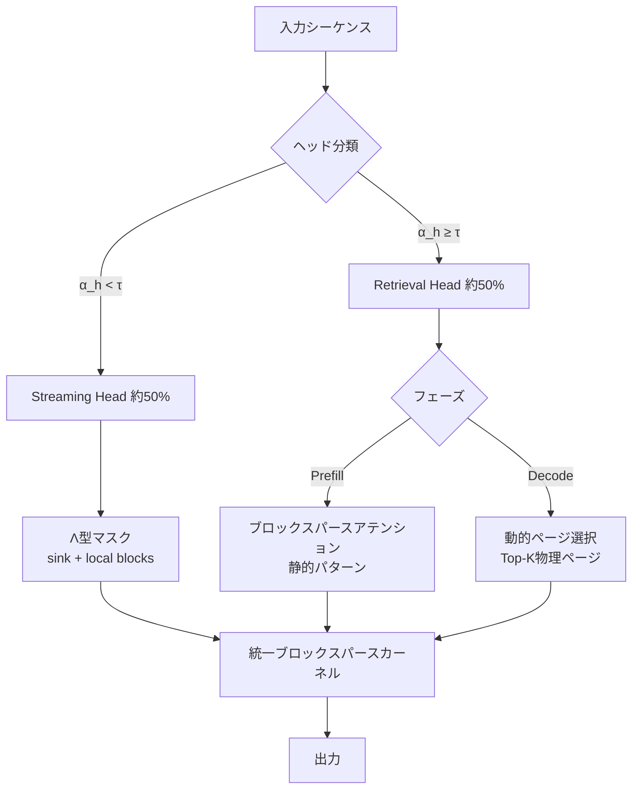

## 論文概要

本記事は [LServe (arXiv 2502.14866)](https://arxiv.org/abs/2502.14866) の解説記事です。LServeは、長文脈LLM推論におけるprefillおよびdecodeの両フェーズを**統一的なブロックスパースアテンション**で高速化するシステムである。静的スパーシティ（Streaming Head分類）と動的スパーシティ（クエリ依存ページ選択）を直交的に組み合わせることで、vLLMに対してprefillで最大2.9倍、decodeで1.3〜2.1倍の高速化を達成しつつ、LongBenchやRULERなどのベンチマークで長文脈精度を維持する手法を著者らは提案している。

## 情報源

- **論文タイトル**: LServe: Efficient Long-sequence LLM Serving with Unified Sparse Attention
- **arXiv ID**: [2502.14866](https://arxiv.org/abs/2502.14866)
- **著者**: Shang Yang\*, Junxian Guo\*（共同筆頭）, Haotian Tang, Qinghao Hu, Guangxuan Xiao, Jiaming Tang, Yujun Lin, Zhijian Liu, Yao Lu, Song Han（責任著者）
- **所属**: MIT, 上海交通大学（SJTU）, NVIDIA
- **会議**: MLSys 2025 採択
- **コード**: [github.com/mit-han-lab/omniserve](https://github.com/mit-han-lab/omniserve)（Apache-2.0）

## 背景と動機

長文脈LLM（128K〜1Mトークン）の推論では2つのボトルネックが存在する。第一に、**prefillフェーズ**ではアテンション計算がシーケンス長の二乗に比例し、128Kトークンの処理に数十秒を要する。第二に、**decodeフェーズ**ではKVキャッシュの読み出しがメモリ帯域を圧迫し、トークンあたりのレイテンシが文脈長に線形比例して増加する。

既存手法はこれらの問題に個別に対処していた。MInferenceはprefillの動的スパーシティに注力し、Questはdecodeのページ選択に特化していた。しかし、著者らは「静的スパーシティと動的スパーシティは直交する最適化であり、統一フレームワークで組み合わせることで乗算的な高速化が得られる」と主張している。さらに、既存手法はページサイズの制約（Questはページサイズ16でしか動作しない）や、GQAアーキテクチャへの非対応といった実用上の課題を抱えていた。

## 主要な貢献

1. **静的・動的スパーシティの統一**: prefillとdecodeの両フェーズにわたるスパースアテンションパターンを、単一のブロックスパース抽象化に統合した初のフレームワーク
2. **階層的ページング（Hierarchical Paging）**: 論理ページ（細粒度の重要度推定用）と物理ページ（GPU帯域効率用）を分離し、ページサイズジレンマを解決
3. **高効率CUDAカーネル**: イテレータベースのブロックスパースカーネルにより、同一スパーシティレベルでMInferenceに対して1.3倍の高速化を達成
4. **量子化との直交的統合**: QServe（W4A8KV4）との組み合わせにより、256Kコンテキストで最大7.7倍のエンドツーエンド高速化を実現

## 技術的詳細

### 静的スパーシティ: Column Sparsity（Streaming Head分類）

LServeの静的スパーシティは、アテンションヘッドを**Retrieval Head**と**Streaming Head**の2種類に分類する。DuoAttentionの手法に基づき、各ヘッド $h$ に対してゲート値 $\alpha_h \in [0, 1]$ を学習する。閾値 $\tau$（スパーシティ量子点で決定）と比較し、$\alpha_h < \tau$ のヘッドをStreaming Headに分類する。

Streaming Headは**Λ型（ラムダ型）マスク**を適用し、各トークンは初期トークン（attention sink）と直近の局所トークンのみに注意を向ける。これにより計算量は文脈長に依存しない定数となる。著者らは全ヘッドの約50%をStreaming Headに変換しても精度劣化が最小限であると報告している。

### 動的スパーシティ: Token Sparsity（クエリ依存ページ選択）

Retrieval Headに対しては、実行時にクエリベクトルに基づいて重要なKVページを動的に選択する。各論理ページ $j$ の重要度スコアは以下で計算される:

$$
S^j = \sum_{i=1}^{D} \max\bigl(q[i] \cdot k_{\max}^{j}[i],\; q[i] \cdot k_{\min}^{j}[i]\bigr)
$$

ここで $q[i]$ はクエリベクトルの $i$ 番目のチャネル、$k_{\max}^{j}[i]$ および $k_{\min}^{j}[i]$ は論理ページ $j$ 内のキーベクトルのチャネル方向min/max統計量、$D$ はヘッド次元数である。この上界推定により、内積の大きいページを効率的に特定する。

### 階層的ページング

物理ページサイズ $N_P$ と論理ページサイズ $N_L$ を分離し、$N_P = g \cdot N_L$（$g$ は整数）の関係を維持する。物理ページの重要度は、含まれる論理ページのスコアの**max-reduction**で決定する。これにより、GPU帯域に最適な大きな物理ページ（64〜128トークン）を使いつつ、細粒度（16トークン）の重要度判定を実現する。

### 統一ブロックスパースアテンション

以下の図は、LServeがprefillとdecodeの両フェーズでスパーシティをどのように適用するかを示す。



ブロックスパーシティ率 $r$ のとき、理論的な高速化率は $\frac{1}{1-r}$ となる。例えば、21ブロック中10ブロックが非空の場合、理論高速化率は2.1倍である。

### Reusable Page Selection

デコード時のページ選択オーバーヘッドを削減するため、連続する $k$ トークン（デフォルト $k=4$）で同一のページ選択結果を再利用する。著者らはRULER 64Kベンチマークで再利用間隔4の場合、精度劣化が0.6ポイント（86.2→85.6）に留まることを報告している（Table 6）。

## 実装のポイント

### omniserveリポジトリの構成

LServeは[OmniServe](https://github.com/mit-han-lab/omniserve)フレームワークの一部として公開されている。OmniServeはQServe（量子化）とLServe（スパースアテンション）を統合した推論エンジンである。

```bash
# 環境構築
git clone https://github.com/mit-han-lab/omniserve.git
cd omniserve
conda create -n omniserve python=3.10 -y
conda activate omniserve
pip install -e .
pip install flash-attn --no-build-isolation

# Block-Sparse-Attentionのインストール（プリビルトホイールまたはソースから）
# CUDAカーネルのコンパイル
cd kernels && python setup.py install
```

### ベンチマーク実行

```bash
# LServe単体のベンチマーク
bash scripts/lserve_benchmark/launch.sh

# 精度評価（Needle-in-a-Haystack）
bash eval/scripts/needle/submit_niah.sh

# 精度評価（LongBench）
bash eval/scripts/LongBench/submit_longbench.sh
```

### 対応モデル

QServeのModel Zoo経由でW4A8量子化済みチェックポイントが提供されている。Llama-2/3（7B〜70B）、Qwen-72B、Yi-34B、Mistral-7Bなどが利用可能である。アテンションパターン設定は `attn_patterns/` ディレクトリに格納されている。

## Production Deployment Guide

### AWS実装パターン

LServeを本番環境でデプロイする際の3つの構成パターンを示す。

#### Small構成: 単一GPU推論（月額 約$1,200）

8B級モデルの推論に適した最小構成。

| リソース | スペック |
|---------|---------|
| インスタンス | g5.2xlarge（A10G 24GB × 1） |
| モデル | Llama-3-8B（W4A8KV4） |
| 最大文脈長 | 64Kトークン |
| スループット | 約1,500 tokens/s（バッチ128） |

```hcl
# terraform/small/main.tf

terraform {
  required_providers {
    aws = {
      source  = "hashicorp/aws"
      version = "~> 5.0"
    }
  }
}

provider "aws" {
  region = "us-east-1"
}

resource "aws_ecs_cluster" "lserve" {
  name = "lserve-cluster"

  setting {
    name  = "containerInsights"
    value = "enabled"
  }
}

resource "aws_ecs_task_definition" "lserve_small" {
  family                   = "lserve-small"
  requires_compatibilities = ["EC2"]
  network_mode             = "awsvpc"

  container_definitions = jsonencode([{
    name  = "lserve"
    image = "ghcr.io/mit-han-lab/omniserve:latest"
    gpu   = 1

    environment = [
      { name = "MODEL_PATH", value = "/models/Llama-3-8B-QServe" },
      { name = "PRECISION", value = "w4a8kv4" },
      { name = "MAX_NUM_BATCHED_TOKENS", value = "65536" },
      { name = "MAX_NUM_SEQS", value = "64" }
    ]

    portMappings = [{
      containerPort = 8000
      protocol      = "tcp"
    }]

    logConfiguration = {
      logDriver = "awslogs"
      options = {
        "awslogs-group"         = "/ecs/lserve"
        "awslogs-region"        = "us-east-1"
        "awslogs-stream-prefix" = "small"
      }
    }

    mountPoints = [{
      sourceVolume  = "model-cache"
      containerPath = "/models"
    }]
  }])

  volume {
    name = "model-cache"
    efs_volume_configuration {
      file_system_id = aws_efs_file_system.models.id
    }
  }
}

resource "aws_efs_file_system" "models" {
  creation_token = "lserve-models"
  encrypted      = true

  tags = {
    Name = "lserve-model-storage"
  }
}
```

#### Medium構成: マルチGPU推論（月額 約$5,500）

| リソース | スペック |
|---------|---------|
| インスタンス | p4d.24xlarge（A100 80GB × 8） |
| モデル | Llama-3-70B（W4A8KV4、テンソル並列4） |
| 最大文脈長 | 128Kトークン |
| スループット | 約3,000 tokens/s（バッチ256） |

Small構成との主な差分は `gpu = 4`、`TENSOR_PARALLEL_SIZE = 4`、`MAX_NUM_BATCHED_TOKENS = 262144` の設定と、ECS Application Auto Scalingの追加（GPU使用率70%をターゲットにmin=1/max=4でスケール）である。

#### Large構成: マルチノード推論（月額 約$22,000）

| リソース | スペック |
|---------|---------|
| インスタンス | p4d.24xlarge × 4ノード |
| モデル | 複数モデル並列運用 |
| 最大文脈長 | 256Kトークン |
| LB | Application Load Balancer（内部ALB + HTTPS） |

Large構成ではALBによるヘルスチェック（`/health`エンドポイント、30秒間隔）とTLS 1.3終端を追加する。モデルごとにターゲットグループを分離し、パスベースルーティングで複数モデルを単一エンドポイントから提供可能である。

### 運用・監視設定

#### CloudWatch 監視項目とアラーム

LServe推論サービスで監視すべき4つのメトリクスとアラーム閾値を以下に示す。

| メトリクス | Namespace | 推奨閾値 | アラーム条件 |
|-----------|-----------|---------|-------------|
| GPU Utilization | CWAgent | - | 情報用（ダッシュボード表示） |
| Request Latency p99 | LServe（カスタム） | 5,000ms | 3期間連続超過でSNS通知 |
| Throughput (tokens/s) | LServe（カスタム） | - | 情報用（容量計画） |
| GPU Memory Usage | CWAgent | 90% | 2期間連続超過でSNS通知 |

```hcl
# terraform/monitoring/cloudwatch.tf（アラーム例）

resource "aws_cloudwatch_metric_alarm" "high_latency" {
  alarm_name          = "lserve-high-latency"
  comparison_operator = "GreaterThanThreshold"
  evaluation_periods  = 3
  metric_name         = "request_latency_p99"
  namespace           = "LServe"
  period              = 60
  statistic           = "Average"
  threshold           = 5000
  alarm_description   = "LServe p99 latency exceeds 5s"
  alarm_actions       = [var.sns_topic_arn]
  dimensions          = { Service = "inference" }
}
```

#### カスタムメトリクス送信（アプリケーション側）

```python
"""LServe推論メトリクスをCloudWatchに送信するサイドカー."""

import time
from typing import Final

import boto3

NAMESPACE: Final[str] = "LServe"
FLUSH_INTERVAL_SEC: Final[int] = 60


class MetricsPublisher:
    """CloudWatch カスタムメトリクスのバッチ送信."""

    def __init__(self, region: str = "us-east-1") -> None:
        self._client = boto3.client("cloudwatch", region_name=region)
        self._buffer: list[dict] = []

    def record_latency(self, latency_ms: float, context_length: int) -> None:
        """推論レイテンシを記録する."""
        self._buffer.append({
            "MetricName": "request_latency_p99",
            "Value": latency_ms,
            "Unit": "Milliseconds",
            "Dimensions": [
                {"Name": "Service", "Value": "inference"},
                {"Name": "ContextLength", "Value": str(context_length)},
            ],
        })

    def record_throughput(self, tokens_per_sec: float) -> None:
        """スループットを記録する."""
        self._buffer.append({
            "MetricName": "tokens_per_second",
            "Value": tokens_per_sec,
            "Unit": "Count/Second",
            "Dimensions": [
                {"Name": "Service", "Value": "inference"},
            ],
        })

    def flush(self) -> None:
        """バッファ内のメトリクスをCloudWatchに送信する."""
        if not self._buffer:
            return
        # CloudWatch PutMetricData は1回あたり最大1000件
        for i in range(0, len(self._buffer), 1000):
            self._client.put_metric_data(
                Namespace=NAMESPACE,
                MetricData=self._buffer[i : i + 1000],
            )
        self._buffer.clear()
```

### コスト最適化チェックリスト

| 項目 | 施策 | 期待削減率 |
|------|------|-----------|
| インスタンス費用 | Reserved Instances（1年）またはSavings Plans | 30-40% |
| スポットインスタンス | バッチ推論ワークロードにSpot利用 | 60-70% |
| モデルサイズ | W4A8KV4量子化で必要GPU数を削減 | 50%（GPU数半減） |
| KVキャッシュ | LServeスパーシティでメモリ消費量を削減、バッチサイズ向上 | 20-30%（スループット向上） |
| アイドル時間 | ECSオートスケーリングで夜間/週末スケールイン | 40-50% |
| ストレージ | EFSでモデル共有、インスタンス間重複排除 | 10-20% |
| データ転送 | VPCエンドポイント経由でS3アクセス | 5-10% |

**コスト試算例（Small構成）**:
- オンデマンド: g5.2xlarge $1.212/h × 730h = **$885/月**
- Reserved（1年全前払い）: 約 **$560/月**
- EFS: 100GB × $0.30/GB = **$30/月**
- CloudWatch: **$15/月**
- 合計（Reserved）: 約 **$605/月**

## 実験結果

### prefill高速化

著者らはLlama-3-8B（GQA）およびLlama-2-7B（MHA）で評価を行っている。Llama-3-8Bにおいて、64Kコンテキストで約1.5倍、128Kで約2.0倍、256Kで最大2.9倍のprefill高速化をvLLMに対して達成したと報告されている（論文Figure 9）。MHAアーキテクチャのLlama-2-7Bでは平均1.8倍の高速化が得られている。

### decode高速化

Llama-3-8Bで平均1.5倍、Llama-2-7Bで平均2.0倍、Minitron-4Bで平均1.5倍のdecodeレイテンシ削減が報告されている。Questとの比較では、4K〜32Kトークンの範囲でprefillで1.5〜2.1倍、decodeで1.3〜1.5倍の高速化を示している（Table 5）。64Kトークン以上ではQuestがOOM（メモリ不足）となる場面でもLServeは動作している。

### 精度維持

LongBenchでの評価（Llama-3-8B）では、Dense基準の平均38.9に対してLServeは38.6と、0.3ポイントの劣化に留まっている（Table 4）。RULERベンチマークでは、4Kトークン予算・32Kコンテキストで91.0（Dense: 90.5）とDenseを上回る場合もある一方、256Kコンテキストでは75.7（Dense: 79.4）と3.7ポイントの精度低下が観測されている（Table 3）。Needle-in-a-Haystackテストでは256Kまでの全長でDense基準と同等の精度を維持している。

### 量子化との統合効果

QServe（W4A8KV4）との組み合わせでは、スパーシティが反復回数を削減し量子化が各反復のコストを削減するため、256Kコンテキストで最大7.7倍のエンドツーエンド高速化が達成されている（Figure 16）。

## 実運用への応用

LServeは以下のユースケースで特に効果的と考えられる。

**長文書RAGシステム**: 128K以上のコンテキストを扱うRAGパイプラインでは、prefill 2.0〜2.9倍の高速化によりTTFT（Time To First Token）を大幅に削減できる。関連するZenn記事「[vLLM疎アテンションで長文脈RAGのTTFTを最大9倍削減する実装ガイド](https://zenn.dev/0h_n0/articles/8328900aa76407)」では、vLLMの疎アテンション機能を活用した実装パターンが解説されている。LServeの階層的ページング機構は、このようなRAGワークロードにおける長文脈処理の基盤技術となっている。

**リアルタイムチャットボット**: decode 1.3〜2.1倍の高速化は、ユーザー体感のレスポンス改善に直結する。特にMHAモデルでの2.0倍高速化は顕著である。

**複雑推論タスク**: DeepSeek-R1-Distill-Llama-8BでのAIME@2024（43.3→43.3）およびMATH500（84.2→85.4）の結果は、推論精度を損なわない高速化が可能であることを示している。

ただし、256Kを超える超長文脈ではRULERスコアの低下（最大3.7ポイント）が見られるため、精度要件が厳しいタスクではトークン予算の増加（4K→8K）やDenseアテンションへのフォールバックを検討する必要がある。

## 関連研究

LServeは複数の先行研究を統合・拡張している。StreamingLLMはattention sinkの概念を提案したが静的マスクに限定されていた。H2Oはトークン重要度によるKVキャッシュ削減を行うがprefillは対象外であった。MInferenceはprefillの動的スパーシティに注力したが、著者らのカーネルは同一スパーシティで1.3倍高速と報告されている。QuestはMHA限定でページサイズ16の制約があり、GQAへの対応と階層的ページングでこれを克服している。DuoAttentionのStreaming Head分類手法を採用しつつ、GPU効率の高い統一カーネル実装とdecodeの動的スパーシティを追加した点がLServeの独自性である。

## まとめ

LServeは、静的スパーシティ（Streaming Head分類）と動的スパーシティ（クエリ依存ページ選択）を統一ブロックスパースフレームワークで結合し、階層的ページングによるページサイズジレンマの解決、量子化との直交的統合を実現した。vLLMに対してprefill最大2.9倍・decode 1.3〜2.1倍の高速化を達成しつつ、LongBenchで0.3ポイント以内の精度維持を報告している。256K以上の超長文脈での精度低下やモデルアーキテクチャ依存性といった制約はあるものの、長文脈LLM推論の実用化に向けた重要な基盤技術である。

## 参考文献

1. Yang, S., Guo, J., Tang, H., et al. "LServe: Efficient Long-sequence LLM Serving with Unified Sparse Attention." MLSys 2025. arXiv:2502.14866. [https://arxiv.org/abs/2502.14866](https://arxiv.org/abs/2502.14866)
2. OmniServe GitHub Repository. [https://github.com/mit-han-lab/omniserve](https://github.com/mit-han-lab/omniserve)
3. Lin, J., Tang, J., Tang, H., et al. "QServe: W4A8KV4 Quantization and System Co-design for Efficient LLM Serving." MLSys 2025.
4. Xiao, G., Tang, J., Zuo, J., et al. "DuoAttention: Efficient Long-Context LLM Inference with Retrieval and Streaming Heads." arXiv:2410.10819.
5. Jiang, H., et al. "MInference: Million-Token Long-Context Approximate Inference." 2024.
6. Tang, J., et al. "Quest: Query-Aware Sparsity for Efficient Long-Context LLM Inference." ICML 2024.
7. Xiao, G., et al. "Efficient Streaming Language Models with Attention Sinks." ICLR 2024.
8. Zhang, Z., et al. "H2O: Heavy-Hitter Oracle for Efficient Generative Inference of Large Language Models." NeurIPS 2023.
