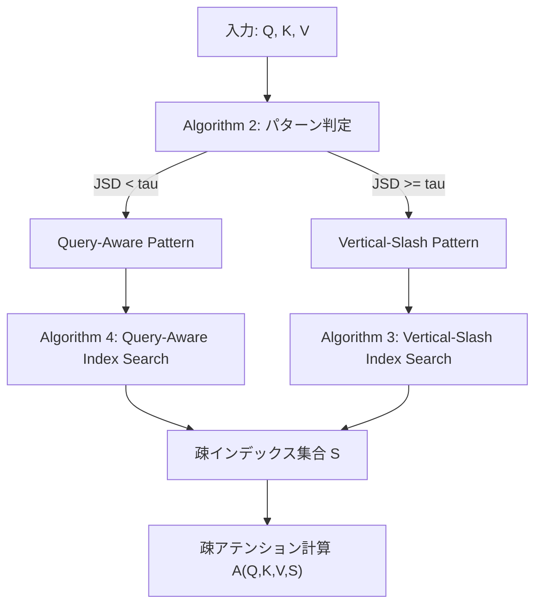

本記事は [FlexPrefill: A Context-Aware Sparse Attention Mechanism for Efficient Long-Sequence Inference (arXiv 2502.20766)](https://arxiv.org/abs/2502.20766) の解説記事です。

## 論文概要

FlexPrefillは、LLMの長文脈推論におけるprefillフェーズのアテンション計算を動的に疎化（スパース化）する手法である。従来の固定パターン疎アテンション手法（MInference等）がすべての入力・ヘッドに対して同一のスパーシティパターンを適用するのに対し、FlexPrefillは入力テキストとアテンションヘッドごとに適応的にパターンと計算量を決定する。著者らは、Jensen-Shannon divergence（JSD）によるパターン判定と、累積アテンションスコアに基づくインデックス選択の2つのメカニズムを提案し、RULERおよびInfiniteBenchにおいてフルアテンションと同等以上の精度を維持しつつ、prefill時間の大幅な削減を実現したと報告している。

この記事は [Zenn記事: vLLM疎アテンションで長文脈RAGのTTFTを最大9倍削減する実装ガイド](https://zenn.dev/0h_n0/articles/8328900aa76407) の深掘りです。

## 情報源

- **arXiv ID**: 2502.20766
- **URL**: [https://arxiv.org/abs/2502.20766](https://arxiv.org/abs/2502.20766)
- **著者**: Xunhao Lai, Jianqiao Lu, Yao Luo, Yiyuan Ma, Xun Zhou（ByteDance Seed / 北京大学）
- **発表**: ICLR 2025 **Oral**（採択率 1.77%）
- **分野**: cs.LG（機械学習）, cs.CL（計算言語学）
- **コード**: [https://github.com/ByteDance-Seed/FlexPrefill](https://github.com/ByteDance-Seed/FlexPrefill)（Apache 2.0）

## 背景と動機

LLMの推論において、prefillフェーズのアテンション計算はプロンプト長の二乗に比例する計算量を要する。128kトークンのコンテキストでは、この計算がTime to First Token（TTFT）のボトルネックとなる。

この問題に対し、FlashAttention-2はハードウェア効率を最適化するが計算量そのものは削減しない。StreamingLLMは直近のウィンドウとシンクトークンのみを保持するため長距離依存を失う。MInferenceはオフラインで各ヘッドの疎パターンをプロファイリングし推論時に適用するが、2つの根本的な問題を抱えている。

第一に、**アテンションパターンは入力依存である**。著者らは同一モデル・同一ヘッドでも、入力テキストやタスク種別によってアテンションの分布が大きく異なることを実験的に示している（論文 Figure 3）。固定パターンではこの多様性に対応できない。第二に、**最適な計算量（スパーシティ比率）もヘッドごと・入力ごとに異なる**。一律のbudget配分では、重要なヘッドに不足し不要なヘッドに過剰な計算を割り当ててしまう。

FlexPrefillはこの2つの問題を、パターン選択と計算量配分の両方を動的に決定するアプローチで解決する。

## 主要な貢献

- **Query-Aware Sparse Pattern Determination**: Jensen-Shannon divergenceにより各ヘッドのアテンション分布特性をリアルタイムに判定し、Query-Aware patternとVertical-Slash patternを適応的に切り替える
- **Cumulative-Attention Based Index Selection**: 累積アテンションスコアが閾値 $$ \gamma $$ を超えるまでの最小インデックス集合を選択し、ヘッドごとに異なる計算量を動的に割り当てる
- **入力・ヘッド・レイヤ横断の適応性**: 同一モデル内でもヘッドごと・レイヤごと・入力ごとに異なるパターンと計算量を適用できる初の手法
- **既存フレームワークとの統合**: HuggingFace Transformers、vLLMに対して`patch_model()` APIで非侵襲的に統合可能

## 技術的詳細

### 疎アテンションの定式化

標準的なアテンションに疎マスク $$ S $$ を導入する。

$$
A(Q, K, V, S) = \text{Softmax}\left(\frac{QK^\top}{\sqrt{d}} + M_S\right) V
$$

ここで $$ M_S[i,j] = 0 $$ if $$ (i,j) \in S $$、$$ M_S[i,j] = -\infty $$ otherwise である。$$ d $$ はヘッド次元、$$ S $$ は計算対象のインデックス集合を表す。FlexPrefillの目的は、出力品質を維持しつつ $$ \|S\| $$ を最小化することである。

### Algorithm全体像

FlexPrefillは3つのアルゴリズムから構成される。



### Step 1: パターン判定（Jensen-Shannon Divergence）

各ヘッドについて、アテンション分布が「構造化パターン（Vertical-Slash）」か「散在パターン（Query-Aware）」かを判定する。

まず、代表的なクエリ集合 $$ \hat{Q} = Q[-B:]$$（最後の $$ B $$ 個のクエリベクトル、$$ B $$ はblock\_size）を用いて、2種類のブロック単位アテンション分布を計算する。

**推定分布**（ブロック単位の近似）:

$$
\bar{a} = \text{softmax}\left(\frac{\text{avgpool}(\hat{Q}) \cdot \text{avgpool}(K)^\top}{\sqrt{d}}\right)
$$

**真の分布**（トークン単位のアテンションをブロック単位に集約）:

$$
\hat{a} = \text{sumpool}\left(\text{softmax}\left(\frac{\hat{Q} \cdot K^\top}{\sqrt{d}}\right)\right)
$$

この2つの分布間のJensen-Shannon divergenceを計算する。

$$
D_{JS}(\bar{a}, \hat{a}) = \sqrt{\frac{1}{2}\left(D_{KL}(\bar{a} \| m) + D_{KL}(\hat{a} \| m)\right)}
$$

ここで $$ m = \frac{\bar{a} + \hat{a}}{2} $$（2分布の平均）、$$ D_{KL} $$ はKullback-Leibler divergenceである。

**判定ロジック**: $$ D_{JS} < \tau $$ ならQuery-Aware pattern、$$ D_{JS} \geq \tau $$ ならVertical-Slash patternを選択する。直感的には、ブロック単位の近似（$$ \bar{a} $$）と真の分布（$$ \hat{a} $$）が近い場合（JSDが小さい場合）、アテンションはブロック単位で集中しておりQuery-Aware patternが有効である。逆にJSDが大きい場合、ブロック内部の細かい構造（vertical/slashパターン）が重要であり、Vertical-Slash patternを使う必要がある。

$$ \tau $$（閾値パラメータ）は全モデル共通で0.1に設定されている（論文 Table 2）。

### Step 2a: Vertical-Slash Index Search

構造化パターンのヘッドでは、代表クエリのアテンション行列 $$ \hat{A} = \text{softmax}(\hat{Q} K^\top / \sqrt{d}) $$ から、列方向（vertical）と対角方向（slash）のスコアを正規化して計算する。それぞれを降順にソートし、累積和が $$ \gamma $$ を超える最小の $$ k $$ 個を選択する。最終インデックス集合は $$ S = S_v \cup S_s $$ である。

### Step 2b: Query-Aware Index Search

散在パターンのヘッドでは、プール化したクエリ・キーで粗いアテンションマップ $$ \bar{A} $$ を計算し、スコア降順にソートして累積和が $$ \gamma $$ を超える最小のインデックス集合を選択する。

### gamma/tauパラメータの役割

| パラメータ | 役割 | 設定値 |
|-----------|------|--------|
| $$ \gamma $$ | 累積アテンション閾値。大きいほど精度重視、小さいほど速度重視 | 0.95（LLaMA, GLM）、0.9（Yi, Qwen2） |
| $$ \tau $$ | JSD閾値。パターン切替の感度を制御 | 0.1（全モデル共通） |
| block\_size | ブロックサイズ。プーリングの粒度 | 128 |
| min\_budget | 最小計算量。ヘッドの崩壊を防止 | 512（1024トークン以上を保証） |

$$ \gamma $$ を調整することで、精度と速度のトレードオフを連続的に制御できる点がFlexPrefillの重要な特徴である。

## 実装のポイント

FlexPrefillはPythonパッケージとして提供されており、`patch_model()` APIで既存モデルに非侵襲的に適用できる。

### HuggingFace Transformersでの使用

```python
import torch
from transformers import AutoModelForCausalLM, AutoTokenizer
from flex_prefill import patch_model

model = AutoModelForCausalLM.from_pretrained(
    "meta-llama/Llama-3.1-8B-Instruct",
    torch_dtype=torch.bfloat16,
    _attn_implementation="flash_attention_2",
).cuda()

tokenizer = AutoTokenizer.from_pretrained(
    "meta-llama/Llama-3.1-8B-Instruct"
)

config = {
    "block_size": 128,
    "flex_prefill_gamma": 0.95,  # 累積アテンション閾値
    "flex_prefill_tau": 0.1,     # JSD閾値
    "flex_prefill_min_budget": 512,
    "flex_prefill_max_budget": None,
}

# モデルにパッチを適用
patch_model(model, "flex_prefill", config)

inputs = tokenizer("長いプロンプト...", return_tensors="pt").to("cuda")
output = model.generate(**inputs, max_new_tokens=64)
```

### vLLMでの使用（実験的サポート）

```python
from vllm import LLM, SamplingParams
from flex_prefill import patch_model

model = LLM("meta-llama/Llama-3.1-8B-Instruct",
            enable_chunked_prefill=False, max_num_seqs=1)
patch_model(model, "flex_prefill", config)  # configは上記と同一
output = model.generate(["長いプロンプト..."], SamplingParams(max_tokens=64))
```

### 制約事項

- **バッチサイズ1のみ**: 現時点ではバッチサイズ1でのみ動作する
- **bf16限定**: bfloat16精度のみサポート。fp16やfp32では動作しない
- **Triton依存**: カーネルはTriton 3.0.0で実装されており、CUDAバージョンとの互換性に注意が必要
- **対応フレームワーク版**: torch==2.4.0、transformers==4.44.0、flash\_attn==2.6.3、vllm==0.5.4

## Production Deployment Guide

FlexPrefillを本番環境に導入する際の構成パターン、インフラコード、運用設定を示す。

### AWS構成パターン

| 構成 | ユースケース | 推論基盤 | 月額概算 |
|------|-----------|---------|---------|
| **Small** | PoC、月10万req、TTFT<10s | SageMaker g5.xlarge (1x A10G) | $1,000-1,350 |
| **Medium** | 本番、月100万req、TTFT<3s | ECS g5.2xlarge 2-4台 + ALB | $4,000-7,600 |
| **Large** | 高負荷、月1000万req、TTFT<1s | EKS g5.12xlarge 4-8ノード + Karpenter | $20,000-38,000 |

Small構成はSageMaker + API Gateway + ElastiCache (Redis)の最小セット。Large構成ではKarpenterによるGPUノードの自動プロビジョニングとSpot Instance活用でコストを最適化する。

### Terraform: Small構成（SageMaker）

```hcl
resource "aws_sagemaker_model" "flexprefill" {
  name               = "flexprefill-${var.environment}"
  execution_role_arn = aws_iam_role.sagemaker_exec.arn

  primary_container {
    image          = "763104351884.dkr.ecr.us-east-1.amazonaws.com/pytorch-inference:2.4.0-gpu-py311-cu124-ubuntu22.04-sagemaker"
    model_data_url = var.model_s3_uri
    environment = {
      SAGEMAKER_PROGRAM       = "inference.py"
      FLEX_PREFILL_GAMMA      = "0.95"
      FLEX_PREFILL_TAU        = "0.1"
      FLEX_PREFILL_MIN_BUDGET = "512"
    }
  }
}

resource "aws_sagemaker_endpoint_configuration" "flexprefill" {
  name = "flexprefill-config-${var.environment}"
  production_variants {
    variant_name           = "primary"
    model_name             = aws_sagemaker_model.flexprefill.name
    instance_type          = "ml.g5.xlarge"
    initial_instance_count = 1
  }
}

resource "aws_sagemaker_endpoint" "flexprefill" {
  name                 = "flexprefill-${var.environment}"
  endpoint_config_name = aws_sagemaker_endpoint_configuration.flexprefill.name
}

# Auto Scaling: TTFT増加時にスケールアウト
resource "aws_appautoscaling_target" "sagemaker" {
  max_capacity       = 3
  min_capacity       = 1
  resource_id        = "endpoint/${aws_sagemaker_endpoint.flexprefill.name}/variant/primary"
  scalable_dimension = "sagemaker:variant:DesiredInstanceCount"
  service_namespace  = "sagemaker"
}
```

### Terraform: Large構成（EKS + Karpenter）

```hcl
module "eks" {
  source  = "terraform-aws-modules/eks/aws"
  version = "~> 20.0"
  cluster_name    = "flexprefill-${var.environment}"
  cluster_version = "1.31"
  vpc_id     = module.vpc.vpc_id
  subnet_ids = module.vpc.private_subnets
  tags = { "karpenter.sh/discovery" = "flexprefill-${var.environment}" }
}

# Karpenter GPU NodePool: g5インスタンスをSpot/On-Demandで自動プロビジョニング
resource "kubectl_manifest" "gpu_nodepool" {
  yaml_body = yamlencode({
    apiVersion = "karpenter.sh/v1"
    kind       = "NodePool"
    metadata   = { name = "gpu-inference" }
    spec = {
      template = {
        spec = {
          requirements = [
            { key = "node.kubernetes.io/instance-type", operator = "In",
              values = ["g5.12xlarge", "g5.48xlarge"] },
            { key = "karpenter.sh/capacity-type", operator = "In",
              values = ["on-demand", "spot"] },
          ]
        }
      }
      limits     = { "nvidia.com/gpu" = 32 }
      disruption = { consolidationPolicy = "WhenEmptyOrUnderutilized", consolidateAfter = "60s" }
    }
  })
}
```

### 運用・監視設定

#### 監視設定

CloudWatchで以下の3種のアラームを設定する。

| アラーム | メトリクス | 閾値 | 用途 |
|---------|----------|------|------|
| TTFT p99 | ModelLatency (p99) | > 5,000ms、15分継続 | 品質劣化検知 |
| GPU使用率低下 | GPUUtilization (avg) | < 20%、30分継続 | スケールイン判断 |
| 5XXエラー率 | Invocation5XXErrors (sum) | > 10件/10分 | 障害検知 |

X-Rayトレーシングを推論コードに組み込み、tokenize / generate / decodeの各フェーズのレイテンシ内訳を可視化することを推奨する。

### コスト最適化チェックリスト

#### インスタンス・スケーリング

- [ ] GPUインスタンスタイプ選定（g5.xlarge: 1x A10G、g5.12xlarge: 4x A10G）
- [ ] Spot Instance利用可否の検討（中断耐性がある場合のみ）
- [ ] Reserved Instance / Savings Plansの適用検討（安定ワークロード向け）
- [ ] オートスケーリングのターゲット値を実測レイテンシに基づき設定
- [ ] スケールイン遅延の設定（フラッピング防止）
- [ ] 時間帯別スケジュールスケーリングの検討（夜間トラフィック減少時）

#### FlexPrefillパラメータ

- [ ] gammaを精度要件に合わせて調整（低gamma = 高速/低精度）
- [ ] min\_budgetの適切な設定（小さすぎるとヘッド崩壊）
- [ ] max\_budgetの設定で不要な計算を削減
- [ ] 128kトークン超リクエストへのタイムアウト設定

#### キャッシュ・ネットワーク

- [ ] 同一プロンプトのKVキャッシュ再利用
- [ ] Redisキャッシュのevictionポリシー設定
- [ ] 推論エンドポイントのprivate subnet配置
- [ ] S3/ECR向けVPC Endpoint設定（NAT Gateway費用削減）

#### 監視・運用

- [ ] TTFT p50/p95/p99アラーム
- [ ] GPU使用率低下アラーム（スケールイントリガ）
- [ ] 5XXエラー率アラーム
- [ ] Cost Explorer budgetアラート
- [ ] CloudWatch Logs保持期間の最適化
- [ ] X-Rayサンプリングレート調整（全トレースは高コスト）

## 実験結果

### RULER Benchmark

著者らはLLaMA-3.1-8B-Instruct、GLM-4-9B-Chat、Yi-9B-200K、Qwen2-7B-Instructの4モデルで評価を行っている。以下にLLaMA-3.1-8B-Instructの結果を示す（論文 Table 1より）。

| シーケンス長 | Full Attention | StreamingLLM | MInference | **FlexPrefill** |
|------------|---------------|-------------|-----------|----------------|
| 4k | 95.67 | 95.43 | 95.67 | 95.43 |
| 8k | 93.75 | 93.99 | 93.99 | 93.51 |
| 16k | 93.03 | 74.76 | 93.27 | **94.71** |
| 32k | 87.26 | 48.56 | 86.54 | **89.42** |
| 64k | 84.37 | 26.20 | 84.86 | 82.93 |
| 128k | 78.13 | 30.77 | 58.17 | **79.09** |
| **平均** | 88.70 | 61.62 | 85.42 | **89.18** |

FlexPrefillはフルアテンションの平均スコア88.70に対して89.18を達成し、フルアテンションを上回っている。特に128kトークンにおいてMInferenceが58.17まで劣化するのに対し、FlexPrefillは79.09を維持している点が顕著である。

Qwen2-7B-Instructでも同様の傾向が見られ、FlexPrefill（平均70.75）がフルアテンション（68.83）およびMInference（66.07）を上回ったと報告されている（論文 Table 1）。

### InfiniteBench

長文タスク（PassKey検索、数値検索、数学、コードデバッグ等）での評価結果を示す（論文 Table 1より、LLaMA-3.1-8B-Instruct）。

| メソッド | 平均スコア |
|---------|----------|
| Full Attention | 48.06 |
| StreamingLLM | 14.72 |
| MInference | 34.06 |
| **FlexPrefill** | **47.14** |

FlexPrefillはフルアテンション比で98.1%の精度を維持している。MInferenceが70.8%まで低下するのと対照的である。GLM-4-9B-Chatでは、FlexPrefill（44.83）がフルアテンション（41.98）を上回る結果も報告されている。

### 速度-精度トレードオフ

著者らは $$ \gamma $$ パラメータを変化させることで、同一モデル内で連続的に速度と精度のトレードオフを制御できることを示している（論文 Figure 4）。FlexPrefillは固定budget手法（MInference含む）と比較して、全てのレイテンシ域においてPareto最適に近い性能を達成している。

実験はすべてNVIDIA A100 80GB GPU 1基で実施されている。

## 実運用への応用

FlexPrefillは以下のユースケースで効果が期待される。

**RAGパイプライン**: 検索結果を大量にコンテキストに含めるRAGでは、プロンプト長が数万トークンに達することが一般的である。FlexPrefillにより、精度を維持しつつTTFTを削減できる。Zenn記事で解説されているvLLMの疎アテンション機能と組み合わせることで、本番環境でのRAG高速化が実現可能である。

**長文書分析**: 法律文書、論文、コードベース全体の分析など、128kトークン級の入力を扱う場面では、FlexPrefillの動的budget配分がMInferenceの固定パターンに対して大きな優位性を持つ。入力内容に応じてスパーシティが自動調整されるため、チューニング不要で多様なタスクに対応できる。

**マルチターン対話**: 長い対話履歴を保持するチャットボットでは、ターンが進むにつれてprefillコストが増大する。FlexPrefillの適応的スパーシティにより、対話履歴の長さに応じた効率的な計算が可能となる。

**制約と注意点**: 現時点ではバッチサイズ1のみサポートされており、高スループット推論サーバでのバッチ処理には対応していない。また、bf16限定のため、量子化モデル（GPTQ、AWQ等）との併用は不可である。デコーディングフェーズには適用されず、prefillフェーズのみの高速化である点も留意が必要である。

## 関連研究

**固定パターン手法**: BigBird（Zaheer et al., 2020）やLongformer（Beltagy et al., 2020）は訓練時にパターンを組み込むため、推論のみの適用は困難である。

**動的パターン手法**: StreamingLLM（Xiao et al., 2024）はsink token + local windowだが中間コンテキストを失う。MInference（Jiang et al., 2024）はオフラインプロファイリングでパターンを決定するが入力非依存である。FlexPrefillはパターン選択と計算量配分の双方を入力ごとに動的決定する点でこれらを包含する。

**ハードウェア最適化**: FlashAttention-2（Dao, 2024）は計算量を削減しない。FlexPrefillはFlashAttention-2上に構築されており、補完的な関係にある。

## まとめ

FlexPrefillは、LLM推論のprefillフェーズにおけるアテンション計算を、入力内容とヘッド特性に応じて動的に疎化する手法である。Jensen-Shannon divergenceによるパターン判定と、累積アテンションスコアによる計算量制御の2つのメカニズムにより、固定パターン手法の限界を克服している。RULERおよびInfiniteBenchにおいて、フルアテンションと同等以上の精度を維持しつつprefill時間を削減できることが示されている。ICLR 2025 Oralに採択された（採択率1.77%）ことからも、学術的評価の高さが窺える。現時点ではバッチサイズ1・bf16限定という制約があるものの、`patch_model()` APIによる導入の容易さと、gammaパラメータによる精度-速度トレードオフの連続的制御は、本番環境での長文脈LLM推論高速化において有望なアプローチである。

## 参考文献

1. Lai, X., Lu, J., Luo, Y., Ma, Y., & Zhou, X. (2025). FlexPrefill: A Context-Aware Sparse Attention Mechanism for Efficient Long-Sequence Inference. *ICLR 2025 (Oral)*. [arXiv:2502.20766](https://arxiv.org/abs/2502.20766)
2. Dao, T. (2024). FlashAttention-2: Faster Attention with Better Parallelism and Work Partitioning. *ICLR 2024*.
3. Jiang, H., et al. (2024). MInference 1.0: Accelerating Pre-filling for Long-Context LLMs via Dynamic Sparse Attention. *NeurIPS 2024*.
4. Xiao, G., et al. (2024). Efficient Streaming Language Models with Attention Sinks. *ICLR 2024*.
5. Zaheer, M., et al. (2020). Big Bird: Transformers for Longer Sequences. *NeurIPS 2020*.
6. Beltagy, I., Peters, M.E., & Cohan, A. (2020). Longformer: The Long-Document Transformer. *arXiv:2004.05150*.
7. ByteDance Seed. FlexPrefill GitHub Repository. [https://github.com/ByteDance-Seed/FlexPrefill](https://github.com/ByteDance-Seed/FlexPrefill)
