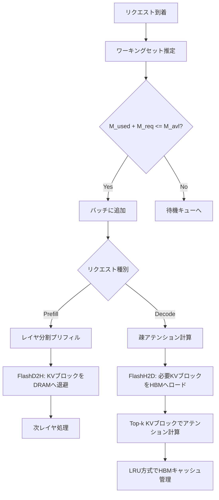

## 論文概要

本記事は [SparseServe (arXiv 2509.24626)](https://arxiv.org/abs/2509.24626) の解説記事です。SparseServeは、長文脈LLM推論における動的疎アテンション（Dynamic Sparse Attention, DSA）のシステムレベルの課題を解決するサービングフレームワークである。DSAはアテンション計算量を削減するが、未使用のKVキャッシュがGPU HBM上に残留し並列処理を制約するという新たなボトルネックを生む。著者らは階層的メモリ管理（HBM-DRAM間の効率的転送）、ワーキングセットに基づくバッチサイズ制御、レイヤ分割プリフィルの3技術を提案し、vLLM比でTTFTを最大9.26倍、トークンスループットを最大3.14倍改善したと報告している。

## 情報源

| 項目 | 内容 |
|------|------|
| arXiv ID | [2509.24626](https://arxiv.org/abs/2509.24626) |
| タイトル | SparseServe: Unlocking Parallelism for Dynamic Sparse Attention in Long-Context LLM Serving |
| 著者 | Qihui Zhou, Peiqi Yin, Pengfei Zuo, James Cheng (The Chinese University of Hong Kong, Huawei Cloud) |
| 投稿日 | 2025年9月 |
| 分野 | cs.DC (Distributed, Parallel, and Cluster Computing) |
| ライセンス | CC BY-NC-SA 4.0 |

## 背景と動機

長文脈LLM推論ではアテンション計算がコンテキスト長に対し二次的に増大する。動的疎アテンション（DSA）はKVキャッシュをブロック単位で分割し、重要度の高いブロックのみを選択して計算する「select-then-compute」パラダイムで計算量を削減する。

しかしDSAをサービング環境に適用すると3つのシステム課題が生じる。第一に、未選択のKVブロックもHBM上に保持する必要がありバッチサイズ拡大が困難になる（論文Figure 1より、バッチサイズ2→6で2.07倍向上するが6→12で1.73倍低下）。第二に、KVブロックが小さく（LWM-7Bで16KB/ブロック）断片化により実効帯域幅が5GB/s未満に低下する。第三に、プリフィル時に全レイヤのKVキャッシュをHBMに保持する必要があり長プロンプト処理が制約される。

## 主要な貢献

1. **断片化対応KVキャッシュ転送（Fragmentation-Aware KV Cache Transfer）**: GPU直接ロード（FlashH2D）とCPU補助セーブ（FlashD2H）により、HBM-DRAM間の転送帯域を標準memcpy比で4倍以上に向上
2. **ワーキングセット対応バッチサイズ制御（Working-Set-Aware Batch Size Control）**: 過去のデコーディングステップにおけるKVブロック選択パターンを追跡し、HBMキャッシュスラッシングを防止する動的バッチ調整
3. **レイヤ分割プリフィル（Layer-Segmented Prefill）**: プリフィル処理をレイヤ単位で実行し、HBMフットプリントを単一レイヤ分に制約することで長プロンプトの効率的処理を実現
4. **vLLM上での統合実装**: 上記3技術をvLLMフレームワーク上に統合し、LWM-7BおよびLlama-3-8Bモデルで最大9.26倍のTTFT削減と最大3.14倍のスループット向上を達成

## 技術的詳細

### アーキテクチャ概要

SparseServeの全体構成を以下に示す。



### 断片化対応KVキャッシュ転送

DSAではKVキャッシュを32トークン単位のブロックに分割する。LWM-7Bの場合、1ブロックあたりのサイズは約16KBとなる。この小さなブロックをcudaMemcpyで個別に転送すると、PCIeの実効帯域幅は4〜6GB/s程度に低下する（論文Figure 4より）。

**FlashH2D（GPU直接ロード）**: UVA（Unified Virtual Addressing）でGPUカーネルからDRAM上のKVブロックに直接アクセスし、単一カーネルで並列ロードする。実効帯域幅20GB/s以上を達成する。

**FlashD2H（CPU補助セーブ）**: 連続KVテンソルをDRAMバッファへ一括コピー後、CPUスレッドが対応ブロックへ再配置する2段階方式で23GB/s以上を達成する。

### ワーキングセット対応バッチサイズ制御

連続するクエリトークンは類似したKVブロックを選択する傾向がある。これはクエリベクトル間のコサイン類似度が高いことに起因する。SparseServeはこの時間的局所性を活用し、過去 $w$ ステップ（デフォルト $w = 12$）で選択されたKVブロックの和集合をワーキングセットとして推定する。

ワーキングセットの推定に基づき、バッチスケジューラは以下の制約を満たすようにリクエストをバッチに追加する。

$$
M_{\text{used}} + M_{\text{req}} \leq M_{\text{avl}}
$$

ここで $M_{\text{used}}$ は現在のHBM使用量、$M_{\text{req}}$ はリクエストのワーキングセット推定サイズ、$M_{\text{avl}}$ は利用可能なHBMキャッシュ容量である。

論文Figure 8より、ウィンドウサイズを1から12に拡大するとオーバーラップ率は10.68%改善するが、12から16への拡大では0.31%の改善に留まると報告されている。

### レイヤ分割プリフィル

従来のチャンクドプリフィルは全レイヤのKVキャッシュをHBMに保持するが、レイヤ分割プリフィルはレイヤ単位で実行し、各イテレーションで1プリフィルレイヤとデコーディングを並行処理する。処理済みレイヤのKVブロックはFlashD2HでDRAMへ退避し、HBMを単一レイヤ分に制約する。レイヤ間の継続性はアクティベーション状態の保存・復元で保証する。

## 実装のポイント

SparseServeはvLLMフレームワーク上に構築されている。以下にワーキングセット推定の実装例を示す。

```python
from dataclasses import dataclass, field
from collections import deque


@dataclass
class WorkingSetEstimator:
    """過去wステップのKVブロック選択履歴からワーキングセットを推定する。

    Attributes:
        window_size: 追跡するデコーディングステップ数（デフォルト12）
        history: 各ステップで選択されたKVブロックIDの履歴
    """

    window_size: int = 12
    history: deque[set[int]] = field(default_factory=deque)

    def update(self, selected_block_ids: set[int]) -> None:
        """新しいデコーディングステップの選択結果を記録する。"""
        self.history.append(selected_block_ids)
        if len(self.history) > self.window_size:
            self.history.popleft()

    def estimate_working_set(self) -> set[int]:
        """過去wステップで選択されたKVブロックの和集合を返す。"""
        working_set: set[int] = set()
        for step_blocks in self.history:
            working_set |= step_blocks
        return working_set

    def estimate_hbm_usage_bytes(self, block_size_bytes: int = 16_384) -> int:
        """ワーキングセットのHBM使用量をバイト単位で推定する。"""
        return len(self.estimate_working_set()) * block_size_bytes
```

バッチスケジューラはこの推定値を用いて、HBM容量制約 $M_{\text{avl}}$ を超えないようにバッチサイズを動的に調整する。

## Production Deployment Guide

SparseServeの設計原則をAWSでの推論サービス構築に応用する。

### AWS実装パターン

| 規模 | 構成 | GPU/推論 | 月額コスト目安 |
|------|------|----------|---------------|
| Small (~100 req/日) | Lambda + Bedrock | なし（マネージド） | $50-150/月 |
| Medium (~1,000 req/日) | ECS Fargate + Bedrock | なし（マネージド） | $300-800/月 |
| Large (10,000+ req/日) | EKS + Spot GPU インスタンス | A10G/A100 | $2,000-5,000/月 |

**Small構成**: Lambda + Bedrock でリクエスト単位の従量課金。コールドスタート許容のバッチ処理向け。

**Medium構成**: ECS Fargate + Bedrock で常時稼働API。SparseServeの「ワーキングセット対応バッチ制御」をリクエスト同時実行数制御に応用可能。

**Large構成**: EKS上にvLLM + 疎アテンション推論サーバをデプロイ。Karpenterでg5/p4d GPUインスタンスをSpotで自動プロビジョニングし、SparseServeの階層メモリ管理をそのまま適用。

**コスト削減**: Spot（最大90%削減）、RI/Savings Plans（最大72%削減）、Bedrock Batch API（50%削減）、GPUインスタンスの右サイズ化（g5.xlarge: A10G 24GBで十分なワークロードにp4dを使わない）。

### Terraformインフラコード

#### Small構成（Lambda + Bedrock + DynamoDB）

```hcl
terraform {
  required_version = ">= 1.5"
  required_providers {
    aws = { source = "hashicorp/aws", version = "~> 5.0" }
  }
}

provider "aws" { region = "us-east-1" }

resource "aws_dynamodb_table" "inference_requests" {
  name         = "sparseserve-inference-requests"
  billing_mode = "PAY_PER_REQUEST"
  hash_key     = "request_id"
  range_key    = "created_at"
  attribute { name = "request_id"; type = "S" }
  attribute { name = "created_at"; type = "S" }
  ttl { attribute_name = "expires_at"; enabled = true }
}

resource "aws_iam_role" "lambda_exec" {
  name = "sparseserve-lambda-exec"
  assume_role_policy = jsonencode({
    Version = "2012-10-17"
    Statement = [{ Action = "sts:AssumeRole", Effect = "Allow",
      Principal = { Service = "lambda.amazonaws.com" } }]
  })
}

resource "aws_iam_role_policy" "lambda_policy" {
  name = "sparseserve-lambda-policy"
  role = aws_iam_role.lambda_exec.id
  policy = jsonencode({
    Version = "2012-10-17"
    Statement = [
      { Effect = "Allow", Action = ["bedrock:InvokeModel", "bedrock:InvokeModelWithResponseStream"],
        Resource = "arn:aws:bedrock:us-east-1::foundation-model/*" },
      { Effect = "Allow", Action = ["dynamodb:PutItem", "dynamodb:GetItem", "dynamodb:Query"],
        Resource = aws_dynamodb_table.inference_requests.arn },
      { Effect = "Allow", Action = ["logs:CreateLogGroup", "logs:CreateLogStream", "logs:PutLogEvents"],
        Resource = "arn:aws:logs:*:*:*" }
    ]
  })
}

resource "aws_lambda_function" "inference" {
  function_name = "sparseserve-inference"
  runtime       = "python3.12"
  handler       = "handler.lambda_handler"
  role          = aws_iam_role.lambda_exec.arn
  timeout       = 300
  memory_size   = 1024
  filename      = "lambda_package.zip"
  environment {
    variables = {
      DYNAMODB_TABLE = aws_dynamodb_table.inference_requests.name
      MODEL_ID       = "anthropic.claude-sonnet-4-20250514"
    }
  }
}

resource "aws_apigatewayv2_api" "api" {
  name          = "sparseserve-api"
  protocol_type = "HTTP"
}

resource "aws_apigatewayv2_integration" "lambda" {
  api_id             = aws_apigatewayv2_api.api.id
  integration_type   = "AWS_PROXY"
  integration_uri    = aws_lambda_function.inference.invoke_arn
  payload_format_version = "2.0"
}

resource "aws_apigatewayv2_route" "inference" {
  api_id    = aws_apigatewayv2_api.api.id
  route_key = "POST /inference"
  target    = "integrations/${aws_apigatewayv2_integration.lambda.id}"
}

resource "aws_apigatewayv2_stage" "default" {
  api_id      = aws_apigatewayv2_api.api.id
  name        = "$default"
  auto_deploy = true
}
```

#### Large構成（EKS + Karpenter + Spot GPU）

```hcl
module "eks" {
  source  = "terraform-aws-modules/eks/aws"
  version = "~> 20.0"
  cluster_name    = "sparseserve-cluster"
  cluster_version = "1.31"
  vpc_id     = module.vpc.vpc_id
  subnet_ids = module.vpc.private_subnets
  eks_managed_node_groups = {
    system = { instance_types = ["m5.large"], min_size = 2, max_size = 4, desired_size = 2 }
  }
}

resource "kubectl_manifest" "gpu_nodepool" {
  yaml_body = yamlencode({
    apiVersion = "karpenter.sh/v1"
    kind       = "NodePool"
    metadata   = { name = "gpu-spot" }
    spec = {
      template = { spec = {
        requirements = [
          { key = "karpenter.sh/capacity-type", operator = "In", values = ["spot", "on-demand"] },
          { key = "node.kubernetes.io/instance-type", operator = "In",
            values = ["g5.xlarge", "g5.2xlarge", "g5.4xlarge"] }
        ]
        nodeClassRef = { group = "karpenter.k8s.aws", kind = "EC2NodeClass", name = "gpu-nodes" }
      }}
      limits     = { cpu = "128", memory = "512Gi", "nvidia.com/gpu" = "8" }
      disruption = { consolidationPolicy = "WhenEmptyOrUnderutilized", consolidateAfter = "60s" }
    }
  })
}

resource "kubectl_manifest" "vllm_deployment" {
  yaml_body = yamlencode({
    apiVersion = "apps/v1"
    kind       = "Deployment"
    metadata   = { name = "vllm-sparseserve", namespace = "inference" }
    spec = {
      replicas = 2
      selector = { matchLabels = { app = "vllm-sparseserve" } }
      template = {
        metadata = { labels = { app = "vllm-sparseserve" } }
        spec = {
          containers = [{
            name  = "vllm"
            image = "vllm/vllm-openai:latest"
            args  = ["--model", "meta-llama/Llama-3-8B-262k",
                     "--max-model-len", "262144",
                     "--gpu-memory-utilization", "0.85",
                     "--kv-cache-dtype", "fp8",
                     "--token-budget", "2048"]
            resources = {
              limits   = { "nvidia.com/gpu" = "1", memory = "48Gi" }
              requests = { "nvidia.com/gpu" = "1", memory = "32Gi" }
            }
            ports = [{ containerPort = 8000 }]
            readinessProbe = { httpGet = { path = "/health", port = 8000 },
                               initialDelaySeconds = 120, periodSeconds = 10 }
          }]
          tolerations = [{ key = "nvidia.com/gpu", operator = "Exists", effect = "NoSchedule" }]
        }
      }
    }
  })
}
```

### 運用・監視設定

#### CloudWatch Logs Insights クエリ

```
# TTFT分布の監視（p50/p95/p99）
fields @timestamp, ttft_ms, model_id
| filter event = "inference_complete"
| stats percentile(ttft_ms, 50) as p50, percentile(ttft_ms, 95) as p95,
        percentile(ttft_ms, 99) as p99 by bin(1h)

# KVキャッシュヒット率の追跡
fields @timestamp, kv_cache_hit_ratio, hbm_usage_pct
| filter event = "kv_cache_metrics"
| stats avg(kv_cache_hit_ratio) as hit_ratio, max(hbm_usage_pct) as max_hbm by bin(5m)
```

#### CloudWatch アラーム・X-Ray・Cost Explorer

```hcl
resource "aws_cloudwatch_metric_alarm" "ttft_p99" {
  alarm_name          = "sparseserve-ttft-p99-high"
  comparison_operator = "GreaterThanThreshold"
  evaluation_periods  = 3
  metric_name         = "TTFT_P99"
  namespace           = "SparseServe/Inference"
  period              = 300
  statistic           = "Maximum"
  threshold           = 5000
  alarm_description   = "TTFT p99が5秒を超過"
  alarm_actions       = [aws_sns_topic.alerts.arn]
}

resource "aws_cloudwatch_metric_alarm" "gpu_memory" {
  alarm_name          = "sparseserve-gpu-memory-high"
  comparison_operator = "GreaterThanThreshold"
  evaluation_periods  = 2
  metric_name         = "GPUMemoryUtilization"
  namespace           = "SparseServe/Infrastructure"
  period              = 60
  statistic           = "Average"
  threshold           = 90
  alarm_description   = "GPU HBM使用率が90%を超過（スラッシング警戒）"
  alarm_actions       = [aws_sns_topic.alerts.arn]
}

resource "aws_ce_anomaly_monitor" "gpu_cost" {
  name              = "sparseserve-gpu-anomaly"
  monitor_type      = "DIMENSIONAL"
  monitor_dimension = "SERVICE"
}
```

X-Rayはプリフィル/デコード/KVキャッシュ転送の各段階をサブセグメントとして記録し、ボトルネックを可視化する。`aws_xray_sdk` の `patch_all()` で自動計測を有効化する。Cost Anomaly Detectionは日次でGPUコストの異常を検出し、閾値超過時にメール通知する。

### コスト最適化チェックリスト

**インフラ**: Spot GPU利用（最大90%削減） / RI・Savings Plans（最大72%削減） / Karpenter consolidationでアイドルノード回収 / 夜間・週末のスケジュールスケーリング / gp3 EBSボリューム（gp2比20%安価）

**モデル・推論**: KVキャッシュFP8量子化（HBM 50%削減） / トークンバジェット2,048設定（精度99%維持） / 短文脈リクエストの軽量モデルルーティング / Bedrock Batch API（50%削減） / Prefix caching活用

**ネットワーク**: VPCエンドポイント経由アクセス（NAT Gateway回避） / リージョン間転送最小化 / API Gatewayキャッシュで重複推論回避

**監視・運用**: CloudWatch Logs保持90日以内 / メトリクス解像度60秒 / Cost Anomaly Detection有効化 / 月次コストレビュー

**セキュリティ**: IAM最小権限 / Bedrock Invocationログ有効化 / API Gateway WAFルール適用

## 実験結果

評価環境はNVIDIA A100 40GB、256GB DRAM、PCIe Gen4。対象モデルはLWM-7B（1Mコンテキスト窓）とLlama-3-8B-262k、LongBenchデータセット（10タスク）を使用している。

**TTFT性能**（論文Figure 10より）: LWM-7Bモデル、リクエストレート0.125 req/sの条件で、SparseServeはvLLM比で9.26倍のTTFT削減を達成したと報告されている。

**トークンスループット**（論文Figure 11より）: SparseServeはvLLM比で最大3.14倍、疎アテンション付きvLLM（vLLM-S）比で最大2.93倍のスループット向上を達成している。

**各技術の寄与度**（論文Figure 13より）: LWM-7Bでの累積的なgoodput改善は以下の通りである。

| 技術の追加 | LWM-7B goodput倍率 | Llama-3-8B goodput倍率 |
|-----------|-------------------|----------------------|
| + 疎アテンション | 1.20x | 1.13x |
| + オフローディング | 1.33x | 1.12x |
| + 断片化対応転送 | 1.88x | 1.19x |
| + ワーキングセット制御 | 1.33x | 1.11x |
| + レイヤ分割プリフィル | 1.25x | 1.10x |
| **合計** | **5.00x** | **1.83x** |

**モデル精度**（論文Table 1より）: トークンバジェット2,048で両モデルともLongBench全データセットにおいてフルアテンション比99%の精度を維持している。

**制約**: 評価は単一GPU（A100 40GB）に限定されマルチGPU構成は未検証。TBTはvLLM比20%以内の増加が生じる（論文Figure 12より）。

## 実運用への応用

SparseServeの技術はRAGシステムでの長文脈推論に有効に適用できる。RAGでは検索チャンクをコンテキストに含めるため入力トークン数が数万に達し、TTFT がボトルネックとなる。レイヤ分割プリフィルにより長大なRAGコンテキストをレイヤ単位で処理し、デコーディングとの並行実行でスループットを向上させる。

ワーキングセット推定はRAGと相性がよい。関連度の高い少数チャンクに注意が集中するためKVキャッシュの疎性が高く、トークンバジェット2,048で精度99%を維持しつつTTFTを削減できる（論文Table 1より）。ただしRAGではコンテキストが動的に変化するため、Prefix cachingとの併用（共通プロンプトはキャッシュ再利用、検索結果部分のみ疎アテンション）が有効である。

## 関連研究

Quest、ArkVale、InfLLMはKVブロックの重要度推定精度に注力し、MagicPIG、TokenSelect、RetrievalAttentionはトークンレベル選択を行うが実行時オーバーヘッドが大きい。SparseServeはこれらと異なり、DSAのシステムレベル課題（メモリ管理、バッチスケジューリング、プリフィル処理）に焦点を当てた初のシステムであると著者らは主張している。FlexPrefill、LServe、Kascadeとの定量比較は今後の課題である。

## まとめと今後の展望

SparseServeは断片化対応転送、ワーキングセット対応バッチ制御、レイヤ分割プリフィルにより、vLLM比で最大9.26倍のTTFT削減と5.00倍のgoodput向上を達成したと報告されている。今後はマルチGPU対応、TBT抑制、FlexPrefill等との組み合わせ、学習ベースのワーキングセット予測が課題である。

## 参考文献

- **論文**: [SparseServe: Unlocking Parallelism for Dynamic Sparse Attention in Long-Context LLM Serving (arXiv 2509.24626)](https://arxiv.org/abs/2509.24626)
- **関連Zenn記事**: [vLLM疎アテンションで長文脈RAGのTTFTを最大9倍削減する実装ガイド](https://zenn.dev/0h_n0/articles/8328900aa76407)
