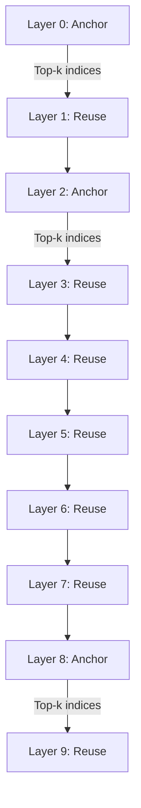

## 論文概要

本記事は [Kascade (arXiv 2512.16391)](https://arxiv.org/abs/2512.16391) の解説記事です。

Kascadeは、長文脈LLM推論におけるアテンション計算のレイテンシを削減するための、訓練不要（training-free）な疎アテンション手法である。著者らは、post-softmaxアテンション分布の高重みキーが隣接レイヤー間で安定的に共有されるという観測に基づき、少数の「アンカーレイヤー」でのみ正確なTop-k選択を行い、残りの「再利用レイヤー」ではそのインデックスを流用する方式を提案している。H100 GPU上でdecodeアテンションにおいて最大4.1倍、prefillアテンションにおいて最大2.2倍の高速化を、FlashAttention-3に対して達成したと報告されている。

この記事は [Zenn記事: vLLM疎アテンションで長文脈RAGのTTFTを最大9倍削減する実装ガイド](https://zenn.dev/0h_n0/articles/8328900aa76407) の深掘りです。

## 情報源

- **arXiv ID**: 2512.16391
- **URL**: [https://arxiv.org/abs/2512.16391](https://arxiv.org/abs/2512.16391)
- **著者**: Dhruv Deshmukh, Saurabh Goyal, Nipun Kwatra, Ramachandran Ramjee（Microsoft Research）
- **発表年**: December 2025
- **分野**: cs.LG, cs.CL
- **GitHub**: [https://github.com/microsoft/kascade](https://github.com/microsoft/kascade)（MIT License）

## 背景と動機

長文脈LLM推論において、アテンション計算はレイテンシの支配的要因となっている。RAGシステムでは数万〜数十万トークンのコンテキストを処理する必要があり、推論モデル（reasoning model）ではChain-of-Thought生成中にdecodeフェーズのアテンション計算が繰り返されるため、この問題は深刻化している。

既存の疎アテンション手法には複数の課題がある。固定パターン型（Sliding Window + Global tokens）はpre-training段階で組み込む必要があり、既存モデルへの後付けが困難である。動的スパーシティ型（Quest、H2O、SparQ等）はトークン選択の効率的な実行が未解決の課題として残る。また、レイヤー間の類似性を活用するOmniKVやLessIsMoreは、全ヘッドで共通のTop-kインデックスを使用するためヘッド固有のアテンションパターンを捉えきれず、アンカーレイヤーの選択も手動であるため新しいモデルへの展開が困難であった。

Kascadeはこれらの制約を、ヘッド別のTop-kインデックス管理と動的計画法によるアンカーレイヤー自動選択で解決することを目指している。

## 主要な貢献

- **訓練不要のレイヤー間スパーシティ再利用**: モデルの再訓練やfine-tuningなしに、既存LLMの推論を高速化する疎アテンション手法を提案
- **動的計画法によるアンカーレイヤー自動選択**: 開発データセット上でレイヤー間類似度を計算し、最適なアンカーレイヤー配置を自動決定するアルゴリズム（Algorithm 1）を提示。新しいモデルへの展開が容易
- **ヘッド別（head-aware）Top-k管理**: 従来手法が全ヘッドで共通のTop-kインデックスを使用していたのに対し、ヘッドごとに異なるTop-kインデックスを管理し、再利用時にはヘッドリマッピングで最も類似するアンカーレイヤーのヘッドから転用
- **prefill/decodeの両フェーズに対応する効率的なカーネル実装**: TileLangを用いたH100向けGPUカーネルにより、prefillではタイルレベルのpost-softmaxプーリング、decodeでは直接的なTop-kインデックス再利用を実現

## 技術的詳細

### アンカーレイヤーと再利用レイヤー

Kascadeの核心は、Transformerの全$L$レイヤーを「アンカーレイヤー」と「再利用レイヤー」に二分する設計にある。

**アンカーレイヤー**では、完全なアテンション計算を行い、post-softmax分布からTop-kインデックスを算出する。**再利用レイヤー**では、直前のアンカーレイヤーで得たTop-kインデックスをそのまま流用し、選択されたキーのみでアテンション計算を行う。

この方式が成立する根拠は、著者らが報告する以下の観測にある。レイヤー16のTop-256インデックスは、レイヤー17・18のTop-kアテンション質量の99%を捕捉し、隣接レイヤーペアの類似度スコアは0.98以上を維持するとされている（論文Section 3）。



上図はLlama-3.1-8B-Instructの場合を簡略化したものである。選択されたアンカーレイヤーは[0, 2, 8, 13, 14]の5レイヤーのみであり、残り27レイヤーは再利用レイヤーとして動作する（論文Section 4.3）。

### レイヤー間類似度とアンカーレイヤー選択

アンカーレイヤーの選択は、レイヤー間の類似度行列に基づく動的計画法で自動化される。

まず、レイヤー$a$からレイヤー$b$への類似度スコアを以下のように定義する。

$$
\text{sim}(a, b)_q = \frac{\sum_{i=1}^{k} P_q^b[I_q^a[i]]}{\sum_{i=1}^{k} P_q^b[I_q^b[i]]}
$$

ここで、
- $P_q^b$: レイヤー$b$におけるクエリ$q$のpost-softmaxアテンション分布
- $I_q^a$: レイヤー$a$におけるクエリ$q$のTop-kインデックス集合
- $k$: 選択するトークン数

この式は「レイヤー$a$のTop-kインデックスを使ったとき、レイヤー$b$のoracleアテンション質量のうちどれだけを回収できるか」を測定している。

さらに、各レイヤーの重要度で重み付けを行う。

$$
w_l = 1 - \text{CosineSim}(x_l, y_l)
$$

ここで$x_l$はレイヤー$l$の入力、$y_l$は出力である。入出力の差が大きいレイヤーほど重要度が高いと判断される。

### 動的計画法（Algorithm 1）

$M$個のアンカーレイヤーを$L$レイヤーから選択する問題を、以下の動的計画法で解く。

$$
\text{dp}[m][j] = \max_{i=m-1}^{j-1} \left( \text{dp}[m-1][i] + \sum_{l=i}^{j-1} S[i][l] \right)
$$

ここで、
- $\text{dp}[m][j]$: $m$個のアンカーレイヤーを使い、$j$番目のレイヤーまでカバーしたときの最大累積類似度
- $S[i][l]$: 重み付き類似度行列の要素
- $M$: アンカーレイヤー数（ハイパーパラメータ）

バックトラッキングにより最適なアンカーレイヤーの集合を復元する。計算量は$O(M \cdot L^2)$であり、オフラインで一度だけ実行すればよい。

### ヘッドリマッピング

Grouped Query Attention（GQA）環境では、アンカーレイヤーと再利用レイヤーのキーヘッド間に最適なマッピングが必要となる。再利用レイヤーの各キーヘッドに対して、アンカーレイヤー内で最も類似度の高いキーヘッドのTop-kインデックスを適用する。これにより、全ヘッドで共通のインデックスを使用する方式と比較して、特にTop-k比率が小さい場合にロバスト性が向上すると著者らは報告している（論文Figure 6）。

### Top-k設定

Top-kの値は以下の式で決定される。

$$
k = \min(\max(0.1 \cdot N, 128), N)
$$

ここで$N$はシーケンス長である。著者らの分析によると、k=256（コンテキスト長の約10%）で全アテンション質量の95%を捕捉できるとされている（論文Section 3.1）。

## 実装のポイント

Kascadeの公式実装はPython + TileLang（GPUカーネル）で提供されている。

```python
from kascade.model_utils import get_tokenizer_and_model
from kascade.strategies import EfficientKascadeStrategy

# モデルロード（fp16精度が必須）
model, tokenizer = get_tokenizer_and_model(
    "meta-llama/Meta-Llama-3.1-8B-Instruct",
    attn_implementation="sdpa",
    device="cuda",
)

# Kascade戦略の設定
strategy = EfficientKascadeStrategy(
    recompute_layers=[0, 2, 8, 13, 14],  # アンカーレイヤー
    model_name="meta-llama/Meta-Llama-3.1-8B-Instruct",
    k=10,            # Top-k比率（%）
    tile_size=32,     # decode用タイルサイズ
    rolling_prefill=True,  # prefill最適化
)

# 推論実行
output = strategy.generate(prompt, context)
```

**実装上の注意点**:

- **精度制約**: 効率的なカーネルはfp16精度で動作する。bf16やfp32は現時点では未対応
- **タイルサイズ**: decodeカーネルではtile_size=32が推奨。prefillでは128クエリ単位のタイルを使用
- **アンカーレイヤー選択の事前計算**: `eval_script.py --run_type select_layers`で開発データセット（MuSiQue、平均コンテキスト長2.3Kトークン）上の類似度行列からアンカーレイヤーを算出する。この計算は一度だけ実行すればよい
- **vLLM統合**: `vllm_integration`ブランチで実験的に提供されているが、Paged KV Cacheカーネルは開発中とのこと

```bash
# アンカーレイヤー選択の実行例
python scripts/eval_script.py \
  --model_name meta-llama/Meta-Llama-3.1-8B-Instruct \
  --dataset_name bdsaglam/musique \
  --subsets answerable \
  --num_queries 1000 \
  --strategies post_softmax_pooled_prefill_topk \
  --tile_size 32 \
  --run_type select_layers
```

## Production Deployment Guide

Kascadeは長文脈LLM推論の高速化手法であり、RAGシステムや推論モデルのデプロイにおいて実用的な価値を持つ。以下では、Kascadeを組み込んだLLM推論サービスのAWSデプロイメントパターンを示す。

### AWS実装パターン（コスト最適化重視）

Kascadeの主な適用先は長文脈LLM推論であり、GPU推論インスタンスが必須となる。以下の構成はH100/A100 GPUを前提とし、Kascadeによるアテンション高速化の恩恵を最大限に活用する。

| 構成 | トラフィック | GPUインスタンス | 月額概算 | 特徴 |
|------|------------|----------------|---------|------|
| Small | ~100 req/日 | p5.48xlarge x1 (Spot) | $5,000-8,000 | 単一インスタンス、Spot活用 |
| Medium | ~1,000 req/日 | p5.48xlarge x2-4 (Mixed) | $15,000-30,000 | ECS + Auto Scaling |
| Large | 10,000+ req/日 | p5.48xlarge x8+ (EKS) | $50,000-120,000 | EKS + Karpenter + Spot優先 |

**注意**: 上記は2026年6月時点のAWS ap-northeast-1（東京）リージョン料金に基づく概算値。実際のコストはトラフィックパターン、バースト使用量により変動する。最新料金は[AWS料金計算ツール](https://calculator.aws/)で確認を推奨する。

**コスト削減テクニック**:
- **Spot Instances**: p5.48xlargeのSpot価格はOn-Demandの最大70-90%削減。ただしGPUインスタンスはSpot中断リスクがあるため、ヘルスチェック+自動復旧が必須
- **Reserved Instances**: 1年コミットで最大40%、3年で最大60%削減
- **Kascade自体の効果**: decodeアテンション4.1倍高速化により、同一GPUリソースで処理可能なリクエスト数が増加し、インスタンス数を削減可能
- **バッチ推論**: リアルタイム性が不要な用途（記事要約等）ではバッチ処理でGPU稼働率を最大化

### Terraformインフラコード

**Small構成（単一GPU + Spot）**:

```hcl
# --- Small構成: 単一GPU Spot Instance + Kascade推論 ---

terraform {
  required_version = ">= 1.9"
  required_providers {
    aws = { source = "hashicorp/aws", version = "~> 5.80" }
  }
}

provider "aws" {
  region = "ap-northeast-1"
}

# VPC基盤（NAT Gateway不使用でコスト削減）
resource "aws_vpc" "main" {
  cidr_block           = "10.0.0.0/16"
  enable_dns_hostnames = true
  tags = { Name = "kascade-inference-vpc" }
}

resource "aws_subnet" "public" {
  vpc_id                  = aws_vpc.main.id
  cidr_block              = "10.0.1.0/24"
  map_public_ip_on_launch = true
  availability_zone       = "ap-northeast-1a"
  tags = { Name = "kascade-public" }
}

resource "aws_internet_gateway" "gw" {
  vpc_id = aws_vpc.main.id
}

resource "aws_route_table" "public" {
  vpc_id = aws_vpc.main.id
  route {
    cidr_block = "0.0.0.0/0"
    gateway_id = aws_internet_gateway.gw.id
  }
}

resource "aws_route_table_association" "public" {
  subnet_id      = aws_subnet.public.id
  route_table_id = aws_route_table.public.id
}

# IAMロール（最小権限）
resource "aws_iam_role" "inference" {
  name = "kascade-inference-role"
  assume_role_policy = jsonencode({
    Version = "2012-10-17"
    Statement = [{
      Action = "sts:AssumeRole"
      Effect = "Allow"
      Principal = { Service = "ec2.amazonaws.com" }
    }]
  })
}

resource "aws_iam_role_policy_attachment" "ssm" {
  role       = aws_iam_role.inference.name
  policy_arn = "arn:aws:iam::aws:policy/AmazonSSMManagedInstanceCore"
}

resource "aws_iam_instance_profile" "inference" {
  name = "kascade-inference-profile"
  role = aws_iam_role.inference.name
}

# セキュリティグループ（推論API用）
resource "aws_security_group" "inference" {
  name_prefix = "kascade-inference-"
  vpc_id      = aws_vpc.main.id

  ingress {
    from_port   = 8000
    to_port     = 8000
    protocol    = "tcp"
    cidr_blocks = ["10.0.0.0/16"]  # VPC内部のみ
  }

  egress {
    from_port   = 0
    to_port     = 0
    protocol    = "-1"
    cidr_blocks = ["0.0.0.0/0"]
  }
}

# Spot Fleet（GPU推論インスタンス）
resource "aws_spot_fleet_request" "inference" {
  iam_fleet_role                      = aws_iam_role.inference.arn
  target_capacity                     = 1
  terminate_instances_with_expiration = true
  valid_until                         = "2027-01-01T00:00:00Z"

  launch_specification {
    instance_type          = "p5.48xlarge"
    ami                    = data.aws_ami.deep_learning.id
    subnet_id              = aws_subnet.public.id
    vpc_security_group_ids = [aws_security_group.inference.id]
    iam_instance_profile   = aws_iam_instance_profile.inference.name
  }
}

# CloudWatchアラーム（GPU利用率監視）
resource "aws_cloudwatch_metric_alarm" "gpu_utilization" {
  alarm_name          = "kascade-gpu-low-utilization"
  comparison_operator = "LessThanThreshold"
  evaluation_periods  = 3
  metric_name         = "GPUUtilization"
  namespace           = "CWAgent"
  period              = 300
  statistic           = "Average"
  threshold           = 10
  alarm_description   = "GPU utilization below 10% for 15 min"
}

data "aws_ami" "deep_learning" {
  most_recent = true
  owners      = ["amazon"]
  filter {
    name   = "name"
    values = ["Deep Learning AMI GPU PyTorch *"]
  }
}
```

**Large構成（EKS + Karpenter + Spot）**:

```hcl
# --- Large構成: EKS + Karpenter + Spot優先 ---

module "eks" {
  source  = "terraform-aws-modules/eks/aws"
  version = "~> 20.31"

  cluster_name    = "kascade-inference"
  cluster_version = "1.31"
  vpc_id          = aws_vpc.main.id
  subnet_ids      = [aws_subnet.public.id]

  cluster_endpoint_public_access = false

  enable_cluster_creator_admin_permissions = true
}

# Karpenter Provisioner（Spot優先GPU）
resource "kubectl_manifest" "karpenter_nodepool" {
  yaml_body = yamlencode({
    apiVersion = "karpenter.sh/v1"
    kind       = "NodePool"
    metadata   = { name = "gpu-inference" }
    spec = {
      template = {
        spec = {
          requirements = [
            { key = "node.kubernetes.io/instance-type", operator = "In",
              values = ["p5.48xlarge", "p4d.24xlarge"] },
            { key = "karpenter.sh/capacity-type", operator = "In",
              values = ["spot", "on-demand"] },
          ]
          nodeClassRef = { name = "default" }
        }
      }
      limits   = { cpu = "384", "nvidia.com/gpu" = "32" }
      disruption = {
        consolidationPolicy = "WhenEmptyOrUnderutilized"
        consolidateAfter    = "30s"
      }
    }
  })
}

# AWS Budgets（月額予算アラート）
resource "aws_budgets_budget" "inference" {
  name         = "kascade-inference-monthly"
  budget_type  = "COST"
  limit_amount = "60000"
  limit_unit   = "USD"
  time_unit    = "MONTHLY"

  notification {
    comparison_operator       = "GREATER_THAN"
    threshold                 = 80
    threshold_type            = "PERCENTAGE"
    notification_type         = "ACTUAL"
    subscriber_email_addresses = ["ops@example.com"]
  }
}
```

### 運用・監視設定

**CloudWatch Logs Insights クエリ（推論レイテンシ分析）**:

```sql
-- Kascade推論レイテンシのP95/P99分析
fields @timestamp, decode_latency_ms, prefill_latency_ms, seq_len
| filter seq_len > 8192
| stats percentile(decode_latency_ms, 95) as p95_decode,
        percentile(decode_latency_ms, 99) as p99_decode,
        percentile(prefill_latency_ms, 95) as p95_prefill,
        avg(seq_len) as avg_seq_len
  by bin(1h) as hour
| sort hour desc
```

**CloudWatch アラーム設定（Python）**:

```python
import boto3

cloudwatch = boto3.client("cloudwatch", region_name="ap-northeast-1")

# 推論レイテンシ異常検知
cloudwatch.put_metric_alarm(
    AlarmName="kascade-decode-latency-high",
    MetricName="DecodeLatencyP99",
    Namespace="Kascade/Inference",
    Statistic="Maximum",
    Period=300,
    EvaluationPeriods=2,
    Threshold=50.0,  # ms
    ComparisonOperator="GreaterThanThreshold",
    AlarmActions=["arn:aws:sns:ap-northeast-1:ACCOUNT:ops-alerts"],
    AlarmDescription="Decode P99 latency exceeds 50ms for 10 min",
)
```

**X-Ray トレーシング設定**:

```python
from aws_xray_sdk.core import xray_recorder, patch_all

patch_all()

@xray_recorder.capture("kascade_inference")
def run_inference(prompt: str, context: str) -> str:
    """Kascade推論をX-Rayトレーシング付きで実行"""
    segment = xray_recorder.current_subsegment()
    segment.put_annotation("model", "llama-3.1-8b")
    segment.put_annotation("strategy", "kascade")

    output = strategy.generate(prompt, context)

    segment.put_metadata("seq_len", len(context.split()))
    segment.put_metadata("anchor_layers", [0, 2, 8, 13, 14])
    return output
```

**Cost Explorer自動レポート（Python）**:

```python
import boto3
from datetime import date, timedelta

ce = boto3.client("ce", region_name="ap-northeast-1")
sns = boto3.client("sns", region_name="ap-northeast-1")

def daily_cost_report() -> None:
    """日次コストレポートを取得し、閾値超過でSNS通知"""
    today = date.today()
    result = ce.get_cost_and_usage(
        TimePeriod={
            "Start": (today - timedelta(days=1)).isoformat(),
            "End": today.isoformat(),
        },
        Granularity="DAILY",
        Metrics=["UnblendedCost"],
        Filter={
            "Tags": {
                "Key": "Project",
                "Values": ["kascade-inference"],
            }
        },
    )
    cost = float(
        result["ResultsByTime"][0]["Total"]["UnblendedCost"]["Amount"]
    )
    if cost > 3000:
        sns.publish(
            TopicArn="arn:aws:sns:ap-northeast-1:ACCOUNT:cost-alerts",
            Subject="Kascade inference cost alert",
            Message=f"Daily cost: ${cost:.2f} exceeds $3,000 threshold",
        )
```

### コスト最適化チェックリスト

**アーキテクチャ選択**:
- [ ] トラフィック量に応じた構成選択（Small: 単一Spot / Medium: ECS / Large: EKS）
- [ ] Kascade高速化でインスタンス数削減（decode 4.1倍 → スループット向上で台数削減）

**リソース最適化**:
- [ ] EC2 GPU: Spot Instances優先（p5.48xlarge Spot割引 最大70-90%）
- [ ] Reserved Instances: 安定トラフィック分は1年コミットで40%削減
- [ ] Savings Plans: Compute Savings Plansで柔軟な割引
- [ ] Karpenter: GPU利用率低下時の自動スケールダウン（consolidateAfter: 30s）
- [ ] バッチ推論: 非リアルタイム用途でGPU稼働率最大化

**LLM推論コスト削減**:
- [ ] Kascade Top-k=10%設定でアテンション計算量90%削減
- [ ] KV Cache圧縮: 長文脈でのメモリ使用量最適化
- [ ] 動的バッチサイズ: シーケンス長に応じたバッチサイズ調整
- [ ] モデル選択: タスク難易度に応じた8B/70Bモデルルーティング

**監視・アラート**:
- [ ] AWS Budgets: 月額予算アラート（80%/100%閾値）
- [ ] CloudWatch: GPU利用率、推論レイテンシP95/P99
- [ ] Cost Anomaly Detection: 異常コストの自動検知
- [ ] 日次コストレポート: SNS通知付き

**リソース管理**:
- [ ] 未使用GPUインスタンスの自動停止（CloudWatch + Lambda）
- [ ] タグ戦略: Project/Environment/Owner タグ必須
- [ ] AMIライフサイクル: 古いDeep Learning AMIの定期クリーンアップ
- [ ] 開発環境: 業務時間外の自動停止（EventBridge Scheduler）
- [ ] EBSボリューム: 未アタッチボリュームの定期削除

## 実験結果

### LongBenchベンチマーク

著者らはLlama-3.1-8B-Instructを用いたLongBenchの結果を報告している（論文Table 1）。

| 手法 | SQA | MQA | Summ. | Fewshot | Synth. | Code | 平均 |
|------|-----|-----|-------|---------|--------|------|------|
| Dense (Baseline) | 48.43 | 43.18 | 25.99 | 63.22 | 34.83 | 59.89 | 45.92 |
| StreamingLLM | 24.83 | 25.05 | 22.41 | 56.33 | 12.00 | 59.89 | 33.42 |
| Quest | 46.97 | 42.82 | 25.71 | 62.33 | 34.14 | 54.36 | 44.39 |
| OmniKV | 48.22 | 43.05 | 25.97 | 63.22 | 34.72 | 59.33 | 45.75 |
| **Kascade** | 47.41 | 39.84 | 25.21 | 61.32 | 33.67 | 62.70 | 45.02 |

Kascadeは平均45.02でベースライン（45.92）に近い精度を維持しつつ、Questを上回る結果を示している。Codeタスクではベースラインを2.81ポイント上回る62.70を記録している点が特徴的である。

### AIME-24（推論タスク）

推論能力を測定するAIME-24ベンチマーク（論文Table 2）では、Kascadeの優位性がより顕著に現れている。

| 手法 | DeepSeek-R1-Distill-Llama-8B | Qwen3-8B |
|------|------------------------------|----------|
| Dense (Baseline) | 50.42 | 73.75 |
| StreamingLLM | 0.00 | 0.00 |
| Quest | 7.50 | 25.33 |
| LessIsMore | 36.25 | 60.83 |
| OmniKV | 39.58 | --- |
| **Kascade** | 47.92 | 70.42 |

著者らは、Top-k=10%の条件下でKascadeが既存手法に対して8-10ポイントの絶対的改善を達成したと報告している。特にQuestがAIME-24で大幅に精度低下する（7.50/25.33）のに対し、Kascadeはベースラインに近い精度を維持している。

### 速度ベンチマーク（H100 GPU）

論文Table 3より、H100 GPU上でのレイテンシ比較を示す。

**Decode（Top-k=10%）**:

| シーケンス長 | FlashAttention-3 | Kascade | 高速化 |
|-------------|-------------------|---------|--------|
| 8,192 | 0.70 ms | 0.24 ms | 2.91x |
| 131,072 | 11.68 ms | 2.83 ms | 4.12x |
| 524,288 | 21.85 ms | 5.33 ms | 4.10x |

**Prefill（Top-k=10%）**:

| シーケンス長 | FlashAttention-3 | Kascade | 高速化 |
|-------------|-------------------|---------|--------|
| 8,192 | 0.76 ms | 0.62 ms | 1.23x |
| 131,072 | 215.76 ms | 98.55 ms | 2.19x |
| 262,144 | 864.02 ms | 408.30 ms | 2.12x |

シーケンス長が長くなるほど高速化率が向上しており、131K以上のコンテキストでdecode 4.1倍、prefill 2.2倍の高速化が得られている。これは長文脈RAGやreasoning taskで特に有効であることを示唆している。

## 実運用への応用

Kascadeの実用的な適用先として、以下のシナリオが考えられる。

**RAGシステムの高速化**: 長文コンテキストを扱うRAGシステムでは、retrieverが返す複数ドキュメントを結合した入力が数万トークンに達する。Kascadeのdecode高速化により、TTFT（Time To First Token）およびトークン生成速度の大幅な改善が期待できる。Zenn記事で解説したvLLMの疎アテンション実装と組み合わせることで、エンドツーエンドの推論パイプライン全体を高速化できる。

**推論モデルのdecodeフェーズ**: DeepSeek-R1やQwen3のような推論モデルは、Chain-of-Thoughtで長大なdecodeを行う。AIME-24での結果が示すように、Kascadeはこのフェーズでのアテンションレイテンシを削減しつつ推論精度を維持する。

**制約と留意点**: Kascadeはアテンション計算のみを高速化するため、KV Cacheのメモリ使用量は削減されない。大バッチ処理ではメモリがボトルネックとなりうる。また、アーキテクチャ段階で疎アテンションを組み込んだモデル（Gemma等）では恩恵が限定的であると著者らは指摘している。

## 関連研究

- **FlashAttention-3** (Shah et al.): HBMアクセスを最適化した密アテンションカーネル。Kascadeのベースラインとして使用
- **Quest** (Tang et al.): ページレベルのKey重要度推定による動的疎アテンション。AIME-24での精度劣化が課題
- **OmniKV / LessIsMore**: レイヤー間のKV Cache共有を行う手法。全ヘッド共通のインデックスを使用するため、ヘッド固有パターンの捕捉が不十分
- **MInference**: prefillフェーズに特化した疎アテンション手法。Kascadeはprefill/decode両方に対応する点で汎用性が高い
- **SeerAttention**: 学習ベースのスパーシティ予測。Kascadeはtraining-freeである点で展開が容易

## まとめと今後の展望

Kascadeは、post-softmaxアテンション分布のレイヤー間安定性という観測に基づき、アンカーレイヤーでの正確なTop-k計算と再利用レイヤーでのインデックス流用を組み合わせた、実用的な疎アテンション手法である。動的計画法によるアンカーレイヤー自動選択とヘッド別インデックス管理により、新しいモデルへの展開が容易であり、H100上でdecode 4.1倍・prefill 2.2倍の高速化をFlashAttention-3に対して達成している。

今後の課題として、KV Cacheメモリ削減との統合、Paged KV Cacheカーネルの完成（vLLM統合の安定化）、およびより大規模なモデル（70B以上）への適用検証が挙げられる。

## 参考文献

- **arXiv**: [https://arxiv.org/abs/2512.16391](https://arxiv.org/abs/2512.16391)
- **Code**: [https://github.com/microsoft/kascade](https://github.com/microsoft/kascade)（MIT License）
- **Related Zenn article**: [vLLM疎アテンションで長文脈RAGのTTFTを最大9倍削減する実装ガイド](https://zenn.dev/0h_n0/articles/8328900aa76407)
