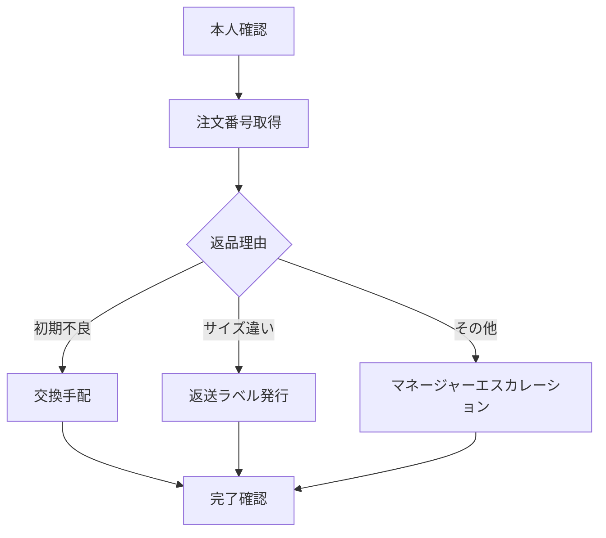
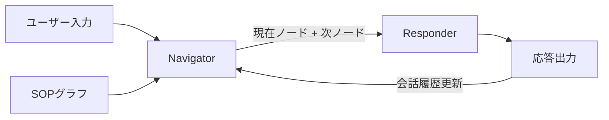

本記事は [arXiv:2601.00596](https://arxiv.org/abs/2601.00596) の解説記事です。

## 論文概要（Abstract）

Sumanth Balaji, Piyush Mishra, Aashraya Sachdeva, Suraj Agrawalらによる本論文は、カスタマーサポート（CS）エージェントのマルチターン対話能力を評価するベンチマーク「JourneyBench」を提案している。著者らは、既存のCSベンチマークが単一ターンの意図分類や回答品質に偏重しており、「顧客が問題解決に至るまでの全行程（ジャーニー）」を評価できていないと指摘している。JourneyBenchはSOP（Standard Operating Procedure）グラフを基盤とし、3ドメイン・703会話のデータセットと新規評価指標User Journey Coverage Score（UJCS）を提供する。

この記事は [Zenn記事: Gemini 3.5 Flash×階層型エピソード記憶でCSエージェントの応答精度を高める](https://zenn.dev/0h_n0/articles/60ad7eec7ce63c) の深掘りである。Zenn記事が「CSエージェントの記憶アーキテクチャ」に焦点を当てているのに対し、本論文は「CSエージェントの評価手法」を体系化する。記憶の改善がCSエージェントの実際の性能向上につながるかを検証する際に、JourneyBenchのような評価フレームワークが不可欠となる。

## 情報源

- **arXiv ID**: 2601.00596
- **URL**: [https://arxiv.org/abs/2601.00596](https://arxiv.org/abs/2601.00596)
- **著者**: Sumanth Balaji, Piyush Mishra, Aashraya Sachdeva, Suraj Agrawal
- **発表年**: 2026年1月
- **分野**: cs.CL / cs.AI

## 背景と動機（Background & Motivation）

既存のCSエージェント評価には以下の問題があると著者らは主張している。

**単一ターン偏重**: DSTC（Dialog State Tracking Challenge）やMultiWOZなどの既存ベンチマークは、意図分類、スロット充填、単一ターン応答品質を評価する。しかし実際のCS対話では、顧客が複数のステップを経て問題解決に至るプロセスが重要である。

**SOPとの乖離**: 企業のCSチームはSOPに基づいて対応するが、既存のベンチマークはSOPの遵守率を測定しない。エージェントが正しい回答を返しても、SOPで定められた確認手順（本人確認、注文番号確認など）をスキップしていれば、本番運用では不適切である。

**評価指標の不足**: BLEU、ROUGE、BERTScoreなどのテキスト類似度指標は、応答の表面的な品質は測れるが「顧客のジャーニーが完遂されたか」は測定できない。

## 主要な貢献（Key Contributions）

- **貢献1**: SOPグラフに基づくCSエージェント評価フレームワークの提案。SOPをDAG（有向非巡回グラフ）として形式化し、エージェントの応答がグラフのノードをどれだけカバーしたかを測定する
- **貢献2**: 3ドメイン（Eコマース、通信、金融）にわたる703会話のベンチマークデータセットの構築
- **貢献3**: 新規評価指標User Journey Coverage Score（UJCS）の提案。従来のターン単位の評価を超え、ジャーニー全体の完遂度を定量化する
- **貢献4**: Dual-Process Architecture（DPA）の提案と、Single-Process Architecture（SPA）に対する優位性の実証

## 技術的詳細（Technical Details）

### SOPグラフの形式化

著者らはSOPを有向非巡回グラフ $G = (N, E)$ として定義する。

- **ノード $N$**: SOPの各ステップ（例: 「本人確認」「注文番号取得」「返品理由ヒアリング」「返品処理実行」）
- **エッジ $E$**: ステップ間の遷移（条件分岐を含む）
- **必須ノード $N_r \subseteq N$**: スキップ不可の必須ステップ
- **条件ノード $N_c \subseteq N$**: 条件に応じて実行されるステップ

### User Journey Coverage Score（UJCS）

UJCSはエージェントの応答がSOPグラフのノードをどの程度カバーしたかを定量化する指標である。

$$
\text{UJCS} = \frac{|N_{\text{covered}} \cap N_{\text{expected}}|}{|N_{\text{expected}}|}
$$

ここで、
- $N_{\text{covered}}$: エージェントが実際に遂行したSOPノードの集合
- $N_{\text{expected}}$: 当該会話シナリオで期待されるSOPノードの集合（条件分岐を考慮）

UJCSの特徴：
- **0〜1の範囲**: 1.0は全ての期待ステップを完遂したことを示す
- **条件分岐対応**: 条件ノードは、条件が成立した場合のみ $N_{\text{expected}}$ に含まれる
- **順序考慮**: 著者らはノード間の順序制約もペナルティとして組み込むバリエーション（Ordered-UJCS）も提案している

### ノードカバレッジの判定

エージェントの応答テキストからSOPノードのカバレッジを判定する方法として、著者らはLLM-as-Judgeアプローチを採用している。GPT-4oをジャッジモデルとして、各ターンの応答が各SOPノードを満たしているかを判定する。

$$
\text{cover}(n, r_t) = \text{LLM-Judge}(n, r_t, \text{context}) \in \{0, 1\}
$$

ここで $n$ はSOPノード、$r_t$ はターン $t$ のエージェント応答である。

### Dual-Process Architecture（DPA）

著者らはCSエージェントのアーキテクチャとして、Dual-Process Architecture（DPA）を提案している。

**SPA（Single-Process Architecture）**: 1つのLLMが全てを処理。システムプロンプトにSOP全体を埋め込み、会話履歴とともにモデルに入力する。

**DPA（Dual-Process Architecture）**: 2つのプロセスに分離。
- **Process 1（Navigator）**: SOPグラフ上の現在位置を追跡し、次に遂行すべきノードを決定する
- **Process 2（Responder）**: Navigatorが指定したノードに基づき、顧客向けの応答を生成する

DPAの設計思想は、認知科学のDual-Process Theory（Kahneman, 2011）に着想を得ている。System 1（高速・直感的）に相当するNavigatorがSOPの遷移を管理し、System 2（低速・熟考的）に相当するResponderが応答を生成する。

## 実験結果（Results）

### DPA vs SPA 比較

著者らがJourneyBenchで報告している結果を以下に示す（論文Table 2より）。

| アーキテクチャ | UJCS | ターン効率 | SOP遵守率 |
|-------------|------|-----------|----------|
| **DPA** | **0.717** | **8.2ターン** | **0.83** |
| SPA | 0.564 | 11.5ターン | 0.61 |

DPAはSPAに対してUJCSで+15.3ポイント、ターン効率で28.7%の改善を示している。著者らは、SPAではSOPの長いテキストがコンテキスト内で「希釈」され、モデルが必須ステップをスキップする傾向があると分析している。一方、DPAのNavigatorはSOPグラフを構造化データとして保持するため、ステップの見落としが発生しにくい。

### ドメイン別結果

著者らが報告しているドメイン別のUJCS結果（論文Table 3より）：

| ドメイン | DPA UJCS | SPA UJCS | 会話数 | 平均SOPノード数 |
|---------|----------|----------|--------|---------------|
| Eコマース | 0.742 | 0.591 | 287 | 6.3 |
| 通信 | 0.698 | 0.549 | 231 | 7.8 |
| 金融 | 0.705 | 0.548 | 185 | 8.1 |

金融ドメインはSOPノード数が最も多く（平均8.1）、DPAの優位性が顕著に現れている。SOPが複雑になるほど、SPAではステップのスキップが増加する傾向が確認されている。

### エラー分析

著者らのエラー分析（論文Section 5.3より）では、SPAの主要なエラーパターンが以下のように分類されている。

- **ステップスキップ（42%）**: 必須ステップを飛ばして先に進む（例: 本人確認なしで返品処理）
- **ステップ順序逆転（23%）**: SOPで定められた順序に従わない
- **条件分岐誤り（19%）**: 条件に合わない分岐を選択する
- **冗長ステップ（16%）**: SOPにない不必要なステップを追加する

DPAではステップスキップが42%→12%に大幅に減少している。NavigatorがSOPグラフの現在位置を明示的に追跡することで、必須ステップの見落としを防止している。

## 実装のポイント（Implementation）

### SOPグラフの構築

JourneyBenchでは、SOPグラフは人手で作成されている。実運用で自動構築する場合、以下のアプローチが考えられる。

1. **既存SOP文書からの抽出**: LLMを用いてSOP文書（PDF/Wiki）からノードとエッジを抽出
2. **会話ログからのマイニング**: 過去の成功会話からSOPパターンを学習
3. **ハイブリッド**: 既存SOPを骨格とし、会話ログで条件分岐を補完

### Zenn記事との統合

Zenn記事の階層型エピソード記憶パターンとJourneyBenchのDPAは補完的な関係にある。

- **エピソード記憶 → Navigator**: 過去の対応履歴（エピソード記憶）をNavigatorに供給することで、顧客ごとの文脈を踏まえたSOP遷移が可能になる
- **セマンティック記憶 → Responder**: 顧客の長期的な傾向（セマンティック記憶）をResponderに供給することで、パーソナライズされた応答生成が可能になる

具体的には、LangGraphのステート管理にNavigatorの「現在SOPノード」を追加し、エピソード記憶検索の結果を条件分岐の判定に活用する設計が考えられる。

### UJCS評価の実装コスト

UJCSの計算にはLLM-as-Judgeが必要であり、1会話あたり（ターン数 × SOPノード数）回のLLM呼び出しが発生する。平均10ターン×7ノード=70回/会話となるため、703会話の全評価には約49,210回のLLM呼び出しが必要である。GPT-4oをジャッジに使う場合のコストは無視できない。著者らはこの点について、軽量モデルによるジャッジの精度検証を今後の課題として挙げている。

## 実運用への応用（Practical Applications）

### DPAパターンの本番適用

Zenn記事のLangGraphベースアーキテクチャにDPAを適用する場合、NavigatorノードとResponderノードを別々のLangGraphノードとして実装できる。

NavigatorにはGemini 3.5 Flashの`thinking_level=minimal`を、Responderには`thinking_level=medium`を適用することで、コストを最適化しつつSOPの遵守率を向上させる設計が可能である。

### UJCS指標の運用

JourneyBenchのUJCS指標は、本番CSエージェントのモニタリングに以下のように適用できる。

- **リアルタイムモニタリング**: 各会話のUJCSを計算し、閾値（例: 0.7）を下回った場合にアラートを発出
- **A/Bテスト**: 記憶アーキテクチャの変更前後でUJCSの統計的有意差を検定
- **エージェント品質レポート**: ドメイン別・SOPノード別のカバレッジヒートマップで弱点を可視化

## 関連研究（Related Work）

- **MultiWOZ (Budzianowski et al., 2018)**: マルチドメイン対話ベンチマーク。タスク指向対話のスロット充填と対話状態追跡を評価するが、SOPベースのジャーニー評価は含まない
- **DSTC (Dialog State Tracking Challenge)**: 対話状態追跡の標準ベンチマーク。単一ターンの状態推定に焦点を当てており、マルチターンのジャーニー完遂度は測定しない
- **τ-bench (Yao et al., 2024)**: ツール使用を含むエージェント対話ベンチマーク。JourneyBenchとは異なり、SOPグラフによる構造的評価ではなく、タスク成功率を指標とする

## まとめと今後の展望

JourneyBenchは、CSエージェントの評価をターン単位の品質測定からジャーニー全体の完遂度測定へと拡張した。UJCSによるSOP遵守率の定量化は、エージェントの記憶アーキテクチャ改善の効果検証に直接的に利用できる指標である。

著者らはDPAのUJCS 0.717について「SOPグラフの明示的な追跡がステップスキップを大幅に減少させる」と分析しているが、UJCS 1.0には遠く、特に条件分岐誤り（19%）の解消が課題として残されている。Zenn記事の階層型エピソード記憶によって顧客文脈を条件分岐判定に活用することで、この課題に対処できる可能性がある。

今後の課題として、著者らはSOPグラフの自動生成、軽量ジャッジモデルの検証、より多くのドメインへの拡張を挙げている。

## 参考文献

- **arXiv**: [https://arxiv.org/abs/2601.00596](https://arxiv.org/abs/2601.00596)
- **Related Zenn article**: [https://zenn.dev/0h_n0/articles/60ad7eec7ce63c](https://zenn.dev/0h_n0/articles/60ad7eec7ce63c)
