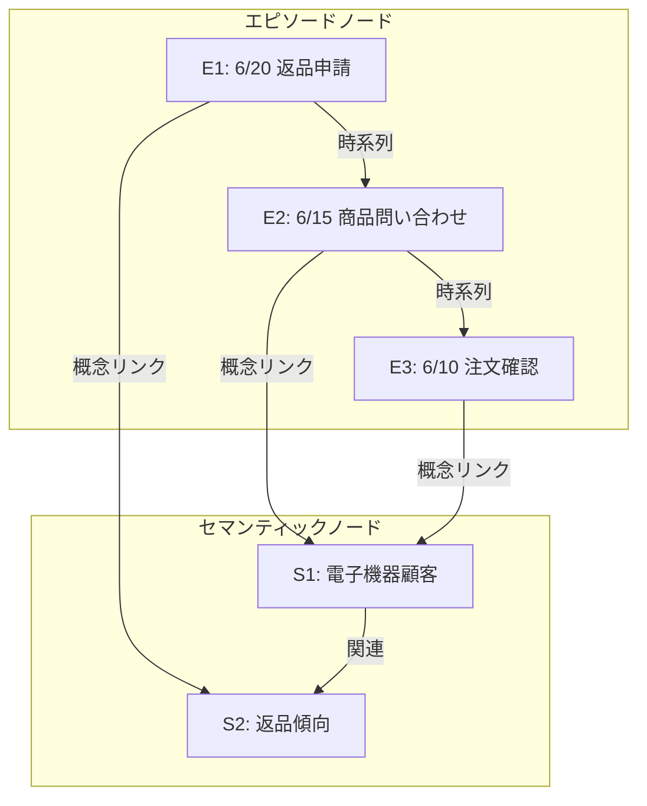

本記事は [arXiv:2601.02744](https://arxiv.org/abs/2601.02744) の解説記事です。

## 論文概要（Abstract）

Hanqi Jiang ら11名による本論文は、LLMエージェントのエピソード記憶とセマンティック記憶を動的グラフ上のSpreading Activationメカニズムで統合するアーキテクチャ「Synapse」を提案している。著者らは「a unified memory architecture that transcends static vector similarity」と述べ、従来のベクトル類似度ベースの検索から、グラフ上の活性化伝播による文脈的推論へのパラダイムシフトを主張している。LoCoMoベンチマーク（GPT-4o-mini）で平均F1 40.5を達成し、2位のベースラインより+7.2ポイント上回る結果が報告されている。

この記事は [Zenn記事: Gemini 3.5 Flash×階層型エピソード記憶でCSエージェントの応答精度を高める](https://zenn.dev/0h_n0/articles/60ad7eec7ce63c) の深掘りです。

## 情報源

- **arXiv ID**: 2601.02744
- **URL**: [https://arxiv.org/abs/2601.02744](https://arxiv.org/abs/2601.02744)
- **著者**: Hanqi Jiang, Junhao Chen, Yi Pan et al.（11名）
- **発表年**: 2026年1月（最終改訂: 2026年2月16日）
- **分野**: cs.CL

## 背景と動機（Background & Motivation）

既存のLLMエージェント記憶システム（MemGPT、Mem0、A-Mem等）は、記憶アイテムを独立したテキスト単位として扱い、ベクトル類似度で検索する方式が主流である。この方式ではマルチホップ推論や時系列推論において「Contextual Tunneling」——高接続ノードに引きずられて低接続の関連情報が埋もれる現象——が発生する。

著者らは認知科学のSpreading Activation理論（Collinsら, 1975）に着想を得て、記憶をノード間で活性化が伝播する動的グラフとしてモデル化した。これにより、事前計算されたリンクではなく、クエリ時に文脈に応じた関連性が動的に浮上するアーキテクチャを実現している。

Zenn記事で実装した「作業記憶→エピソード記憶→セマンティック記憶」の3層構造に対し、Synapseは同じ3層をグラフの2種類のノード（エピソードノードとセマンティックノード）として統合的に扱う点が設計上の重要な差異である。

## 主要な貢献（Key Contributions）

- **貢献1**: Spreading Activationに基づく動的記憶検索アルゴリズムを提案。ベクトル類似度、活性化スコア、PageRankの3信号を融合するTriple Hybrid Retrieval方式を実現
- **貢献2**: Lateral Inhibition（側方抑制）と Temporal Decay（時間減衰）により、競合ノードの抑制と時系列文脈の保持を同時に実現
- **貢献3**: LoCoMoベンチマークで全カテゴリ（マルチホップ、時系列、オープンドメイン等）においてState-of-the-Artを達成。トークン消費を従来手法の95%削減

## 技術的詳細（Technical Details）

### メモリグラフの構造

Synapseはメモリを有向グラフ $G = (V, E)$ として定義する。ノード集合 $V$ は2種類で構成される：

- **エピソードノード $V_E$**: 個別のインタラクションターンを表現。埋め込みベクトル、タイムスタンプ、テキストを保持する
- **セマンティックノード $V_S$**: 抽象概念を表現。$N=5$ ターンごとにLLMが抽出する

### Spreading Activation アルゴリズム

クエリが入力されると、類似度の高いノードに初期活性化が与えられ、グラフ上でイテレーティブに伝播する。

反復 $t+1$ におけるノード $i$ の生ポテンシャル：

$$
u_i(t+1) = (1 - \delta) \cdot a_i(t) + \sum_j \frac{S \cdot w_{ji} \cdot a_j(t)}{\text{fan}(j)}
$$

ここで、
- $\delta = 0.5$: 保持パラメータ（前回の活性化の減衰率）
- $S = 0.8$: 拡散係数（隣接ノードへの伝播強度）
- $\text{fan}(j)$: ノード $j$ の出次数（注意希釈）
- $w_{ji}$: エッジ重み。時間グラフ上では $w_{ji} = e^{-\rho |\tau_i - \tau_j|}$（$\rho = 0.01$、時間減衰パラメータ）

### Lateral Inhibition（側方抑制）

神経科学の側方抑制メカニズムを模倣し、競合ノードを抑制してからシグモイド活性化を適用する：

$$
\hat{u}_i(t+1) = \max\left(0, \; u_i(t+1) - \beta \sum_{k \in M_i} (u_k(t+1) - u_i(t+1)) \cdot \mathbb{1}[u_k > u_i]\right)
$$

ここで $\beta = 0.15$（抑制強度）、$M_i$ は上位 $M = 7$ 個の競合ノード集合である。

最終活性化はシグモイド関数で計算される：

$$
a_i(t+1) = \sigma(\hat{u}_i(t+1)) = \frac{1}{1 + \exp(-\gamma(\hat{u}_i - \theta))}
$$

イテレーションは $T = 3$ 回で収束する。

### Triple Hybrid Retrieval Score

最終的な検索スコアは、3つの信号の加重和で計算される：

$$
S(v_i) = \lambda_1 \cdot \text{sim}(h_i, h_q) + \lambda_2 \cdot a_i(T) + \lambda_3 \cdot \text{PageRank}(v_i)
$$

重み配分は $\lambda = \{0.5, 0.3, 0.2\}$（セマンティック類似度、活性化スコア、構造的重要度）である。

### Uncertainty-Aware Rejection

信頼度ゲーティング閾値 $\tau_{\text{gate}} = 0.12$ を設定し、検索活性化がこの閾値を下回る場合は「わかりません」と回答する否定的応答プロトコルを発動する。偽拒否率は非敵対的クエリで2.5%未満に抑制されている。

## 実装のポイント（Implementation）

**グラフメンテナンス**: 実用的なスケーラビリティを確保するため、以下のパラメータで制御する。

| パラメータ | 値 | 目的 |
|-----------|-----|------|
| Top-K incoming edges | 15 | エッジ枝刈り |
| Dormancy threshold $\varepsilon$ | 0.01 | ノードガベージコレクション |
| Window $W$ | 10 | 休眠判定ウィンドウ |
| Active graph size | $\leq$ 10,000 | グラフサイズ上限 |
| Duplicate threshold $\tau_{\text{dup}}$ | 0.92 | 埋め込み類似度による重複検出 |

**コスト効率**: Synapseは1,000クエリあたり$0.24で、フルコンテキスト方式（LoCoMo: $2.67、MemGPT: $2.67）と比較して約11分の1のコストで動作する。これはクエリあたり約814トークンという極めて低いトークン消費によるものである。

**セマンティックノード生成**: 5ターンごとにLLMで概念を抽出する設計であるため、セマンティックノードの品質はLLMの抽出能力に依存する。CSエージェントの場合、「顧客セグメント」「商品カテゴリ」「対応履歴タイプ」といった業務固有のセマンティックカテゴリを事前定義し、LLMの抽出プロンプトに含めることで品質を安定させられる。

## 実験結果（Results）

### LoCoMoベンチマーク（GPT-4o-mini）

著者らがLoCoMoベンチマークで報告している結果を以下に示す（論文Table 1より）。

| 手法 | マルチホップF1 | 時系列F1 | オープンドメインF1 | 単一ホップF1 | 敵対的F1 | 平均F1 |
|------|-------------|---------|-----------------|------------|---------|--------|
| **Synapse** | **35.7** | **50.1** | **25.9** | **48.9** | **96.6** | **40.5** |
| Zep | 35.5 | 48.5 | 23.1 | 48.0 | 65.4 | 39.7 |
| A-Mem | 27.0 | 45.9 | 12.1 | 44.7 | 50.0 | 33.3 |
| MemoryOS | 35.3 | 41.2 | 20.0 | 48.6 | — | 38.0 |
| MemGPT | 26.7 | 25.5 | 9.2 | 41.0 | 43.3 | 28.0 |

### 効率性比較

著者らは以下のコスト効率メトリクスを報告している（論文Table 3より）。

| 指標 | Synapse | LoCoMo | MemGPT | A-Mem |
|------|---------|--------|--------|-------|
| トークン/クエリ | ~814 | ~16,910 | ~16,977 | ~2,520 |
| レイテンシ | 1.9秒 | 8.2秒 | 8.5秒 | 5.4秒 |
| コスト/1kクエリ | $0.24 | $2.67 | $2.67 | $0.50 |
| コスト効率 (F1/$) | **167.3** | 9.6 | 10.5 | 66.9 |

95%のトークン削減とF1/$比167.3は、本番運用のコスト制約下で特に重要な指標である。

### アブレーション研究

著者らのアブレーション実験（論文Table 4より）では、各コンポーネントの寄与が以下のように確認されている。

- **Node Decay除去**: 時系列F1が50.1→14.2に急落（-35.9pt）。時間減衰が時系列推論に不可欠であることを示す
- **Activation Dynamics除去**: 平均F1が40.5→30.5に低下（-10.0pt）。Spreading Activation自体の貢献
- **Graph Structure除去**: 時系列F1が50.1→25.4に低下（-24.7pt）。グラフ構造による文脈伝播の重要性
- **Vectors Only**: 平均F1 25.2。ベクトル類似度のみでは性能が大幅に劣る

## 実運用への応用（Practical Applications）

Zenn記事のCSエージェントにSynapseを適用する場合の設計考察：

**メリット**: クエリあたり814トークンという低コスト消費は、Gemini 3.5 Flashの$1.50/100万トークン入力料金と組み合わせると、1,000クエリあたり約$0.001の記憶検索コストとなる。Mem0の約6,900トークン/クエリと比較しても8倍以上の効率である。

**Lateral Inhibitionの活用場面**: CSエージェントで「先日の返品の件で」というクエリに対し、高接続の「注文履歴」ノードに引きずられて「返品申請」の詳細が埋もれるContextual Tunnelingを防止できる。

**トレードオフ**: SynapseはMem0と異なりSaaS提供されていないため、グラフ構造のホスティングと管理を自前で行う必要がある。また、グラフサイズ上限10,000ノードは、大規模な顧客ベースを持つCSシステムでは顧客ごとのパーティショニングが必要となる。

## 関連研究（Related Work）

- **Mem0 (2026 Report)**: ベクトル+エンティティグラフのハイブリッド検索。Synapseと異なりグラフ走査を行わず、エンティティ関係をランキングに反映する方式。本番運用の実績で優位
- **MemGPT (arXiv 2310.08560)**: OSのメモリ階層をLLMに適用。コンテキスト内/外部ストレージの切り替えメカニズムを提供するが、トークン消費が約17,000/クエリと高コスト
- **HippoRAG (arXiv 2410.10013)**: 海馬モデルに基づくPersonalized PageRankで知識グラフを走査。SynapseのPageRank成分と共通する設計思想を持つが、エピソード記憶の時系列管理機能は持たない

## まとめと今後の展望

Synapseは、認知科学のSpreading Activation理論をLLMエージェントの記憶検索に適用し、ベクトル類似度ベースの検索が持つContextual Tunnelingの問題を解決した。F1/$比167.3という高いコスト効率は、本番運用でのスケーリングにおいて直接的な経済的メリットをもたらす。

著者らが論文で指摘する制約として、Lateral Inhibitionが過剰に作用する場合に低次数の詳細情報が抑制される「Cognitive Tunneling」がある。クエリ「Johnのジャケットの色は？」に対し、高接続の「空港旅行」ハブ（活性化0.85）が関連するジャケット詳細（活性化0.11）を抑制した事例が報告されている。CSエージェントでは、商品の色やサイズといった属性情報の検索でこの問題が顕在化する可能性がある。

## 参考文献

- **arXiv**: [https://arxiv.org/abs/2601.02744](https://arxiv.org/abs/2601.02744)
- **Related Zenn article**: [https://zenn.dev/0h_n0/articles/60ad7eec7ce63c](https://zenn.dev/0h_n0/articles/60ad7eec7ce63c)
