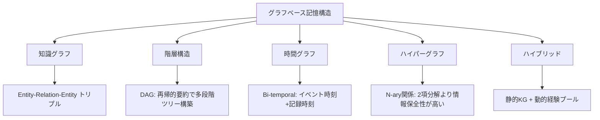

本記事は [arXiv:2602.05665](https://arxiv.org/abs/2602.05665) の解説記事です。

## 論文概要（Abstract）

Chang Yang ら18名による本サーベイは、LLMベースエージェントのメモリをグラフ構造で管理する手法を包括的に整理した研究である。著者らは「Memory emerges as the core module in LLM-based agents for long-horizon complex tasks」と述べ、グラフが関係依存性のモデル化、階層情報の整理、効率的な検索において強力な構造であることを主張している。

この記事は [Zenn記事: Gemini 3.5 Flash×階層型エピソード記憶でCSエージェントの応答精度を高める](https://zenn.dev/0h_n0/articles/60ad7eec7ce63c) の深掘りです。

## 情報源

- **arXiv ID**: 2602.05665
- **URL**: [https://arxiv.org/abs/2602.05665](https://arxiv.org/abs/2602.05665)
- **著者**: Chang Yang, Chuang Zhou, Yilin Xiao, Su Dong et al.（18名）
- **発表年**: 2026年2月
- **分野**: cs.AI

## 背景と動機（Background & Motivation）

LLMベースのエージェントが長期的かつ複雑なタスクに取り組む際、知識の保持、推論の進行管理、環境適応を支える記憶モジュールが不可欠となる。従来の記憶管理手法はベクトルストアへの埋め込みや線形バッファによる蓄積が主流であったが、これらの非構造的アプローチでは関係性の表現やマルチホップ推論に限界があった。

著者らはグラフ構造が「relational dependencies のモデル化、hierarchical information の整理、efficient retrieval の実現」において優位性を持つと位置づけ、既存の分散した研究を統一的な分類体系（taxonomy）のもとに整理した。Zenn記事で扱った階層型エピソード記憶（作業記憶→エピソード記憶→セマンティック記憶）の設計判断を裏付ける理論的基盤として、本サーベイは直接的な参照価値を持つ。

## 主要な貢献（Key Contributions）

- **貢献1**: エージェント記憶の包括的分類体系を構築。時間軸（短期/長期）、認知構造（6タイプ）、構造化レベル（非構造/構造）の3次元で整理した
- **貢献2**: グラフベース記憶のライフサイクルを「抽出→格納→検索→進化」の4フェーズに分離し、各フェーズの主要技術を体系的に分析した
- **貢献3**: 9つの応用ドメイン（対話、コード、推薦、金融、ゲーム、ロボティクス、医療、科学、ツール実行）での事例を整理し、GitHub上のリソースリポジトリを公開した

## 技術的詳細（Technical Details）

### エージェント記憶の分類体系

著者らが提案する分類体系は3つの軸で構成される。

**軸1: 時間的次元（Temporal Dimension）**

- **短期記憶（Short-term Memory）**: タスク関連の直近情報を保持し、高速アクセスを実現。Zenn記事における「作業記憶」に対応する
- **長期記憶（Long-term Memory）**: セッションを跨いで永続化される情報。Zenn記事における「エピソード記憶」「セマンティック記憶」に対応する

**軸2: 認知構造（Cognitive Structure）**

著者らは記憶を6つのタイプに分類している：

| タイプ | 内容 | Zenn記事との対応 |
|--------|------|-----------------|
| Semantic | 世界知識（事実・概念） | セマンティック記憶 |
| Procedural | スキル・ルール | — |
| Associative | 概念間の連想リンク | — |
| Working | 作業用スクラッチパッド | 作業記憶 |
| Episodic | 時系列イベントの記録 | エピソード記憶 |
| Sentiment | 感情トーン | — |

Zenn記事の3層モデル（作業→エピソード→セマンティック）は、この6タイプのうち3つを選択的に採用した設計であることがわかる。

**軸3: 構造化レベル**

- **非構造的アプローチ**: 線形バッファ、ベクトルストア、key-valueストア
- **構造的アプローチ**: 知識グラフ、階層構造、時間グラフ、ハイパーグラフ、ハイブリッド構造

### グラフベース記憶の5つの構造



**知識グラフ（Knowledge Graph）**: 情報を (head, relation, tail) のトリプルで表現する。LLMがテキスト観察からトリプルを抽出し、統合フェーズで矛盾検出と関係枝刈りを行う。

**階層構造（Hierarchical Structure）**: 有向非巡回グラフ（DAG）として情報を多段階ツリーに編成する。セマンティッククラスタリングと再帰的要約で構築し、トップダウンナビゲーションとボトムアップ抽象化を実現する。Zenn記事でYang et al.として引用された部分に対応する。

**時間グラフ（Temporal Graph）**: Bi-temporalモデリングにより、イベント発生時刻と記録時刻の2つの時間軸を追跡する。「先週の注文の件ですが」のような時系列参照を含む問い合わせに対応する際に必須となる構造である。

**ハイパーグラフ（Hypergraph）**: N-ary関係を1つのハイパーエッジで保持する。自然言語の断片とそれに関連するエンティティを単一のハイパーエッジとして扱うことで、2項分解（バイナリトリプル化）による情報損失を防ぐ。

### 記憶ライフサイクル: 4フェーズの技術体系

#### Phase 1: 抽出（Extraction）

テキスト、軌跡データ、マルチモーダルデータの3つの入力ソースから記憶を抽出する。

テキストからの構造化抽出では、LLMベースのNER/関係抽出が従来の専用パイプラインを上回る性能を示している。埋め込みにはSentence-BERTが広く使用される。

軌跡データからは、イベントセグメンテーション（タイムスタンプ注釈付き）と動的状態スナップショットの2つの手法が用いられる。

#### Phase 2: 格納（Storage）

知識グラフ、階層ツリー、時間グラフ、ハイパーグラフ、ハイブリッド構造のいずれかに格納する。格納時の重要な判断は、静的知識と動的経験の分離である。ハイブリッドアーキテクチャでは、静的な知識グラフと動的な経験プールを分けて管理し、軽量な内部作業記憶と外部の大規模グラフを統合する。

#### Phase 3: 検索（Retrieval）

著者らは6つの基本検索オペレータを定義している：

$$
\text{Score}(v_i, q) = \sum_{k=1}^{K} \alpha_k \cdot f_k(v_i, q)
$$

ここで $v_i$ はグラフ上のノード、$q$ はクエリ、$f_k$ は各検索オペレータ、$\alpha_k$ は重み係数である。

| オペレータ | 手法 | 適用場面 |
|-----------|------|---------|
| 類似度ベース | ベクトル符号化 + top-k | 概念・エピソード想起 |
| ルールベース | シンボリック制約、Hebbian共起強化 | 時間・フェーズ制約の検証 |
| 時間ベース | 時間窓フィルタ、減衰関数 | 経験記憶の時系列検索 |
| グラフベース | 層内BFS展開、層間双方向走査 | マルチホップ推論 |
| 強化学習ベース | 行動価値関数 $Q(s,a)$ による適応ポリシー | 動的な検索戦略学習 |
| エージェントベース | ツール/API呼び出しを含む計画-フィードバックループ | 内部記憶の補完 |

強化学習ベースの検索では、行動価値関数が以下のように定義される：

$$
Q(s, a) = r(s, a) + \gamma \max_{a'} Q(s', a')
$$

ここで $s$ は現在の検索状態、$a$ は検索アクション（ノード展開、フィルタ適用など）、$r$ は報酬（回答の正確性）、$\gamma$ は割引率である。

#### Phase 4: 進化（Evolution）

記憶は静的ではなく、内部自己進化と外部自己探索の2つのメカニズムで更新される。

**記憶統合（Memory Consolidation）**: 類似するサブグラフを一般化されたスキーマノードに統合する。帰納的推論によるルール抽出、冗長性の特定と除去を行う。

**グラフ推論（Graph Reasoning）**: 知識グラフ補完技術（リンク予測）、推論ルール、論理的演繹を適用する。

**グラフ再構成（Graph Reorganization）**: 階層の再バランシング、陳腐化したノードの枝刈り、アクセスパターンに基づく関係の再構築を行う。

## 実装のポイント（Implementation）

本サーベイで参照されている主要システム（Mem0, Zep, GraphRAG, Graphiti, HippoRAG等）の実装から、以下のポイントが導出される。

**グラフ構築のコスト管理**: LLMによるトリプル抽出は高精度だが、大規模コーパスではAPI呼び出しコストが膨大になる。オフラインで事前構築し、推論時のコストを低減する設計が推奨される。

**検索の組み合わせ戦略**: 著者らは単一の検索オペレータではなく、複数オペレータの組み合わせを推奨している。Zenn記事のMem0実装が採用する「セマンティック類似度 + キーワードマッチング + エンティティマッチング」の3パス構成は、本サーベイの「ハイブリッドソース検索」カテゴリに該当する。

**進化メカニズムの非同期実行**: 記憶統合やグラフ再構成はリアルタイムの対話パスとは分離し、バッチ処理で実行すべきである。Zenn記事でも蒸留プロセスを非同期で実行する設計を採用している。

## Production Deployment Guide

### AWS実装パターン（コスト最適化重視）

**トラフィック量別の推奨構成**:

| 規模 | 月間リクエスト | 推奨構成 | 月額コスト | 主要サービス |
|------|--------------|---------|-----------|------------|
| **Small** | ~3,000 (100/日) | Serverless | $50-150 | Lambda + Bedrock + Neptune Serverless |
| **Medium** | ~30,000 (1,000/日) | Hybrid | $400-900 | Lambda + ECS Fargate + Neptune |
| **Large** | 300,000+ (10,000/日) | Container | $2,500-6,000 | EKS + Neptune + ElastiCache |

**Small構成の詳細** (月額$50-150):
- **Lambda**: 1GB RAM, 60秒タイムアウト ($25/月)
- **Bedrock**: Claude 3.5 Haiku, Prompt Caching有効 ($80/月)
- **Neptune Serverless**: グラフDB (NCU: 1-2.5) ($30/月)
- **CloudWatch**: 基本監視 ($5/月)

**Medium構成の詳細** (月額$400-900):
- **Lambda**: イベント駆動トリプル抽出 ($60/月)
- **ECS Fargate**: グラフ検索サービス 0.5vCPU×1GB×2タスク ($120/月)
- **Neptune**: db.r6g.large ($400/月)
- **Bedrock**: Claude 3.5 Sonnet, Batch API活用 ($200/月)
- **ElastiCache Redis**: エンティティキャッシュ ($15/月)

**コスト削減テクニック**:
- Neptune Serverless使用でアイドル時のコストを最小化
- Bedrock Batch API使用で50%割引（グラフ構築のバッチ処理）
- Prompt Caching有効化で30-90%削減（システムプロンプト固定）
- グラフ構築をオフラインバッチで実行し、推論時はキャッシュ済みグラフを参照

**コスト試算の注意事項**:
- 上記は2026年6月時点のAWS ap-northeast-1（東京）リージョン料金に基づく概算値です
- Neptune Serverlessのコストはクエリパターンとグラフサイズにより大きく変動します
- 最新料金は [AWS料金計算ツール](https://calculator.aws/) で確認してください

### Terraformインフラコード

**Small構成 (Serverless): Lambda + Bedrock + Neptune Serverless**

```hcl
module "vpc" {
  source  = "terraform-aws-modules/vpc/aws"
  version = "~> 5.0"

  name = "graph-memory-vpc"
  cidr = "10.0.0.0/16"
  azs  = ["ap-northeast-1a", "ap-northeast-1c"]
  private_subnets = ["10.0.1.0/24", "10.0.2.0/24"]

  enable_nat_gateway   = false
  enable_dns_hostnames = true
}

resource "aws_iam_role" "lambda_graph" {
  name = "lambda-graph-memory-role"

  assume_role_policy = jsonencode({
    Version = "2012-10-17"
    Statement = [{
      Action = "sts:AssumeRole"
      Effect = "Allow"
      Principal = { Service = "lambda.amazonaws.com" }
    }]
  })
}

resource "aws_iam_role_policy" "bedrock_neptune" {
  role = aws_iam_role.lambda_graph.id

  policy = jsonencode({
    Version = "2012-10-17"
    Statement = [
      {
        Effect   = "Allow"
        Action   = ["bedrock:InvokeModel", "bedrock:InvokeModelWithResponseStream"]
        Resource = "arn:aws:bedrock:ap-northeast-1::foundation-model/anthropic.claude-3-5-haiku*"
      },
      {
        Effect   = "Allow"
        Action   = ["neptune-db:connect", "neptune-db:ReadDataViaQuery", "neptune-db:WriteDataViaQuery"]
        Resource = aws_neptune_cluster.graph_memory.arn
      }
    ]
  })
}

resource "aws_lambda_function" "graph_retrieval" {
  filename      = "lambda.zip"
  function_name = "graph-memory-retrieval"
  role          = aws_iam_role.lambda_graph.arn
  handler       = "index.handler"
  runtime       = "python3.12"
  timeout       = 60
  memory_size   = 1024

  environment {
    variables = {
      NEPTUNE_ENDPOINT = aws_neptune_cluster.graph_memory.endpoint
      BEDROCK_MODEL_ID = "anthropic.claude-3-5-haiku-20241022-v1:0"
    }
  }
}

resource "aws_neptune_cluster" "graph_memory" {
  cluster_identifier = "agent-graph-memory"
  engine             = "neptune"
  serverless_v2_scaling_configuration {
    min_capacity = 1.0
    max_capacity = 2.5
  }
  skip_final_snapshot = true
}

resource "aws_cloudwatch_metric_alarm" "neptune_cost" {
  alarm_name          = "neptune-ncu-spike"
  comparison_operator = "GreaterThanThreshold"
  evaluation_periods  = 2
  metric_name         = "ServerlessDatabaseCapacity"
  namespace           = "AWS/Neptune"
  period              = 3600
  statistic           = "Average"
  threshold           = 2.0
  alarm_description   = "Neptune NCU使用量が閾値超過（コスト急増の可能性）"
}
```

### セキュリティベストプラクティス

- **ネットワーク**: Neptune はプライベートサブネットに配置、VPCエンドポイント経由アクセス
- **認証**: IAM最小権限、Neptune IAM認証有効化
- **暗号化**: Neptune KMS暗号化、転送中TLS 1.2以上
- **監査**: CloudTrail全リージョン有効化

### 運用・監視設定

```sql
-- Neptune クエリレイテンシ分析
fields @timestamp, queryString, duration_ms
| stats pct(duration_ms, 95) as p95, pct(duration_ms, 99) as p99 by bin(5m)
| filter p95 > 500
```

```python
import boto3

cloudwatch = boto3.client('cloudwatch')

cloudwatch.put_metric_alarm(
    AlarmName='neptune-query-latency',
    ComparisonOperator='GreaterThanThreshold',
    EvaluationPeriods=2,
    MetricName='GremlinRequestsPerSec',
    Namespace='AWS/Neptune',
    Period=300,
    Statistic='Average',
    Threshold=100,
    AlarmDescription='Neptune クエリレート異常'
)
```

### コスト最適化チェックリスト

- [ ] ~100 req/日 → Neptune Serverless + Lambda - $50-150/月
- [ ] ~1000 req/日 → Neptune db.r6g.large + Fargate - $400-900/月
- [ ] 10000+ req/日 → Neptune + EKS + ElastiCache - $2,500-6,000/月
- [ ] Neptune Serverless: アイドル時NCU最小化
- [ ] グラフ構築: Bedrock Batch APIで50%削減
- [ ] エンティティキャッシュ: ElastiCache Redisで検索高速化
- [ ] Prompt Caching: トリプル抽出プロンプトの固定部分をキャッシュ
- [ ] AWS Budgets: 月額予算設定（80%警告、100%アラート）
- [ ] Cost Anomaly Detection: 自動異常検知有効化
- [ ] タグ戦略: 環境別（dev/staging/prod）でコスト可視化
- [ ] Neptune: 開発環境は夜間停止

## 実験結果（Results）

本論文はサーベイであるため、著者ら自身による実験は行われていない。ただし、サーベイで引用された主要システムのベンチマーク比較を以下に整理する。

| システム | 手法 | 代表的ベンチマーク | 特徴 |
|---------|------|------------------|------|
| Mem0 | ベクトル+グラフハイブリッド | LoCoMo 92.5, LongMemEval 94.4 | エンティティリンクをランキングに反映 |
| HippoRAG | 知識グラフ+PPR | MuSiQue +18pt (Recall@2) | 海馬モデルに基づくパターン分離・補完 |
| GraphRAG | グローバル要約グラフ | — | コミュニティ検出による階層的要約 |
| Graphiti | 時間グラフ | — | Bi-temporalモデリング |
| Zep | ベクトル+グラフ | LoCoMo (Synapse比較で言及) | 商用メモリレイヤー |

Mem0のベンチマーク数値は同社の2026年レポートに基づく（本サーベイが直接実験した値ではない点に留意）。

## 実運用への応用（Practical Applications）

本サーベイの分類体系をZenn記事のCSエージェント設計に適用すると、以下の設計判断が導出される。

**記憶構造の選択**: CSエージェントでは、顧客エンティティ間の関係性（注文→商品→返品）が重要であるため、知識グラフまたはハイブリッド構造が適している。Zenn記事でMem0を採用した判断は、本サーベイの「ハイブリッドアーキテクチャ」カテゴリに合致する。

**検索戦略の組み合わせ**: CSエージェントでは「先週の注文の件ですが」のような時間参照を含むクエリが頻出するため、類似度ベース検索に加えて時間ベースフィルタリングの併用が必須である。サーベイが定義する6オペレータのうち、類似度+時間+ルールの3つの組み合わせが実用的である。

**進化メカニズムの必要性**: 大量のエピソードが蓄積された際の記憶統合（Consolidation）は、Zenn記事で実装した「蒸留プロセス」に該当する。サーベイが指摘する「スケーラビリティ課題」（グラフ成長に伴う性能劣化）への対策として、定期的な枝刈りとスキーマ統合が推奨される。

## 関連研究（Related Work）

- **CoALA (arXiv 2312.17294)**: 認知アーキテクチャの観点からエージェント記憶を作業/エピソード/意味/手続きの4タイプに分類。本サーベイの6タイプ分類はこれをさらに細分化したものに位置づけられる
- **Generative Agents (arXiv 2309.02427)**: メモリストリーム+反省+プランニングでエピソード記憶を実装した先駆的研究。本サーベイの「経験記憶」カテゴリの代表例として引用されている
- **HippoRAG (arXiv 2410.10013)**: 海馬のパターン分離/補完理論に基づくグラフベース長期記憶。MuSiQueで従来RAGより+18ptの改善を報告しており、本サーベイの「知識グラフ+検索」の成功事例として位置づけられる

## まとめと今後の展望

本サーベイは、LLMエージェントの記憶管理におけるグラフ構造の有効性を体系的に示した。3軸の分類体系（時間×認知構造×構造化レベル）と4フェーズのライフサイクル（抽出→格納→検索→進化）は、CSエージェントに限らず、あらゆるLLMエージェントの記憶設計に適用可能なフレームワークである。

著者らが指摘する未解決課題として、グラフサイズ増大に伴うスケーラビリティ、時間的一貫性の維持、マルチモーダル統合がある。Zenn記事で扱ったMem0の「1Mから10Mトークンへのスケール時に25%の性能低下」という報告は、まさにこのスケーラビリティ課題の具体例である。

## 参考文献

- **arXiv**: [https://arxiv.org/abs/2602.05665](https://arxiv.org/abs/2602.05665)
- **GitHub**: [DEEP-PolyU/Awesome-GraphMemory](https://github.com/DEEP-PolyU/Awesome-GraphMemory)
- **Related Zenn article**: [https://zenn.dev/0h_n0/articles/60ad7eec7ce63c](https://zenn.dev/0h_n0/articles/60ad7eec7ce63c)
