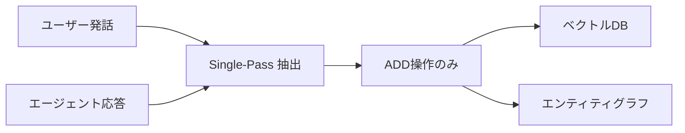

本記事は [Mem0 State of AI Agent Memory 2026](https://mem0.ai/blog/state-of-ai-agent-memory-2026) の解説記事です。

## ブログ概要（Summary）

Mem0が2026年4月に公開した本レポートは、AIエージェントの記憶管理における現状を、ベンチマーク結果・アーキテクチャ設計・本番運用の3つの観点から分析したものである。Mem0の最新アルゴリズム（2026年4月版）は、LoCoMoベンチマークで92.5、LongMemEvalで94.4を達成し、クエリあたりのトークン消費を約6,900トークンに抑えている。フルコンテキスト方式の約26,000トークンと比較すると、約4分の1のトークン消費でこのスコアを実現している。

この記事は [Zenn記事: Gemini 3.5 Flash×階層型エピソード記憶でCSエージェントの応答精度を高める](https://zenn.dev/0h_n0/articles/60ad7eec7ce63c) の深掘りです。

## 情報源

- **種別**: 企業テックブログ
- **URL**: [https://mem0.ai/blog/state-of-ai-agent-memory-2026](https://mem0.ai/blog/state-of-ai-agent-memory-2026)
- **組織**: Mem0（GitHub 48,000+ stars、2025年10月に$24Mの資金調達）
- **発表日**: 2026年4月

## 技術的背景（Technical Background）

LLMエージェントが長期的な対話やタスク遂行を行う際、APIリクエストごとにコンテキストがリセットされるステートレス性が根本的な制約となる。この課題に対し、2025年から2026年にかけてエージェント記憶の分野は認知科学の3層分類——エピソード記憶、セマンティック記憶、手続き記憶——に収斂した。

Mem0は、この3層分類をプロダクションレベルで実装した記憶レイヤーとして、最も広く導入されているシステムの1つである。GitHub上で48,000以上のスターを獲得し、LangChain、LangGraph、CrewAI、Google ADK、OpenAI Agents SDKなど21のフレームワークとの統合を提供している。

Zenn記事では、Mem0をLangGraphと組み合わせてCSエージェントの長期記憶を実装している。本レポートは、その設計判断を裏付けるベンチマークデータと、本番運用で直面する課題を詳述している。

## 実装アーキテクチャ（Architecture）

### ベンチマーク体系と評価結果

Mem0の2026年4月版アルゴリズムは、3つの標準ベンチマークで評価されている。

**LoCoMo**: 1,540問のテストセットで、単一ホップ・マルチホップ・オープンドメイン・時系列の4カテゴリの記憶想起を評価する。10件の会話（平均27.2セッション、1セッション21.6ターン、約16.6Kトークン/会話）で構成される。

**LongMemEval**: 500問のテストセットで、情報抽出・マルチセッション推論・時系列推論・知識更新・棄権の5能力を評価する。平均40セッション、約115Kトークンの対話コンテキストを持つ。

**BEAM**: 1Mおよび10Mトークンスケールで10評価カテゴリをテストする、大規模記憶のベンチマーク。

| ベンチマーク | スコア | 平均トークン/クエリ |
|------------|--------|-------------------|
| LoCoMo | 92.5 | 6,956 |
| LongMemEval | 94.4 | 6,787 |
| BEAM (1M) | 64.1 | 6,719 |
| BEAM (10M) | 48.6 | 6,914 |

特筆すべき改善点として、時系列推論で**+29.6ポイント**、マルチホップ推論で**+23.1ポイント**の向上が報告されている（前バージョンとの比較）。

### 2つのコアアーキテクチャ変更

レポートによると、2026年4月版の主要な技術変更は2つある。

**1. Single-Pass ADD-Only Extraction**

従来のアルゴリズムはユーザー発話のみからファクトを抽出していたが、新アルゴリズムではエージェント生成テキストも同等の重みで処理する。これにより記憶カバレッジが拡大する。



**2. Multi-Signal Retrieval**

3つの並列スコアリングパスを組み合わせる検索方式である：

$$
\text{Score}(m, q) = \alpha \cdot \text{sim}_{\text{semantic}}(m, q) + \beta \cdot \text{sim}_{\text{keyword}}(m, q) + \gamma \cdot \text{sim}_{\text{entity}}(m, q)
$$

ここで $m$ は記憶エントリ、$q$ はクエリ、$\text{sim}_{\text{semantic}}$ はベクトル埋め込みのコサイン類似度、$\text{sim}_{\text{keyword}}$ はキーワードマッチングスコア、$\text{sim}_{\text{entity}}$ はエンティティグラフ上の関連度である。

5つの評価次元で品質を測定する：
- **BLEU score**: トークンレベルの類似度
- **F1 score**: 精度と再現率のバランス
- **LLM score**: バイナリ正解判定
- **トークン消費量/クエリ**: 推論コストの指標
- **Wall-clock レイテンシ**: 応答速度の指標

### メモリタイプと4スコープモデル

Mem0は記憶を3カテゴリに分類している：

| カテゴリ | 内容 | Zenn記事との対応 |
|---------|------|-----------------|
| エピソード記憶 | 歴史的イベント・会話 | エピソード記憶（Episode モデル） |
| セマンティック記憶 | 事実的知識・情報 | セマンティック記憶（SemanticFact モデル） |
| 手続き記憶 | ワークフロー・パターン | （Zenn記事では未実装） |

レポートは手続き記憶について「early-stage for dedicated tooling」と述べており、2026年時点では専用ツーリングの開発が初期段階であることを示している。

記憶の検索スコープを制御する4つのIDスコープ：

- `user_id`: 特定ユーザーの全セッションで永続化
- `agent_id`: 特定エージェントインスタンスにスコープ
- `run_id` / `session_id`: 単一会話またはワークフロー
- `app_id` / `org_id`: 組織全体の共有コンテキスト

レポートは「These identifiers determine what gets retrieved at search time, and they compose」と述べている。Zenn記事でCSエージェントが`customer_id`をキーにしてMem0の検索を行う設計は、この`user_id`スコープに対応する。

### グラフメモリの進化

Mem0は外部グラフストアからビルトインのエンティティリンキングへ移行した。レポートは「Entity relationships now influence retrieval ranking but cannot be traversed directly」と説明している。クエリ可能なグラフインターフェースは削除されたが、デプロイメントのオーバーヘッドが排除された。

### 統合エコシステム

レポートによると、Mem0は21のフレームワークと20のベクトルストアバックエンドをサポートしている。

**エージェントフレームワーク（13種）**: LangChain、LangGraph、LlamaIndex、CrewAI、AutoGen、Agno、CAMEL AI、Dify、Flowise、Google ADK、OpenAI Agents SDK、Mastra

**ベクトルストア（20種）**: Qdrant、Chroma、Weaviate、Milvus、PGVector、Redis、Elasticsearch、FAISS、Pinecone、MongoDB 等

## Production Deployment Guide

### AWS実装パターン（コスト最適化重視）

**トラフィック量別の推奨構成**:

| 規模 | 月間リクエスト | 推奨構成 | 月額コスト | 主要サービス |
|------|--------------|---------|-----------|------------|
| **Small** | ~3,000 (100/日) | Serverless | $60-180 | Lambda + Bedrock + OpenSearch Serverless |
| **Medium** | ~30,000 (1,000/日) | Hybrid | $350-850 | Lambda + ECS Fargate + OpenSearch + ElastiCache |
| **Large** | 300,000+ (10,000/日) | Container | $2,200-5,500 | EKS + OpenSearch + ElastiCache + Karpenter |

**Small構成の詳細** (月額$60-180):
- **Lambda**: 1GB RAM, 30秒タイムアウト ($20/月)
- **Bedrock**: Claude 3.5 Haiku, Prompt Caching有効 ($80/月)
- **OpenSearch Serverless**: ベクトル検索 (2 OCU最小) ($50/月)
- **DynamoDB**: セッションメタデータ On-Demand ($5/月)
- **CloudWatch**: 基本監視 ($5/月)

**コスト削減テクニック**:
- Mem0 SaaS版を使用すれば、ベクトルストアとグラフDBの運用コストを削減可能
- セルフホスト版では、OpenSearch Serverlessのアイドル時コストに注意
- Bedrock Batch API使用で記憶抽出バッチ処理のコスト50%削減
- Prompt Caching有効化でシステムプロンプトのキャッシュ30-90%削減

**コスト試算の注意事項**:
- 上記は2026年6月時点のAWS ap-northeast-1（東京）リージョン料金に基づく概算値です
- OpenSearch Serverlessの最小コスト（2 OCU = 約$700/月）は、Small構成では過剰な場合があります。FAISSをLambda内で使用する代替構成も検討してください
- 最新料金は [AWS料金計算ツール](https://calculator.aws/) で確認してください

### Terraformインフラコード

**Small構成 (Serverless): Lambda + Bedrock + DynamoDB + FAISS in-memory**

```hcl
module "vpc" {
  source  = "terraform-aws-modules/vpc/aws"
  version = "~> 5.0"

  name = "mem0-agent-vpc"
  cidr = "10.0.0.0/16"
  azs  = ["ap-northeast-1a", "ap-northeast-1c"]
  private_subnets = ["10.0.1.0/24", "10.0.2.0/24"]

  enable_nat_gateway   = false
  enable_dns_hostnames = true
}

resource "aws_iam_role" "lambda_mem0" {
  name = "lambda-mem0-memory-role"

  assume_role_policy = jsonencode({
    Version = "2012-10-17"
    Statement = [{
      Action = "sts:AssumeRole"
      Effect = "Allow"
      Principal = { Service = "lambda.amazonaws.com" }
    }]
  })
}

resource "aws_iam_role_policy" "bedrock_dynamo" {
  role = aws_iam_role.lambda_mem0.id

  policy = jsonencode({
    Version = "2012-10-17"
    Statement = [
      {
        Effect   = "Allow"
        Action   = ["bedrock:InvokeModel"]
        Resource = "arn:aws:bedrock:ap-northeast-1::foundation-model/anthropic.claude-3-5-haiku*"
      },
      {
        Effect   = "Allow"
        Action   = ["dynamodb:GetItem", "dynamodb:PutItem", "dynamodb:Query"]
        Resource = aws_dynamodb_table.memory_store.arn
      }
    ]
  })
}

resource "aws_lambda_function" "mem0_handler" {
  filename      = "lambda.zip"
  function_name = "mem0-memory-handler"
  role          = aws_iam_role.lambda_mem0.arn
  handler       = "index.handler"
  runtime       = "python3.12"
  timeout       = 30
  memory_size   = 1024

  environment {
    variables = {
      BEDROCK_MODEL_ID    = "anthropic.claude-3-5-haiku-20241022-v1:0"
      DYNAMODB_TABLE      = aws_dynamodb_table.memory_store.name
      ENABLE_PROMPT_CACHE = "true"
    }
  }
}

resource "aws_dynamodb_table" "memory_store" {
  name         = "agent-memory-store"
  billing_mode = "PAY_PER_REQUEST"
  hash_key     = "user_id"
  range_key    = "memory_id"

  attribute {
    name = "user_id"
    type = "S"
  }
  attribute {
    name = "memory_id"
    type = "S"
  }

  ttl {
    attribute_name = "expire_at"
    enabled        = true
  }
}

resource "aws_cloudwatch_metric_alarm" "memory_latency" {
  alarm_name          = "mem0-retrieval-latency"
  comparison_operator = "GreaterThanThreshold"
  evaluation_periods  = 2
  metric_name         = "Duration"
  namespace           = "AWS/Lambda"
  period              = 300
  statistic           = "p95"
  threshold           = 5000
  alarm_description   = "記憶検索レイテンシP95が5秒超過"

  dimensions = {
    FunctionName = aws_lambda_function.mem0_handler.function_name
  }
}
```

### セキュリティベストプラクティス

- **データ分類**: 顧客PII（メールアドレス、注文情報等）を含む記憶はKMS暗号化必須
- **IAM最小権限**: Bedrock InvokeModelとDynamoDB操作のみ許可
- **Secrets Manager**: Mem0 APIキー（SaaS版使用時）はSecrets Managerで管理
- **VPCエンドポイント**: DynamoDB/Bedrockへのアクセスはゲートウェイ/インターフェースエンドポイント経由

### 運用・監視設定

```python
import boto3

cloudwatch = boto3.client('cloudwatch')

cloudwatch.put_metric_alarm(
    AlarmName='mem0-token-consumption',
    ComparisonOperator='GreaterThanThreshold',
    EvaluationPeriods=1,
    MetricName='TokenUsage',
    Namespace='Custom/Mem0',
    Period=3600,
    Statistic='Sum',
    Threshold=50000,
    AlarmDescription='Mem0記憶検索のトークン消費が5万/時間超過（目安: 6,900/クエリ×7クエリ）'
)
```

### コスト最適化チェックリスト

- [ ] Mem0 SaaS版 vs セルフホスト版の判断（データ機密性で判断）
- [ ] SaaS版: 月額$99（Starter）で十分か、$499（Growth）が必要かトラフィック量で判断
- [ ] セルフホスト版: ベクトルストアのコスト（OpenSearch Serverless最小$700/月 vs FAISS in-memory $0）
- [ ] Bedrock Batch API: 非リアルタイムの記憶抽出処理で50%削減
- [ ] Prompt Caching: 記憶検索プロンプトのキャッシュで30-90%削減
- [ ] DynamoDB On-Demand: 低トラフィック時に最適
- [ ] Lambda メモリ最適化: CloudWatch Insightsで最適サイズ分析
- [ ] AWS Budgets: 月額予算設定
- [ ] Cost Anomaly Detection有効化
- [ ] タグ戦略: user_id / agent_id スコープ別コスト可視化
- [ ] 記憶のTTL設定: 不要な記憶の自動削除でストレージコスト削減

## パフォーマンス最適化（Performance）

レポートが報告する実測値：

| 方式 | トークン/クエリ | 相対コスト |
|------|----------------|-----------|
| Mem0 Multi-Signal | ~6,900 | 1x（基準） |
| フルコンテキスト | ~26,000 | ~3.8x |

本番運用で推奨される6つの機能：

1. **Async Mode Default**: 記憶書き込みを応答パイプラインからブロッキングしない
2. **Reranking**: Cohere、Hugging Face、またはLLMモデルによる二次スコアリング
3. **Metadata Filtering**: 構造化属性によるスコープ付きクエリ
4. **Timestamp on Update**: 時系列順序の追跡（作成/更新時刻）
5. **Depth & Use Case Config**: プロジェクトレベルの包含/除外プロンプト
6. **Structured Exceptions**: 文字列ではなく機械可読なエラーコード

Zenn記事のCSエージェント実装では、(1) Async Mode（`asyncio.create_task`による非同期書き込み）と (3) Metadata Filtering（`user_id`によるスコープ制御）が特に重要である。

## 運用での学び（Production Lessons）

### 未解決の6つの課題

レポートは本番運用における6つの未解決課題を特定している：

**1. Temporal Abstraction（時系列抽象化）**

コンテキストが10倍にスケールすると約25%の性能低下が発生する。BEAM (1M) の64.1に対し BEAM (10M) で48.6と、15.5ポイントの低下が確認されている。

**2. Cross-Session Structure（クロスセッション構造）**

変更を「置き換え」ではなく「進化」として扱うアプローチが必要。顧客が引っ越した場合、古い住所を削除するのではなく、時系列的な変遷として記録すべきである。

**3. Application-Level Evaluation（アプリケーションレベル評価）**

汎用ベンチマーク（LoCoMo等）のスコアが、特定ドメインでの性能を予測しない場合がある。CSエージェント固有の評価セットが必要である。

**4. Privacy & Consent Architecture（プライバシーと同意）**

検査権限、保持ポリシー、削除ポリシーの設計が必要。GDPRの「忘れられる権利」への対応が求められる。

**5. Cross-Session Identity Resolution（クロスセッション同一性解決）**

匿名セッションやデバイス跨ぎでのインタラクション対応は、2026年時点でも未解決の課題として残っている。Zenn記事でも指摘されている問題である。

**6. Memory Staleness（記憶の陳腐化）**

関連度の高い記憶が、ユーザーの状況変化により不正確になるケース。例えば「大口顧客」という記憶が、顧客の離脱後も残り続ける問題。

## 学術研究との関連（Academic Connection）

Mem0のアーキテクチャは、認知心理学のAtkinson-Shiffrinモデル（感覚記憶→短期記憶→長期記憶）に基づいている。レポートで採用されている3層分類（エピソード・セマンティック・手続き）は、Tulvingの長期記憶分類に対応する。

CoALA（arXiv 2312.17294）が提案した4タイプ分類（作業・エピソード・意味・手続き）と比較すると、Mem0は作業記憶をセッションスコープ（`session_id`）として実装し、残りの3タイプを永続記憶として管理する設計を採用している。

Synapse（arXiv 2601.02744）が提案するSpreading Activation方式と比較すると、Mem0のMulti-Signal Retrievalは並列3パスのスコアリング融合であり、グラフ走査を伴わないため計算コストが低い。一方、Synapseはグラフ上の活性化伝播により文脈的推論に優れるが、レイテンシが増大する（Mem0のレポートでは直接比較していない）。

## まとめと実践への示唆

Mem0の2026年レポートは、エージェント記憶の分野が「実験的プロトタイプ」から「本番運用」のフェーズに移行したことを示している。LoCoMo 92.5、LongMemEval 94.4というスコアは、記憶検索の精度が実用レベルに達したことを意味する。

一方で、10Mトークンスケールでの25%性能低下、クロスセッション同一性解決の未成熟、アプリケーション固有評価の不足といった課題は、CSエージェントの本番運用において直接的な影響を持つ。Zenn記事で構築したシステムの長期運用では、定期的なエピソード蒸留（セマンティック記憶への変換）と、ドメイン固有のKnowledge Retention評価セットの作成が必要となる。

## 参考文献

- **Blog URL**: [https://mem0.ai/blog/state-of-ai-agent-memory-2026](https://mem0.ai/blog/state-of-ai-agent-memory-2026)
- **GitHub**: [https://github.com/mem0ai/mem0](https://github.com/mem0ai/mem0)
- **AI Memory Benchmarks 2026**: [https://mem0.ai/blog/ai-memory-benchmarks-in-2026](https://mem0.ai/blog/ai-memory-benchmarks-in-2026)
- **Related Zenn article**: [https://zenn.dev/0h_n0/articles/60ad7eec7ce63c](https://zenn.dev/0h_n0/articles/60ad7eec7ce63c)
