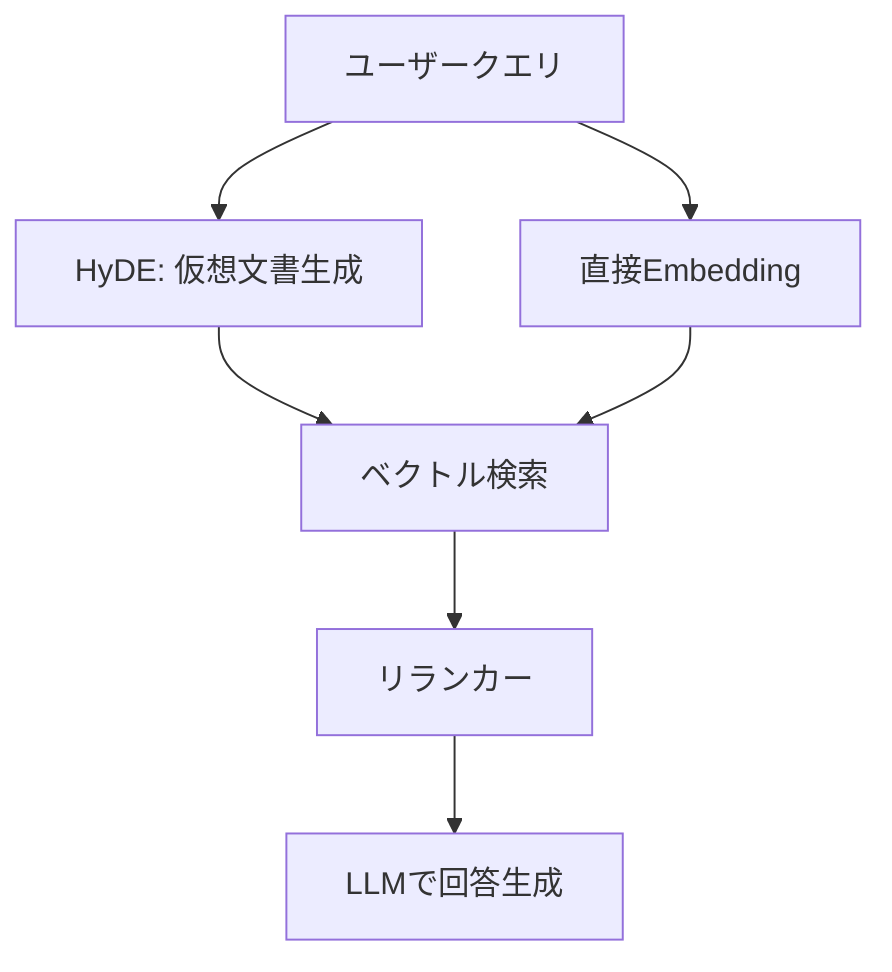

本記事は [arXiv:2212.10496](https://arxiv.org/abs/2212.10496) の解説記事です。

## 論文概要（Abstract）

Luyu Gao, Xueguang Ma, Jimmy Lin, Jamie Callanらによる本論文は、関連性ラベルなしでゼロショットの高精度密検索（dense retrieval）を実現する手法「HyDE（Hypothetical Document Embeddings）」を提案している。HyDEは、指示追従型LLM（InstructGPT等）にクエリから仮想的な文書を生成させ、その文書を教師なしエンコーダ（Contriever等）でEmbeddingベクトルに変換し、そのベクトルの最近傍から実際の文書を検索する2段階アプローチである。仮想文書には事実的な誤りが含まれうるが、エンコーダの密なボトルネックがノイズをフィルタリングし、関連性パターンのみを保持する。

この記事は [Zenn記事: セマンティック検索の本番精度を体系的に改善する実践ガイド](https://zenn.dev/0h_n0/articles/82c0ac24bdf739) の深掘りである。Zenn記事のSection 3「クエリ変換で検索意図のギャップを埋める」でHyDEが言及されており、本記事ではその理論的背景と実装詳細を掘り下げる。

## 情報源

- **arXiv ID**: 2212.10496
- **URL**: [https://arxiv.org/abs/2212.10496](https://arxiv.org/abs/2212.10496)
- **著者**: Luyu Gao, Xueguang Ma, Jimmy Lin, Jamie Callan（Carnegie Mellon University, University of Waterloo）
- **発表年**: 2022年12月（arXiv）、2023年（ACL 2023採択）
- **分野**: cs.CL / cs.IR
- **コード**: [https://github.com/texttron/hyde](https://github.com/texttron/hyde)

## 背景と動機（Background & Motivation）

密検索（dense retrieval）はニューラルエンコーダを用いてクエリと文書をベクトル空間にマッピングし、内積やコサイン類似度で関連文書を検索する手法である。DPR（Karpukhin et al., 2020）やColBERT（Khattab & Zaharia, 2020）に代表される教師あり密検索モデルは高精度だが、大量の関連性ラベル（クエリ-文書ペア）を必要とする。

著者らは以下の課題を指摘している。

**関連性ラベルの収集コスト**: 教師あり密検索は、各ドメインで数万件のクエリ-文書ペアのアノテーションを必要とする。新ドメインへの適用のたびにこのコストが発生し、スケーラビリティに欠ける。

**クエリ-文書間のセマンティックギャップ**: クエリは短く曖昧（例: "climate change effects"）であるのに対し、関連文書は長く具体的である。この非対称性により、教師なしエンコーダ（Contriever等）ではクエリと文書が同じベクトル空間にうまくマッピングされないことがある。

**既存のゼロショット手法の限界**: BM25はスパース検索として堅牢だが語彙的マッチングに限定される。Contriever（Izacard et al., 2022）は教師なし密検索として有望だが、クエリ-文書間のギャップに起因する精度低下が見られる。

## 主要な貢献（Key Contributions）

- **貢献1**: 関連性ラベルを一切使用せず、LLMの生成能力と教師なしエンコーダを組み合わせたゼロショット密検索手法HyDEの提案
- **貢献2**: 仮想文書生成によるクエリ-文書ギャップの解消という新しいアプローチの定式化。クエリ空間から文書空間への変換を、LLMの「知識エンコーダ」としての能力で実現する
- **貢献3**: Web検索（TREC DL 19/20）、質問応答（NQ, TriviaQA, SQuAD等）、事実検証（FEVER）、多言語検索（Mr.TyDi）を含む広範なベンチマークでの評価。教師なしContrieverを大幅に上回り、複数タスクでfine-tuned retrieversに匹敵する性能を達成

## 技術的詳細（Technical Details）

### HyDEの2段階アプローチ

HyDEは「生成フェーズ」と「接地フェーズ」の2段階で構成される。


**ステップ1: 仮想文書生成（Generation Phase）**

指示追従型LLM $g$ がクエリ $q$ から仮想文書 $\hat{d}$ を生成する。

$$
\hat{d} = g(q, \text{instruction})
$$

ここで、
- $g$: 指示追従型LLM（論文ではInstructGPTを使用）
- $q$: ユーザークエリ
- $\text{instruction}$: タスク固有のプロンプト指示

生成される仮想文書は事実的に不正確な場合がある（hallucination）。しかし著者らは、仮想文書が「関連文書がどのようなパターンを持つか」を捉えることが重要であり、事実の正確性は次のステップで補完されると述べている。

**ステップ2: 接地フェーズ（Grounding Phase）**

教師なしエンコーダ $f$ が仮想文書 $\hat{d}$ をEmbeddingベクトルに変換し、コーパス内の実文書との類似度を計算する。

$$
\mathbf{v} = f(\hat{d}) \in \mathbb{R}^{d}
$$

$$
\text{score}(q, d_i) = \mathbf{v}^{\top} f(d_i) = f(\hat{d})^{\top} f(d_i)
$$

ここで、
- $f$: 教師なし密エンコーダ（Contriever）
- $\hat{d}$: LLMが生成した仮想文書
- $d_i$: コーパス内の$i$番目の実文書
- $\mathbf{v}$: 仮想文書のEmbeddingベクトル（$d$次元）
- $\text{score}(q, d_i)$: クエリ$q$と文書$d_i$の関連度スコア

### エンコーダのフィルタリング効果

HyDEの核心的洞察は、エンコーダの密なボトルネックがノイズフィルタとして機能する点にある。仮想文書中の事実的な誤りは、エンコーダによるベクトル化の過程で平滑化される。エンコーダは文書レベルのセマンティクス（トピック、文体、構造パターン）を捕捉する一方、個々の事実の正誤は高次元ベクトル空間では支配的な要素にならないと著者らは主張している。

$$
f(\hat{d}) \approx f(d^{*})
$$

ここで $d^{*}$ は真の関連文書である。仮想文書のベクトルが真の関連文書のベクトルに近い空間領域にマッピングされることで、事実的な誤りにもかかわらず検索が成功する。

### プロンプトテンプレート

著者らはタスクに応じて以下のプロンプトテンプレートを使用している。

| タスク | プロンプト指示（英語） |
|--------|------------------------|
| Web検索 | "Please write a passage to answer the question" |
| SciFact | "Please write a scientific paper passage to support/refute the claim" |
| FiQA | "Please write a financial article passage to answer the question" |
| TREC-NEWS | "Please write a news passage about the topic" |

プロンプトにはfew-shot例を含まず、ゼロショットのinstruction-followingのみで仮想文書を生成する。

## 実装のポイント（Implementation）

### HyDE検索パイプラインの実装

以下にHyDEパイプラインの基本実装を示す。

```python
from dataclasses import dataclass
import numpy as np
import numpy.typing as npt
from openai import OpenAI
from sentence_transformers import SentenceTransformer


@dataclass(frozen=True)
class HyDEConfig:
    """HyDE検索パイプラインの設定

    Attributes:
        llm_model: 仮想文書生成に使用するLLMモデル名
        encoder_model: Embeddingエンコーダのモデル名
        num_hypothetical_docs: 生成する仮想文書の数
        max_tokens: 仮想文書の最大トークン数
        temperature: LLM生成時のtemperature
    """
    llm_model: str = "gpt-4o-mini"
    encoder_model: str = "facebook/contriever-msmarco"
    num_hypothetical_docs: int = 1
    max_tokens: int = 512
    temperature: float = 0.7


TASK_PROMPTS: dict[str, str] = {
    "web_search": (
        "Please write a passage to answer the question.\n"
        "Question: {query}\nPassage:"
    ),
    "qa": (
        "Please write a short passage to answer the question.\n"
        "Question: {query}\nPassage:"
    ),
    "fact_verification": (
        "Please write a passage to support or refute the claim.\n"
        "Claim: {query}\nPassage:"
    ),
    "scifact": (
        "Please write a scientific paper passage to "
        "support/refute the claim.\n"
        "Claim: {query}\nPassage:"
    ),
}


class HyDERetriever:
    """HyDE (Hypothetical Document Embeddings) 検索パイプライン

    LLMで仮想文書を生成し、そのEmbeddingで実文書を検索する。

    Args:
        config: HyDE設定
        task: タスク種別（web_search, qa, fact_verification, scifact）
    """

    def __init__(self, config: HyDEConfig, task: str = "web_search") -> None:
        self.config = config
        self.task = task
        self.client = OpenAI()
        self.encoder = SentenceTransformer(config.encoder_model)
        self._corpus_embeddings: npt.NDArray[np.float32] | None = None
        self._corpus_texts: list[str] = []

    def index_corpus(self, documents: list[str]) -> None:
        """コーパスをインデックス化する

        Args:
            documents: インデックス対象の文書リスト
        """
        self._corpus_texts = documents
        self._corpus_embeddings = self.encoder.encode(
            documents,
            convert_to_numpy=True,
            show_progress_bar=True,
            normalize_embeddings=True,
        )

    def _generate_hypothetical_document(self, query: str) -> str:
        """LLMで仮想文書を生成する（HyDEステップ1）

        Args:
            query: ユーザークエリ

        Returns:
            生成された仮想文書テキスト
        """
        prompt_template = TASK_PROMPTS.get(self.task, TASK_PROMPTS["web_search"])
        prompt = prompt_template.format(query=query)

        response = self.client.chat.completions.create(
            model=self.config.llm_model,
            messages=[{"role": "user", "content": prompt}],
            max_tokens=self.config.max_tokens,
            temperature=self.config.temperature,
        )
        return response.choices[0].message.content or ""

    def _encode_document(self, text: str) -> npt.NDArray[np.float32]:
        """文書をEmbeddingベクトルに変換する（HyDEステップ2）

        Args:
            text: エンコード対象テキスト

        Returns:
            正規化済みEmbeddingベクトル
        """
        embedding: npt.NDArray[np.float32] = self.encoder.encode(
            text,
            convert_to_numpy=True,
            normalize_embeddings=True,
        )
        return embedding

    def search(
        self,
        query: str,
        top_k: int = 10,
    ) -> list[tuple[int, float, str]]:
        """HyDEによる検索を実行する

        Args:
            query: 検索クエリ
            top_k: 返却する上位文書数

        Returns:
            (文書インデックス, スコア, 文書テキスト) のリスト

        Raises:
            RuntimeError: コーパスが未インデックスの場合
        """
        if self._corpus_embeddings is None:
            raise RuntimeError(
                "コーパスが未インデックスです。先にindex_corpus()を呼んでください"
            )

        # ステップ1: 仮想文書生成
        hypothetical_doc = self._generate_hypothetical_document(query)

        # ステップ2: 仮想文書をエンコードし最近傍検索
        query_vector = self._encode_document(hypothetical_doc)
        scores = query_vector @ self._corpus_embeddings.T
        top_indices = np.argsort(scores)[::-1][:top_k]

        results = [
            (int(idx), float(scores[idx]), self._corpus_texts[idx])
            for idx in top_indices
        ]
        return results
```

**実装時の注意点**:

- **エンコーダ選択**: 論文ではContriever（facebook/contriever）を使用しているが、Contriever-msmarco（MS MARCOで追加学習済み）はWeb検索タスクではより高精度である。実務ではSentence-Transformers経由で`facebook/contriever-msmarco`を推奨する
- **仮想文書数**: 論文では1文書生成がデフォルトだが、複数生成してベクトルを平均化する方法も有効である。ただしLLM呼び出し回数に比例してレイテンシとコストが増加する
- **Embedding正規化**: 内積ベースの検索ではL2正規化を施すことでコサイン類似度と等価になる。正規化を忘れるとスコアのスケールが不安定になる

## Production Deployment Guide

HyDEはRAGパイプラインのクエリ変換層として組み込むケースが多い。以下にAWS上でのプロダクション構成を示す。

### AWS実装パターン（コスト最適化重視）

| 構成 | トラフィック | アーキテクチャ | 月額コスト概算 |
|------|-------------|---------------|---------------|
| Small | ~100 req/日 | Lambda + Bedrock + OpenSearch Serverless | $80-180 |
| Medium | ~1,000 req/日 | ECS Fargate + Bedrock + OpenSearch | $400-900 |
| Large | 10,000+ req/日 | EKS + Spot + OpenSearch + ElastiCache | $2,500-6,000 |

**Small構成（~100 req/日）**:
- **Lambda**（256MB、タイムアウト30秒）: 仮想文書生成 + Embedding + 検索を1関数で実行。月額$1-3
- **Bedrock**（Claude 3.5 Haiku）: 仮想文書生成。入力$0.25/100万トークン、出力$1.25/100万トークン。100 req/日で月額$5-15
- **OpenSearch Serverless**（2 OCU最小構成）: ベクトル検索。月額$50-70
- **DynamoDB**（On-Demand）: 検索ログ・キャッシュ。月額$1-5

**Medium構成（~1,000 req/日）**:
- **ECS Fargate**（0.5 vCPU、1GB RAM、2タスク）: 常時起動でコールドスタート回避。月額$30-50
- **Bedrock**（Claude 3.5 Haiku + Prompt Caching）: キャッシュ有効化で30-90%削減。月額$30-80
- **OpenSearch**（r6g.large.search、2ノード）: マネージドクラスタ。月額$250-400
- **ElastiCache**（cache.t3.micro）: 仮想文書キャッシュ、重複クエリ削減。月額$15-25

**Large構成（10,000+ req/日）**:
- **EKS**（Karpenter + Spot Instances）: c6i.xlarge Spot（$0.051/h）でコスト最適化。月額$200-500
- **Bedrock**（Batch API + Prompt Caching）: Batch APIで50%削減。月額$200-600
- **OpenSearch**（r6g.xlarge.search、3ノード + UltraWarm）: ホットウォーム階層構成。月額$800-1,500
- **ElastiCache**（cache.r6g.large、2ノード）: 高頻度クエリキャッシュ。月額$200-300

> **注意**: 上記コスト試算は2026年6月時点のAWS ap-northeast-1（東京）リージョン料金に基づく概算値です。実際のコストはトラフィックパターン、リージョン、バースト使用量により変動します。最新料金は [AWS料金計算ツール](https://calculator.aws/) で確認してください。

### Terraformインフラコード

#### Small構成（Serverless）

```hcl
# --- HyDE Serverless構成 (Lambda + Bedrock + OpenSearch Serverless) ---
# 月額 $80-180 / ~100 req/日

terraform {
  required_version = ">= 1.9"
  required_providers {
    aws = {
      source  = "hashicorp/aws"
      version = "~> 5.60"
    }
  }
}

provider "aws" {
  region = "ap-northeast-1"
}

# --- IAMロール（最小権限） ---
resource "aws_iam_role" "hyde_lambda" {
  name = "hyde-lambda-role"
  assume_role_policy = jsonencode({
    Version = "2012-10-17"
    Statement = [{
      Action    = "sts:AssumeRole"
      Effect    = "Allow"
      Principal = { Service = "lambda.amazonaws.com" }
    }]
  })
}

resource "aws_iam_role_policy" "hyde_lambda_policy" {
  name = "hyde-lambda-policy"
  role = aws_iam_role.hyde_lambda.id
  policy = jsonencode({
    Version = "2012-10-17"
    Statement = [
      {
        Effect   = "Allow"
        Action   = ["bedrock:InvokeModel"]
        Resource = "arn:aws:bedrock:ap-northeast-1::foundation-model/anthropic.claude-3-5-haiku-*"
      },
      {
        Effect   = "Allow"
        Action   = ["aoss:APIAccessAll"]
        Resource = aws_opensearchserverless_collection.hyde.arn
      },
      {
        Effect = "Allow"
        Action = [
          "dynamodb:PutItem",
          "dynamodb:GetItem",
          "dynamodb:Query",
        ]
        Resource = aws_dynamodb_table.hyde_cache.arn
      },
      {
        Effect = "Allow"
        Action = [
          "logs:CreateLogGroup",
          "logs:CreateLogStream",
          "logs:PutLogEvents",
        ]
        Resource = "arn:aws:logs:ap-northeast-1:*:*"
      },
    ]
  })
}

# --- DynamoDB（仮想文書キャッシュ） ---
resource "aws_dynamodb_table" "hyde_cache" {
  name         = "hyde-cache"
  billing_mode = "PAY_PER_REQUEST"  # On-Demand: コスト最適化
  hash_key     = "query_hash"

  attribute {
    name = "query_hash"
    type = "S"
  }

  ttl {
    attribute_name = "ttl"
    enabled        = true  # 24h TTLで自動削除
  }

  server_side_encryption {
    enabled = true  # KMS暗号化
  }
}

# --- OpenSearch Serverless（ベクトル検索） ---
resource "aws_opensearchserverless_collection" "hyde" {
  name = "hyde-vectors"
  type = "VECTORSEARCH"
}

# --- Lambda関数 ---
resource "aws_lambda_function" "hyde_search" {
  function_name = "hyde-search"
  role          = aws_iam_role.hyde_lambda.arn
  handler       = "handler.lambda_handler"
  runtime       = "python3.12"
  timeout       = 30
  memory_size   = 256

  filename = "lambda_package.zip"

  environment {
    variables = {
      OPENSEARCH_ENDPOINT = aws_opensearchserverless_collection.hyde.collection_endpoint
      CACHE_TABLE         = aws_dynamodb_table.hyde_cache.name
      BEDROCK_MODEL_ID    = "anthropic.claude-3-5-haiku-20241022-v1:0"
    }
  }

  tracing_config {
    mode = "Active"  # X-Ray有効化
  }
}

# --- CloudWatchアラーム（コスト監視） ---
resource "aws_cloudwatch_metric_alarm" "lambda_duration" {
  alarm_name          = "hyde-lambda-duration-high"
  comparison_operator = "GreaterThanThreshold"
  evaluation_periods  = 3
  metric_name         = "Duration"
  namespace           = "AWS/Lambda"
  period              = 300
  statistic           = "Average"
  threshold           = 15000  # 15秒以上で警告
  alarm_actions       = []     # SNSトピックARNを設定

  dimensions = {
    FunctionName = aws_lambda_function.hyde_search.function_name
  }
}
```

#### Large構成（Container）

```hcl
# --- HyDE Container構成 (EKS + Karpenter + Spot) ---
# 月額 $2,500-6,000 / 10,000+ req/日

module "eks" {
  source  = "terraform-aws-modules/eks/aws"
  version = "~> 20.24"

  cluster_name    = "hyde-retrieval"
  cluster_version = "1.31"

  vpc_id     = module.vpc.vpc_id
  subnet_ids = module.vpc.private_subnets

  # コスト最適化: パブリックアクセス最小化
  cluster_endpoint_public_access = false
}

# --- Karpenter Provisioner（Spot優先） ---
resource "kubectl_manifest" "karpenter_nodepool" {
  yaml_body = yamlencode({
    apiVersion = "karpenter.sh/v1"
    kind       = "NodePool"
    metadata   = { name = "hyde-workers" }
    spec = {
      template = {
        spec = {
          requirements = [
            {
              key      = "karpenter.sh/capacity-type"
              operator = "In"
              values   = ["spot", "on-demand"]  # Spot優先
            },
            {
              key      = "node.kubernetes.io/instance-type"
              operator = "In"
              values   = ["c6i.xlarge", "c6i.2xlarge", "c7i.xlarge"]
            },
          ]
          nodeClassRef = {
            group = "karpenter.k8s.aws"
            kind  = "EC2NodeClass"
            name  = "default"
          }
        }
      }
      limits = {
        cpu    = "64"
        memory = "128Gi"
      }
      disruption = {
        consolidationPolicy = "WhenEmptyOrUnderutilized"
        consolidateAfter    = "30s"
      }
    }
  })
}

# --- Secrets Manager（Bedrock設定） ---
resource "aws_secretsmanager_secret" "hyde_config" {
  name                    = "hyde/bedrock-config"
  recovery_window_in_days = 7
}

# --- AWS Budgets（予算アラート） ---
resource "aws_budgets_budget" "hyde_monthly" {
  name         = "hyde-monthly-budget"
  budget_type  = "COST"
  limit_amount = "5000"
  limit_unit   = "USD"
  time_unit    = "MONTHLY"

  notification {
    comparison_operator       = "GREATER_THAN"
    threshold                 = 80
    threshold_type            = "PERCENTAGE"
    notification_type         = "ACTUAL"
    subscriber_email_addresses = ["ops-team@example.com"]
  }
}
```

### 運用・監視設定

**CloudWatch Logs Insights クエリ**:

```
# コスト異常検知: 1時間あたりのBedrock呼び出しトークン量
fields @timestamp, @message
| filter @message like /bedrock/
| stats sum(input_tokens) as total_input, sum(output_tokens) as total_output by bin(1h)
| filter total_input > 100000
| sort @timestamp desc
```

```
# レイテンシ分析: HyDE検索のP95/P99
fields @timestamp, duration_ms
| filter event = "hyde_search"
| stats percentile(duration_ms, 95) as p95,
        percentile(duration_ms, 99) as p99,
        avg(duration_ms) as avg_ms
        by bin(1h)
| sort @timestamp desc
```

**CloudWatch アラーム設定**:

```python
import boto3


def create_hyde_alarms(sns_topic_arn: str) -> None:
    """HyDE用CloudWatchアラームを設定する

    Args:
        sns_topic_arn: 通知先SNSトピックのARN
    """
    cw = boto3.client("cloudwatch", region_name="ap-northeast-1")

    # Bedrockトークン使用量スパイク検知
    cw.put_metric_alarm(
        AlarmName="hyde-bedrock-token-spike",
        MetricName="InputTokenCount",
        Namespace="AWS/Bedrock",
        Statistic="Sum",
        Period=3600,
        EvaluationPeriods=1,
        Threshold=500_000,
        ComparisonOperator="GreaterThanThreshold",
        AlarmActions=[sns_topic_arn],
        Dimensions=[
            {"Name": "ModelId", "Value": "anthropic.claude-3-5-haiku-20241022-v1:0"},
        ],
    )

    # Lambda実行時間異常検知
    cw.put_metric_alarm(
        AlarmName="hyde-lambda-p99-latency",
        MetricName="Duration",
        Namespace="AWS/Lambda",
        ExtendedStatistic="p99",
        Period=300,
        EvaluationPeriods=3,
        Threshold=20_000,  # 20秒
        ComparisonOperator="GreaterThanThreshold",
        AlarmActions=[sns_topic_arn],
        Dimensions=[
            {"Name": "FunctionName", "Value": "hyde-search"},
        ],
    )
```

**X-Ray トレーシング設定**:

```python
from aws_xray_sdk.core import xray_recorder, patch_all

# boto3自動計装
patch_all()


@xray_recorder.capture("hyde_search")
def hyde_search_handler(query: str) -> dict:
    """HyDE検索をX-Rayトレース付きで実行する

    Args:
        query: 検索クエリ

    Returns:
        検索結果を含む辞書
    """
    subsegment = xray_recorder.current_subsegment()
    if subsegment:
        subsegment.put_annotation("task_type", "web_search")
        subsegment.put_metadata("query", query, "hyde")

    # 仮想文書生成（Bedrockサブセグメント）
    with xray_recorder.in_subsegment("generate_hypothetical_doc"):
        hypothetical_doc = generate_doc(query)

    # Embedding + 検索（エンコーダサブセグメント）
    with xray_recorder.in_subsegment("encode_and_search"):
        results = encode_and_search(hypothetical_doc)

    return {"results": results}
```

**Cost Explorer 日次レポート**:

```python
import boto3
from datetime import datetime, timedelta


def get_hyde_daily_cost(sns_topic_arn: str) -> dict:
    """HyDE関連の日次AWSコストを取得し異常時にSNS通知する

    Args:
        sns_topic_arn: 通知先SNSトピックのARN

    Returns:
        サービス別コスト辞書
    """
    ce = boto3.client("ce", region_name="us-east-1")
    today = datetime.utcnow().strftime("%Y-%m-%d")
    yesterday = (datetime.utcnow() - timedelta(days=1)).strftime("%Y-%m-%d")

    response = ce.get_cost_and_usage(
        TimePeriod={"Start": yesterday, "End": today},
        Granularity="DAILY",
        Metrics=["UnblendedCost"],
        Filter={
            "Tags": {
                "Key": "Project",
                "Values": ["hyde-retrieval"],
            }
        },
        GroupBy=[{"Type": "DIMENSION", "Key": "SERVICE"}],
    )

    costs: dict[str, float] = {}
    total = 0.0
    for group in response["ResultsByTime"][0]["Groups"]:
        service = group["Keys"][0]
        amount = float(group["Metrics"]["UnblendedCost"]["Amount"])
        costs[service] = amount
        total += amount

    # $100/日超過でSNS通知
    if total > 100:
        sns = boto3.client("sns", region_name="ap-northeast-1")
        sns.publish(
            TopicArn=sns_topic_arn,
            Subject="HyDE Cost Alert: Daily cost exceeded $100",
            Message=f"Total: ${total:.2f}\nBreakdown: {costs}",
        )

    return costs
```

### コスト最適化チェックリスト

**アーキテクチャ選択**:
- [ ] トラフィック量に応じた構成を選択（~100 req/日 → Serverless、~1000 → Hybrid、10000+ → Container）
- [ ] OpenSearch Serverless vs マネージドクラスタのコスト比較を実施

**リソース最適化**:
- [ ] EC2/EKSノード: Spot Instances優先（On-Demandの最大90%削減）
- [ ] Reserved Instances: 安定ワークロード部分は1年コミット（最大72%削減）
- [ ] Savings Plans: Compute Savings Plansの検討
- [ ] Lambda: メモリサイズをPower Tuningで最適化（256MB-512MBが典型）
- [ ] ECS/EKS: Karpenterのconsolidation policyでアイドル時自動スケールダウン

**LLMコスト削減**:
- [ ] Bedrock Batch APIの利用（非同期許容時、50%削減）
- [ ] Prompt Cachingの有効化（同一プロンプトプレフィックスで30-90%削減）
- [ ] モデル選択ロジック: 短いクエリにはHaiku、複雑なクエリにはSonnetを自動切替
- [ ] 仮想文書のキャッシュ: 同一クエリの再生成を防止（DynamoDB TTL 24h）
- [ ] max_tokensの適切な制限（512トークンで十分な場合が多い）

**監視・アラート**:
- [ ] AWS Budgets: 月次予算アラート（80%/100%閾値）
- [ ] CloudWatch アラーム: Bedrockトークン使用量、Lambda実行時間
- [ ] Cost Anomaly Detection: ML検知による異常コストの早期発見
- [ ] 日次コストレポート: Cost Explorer APIによる自動レポート

**リソース管理**:
- [ ] 未使用OpenSearchインデックスの削除（Index Lifecycle Management）
- [ ] タグ戦略: `Project=hyde-retrieval`を全リソースに付与
- [ ] S3ライフサイクル: ログの自動アーカイブ（30日→Glacier）
- [ ] 開発環境の夜間停止: ECS desired_count=0 / EKSノード0台

## 実験結果（Results）

### Web検索タスク（TREC DL 19/20）

著者らはTREC DL 2019/2020で以下の結果を報告している（論文Table 1より）。

| 手法 | TREC DL 19 (nDCG@10) | TREC DL 20 (nDCG@10) |
|------|----------------------|----------------------|
| BM25 | 0.506 | 0.480 |
| Contriever（教師なし） | 0.448 | 0.441 |
| Contriever-msmarco（教師あり） | 0.670 | 0.651 |
| **HyDE（Contriever）** | **0.621** | **0.580** |

HyDEはベースのContriever（教師なし）に対してnDCG@10で+0.173/+0.139の改善を示しており、教師ありContriever-msmarcoにも近い水準に達している。著者らは、HyDEが関連性ラベルを一切使用せずにこの性能を達成した点が重要であると述べている。

### BEIR ベンチマーク

BEIRの多様な検索タスクにおいて、著者らはHyDEが11タスク中7タスクでContrieverを上回ったと報告している（論文Table 2より）。特にSciFact（科学的主張の検証）やDBPedia（エンティティ検索）で顕著な改善が見られた一方、ArguAna（反論検索）ではHyDEが劣る結果となった。著者らは、ArguAnaのように仮想文書がクエリと同方向の文書を生成するタスクでは、反論（対極的な文書）の検索には不向きであると分析している。

### 多言語検索（Mr.TyDi）

Mr.TyDiベンチマークにおいて、HyDEはSwahili、Korean、Japanese等の非英語言語でもContrieverを上回る性能を示したと報告されている。著者らは、InstructGPTが多言語の仮想文書を生成する能力を持つことで、言語横断的な検索改善が実現されたと分析している。

## 実運用への応用（Practical Applications）

### RAGパイプラインでの活用

HyDEはRAG（Retrieval-Augmented Generation）パイプラインのクエリ変換層として有効である。Zenn記事「セマンティック検索の本番精度を体系的に改善する実践ガイド」のSection 3で述べられているように、ユーザークエリと文書間のセマンティックギャップはRAG精度低下の主要因である。HyDEはこのギャップをLLMの生成能力で埋める。



**実運用での考慮事項**:

- **レイテンシ**: HyDEはLLM呼び出しを追加するため、検索レイテンシが500ms-2000ms増加する。リアルタイム性が求められる場合はキャッシュ戦略が必須である
- **コスト**: LLM APIコストが検索コストに上乗せされる。1クエリあたりの仮想文書生成コストはモデルに依存するが、Haiku等の小型モデルで$0.001未満/クエリに抑えられる
- **ハイブリッド検索との併用**: HyDE単体ではArguAnaのような反論検索タスクで弱い。BM25やクエリ拡張と組み合わせたハイブリッドアプローチが実務では有効である
- **キャッシュ戦略**: 同一・類似クエリの仮想文書をキャッシュし、LLM呼び出しを削減する。DynamoDBのTTL付きキャッシュで24時間保持が典型的な設定である

## 関連研究（Related Work）

- **Contriever**（Izacard et al., 2022）: 教師なし密検索の基盤モデル。HyDEのエンコーダとして使用。対照学習ベースで、ラベルなしテキストから密表現を学習する
- **DPR**（Karpukhin et al., 2020）: 教師あり密検索の先駆的研究。クエリと文書を別々のBERTエンコーダでエンコードする。大量の関連性ラベルが必要であり、HyDEとは対照的なアプローチである
- **Query2Doc**（Wang et al., 2023）: HyDEと類似のアイデアだが、生成文書をクエリに連結してスパース検索（BM25）を改善する点が異なる。HyDEがEmbedding空間での操作を行うのに対し、Query2Docは語彙レベルでのクエリ拡張に近い
- **InPars**（Bonifacio et al., 2022）: LLMで合成クエリを生成し、密検索モデルのfine-tuningデータを自動構築する。HyDEが推論時にLLMを使うのに対し、InParsは訓練時にLLMを使う

## まとめと今後の展望

HyDEは、LLMの生成能力と教師なしエンコーダのフィルタリング能力を組み合わせることで、関連性ラベルなしのゼロショット密検索を実現した手法である。クエリ-文書間のセマンティックギャップを仮想文書生成で埋めるというシンプルなアイデアが、複数のベンチマークで教師あり手法に匹敵する性能を達成した。

実務においては、RAGパイプラインのクエリ変換層としてHyDEを組み込むことで、ドメイン固有の関連性ラベルなしに検索精度を改善できる。一方で、LLM呼び出しに伴うレイテンシ増加とコスト増加は、キャッシュ戦略やモデル選択で緩和する必要がある。今後は、より小型で高速なLLMの活用、仮想文書の多様性制御、反論検索など苦手タスクへの対応が研究の方向性として考えられる。

## 参考文献

- **arXiv**: [https://arxiv.org/abs/2212.10496](https://arxiv.org/abs/2212.10496)
- **Code**: [https://github.com/texttron/hyde](https://github.com/texttron/hyde)
- **ACL 2023 Proceedings**: Luyu Gao, Xueguang Ma, Jimmy Lin, Jamie Callan. "Precise Zero-Shot Dense Retrieval without Relevance Labels." ACL 2023.
- **Related Zenn article**: [https://zenn.dev/0h_n0/articles/82c0ac24bdf739](https://zenn.dev/0h_n0/articles/82c0ac24bdf739)
