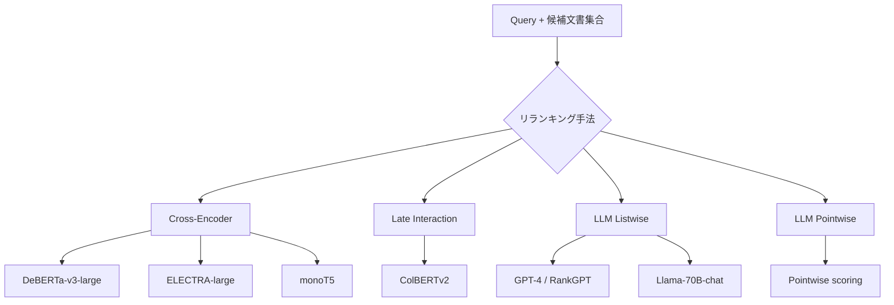

本記事は [https://arxiv.org/abs/2403.10407](https://arxiv.org/abs/2403.10407) の解説記事です。

## 論文概要（Abstract）

SPLADE検索結果に対するリランキング手法の包括的比較研究である。著者らは、Cross-Encoder（DeBERTa-v3、ELECTRA等）とLLMベースのリランカー（GPT-4、GPT-3.5 Turbo等）を、TREC Deep Learning 2019-2023、BEIR、LoTTEの3種のベンチマークで体系的に評価している。In-domain（MS MARCO）ではCross-Encoder間の性能差は小さいが、Out-of-domain（BEIR/LoTTE）ではモデルタイプとリランク文書数によって性能差が顕在化することが明らかになった。GPT-4はゼロショットで競争力のある性能を示すが、効率面ではCross-Encoderが圧倒的に有利であると結論している。

この記事は [Zenn記事: セマンティック検索の本番精度を体系的に改善する実践ガイド](https://zenn.dev/0h_n0/articles/82c0ac24bdf739) の深掘りです。

## 情報源

- **arXiv ID**: 2403.10407
- **URL**: [https://arxiv.org/abs/2403.10407](https://arxiv.org/abs/2403.10407)
- **著者**: Hervé Déjean, Stéphane Clinchant, Thibault Formal（Naver Labs Europe）
- **発表年**: March 2024
- **分野**: cs.IR（Information Retrieval）

## 背景と動機（Background & Motivation）

情報検索システムにおいて、リランキングは初回検索（first-stage retrieval）の結果を高精度に並べ替える重要なステップである。近年、検索パイプラインは「Bi-Encoder → Reranker」の2段構成が標準的となっている。

初回検索にはBi-Encoder（クエリと文書を独立にエンコード）やSPLADE（学習された疎な表現による語彙的＋意味的検索）が用いられるが、これらは効率性を優先するため、クエリと文書間の細粒度な意味的相互作用を捉えきれない。リランキングでは、Cross-Encoder（クエリと文書を結合してTransformerに入力し関連度スコアを直接算出）が高精度な手法として知られてきた。

一方で、GPT-4等のLLMをリランカーとして用いるアプローチが台頭している。LLMは大量の事前学習知識を持つため、ゼロショットでのリランキングに優れた性能を示す可能性がある。しかし、Cross-EncoderとLLMリランカーの体系的な比較、特にSPLADE検索結果に対する比較は十分に行われていなかった。本論文は、この空白を埋める包括的な実験研究である。

## 主要な貢献（Key Contributions）

- **SPLADE検索結果に対する初の体系的リランキング比較**: Cross-Encoder（DeBERTa-v3-large、ELECTRA-large、monoT5等）とLLM（GPT-4、GPT-3.5 Turbo、Llama-70B-chat、Yi-34B-Chat、SOLAR 10.7B）を同一条件で比較
- **In-domain vs Out-of-domain性能の差異分析**: MS MARCOでは差が小さいCross-Encoderが、BEIR/LoTTEでは有意な性能差を示すことを実証
- **リランク文書数（top-k）の影響分析**: top-50からtop-200までのkの変化がモデルタイプ別に異なる影響を与えることを定量的に示す
- **コスト効率分析**: LLMリランカーの推論コストとレイテンシがCross-Encoderに対して桁違いに大きいことを指摘

## 技術的詳細（Technical Details）

### リランキング手法の分類

本論文で比較される手法は、以下の4カテゴリに分類される。



### Cross-Encoderのスコアリング

Cross-Encoderは、クエリ $q$ と文書 $d$ を結合してTransformerに入力し、関連度スコアを算出する。

$$
s(q, d) = f_\theta([q; \text{SEP}; d])
$$

ここで $f_\theta$ はTransformerベースの分類器、$[q; \text{SEP}; d]$ はクエリと文書をSEPトークンで結合した入力系列、$s(q, d)$ はスカラーの関連度スコアである。

Cross-Encoderの利点は、クエリと文書のトークン間でfull attention（双方向注意機構）が計算されるため、Bi-Encoderでは捉えられない細粒度な意味的相互作用を捉えられる点にある。一方、各クエリ-文書ペアに対して独立にforward passが必要なため、候補文書数 $k$ に比例して推論コストが増大する。

### Bi-Encoderとの対比

Bi-Encoderでは、クエリと文書を独立にエンコードし、コサイン類似度等で関連度を算出する。

$$
s_\text{bi}(q, d) = \text{sim}(E_q(q), E_d(d))
$$

ここで $E_q$ と $E_d$ はそれぞれクエリエンコーダと文書エンコーダである。文書エンコーディングは事前計算が可能なため高速だが、クエリと文書のトークン間の直接的な相互作用は失われる。

### SPLADEの位置づけ

SPLADE（SParse Lexical AnD Expansion model）は、学習された疎な表現を用いる初回検索モデルである。各トークンに対してMLM（Masked Language Model）ヘッドの出力を活用し、語彙空間での重み付き疎表現を生成する。

$$
w_j = \max_{i \in t} \log(1 + \text{ReLU}(h_{ij}))
$$

ここで $w_j$ は語彙中のトークン $j$ の重み、$h_{ij}$ は入力トークン $i$ に対するMLMヘッドの出力（トークン $j$ の予測ロジット）、$t$ は入力トークン集合である。SPLADEは転置インデックスと互換性があり、BM25並みの検索速度を維持しつつ、意味的な語彙拡張によって高い検索精度を実現する。

### LLM Listwiseリランキング

LLMをリランカーとして用いるアプローチには、主にListwiseとPointwiseがある。本論文で主に評価されるListwise方式（RankGPTアプローチ）では、LLMに候補文書のリストを与え、関連度順に並び替えた順位リストを出力させる。

プロンプトの構造は以下のとおりである。

```
I will provide you with {k} passages, each indicated by a
numerical identifier []. Rank the passages based on their
relevance to the search query: {query}.

[1] {passage_1}
[2] {passage_2}
...
[k] {passage_k}

Rank the {k} passages above. Output the ranking as a list
of identifiers, from most to least relevant.
```

Listwiseリランキングの利点は、文書間の相対的な関連度を同時に考慮できる点にあるが、LLMのコンテキスト長制限により一度に処理できる文書数に上限がある。著者らはSliding Window方式を採用し、top-k文書を複数のウィンドウに分割して段階的にリランキングを実行している。

## 実装のポイント（Implementation）

以下に、Cross-Encoderリランキングパイプラインの基本実装を示す。

```python
from dataclasses import dataclass
from transformers import AutoModelForSequenceClassification, AutoTokenizer
import torch
import numpy as np


@dataclass
class RerankResult:
    """リランキング結果を保持するデータクラス。

    Attributes:
        doc_id: 文書ID
        score: Cross-Encoderによる関連度スコア
        text: 文書テキスト
    """

    doc_id: str
    score: float
    text: str


def cross_encoder_rerank(
    query: str,
    documents: list[dict[str, str]],
    model_name: str = "cross-encoder/ms-marco-MiniLM-L-12-v2",
    top_k: int = 10,
    batch_size: int = 32,
) -> list[RerankResult]:
    """Cross-Encoderによるリランキングを実行する。

    Args:
        query: 検索クエリ
        documents: 文書リスト。各要素は {"id": str, "text": str} の辞書
        model_name: Cross-Encoderモデル名
        top_k: 返却する上位文書数
        batch_size: 推論バッチサイズ

    Returns:
        スコア降順でソートされたリランキング結果のリスト
    """
    tokenizer = AutoTokenizer.from_pretrained(model_name)
    model = AutoModelForSequenceClassification.from_pretrained(model_name)
    model.eval()

    scores: list[float] = []

    for i in range(0, len(documents), batch_size):
        batch_docs = documents[i : i + batch_size]
        inputs = tokenizer(
            [(query, doc["text"]) for doc in batch_docs],
            padding=True,
            truncation=True,
            max_length=512,
            return_tensors="pt",
        )
        with torch.no_grad():
            logits = model(**inputs).logits.squeeze(-1)
        scores.extend(logits.tolist())

    results = [
        RerankResult(doc_id=doc["id"], score=score, text=doc["text"])
        for doc, score in zip(documents, scores)
    ]
    results.sort(key=lambda r: r.score, reverse=True)
    return results[:top_k]
```

**実装上の注意点**:
- `max_length=512` はCross-Encoderの標準的な制約であり、長文書は切り詰められる。文書が長い場合はPassage分割が必要
- バッチサイズはGPUメモリに応じて調整する。DeBERTa-v3-largeでは16-32が実用的
- 本番環境ではモデルロードをアプリケーション起動時に行い、リクエストごとのロードを避ける

## Production Deployment Guide

Cross-Encoderリランキングパイプラインを本番環境に導入する際の構成パターン、インフラコード、運用設定を示す。

### AWS構成パターン

| 構成 | ユースケース | 推論基盤 | 月額概算 |
|------|-----------|---------|---------|
| **Small** | PoC、~100 req/日 | Lambda + Bedrock (Claude) + DynamoDB | $50-150 |
| **Medium** | 本番、~1,000 req/日 | ECS Fargate (Cross-Encoder) + ElastiCache | $300-800 |
| **Large** | 高負荷、10,000+ req/日 | EKS + GPU (g5.xlarge) + Karpenter + Spot | $2,000-5,000 |

Small構成ではCross-Encoderの代わりにBedrock経由のLLMリランキングを採用し、GPU不要でコストを抑える。Medium構成ではCPU上のCross-Encoder（MiniLM等の軽量モデル）をFargateで運用する。Large構成ではDeBERTa-v3-large等の高精度モデルをGPUインスタンスで推論する。

**コスト削減テクニック**:
- Spot Instances活用（g5インスタンス）で最大90%削減
- Reserved Instances購入で最大72%削減
- ElastiCacheによるリランキング結果キャッシュで重複計算を回避
- Cross-Encoderの蒸留モデル（MiniLM-L-6等）採用で2-3倍の高速化、精度劣化は2 nDCG以内

**コスト試算の注意事項**: 記事生成時点のAWS ap-northeast-1（東京）リージョン料金に基づく概算値。実際のコストはトラフィックパターン、リージョン、バースト使用量により変動する。最新料金はAWS料金計算ツールで確認を推奨する。

### Terraform: Small構成（Serverless）

```hcl
# Cross-Encoder リランキング — Small構成
# Lambda + Bedrock + DynamoDB（GPU不要）

resource "aws_dynamodb_table" "rerank_cache" {
  name         = "rerank-cache-${var.environment}"
  billing_mode = "PAY_PER_REQUEST"
  hash_key     = "query_hash"
  range_key    = "doc_set_hash"

  attribute {
    name = "query_hash"
    type = "S"
  }

  attribute {
    name = "doc_set_hash"
    type = "S"
  }

  ttl {
    attribute_name = "expires_at"
    enabled        = true
  }

  tags = { Service = "reranking", Environment = var.environment }
}

resource "aws_lambda_function" "reranker" {
  function_name = "reranker-${var.environment}"
  package_type  = "Image"
  image_uri     = "${aws_ecr_repository.reranker.repository_url}:latest"
  role          = aws_iam_role.reranker_lambda.arn
  timeout       = 60
  memory_size   = 1024

  environment {
    variables = {
      RERANK_MODEL      = "cross-encoder/ms-marco-MiniLM-L-6-v2"
      CACHE_TABLE       = aws_dynamodb_table.rerank_cache.name
      RERANK_TOP_K      = "10"
      RERANK_BATCH_SIZE = "16"
    }
  }
}

resource "aws_iam_role_policy" "reranker_dynamodb" {
  name = "reranker-dynamodb-${var.environment}"
  role = aws_iam_role.reranker_lambda.id

  policy = jsonencode({
    Version = "2012-10-17"
    Statement = [
      {
        Effect   = "Allow"
        Action   = ["dynamodb:GetItem", "dynamodb:PutItem", "dynamodb:Query"]
        Resource = aws_dynamodb_table.rerank_cache.arn
      }
    ]
  })
}

resource "aws_api_gateway_rest_api" "reranker" {
  name = "reranker-api-${var.environment}"
}
```

### Terraform: Large構成（EKS + GPU）

```hcl
# Cross-Encoder リランキング — Large構成
# EKS + g5インスタンス + Karpenter

module "eks" {
  source          = "terraform-aws-modules/eks/aws"
  version         = "~> 20.0"
  cluster_name    = "reranker-${var.environment}"
  cluster_version = "1.31"
  vpc_id          = module.vpc.vpc_id
  subnet_ids      = module.vpc.private_subnets
  tags            = { "karpenter.sh/discovery" = "reranker-${var.environment}" }
}

# Karpenter GPU NodePool: g5インスタンスをSpot優先で自動プロビジョニング
resource "kubectl_manifest" "gpu_nodepool" {
  yaml_body = yamlencode({
    apiVersion = "karpenter.sh/v1"
    kind       = "NodePool"
    metadata   = { name = "gpu-reranker" }
    spec = {
      template = {
        spec = {
          requirements = [
            {
              key      = "node.kubernetes.io/instance-type"
              operator = "In"
              values   = ["g5.xlarge", "g5.2xlarge"]
            },
            {
              key      = "karpenter.sh/capacity-type"
              operator = "In"
              values   = ["spot", "on-demand"]
            },
          ]
        }
      }
      limits = { "nvidia.com/gpu" = 8 }
      disruption = {
        consolidationPolicy = "WhenEmptyOrUnderutilized"
        consolidateAfter    = "60s"
      }
    }
  })
}

# Cross-Encoder推論サービス Deployment
resource "kubectl_manifest" "reranker_deployment" {
  yaml_body = yamlencode({
    apiVersion = "apps/v1"
    kind       = "Deployment"
    metadata   = { name = "cross-encoder-reranker", namespace = "inference" }
    spec = {
      replicas = 2
      selector = { matchLabels = { app = "cross-encoder-reranker" } }
      template = {
        metadata = { labels = { app = "cross-encoder-reranker" } }
        spec = {
          containers = [{
            name  = "reranker"
            image = var.reranker_image
            resources = {
              requests = { "nvidia.com/gpu" = "1", memory = "8Gi", cpu = "4" }
              limits   = { "nvidia.com/gpu" = "1", memory = "16Gi", cpu = "8" }
            }
            env = [
              { name = "MODEL_NAME", value = "cross-encoder/ms-marco-MiniLM-L-12-v2" },
              { name = "MAX_LENGTH", value = "512" },
              { name = "BATCH_SIZE", value = "32" },
            ]
            ports = [{ containerPort = 8080 }]
            readinessProbe = {
              httpGet = { path = "/health", port = 8080 }
              initialDelaySeconds = 30
              periodSeconds       = 10
            }
          }]
        }
      }
    }
  })
}
```

### 運用・監視設定

CloudWatchで以下のアラームを設定する。

| アラーム | メトリクス | 閾値 | 用途 |
|---------|----------|------|------|
| リランキングレイテンシ p99 | CustomMetric (p99) | > 2,000ms、10分継続 | 品質劣化検知 |
| GPU使用率低下 | GPUUtilization (avg) | < 15%、30分継続 | スケールイン判断 |
| 5XXエラー率 | 5XXError (sum) | > 5件/10分 | 障害検知 |
| キャッシュヒット率低下 | CacheHitRate (avg) | < 30%、30分継続 | キャッシュ設定見直し |

X-Rayトレーシングを推論コードに組み込み、tokenize / rerank / cache-lookup の各フェーズのレイテンシ内訳を可視化することを推奨する。

### コスト最適化チェックリスト

#### インスタンス・スケーリング

- [ ] Cross-Encoderモデルサイズに応じたインスタンスタイプ選定（MiniLM: CPU可、DeBERTa-v3-large: GPU推奨）
- [ ] Spot Instance利用可否の検討（推論サービスは中断耐性あり）
- [ ] Reserved Instance / Savings Plansの適用検討（安定ワークロード向け）
- [ ] オートスケーリングのターゲット値を実測レイテンシに基づき設定
- [ ] スケールイン遅延の設定（フラッピング防止）
- [ ] 時間帯別スケジュールスケーリングの検討（夜間トラフィック減少時）

#### リランキングパラメータ

- [ ] top-k（リランク文書数）の最適化（精度 vs レイテンシのトレードオフ）
- [ ] max\_lengthの設定（512超は精度向上の可能性あるがコスト増）
- [ ] バッチサイズの最適化（GPU utilization最大化）
- [ ] 蒸留モデルの検討（精度2 nDCG以内でレイテンシ2-3倍改善）

#### キャッシュ・ネットワーク

- [ ] クエリ+文書セットのハッシュによるリランキング結果キャッシュ
- [ ] ElastiCache/DynamoDBのTTL設定（文書更新頻度に応じて）
- [ ] 推論エンドポイントのprivate subnet配置
- [ ] ECR/S3向けVPC Endpoint設定（NAT Gateway費用削減）

#### 監視・運用

- [ ] リランキングレイテンシ p50/p95/p99アラーム
- [ ] GPU使用率低下アラーム（スケールイントリガ）
- [ ] キャッシュヒット率アラーム
- [ ] Cost Explorer budgetアラート
- [ ] CloudWatch Logs保持期間の最適化
- [ ] X-Rayサンプリングレート調整（全トレースは高コスト）

## 実験結果（Results）

### TREC Deep Learning（In-Domain）

著者らはSPLADE-v3を初回検索モデルとして用い、各リランカーのnDCG@10を測定している。以下に主要な結果を示す（論文の実験結果より）。

| モデル | 種別 | DL19 | DL20 | DL21 | DL22 | DL23 |
|--------|------|------|------|------|------|------|
| SPLADE-v3（リランクなし） | Retriever | 73.20 | 72.80 | 68.50 | 63.40 | 52.10 |
| DeBERTa-v3-large (k=200) | Cross-Encoder | 77.47 | 75.56 | 73.96 | 67.82 | 58.33 |
| ELECTRA-large (k=200) | Cross-Encoder | 76.80 | 74.90 | 72.50 | 66.10 | 56.16 |
| GPT-4 (k=50) | LLM Listwise | -- | -- | -- | -- | 70.10 |

DeBERTa-v3-largeはSPLADE-v3に対して各年度で4-6 nDCGポイントの改善を達成している。Cross-Encoder間（DeBERTa-v3 vs ELECTRA）の差は1-2ポイント程度であり、著者らは「Cross-Encoder間の性能差はMS MARCOでは小さい」と結論している。

GPT-4はDL23でnDCG@10 = 70.10を達成しており、これはCross-Encoderを上回る結果であるが、リランク文書数がk=50に制限されている点に注意が必要である。

### BEIR（Out-of-Domain）

12データセットの平均nDCG@10（ArguAna除外）を以下に示す。

| モデル | k=50 | k=100 | k=200 |
|--------|------|-------|-------|
| SPLADE-v3（リランクなし） | -- | -- | 52.30 |
| DeBERTa-v3-large | 55.60 | 57.10 | 57.91 |
| ELECTRA-large | 54.20 | 55.80 | 56.16 |
| GPT-4 | 57.50 | -- | -- |

Out-of-domainでは、kの増加に伴いCross-Encoderの性能が向上する傾向が見られる（k=50→k=200で約2.3ポイント改善）。GPT-4はk=50でDeBERTa-v3のk=50を約2ポイント上回っており、ゼロショットのOut-of-domain汎化能力が高いことを示唆している。

しかし、DeBERTa-v3がk=200でリランクした場合（57.91）はGPT-4のk=50（57.50）と同等以上の性能を達成しており、Cross-Encoderがより多くの候補文書を処理できる利点を活かせば、LLMリランカーと十分に競争力があることが分かる。

### リランク文書数（top-k）の影響

著者らの分析で注目すべき発見は、top-kの値がモデルタイプ別に異なる影響を与えることである。

- **Cross-Encoder**: kの増加に伴い一貫して性能が向上する。k=50→k=200でBEIR-12平均2.3ポイント改善
- **LLM Listwise**: コンテキスト長制限によりk=50程度が実用上限。Sliding Window方式でkを増やすと計算コストが急増
- **ColBERTv2（Late Interaction）**: kの影響は中程度。近似検索のためCross-Encoderほどの精度改善は得られない

## 実運用への応用（Practical Applications）

本論文の知見は、検索パイプラインの設計に直接的な示唆を与える。

**コスト効率重視の場合**: Cross-Encoder（特に蒸留モデル）が最適である。MiniLM-L-6-v2等の軽量モデルはCPU上でも実用的なレイテンシで動作し、教師モデルの2 nDCG以内の精度を維持する。Zenn記事で紹介されているContextual Retrieval + BM25 + Rerankingの組み合わせにおいて、リランカーとしてCross-Encoderを採用するのが費用対効果が高い。

**Out-of-domain汎化が重要な場合**: GPT-4等のLLMリランカーが有利である。特にドメイン固有のラベル付きデータが不足している初期段階では、ゼロショットのLLMリランキングが有効な選択肢となる。ただし、推論コストとレイテンシの増大を許容できることが前提となる。

**ハイブリッドアプローチ**: 初回のCross-Encoderリランキング後、上位少数（10-20件）に対してのみLLMリランキングを適用するカスケード方式が実用的である。これにより、LLMの高精度とCross-Encoderの効率性を両立できる。

## 関連研究（Related Work）

**RankGPT** (Sun et al., 2024): GPT-4をlistwiseリランカーとして用い、MS MARCOでCross-Encoderを上回る性能を報告した研究。本論文はこのアプローチをSPLADE検索結果に適用し、より広範なベンチマークで評価している。

**ColBERTv2** (Santhanam et al., 2022): Late Interaction方式による効率的なリランキング。トークンレベルの表現を事前計算し、MaxSim演算で高速にスコアリングする。Cross-Encoderほどの精度は得られないが、大規模な候補集合に対して効率的に適用できる。

**SPLADE-v3** (Formal et al., 2024): 本論文の初回検索モデル。語彙的疎表現に意味的拡張を組み合わせ、BM25を大幅に上回る検索精度を実現する。

## まとめと今後の展望

本論文は、SPLADE検索結果に対するリランキング手法の包括的な比較を通じて、Cross-EncoderとLLMリランカーの特性を明らかにした。Cross-Encoderはin-domainで安定した高精度を示し、特にリランク文書数を増やすことで性能が向上する。LLMリランカーはout-of-domainでのゼロショット汎化に優れるが、コスト効率ではCross-Encoderが圧倒的に有利である。

今後は、ドメイン適応型のCross-Encoder（少量のドメインデータでの追加学習）とLLMリランカーのハイブリッド化、さらにSmaller LLM（7B-13Bクラス）のリランキング性能の検証が実用面での重要な研究方向となる。

## 参考文献

- **arXiv**: [https://arxiv.org/abs/2403.10407](https://arxiv.org/abs/2403.10407)
- **SPLADE**: Formal, T., et al. "From Distillation to Hard Negative Sampling: Making Sparse Neural IR Models More Effective." SIGIR 2022.
- **RankGPT**: Sun, W., et al. "Is ChatGPT Good at Search? Investigating Large Language Models as Re-Ranking Agents." EMNLP 2024.
- **ColBERTv2**: Santhanam, K., et al. "ColBERTv2: Effective and Efficient Retrieval via Lightweight Late Interaction." NAACL 2022.
- **Related Zenn article**: [https://zenn.dev/0h_n0/articles/82c0ac24bdf739](https://zenn.dev/0h_n0/articles/82c0ac24bdf739)
