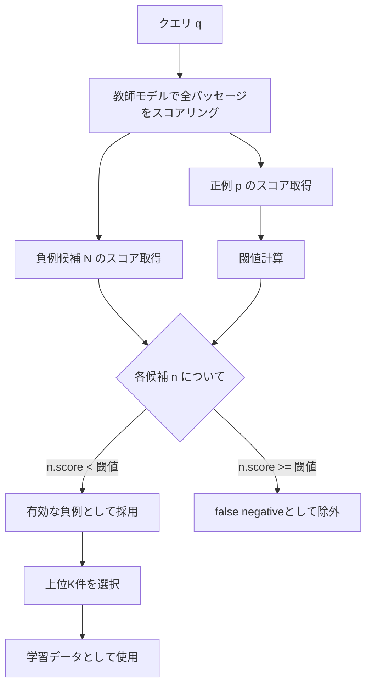

## 論文概要（Abstract）

本記事は [https://arxiv.org/abs/2407.15831](https://arxiv.org/abs/2407.15831) の解説記事です。

NV-Retrieverは、テキスト埋め込みモデルのfine-tuningにおけるhard negative mining手法を改善する研究である。著者らは、正例（positive）の関連度スコアを活用してfalse negativeを除去する**Positive-aware mining methods**を提案している。提案手法のTopK-PercPosは、従来のNaive Top-K手法と比較してfalse negativeを57%削減し、MTEB Retrieval（BEIR）ベンチマークで60.9のスコアを達成、発表時点で1位を獲得したと報告されている。

この記事は [Zenn記事: セマンティック検索の本番精度を体系的に改善する実践ガイド](https://zenn.dev/0h_n0/articles/82c0ac24bdf739) の深掘りです。

## 情報源

- **arXiv ID**: 2407.15831
- **URL**: [arXiv:2407.15831](https://arxiv.org/abs/2407.15831)
- **著者**: Gabriel de Souza P. Moreira, Radek Osmulski, Mengyao Xu, Ronay Ak, Benedikt Schifferer, Even Oldridge（NVIDIA）
- **初版投稿**: 2024年7月22日（改訂: 2025年2月7日）
- **分野**: Information Retrieval (cs.IR)
- **ライセンス**: CC BY-NC-ND 4.0

## 背景と動機（Background & Motivation）

テキスト埋め込みモデルのfine-tuningでは、**contrastive learning**が広く用いられている。この学習手法では、クエリに対して「正例（positive）」と「負例（negative）」のペアを構成し、正例をクエリに近づけ、負例を遠ざけるように学習する。

負例の選び方は精度に直結するが、従来の**Naive Top-K**手法（教師モデルのスコアが高い上位K件を負例として選択）には根本的な問題がある。教師モデルが高スコアを付与する候補の中に、**実際には正解であるべきパッセージ（false negative）が大量に混入する**点である。著者らは、MS-MARCOデータセットにおいて、クエリに最も類似したパッセージの約70%が本来は正例としてラベル付けされるべきものだったと報告している。

false negativeが混入すると、モデルは「本来近づけるべきパッセージを遠ざける」という矛盾した勾配を受け取り、学習が不安定化する。この問題を解決するために、著者らは正例スコアを基準としたフィルタリング手法を提案している。

## 主要な貢献（Key Contributions）

- **Positive-aware mining methods**: 正例の関連度スコアを閾値として活用し、false negativeを除去する2つの手法（TopK-PercPos, TopK-MarginPos）を提案
- **False negative削減の定量評価**: LLM-as-judgeを用いてfalse negative率を測定し、提案手法がNaive Top-Kと比較して50-57%のfalse negativeを削減することを実証
- **教師モデルアンサンブル**: 複数の教師モデルから負例を収集するintra-sampleアンサンブル方式を提案し、単一教師モデルを上回る性能を達成
- **NV-Retriever-v1**: Mistral-7Bをベースモデルとして、MTEB Retrieval（BEIR）ベンチマークで60.9（発表時1位）を達成

## 技術的詳細（Technical Details）

### Contrastive Loss（InfoNCE）

本研究の学習目的関数はInfoNCE lossである（論文 Equation 1）。

$$
\mathcal{L}(q, d^+, \mathbf{d}_N) = -\log \frac{\exp(\text{sim}(q, d^+) / \tau)}{\sum_{d_i \in \{d^+\} \cup \mathbf{d}_N} \exp(\text{sim}(q, d_i) / \tau)}
$$

ここで、
- $q$: クエリの埋め込みベクトル
- $d^+$: 正例パッセージの埋め込みベクトル
- $\mathbf{d}_N$: $N$個の負例パッセージの集合
- $\text{sim}(\cdot, \cdot)$: コサイン類似度
- $\tau$: 温度パラメータ

この損失関数は、正例 $d^+$ のスコアを負例集合 $\mathbf{d}_N$ のスコアよりも相対的に高くするよう学習する。負例の質が低い（false negativeが混入している）場合、勾配が矛盾し学習が阻害される。

### Hard Negative Mining手法

著者らは、教師モデル（cross-encoder等）を用いてクエリとパッセージの関連度スコアを事前計算し、そのスコアに基づいて負例を選択する。以下の手法を比較検討している。

#### Naive Top-K

教師モデルのスコアが高い上位K件をそのまま負例として選択する。正例との区別を考慮しないため、false negativeが大量に混入する。

#### TopK-PercPos（論文 Algorithm 3）

正例の関連度スコアに対する割合を閾値として設定する手法である。

$$
\text{filter}(p, n) = n.\text{rel\_score} < p.\text{rel\_score} \times \text{perc\_margin}
$$

ここで、
- $p.\text{rel\_score}$: 正例パッセージの教師モデルスコア
- $n.\text{rel\_score}$: 負例候補の教師モデルスコア
- $\text{perc\_margin}$: 閾値割合（著者らは95%を推奨）

例えば、正例スコアが0.9の場合、閾値は $0.9 \times 0.95 = 0.855$ となり、スコアが0.855以上の負例候補はfalse negativeとして除外される。

#### TopK-MarginPos（論文 Algorithm 2）

正例スコアから絶対マージンを引いた値を閾値とする手法である。

$$
\text{filter}(p, n) = n.\text{rel\_score} < p.\text{rel\_score} - \text{abs\_margin}
$$

ここで、$\text{abs\_margin}$ は絶対マージン（著者らは0.05を使用）である。

#### Positive-Aware Mining の全体アルゴリズム



### False Negative除去の効果

著者らはLLM-as-judgeを用いてfalse negative率を定量評価している。NQデータセットでの結果は以下のとおりである。

| 手法 | False Negative率 | 削減率 |
|------|-----------------|--------|
| Naive Top-K | 38.8% | - |
| TopK-PercPos (95%) | 約16.7% | 57%削減 |
| TopK-MarginPos (0.05) | 約19.4% | 50%削減 |

StackExchangeデータセットでは、Naive Top-Kで47%のfalse negative率が観測され、提案手法により50%の削減が報告されている。

## 実装のポイント（Implementation）

### Positive-Aware Hard Negative Minerの実装例

```python
from dataclasses import dataclass
from typing import Protocol

import numpy as np
import numpy.typing as npt


class TeacherModel(Protocol):
    """教師モデルのインターフェース"""

    def score(self, query: str, passages: list[str]) -> npt.NDArray[np.float32]:
        """クエリとパッセージ群の関連度スコアを返す"""
        ...


@dataclass(frozen=True)
class MinedNegative:
    """マイニングされた負例"""

    passage: str
    score: float


def mine_hard_negatives_perc_pos(
    query: str,
    positive: str,
    candidates: list[str],
    teacher: TeacherModel,
    top_k: int = 40,
    perc_margin: float = 0.95,
) -> list[MinedNegative]:
    """TopK-PercPos方式でhard negativeをマイニングする

    Args:
        query: 検索クエリ
        positive: 正例パッセージ
        candidates: 負例候補パッセージのリスト
        teacher: スコアリング用の教師モデル
        top_k: 選択する負例の最大数
        perc_margin: 正例スコアに対する閾値割合（0.0-1.0）

    Returns:
        スコア降順でソートされたhard negativeのリスト（最大top_k件）
    """
    all_passages = [positive] + candidates
    scores = teacher.score(query, all_passages)

    positive_score = scores[0]
    threshold = positive_score * perc_margin

    valid_negatives: list[MinedNegative] = []
    for passage, score in zip(candidates, scores[1:], strict=True):
        if score < threshold:
            valid_negatives.append(MinedNegative(passage=passage, score=float(score)))

    valid_negatives.sort(key=lambda x: x.score, reverse=True)
    return valid_negatives[:top_k]
```

著者らが報告している実装上の注意点は以下のとおりである。

- **Hard negative数**: 1クエリあたり40個程度でプラトーに達する（E5-large-unsupervisedベース実験では4個を使用、Mistral-7Bではメモリ制約から1個）
- **教師モデル**: E5-mistral-7b-instructが単体で最も高い性能を示した（論文Table 1より、平均NDCG@10: 0.5810）
- **マイニング所要時間**: 100万ドキュメントに対して8台のA100 GPUで約1.5時間

## Production Deployment Guide

### AWS実装パターン（コスト最適化重視）

NV-Retrieverの手法をプロダクション環境に導入する場合、主な処理は(1) 教師モデルによる候補スコアリング、(2) Positive-awareフィルタリング、(3) Embeddingモデルの推論の3段階に分かれる。以下はトラフィック量別の推奨構成である。

> **注意**: 以下のコスト試算は2026年6月時点のAWS ap-northeast-1（東京）リージョン料金に基づく概算値である。実際のコストはトラフィックパターン、リージョン、バースト使用量により変動する。最新料金は[AWS料金計算ツール](https://calculator.aws/)で確認を推奨する。

| 構成 | トラフィック | 主要サービス | 月額概算 |
|------|-------------|-------------|---------|
| Small | ~100 req/日 | Lambda + SageMaker Serverless + DynamoDB | $80-200 |
| Medium | ~1,000 req/日 | ECS Fargate + SageMaker Real-time + ElastiCache | $400-900 |
| Large | 10,000+ req/日 | EKS + Karpenter + SageMaker + OpenSearch | $2,500-6,000 |

**Small構成の内訳**:
- Lambda (フィルタリングロジック): 月100万リクエストまで無料枠、超過分 $0.20/100万req
- SageMaker Serverless Inference (Embeddingモデル): $0.00016/秒のコンピュート + $0.0001216/GB-hour
- DynamoDB On-Demand (スコアキャッシュ): $1.25/100万書き込み、$0.25/100万読み取り

**Medium構成の内訳**:
- ECS Fargate (2 vCPU, 4GB): 約$70/月/タスク x 2 = $140
- SageMaker Real-time (ml.g5.xlarge): 約$450/月（GPU推論）
- ElastiCache (cache.t3.micro): 約$15/月

**Large構成の内訳**:
- EKS コントロールプレーン: $72/月
- Karpenter管理ノード (Spot g5.xlarge x 3-8台): 約$400-1,100/月（Spot割引60-70%適用後）
- SageMaker Multi-Model Endpoint: 約$900/月
- OpenSearch Service (r6g.large.search x 2): 約$400/月

**コスト削減テクニック**:
- Spot Instances活用: g5.xlargeのSpot価格はOn-Demandの約30-40%（最大70%削減）
- SageMaker Savings Plans: 1年コミットで最大64%削減
- 推論結果キャッシュ: 同一クエリの再計算を回避し、SageMaker呼び出しを50-80%削減
- バッチ推論: オフラインのhard negative mining処理はSageMaker Batch Transformで実行し、リアルタイム推論コストを回避

### Terraformインフラコード

#### Small構成（Serverless）

```hcl
# --- Small構成: Lambda + SageMaker Serverless + DynamoDB ---

terraform {
  required_version = ">= 1.9"
  required_providers {
    aws = {
      source  = "hashicorp/aws"
      version = "~> 5.60"
    }
  }
}

provider "aws" {
  region = "ap-northeast-1"
}

# DynamoDB: スコアキャッシュ（On-Demand、コスト最小化）
resource "aws_dynamodb_table" "score_cache" {
  name         = "nv-retriever-score-cache"
  billing_mode = "PAY_PER_REQUEST"
  hash_key     = "query_hash"
  range_key    = "passage_id"

  attribute {
    name = "query_hash"
    type = "S"
  }
  attribute {
    name = "passage_id"
    type = "S"
  }

  ttl {
    attribute_name = "expires_at"
    enabled        = true
  }

  server_side_encryption {
    enabled = true  # KMS暗号化
  }

  tags = {
    Project = "nv-retriever"
    Env     = "production"
  }
}

# IAMロール: Lambda用（最小権限）
resource "aws_iam_role" "lambda_role" {
  name = "nv-retriever-lambda-role"

  assume_role_policy = jsonencode({
    Version = "2012-10-17"
    Statement = [{
      Action = "sts:AssumeRole"
      Effect = "Allow"
      Principal = { Service = "lambda.amazonaws.com" }
    }]
  })
}

resource "aws_iam_role_policy" "lambda_policy" {
  name = "nv-retriever-lambda-policy"
  role = aws_iam_role.lambda_role.id

  policy = jsonencode({
    Version = "2012-10-17"
    Statement = [
      {
        Effect   = "Allow"
        Action   = ["dynamodb:GetItem", "dynamodb:PutItem", "dynamodb:Query"]
        Resource = aws_dynamodb_table.score_cache.arn
      },
      {
        Effect   = "Allow"
        Action   = ["sagemaker:InvokeEndpoint"]
        Resource = "arn:aws:sagemaker:ap-northeast-1:*:endpoint/nv-retriever-*"
      },
      {
        Effect   = "Allow"
        Action   = ["logs:CreateLogGroup", "logs:CreateLogStream", "logs:PutLogEvents"]
        Resource = "arn:aws:logs:ap-northeast-1:*:*"
      }
    ]
  })
}

# Lambda: Positive-awareフィルタリングロジック
resource "aws_lambda_function" "filter" {
  function_name = "nv-retriever-filter"
  runtime       = "python3.12"
  handler       = "handler.lambda_handler"
  role          = aws_iam_role.lambda_role.arn
  timeout       = 30
  memory_size   = 512

  filename         = "lambda_package.zip"
  source_code_hash = filebase64sha256("lambda_package.zip")

  environment {
    variables = {
      CACHE_TABLE       = aws_dynamodb_table.score_cache.name
      SAGEMAKER_ENDPOINT = "nv-retriever-embedding"
      PERC_MARGIN       = "0.95"
    }
  }

  tracing_config {
    mode = "Active"  # X-Ray有効化
  }

  tags = {
    Project = "nv-retriever"
  }
}

# CloudWatchアラーム: Lambda実行時間監視
resource "aws_cloudwatch_metric_alarm" "lambda_duration" {
  alarm_name          = "nv-retriever-lambda-high-duration"
  comparison_operator = "GreaterThanThreshold"
  evaluation_periods  = 3
  metric_name         = "Duration"
  namespace           = "AWS/Lambda"
  period              = 300
  statistic           = "p95"
  threshold           = 10000  # 10秒
  alarm_description   = "Lambda P95 duration exceeds 10s"

  dimensions = {
    FunctionName = aws_lambda_function.filter.function_name
  }
}
```

#### Large構成（Container）

```hcl
# --- Large構成: EKS + Karpenter + Spot Instances ---

module "eks" {
  source  = "terraform-aws-modules/eks/aws"
  version = "~> 20.24"

  cluster_name    = "nv-retriever-cluster"
  cluster_version = "1.31"

  vpc_id     = module.vpc.vpc_id
  subnet_ids = module.vpc.private_subnets

  # コントロールプレーンのみ（ノードはKarpenterが管理）
  cluster_endpoint_public_access = false

  tags = {
    Project = "nv-retriever"
    Env     = "production"
  }
}

# Karpenter: Spot優先の自動スケーリング
resource "kubectl_manifest" "karpenter_nodepool" {
  yaml_body = yamlencode({
    apiVersion = "karpenter.sh/v1"
    kind       = "NodePool"
    metadata   = { name = "gpu-spot" }
    spec = {
      template = {
        spec = {
          requirements = [
            { key = "karpenter.sh/capacity-type", operator = "In", values = ["spot", "on-demand"] },
            { key = "node.kubernetes.io/instance-type", operator = "In", values = ["g5.xlarge", "g5.2xlarge"] },
          ]
          nodeClassRef = { name = "default" }
        }
      }
      limits = { cpu = "64", memory = "256Gi" }
      disruption = {
        consolidationPolicy = "WhenEmptyOrUnderutilized"
        consolidateAfter    = "30s"
      }
    }
  })
}

# AWS Budgets: 月額予算アラート
resource "aws_budgets_budget" "monthly" {
  name         = "nv-retriever-monthly"
  budget_type  = "COST"
  limit_amount = "6000"
  limit_unit   = "USD"
  time_unit    = "MONTHLY"

  notification {
    comparison_operator       = "GREATER_THAN"
    threshold                 = 80
    threshold_type            = "PERCENTAGE"
    notification_type         = "ACTUAL"
    subscriber_email_addresses = ["ops@example.com"]
  }
}
```

### 運用・監視設定

#### CloudWatch Logs Insights クエリ

```
# コスト異常検知: 1時間あたりのSageMaker呼び出し数を監視
fields @timestamp, @message
| filter @message like /InvokeEndpoint/
| stats count() as invocations by bin(1h)
| sort invocations desc

# レイテンシ分析: P95, P99レスポンスタイム
fields @timestamp, duration_ms
| stats percentile(duration_ms, 95) as p95,
        percentile(duration_ms, 99) as p99,
        avg(duration_ms) as avg_ms
  by bin(5m)
```

#### CloudWatch アラーム設定

```python
import boto3

cloudwatch = boto3.client("cloudwatch", region_name="ap-northeast-1")


def create_sagemaker_alarm(endpoint_name: str, sns_topic_arn: str) -> None:
    """SageMakerエンドポイントの推論レイテンシ監視アラームを作成する

    Args:
        endpoint_name: SageMakerエンドポイント名
        sns_topic_arn: 通知先SNSトピックのARN
    """
    cloudwatch.put_metric_alarm(
        AlarmName=f"{endpoint_name}-high-latency",
        MetricName="ModelLatency",
        Namespace="AWS/SageMaker",
        Statistic="p95",
        Period=300,
        EvaluationPeriods=3,
        Threshold=5000000,  # 5秒（マイクロ秒単位）
        ComparisonOperator="GreaterThanThreshold",
        Dimensions=[
            {"Name": "EndpointName", "Value": endpoint_name},
            {"Name": "VariantName", "Value": "AllTraffic"},
        ],
        AlarmActions=[sns_topic_arn],
    )
```

#### X-Ray トレーシング設定

```python
from aws_xray_sdk.core import xray_recorder, patch_all

# boto3自動計装
patch_all()


@xray_recorder.capture("mine_hard_negatives")
def mine_negatives_traced(
    query: str,
    positive_score: float,
    candidate_scores: list[float],
    perc_margin: float = 0.95,
) -> list[int]:
    """トレーシング付きhard negative mining

    Args:
        query: 検索クエリ
        positive_score: 正例の教師モデルスコア
        candidate_scores: 負例候補のスコアリスト
        perc_margin: 閾値割合

    Returns:
        有効な負例のインデックスリスト
    """
    subsegment = xray_recorder.current_subsegment()
    if subsegment:
        subsegment.put_annotation("perc_margin", perc_margin)
        subsegment.put_metadata("positive_score", positive_score)

    threshold = positive_score * perc_margin
    valid_indices = [
        i for i, score in enumerate(candidate_scores) if score < threshold
    ]

    if subsegment:
        subsegment.put_metadata("filtered_count", len(candidate_scores) - len(valid_indices))
        subsegment.put_metadata("valid_count", len(valid_indices))

    return valid_indices
```

#### Cost Explorer 自動レポート

```python
import datetime

import boto3


def get_daily_cost_report(threshold_usd: float = 100.0) -> dict[str, float]:
    """日次コストレポートを取得し、閾値超過時にアラートする

    Args:
        threshold_usd: アラート閾値（USD/日）

    Returns:
        サービス別コストの辞書
    """
    ce = boto3.client("ce", region_name="us-east-1")
    today = datetime.date.today()
    yesterday = today - datetime.timedelta(days=1)

    response = ce.get_cost_and_usage(
        TimePeriod={
            "Start": yesterday.isoformat(),
            "End": today.isoformat(),
        },
        Granularity="DAILY",
        Metrics=["BlendedCost"],
        GroupBy=[{"Type": "DIMENSION", "Key": "SERVICE"}],
        Filter={
            "Tags": {
                "Key": "Project",
                "Values": ["nv-retriever"],
            }
        },
    )

    costs: dict[str, float] = {}
    for group in response["ResultsByTime"][0]["Groups"]:
        service = group["Keys"][0]
        amount = float(group["Metrics"]["BlendedCost"]["Amount"])
        costs[service] = amount

    total = sum(costs.values())
    if total > threshold_usd:
        sns = boto3.client("sns", region_name="ap-northeast-1")
        sns.publish(
            TopicArn="arn:aws:sns:ap-northeast-1:ACCOUNT_ID:cost-alerts",
            Subject=f"NV-Retriever daily cost alert: ${total:.2f}",
            Message=f"Daily cost ${total:.2f} exceeds threshold ${threshold_usd}.\n"
            + "\n".join(f"  {svc}: ${amt:.2f}" for svc, amt in sorted(costs.items(), key=lambda x: -x[1])),
        )

    return costs
```

### コスト最適化チェックリスト

#### アーキテクチャ選択

- [ ] トラフィック100 req/日以下 → Serverless構成（Lambda + SageMaker Serverless）
- [ ] トラフィック100-5,000 req/日 → Hybrid構成（ECS Fargate + SageMaker Real-time）
- [ ] トラフィック5,000 req/日以上 → Container構成（EKS + Karpenter）

#### リソース最適化

- [ ] EC2/EKSノード: Spot Instances優先（g5.xlargeで最大70%削減）
- [ ] SageMaker: Savings Plans 1年コミット（最大64%削減）
- [ ] Lambda: メモリサイズを512MB-1024MBで最適化（Power Tuning利用）
- [ ] ECS/EKS: アイドル時のスケールダウン設定（Karpenter consolidation）
- [ ] SageMaker: Auto Scaling設定（InvocationsPerInstance閾値）

#### LLM/Embeddingコスト削減

- [ ] 推論結果キャッシュ: DynamoDB TTL付きで同一クエリの再計算回避
- [ ] バッチ推論: オフラインhard negative miningはBatch Transform使用
- [ ] モデル選択: 小規模データはE5-large（334M）、大規模はMistral-7B
- [ ] トークン数制限: クエリ192トークン、パッセージ512トークン（論文推奨値）

#### 監視・アラート

- [ ] AWS Budgets: 月額上限設定（80%/100%で通知）
- [ ] CloudWatch アラーム: SageMaker推論レイテンシP95監視
- [ ] Cost Anomaly Detection: 自動異常検知有効化
- [ ] 日次コストレポート: Cost Explorer API + SNS通知

#### リソース管理

- [ ] 未使用SageMakerエンドポイント削除（0トラフィック検知）
- [ ] タグ戦略: 全リソースにProject/Envタグ付与
- [ ] S3ライフサイクル: 中間データ30日後Glacier移行
- [ ] DynamoDB TTL: スコアキャッシュ7日で自動期限切れ
- [ ] 開発環境: 夜間・週末のSageMakerエンドポイント停止

## 実験結果（Results）

### 教師モデルの比較

著者らは複数の教師モデルを用いてhard negative miningの性能を比較している（論文Table 1より）。

| 教師モデル | パラメータ数 | 平均 NDCG@10 | NQ | HotpotQA | FiQA |
|-----------|------------|-------------|------|----------|------|
| BM25 | - | 0.5002 | 0.5307 | 0.5774 | 0.3923 |
| E5-large-unsupervised | 334M | 0.5494 | - | - | - |
| E5-mistral-7b-instruct | 7.1B | 0.5810 | 0.6241 | 0.6434 | 0.4757 |

E5-mistral-7b-instructが最も高い性能を示しており、教師モデルの性能が直接的にhard negativeの質に影響していることが分かる。

### Mining手法の比較

E5-large-unsupervised（334M）をベースモデルとした比較結果である（論文Table 3より）。

| 手法 | 構成 | 平均 NDCG@10 | NQ | HotpotQA | FiQA |
|------|------|-------------|------|----------|------|
| Naive Top-K | - | 0.5407 | 0.5445 | 0.6120 | 0.4658 |
| TopK-PercPos | 95% | **0.5856** | **0.6369** | **0.6414** | **0.4784** |

TopK-PercPosは全データセットでNaive Top-Kを上回り、平均NDCG@10で+0.0449（約8.3%の相対改善）を達成している。

### アンサンブル手法の比較

複数教師モデルの活用方法として2つの方式が比較されている（論文Table 2より）。

| 方式 | 説明 | 平均 NDCG@10 |
|------|------|-------------|
| Cross-sample | 各サンプルに1つの教師モデルをランダム割当 | 0.5806 |
| Intra-sample (no-dedup) | 各教師からtop-1負例を取得 | **0.5825** |

Intra-sample方式が若干上回っており、著者らは各教師モデルが異なる「難しさ」の負例を提供するためと分析している。

### NV-Retriever-v1の最終性能

Mistral-7Bをベースとしたスケールアップ実験（728,160例、15データセット）の結果である（論文Table 5より）。

| モデル | ベース | 平均 NDCG@10 |
|--------|-------|-------------|
| NV-Retriever-v1 (TopK-PercPos) | Mistral-7B | **60.55** |
| MTEB Retrieval 最終スコア | - | **60.9** |

著者らは、LoRA（rank 16, alpha 32）によるパラメータ効率的なfine-tuningと、双方向Attention（因果Attentionを置換）、最終層の平均プーリングを組み合わせている。学習には8台のA100 GPUで約90時間を要したと報告されている。

## 実運用への応用（Practical Applications）

NV-Retrieverの手法は、Zenn記事「セマンティック検索の本番精度を体系的に改善する実践ガイド」のSection 4.3「Hard Negative Miningで精度をさらに引き上げる」で述べられている手法の理論的基盤を提供する。

**RAGシステムへの適用**: 検索精度はRAGシステム全体の品質を左右する。本手法を用いてEmbeddingモデルをfine-tuningすることで、retrieval段階のNDCG@10を8%以上改善できる可能性がある。特に、ドメイン固有のコーパス（社内文書、技術マニュアル等）では、汎用モデルの性能が低下しやすく、fine-tuningの効果が大きい。

**実装コスト**: hard negative miningの事前計算は100万ドキュメントで約1.5時間（8x A100）と報告されており、一度実行すればモデル学習に繰り返し利用できる。教師モデルにはBM25（計算コスト極小）から大規模LLM（高精度だが高コスト）まで選択肢があり、コストと精度のトレードオフを調整可能である。

**perc_marginの調整**: プロダクション環境では、95%の閾値が万能ではない。ドメイン固有のデータでLLM-as-judgeによるfalse negative率を測定し、閾値を調整することが推奨される。

## 関連研究（Related Work）

- **DPR (Karpukhin et al., 2020)**: Dense Passage Retrievalの先駆的研究。BM25で取得したhard negativeを用いたcontrastive learningを提案したが、false negativeの問題は未対処であった。NV-Retrieverはこの問題をPositive-aware filteringで解決している。
- **ANCE (Xiong et al., 2021)**: 学習中にモデル自身を教師として負例を動的に更新する手法。計算コストが高い一方、NV-Retrieverは事前計算によるオフラインマイニングで効率性を確保している。
- **E5-Mistral-7B (Wang et al., 2024)**: 本研究の教師モデルとして使用された大規模テキスト埋め込みモデル。Mistral-7Bをベースにcontrastive learningでfine-tuningされている。

## まとめと今後の展望

NV-Retrieverは、hard negative miningにおけるfalse negative問題を正例スコアに基づくフィルタリングで解決し、MTEB Retrieval（BEIR）ベンチマークで60.9（発表時1位）を達成した手法である。TopK-PercPos（95%閾値）によるfalse negativeの57%削減は、実装の容易さに比して大きな効果をもたらしている。

今後の研究方向として、著者らは以下を示唆している。(1) より大規模なベースモデル（Llama-3等）への適用、(2) マルチリンガル環境での検証、(3) 教師モデルの自動選択メカニズム。プロダクション環境においては、ドメイン固有データでのfalse negative率測定とperc_margin調整が、精度改善の鍵となる。

## 参考文献

- **arXiv**: [https://arxiv.org/abs/2407.15831](https://arxiv.org/abs/2407.15831)
- **MTEB Leaderboard**: [https://huggingface.co/spaces/mteb/leaderboard](https://huggingface.co/spaces/mteb/leaderboard)
- **Related Zenn article**: [https://zenn.dev/0h_n0/articles/82c0ac24bdf739](https://zenn.dev/0h_n0/articles/82c0ac24bdf739)
