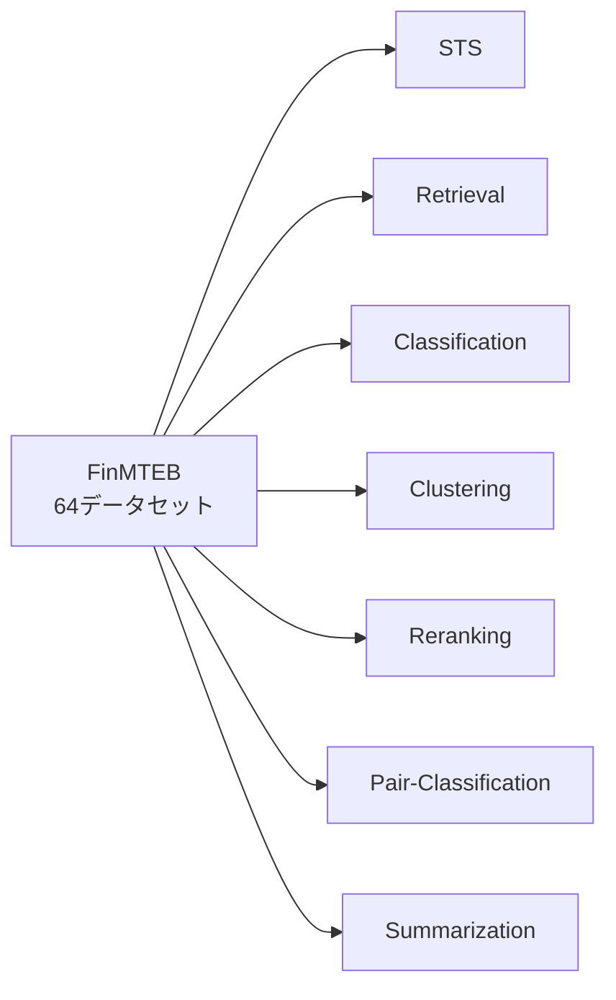

本記事は [arXiv:2409.18511](https://arxiv.org/abs/2409.18511) の解説記事です。

## 論文概要（Abstract）

Yixuan Tang, Yi Yangらによる本論文は、汎用Embeddingモデルがドメイン固有テキスト（金融分野）において性能低下する現象を体系的に実証した研究である。著者らは金融テキストに特化したベンチマーク「FinMTEB」（64データセット、7タスク）を構築し、MTEB（Massive Text Embedding Benchmark）で上位に位置する7つのモデルを評価している。その結果、全モデルがFinMTEBにおいてMTEBよりも低いスコアを記録し、ANOVA分析によりドメインシフトが性能差の主因であることを示した。さらに、MTEBとFinMTEBのモデルランキング間にSpearman相関で統計的に有意な相関が認められないことを報告しており、汎用ベンチマークのスコアがドメイン固有タスクでの性能を予測しないと結論づけている。

この記事は [Zenn記事: セマンティック検索の本番精度を体系的に改善する実践ガイド](https://zenn.dev/0h_n0/articles/82c0ac24bdf739) の深掘りである。Zenn記事のSection 4「ドメイン適応でEmbeddingモデルを最適化する」で扱われているドメイン特化Embeddingの必要性について、本論文は定量的なエビデンスを提供する。

## 情報源

- **arXiv ID**: 2409.18511
- **URL**: [https://arxiv.org/abs/2409.18511](https://arxiv.org/abs/2409.18511)
- **著者**: Yixuan Tang, Yi Yang
- **発表年**: 2024年9月（2025年2月改訂）
- **分野**: cs.CL / cs.IR

## 背景と動機（Background & Motivation）

テキストEmbeddingモデルの評価は、MTEBを標準ベンチマークとして行われるのが一般的である。MTEBは多様なドメインのデータセットを集約した汎用ベンチマークであり、モデル選定時にMTEBスコアが参照されることが多い。

しかし、実際のRAGシステムやセマンティック検索の本番環境では、金融、医療、法律など特定ドメインのテキストを扱うケースが大半である。著者らは、以下の3つの課題を指摘している。

**第一に、ドメインシフトの定量化が不十分である。** 汎用ベンチマークでの高スコアがドメイン固有タスクでの性能を保証するかどうかについて、体系的な実証研究が存在しなかった。

**第二に、ドメイン固有ベンチマークが不足している。** 金融分野においては、個別タスク（感情分析やNER）のデータセットは存在するが、Embeddingモデルの包括的な評価フレームワークは整備されていなかった。

**第三に、性能低下の原因分析が不十分である。** モデルの能力不足なのか、ドメイン固有テキストの複雑さなのか、どの要因が性能低下の主因かが明らかでなかった。

## 主要な貢献（Key Contributions）

- **貢献1**: 金融ドメインに特化したEmbedding評価ベンチマーク「FinMTEB」の構築。64データセット、7タスクカテゴリ（STS、Retrieval、Classification、Clustering、Reranking、Pair-Classification、Summarization）で構成される
- **貢献2**: 4つのテキスト複雑さ指標（ChatGPT Error Rate、Information Entropy、Readability、Mean Dependency Distance）を定義し、ドメイン間のテキスト特性差を定量化
- **貢献3**: ANOVA分析により、Embeddingモデルの性能差がモデル能力ではなくドメインシフトに起因することを実証。MTEBとFinMTEBのランキング間にSpearman相関で有意な相関がないことを確認

## 技術的詳細（Technical Details）

### FinMTEBベンチマークの設計

FinMTEBはMTEBと同一の7タスクカテゴリを網羅しつつ、全データセットを金融ドメインに限定している。著者らは既存の金融NLPデータセットを収集・整理し、各タスクカテゴリに割り当てている。



MTEBとFinMTEBのテキスト特性差を以下に示す（論文Table 1より）。

| 指標 | MTEB | FinMTEB |
|------|------|---------|
| 平均文長（単語数） | 18.20 | 26.37 |
| 平均トークン長 | 4.89 | 5.12 |
| 平均依存距離 | 2.49 | 2.85 |

金融テキストは汎用テキストと比較して文が長く、専門用語（トークン長が大きい）が多く、構文的に複雑（依存距離が大きい）であることが確認できる。

### テキスト複雑さの4指標

著者らはドメイン間のテキスト特性差を定量化するために、4つの複雑さ指標を定義している。

**1. ChatGPT Error Rate**

GPT-4o miniを用いた際の誤答率であり、タスクの意味的難易度を測定する。分類タスクの場合、正解ラベルとGPT-4o miniの出力を比較し、不一致率を算出する。

$$
\text{ChatGPT Error Rate} = \frac{\text{GPT-4o miniの誤答数}}{\text{総サンプル数}}
$$

**2. Information Entropy（情報エントロピー）**

テキスト中の単語分布のシャノンエントロピーを計算し、語彙の多様性を定量化する。

$$
H = -\sum_{i=1}^{V} p(w_i) \log_2 p(w_i)
$$

ここで、
- $V$: 語彙サイズ
- $w_i$: $i$番目の単語
- $p(w_i)$: 単語 $w_i$ の出現確率

エントロピーが高いほど語彙が多様であり、モデルにとってより困難なテキストとなる。

**3. Readability（可読性）**

Gunning Fog Indexを使用して可読性を測定する。

$$
\text{Fog Index} = 0.4 \times \left(\frac{\text{words}}{\text{sentences}} + 100 \times \frac{\text{complex words}}{\text{words}}\right)
$$

ここで、
- $\text{words}$: 総単語数
- $\text{sentences}$: 総文数
- $\text{complex words}$: 3音節以上の単語数

Fog Indexが高いほど、テキストは読みにくく専門的であることを示す。

**4. Mean Dependency Distance（平均依存距離）**

構文解析における依存関係の平均距離であり、構文的複雑さを測定する。

$$
\text{MDD} = \frac{1}{n-1} \sum_{i=1}^{n-1} |d_i|
$$

ここで、
- $n$: 文中の単語数
- $d_i$: $i$番目の依存関係における主辞と従属語の位置差（絶対値）

依存距離が大きいほど、文の構造が複雑で長距離の文法的依存関係を含むことを意味する。

### ANOVA分析

著者らはEmbeddingモデルの性能差がモデル自体の能力差に起因するのか、ドメインシフトに起因するのかを分離するために、二元配置分散分析（Two-way ANOVA）を実施している。

$$
Y_{ij} = \mu + \alpha_i + \beta_j + (\alpha\beta)_{ij} + \epsilon_{ij}
$$

ここで、
- $Y_{ij}$: モデル $i$ のドメイン $j$ におけるスコア
- $\mu$: 全体平均
- $\alpha_i$: モデル因子の効果（$i = 1, \ldots, 7$）
- $\beta_j$: ドメイン因子の効果（$j \in \{\text{MTEB}, \text{FinMTEB}\}$）
- $(\alpha\beta)_{ij}$: 交互作用
- $\epsilon_{ij}$: 誤差項

著者らが報告したANOVA分析の結果（論文Table 3より）は以下の通りである。

| 因子 | 効果量（$\eta^2$） |
|------|-------------------|
| Domain（ドメイン） | 1.00 |
| Model（モデル） | 0.00 |

ドメイン因子の効果量が1.00であるのに対し、モデル因子の効果量は0.00となっている。この結果は、Embeddingモデル間の性能差はモデルの能力差ではなくドメインシフトによってほぼ完全に説明されることを意味する。

### 回帰分析による複雑さ指標と性能の関係

著者らはさらに、4つの複雑さ指標と性能低下の関係を回帰分析で検証している。性能低下幅 $\Delta$ を以下のように定義する。

$$
\Delta_i = \text{MTEB}_i - \text{FinMTEB}_i
$$

ここで $i$ はモデルインデックスである。

この $\Delta$ を目的変数、4つの複雑さ指標を説明変数として重回帰分析を行い、どの指標が性能低下と最も強く関連するかを分析している。

## 実装のポイント（Implementation）

### FinMTEBの利用方法

FinMTEBはMTEBフレームワークと互換性のある形式で構築されており、既存のMTEB評価コードを流用してドメイン固有の評価を実施できる。以下は、自社ドメインでEmbeddingモデルを評価する際の基本的なアプローチを示す擬似コードである。

```python
from dataclasses import dataclass
from typing import Protocol


class EmbeddingModel(Protocol):
    """Embeddingモデルのインターフェース"""

    def encode(self, texts: list[str]) -> list[list[float]]:
        """テキストリストをベクトルに変換する

        Args:
            texts: エンコード対象のテキストリスト

        Returns:
            各テキストに対応するEmbeddingベクトルのリスト
        """
        ...


@dataclass(frozen=True)
class BenchmarkResult:
    """ベンチマーク評価結果を保持するデータクラス

    Attributes:
        model_name: 評価対象モデルの名称
        general_score: 汎用ベンチマーク（MTEB等）でのスコア
        domain_score: ドメイン固有ベンチマークでのスコア
        score_drop: スコアの低下幅（general_score - domain_score）
    """

    model_name: str
    general_score: float
    domain_score: float
    score_drop: float


def evaluate_domain_gap(
    model: EmbeddingModel,
    general_datasets: list[dict],
    domain_datasets: list[dict],
    model_name: str,
) -> BenchmarkResult:
    """汎用ベンチマークとドメイン固有ベンチマークの性能差を算出する

    Args:
        model: 評価対象のEmbeddingモデル
        general_datasets: 汎用ベンチマーク用データセットのリスト
        domain_datasets: ドメイン固有ベンチマーク用データセットのリスト
        model_name: モデルの表示名

    Returns:
        ベンチマーク評価結果
    """
    general_score = _evaluate_on_datasets(model, general_datasets)
    domain_score = _evaluate_on_datasets(model, domain_datasets)

    return BenchmarkResult(
        model_name=model_name,
        general_score=general_score,
        domain_score=domain_score,
        score_drop=general_score - domain_score,
    )


def _evaluate_on_datasets(
    model: EmbeddingModel,
    datasets: list[dict],
) -> float:
    """データセット群に対する平均スコアを算出する

    Args:
        model: 評価対象のEmbeddingモデル
        datasets: 評価用データセットのリスト

    Returns:
        全データセットの平均スコア
    """
    scores: list[float] = []
    for dataset in datasets:
        embeddings = model.encode(dataset["texts"])
        score = _compute_task_score(embeddings, dataset)
        scores.append(score)
    return sum(scores) / len(scores) if scores else 0.0


def _compute_task_score(
    embeddings: list[list[float]],
    dataset: dict,
) -> float:
    """個別タスクのスコアを算出する（タスクタイプに応じた評価指標を使用）

    Args:
        embeddings: モデルが生成したEmbeddingベクトル群
        dataset: 評価データセット（task_type, labels等を含む）

    Returns:
        タスクスコア（0.0-100.0）
    """
    raise NotImplementedError("タスクタイプに応じた評価ロジックを実装する")
```

### ドメイン特化評価の実践ポイント

本論文の知見を自社のRAGパイプラインに適用する際、以下の点に注意が必要である。

1. **MTEBスコアだけでモデルを選定しない**: 論文のSpearman相関分析（論文Table 5より）が示す通り、MTEBランキングとドメイン固有ランキングの間に統計的に有意な相関はない。自社ドメインのデータで独自に評価する必要がある
2. **複雑さ指標でドメインギャップを事前推定する**: 4つの複雑さ指標（特に平均文長と依存距離）を算出することで、汎用モデルの適用可能性を事前に判断できる
3. **タスクカテゴリ別に評価する**: FinMTEBの7タスクカテゴリのうち、自社のユースケースに関連するタスクでの性能を重視する

## 実験結果（Results）

### モデル別スコア比較

著者らが7つのEmbeddingモデルをMTEBとFinMTEBの両方で評価した結果を以下に示す（論文Table 2より）。

| モデル | パラメータ数 | MTEB Score | FinMTEB Score | 低下幅 |
|--------|------------|-----------|---------------|--------|
| bge-en-icl | 7B | 71.67 | 63.09 | -8.58 |
| gte-Qwen2-1.5B | 1.5B | 67.16 | 59.98 | -7.18 |
| e5-mistral-7b | 7B | 66.63 | 64.75 | -1.88 |
| bge-large-en-v1.5 | 335M | 64.23 | 58.95 | -5.28 |
| text-embedding-3-small | 非公開 | 62.26 | 61.36 | -0.90 |
| instructor-base | 110M | 59.54 | 54.79 | -4.75 |
| all-MiniLM-L12-v2 | 33M | 56.53 | 54.31 | -2.22 |

全モデルでFinMTEBスコアがMTEBスコアを下回っており、低下幅は-0.90から-8.58ポイントの範囲である。特筆すべき点として、MTEBで最高スコアのbge-en-iclが最大の低下幅（-8.58）を記録している一方、MTEBスコアが中程度のtext-embedding-3-smallは最小の低下幅（-0.90）となっている。

### ランキングの非一貫性

著者らはMTEBとFinMTEBのモデルランキング間のSpearman順位相関を算出しており（論文Table 5より）、全タスクカテゴリにおいてp値が0.05を超え、統計的に有意な相関が認められなかったと報告している。

この結果は実務上きわめて重要な示唆を持つ。MTEBリーダーボードでの順位が高いモデルが、金融ドメインにおいても高い性能を発揮するとは限らない。モデル選定においてMTEBスコアを唯一の判断基準とすることは不適切であることが、統計的に裏付けられている。

### タスクカテゴリ別の分析

著者らの報告によると、性能低下の程度はタスクカテゴリによって異なる。Retrievalタスクにおいては比較的低下が少ないモデルもある一方、ClassificationやClusteringでは大幅な低下が見られるケースがある。これは金融テキストの分類やクラスタリングが、専門用語の意味理解を要求するためと考えられる。

## 実運用への応用（Practical Applications）

### RAGパイプラインにおけるモデル選定への示唆

Zenn記事「セマンティック検索の本番精度を体系的に改善する実践ガイド」のSection 4で議論されているドメイン適応の必要性について、本論文は定量的な根拠を提供する。

**ドメイン固有評価セットの構築が必須である。** 本論文のANOVA分析結果（ドメイン因子の効果量1.00、モデル因子の効果量0.00）は、モデル選定において汎用ベンチマークのスコアがほぼ無意味であることを示している。本番環境に投入する前に、自社ドメインのデータで独自のベンチマークを構築し、候補モデルを評価する必要がある。

**テキスト複雑さ指標による事前スクリーニング。** 平均文長、トークン長、依存距離などの指標を算出し、自社ドメインのテキストがMTEBのテキストとどの程度異なるかを定量化できる。乖離が大きい場合、ファインチューニングやドメイン適応が必要となる可能性が高い。

**コスト対効果の判断。** text-embedding-3-smallは最小の低下幅（-0.90）を記録しているが、これはモデルのロバスト性が高いのか、元々のスコアが低いためにフロア効果が生じているのかを見極める必要がある。ドメイン固有ベンチマークでの絶対性能と低下幅の両方を考慮すべきである。

## 関連研究（Related Work）

- **MTEB (Muennighoff et al., 2023)**: テキストEmbeddingモデルの包括的評価フレームワーク。56データセット、8タスクで構成。本論文のFinMTEBはMTEBのドメイン特化版という位置づけ
- **BEIR (Thakur et al., 2021)**: 情報検索モデルのゼロショット評価ベンチマーク。18データセットでドメイン横断的な検索性能を評価。BEIRはRetrievalタスクに特化しているのに対し、FinMTEBは7タスクカテゴリをカバーする
- **FinBERT (Araci, 2019)**: 金融テキストに特化したBERTモデル。金融ドメインでのファインチューニングにより感情分析などの下流タスクで改善を達成。FinMTEBはこうしたドメイン特化モデルの評価基盤となりうる

## まとめと今後の展望

本論文の最も重要な知見は、Embeddingモデルの性能差はモデルの能力差ではなくドメインシフトによって説明されるという点である（ANOVA分析での効果量: Domain=1.00, Model=0.00）。MTEBランキングとFinMTEBランキングの間に統計的に有意な相関がないことも、汎用ベンチマークへの過度な依存に警鐘を鳴らしている。

今後の研究方向として、金融以外のドメイン（医療、法律、科学技術など）でも同様のベンチマーク構築と実証分析が期待される。また、ドメイン適応の手法（コントラスト学習によるファインチューニング、ドメイン固有のハードネガティブマイニングなど）がFinMTEB上でどの程度の改善をもたらすかの検証も、実務上重要な研究テーマとなるだろう。

## 参考文献

- **arXiv**: [https://arxiv.org/abs/2409.18511](https://arxiv.org/abs/2409.18511)
- **MTEB Benchmark**: [https://huggingface.co/spaces/mteb/leaderboard](https://huggingface.co/spaces/mteb/leaderboard)
- **Related Zenn article**: [https://zenn.dev/0h_n0/articles/82c0ac24bdf739](https://zenn.dev/0h_n0/articles/82c0ac24bdf739)
