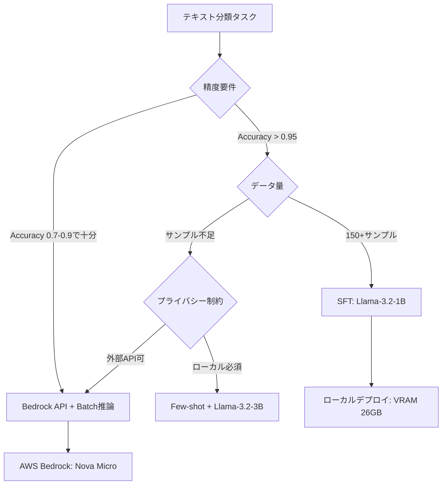

## 論文概要

本記事は [https://arxiv.org/abs/2505.16078](https://arxiv.org/abs/2505.16078) の解説記事です。

Li et al. (2025) は、産業用テキスト分類タスクにおける小規模言語モデル（Small Language Models, SLM）の有効性を体系的に調査した論文である。ChatGPTやLlama-3.3-70Bのような大規模デコーダモデルが支配的な現在、実務では「どのモデルをどの手法で使うべきか」という選択が依然として課題となっている。著者らは、メール分類・法的文書カテゴリ化・超長文学術テキスト分類という3つの産業ユースケースにおいて、1B-3Bパラメータ規模のSLMとエンコーダモデル（ModernBERT）を比較し、ファインチューニング（SFT）がプロンプトエンジニアリングを大幅に上回ることを報告している。

この記事は [Zenn記事: Amazon Bedrock Novaバッチ推論で社内問い合わせ分類のコストを50%削減する](https://zenn.dev/0h_n0/articles/164086e37b0fd2) の深掘りです。

## 情報源

- **arXiv ID**: 2505.16078
- **URL**: [https://arxiv.org/abs/2505.16078](https://arxiv.org/abs/2505.16078)
- **著者**: Lujun Li, Lama Sleem, Niccolò Gentile, Geoffrey Nichil, Radu State
- **発表年**: 2025年（arXiv投稿: 2025年5月、最終改訂: 2025年6月）
- **分野**: cs.CL（計算言語学）
- **カンファレンス**: ACL 2025 Industry Track

## カンファレンス情報

ACL（Association for Computational Linguistics）は自然言語処理・計算言語学分野における最高峰の国際会議であり、採択率は例年20-25%程度である。本論文が採択されたIndustry Trackは、学術的な新規性に加えて産業での実用性・再現性を重視する部門であり、理論のみの論文とは異なり「実際のビジネスで機能するか」が評価基準となる。本論文は保険メール分類やEU法律文書分類など実在の産業タスクを対象としており、Industry Trackの趣旨に合致している。

## 背景と動機

大規模言語モデル（LLM）の急速な発展に伴い、テキスト分類のような定型的なNLPタスクにおいても「とりあえずGPT-4を使う」という風潮が広がっている。しかし、産業環境では以下の制約がある。

1. **推論効率**: デコーダのみのモデルはトークン単位の自己回帰生成を行うため、分類ラベルの出力に不必要なオーバーヘッドが生じる
2. **GPU資源**: Llama-3.3-70Bの推論には168GBのVRAMが必要であり（論文Table 6より）、オンプレミス環境での運用はA100 80GB x 2以上が前提となる
3. **コスト**: 外部APIの従量課金は予測困難であり、データの機密性からローカルデプロイが必須な業界（保険、法務等）も多い
4. **データプライバシー**: 保険メールや法的文書を外部APIに送信できない規制環境が存在する

著者らはこれらの課題に対し、1B-3Bパラメータのコンパクトなモデルが「十分な精度」と「実用的なリソース消費」を両立できるかを3つの産業データセットで体系的に調査している。

## 主要な貢献

- **産業データセットでの体系的比較**: EU法律文書（EURLEX57K）、超長文学術テキスト（LDD）、保険メール（IE）の3つの実データセットにおいて、プロンプトエンジニアリングとファインチューニングの効果を比較
- **SLMの実用性の実証**: Llama-3.2-1B（SFT）がEURLEX57KでAccuracy 0.999を達成し、GPT-4o-miniの0.833を大幅に上回ることを報告（論文Table 3より）
- **エンコーダ vs デコーダの定量分析**: ModernBERT-base（149Mパラメータ）の推論VRAMが1.72GBである一方、Llama-3.2-1BのSFTには27.36GBを要するというリソース効率の差異を明示（論文Table 6より）
- **プロンプトエンジニアリングの限界**: Zero-shot、Few-shot、Chain-of-Thought、Self-Consistency CoT、Chain-of-Draftの5手法を比較し、SLMではCoT/CoD系手法がほぼ無効であることを報告
- **データ量と性能の関係**: 50-150サンプルで単純タスクは収束するが、複雑タスクでは線形に性能が向上し続けることを図示

## 技術的詳細

### プロンプトエンジニアリング vs SFT

著者らは論文Table 1において、5種類のプロンプト戦略を定義している。

1. **Base Prompt**: ラベルの説明文と入力テキストのみを提示するゼロショット分類
2. **Few-shot Prompt**: 各ラベルにつき数例のデモンストレーションを追加
3. **Chain-of-Thought (CoT)**: 推論過程を段階的に記述させる手法（Wei et al., 2022）
4. **Self-Consistency CoT**: 複数の推論パスを生成し多数決で最終回答を決定（3パス）
5. **Chain-of-Draft (CoD)**: 推論過程を簡潔に記述させるCoTの変形

SLM（1B-3Bパラメータ）においては、CoTおよびCoD系手法は性能改善にほぼ寄与していない。著者らはこの原因として、小規模モデルの推論能力の限界を挙げている。Few-shotプロンプティングのみがBase Promptに対して10ポイント以上の改善をEURLEX57KとLDDで示している（論文Table 3より）。

### ファインチューニング手法

著者らは3つのファインチューニング手法を比較している。

**SFT（Supervised Fine-Tuning）**: デコーダモデルの最終隠れ状態に分類ヘッドを追加し、全パラメータを更新する。損失関数はBCEWithLogitsLossを使用する。

$$
\mathcal{L}_{\text{SFT}} = -\frac{1}{N} \sum_{i=1}^{N} \sum_{c=1}^{C} \left[ y_{ic} \log \sigma(z_{ic}) + (1 - y_{ic}) \log (1 - \sigma(z_{ic})) \right]
$$

ここで、$N$はサンプル数、$C$はクラス数、$y_{ic}$はサンプル$i$のクラス$c$に対する正解ラベル（0 or 1）、$z_{ic}$は分類ヘッドの出力logit、$\sigma$はシグモイド関数である。

**Soft Prompt Tuning（SPT）**: 128個の学習可能な仮想トークンを入力の先頭に付加し、これらのみを最適化する。モデル本体のパラメータは凍結される。

**Prefix Tuning（PT）**: Attention層のKey-Valueに学習可能なプレフィックステンソルを挿入する。SPTと同様に仮想トークン数は128である。

### 分類ヘッドの設計

著者らは論文Table 5において、分類ヘッドの層数と性能の関係を調査している。Llama-3.2-1Bの出力次元は2,048であり、この特徴量から分類ラベルへの写像を学習する。

| 層数 | Accuracy | F1 |
|------|----------|-----|
| 1 | 0.89 | 0.89 |
| 2 | 0.91 | 0.91 |
| 3 | 0.92 | 0.92 |
| 4 | 0.91 | 0.91 |
| 5 | 0.91 | 0.91 |

3層の分類ヘッドが最良の結果を示しており、それ以上の深さでは過学習の傾向が見られると著者らは報告している。

### VRAM使用量分析

論文Table 6で報告されているVRAM使用量は、モデル選択の実務的な判断基準となる。

| モデル | パラメータ数 | 訓練時VRAM (GB) | 推論時VRAM (GB) | コンテキスト長 |
|--------|------------|----------------|----------------|--------------|
| ModernBERT-base | 149M | 12.82 | 1.72 | 8,192 |
| ModernBERT-large | 395M | 25.48 | 3.35 | 8,192 |
| Llama-3.2-1B | 1B | 27.36 | 25.78 | 128k |
| Llama-3.2-3B | 3B | 65.52 | 39.55 | 128k |
| Llama-3.3-70B | 70B | N/A | 168.00 | 128k |

ModernBERT-baseの推論VRAMはLlama-3.2-1Bの約15分の1であり、コンシューマGPU（RTX 4060: 8GB）でも動作可能である。一方、128kトークンのコンテキスト長はデコーダモデルの利点であり、LDDの平均10,378ワード（約20,000トークン）のような長文には有利に働く。

## 実装のポイント

### 訓練設定

著者らが報告している標準的な訓練設定は以下の通りである（論文Section 3より）。

- **学習率**: 1e-6
- **エポック数**: 10
- **バッチサイズ**: 8
- **最大コンテキスト長**: 4,096トークン
- **Self-Consistency CoTパス数**: 3

### ローカルデプロイの実現可能性

ModernBERT-baseであれば推論に1.72GBのVRAMで済むため、エッジデバイスやT4 GPU（16GB）でも複数モデルの同時稼働が可能である。一方、Llama-3.2-1BのSFTモデルは訓練に27.36GBを要するが、A10G GPU（24GB）では勾配チェックポイントや混合精度訓練を活用しても厳しく、A100 40GB以上が推奨される。

コスト効率の観点では、Llama-3.2-1BのSFTはEURLEX57Kで0.508 GPU時間（13.813 GPU-RAM時間）、LDDでも1.698 GPU時間で訓練が完了する（論文Table 7より）。クラウドGPUの時間単価（A100: 約$3-4/時間）を考慮すると、訓練コストは$2-7程度であり、API呼び出しの累積コストと比較して桁違いに安価である。

## Production Deployment Guide

本論文はテキスト分類モデルのローカルデプロイとコスト分析を主要テーマとしており、産業環境への実装指針が含まれている。以下では、論文の知見をAWS上で実現するための具体的な構成を示す。

### AWS実装パターン（コスト最適化重視）

論文が示すモデル選択の知見に基づき、トラフィック量に応じた3構成を提案する。

**Small構成（~100リクエスト/日）: Lambda + Bedrock**
- AWS Lambda（メモリ512MB、タイムアウト30秒）でリクエスト受信
- Amazon Bedrock（Nova Micro）で推論（関連Zenn記事で採用されたBatch推論と同系統）
- DynamoDB（On-Demand）で分類結果キャッシュ
- 月額概算: $30-80（Bedrock従量課金が主）

**Medium構成（~1,000リクエスト/日）: ECS Fargate + SageMaker**
- ECS Fargate（0.5 vCPU, 1GB RAM）でAPIサーバ
- SageMaker Endpoint（ml.g5.xlarge）にModernBERT-baseをデプロイ（推論VRAM 1.72GBで十分）
- Auto Scaling（最小1、最大4）
- 月額概算: $250-600（SageMaker Endpointが主）

**Large構成（10,000+リクエスト/日）: EKS + Spot Instances**
- EKS Cluster + Karpenter（Spot優先: g5.xlarge）
- Llama-3.2-1B SFTモデルをvLLMでサービング
- HPA（Horizontal Pod Autoscaler）によるスケーリング
- 月額概算: $1,500-4,000（Spot利用で最大70%削減）

**コスト削減テクニック**:
- Spot Instancesの活用: g5.xlarge On-Demand $1.006/h → Spot約$0.30/h（最大70%削減）
- Reserved Instances: 1年全額前払いで最大40%削減
- SageMaker Savings Plans: 1年コミットで最大64%削減
- Bedrock Batch API: 同期推論比50%削減（関連Zenn記事の手法と同一）

> **注意**: 上記コスト試算は2026年6月時点のAWS ap-northeast-1（東京）リージョン料金に基づく概算値です。実際のコストはトラフィックパターン、リージョン、バースト使用量により変動します。最新料金は[AWS料金計算ツール](https://calculator.aws/)で確認してください。

### Terraformインフラコード

**Small構成（Serverless: Lambda + Bedrock）**

```hcl
# --- Small構成: Lambda + Bedrock + DynamoDB ---

terraform {
  required_version = ">= 1.9"
  required_providers {
    aws = { source = "hashicorp/aws", version = "~> 5.80" }
  }
}

provider "aws" {
  region = "ap-northeast-1"
}

# DynamoDB: 分類結果キャッシュ（On-Demandでコスト最適化）
resource "aws_dynamodb_table" "classification_cache" {
  name         = "text-classification-cache"
  billing_mode = "PAY_PER_REQUEST"
  hash_key     = "document_hash"

  attribute {
    name = "document_hash"
    type = "S"
  }

  ttl {
    attribute_name = "expires_at"
    enabled        = true
  }

  server_side_encryption {
    enabled = true # KMS暗号化
  }

  tags = {
    Project = "text-classification"
    CostCenter = "ml-inference"
  }
}

# IAMロール: Lambda用（最小権限）
resource "aws_iam_role" "lambda_role" {
  name = "text-classifier-lambda-role"
  assume_role_policy = jsonencode({
    Version = "2012-10-17"
    Statement = [{
      Action    = "sts:AssumeRole"
      Effect    = "Allow"
      Principal = { Service = "lambda.amazonaws.com" }
    }]
  })
}

resource "aws_iam_role_policy" "lambda_policy" {
  name = "text-classifier-policy"
  role = aws_iam_role.lambda_role.id
  policy = jsonencode({
    Version = "2012-10-17"
    Statement = [
      {
        Effect   = "Allow"
        Action   = ["bedrock:InvokeModel"]
        Resource = "arn:aws:bedrock:ap-northeast-1::foundation-model/amazon.nova-micro-v1:0"
      },
      {
        Effect   = "Allow"
        Action   = ["dynamodb:GetItem", "dynamodb:PutItem"]
        Resource = aws_dynamodb_table.classification_cache.arn
      },
      {
        Effect   = "Allow"
        Action   = ["logs:CreateLogGroup", "logs:CreateLogStream", "logs:PutLogEvents"]
        Resource = "arn:aws:logs:ap-northeast-1:*:*"
      }
    ]
  })
}

# Lambda関数
resource "aws_lambda_function" "classifier" {
  function_name = "text-classifier"
  runtime       = "python3.12"
  handler       = "handler.lambda_handler"
  role          = aws_iam_role.lambda_role.arn
  memory_size   = 512
  timeout       = 30
  filename      = "lambda_package.zip"

  environment {
    variables = {
      CACHE_TABLE  = aws_dynamodb_table.classification_cache.name
      MODEL_ID     = "amazon.nova-micro-v1:0"
    }
  }

  tracing_config {
    mode = "Active" # X-Ray有効化
  }
}

# CloudWatchアラーム: コスト監視
resource "aws_cloudwatch_metric_alarm" "lambda_cost" {
  alarm_name          = "text-classifier-high-invocations"
  comparison_operator = "GreaterThanThreshold"
  evaluation_periods  = 1
  metric_name         = "Invocations"
  namespace           = "AWS/Lambda"
  period              = 86400
  statistic           = "Sum"
  threshold           = 500
  alarm_description   = "Daily invocations exceed expected volume"

  dimensions = {
    FunctionName = aws_lambda_function.classifier.function_name
  }
}
```

**Large構成（Container: EKS + Karpenter + Spot）**

```hcl
# --- Large構成: EKS + Karpenter + Spot Instances ---

module "eks" {
  source  = "terraform-aws-modules/eks/aws"
  version = "~> 20.31"

  cluster_name    = "text-classifier-cluster"
  cluster_version = "1.31"

  vpc_id     = module.vpc.vpc_id
  subnet_ids = module.vpc.private_subnets

  cluster_endpoint_public_access = false # プライベートアクセスのみ

  eks_managed_node_groups = {
    system = {
      instance_types = ["m7i.large"]
      min_size       = 1
      max_size       = 2
      desired_size   = 1
      labels         = { role = "system" }
    }
  }
}

# Karpenter: Spot優先の自動スケーリング
resource "kubectl_manifest" "karpenter_nodepool" {
  yaml_body = yamlencode({
    apiVersion = "karpenter.sh/v1"
    kind       = "NodePool"
    metadata   = { name = "gpu-inference" }
    spec = {
      template = {
        spec = {
          requirements = [
            { key = "karpenter.sh/capacity-type", operator = "In", values = ["spot", "on-demand"] },
            { key = "node.kubernetes.io/instance-type", operator = "In", values = ["g5.xlarge", "g5.2xlarge"] },
          ]
          nodeClassRef = { name = "default" }
        }
      }
      limits   = { cpu = "64", memory = "256Gi" }
      disruption = {
        consolidationPolicy = "WhenEmptyOrUnderutilized"
        consolidateAfter    = "30s"
      }
    }
  })
}

# Secrets Manager: モデル設定
resource "aws_secretsmanager_secret" "model_config" {
  name = "text-classifier/model-config"
}

# AWS Budgets: 月次予算アラート
resource "aws_budgets_budget" "monthly" {
  name         = "text-classifier-monthly"
  budget_type  = "COST"
  limit_amount = "4000"
  limit_unit   = "USD"
  time_unit    = "MONTHLY"

  notification {
    comparison_operator       = "GREATER_THAN"
    threshold                 = 80
    threshold_type            = "PERCENTAGE"
    notification_type         = "FORECASTED"
    subscriber_email_addresses = ["alerts@example.com"]
  }
}
```

### 運用・監視設定

**CloudWatch Logs Insights: コスト異常検知**

```
fields @timestamp, @message
| filter @message like /InvokeModel/
| stats count() as invocations, sum(input_tokens) as total_input, sum(output_tokens) as total_output by bin(1h)
| filter invocations > 100
| sort @timestamp desc
```

**CloudWatch アラーム設定（Python）**

```python
import boto3

cloudwatch = boto3.client("cloudwatch", region_name="ap-northeast-1")

def create_token_usage_alarm() -> None:
    """Bedrockトークン使用量スパイク検知アラーム"""
    cloudwatch.put_metric_alarm(
        AlarmName="bedrock-token-spike",
        MetricName="InputTokenCount",
        Namespace="AWS/Bedrock",
        Statistic="Sum",
        Period=3600,
        EvaluationPeriods=1,
        Threshold=50000,
        ComparisonOperator="GreaterThanThreshold",
        AlarmActions=["arn:aws:sns:ap-northeast-1:ACCOUNT:cost-alerts"],
        Dimensions=[{"Name": "ModelId", "Value": "amazon.nova-micro-v1:0"}],
    )
```

**X-Ray トレーシング設定（Python）**

```python
from aws_xray_sdk.core import xray_recorder, patch_all

patch_all()  # boto3自動計装

@xray_recorder.capture("classify_text")
def classify_text(text: str, model_id: str) -> dict:
    """テキスト分類をX-Rayトレース付きで実行"""
    subsegment = xray_recorder.current_subsegment()
    subsegment.put_annotation("model_id", model_id)
    subsegment.put_metadata("input_length", len(text))
    # ... 推論処理 ...
    return result
```

**Cost Explorer自動レポート（Python）**

```python
import boto3
from datetime import date, timedelta

ce = boto3.client("ce", region_name="us-east-1")

def daily_cost_report() -> dict:
    """日次コストレポート取得（Bedrock/Lambda/EKS）"""
    today = date.today()
    response = ce.get_cost_and_usage(
        TimePeriod={"Start": str(today - timedelta(days=1)), "End": str(today)},
        Granularity="DAILY",
        Metrics=["UnblendedCost"],
        Filter={
            "Dimensions": {
                "Key": "SERVICE",
                "Values": ["Amazon Bedrock", "AWS Lambda", "Amazon Elastic Kubernetes Service"],
            }
        },
        GroupBy=[{"Type": "DIMENSION", "Key": "SERVICE"}],
    )
    return response["ResultsByTime"]
```

### コスト最適化チェックリスト

**アーキテクチャ選択**
- [ ] トラフィック量に基づく構成選定（~100/日: Serverless、~1000/日: Hybrid、10000+/日: Container）
- [ ] 論文の知見を反映: Accuracy 0.99以上が不要ならModernBERT-base（VRAM 1.72GB）を選択
- [ ] マルチリンガル要件がある場合はLlama-3.2系を選択

**リソース最適化**
- [ ] EC2/EKS: Spot Instances優先（g5.xlarge: 最大70%削減）
- [ ] Reserved Instances: 1年全額前払い（安定ワークロード向け）
- [ ] Savings Plans: SageMaker Savings Plans検討（最大64%削減）
- [ ] Lambda: メモリサイズを512MBに最適化（推論待ち主体のためCPU不要）
- [ ] EKS: Karpenterで未使用ノードを30秒で回収

**LLMコスト削減**
- [ ] Bedrock Batch API使用（同期推論比50%削減）
- [ ] DynamoDBキャッシュによる重複推論排除（TTL付き）
- [ ] モデル選択ロジック: 短文はModernBERT、長文はLlama-3.2-1Bに振り分け
- [ ] トークン数制限: max_tokens設定で不要な生成を防止
- [ ] SFTモデルへの移行検討: API依存から脱却し固定費化

**監視・アラート**
- [ ] AWS Budgets: 月次予算アラート（予測80%で通知）
- [ ] CloudWatch: トークン使用量スパイク検知
- [ ] Cost Anomaly Detection: 自動異常検知
- [ ] 日次コストレポート: Bedrock/Lambda/EKS別集計

**リソース管理**
- [ ] 未使用SageMaker Endpoint削除（月$150-300/台の固定費）
- [ ] タグ戦略: Project/CostCenter/Environmentタグ必須
- [ ] S3ライフサイクルポリシー: 推論ログ90日でGlacier移行
- [ ] 開発環境: 夜間・休日のEKSノード停止

## 実験結果

### 主要ベンチマーク

著者らが報告している主要な実験結果を以下にまとめる（論文Table 3より）。

| モデル | 手法 | EURLEX57K (ACC/F1) | LDD (ACC/F1) | Insurance Email (ACC/F1) |
|--------|------|-------------------|-------------|------------------------|
| GPT-4o-mini | Zero-shot | 0.833 / 0.767 | 0.682 / 0.698 | - |
| Llama-3.3-70B | Base Prompt | 0.398 / 0.287 | 0.500 / 0.333 | 0.800 / 0.799 |
| Llama-3.2-1B | Few-shot | 0.387 / 0.377 | 0.132 / 0.113 | 0.500 / 0.333 |
| Llama-3.2-3B | Few-shot | 0.506 / 0.499 | 0.471 / 0.491 | 0.500 / 0.333 |
| Llama-3.2-1B | **SFT** | **0.999 / 0.999** | 0.892 / 0.890 | 0.865 / 0.863 |
| Llama-3.2-3B | **SFT** | 0.998 / 0.998 | **0.904 / 0.903** | **0.960 / 0.960** |
| ModernBERT-base | SFT | 0.333 / 0.167 | 0.810 / 0.811 | 0.514 / 0.408 |

この結果から以下の傾向が読み取れる。

1. **SFTの圧倒的優位**: Llama-3.2-1BのSFTはEURLEX57KでGPT-4o-miniを16.6ポイント上回っている。プロンプトエンジニアリングでは同モデルが0.387にとどまることから、SFTによる性能向上は61.2ポイントに達する
2. **1B vs 3Bの差は小さい**: EURLEX57Kでは1Bと3Bの差は0.001ポイントであり、リソース消費（VRAM: 27.36 vs 65.52 GB）に見合わない
3. **ModernBERTのドメイン依存性**: LDDでは0.810と健闘しているが、EURLEX57Kでは0.333（ランダム相当）に留まっている。著者らはModernBERTの事前学習データに法律文書が含まれていない可能性を指摘している

### データ量の影響

論文Figure 1によれば、EURLEX57K（3クラス）のような単純タスクでは50-150サンプルで性能が飽和する。一方、LDD（11クラス）やInsurance Email（2クラスだがマルチリンガル）では、データ量の増加に伴い性能が線形に向上し続ける傾向が報告されている。

### 訓練コスト

論文Table 7に基づく訓練コストの比較を示す。

| モデル・手法 | データセット | GPU時間 | GPU-RAM時間 |
|-------------|------------|---------|------------|
| Llama-3.2-1B SFT | EURLEX57K | 0.508 | 13.813 |
| Llama-3.2-3B SFT | EURLEX57K | 1.750 | 92.118 |
| ModernBERT-base SFT | LDD | 1.762 | 24.018 |
| Llama-3.2-3B SPT | LDD | 2.999 | 1040.624 |

SPT（Soft Prompt Tuning）はSFTの75倍以上のGPU-RAM時間を要する一方、性能はSFTに劣る（LDDでSPT: 0.641 vs SFT: 0.892）。著者らはSFTを「実用的な唯一の選択肢」と結論付けている。

## 実運用への応用

### Zenn記事との関連

関連Zenn記事「Amazon Bedrock Novaバッチ推論で社内問い合わせ分類のコストを50%削減する」で採用されているNova Microの選択は、本論文の知見と整合している。

本論文のTable 3において、GPT-4o-miniのゼロショット分類はEURLEX57Kで0.833、LDDで0.682であり、SFTモデルには及ばないものの、プロンプトのみで一定の性能を示している。Nova MicroはGPT-4o-miniと同価格帯のコンパクトモデルであり、Batch API（50%コスト削減）と組み合わせることで、SFTの訓練コストを回避しつつ実用的なコスト効率を達成できる。

一方、分類精度がビジネスクリティカルな場合（法的文書分類、保険査定等）には、本論文が示すように1BパラメータのSFTモデルがAccuracy 0.999を達成しており、API依存からの脱却とコスト固定化を同時に実現できる。社内問い合わせ分類の精度要件とコスト制約に応じて、Bedrock API方式（Zenn記事）とSFTローカルデプロイ方式（本論文）を使い分けることが推奨される。



## 関連研究

- **ModernBERT (Warner et al., 2024)**: エンコーダのみのアーキテクチャを現代的な訓練手法で再構成したモデル。本論文ではベースライン比較対象として使用されている。8,192トークンのコンテキスト長で、BERTの512トークン制限を大幅に拡張している
- **Chain-of-Thought Prompting (Wei et al., 2022)**: 推論過程を段階的に生成させることでLLMの推論能力を引き出す手法。本論文ではSLMにおいてCoTの効果が限定的であることが示されている
- **Longformer (Beltagy et al., 2020)**: 長文処理のためのスパースアテンション機構を持つモデル。LDDのような超長文分類タスクで参照される先行研究であるが、本論文ではLlama-3.2の128kコンテキスト長で長文処理を実現している
- **Knowledge Distillation for Classification (Nityasya et al., 2022)**: 大規模モデルの知識を小規模モデルに蒸留する手法。SFTと相補的なアプローチとして著者らが関連研究に挙げている

## まとめと今後の展望

本論文は、産業テキスト分類において1B-3Bパラメータ規模のSLMがSFTにより大規模モデルのゼロショット性能を大幅に上回ることを実データで示した。プロンプトエンジニアリング（CoT、Self-Consistency等）はSLMでは効果が限定的であり、SFTが「実用的な唯一の選択肢」であるという結論は、モデル選択の意思決定に明確な指針を提供している。

著者らは今後の課題として、SPTにおける仮想トークン数の最適化、ModernBERTの事前学習データ構成の影響分析、Gemma-2Bのような他のSLMとの比較を挙げている。産業応用の観点では、SFTモデルのローカルデプロイによるデータプライバシーの確保と、Bedrock Batch APIによるコスト効率のバランスが、実務上の選択軸となる。

## 参考文献

- **arXiv**: [https://arxiv.org/abs/2505.16078](https://arxiv.org/abs/2505.16078)
- **カンファレンス**: ACL 2025 Industry Track
- **Related Zenn article**: [https://zenn.dev/0h_n0/articles/164086e37b0fd2](https://zenn.dev/0h_n0/articles/164086e37b0fd2)
