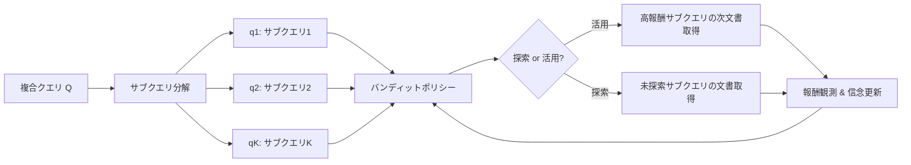

本記事は [arXiv:2510.18633](https://arxiv.org/abs/2510.18633) の解説記事です。

## 論文概要（Abstract）

Roxana Petcu, Kenton Murray, Daniel Khashabiらによる本論文は、RAG（Retrieval-Augmented Generation）における複合クエリの分解を**多腕バンディット（Multi-Armed Bandit, MAB）問題**として定式化する。従来のクエリ分解手法は全サブクエリに均等にリソースを配分していたが、本手法はサブクエリごとの有用性に対する信念（belief）を逐次更新しながら、文書検索の探索（exploration）と活用（exploitation）を動的にバランスさせる。著者らは、文書レベルのprecisionで35%向上、$\alpha$-nDCGで15%向上を報告しており、下流タスクの長文回答生成でも性能改善が確認されている。

この記事は [Zenn記事: セマンティック検索の本番精度を体系的に改善する実践ガイド](https://zenn.dev/0h_n0/articles/82c0ac24bdf739) の深掘りである。Zenn記事のSection 3「クエリ変換で検索意図のギャップを埋める」で紹介されているSub-Query Decompositionパターンを、理論的に最適化する手法として本論文を位置付ける。

## 情報源

- **arXiv ID**: 2510.18633
- **URL**: [https://arxiv.org/abs/2510.18633](https://arxiv.org/abs/2510.18633)
- **著者**: Roxana Petcu, Kenton Murray, Daniel Khashabi et al.（University of Amsterdam, Johns Hopkins University）
- **発表年**: 2025年10月
- **分野**: cs.AI（Artificial Intelligence）

## 背景と動機（Background & Motivation）

RAGシステムにおいて、ユーザーの複雑なリクエストを複数のサブクエリに分解して個別に検索する手法（Query Decomposition）は広く用いられている。しかし従来の分解手法には以下の構造的問題がある。

**均等リソース配分の非効率性**: 分解された$K$個のサブクエリそれぞれに対して同数の文書を検索する。しかし実際には、あるサブクエリは関連文書が豊富で少数の検索で十分な一方、別のサブクエリは関連文書が乏しく検索リソースの浪費につながる。

**検索バジェットの制約**: 実運用ではレイテンシやコストの制約から、検索可能な文書数に上限（バジェット$b$）がある。全サブクエリ$\times$全文書（$N \cdot K$件）を網羅的に検索するのは非現実的であり、限られたバジェット内で最大限の関連文書を獲得する戦略が必要となる。

**動的な判断の欠如**: 従来手法ではサブクエリの優先順位が静的に決定される。検索の途中で得られた情報（あるサブクエリの関連文書が枯渇した、など）に基づいてリソース配分を変更する仕組みがない。

これらの課題に対し、著者らはサブクエリ選択を**逐次的な意思決定問題**として捉え、バンディット学習のフレームワークで解決することを提案している。

## 主要な貢献（Key Contributions）

- **貢献1**: クエリ分解における文書検索を多腕バンディット問題として定式化。サブクエリを「腕（arm）」、文書の関連度を「報酬（reward）」とするモデルを構築
- **貢献2**: ランク情報を活用したBernoulli報酬関数の設計。検索エンジンの返却順位に含まれる暗黙の関連度シグナルをバンディットの報酬に変換する手法を提案
- **貢献3**: 階層的クエリ分解に対応するCorrelated MABの導入。親サブクエリの事後分布を子サブクエリに継承させる仕組みを設計
- **貢献4**: NeuCLIR24とResearchyQuestionsの2つのデータセットでprecision 35%向上、$\alpha$-nDCG 15%向上を達成し、下流の長文回答生成タスクでも一貫した改善を実証

## 技術的詳細（Technical Details）

### 問題設定

ユーザーのリクエスト$\mathcal{Q}$を$K$個のサブクエリ$\{q_1, q_2, \ldots, q_K\}$に分解する。各サブクエリ$q_i$に対して、検索エンジンは$N$件のランク付き文書リスト$\{d_{i,1}, d_{i,2}, \ldots, d_{i,N}\}$を返す。バジェット制約$b < N \cdot K$のもとで、関連文書の獲得を最大化することが目標である。

### バンディット定式化

各サブクエリ$q_i$を多腕バンディットの**腕（arm）**として扱う。各タイムステップ$t$で、エージェントは1つのサブクエリ$a_t \in \{q_1, \ldots, q_K\}$を選択し、その次の文書$d_{a_t, n}$を取得して報酬を観測する。この過程を$b$回繰り返す。



### 報酬関数の設計

著者らは複数の報酬関数を検討している。最も性能が高いのは**Bernoulli top-k**報酬であり、ランク情報と多様性を組み合わせている。

$$
r(a_t, n) = \frac{1}{k} \sum_{i=n}^{n+k-1} \text{Relevance}(d_{a_t, i}) \times \left(1 - \frac{\max \cos(d_{a_t, n}, d_{i,j})}{2}\right) + c \cdot \sqrt{\frac{\log_2(n+1)}{n}}
$$

ここで、

- $a_t$: タイムステップ$t$で選択されたサブクエリ
- $n$: 当該サブクエリで次に取得する文書のランク位置
- $k$: 関連度を平均するウィンドウサイズ
- $\text{Relevance}(d)$: 文書$d$の関連度推定値（ランク情報から導出）
- $\cos(d_1, d_2)$: 文書ペアのコサイン類似度（多様性ペナルティ）
- $c$: 探索係数（UCB項、$c \to 0$で活用重視）

この報酬関数は3つの要素を統合している。(1) **ランク情報の活用**: 検索エンジンが返すランク順位に含まれる暗黙の関連度信号を、局所ウィンドウ内の平均として捉える。(2) **多様性ペナルティ**: 既に取得済みの文書と類似度が高い文書には低い報酬を与え、冗長な文書の取得を抑制する。(3) **UCB探索項**: 観測回数が少ないサブクエリへの探索を促進する。

### Thompson Samplingによるサブクエリ選択

著者らはThompson Sampling（TS）をバンディットポリシーとして採用している。離散空間（Bernoulli）の場合のアルゴリズムは以下の通りである。

**初期化**: 各サブクエリ$q_i$に対してBeta事前分布を設定する。

$$
\alpha_i = 1, \quad \beta_i = 1 \quad (\text{一様事前分布})
$$

**各タイムステップ$t$で**:

1. 各サブクエリ$q_i$について、事後分布からサンプリング: $\theta_i \sim \text{Beta}(\alpha_i, \beta_i)$
2. 最大のサンプル値を持つサブクエリを選択: $a_t = \arg\max_i \theta_i$
3. 文書$d_{a_t, n}$を取得し、報酬$r(a_t, n)$を観測
4. パラメータを更新:

$$
\alpha_{a_t} \leftarrow \alpha_{a_t} + r(a_t, n), \quad \beta_{a_t} \leftarrow \beta_{a_t} + (1 - r(a_t, n))
$$

この更新により、高い報酬を得たサブクエリの$\alpha$が増加し、そのサブクエリがより高い確率で選択されるようになる（活用）。一方、観測が少ないサブクエリはBeta分布の分散が大きいため、高い値がサンプルされる可能性が残り、探索が自然に促進される。

### 階層的クエリ分解（Correlated MAB）

複雑なリクエストでは、サブクエリをさらに細分化する階層的分解が有効となる。著者らは親サブクエリの事後分布を子サブクエリの事前分布に継承させる**Correlated MAB**を提案している。

$$
\text{子の事前分布} = \text{Beta}(\lambda \cdot \alpha_{\text{parent}}, \lambda \cdot \beta_{\text{parent}})
$$

ここで$\lambda \in (0, 1]$は継承係数である。$\lambda = 1$で親の信念を完全に継承し、$\lambda \to 0$で一様事前分布に近づく。

サブクエリ$q_i$の展開条件は以下の通りである。

$$
\mathbb{E}[q_i] = \frac{\alpha_i}{\alpha_i + \beta_i} > \tau \quad \text{かつ} \quad n_i \geq n_{\min}
$$

ここで$\tau$は情報量の閾値、$n_{\min}$は最小観測回数である。期待報酬が閾値を超え、十分な観測が蓄積されたサブクエリのみが展開される。

## 実装のポイント（Implementation）

以下にThompson Samplingを用いたバンディットベースクエリ分解の実装例を示す。

```python
from dataclasses import dataclass, field
import math
import random
from typing import Protocol


class RelevanceEstimator(Protocol):
    """文書の関連度を推定するインターフェース"""

    def estimate(self, query: str, document: str) -> float:
        """関連度スコアを返す（0.0-1.0）"""
        ...


@dataclass
class SubQueryArm:
    """バンディットの腕としてのサブクエリ

    Attributes:
        query: サブクエリ文字列
        alpha: Beta分布のalphaパラメータ
        beta: Beta分布のbetaパラメータ
        doc_cursor: 次に取得する文書のインデックス
        retrieved_docs: 取得済み文書リスト
    """

    query: str
    alpha: float = 1.0
    beta: float = 1.0
    doc_cursor: int = 0
    retrieved_docs: list[str] = field(default_factory=list)

    @property
    def expected_reward(self) -> float:
        """期待報酬（Beta分布の期待値）"""
        return self.alpha / (self.alpha + self.beta)

    def sample_theta(self) -> float:
        """Beta分布からThompson Sampling"""
        return random.betavariate(self.alpha, self.beta)

    def update(self, reward: float) -> None:
        """報酬観測に基づくパラメータ更新

        Args:
            reward: 観測された報酬値（0.0-1.0）
        """
        self.alpha += reward
        self.beta += 1.0 - reward


@dataclass
class BanditQueryDecomposer:
    """バンディットベースのクエリ分解器

    Args:
        arms: サブクエリに対応する腕のリスト
        budget: 検索バジェット（取得文書数の上限）
        top_k_window: 報酬計算のウィンドウサイズ
    """

    arms: list[SubQueryArm]
    budget: int
    top_k_window: int = 5

    def select_arm(self) -> SubQueryArm:
        """Thompson Samplingで次に探索するサブクエリを選択

        Returns:
            選択されたサブクエリの腕
        """
        best_arm = max(self.arms, key=lambda arm: arm.sample_theta())
        return best_arm

    def compute_reward(
        self,
        arm: SubQueryArm,
        relevance_scores: list[float],
        diversity_penalty: float,
    ) -> float:
        """Bernoulli top-k報酬を計算

        Args:
            arm: 選択された腕
            relevance_scores: ウィンドウ内の関連度スコアリスト
            diversity_penalty: 多様性ペナルティ（0.0-1.0）

        Returns:
            計算された報酬値
        """
        if not relevance_scores:
            return 0.0

        avg_relevance = sum(relevance_scores) / len(relevance_scores)
        novelty = 1.0 - diversity_penalty / 2.0
        n = arm.doc_cursor + 1
        ucb_bonus = math.sqrt(math.log2(n + 1) / max(n, 1)) * 0.01

        return avg_relevance * novelty + ucb_bonus

    def run(
        self,
        ranked_lists: dict[str, list[str]],
        estimator: RelevanceEstimator,
    ) -> list[tuple[str, str]]:
        """バンディットポリシーに基づく文書選択を実行

        Args:
            ranked_lists: サブクエリ -> ランク付き文書リストの辞書
            estimator: 関連度推定器

        Returns:
            (サブクエリ, 文書)のペアリスト
        """
        selected: list[tuple[str, str]] = []

        for _ in range(self.budget):
            arm = self.select_arm()

            if arm.doc_cursor >= len(ranked_lists.get(arm.query, [])):
                continue

            doc = ranked_lists[arm.query][arm.doc_cursor]
            relevance = estimator.estimate(arm.query, doc)

            window_end = min(
                arm.doc_cursor + self.top_k_window,
                len(ranked_lists[arm.query]),
            )
            window_scores = [
                estimator.estimate(arm.query, ranked_lists[arm.query][j])
                for j in range(arm.doc_cursor, window_end)
            ]

            diversity_penalty = 0.0
            reward = self.compute_reward(arm, window_scores, diversity_penalty)

            arm.update(reward)
            arm.retrieved_docs.append(doc)
            arm.doc_cursor += 1
            selected.append((arm.query, doc))

        return selected
```

**実装上の注意点**:

- **報酬のスケーリング**: 関連度スコアは0-1の範囲に正規化する。Beta分布の更新は$[0, 1]$区間の報酬を前提とするため、範囲外の値は収束を不安定にする
- **ウィンドウサイズ$k$の選択**: 著者らは$k=4$から$k=5$で最良の結果を報告している（論文Table 3, 4より）。小さすぎると分散が大きく、大きすぎるとランク下位の無関連文書の影響を受ける
- **継承係数$\lambda$**: 階層的分解では$\lambda = 0.5$程度が推奨される。$\lambda$が大きすぎると親の偏りが子に過度に伝播し、探索が不足する

## Production Deployment Guide

### AWS実装パターン（コスト最適化重視）

バンディットベースのクエリ分解をRAGパイプラインに組み込む場合、トラフィック量に応じて以下の構成を推奨する。

**トラフィック量別の推奨構成**:

| 構成 | 規模 | 月額コスト概算 | 構成要素 |
|------|------|-------------|---------|
| Small | ~100 req/日 | $80-200 | Lambda + Bedrock + DynamoDB + OpenSearch Serverless |
| Medium | ~1,000 req/日 | $400-900 | ECS Fargate + Bedrock + ElastiCache + OpenSearch |
| Large | 10,000+ req/日 | $2,500-6,000 | EKS + Spot + Bedrock Batch + OpenSearch Managed |

**Small構成（~100 req/日）**:
- Lambda（1024MB, 30秒タイムアウト）: バンディットポリシー実行、$5-15/月
- Bedrock（Claude Sonnet / Haiku）: クエリ分解＋回答生成、$30-100/月
- OpenSearch Serverless（0.5 OCU）: ベクトル検索、$30-50/月
- DynamoDB On-Demand: バンディット状態保存、$5-10/月

**Medium構成（~1,000 req/日）**:
- ECS Fargate（0.5 vCPU, 1GB RAM, 2タスク）: バンディットエンジン常駐、$60-120/月
- Bedrock: クエリ分解＋回答生成、$200-500/月
- ElastiCache（cache.t4g.micro）: Beta分布パラメータのキャッシュ、$15-30/月
- OpenSearch（t3.small.search, 2ノード）: ベクトル検索、$120-250/月

**Large構成（10,000+ req/日）**:
- EKS + Karpenter（Spot優先）: バンディットエンジン、$300-800/月
- Bedrock Batch API: バッチ処理で50%コスト削減、$800-2,500/月
- OpenSearch Managed（r6g.large.search, 3ノード）: $400-900/月
- ElastiCache（r7g.large, 2ノード）: $250-500/月

**コスト削減テクニック**:
- **Spot Instances**: EKSワーカーノードにSpot Instancesを使用し、最大90%削減
- **Bedrock Batch API**: 非リアルタイムのクエリ分解処理をBatch APIに移行し50%削減
- **Prompt Caching**: Bedrock Prompt Cachingを有効化し、同一パターンのクエリ分解で30-90%削減
- **Reserved Instances**: OpenSearch/ElastiCacheの1年コミットで最大72%削減

**コスト試算の注意事項**: 上記はAWS ap-northeast-1（東京）リージョンの2026年6月時点の概算値である。実際のコストはトラフィックパターン、バースト使用量、Bedrockモデル選択により変動する。最新料金はAWS料金計算ツールで確認を推奨する。

### Terraformインフラコード

**Small構成（Serverless）**:

```hcl
# Bandit Query Decomposer - Small Serverless構成
# Lambda + Bedrock + DynamoDB + OpenSearch Serverless

terraform {
  required_version = ">= 1.9"
  required_providers {
    aws = {
      source  = "hashicorp/aws"
      version = "~> 5.80"
    }
  }
}

provider "aws" {
  region = "ap-northeast-1"
}

# --- IAMロール（最小権限） ---
resource "aws_iam_role" "bandit_lambda" {
  name = "bandit-query-decomposer-lambda"
  assume_role_policy = jsonencode({
    Version = "2012-10-17"
    Statement = [{
      Action = "sts:AssumeRole"
      Effect = "Allow"
      Principal = { Service = "lambda.amazonaws.com" }
    }]
  })
}

resource "aws_iam_role_policy" "bandit_lambda_policy" {
  name = "bandit-lambda-policy"
  role = aws_iam_role.bandit_lambda.id
  policy = jsonencode({
    Version = "2012-10-17"
    Statement = [
      {
        # Bedrock: クエリ分解と回答生成のみ
        Effect   = "Allow"
        Action   = ["bedrock:InvokeModel", "bedrock:InvokeModelWithResponseStream"]
        Resource = "arn:aws:bedrock:ap-northeast-1::foundation-model/*"
      },
      {
        # DynamoDB: バンディット状態の読み書き
        Effect   = "Allow"
        Action   = ["dynamodb:GetItem", "dynamodb:PutItem", "dynamodb:UpdateItem"]
        Resource = aws_dynamodb_table.bandit_state.arn
      },
      {
        # CloudWatch Logs
        Effect   = "Allow"
        Action   = ["logs:CreateLogGroup", "logs:CreateLogStream", "logs:PutLogEvents"]
        Resource = "arn:aws:logs:ap-northeast-1:*:*"
      }
    ]
  })
}

# --- DynamoDB: バンディット状態管理 ---
resource "aws_dynamodb_table" "bandit_state" {
  name         = "bandit-query-state"
  billing_mode = "PAY_PER_REQUEST" # On-Demandでコスト最適化
  hash_key     = "session_id"
  range_key    = "subquery_id"

  attribute {
    name = "session_id"
    type = "S"
  }
  attribute {
    name = "subquery_id"
    type = "S"
  }

  # TTL: 24時間でセッション状態を自動削除
  ttl {
    attribute_name = "expires_at"
    enabled        = true
  }

  server_side_encryption {
    enabled = true # KMS暗号化
  }

  tags = {
    Project = "bandit-query-decomposer"
    Env     = "production"
  }
}

# --- Lambda関数 ---
resource "aws_lambda_function" "bandit_decomposer" {
  function_name = "bandit-query-decomposer"
  runtime       = "python3.12"
  handler       = "handler.lambda_handler"
  role          = aws_iam_role.bandit_lambda.arn
  timeout       = 30
  memory_size   = 1024

  filename         = "lambda_package.zip"
  source_code_hash = filebase64sha256("lambda_package.zip")

  environment {
    variables = {
      BANDIT_TABLE    = aws_dynamodb_table.bandit_state.name
      TOP_K_WINDOW    = "5"
      BUDGET_LIMIT    = "50"
      BEDROCK_MODEL   = "anthropic.claude-sonnet-4-20250514"
    }
  }

  tracing_config {
    mode = "Active" # X-Ray有効化
  }

  tags = {
    Project = "bandit-query-decomposer"
  }
}

# --- CloudWatchアラーム（コスト監視） ---
resource "aws_cloudwatch_metric_alarm" "lambda_duration" {
  alarm_name          = "bandit-lambda-high-duration"
  comparison_operator = "GreaterThanThreshold"
  evaluation_periods  = 3
  metric_name         = "Duration"
  namespace           = "AWS/Lambda"
  period              = 300
  statistic           = "Average"
  threshold           = 25000 # 25秒（30秒タイムアウトの83%）
  alarm_description   = "Lambda execution time approaching timeout"

  dimensions = {
    FunctionName = aws_lambda_function.bandit_decomposer.function_name
  }
}
```

**Large構成（Container）**:

```hcl
# Bandit Query Decomposer - Large Container構成
# EKS + Karpenter + Spot Instances

module "eks" {
  source  = "terraform-aws-modules/eks/aws"
  version = "~> 20.31"

  cluster_name    = "bandit-rag-cluster"
  cluster_version = "1.31"

  vpc_id     = module.vpc.vpc_id
  subnet_ids = module.vpc.private_subnets

  # Karpenterでノード管理
  enable_cluster_creator_admin_permissions = true

  cluster_addons = {
    karpenter = { most_recent = true }
  }

  tags = {
    Project = "bandit-query-decomposer"
    Env     = "production"
  }
}

# --- Karpenter Provisioner（Spot優先） ---
resource "kubectl_manifest" "karpenter_nodepool" {
  yaml_body = yamlencode({
    apiVersion = "karpenter.sh/v1"
    kind       = "NodePool"
    metadata   = { name = "bandit-workers" }
    spec = {
      template = {
        spec = {
          requirements = [
            { key = "karpenter.sh/capacity-type", operator = "In", values = ["spot", "on-demand"] },
            { key = "node.kubernetes.io/instance-type", operator = "In",
              values = ["m7i.large", "m7a.large", "m6i.large", "c7i.large"] },
          ]
          nodeClassRef = { name = "default" }
        }
      }
      limits   = { cpu = "32", memory = "64Gi" }
      disruption = {
        consolidationPolicy = "WhenEmptyOrUnderutilized"
        consolidateAfter    = "30s"
      }
    }
  })
}

# --- Secrets Manager（Bedrock設定） ---
resource "aws_secretsmanager_secret" "bedrock_config" {
  name                    = "bandit-rag/bedrock-config"
  recovery_window_in_days = 7
}

# --- AWS Budgets（予算アラート） ---
resource "aws_budgets_budget" "bandit_monthly" {
  name         = "bandit-rag-monthly"
  budget_type  = "COST"
  limit_amount = "6000"
  limit_unit   = "USD"
  time_unit    = "MONTHLY"

  notification {
    comparison_operator       = "GREATER_THAN"
    threshold                 = 80
    threshold_type            = "PERCENTAGE"
    notification_type         = "ACTUAL"
    subscriber_email_addresses = ["alerts@example.com"]
  }
}
```

### 運用・監視設定

**CloudWatch Logs Insights クエリ**:

```
# コスト異常検知: 1時間あたりのBedrock呼び出し回数とトークン使用量
fields @timestamp, @message
| filter @message like /bedrock_invoke/
| stats count() as invocations, sum(input_tokens) as total_input, sum(output_tokens) as total_output by bin(1h)
| filter invocations > 500
| sort @timestamp desc

# レイテンシ分析: バンディット選択のP95/P99
fields @timestamp, duration_ms
| filter event = "bandit_selection"
| stats percentile(duration_ms, 95) as p95, percentile(duration_ms, 99) as p99, avg(duration_ms) as avg_ms by bin(5m)
| filter p99 > 1000
```

**CloudWatch アラーム設定コード（Python）**:

```python
import boto3


def create_bedrock_token_alarm(
    function_name: str,
    sns_topic_arn: str,
    threshold: float = 100000,
) -> dict:
    """Bedrockトークン使用量スパイク検知アラームを作成

    Args:
        function_name: 監視対象のLambda関数名
        sns_topic_arn: 通知先SNSトピックARN
        threshold: トークン数閾値（デフォルト10万/5分）

    Returns:
        作成されたアラームのレスポンス
    """
    client = boto3.client("cloudwatch", region_name="ap-northeast-1")
    return client.put_metric_alarm(
        AlarmName=f"{function_name}-bedrock-token-spike",
        MetricName="InputTokenCount",
        Namespace="AWS/Bedrock",
        Statistic="Sum",
        Period=300,
        EvaluationPeriods=2,
        Threshold=threshold,
        ComparisonOperator="GreaterThanThreshold",
        AlarmActions=[sns_topic_arn],
        AlarmDescription="Bedrock token usage spike detected",
    )
```

**X-Ray トレーシング設定コード（Python）**:

```python
from aws_xray_sdk.core import xray_recorder, patch_all


def configure_xray_tracing(service_name: str = "bandit-decomposer") -> None:
    """X-Rayトレーシングを初期化

    Args:
        service_name: X-Rayサービス名
    """
    xray_recorder.configure(service=service_name)
    patch_all()  # boto3自動計装


def trace_bandit_selection(
    session_id: str,
    selected_arm: str,
    reward: float,
    budget_remaining: int,
) -> None:
    """バンディット選択をX-Rayにアノテーション記録

    Args:
        session_id: セッションID
        selected_arm: 選択されたサブクエリ
        reward: 観測された報酬
        budget_remaining: 残りバジェット
    """
    segment = xray_recorder.current_segment()
    segment.put_annotation("session_id", session_id)
    segment.put_annotation("selected_arm", selected_arm)
    segment.put_metadata("reward", reward, "bandit")
    segment.put_metadata("budget_remaining", budget_remaining, "bandit")
```

**Cost Explorer自動レポート（Python）**:

```python
import datetime
import json

import boto3


def get_daily_cost_report(
    days_back: int = 1,
    alert_threshold_usd: float = 100.0,
    sns_topic_arn: str | None = None,
) -> dict:
    """日次コストレポートを取得し閾値超過時にSNS通知

    Args:
        days_back: 遡る日数
        alert_threshold_usd: アラート閾値（USD/日）
        sns_topic_arn: 通知先SNSトピックARN

    Returns:
        サービス別コスト辞書
    """
    ce = boto3.client("ce", region_name="us-east-1")
    end = datetime.date.today()
    start = end - datetime.timedelta(days=days_back)

    response = ce.get_cost_and_usage(
        TimePeriod={"Start": str(start), "End": str(end)},
        Granularity="DAILY",
        Metrics=["BlendedCost"],
        GroupBy=[{"Type": "DIMENSION", "Key": "SERVICE"}],
        Filter={
            "Tags": {
                "Key": "Project",
                "Values": ["bandit-query-decomposer"],
            }
        },
    )

    costs: dict[str, float] = {}
    total = 0.0
    for group in response["ResultsByTime"][0]["Groups"]:
        service = group["Keys"][0]
        amount = float(group["Metrics"]["BlendedCost"]["Amount"])
        costs[service] = amount
        total += amount

    if total > alert_threshold_usd and sns_topic_arn:
        sns = boto3.client("sns", region_name="ap-northeast-1")
        sns.publish(
            TopicArn=sns_topic_arn,
            Subject=f"Cost Alert: ${total:.2f}/day exceeds ${alert_threshold_usd}",
            Message=json.dumps(costs, indent=2),
        )

    return costs
```

### コスト最適化チェックリスト

**アーキテクチャ選択**:
- [ ] ~100 req/日: Serverless構成（Lambda + Bedrock）を選択
- [ ] ~1,000 req/日: Hybrid構成（ECS Fargate + Bedrock）を選択
- [ ] 10,000+ req/日: Container構成（EKS + Spot + Bedrock Batch）を選択

**リソース最適化**:
- [ ] EC2/EKS: Spot Instancesを優先設定（最大90%削減）
- [ ] Reserved Instances: OpenSearch/ElastiCacheの1年コミットで最大72%削減
- [ ] Savings Plans: Compute Savings Plansの検討
- [ ] Lambda: メモリサイズをPower Tuningで最適化（1024MBが推奨起点）
- [ ] ECS/EKS: Karpenterで未使用ノードを30秒後に自動スケールダウン
- [ ] NAT Gateway: VPCエンドポイント（Bedrock, DynamoDB, S3）で通信コスト削減

**LLMコスト削減**:
- [ ] Bedrock Batch API: 非リアルタイム処理に使用し50%削減
- [ ] Prompt Caching: 同一パターンのクエリ分解テンプレートでキャッシュ有効化（30-90%削減）
- [ ] モデル選択ロジック: クエリ分解にはHaiku、回答生成にはSonnetを使い分け
- [ ] トークン数制限: サブクエリ生成のmax_tokensを制限（512-1024トークン推奨）
- [ ] サブクエリキャッシュ: 同一クエリパターンの分解結果をDynamoDB/ElastiCacheにキャッシュ

**監視・アラート**:
- [ ] AWS Budgets: 月次予算上限を設定し80%/100%で通知
- [ ] CloudWatch アラーム: Bedrockトークン使用量、Lambda実行時間を監視
- [ ] Cost Anomaly Detection: 異常支出の自動検知を有効化
- [ ] 日次コストレポート: Cost Explorer APIで自動取得、$100/日超過でSNS通知
- [ ] X-Rayトレーシング: バンディット選択のレイテンシ分布を可視化

**リソース管理**:
- [ ] 未使用リソース削除: Trusted Advisorで未使用EBS/EIP/NATを定期確認
- [ ] タグ戦略: Project/Envタグで全リソースのコスト配分を可視化
- [ ] ライフサイクルポリシー: CloudWatch Logsの保持期間を30日に設定
- [ ] 開発環境夜間停止: EventBridgeスケジュールで開発用ECS/EKSを平日夜間・週末停止
- [ ] DynamoDB TTL: バンディットセッション状態を24時間で自動削除

## 実験結果（Results）

著者らは2つのデータセットで評価を実施している。

**データセット**:
- **NeuCLIR24**: 多言語（中国語・ロシア語・ペルシャ語→英語）の19クエリ。各クエリを16個のサブクエリに直列分解。nuggetベースの評価。検索にはPLAID-X、LSR、Qwenのアンサンブルを使用
- **ResearchyQuestions**: 140インスタンス（関連文書率10%以上でフィルタ）。階層的2レベル分解。BM25による検索

**主要結果**（論文Table 3, 4より）:

| 手法 | NeuCLIR24 $\alpha$-nDCG (k=20) | ResearchyQuestions Precision (b=10%) |
|------|-------------------------------|-------------------------------------|
| Random baseline | 0.421 | 低 |
| Bernoulli（単純） | 0.502 | +21.6% |
| **Bernoulli top-k=5** | **0.555** | **+32.3%** |
| Bernoulli UCB | 0.538 | +28.1% |
| Gaussian（RFF） | 0.467 | 低 |

著者らはBernoulli top-k報酬が最も安定して高い性能を示すと報告している。Gaussian報酬はランク信号のノイズにより不安定であった（論文Figure 5の分析より）。

**下流タスク（長文回答生成）の結果**（論文Table 2より）:

バジェット$b = 20\%-30\%$の条件で、Auto-ARGUEフレームワークによる評価を実施している。

- Citation support: 6.0-9.9%改善
- Nugget coverage: 6.7-8.5%改善
- Sentence support: 7.3-9.6%改善

Top-k UCB with diversityが最良の結果を示した。バジェット100%では全手法が収束し、差異は消失する。これはバジェット制約下でのリソース配分最適化が本手法の本質的価値であることを示唆している。

## 実運用への応用（Practical Applications）

本手法は以下のRAGユースケースに特に適している。

**複合質問の検索最適化**: 「AWSのコスト最適化においてSpot InstancesとReserved Instancesの比較、および監視設定のベストプラクティス」のような複数トピックを含むクエリに対し、各サブトピックへの検索リソース配分を動的に最適化できる。

**レイテンシ制約下での品質最大化**: バジェット$b$をレイテンシ要件から逆算し（例: 2秒以内に検索完了 → 最大20文書）、その制約内で関連文書のカバレッジを最大化する。Zenn記事で紹介されているSub-Query Decompositionパターンに本手法を組み合わせることで、検索品質とレスポンスタイムの両立が可能となる。

**コスト効率の向上**: 全サブクエリ$\times$全文書の網羅的検索を避けることで、ベクトル検索のAPI呼び出し回数を削減し、OpenSearch Serverlessなどの従量課金サービスのコストを抑制できる。

**運用上の考慮事項**: バンディットの状態（Beta分布パラメータ）はセッション単位でDynamoDBに保存し、TTLで自動削除する。同一ユーザーの類似クエリに対してパラメータを再利用する「ウォームスタート」戦略も検討に値する。

## 関連研究（Related Work）

- **Multi-Query Retrieval**: 同一クエリを複数の表現に言い換えて検索する手法（Ma et al., 2023）。本論文のクエリ分解とは異なり、意味的に同一の情報を複数の角度から検索するアプローチであり、相補的に利用可能である
- **Step-back Prompting**: 具体的な質問から一歩引いた抽象的な質問を生成して検索する手法（Zheng et al., 2024）。本論文のサブクエリ分解が具体化方向であるのに対し、Step-backは抽象化方向であり、組み合わせにより検索の網羅性が向上する可能性がある
- **Adaptive Retrieval**: 検索の必要性を動的に判断する手法（Self-RAG, FLARE等）。本論文はサブクエリ間のリソース配分を最適化する点で、検索の「要否」ではなく「配分」に焦点を当てている

## まとめと今後の展望

本論文は、RAGにおけるクエリ分解を多腕バンディット問題として定式化し、サブクエリへの検索リソース配分を動的に最適化する手法を提案した。Bernoulli top-k報酬とThompson Samplingの組み合わせにより、文書レベルprecisionで35%、$\alpha$-nDCGで15%の向上が報告されている。

今後の研究方向として、著者らはサブクエリ集合の動的な拡張・縮小（現在は事前定義された集合を仮定）、検索エンジンの品質がバンディット報酬に与える影響の分析、およびマルチモーダル文書への拡張を挙げている。実務的には、バンディットのウォームスタート（過去のクエリパターンからの事前分布初期化）や、ユーザーフィードバックの報酬関数への統合が有望な方向性である。

## 参考文献

- **arXiv**: [https://arxiv.org/abs/2510.18633](https://arxiv.org/abs/2510.18633)
- **Code**: [https://anonymous.4open.science/r/query-decomposition-bandits-2A0D](https://anonymous.4open.science/r/query-decomposition-bandits-2A0D)
- **Related Zenn article**: [https://zenn.dev/0h_n0/articles/82c0ac24bdf739](https://zenn.dev/0h_n0/articles/82c0ac24bdf739)
