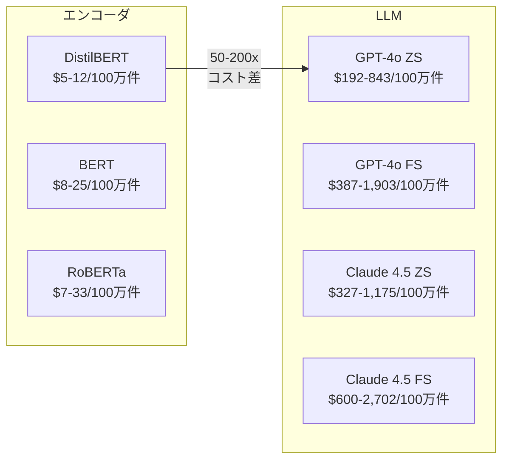
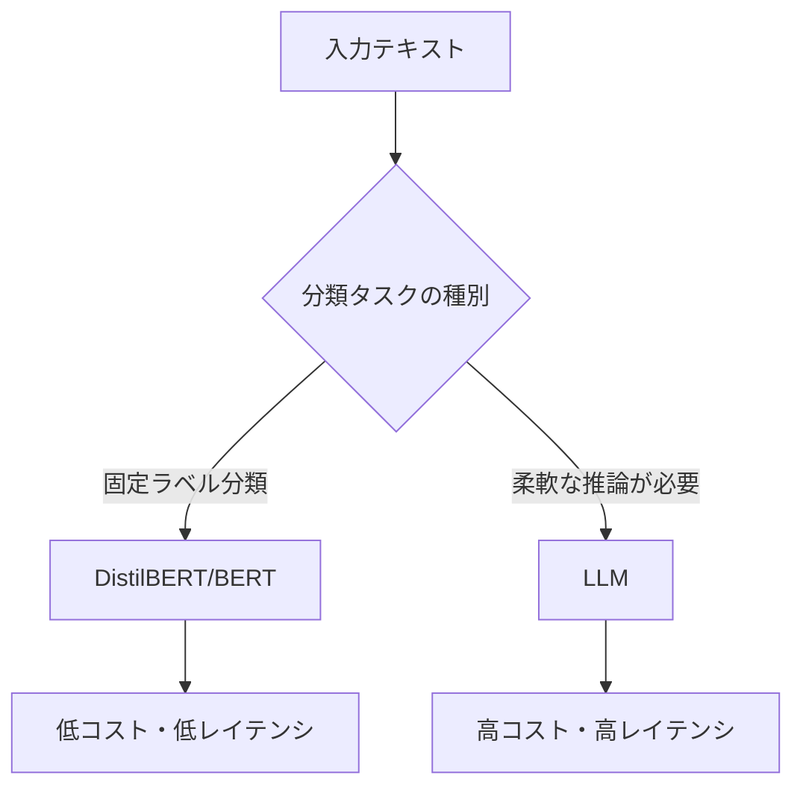

## 論文概要（Abstract）

本記事は [https://arxiv.org/abs/2602.06370](https://arxiv.org/abs/2602.06370) の解説記事です。

テキスト分類タスクにおいて、ファインチューニングされたBERT系エンコーダモデルとLLMプロンプティング（GPT-4o、Claude Sonnet 4.5）を、**予測品質（Macro F1）・推論コスト（USD）・レイテンシ（ms）**の3軸で多目的比較した研究である。4つの標準ベンチマーク（IMDB、SST-2、AG News、DBPedia）において、エンコーダモデルがLLMと同等以上の分類性能を1-2桁低いコストとレイテンシで達成することを、パレートフロンティア分析とパラメトリック効用関数により定量的に示している。プロダクション環境におけるテキスト分類でのLLM採用に再考を促す実証的な比較研究である。

この記事は [Zenn記事: Amazon Bedrock Novaバッチ推論で社内問い合わせ分類のコストを50%削減する](https://zenn.dev/0h_n0/articles/164086e37b0fd2) の深掘りです。

## 情報源

- **arXiv ID**: 2602.06370
- **URL**: [arXiv:2602.06370](https://arxiv.org/abs/2602.06370)
- **著者**: Alberto Andres Valdes Gonzalez
- **発表年**: 2026年2月
- **分野**: Computation and Language (cs.CL) / Machine Learning (cs.LG)
- **コード**: [GitHub - anvaldes/Finetuned-encoders-LLM-Prompting](https://github.com/anvaldes/Finetuned-encoders-LLM-Prompting)
- **デプロイコード**: [GitHub - anvaldes/bert-family-deploy](https://github.com/anvaldes/bert-family-deploy)

## 背景と動機（Background）

### テキスト分類のモデル選択問題

GPT-4oやClaude Sonnet 4.5のような大規模言語モデル（LLM）の登場により、テキスト分類タスクにおいてもゼロショット・フューショットプロンプティングが広く採用されるようになった。しかし、プロダクション環境でのテキスト分類は**固定ラベル集合への分類**という明確に定義されたタスクであり、LLMの汎用的な推論能力が本当に必要かという問いが生じる。

従来、モデル選択は精度（F1スコア）のみで評価されることが多かった。しかし、実運用では**推論コスト**と**レイテンシ**が意思決定に大きく影響する。100万リクエストあたりのコストが数十ドルと数千ドルでは、事業インパクトが根本的に異なる。

本論文の著者は、この問題を**多目的最適化**のフレームワークで定式化し、「精度のわずかな向上がコストの大幅な増加を正当化するか」を定量的に評価できる手法を提案している。これは、Zenn記事で取り上げたAmazon Bedrock Novaバッチ推論によるコスト削減と同じ問題意識であり、モデル選択の経済合理性を学術的に分析した研究といえる。

## 主要な貢献

本論文の主要な貢献を以下に整理する。

1. **多目的評価フレームワークの提案**: 予測品質・コスト・レイテンシを統合する効用関数を定義し、パレートフロンティア分析と組み合わせることで、モデル選択を定量的な最適化問題として扱える手法を提示
2. **包括的な実証比較**: BERT、RoBERTa、DistilBERTの3つのエンコーダモデルと、GPT-4o、Claude Sonnet 4.5の2つのLLM（ゼロショット・フューショット）を、4つの標準ベンチマークで網羅的に評価
3. **プロダクション条件での測定**: Google Cloud Run上でのエンコーダモデルデプロイと、API経由のLLM推論という、実際のプロダクション環境を反映した条件でコストとレイテンシを測定
4. **フューショットの限定的効果の実証**: フューショットプロンプティングが入力トークンを2-4倍に増加させる一方、精度向上は限定的であることを全データセットで確認
5. **実験の完全な再現可能性**: コード、データセット、評価プロトコル、プロンプトテンプレートをすべて公開

## 技術的詳細

### 多目的最適化フレームワーク

著者は、テキスト分類モデルの評価を3つの目的関数の同時最適化問題として定式化している。

#### パレートフロンティア分析

あるモデル $$m_1$$ がモデル $$m_2$$ を**パレート支配**するとは、すべての目的（F1、コスト、レイテンシ）において $$m_1$$ が $$m_2$$ と同等以上であり、少なくとも1つの目的で厳密に優れている場合をいう。パレート支配されないモデルの集合が**パレートフロンティア**を形成する。

論文では、以下の3つの2次元射影でパレートフロンティアを可視化している。

- F1 vs. コスト
- コスト vs. レイテンシ
- F1 vs. レイテンシ

#### パラメトリック効用関数

著者はさらに、3つの目的を単一スカラー値に集約する効用関数を定義している。

$$
U(F_1, C, L) = \frac{F_1}{C} \cdot \exp\left(-\frac{L_{50}}{\tau}\right)
$$

ここで各変数は以下のとおりである。

| 変数 | 定義 | 単位 |
|------|------|------|
| $$F_1$$ | Macro F1スコア | 0-100 |
| $$C$$ | 1リクエストあたりの推論コスト | USD |
| $$L_{50}$$ | レイテンシの中央値（p50） | ms |
| $$\tau$$ | レイテンシ許容パラメータ | ms |

この効用関数は、**コストあたりのF1スコア**（$$F_1 / C$$）をベースとし、レイテンシによる指数的なペナルティ（$$\exp(-L_{50}/\tau)$$）を乗じる構造をもつ。$$\tau$$ が小さいほどレイテンシに対して厳しく、大きいほど寛容になる。

著者は $$\tau$$ に3つの値を設定して評価を行っている。

- **$$\tau = 250$$ ms**: インタラクティブ/レイテンシ敏感なアプリケーション
- **$$\tau = 500$$ ms**: プロダクションデフォルト
- **$$\tau = 1000$$ ms**: バッチ処理/レイテンシ許容アプリケーション

#### チェックポイント選択基準

ファインチューニングにおけるチェックポイント選択には、以下のギャップペナルティ付きスコアを使用している。

$$
\text{Score} = F_{1,\text{val}} - |F_{1,\text{val}} - F_{1,\text{train}}|
$$

この指標は、検証F1スコアの高さと訓練・検証F1間の乖離の小ささを同時に考慮する。過学習したモデル（訓練F1が高いが検証F1が低い）にペナルティを課す設計である。

### 評価対象モデルとデータセット

#### エンコーダモデル（ファインチューニング）

| モデル | パラメータ数 | 特徴 |
|--------|------------|------|
| BERT | 110M | Transformerエンコーダの標準モデル |
| RoBERTa | 125M | BERTの訓練手法を改善 |
| DistilBERT | 66M | BERTの蒸留版（40%小型化） |

#### LLM（プロンプティング）

| モデル | 方式 | 入力価格 | 出力価格 |
|--------|------|---------|---------|
| GPT-4o | Zero-shot / Few-shot | $2.50/1Mトークン | $10.00/1Mトークン |
| Claude Sonnet 4.5 | Zero-shot / Few-shot | $3.00/1Mトークン | $15.00/1Mトークン |

※価格は2026年1月22日時点のもの。

#### ベンチマークデータセット

| データセット | タスク | クラス数 | 訓練データ | テストデータ |
|-------------|--------|---------|-----------|-------------|
| IMDB | 感情分析 | 2 | 25,000 | 12,500 |
| SST-2 | 感情分析 | 2 | 47,144 | 10,103 |
| AG News | トピック分類 | 4 | 120,000 | 3,800 |
| DBPedia | エンティティ分類 | 14 | 560,000 | 7,000 |

### 実験設定の詳細

**ファインチューニング**: NVIDIA A100 GPU（Google Colab）で実施。オプティマイザにはAdamW（weight decay付き）を使用し、最大4エポックまで訓練。各エンコーダ・データセットペアに対して3つのランダムシードで実行し、平均と標準偏差を報告。

**LLMプロンプティング**: 温度パラメータ $$T = 0.0$$（決定的出力）、top-p = 1.0に設定。出力は単一クラスラベルに制約。フューショットでは訓練セットからクラスバランスを考慮して例示を選択し、全実行で固定。API経由で3回独立に実行。

**デプロイ環境**: エンコーダモデルはGoogle Cloud Run上にコンテナとしてデプロイ（2 vCPU、2 GiBメモリ）。ウォームアップ10回実行後にレイテンシを測定。LLMはAPI経由で推論し、TTFT（Time to First Token）と総レイテンシの両方を記録。

## 実験結果

### データセット別の分類性能（Macro F1）

以下に、各データセットにおける全モデルのMacro F1スコアを示す（論文Table 2-5より）。

#### IMDB感情分析

| モデル | F1 (%) | コスト (USD/100万件) | レイテンシ p50 (ms) |
|--------|--------|---------------------|-------------------|
| BERT | 93.43 ± 0.21 | $25.44 | 480 |
| DistilBERT | 92.73 ± 0.08 | $12.44 | 235 |
| RoBERTa | 94.84 ± 0.12 | $32.98 | 622 |
| GPT-4o ZS | 96.11 ± 0.06 | $842.78 | 345 |
| GPT-4o FS | 96.16 ± 0.02 | $1,537.78 | 395 |
| Claude 4.5 ZS | 96.45 ± 0.01 | $1,174.95 | 1,313 |
| Claude 4.5 FS | 96.48 ± 0.01 | $2,120.01 | 1,315 |

IMDBでは、LLMがエンコーダモデルを1-2ポイント上回る。ただし、RoBERTa（94.84%）とGPT-4o ZS（96.11%）の差は1.3ポイントに過ぎない一方、コストは26倍、レイテンシも同程度である。フューショットプロンプティングは平均入力トークンをほぼ倍増（GPT-4o: 333→611トークン）させるが、F1の改善は0.05ポイント（96.11→96.16%）にとどまっている。

#### SST-2感情分析

| モデル | F1 (%) | コスト (USD/100万件) | レイテンシ p50 (ms) |
|--------|--------|---------------------|-------------------|
| BERT | 94.42 ± 0.10 | $7.79 | 147 |
| DistilBERT | 93.49 ± 0.11 | $5.19 | 98 |
| RoBERTa | 93.59 ± 0.23 | $7.07 | 133 |
| GPT-4o ZS | 87.00 ± 0.07 | $192.48 | 377 |
| GPT-4o FS | 90.45 ± 0.03 | $387.48 | 326 |
| Claude 4.5 ZS | 91.78 ± 0.01 | $326.67 | 1,394 |
| Claude 4.5 FS | 94.41 ± 0.06 | $599.67 | 1,109 |

SST-2では、エンコーダモデルがLLMを明確に上回る結果が得られている。特にGPT-4oのゼロショットは87.00%とBERT（94.42%）に7.4ポイントの差をつけられている。Claude 4.5のフューショット（94.41%）でようやくBERTと同等の水準に達するが、コストは77倍（$599.67 vs $7.79）、レイテンシは7.5倍（1,109ms vs 147ms）である。

#### AG Newsトピック分類

| モデル | F1 (%) | コスト (USD/100万件) | レイテンシ p50 (ms) |
|--------|--------|---------------------|-------------------|
| BERT | 94.43 ± 0.10 | $10.44 | 197 |
| DistilBERT | 94.11 ± 0.07 | $5.73 | 108 |
| RoBERTa | 94.63 ± 0.14 | $10.00 | 189 |
| GPT-4o ZS | 87.93 ± 0.25 | $276.00 | 411 |
| GPT-4o FS | 89.65 ± 0.13 | $903.50 | 332 |
| Claude 4.5 ZS | 91.35 ± 0.11 | $440.58 | 1,435 |
| Claude 4.5 FS | 90.56 ± 0.06 | $1,271.58 | 1,003 |

AG Newsでは、3つのエンコーダモデルが94-95%の範囲で収束している一方、最良のLLM（Claude 4.5 ZS: 91.35%）でも3ポイント以上の差がある。GPT-4oのフューショットでは入力トークンが3倍以上（106→357トークン）に増加するが、F1の改善は1.7ポイントにとどまる。

#### DBPediaエンティティ分類

| モデル | F1 (%) | コスト (USD/100万件) | レイテンシ p50 (ms) |
|--------|--------|---------------------|-------------------|
| BERT | 99.40 ± 0.04 | $10.77 | 203 |
| DistilBERT | 99.40 ± 0.01 | $7.03 | 133 |
| RoBERTa | 99.33 ± 0.06 | $10.90 | 206 |
| GPT-4o ZS | 96.12 ± 0.03 | $463.20 | 406 |
| GPT-4o FS | 97.06 ± 0.07 | $1,903.20 | 417 |
| Claude 4.5 ZS | 98.83 ± 0.04 | $751.89 | 1,128 |
| Claude 4.5 FS | 98.39 ± 0.04 | $2,701.89 | 1,127 |

DBPediaは14クラスの分類タスクだが、エンコーダモデルは99.4%という天井近い性能を達成している。LLMは96-98%の範囲にとどまり、特にGPT-4oのフューショットでは入力トークンが4倍以上（181→757トークン）に増加するにもかかわらず、エンコーダを超えることができない。

### 効用関数によるモデルランキング

著者が定義した効用関数 $$U$$ によるランキングでは、**すべてのデータセット・すべてのレイテンシ許容値 $$\tau$$ においてDistilBERTが第1位**となっている（論文Table 6-9より）。

以下にIMDBデータセットの結果を示す（$$100 \times U$$ の値）。

| モデル | $$\tau = 250$$ ms | $$\tau = 500$$ ms | $$\tau = 1000$$ ms |
|--------|:---:|:---:|:---:|
| DistilBERT | **2.91** (1位) | **4.66** (1位) | **5.89** (1位) |
| BERT | 0.54 (2位) | 1.41 (2位) | 2.27 (2位) |
| RoBERTa | 0.24 (3位) | 0.83 (3位) | 1.54 (3位) |
| GPT-4o ZS | 0.03 (4位) | 0.06 (4位) | 0.08 (4位) |
| GPT-4o FS | 0.01 (5位) | 0.03 (5位) | 0.04 (5位) |
| Claude 4.5 ZS | 0.00 (6位) | 0.01 (6位) | 0.02 (6位) |
| Claude 4.5 FS | 0.00 (7位) | 0.00 (7位) | 0.01 (7位) |

DistilBERTの効用値は、2位のBERTに対して2-5倍、LLMに対しては50-100倍以上の差がある。この傾向は4つのデータセットすべてで一貫している。レイテンシに寛容な $$\tau = 1000$$ msの設定でも、DistilBERTの優位性は変わらない。

### コスト比較の全体像

4データセットを横断した全体的なコスト比較を図示する。

エンコーダモデルは全データセットを通じて**$5-33/100万リクエスト**の範囲に収まる一方、LLMプロンプティングは**$192-2,702/100万リクエスト**の範囲となっている。フューショットプロンプティングはコストをほぼ倍増させるが、精度向上は限定的である。

### パレートフロンティア分析の要点

論文のFigure 1-4（F1 vs. コスト、コスト vs. レイテンシ、F1 vs. レイテンシの2次元射影）から、以下の傾向が読み取れる。

1. **エンコーダモデルはパレート最適領域を占有**: 低コスト・低レイテンシの左下象限にエンコーダモデルが集中し、LLMは高コスト領域に分布する
2. **F1軸での差は小さいがコスト軸での差は大きい**: 特にSST-2、AG News、DBPediaではエンコーダがF1でもLLMを上回り、コスト・レイテンシの優位性と合わせて完全にパレート支配する
3. **IMDBのみLLMがF1で若干優位**: ただし、1.6ポイントのF1差が33-170倍のコスト増を正当化するかは、ユースケースに依存する

## 実装のポイント

### 再現方法

著者は実験の完全な再現に必要な資材を公開している。

- **実験コード**: [github.com/anvaldes/Finetuned-encoders-LLM-Prompting](https://github.com/anvaldes/Finetuned-encoders-LLM-Prompting) - 評価スクリプト、メトリクス計算コード、ハイパーパラメータ設定、訓練ログ、チェックポイント
- **デプロイコード**: [github.com/anvaldes/bert-family-deploy](https://github.com/anvaldes/bert-family-deploy) - Google Cloud Runへのエンコーダモデルデプロイ用コンテナ仕様
- **プロンプトテンプレート**: 論文のAppendix Cに全データセットのゼロショット・フューショットプロンプトを収録

### 自分の環境で再現する際の注意点

1. **ファインチューニング**: HuggingFace TransformersライブラリのTrainer APIで比較的容易に再現可能。チェックポイント選択にはギャップペナルティ付きスコア（$$F_{1,\text{val}} - |F_{1,\text{val}} - F_{1,\text{train}}|$$）を使用する点に留意
2. **コスト計算**: API価格は時期により変動するため、論文の2026年1月時点の価格（GPT-4o: $2.50/$10.00、Claude 4.5: $3.00/$15.00 per 1Mトークン）と現在の価格を比較すること
3. **レイテンシ測定**: Cloud Runのコールドスタートを除外するため、ウォームアップ10回を実施した後に測定する手法を採用
4. **LLM出力制約**: 温度 $$T = 0.0$$、出力を単一クラスラベルに制約することで、パース失敗を防ぐ設計

## 実運用への応用

### Zenn記事との関連

関連Zenn記事「[Amazon Bedrock Novaバッチ推論で社内問い合わせ分類のコストを50%削減する](https://zenn.dev/0h_n0/articles/164086e37b0fd2)」では、Amazon Nova Microを使ったバッチ推論によるテキスト分類のコスト最適化を扱っている。本論文の知見は、この記事の取り組みに対して以下の示唆を与える。

**Nova Micro選択の妥当性**: Zenn記事ではNova Microという比較的小型のLLMをバッチ推論で使用することでコスト削減を実現している。本論文の結果によれば、固定ラベルのテキスト分類タスクでは**ファインチューニングされたBERT系モデルがさらに低コスト**で同等以上の性能を達成できる可能性がある。Nova Microのバッチ推論で$5-10/100万件程度まで削減できたとしても、DistilBERTならば$5-12/100万件と同等の水準であり、かつリアルタイム推論（p50 < 250ms）が可能である。

**ハイブリッドアーキテクチャの検討**: 本論文の著者は、LLMは「ハイブリッドアーキテクチャにおける補完的コンポーネント」として位置づけるべきだと述べている。これは実運用において、以下のような設計を示唆する。

1. **固定ラベル分類**（感情分析、カテゴリ分類、エンティティ分類）: ファインチューニングされたエンコーダモデルを使用
2. **柔軟な推論が必要なタスク**（自由形式の質問応答、要約、分類根拠の生成）: LLMを使用
3. **初期段階やラベルデータが不足する場合**: LLMのゼロショットで暫定運用し、ラベルデータ蓄積後にエンコーダモデルへ移行

### プロダクション導入時の判断基準

本論文の結果に基づき、テキスト分類モデルの選定には以下の判断基準が有用である。

| 条件 | 推奨モデル | 根拠 |
|------|-----------|------|
| コスト最優先 | DistilBERT | 全データセットで最高効用、$5-12/100万件 |
| 精度最優先（短文） | BERT/RoBERTa | SST-2でLLMを上回る94%台 |
| 精度最優先（長文） | RoBERTa | IMDBで94.84%、エンコーダ中最高 |
| ラベルデータなし | Claude 4.5 ZS | ゼロショットで最も安定した性能 |
| レイテンシSLA厳格 | DistilBERT | p50 < 250ms、p99 < 660ms |

## 関連研究

本論文は以下の研究分野の交差点に位置している。

1. **エンコーダモデルの効率化**: Sanh et al. (2019) のDistilBERT（知識蒸留によるBERTの40%小型化）が、本論文で全データセットにおいて最高効用を達成している点は、知識蒸留がプロダクション最適化に直結することを示している

2. **LLMの分類性能評価**: Zhao et al. (2024)、Bucher & Martini (2024)、Kostina et al. (2025) がLLMのテキスト分類性能を評価しているが、いずれもコスト・レイテンシとの多目的比較は行っていない。本論文はこの空白を埋める位置づけにある

3. **LLM推論効率化**: Kwon et al. (2023) のvLLMなどLLMサービングの効率化研究が進んでいるが、本論文の結果は、サービング効率を改善してもエンコーダモデルとの1-2桁のコスト差を埋めることは困難であることを示唆している

4. **スケーリング則と効率性のトレードオフ**: Kaplan et al. (2020) のスケーリング則は「大きいモデルほど少ないデータで高性能」を示したが、本論文は固定ラベル分類において小型のタスク特化モデルがスケーリングの恩恵を受けた汎用大規模モデルを凌駕しうることを実証している

## まとめと今後の展望

本論文は、テキスト分類タスクにおけるモデル選択を多目的最適化問題として定式化し、ファインチューニングされたBERT系エンコーダモデルがLLMプロンプティングに対して**同等以上の分類性能を1-2桁低いコストとレイテンシで達成する**ことを実証的に示した研究である。特にDistilBERTは、66Mパラメータという軽量さにもかかわらず、全データセット・全レイテンシ許容値で最高効用を記録している。

著者自身が述べる限界として、英語のみの評価であること、ベンチマークデータセットがすべてのプロダクション領域を代表するわけではないこと、API価格が時間とともに変動すること、が挙げられている。今後の方向性としては、多言語・ドメイン特化タスクでの検証、LoRAなどのパラメータ効率的ファインチューニングとの比較、オンプレミス環境でのLLM推論コスト（vLLM等）との比較が期待される。

プロダクション環境でテキスト分類を設計する実務者にとって、本論文は「LLMを使うべきか」という問いに定量的な判断材料を提供する重要な参考文献である。

## 参考文献

1. Valdes Gonzalez, A. A. (2026). "Cost-Aware Model Selection for Text Classification: Multi-Objective Trade-offs Between Fine-Tuned Encoders and LLM Prompting in Production." arXiv:2602.06370. [https://arxiv.org/abs/2602.06370](https://arxiv.org/abs/2602.06370)
2. Devlin, J., Chang, M. W., Lee, K., & Toutanova, K. (2019). "BERT: Pre-training of Deep Bidirectional Transformers for Language Understanding." NAACL-HLT 2019.
3. Liu, Y., et al. (2019). "RoBERTa: A Robustly Optimized BERT Pretraining Approach." arXiv:1907.11692.
4. Sanh, V., Debut, L., Chaumond, J., & Wolf, T. (2019). "DistilBERT, a distilled version of BERT." NeurIPS Workshop on Energy Efficient Machine Learning and Cognitive Computing.
5. Kaplan, J., et al. (2020). "Scaling Laws for Neural Language Models." arXiv:2001.08361.
6. Kwon, W., et al. (2023). "Efficient Memory Management for Large Language Model Serving with PagedAttention." SOSP 2023.
7. Zhao, Z., et al. (2024). "Evaluating Large Language Models for Text Classification." arXiv.
8. Bucher, B., & Martini, L. (2024). "Fine-tuned vs. Prompted: A Comparative Study for Text Classification." arXiv.
9. Kostina, Y., et al. (2025). "Cost-Performance Trade-offs in NLP Model Selection." arXiv.
