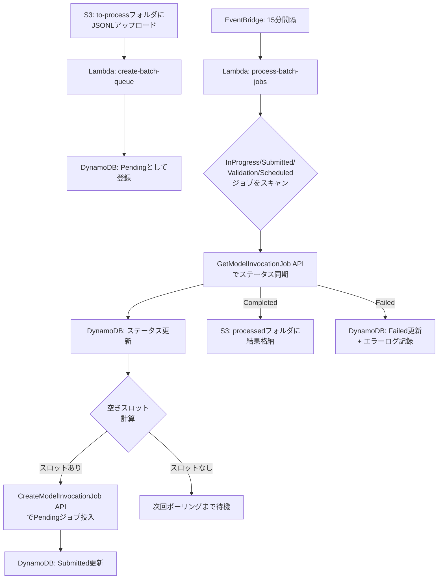

## ブログ概要（Summary）

本記事は [Automate Amazon Bedrock batch inference: Building a scalable and efficient pipeline](https://aws.amazon.com/blogs/machine-learning/automate-amazon-bedrock-batch-inference-building-a-scalable-and-efficient-pipeline/) の解説記事です。

AWSはAmazon Bedrockのバッチ推論において、1モデル・1リージョンあたり同時実行10ジョブという上限が存在する。この制約のもとで大量のバッチジョブを効率的に処理するため、Lambda・DynamoDB・EventBridge・S3を組み合わせたキュー管理パイプラインが公式ブログで紹介されている。本記事ではそのアーキテクチャ・データフロー・運用上の注意点を詳細に解説する。

この記事は [Zenn記事: Amazon Bedrock Novaバッチ推論で社内問い合わせ分類のコストを50%削減する](https://zenn.dev/0h_n0/articles/164086e37b0fd2) の深掘りです。

## 情報源

- **種別**: 企業テックブログ
- **URL**: [https://aws.amazon.com/blogs/machine-learning/automate-amazon-bedrock-batch-inference-building-a-scalable-and-efficient-pipeline/](https://aws.amazon.com/blogs/machine-learning/automate-amazon-bedrock-batch-inference-building-a-scalable-and-efficient-pipeline/)
- **組織**: AWS (Amazon Web Services)
- **発表日**: 2025年（公式Machine Learning Blog）

## 技術的背景（Technical Background）

### バッチ推論の必要性

Amazon Bedrockのバッチ推論は、リアルタイム応答が不要な大規模タスクに適している。典型的なユースケースとして、社内問い合わせの一括分類、大量ドキュメントの要約、データセット全体へのラベル付けなどがある。公式ブログによると、バッチ推論はオンデマンド推論と比較して50%の割引料金で利用可能であり、コスト最適化の強力な手段となる。

### 10ジョブ制限の課題

ブログによると、Amazon Bedrockのバッチ推論には「1モデル・1リージョンあたり同時実行10ジョブ」というサービスクォータが存在する。小規模な利用であればこの制限は問題にならないが、数十から数百のJSONLファイルを処理する必要がある場合、手動でのジョブ管理は現実的ではない。ジョブの投入タイミング、ステータス監視、空きスロットへの新規投入を自動化する仕組みが不可欠となる。この課題を解決するのが、本ブログで紹介されているキューベースのパイプラインである。

## 実装アーキテクチャ（Architecture）

### システム構成

ブログで紹介されているパイプラインは、4つのAWSサービスで構成されるサーバーレスアーキテクチャである。

**Amazon S3**: バッチ推論の入出力を管理するストレージ。バケット名は`br-batch-inference-{AccountId}-{Region}`の命名規則に従う。`to-process`フォルダにJSONLファイルをアップロードすると処理が開始され、完了後は`processed`フォルダに結果が格納される。

**AWS Lambda（2関数）**: パイプラインのコア処理を担当する。1つ目の関数`{stack_name}-create-batch-queue-{Region}`はS3イベントでトリガーされ、アップロードされたJSONLファイルをDynamoDBにPendingステータスで登録する。2つ目の関数`{stack_name}-process-batch-jobs-{Region}`はEventBridgeの定期実行でトリガーされ、ジョブのステータス同期・スロット計算・新規ジョブ投入を行う。

**Amazon DynamoDB**: ジョブの状態管理テーブル。テーブル名は`{StackName}-DynamoDBTable-{UniqueString}`であり、ジョブID・ステータス・作成時刻などのメタデータを保持する。

**Amazon EventBridge**: 15分間隔でprocess-batch-jobs Lambda関数を定期実行するスケジューラとして機能する。

### データフロー



### 10ステップの処理フロー

ブログでは以下の10ステップでパイプラインの動作を説明している。

1. ユーザーがS3の`to-process`フォルダにJSONLファイルをアップロード
2. S3イベントにより`create-batch-queue` Lambdaがトリガーされ、DynamoDBにPendingエントリを作成
3. EventBridgeが15分間隔で`process-batch-jobs` Lambdaを起動
4. Lambdaがまず既存のInProgress/Submitted/Validation/ScheduledステータスのジョブをDynamoDBからスキャン
5. `GetModelInvocationJob` APIを呼び出し、Bedrock側の最新ステータスを取得
6. 取得したステータスでDynamoDBレコードを更新（`UpdateItem`）
7. サービスクォータ上限（10ジョブ）に対する空きスロット数を計算
8. 空きスロットがあれば、Pendingジョブに対して`CreateModelInvocationJob` APIを呼び出し
9. 新規投入したジョブのステータスをDynamoDBでSubmittedに更新
10. 完了したジョブの出力がS3の`processed`フォルダに格納される

## パフォーマンス最適化（Performance）

### スロット管理

ブログで解説されているスロット管理は、バッチ推論の同時実行制限を効率的に活用するための仕組みである。`process-batch-jobs` Lambdaは実行のたびに以下の計算を行う。

$$
\text{available\_slots} = \text{quota\_limit} - \text{active\_jobs}
$$

ここで、
- $\text{quota\_limit}$: サービスクォータ上限（デフォルト10）
- $\text{active\_jobs}$: InProgress・Submitted・Validation・Scheduledステータスのジョブ数

空きスロットが存在する場合のみ、Pendingキューから先入れ先出し（FIFO）でジョブを投入する。これにより、クォータ違反によるAPIエラーを防ぎつつ、利用可能なスロットを最大限活用する。

### ポーリング間隔

EventBridgeのスケジュールは15分間隔に設定されている。ブログではこの値の選定理由を明示していないが、以下のトレードオフが推測される。

- **間隔が短すぎる場合**: Lambda実行コストが増加し、Bedrock APIへのリクエスト頻度も上がる。バッチ推論自体が分単位から時間単位の処理であるため、リアルタイムなステータス確認の恩恵は小さい。
- **間隔が長すぎる場合**: ジョブ完了後に空きスロットが長時間放置され、スループットが低下する。

15分間隔は、コスト効率とスループットのバランスを取った妥当な設定と考えられる。ただし、ジョブの平均処理時間が数分程度と短い場合は、5分間隔への変更を検討する余地がある。

### スケーリング特性

このアーキテクチャのスケーリングは、サービスクォータに制約される。複数リージョンにデプロイすることで、事実上のスループットを線形に拡大可能である。例えば、`us-east-1`と`us-west-2`の2リージョンにデプロイすれば、同一モデルで最大20ジョブの同時実行が可能となる。

## 運用での学び（Production Lessons）

### エラーハンドリング

ブログによると、バッチ推論ジョブが失敗した場合、`process-batch-jobs` Lambdaは以下の処理を実行する。

1. `GetModelInvocationJob` APIの応答からFailedステータスを検出
2. DynamoDBのジョブレコードをFailedに更新
3. エラー詳細をログに記録

ブログではリトライ機構については明示的に言及されていない。ジョブ失敗時の自動再投入が必要な場合は、DynamoDBのステータスをFailedではなくPendingに戻すロジックを追加する、あるいはDead Letter Queue（DLQ）パターンで失敗ジョブを別キューに退避させるといった拡張が考えられる。

### 監視

ブログで推奨されている監視方法は以下の通りである。

- **DynamoDBテーブルの直接参照**: `{StackName}-DynamoDBTable-{UniqueString}`テーブルを確認することで、各JSONLファイルに対応するジョブのステータスを把握できる
- **Bedrock管理コンソール**: バッチ推論ジョブの進行状況をGUIで確認可能
- **Lambda実行ログ**: CloudWatch Logsに出力されるLambda関数のログからエラー詳細を追跡

### CloudFormationスタックの削除時の注意

ブログでは、CloudFormationスタックを削除する前にS3バケット内のファイルをすべて削除する必要があると述べている。これはS3バケットが空でないとCloudFormationがバケットを削除できないためである。運用終了時に見落としがちなポイントである。

### IAMロールの設計

デプロイ時にIAMロールを自動作成するか、カスタムRoleArnを指定するかを選択できる。本番環境では、最小権限の原則に基づいてカスタムロールを作成し、以下の権限のみを付与することが推奨される。

- Bedrockバッチ推論ジョブの作成・取得（`bedrock:CreateModelInvocationJob`, `bedrock:GetModelInvocationJob`）
- S3入力フォルダの読み取り（`s3:GetObject`）
- S3出力フォルダへの書き込み（`s3:PutObject`）
- DynamoDBテーブルの読み書き

## 学術研究との関連（Academic Connection）

バッチ推論のキュー管理パイプラインは、分散システムにおけるジョブスケジューリング問題の実践的な応用である。学術的には、リソース制約下でのジョブスケジューリングはNP困難問題として知られるが、本ブログのアプローチはFIFOキューとポーリングベースの簡素な戦略を採用しており、実装の複雑さとスループット効率のバランスを取っている。優先度付きキュー（Priority Queue）やフェアスケジューリング（Fair Scheduling）といった発展的なスケジューリングアルゴリズムを導入することで、ジョブの重要度や期限に応じた柔軟な制御が可能になる余地がある。

## Production Deployment Guide

### AWS実装パターン（コスト最適化重視）

ブログで紹介されているCloudFormationテンプレートはシングルモデル・シングルリージョン構成であるが、実運用ではトラフィック量に応じた構成の選択が重要となる。以下に、バッチ推論パイプラインの規模別推奨構成を示す。

**コスト試算の前提**: 2026年6月時点のAWS ap-northeast-1（東京）リージョン料金に基づく概算値。実際のコストはトラフィックパターン、リージョン、バースト使用量により変動する。最新料金は[AWS料金計算ツール](https://calculator.aws/)で確認を推奨。

| 構成 | 処理量目安 | 主要サービス | 月額コスト目安 |
|------|-----------|-------------|---------------|
| **Small** | ~100ファイル/日 | Lambda + DynamoDB + S3 + EventBridge | $50-150 |
| **Medium** | ~1000ファイル/日 | 上記 + Step Functions + SNS + マルチモデル | $300-800 |
| **Large** | 10000+ファイル/日 | ECS Fargate + DynamoDB + S3 + マルチリージョン | $2,000-5,000 |

**Small構成（~100ファイル/日）**: ブログのCloudFormationテンプレートをそのまま利用する。Lambda実行コストは月間約$1-5、DynamoDB On-Demandモードで$5-20、S3ストレージ・リクエストで$10-30。バッチ推論のモデル利用料（50%割引適用後）がコストの大部分を占める。

**Medium構成（~1000ファイル/日）**: 複数モデルを切り替える場合、モデルごとにCloudFormationスタックをデプロイする。Step Functionsでワークフロー全体を管理し、SNSで完了通知を送信する。Lambda Provisioned Concurrencyを設定してコールドスタートを回避する。

**Large構成（10000+ファイル/日）**: Lambda関数の15分タイムアウト制限がボトルネックとなる場合、ECS Fargateタスクでprocess-batch-jobsロジックを実行する。マルチリージョンデプロイにより同時実行スロットを拡張し、EventBridge Schedulerでリージョン間のジョブ分散を制御する。

**コスト削減テクニック**:
- Bedrock Batch API使用で50%削減（公式ブログより）
- DynamoDB On-Demandモードで未使用時のコストをゼロに近づける
- S3 Intelligent-Tiering で長期保存の出力データを自動最適化
- Lambda ARM64（Graviton2）で実行コスト20%削減

### Terraformインフラコード

#### Small構成（Serverless）: Lambda + DynamoDB + S3

```hcl
terraform {
  required_version = ">= 1.9"
  required_providers {
    aws = {
      source  = "hashicorp/aws"
      version = "~> 5.82"
    }
  }
}

provider "aws" {
  region = "ap-northeast-1"
}

data "aws_caller_identity" "current" {}
data "aws_region" "current" {}

locals {
  account_id = data.aws_caller_identity.current.account_id
  region     = data.aws_region.current.name
  prefix     = "br-batch-inference"
}

# S3バケット（入出力用、KMS暗号化）
resource "aws_s3_bucket" "batch_inference" {
  bucket = "${local.prefix}-${local.account_id}-${local.region}"
  tags   = { Project = "bedrock-batch-inference", Env = "production" }
}

resource "aws_s3_bucket_server_side_encryption_configuration" "batch_inference" {
  bucket = aws_s3_bucket.batch_inference.id
  rule {
    apply_server_side_encryption_by_default { sse_algorithm = "aws:kms" }
    bucket_key_enabled = true
  }
}

resource "aws_s3_bucket_public_access_block" "batch_inference" {
  bucket                  = aws_s3_bucket.batch_inference.id
  block_public_acls       = true
  block_public_policy     = true
  ignore_public_acls      = true
  restrict_public_buckets = true
}

# DynamoDB テーブル（On-Demandモード）
resource "aws_dynamodb_table" "batch_jobs" {
  name         = "${local.prefix}-jobs"
  billing_mode = "PAY_PER_REQUEST"
  hash_key     = "job_id"

  attribute {
    name = "job_id"
    type = "S"
  }

  attribute {
    name = "status"
    type = "S"
  }

  global_secondary_index {
    name            = "status-index"
    hash_key        = "status"
    projection_type = "ALL"
  }

  point_in_time_recovery { enabled = true }
  server_side_encryption { enabled = true }
}

# IAMロール（最小権限）
resource "aws_iam_role" "lambda_batch" {
  name = "${local.prefix}-lambda-role"
  assume_role_policy = jsonencode({
    Version = "2012-10-17"
    Statement = [{
      Action    = "sts:AssumeRole"
      Effect    = "Allow"
      Principal = { Service = "lambda.amazonaws.com" }
    }]
  })
}

resource "aws_iam_role_policy" "lambda_batch" {
  name = "${local.prefix}-lambda-policy"
  role = aws_iam_role.lambda_batch.id
  policy = jsonencode({
    Version = "2012-10-17"
    Statement = [
      {
        Effect   = "Allow"
        Action   = ["bedrock:CreateModelInvocationJob", "bedrock:GetModelInvocationJob", "bedrock:ListModelInvocationJobs"]
        Resource = "*"
      },
      {
        Effect   = "Allow"
        Action   = ["s3:GetObject", "s3:PutObject", "s3:ListBucket"]
        Resource = [aws_s3_bucket.batch_inference.arn, "${aws_s3_bucket.batch_inference.arn}/*"]
      },
      {
        Effect   = "Allow"
        Action   = ["dynamodb:PutItem", "dynamodb:GetItem", "dynamodb:UpdateItem", "dynamodb:Query", "dynamodb:Scan"]
        Resource = [aws_dynamodb_table.batch_jobs.arn, "${aws_dynamodb_table.batch_jobs.arn}/index/*"]
      },
      {
        Effect   = "Allow"
        Action   = ["logs:CreateLogGroup", "logs:CreateLogStream", "logs:PutLogEvents"]
        Resource = "arn:aws:logs:${local.region}:${local.account_id}:*"
      }
    ]
  })
}

# CloudWatchアラーム（Lambdaエラー検知）
resource "aws_cloudwatch_metric_alarm" "lambda_errors" {
  alarm_name          = "${local.prefix}-lambda-errors"
  comparison_operator = "GreaterThanThreshold"
  evaluation_periods  = 1
  metric_name         = "Errors"
  namespace           = "AWS/Lambda"
  period              = 300
  statistic           = "Sum"
  threshold           = 0
  alarm_description   = "Batch inference Lambda errors detected"
}
```

#### Large構成（Container）: ECS Fargate + マルチリージョン

```hcl
# ECS Fargate クラスタ（Lambda 15分制限を回避）
resource "aws_ecs_cluster" "batch_inference" {
  name = "${local.prefix}-cluster"
  setting {
    name  = "containerInsights"
    value = "enabled"
  }
}

resource "aws_ecs_task_definition" "batch_processor" {
  family                   = "${local.prefix}-processor"
  requires_compatibilities = ["FARGATE"]
  network_mode             = "awsvpc"
  cpu                      = 512
  memory                   = 1024
  execution_role_arn       = aws_iam_role.ecs_execution_role.arn
  task_role_arn            = aws_iam_role.ecs_task_role.arn

  container_definitions = jsonencode([{
    name  = "batch-processor"
    image = "${local.account_id}.dkr.ecr.${local.region}.amazonaws.com/${local.prefix}-processor:latest"
    environment = [
      { name = "TABLE_NAME", value = aws_dynamodb_table.batch_jobs.name },
      { name = "BUCKET_NAME", value = aws_s3_bucket.batch_inference.id },
      { name = "QUOTA_LIMIT", value = "10" }
    ]
  }])
}

# AWS Budgets（月次コスト上限アラート）
resource "aws_budgets_budget" "batch_inference" {
  name         = "${local.prefix}-monthly-budget"
  budget_type  = "COST"
  limit_amount = "5000"
  limit_unit   = "USD"
  time_unit    = "MONTHLY"

  notification {
    comparison_operator        = "GREATER_THAN"
    threshold                  = 80
    threshold_type             = "PERCENTAGE"
    notification_type          = "ACTUAL"
    subscriber_email_addresses = ["ops-team@example.com"]
  }
}
```

### 運用・監視設定

#### CloudWatch Logs Insights クエリ

```sql
-- バッチ推論ジョブのステータス遷移を追跡
fields @timestamp, @message
| filter @message like /status/
| parse @message "job_id=* status=* model_id=*" as job_id, status, model_id
| sort @timestamp desc
| limit 100

-- エラー頻度の時系列分析（1時間単位）
fields @timestamp
| filter @message like /Failed/
| stats count() as error_count by bin(1h)
```

#### CloudWatch アラーム設定（Python）

```python
import boto3

cloudwatch = boto3.client("cloudwatch")


def create_batch_inference_alarms(stack_name: str, sns_topic_arn: str) -> None:
    """Bedrockバッチ推論パイプライン用のCloudWatchアラームを作成する。"""
    cloudwatch.put_metric_alarm(
        AlarmName=f"{stack_name}-failed-jobs-spike",
        MetricName="FailedJobCount",
        Namespace="BedrockBatchInference",
        Statistic="Sum",
        Period=900,
        EvaluationPeriods=2,
        Threshold=5,
        ComparisonOperator="GreaterThanThreshold",
        AlarmActions=[sns_topic_arn],
        AlarmDescription="15分間でFailedジョブが5件以上発生",
    )

    cloudwatch.put_metric_alarm(
        AlarmName=f"{stack_name}-lambda-duration",
        MetricName="Duration",
        Namespace="AWS/Lambda",
        Statistic="p99",
        Period=300,
        EvaluationPeriods=3,
        Threshold=60000,
        ComparisonOperator="GreaterThanThreshold",
        Dimensions=[
            {"Name": "FunctionName", "Value": f"{stack_name}-process-batch-jobs"},
        ],
        AlarmActions=[sns_topic_arn],
        AlarmDescription="process-batch-jobs Lambda P99レイテンシが60秒超過",
    )
```

#### Cost Explorer自動レポート（Python）

```python
import boto3
from datetime import datetime, timedelta

ce = boto3.client("ce")
sns = boto3.client("sns")


def generate_daily_cost_report(sns_topic_arn: str) -> dict:
    """日次コストレポートを生成し、閾値超過時にSNS通知する。"""
    end_date = datetime.now().strftime("%Y-%m-%d")
    start_date = (datetime.now() - timedelta(days=1)).strftime("%Y-%m-%d")

    response = ce.get_cost_and_usage(
        TimePeriod={"Start": start_date, "End": end_date},
        Granularity="DAILY",
        Metrics=["BlendedCost"],
        Filter={"Tags": {"Key": "Project", "Values": ["bedrock-batch-inference"]}},
        GroupBy=[{"Type": "DIMENSION", "Key": "SERVICE"}],
    )

    total_cost = 0.0
    service_costs: dict[str, float] = {}
    for group in response["ResultsByTime"][0]["Groups"]:
        service = group["Keys"][0]
        cost = float(group["Metrics"]["BlendedCost"]["Amount"])
        service_costs[service] = cost
        total_cost += cost

    if total_cost > 100:
        sns.publish(
            TopicArn=sns_topic_arn,
            Subject="[ALERT] Bedrock Batch daily cost exceeded $100",
            Message=f"Total: ${total_cost:.2f}\n"
            + "\n".join(f"  {svc}: ${c:.2f}" for svc, c in service_costs.items()),
        )

    return {"date": start_date, "total": total_cost, "services": service_costs}
```

### コスト最適化チェックリスト

**アーキテクチャ選択**:
- [ ] トラフィック量に応じた構成を選択（~100: Serverless / ~1000: Hybrid / 10000+: Container）
- [ ] マルチリージョンの必要性を評価（スロット数拡張 vs 運用複雑化）
- [ ] Step Functionsの導入判断（ワークフロー可視化の価値 vs 追加コスト）

**リソース最適化**:
- [ ] Lambda ARM64（Graviton2）を使用（x86比で20%コスト削減）
- [ ] Lambda メモリサイズを最適化（Power Tuningツール活用）
- [ ] DynamoDB On-Demandモードを選択（低トラフィック時のコスト最適化）
- [ ] S3 Intelligent-Tieringを有効化（アクセス頻度に応じた自動最適化）
- [ ] ECS Fargate Spotを活用（Large構成で最大70%削減、中断耐性が必要）
- [ ] CloudWatch Logsの保持期間を設定（不要ログの長期保存を防止）

**LLMコスト削減**:
- [ ] Bedrock Batch APIを使用（On-Demand比50%削減、公式ブログより）
- [ ] Prompt Caching有効化（対応モデルで30-90%削減）
- [ ] モデル選択ロジック導入（タスク難度に応じたモデル切り替え）
- [ ] max_tokensを適切に設定（不要な長文生成を防止）
- [ ] リクエストのバッチサイズを最適化（JSONLファイルあたりの件数調整）

**監視・アラート**:
- [ ] AWS Budgetsを設定（月次予算の80%/100%でアラート）
- [ ] CloudWatch アラームを設定（Lambda エラー、DynamoDB スロットリング）
- [ ] Cost Anomaly Detectionを有効化（異常支出の自動検知）
- [ ] 日次コストレポートを自動生成（$100/日超過でSNS通知）
- [ ] X-Rayトレーシングを有効化（ボトルネック特定）

**リソース管理**:
- [ ] 未使用CloudFormationスタックを削除（S3バケット内ファイルを先に削除）
- [ ] タグ戦略を適用（Project/Env/Ownerタグで費用配分）
- [ ] S3ライフサイクルポリシーを設定（processedフォルダの古いデータを自動削除）
- [ ] 開発環境のEventBridgeルールを業務時間のみに制限
- [ ] DynamoDB TTLを設定（完了済みジョブレコードの自動削除）
- [ ] CloudWatch Logsのサブスクリプションフィルタで不要ログを除外

## まとめと実践への示唆

ブログで紹介されたパイプラインは、Lambda + DynamoDB + EventBridge + S3というサーバーレス構成で、Bedrockバッチ推論の10ジョブ制限を自動的に管理する。CloudFormationによるワンクリックデプロイが可能であり、小規模な利用では追加のインフラ管理コストがほとんど発生しない。一方で、リトライ機構や優先度制御などは標準では提供されておらず、大規模運用では拡張が必要となる。関連Zenn記事で解説されているNova Microを用いた問い合わせ分類のような定型タスクに対して、本パイプラインを適用することで50%のコスト削減と運用自動化を同時に実現できる。

## 参考文献

- **Blog URL**: [Automate Amazon Bedrock batch inference: Building a scalable and efficient pipeline](https://aws.amazon.com/blogs/machine-learning/automate-amazon-bedrock-batch-inference-building-a-scalable-and-efficient-pipeline/)
- **Amazon Bedrock Batch Inference Documentation**: [https://docs.aws.amazon.com/bedrock/latest/userguide/batch-inference.html](https://docs.aws.amazon.com/bedrock/latest/userguide/batch-inference.html)
- **Amazon Bedrock Pricing**: [https://aws.amazon.com/bedrock/pricing/](https://aws.amazon.com/bedrock/pricing/)
- **Related Zenn article**: [Amazon Bedrock Novaバッチ推論で社内問い合わせ分類のコストを50%削減する](https://zenn.dev/0h_n0/articles/164086e37b0fd2)
