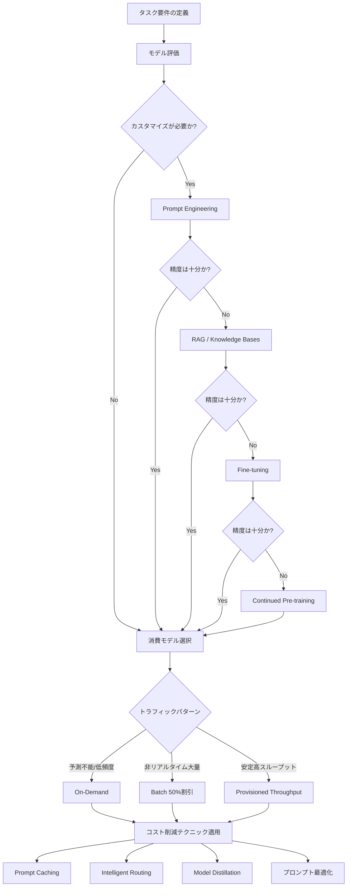

## ブログ概要（Summary）

本記事は [Effective cost optimization strategies for Amazon Bedrock](https://aws.amazon.com/blogs/machine-learning/effective-cost-optimization-strategies-for-amazon-bedrock/) の解説記事です。

AWSの公式ブログは、Amazon Bedrockを活用する際の包括的なコスト最適化戦略を体系的に解説している。料金モデルの選択（On-Demand / Batch / Provisioned Throughput）、モデルカスタマイズの階層的アプローチ（Prompt Engineering → RAG → Fine-tuning → Continued Pre-training）、そしてPrompt Caching（最大90%削減）やIntelligent Prompt Routing（最大30%削減）といった具体的なコスト削減テクニックをカバーしている。モニタリングやマルチエージェント構成の最適化にまで言及しており、Bedrockのコスト管理における現時点での最も包括的なリファレンスである。

この記事は [Zenn記事: Amazon Bedrock Novaバッチ推論で社内問い合わせ分類のコストを50%削減する](https://zenn.dev/0h_n0/articles/164086e37b0fd2) の深掘りです。

## 情報源

- **種別**: 企業テックブログ
- **URL**: [https://aws.amazon.com/blogs/machine-learning/effective-cost-optimization-strategies-for-amazon-bedrock/](https://aws.amazon.com/blogs/machine-learning/effective-cost-optimization-strategies-for-amazon-bedrock/)
- **組織**: AWS (Amazon Web Services)
- **公開日**: 2025年6月10日

## 技術的背景（Technical Background）

LLMの本番運用において、推論コストは最大の運用課題の一つである。特にリクエスト量が1日数千件を超えるサービスでは、トークン単価の小さな差が月額で数千ドル規模の差を生む。Amazon Bedrockは100以上の基盤モデル（FM）をマネージドサービスとして提供するプラットフォームであり、Anthropic Claude、Meta Llama、Mistral、Amazon Novaなど多様なモデルをAPIで利用できる。しかし、モデル選択・消費モデル・プロンプト設計・カスタマイズ手法の組み合わせにより、同一タスクでもコストが数倍から数十倍変動し得る。AWSの公式ブログはこの問題に対し、モデル選択からインフラ監視までを一貫して最適化するフレームワークを提示している。

## 実装アーキテクチャ（Architecture）

### コスト最適化の階層構造

AWSの公式ブログによると、モデルカスタマイズは以下の順序で検討すべきとされている。コストが低い順に並べると、Prompt Engineeringが最小コストで、Continued Pre-trainingが最大コストとなる。

| 手法 | コスト | 必要データ | 適用ケース |
|------|--------|-----------|-----------|
| Prompt Engineering | 最小 | 不要 | タスクの明確化、出力形式指定 |
| RAG（Knowledge Bases） | 低〜中 | ドキュメント群 | 社内ナレッジ活用、最新情報参照 |
| Fine-tuning | 中〜高 | ラベル付きデータ | ドメイン特化の精度向上 |
| Continued Pre-training | 最大 | 大量コーパス | 専門領域の言語モデル構築 |

AWSの公式ブログでは、Prompt Engineeringが「minimal resources and no additional infrastructure costs」であるのに対し、Continued Pre-trainingは「most resource-intensive option」で「highest costs and longest implementation time」であると明記されている。

### コスト最適化デシジョンフロー

以下は、AWSの公式ブログの内容に基づくコスト最適化の意思決定フローである。



### 各最適化手法の詳細

**Prompt Caching**: AWSの公式ブログによると、APIリクエスト中の静的コンテキスト部分（システムプロンプト、ドキュメント等）をキャッシュし、後続リクエストで再利用する仕組みである。`cachePoint`ブロックをAPI呼び出しに挿入することで有効化する。キャッシュヒット時は`cacheReadInputTokenCount`、ミス時は`cacheWriteInputTokenCount`としてメトリクスが記録される。TTLは最大5分で、キャッシュヒットのたびにタイマーがリセットされる。ドキュメントQ&Aシステム、コーディングアシスタント、マルチターン会話に適している。

**Model Distillation**: 大規模モデル（teacher）の応答品質を小規模モデル（student）に転移する手法である。AWSの公式ブログによると、プロンプトのみを入力とし、teacher応答の生成とstudentのfine-tuningが自動化されている。プロンプト拡張や合成レスポンス生成といったデータ合成手法が適用され、prompt-responseペアの手動作成が不要となる。

**Intelligent Prompt Routing**: リクエストの複雑度に応じて、高性能モデル（例: Claude 3.5 Sonnet）と低コストモデル（例: Claude 3 Haiku）を動的にルーティングする。AWSの公式ブログでは、精度を維持しつつ最大30%のコスト削減が可能と記載されている。

**Batch Inference**: 非リアルタイムワークロード向けに、プロンプト群を単一ファイルとしてS3に配置し、一括処理する。AWSの公式ブログによると、On-Demand比で50%の割引が適用される。Anthropic、Meta、Mistral AI、Amazonの各モデルで利用可能だが、対応リージョンは限定されている。

### Amazon Nova料金比較

AWSの公式ブログで公開されている料金表（2025年5月21日時点、US East Ohio）は以下の通りである。

| モデル | 入力 ($/1Kトークン) | 出力 ($/1Kトークン) | 入力コスト比 |
|--------|-------------------|-------------------|------------|
| Nova Micro | $0.000035 | $0.00014 | 1.0x (基準) |
| Nova Lite | $0.00006 | $0.00024 | 1.71x |
| Nova Pro | $0.0008 | $0.0032 | 22.9x |

Nova MicroはNova Lite比で入力トークンが約1.71倍安価であり、テキスト生成のみのタスクではNova Microが最もコスト効率が高い。

## パフォーマンス最適化（Performance）

### Prompt Cachingの効果

AWSの公式ブログによると、Prompt Cachingの適用によりコストを最大90%、レイテンシを最大85%削減できる。効果が最大化されるのは、以下の条件を満たすワークロードである。

- **静的コンテキストが大きい**: システムプロンプトやリファレンスドキュメントが長い場合
- **リクエスト間隔が短い**: TTL（5分）以内に次のリクエストが到達する場合
- **マルチターン会話**: 会話履歴が蓄積されるチャット型アプリケーション

AWSの公式ブログでは、クライアント側キャッシュ（Redis、Memcached等）との併用も推奨されている。TTLベースのキャッシュ有効期限戦略を設定し、cache hit:miss比率のモニタリングで継続的に最適化する手法が紹介されている。

### Batch推論の効果

Batch推論はOn-Demand比で50%のコスト削減を実現する。関連Zenn記事で解説されている社内問い合わせ分類のような大量バッチ処理タスクに適しており、レスポンスはS3バケットに保存され、後からアクセスできる。リアルタイム性が不要なワークロード（例: 日次レポート生成、データ分類、コンテンツ要約）で効果を発揮する。

### プロンプト最適化テクニック

AWSの公式ブログでは、以下のプロンプト最適化手法によるトークン削減が推奨されている。

1. **構造化された指示**: 複雑なプロンプトを番号付きステップや箇条書きに分解する
2. **出力形式の明示指定**: 望むフォーマットと制約を明確に定義する
3. **冗長性の排除**: 不要なコンテキストや繰り返しの指示を削除する
4. **区切り文字の活用**: トリプルクォート、ダッシュ、XMLタグ等のデリミタを使用する
5. **役割の明確化**: 明確な役割定義と具体的なコンテキストから開始する

Amazon Bedrock Prompt Optimization機能を活用すると、各モデルのベストプラクティスに合わせたプロンプト自動最適化が可能であり、手動で数か月かかるチューニング工程を自動化できる。

## 運用での学び（Production Lessons）

### モニタリング戦略

AWSの公式ブログでは、コスト管理の基盤としてアプリケーション推論プロファイルの活用が推奨されている。推論プロファイルにカスタムコスト配分タグを設定することで、コストセンター、事業部門、チーム、アプリケーション単位でのコスト追跡が可能になる。

**CloudWatch監視メトリクス**:
- `Invocations`: リクエスト数
- `InvocationLatency`: 応答レイテンシ
- `InputTokenCount` / `OutputTokenCount`: トークン使用量
- エラーメトリクス: モデルID等のディメンションでフィルタリング可能

### 予算管理

AWSの公式ブログでは以下のサービスを組み合わせた多層的な予算管理が推奨されている。

- **AWS Budgets**: 月次予算の設定と超過アラート
- **AWS Cost Explorer**: 過去のコスト傾向分析と将来予測
- **AWS Cost and Usage Reports**: 詳細な利用状況レポート
- **AWS Cost Anomaly Detection**: 異常なコスト増加の自動検知

### マルチエージェントアーキテクチャでの最適化

AWSの公式ブログによると、マルチエージェント構成ではタスクの複雑度に応じたモデル選択が重要である。具体的には、軽量なスーパーバイザーエージェントで調整を行い、単純タスクには低コストモデル、複雑な推論タスクにはプレミアムモデルを割り当てる。また、Lambda実行ではコスト削減のために必要最小限のデータのみ取得することが推奨されている。

## 学術研究との関連（Academic Connection）

Model Distillationは知識蒸留（Knowledge Distillation）の実用的実装であり、Hintonら（2015）の研究を基盤としている。Intelligent Prompt RoutingはMixture of Experts（MoE）の考え方をAPI層に応用したものと位置づけられる。Prompt Cachingはキーバリューストアのキャッシング理論と、Transformerアーキテクチャにおけるkey-valueキャッシュ（KVキャッシュ）技術の組み合わせである。RAGはLewisら（2020）のRetrieval-Augmented Generation論文から発展し、Amazon Bedrock Knowledge Basesとしてマネージドサービス化されている。

## Production Deployment Guide

### AWS実装パターン（コスト最適化重視）

AWSの公式ブログの内容を基に、トラフィック量別の推奨構成を以下に示す。コスト試算は2026年6月時点のAWS ap-northeast-1（東京）リージョン料金に基づく概算値であり、実際のコストはトラフィックパターン、リージョン、バースト使用量により変動する。最新料金はAWS料金計算ツールで確認を推奨する。

| 構成 | 想定トラフィック | アーキテクチャ | 月額コスト概算 |
|------|----------------|---------------|---------------|
| Small | ~100 req/日 | Lambda + Bedrock (On-Demand) + DynamoDB | $50-150 |
| Medium | ~1,000 req/日 | ECS Fargate + Bedrock (Batch併用) + ElastiCache | $300-800 |
| Large | 10,000+ req/日 | EKS + Bedrock (Provisioned) + ElastiCache + S3 | $2,000-5,000 |

**Small構成の内訳**:
- Lambda: 月100リクエスト × 平均10秒 × 512MB = $0.01未満
- Bedrock (Nova Pro On-Demand): 100 req × 平均2000入力/1000出力トークン = $0.48/月
- DynamoDB (On-Demand): $1-5/月
- CloudWatch: $3-5/月
- 合計: $50-150（Bedrockモデル選択により大きく変動）

**Medium構成の内訳**:
- ECS Fargate: 0.5vCPU × 1GB × 24h = 約$30/月
- Bedrock (On-Demand + Batch併用): 1000 req × 50% Batch適用 = On-Demand比25%削減
- ElastiCache (cache.t3.micro): 約$15/月（クライアント側キャッシュ用）
- Prompt Caching有効化: さらに最大90%削減
- 合計: $300-800

**Large構成の内訳**:
- EKS コントロールプレーン: $73/月
- EC2ワーカーノード (Spot): m5.xlarge × 3 = 約$120/月（Spot適用時）
- Bedrock (Provisioned Throughput): モデルユニット数に依存
- ElastiCache (cache.r6g.large): 約$200/月
- S3 (Batch入出力): $5-10/月
- 合計: $2,000-5,000（Provisioned Throughputのコミット期間により変動）

**コスト削減テクニック**:
- Spot Instances活用: EC2コストを最大90%削減
- Reserved Instances (1年): 最大72%削減
- Bedrock Batch API: On-Demand比50%削減
- Prompt Caching有効化: 最大90%削減
- Intelligent Prompt Routing: 最大30%削減

### Terraformインフラコード

#### Small構成（Serverless: Lambda + Bedrock）

```hcl
# === Small構成: Lambda + Bedrock + DynamoDB ===
# コスト目安: $50-150/月 (~100 req/日)

terraform {
  required_version = ">= 1.5"
  required_providers {
    aws = {
      source  = "hashicorp/aws"
      version = "~> 5.50"
    }
  }
}

provider "aws" {
  region = "ap-northeast-1"
}

# --- IAMロール（最小権限） ---
resource "aws_iam_role" "bedrock_lambda" {
  name = "bedrock-inference-lambda-role"
  assume_role_policy = jsonencode({
    Version = "2012-10-17"
    Statement = [{
      Action = "sts:AssumeRole"
      Effect = "Allow"
      Principal = { Service = "lambda.amazonaws.com" }
    }]
  })
}

resource "aws_iam_role_policy" "bedrock_invoke" {
  name = "bedrock-invoke-policy"
  role = aws_iam_role.bedrock_lambda.id
  policy = jsonencode({
    Version = "2012-10-17"
    Statement = [
      {
        Effect   = "Allow"
        Action   = ["bedrock:InvokeModel", "bedrock:InvokeModelWithResponseStream"]
        Resource = "arn:aws:bedrock:ap-northeast-1::foundation-model/*"
      },
      {
        Effect   = "Allow"
        Action   = ["dynamodb:PutItem", "dynamodb:GetItem", "dynamodb:Query"]
        Resource = aws_dynamodb_table.cache.arn
      },
      {
        Effect = "Allow"
        Action = [
          "logs:CreateLogGroup",
          "logs:CreateLogStream",
          "logs:PutLogEvents"
        ]
        Resource = "arn:aws:logs:*:*:*"
      }
    ]
  })
}

# --- DynamoDB（On-Demand: コスト最適化） ---
resource "aws_dynamodb_table" "cache" {
  name         = "bedrock-response-cache"
  billing_mode = "PAY_PER_REQUEST"  # On-Demandでアイドル時コスト最小
  hash_key     = "prompt_hash"

  attribute {
    name = "prompt_hash"
    type = "S"
  }

  ttl {
    attribute_name = "expires_at"
    enabled        = true
  }

  # KMS暗号化（セキュリティベストプラクティス）
  server_side_encryption {
    enabled = true
  }
}

# --- Lambda関数 ---
resource "aws_lambda_function" "bedrock_inference" {
  filename         = "lambda_function.zip"
  function_name    = "bedrock-inference"
  role             = aws_iam_role.bedrock_lambda.arn
  handler          = "handler.lambda_handler"
  runtime          = "python3.12"
  timeout          = 60
  memory_size      = 512  # Bedrock API呼び出しに512MBで十分

  environment {
    variables = {
      MODEL_ID       = "amazon.nova-pro-v1:0"
      CACHE_TABLE    = aws_dynamodb_table.cache.name
      ENABLE_CACHING = "true"
    }
  }

  tracing_config {
    mode = "Active"  # X-Rayトレーシング有効
  }
}

# --- CloudWatchアラーム（コスト監視） ---
resource "aws_cloudwatch_metric_alarm" "lambda_duration" {
  alarm_name          = "bedrock-lambda-high-duration"
  comparison_operator = "GreaterThanThreshold"
  evaluation_periods  = 3
  metric_name         = "Duration"
  namespace           = "AWS/Lambda"
  period              = 300
  statistic           = "Average"
  threshold           = 30000  # 30秒超で警告
  alarm_actions       = [aws_sns_topic.alerts.arn]

  dimensions = {
    FunctionName = aws_lambda_function.bedrock_inference.function_name
  }
}

resource "aws_sns_topic" "alerts" {
  name = "bedrock-cost-alerts"
}
```

#### Large構成（Container: EKS + Spot）

```hcl
# === Large構成: EKS + Karpenter + Spot ===
# コスト目安: $2,000-5,000/月 (10,000+ req/日)

# --- EKSクラスタ ---
module "eks" {
  source          = "terraform-aws-modules/eks/aws"
  version         = "~> 20.0"
  cluster_name    = "bedrock-inference-cluster"
  cluster_version = "1.31"
  vpc_id          = module.vpc.vpc_id
  subnet_ids      = module.vpc.private_subnets

  # Karpenter用のIAM設定
  enable_cluster_creator_admin_permissions = true

  cluster_endpoint_public_access = false  # セキュリティ: プライベートのみ
}

# --- Karpenter Provisioner（Spot優先） ---
resource "kubectl_manifest" "karpenter_nodepool" {
  yaml_body = yamlencode({
    apiVersion = "karpenter.sh/v1"
    kind       = "NodePool"
    metadata   = { name = "bedrock-inference" }
    spec = {
      template = {
        spec = {
          requirements = [
            { key = "karpenter.sh/capacity-type", operator = "In", values = ["spot", "on-demand"] },
            { key = "node.kubernetes.io/instance-type", operator = "In",
              values = ["m5.xlarge", "m5.2xlarge", "m6i.xlarge", "m6i.2xlarge"] }
          ]
        }
      }
      limits   = { cpu = "64", memory = "256Gi" }
      disruption = {
        consolidationPolicy = "WhenEmptyOrUnderutilized"
        consolidateAfter    = "60s"
      }
    }
  })
}

# --- Secrets Manager（Bedrock設定） ---
resource "aws_secretsmanager_secret" "bedrock_config" {
  name = "bedrock-inference-config"
}

# --- AWS Budgets（月次予算アラート） ---
resource "aws_budgets_budget" "bedrock_monthly" {
  name         = "bedrock-monthly-budget"
  budget_type  = "COST"
  limit_amount = "5000"
  limit_unit   = "USD"
  time_unit    = "MONTHLY"

  notification {
    comparison_operator       = "GREATER_THAN"
    threshold                 = 80  # 80%到達で警告
    threshold_type            = "PERCENTAGE"
    notification_type         = "ACTUAL"
    subscriber_email_addresses = ["ops-team@example.com"]
  }

  notification {
    comparison_operator       = "GREATER_THAN"
    threshold                 = 100  # 100%超過で緊急通知
    threshold_type            = "PERCENTAGE"
    notification_type         = "ACTUAL"
    subscriber_email_addresses = ["ops-team@example.com"]
  }
}
```

### 運用・監視設定

**CloudWatch Logs Insights クエリ（コスト異常検知）**:

```
# 1時間あたりのトークン使用量を集計
fields @timestamp, @message
| filter @message like /InputTokenCount/
| stats sum(inputTokens) as totalInput,
        sum(outputTokens) as totalOutput,
        count(*) as requestCount
  by bin(1h)
| sort @timestamp desc
```

**CloudWatchアラーム設定（Python）**:

```python
import boto3
from typing import Any


def create_bedrock_token_alarm(
    alarm_name: str,
    threshold: float,
    sns_topic_arn: str,
) -> dict[str, Any]:
    """Bedrockトークン使用量のスパイク検知アラームを作成する。

    Args:
        alarm_name: アラーム名
        threshold: 閾値（トークン数/5分）
        sns_topic_arn: 通知先SNSトピックARN

    Returns:
        CloudWatch APIレスポンス
    """
    cloudwatch = boto3.client("cloudwatch", region_name="ap-northeast-1")
    return cloudwatch.put_metric_alarm(
        AlarmName=alarm_name,
        MetricName="InputTokenCount",
        Namespace="AWS/Bedrock",
        Statistic="Sum",
        Period=300,
        EvaluationPeriods=2,
        Threshold=threshold,
        ComparisonOperator="GreaterThanThreshold",
        AlarmActions=[sns_topic_arn],
    )
```

**X-Rayトレーシング設定（Python）**:

```python
from aws_xray_sdk.core import xray_recorder, patch_all
from aws_xray_sdk.core.models.subsegment import Subsegment

# boto3自動計装
patch_all()


def invoke_bedrock_with_tracing(
    model_id: str,
    prompt: str,
    bedrock_client: object,
) -> dict:
    """X-Rayトレーシング付きBedrock呼び出し。

    Args:
        model_id: BedrockモデルID
        prompt: 入力プロンプト
        bedrock_client: Bedrock Runtimeクライアント

    Returns:
        Bedrock APIレスポンス
    """
    subsegment: Subsegment = xray_recorder.begin_subsegment("bedrock_invoke")
    subsegment.put_annotation("model_id", model_id)
    subsegment.put_metadata("prompt_length", len(prompt))

    try:
        response = bedrock_client.invoke_model(
            modelId=model_id,
            body=prompt,
        )
        subsegment.put_metadata("status", "success")
        return response
    except Exception as e:
        subsegment.add_exception(e, stack=True)
        raise
    finally:
        xray_recorder.end_subsegment()
```

**Cost Explorer自動レポート（Python）**:

```python
import boto3
import json
from datetime import datetime, timedelta


def generate_daily_cost_report(sns_topic_arn: str) -> None:
    """日次コストレポートを生成し、閾値超過時にSNS通知する。

    Args:
        sns_topic_arn: 通知先SNSトピックARN
    """
    ce = boto3.client("ce", region_name="us-east-1")
    sns = boto3.client("sns", region_name="ap-northeast-1")

    today = datetime.utcnow().strftime("%Y-%m-%d")
    yesterday = (datetime.utcnow() - timedelta(days=1)).strftime("%Y-%m-%d")

    response = ce.get_cost_and_usage(
        TimePeriod={"Start": yesterday, "End": today},
        Granularity="DAILY",
        Metrics=["UnblendedCost"],
        Filter={
            "Dimensions": {
                "Key": "SERVICE",
                "Values": ["Amazon Bedrock", "AWS Lambda", "Amazon EKS"],
            }
        },
        GroupBy=[{"Type": "DIMENSION", "Key": "SERVICE"}],
    )

    total_cost = sum(
        float(group["Metrics"]["UnblendedCost"]["Amount"])
        for result in response["ResultsByTime"]
        for group in result["Groups"]
    )

    # $100/日を超過した場合に通知
    if total_cost > 100:
        sns.publish(
            TopicArn=sns_topic_arn,
            Subject=f"Bedrock日次コスト警告: ${total_cost:.2f}",
            Message=json.dumps(response["ResultsByTime"], indent=2, default=str),
        )
```

### コスト最適化チェックリスト

**アーキテクチャ選択**:
- [ ] トラフィック量に応じた構成選択（Small: Serverless / Medium: Hybrid / Large: Container）
- [ ] リアルタイム要件の有無でOn-Demand vs Batch判断
- [ ] Provisioned Throughputの必要性評価（カスタムモデル使用時は必須）

**リソース最適化**:
- [ ] EC2: Spot Instances優先（最大90%削減）
- [ ] Reserved Instances: 1年コミットで最大72%削減
- [ ] Savings Plans: コミット使用量ベースの割引検討
- [ ] Lambda: Power Tuningでメモリサイズ最適化
- [ ] ECS/EKS: Karpenter/HPA設定でアイドル時スケールダウン
- [ ] NAT Gateway: VPCエンドポイント活用で通信コスト削減

**LLMコスト削減**:
- [ ] Bedrock Batch API使用（50%削減、非リアルタイム処理）
- [ ] Prompt Caching有効化（最大90%削減）
- [ ] Intelligent Prompt Routing設定（最大30%削減）
- [ ] Model Distillation適用（大モデル精度を小モデルで実現）
- [ ] プロンプト最適化（冗長コンテキスト排除、出力形式指定）
- [ ] トークン数制限（max_tokensパラメータ設定）
- [ ] モデル選択ロジック（タスク複雑度に応じたモデル振り分け）

**監視・アラート**:
- [ ] AWS Budgets設定（月次予算 + 80%/100%アラート）
- [ ] CloudWatchアラーム（トークン使用量スパイク検知）
- [ ] Cost Anomaly Detection有効化（異常コスト自動検知）
- [ ] 日次コストレポート自動送信
- [ ] アプリケーション推論プロファイル設定（コスト配分タグ）

**リソース管理**:
- [ ] 未使用リソース定期削除（Trusted Advisor活用）
- [ ] タグ戦略の統一（Environment/Team/CostCenter）
- [ ] S3ライフサイクルポリシー（Batch出力の自動アーカイブ）
- [ ] 開発環境の夜間・週末自動停止
- [ ] CloudTrail/Config有効化（監査・コンプライアンス）

## まとめと実践への示唆

AWSの公式ブログが提示するコスト最適化戦略は、単一のテクニックではなく、モデル選択からインフラ監視までの多層的なアプローチである。特にPrompt Caching（最大90%削減）とBatch推論（50%削減）は即座に適用可能で効果が大きい。関連Zenn記事で解説されているBatch推論による社内問い合わせ分類の事例は、まさにこのブログで推奨されている戦略の実践例である。プロダクション環境では、コスト配分タグによる可視化とAWS Budgetsによる予算管理を組み合わせ、コスト最適化のPDCAサイクルを回すことが持続的な削減につながる。

## 参考文献

- **Blog URL**: [Effective cost optimization strategies for Amazon Bedrock](https://aws.amazon.com/blogs/machine-learning/effective-cost-optimization-strategies-for-amazon-bedrock/)
- **Amazon Bedrock Pricing**: [https://aws.amazon.com/bedrock/pricing/](https://aws.amazon.com/bedrock/pricing/)
- **Amazon Bedrock User Guide**: [https://docs.aws.amazon.com/bedrock/latest/userguide/](https://docs.aws.amazon.com/bedrock/latest/userguide/)
- **Hinton et al. (2015)**: "Distilling the Knowledge in a Neural Network", arXiv:1503.02531
- **Lewis et al. (2020)**: "Retrieval-Augmented Generation for Knowledge-Intensive NLP Tasks", arXiv:2005.11401
- **Related Zenn article**: [Amazon Bedrock Novaバッチ推論で社内問い合わせ分類のコストを50%削減する](https://zenn.dev/0h_n0/articles/164086e37b0fd2)
