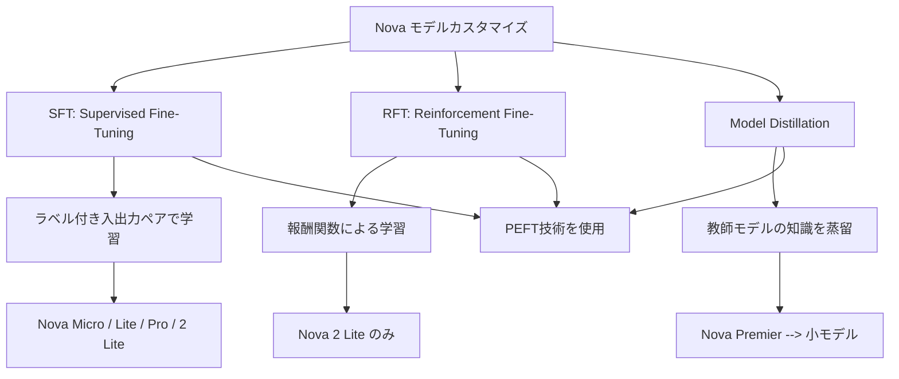
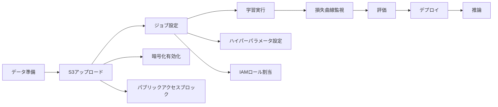

## ブログ概要（Summary）

本記事は [https://aws.amazon.com/blogs/machine-learning/customize-amazon-nova-models-with-amazon-bedrock-fine-tuning/](https://aws.amazon.com/blogs/machine-learning/customize-amazon-nova-models-with-amazon-bedrock-fine-tuning/) の解説記事です。

AWSの公式ブログでは、Amazon Bedrock上でNovaモデルファミリーをファインチューニングする手法が解説されている。航空旅行情報システム（ATIS）データセットを用いた意図分類タスクにおいて、ベースのNova Microモデルの精度41.4%からファインチューニング後の97.0%へ、55.6ポイントの改善を達成したと報告されている。学習コストは$2.18、学習時間は約1.5時間と、低コストかつ短時間でのモデルカスタマイズが可能であることが示されている。

この記事は [Zenn記事: Amazon Bedrock Novaバッチ推論で社内問い合わせ分類のコストを50%削減する](https://zenn.dev/0h_n0/articles/164086e37b0fd2) の深掘りです。

## 情報源

- **種別**: 企業テックブログ
- **URL**: [https://aws.amazon.com/blogs/machine-learning/customize-amazon-nova-models-with-amazon-bedrock-fine-tuning/](https://aws.amazon.com/blogs/machine-learning/customize-amazon-nova-models-with-amazon-bedrock-fine-tuning/)
- **組織**: AWS (Amazon Web Services)
- **発表日**: 2025年

## 技術的背景（Technical Background）

LLMの汎用性は多くのタスクに対応できる一方、特定ドメインの分類タスクでは精度が不十分となるケースが多い。意図分類のようなクローズドセット分類問題では、事前定義されたカテゴリに対する一貫した予測が求められるが、汎用LLMは出力フォーマットの揺れやドメイン知識の不足により精度が低下しやすい。

ファインチューニングはこの課題に対する有効なアプローチであり、ラベル付きデータを用いてモデルの重みを更新することで、特定タスクへの適応が可能になる。しかし、全パラメータのファインチューニングは計算コストが高く、大規模モデルでは実用的ではない場合がある。PEFT（Parameter-Efficient Fine-Tuning）はこの問題を解決し、パラメータの一部のみを更新することで、計算コストを抑えつつタスク適応を実現する。AWSのBedrock上でのファインチューニングは、このPEFT技術をマネージドサービスとして提供し、インフラ管理なしにモデルカスタマイズを可能にしている。

## 実装アーキテクチャ（Architecture）

### ファインチューニング方式の全体像

AWSの公式ブログによると、Bedrock上でのNovaモデルのカスタマイズには3つの方式が提供されている。



**SFT（Supervised Fine-Tuning）** は、ラベル付き入出力ペアのデータセットを用いてモデルの重みを更新する方式である。最も基本的なカスタマイズ手法であり、Nova Micro、Lite、Pro、2 Liteが対応している。

**RFT（Reinforcement Fine-Tuning）** は、報酬関数を用いた強化学習ベースの手法である。カスタムコードまたはLLMをジャッジとして活用し、出力品質に基づいてモデルを最適化する。現時点ではNova 2 Liteのみが対応している。

**Model Distillation** は、大規模な教師モデル（Nova Premier）から小規模な生徒モデルへ知識を移転する手法である。教師モデルの推論能力を保持しつつ、レイテンシとコストを削減できる。

### データ準備パイプライン

データは `bedrock-conversation-2024` スキーマに準拠したJSONL形式で準備する。AWSの公式ブログでは、以下の構造が示されている。

```json
{
  "schemaVersion": "bedrock-conversation-2024",
  "system": [
    {
      "text": "Classify the intent of airline queries. Choose one intent from this list: abbreviation, aircraft, airfare, airline, airport, capacity, cheapest, city, distance, flight, flight_no, flight_time, ground_fare, ground_service, meal, quantity, restriction\n\nRespond with only the intent name, nothing else."
    }
  ],
  "messages": [
    {
      "role": "user",
      "content": [{"text": "show me the morning flights from boston to philadelphia"}]
    },
    {
      "role": "assistant",
      "content": [{"text": "flight"}]
    }
  ]
}
```

公式ブログでは、学習データの準備において以下の点が強調されている。

- **systemプロンプトの一貫性**: 学習時に使用するsystemプロンプトは推論時にも同一のものを使用する必要がある
- **データ品質の優先**: 「小さく高品質なデータセットが大量の低品質データを上回る」と明記されている
- **分割比率**: 学習データの10%をバリデーションセットとして分離し、別途テストセットも確保する
- **PII処理**: 名前、メールアドレス、電話番号、支払い情報などの個人情報は匿名化またはマスキングする

### 学習ワークフロー



S3バケットにはサーバーサイド暗号化（SSE-S3またはSSE-KMS）の有効化、パブリックアクセスのブロック、バージョニングの有効化が必要とされている。学習完了後はオンデマンドデプロイメントを作成し、ステータスが「Active」になった時点でPlaygroundまたはAPIから推論が可能になる。

## パフォーマンス最適化（Performance）

### ハイパーパラメータ設定

AWSの公式ブログでは、3つのハイパーパラメータが調整可能である。

| パラメータ | 範囲 | デフォルト | ATISでの設定 | 説明 |
|-----------|------|---------|------------|------|
| `epochCount` | 1-5 | 2 | 3 | データセット全体を走査する回数 |
| `learningRateMultiplier` | 可変 | 1e-5 | 1e-5 | 重み更新の積極度を制御 |
| `learningRateWarmupSteps` | 可変 | 10 | 10 | 学習率を段階的に引き上げるステップ数 |

ファインチューニングの目的関数は、教師あり学習の標準的な交差エントロピー損失である。

$$
\mathcal{L}(\theta) = -\frac{1}{N} \sum_{i=1}^{N} \log p(y_i \mid x_i; \theta)
$$

ここで、$N$はサンプル数、$x_i$は$i$番目の入力（systemプロンプト + userメッセージ）、$y_i$は$i$番目の正解ラベル（assistantの応答）、$\theta$はモデルパラメータ、$p(y \mid x; \theta)$はモデルの予測確率である。

### 損失曲線診断

AWSの公式ブログでは、「損失曲線が学習の全てを物語る」と述べられている。以下の3パターンに基づく診断指針が示されている。

| 損失曲線パターン | 症状 | 対処法 |
|---------------|------|--------|
| 振動（Oscillating） | 上下に激しく変動 | `learningRateMultiplier`を50%に減少 |
| フラット（Flat） | 収束せず停滞 | `learningRateMultiplier`を2倍に増加 |
| 早期プラトー（Early plateau） | 十分な精度に到達前に停滞 | `epochCount`を1-2増加 |

理想的な損失曲線は、劇的な変動なく滑らかに下降するパターンである。

## 運用での学び（Production Lessons）

### データ品質の重要性

ATISベンチマークの結果から、データ品質に関する重要な知見が得られている。4,978サンプル（21カテゴリの意図分類）という比較的小規模なデータセットで、41.4%から97.0%への精度向上が達成されたことは、データ量よりもデータ品質が成果を左右することを示している。

公式ブログでは、「あいまいなラベルや矛盾する回答をチームで検証し、ファインチューニング前に除去する」ことが推奨されている。この知見は、実務でのデータ準備フェーズにおいて、アノテーション品質の管理体制を構築することの重要性を示唆している。

### モデル選択基準

| モデル | 特徴 | FT対応 | 推奨ユースケース |
|--------|------|--------|---------------|
| Nova Premier | 最高性能、教師モデル | Distillationのみ | 蒸留の教師、高精度が必要な場面 |
| Nova Pro | 精度/速度/コストのバランス | SFT | 汎用的な業務タスク |
| Nova 2 Lite | マルチモーダル、100万トークンコンテキスト | SFT, RFT | マルチモーダル分類、長文処理 |
| Nova Lite | 低コストマルチモーダル | SFT | コスト重視のマルチモーダルタスク |
| Nova Micro | 最低レイテンシ/コスト、テキストのみ | SFT | 高速テキスト分類、チャット応答 |

ATISベンチマークではNova Microが使用されたが、これはテキスト分類タスクにおいて最低レイテンシかつ最低コストで十分な精度が得られることを示している。マルチモーダル入力（画像、動画）が必要な場合はNova LiteまたはNova 2 Liteが候補となる。

### コスト構造

公式ブログで報告されたATISベンチマークのコスト実績は以下の通りである。

- **学習コスト**: $2.18（約1.75Mトークン処理）
- **学習時間**: 約1.5時間
- **モデルストレージ**: $1.75/月
- **推論コスト**: 非カスタマイズモデルと同一レート

推論時のコストはオンデマンドの標準レートが適用されるため、ファインチューニングによる追加コストは学習費用とストレージ費用のみである。

## 学術研究との関連（Academic Connection）

ATISデータセットは、航空旅行情報システムにおける自然言語理解の標準ベンチマークとして、1990年代から意図分類研究で広く使用されている。21カテゴリの意図分類という設定は、実務における問い合わせ分類システムと類似しており、評価指標として適切である。

PEFT技術は、LoRA（Low-Rank Adaptation）やAdapter Layersなどの手法が学術界で広く研究されており、AWSのBedrock Fine-tuningはこれらの手法をマネージドサービスとして提供するものと位置付けられる。ただし、公式ブログではBedrock内部で使用されるPEFT手法の具体的なアルゴリズム（LoRA、QLoRA等）は明示されていない。

## Production Deployment Guide

### AWS実装パターン（コスト最適化重視）

Novaファインチューニング済みモデルを本番環境にデプロイする際の、トラフィック量別推奨構成を以下に示す。

| 構成 | トラフィック | アーキテクチャ | 月額コスト概算 |
|------|-----------|-------------|-------------|
| Small | ~100 req/日 | Lambda + Bedrock + DynamoDB | $50-150 |
| Medium | ~1,000 req/日 | ECS Fargate + Bedrock + ElastiCache | $300-800 |
| Large | 10,000+ req/日 | EKS + Bedrock + ElastiCache + Aurora | $2,000-5,000 |

**Small構成の内訳**:
- Lambda: 100 req/日 x 30日 x 512MB x 5秒 = 月3,000リクエスト、約$0.20
- Bedrock Nova Micro推論: 3,000 req x ~500入力トークン x ~50出力トークン、約$1-5
- DynamoDB (On-Demand): 分類結果キャッシュ、約$1-3
- CloudWatch: ログ・メトリクス、約$3-5
- S3: モデルアーティファクト保管、約$0.50
- カスタムモデルストレージ: $1.75/月

**Medium構成の内訳**:
- ECS Fargate: 0.5 vCPU x 1GB x 24h、約$30-50
- Bedrock推論: 30,000 req/月、約$10-50
- ElastiCache (t3.micro): 結果キャッシュ、約$13
- ALB: ロードバランサー、約$20
- CloudWatch + X-Ray: 約$10

**Large構成の内訳**:
- EKS コントロールプレーン: $73
- EC2 ワーカー (Spot): m5.xlarge x 2-4台、約$100-400
- Bedrock推論: 300,000+ req/月、約$100-500
- Aurora Serverless v2: 分類ログ・分析、約$50-200
- ElastiCache (r6g.large): 高スループットキャッシュ、約$100

**コスト削減テクニック**:
- Spot Instancesの活用でEC2コストを最大90%削減
- Reserved Instancesの1年コミットで最大72%削減
- Bedrock Batch APIの使用で推論コスト50%削減（リアルタイム性が不要な場合）
- Prompt Cachingの有効化で30-90%削減

> **注記**: コスト試算は2026年6月時点のAWS ap-northeast-1（東京）リージョン料金に基づく概算値である。実際のコストはトラフィックパターン、リージョン、バースト使用量により変動する。最新料金は[AWS料金計算ツール](https://calculator.aws/)で確認を推奨する。

### Terraformインフラコード

#### Small構成（Serverless: Lambda + Bedrock + DynamoDB）

```hcl
# --- VPC基盤（NAT Gateway不使用でコスト削減） ---
resource "aws_vpc" "main" {
  cidr_block           = "10.0.0.0/16"
  enable_dns_hostnames = true
  enable_dns_support   = true

  tags = { Name = "nova-ft-vpc", Environment = "production" }
}

resource "aws_subnet" "private" {
  count             = 2
  vpc_id            = aws_vpc.main.id
  cidr_block        = cidrsubnet(aws_vpc.main.cidr_block, 8, count.index)
  availability_zone = data.aws_availability_zones.available.names[count.index]

  tags = { Name = "nova-ft-private-${count.index}" }
}

# VPCエンドポイント（NAT Gateway不要でBedrock接続）
resource "aws_vpc_endpoint" "bedrock" {
  vpc_id              = aws_vpc.main.id
  service_name        = "com.amazonaws.ap-northeast-1.bedrock-runtime"
  vpc_endpoint_type   = "Interface"
  subnet_ids          = aws_subnet.private[*].id
  private_dns_enabled = true

  security_group_ids = [aws_security_group.vpc_endpoint.id]
}

# --- IAMロール（最小権限） ---
resource "aws_iam_role" "lambda_role" {
  name = "nova-ft-lambda-role"

  assume_role_policy = jsonencode({
    Version = "2012-10-17"
    Statement = [{
      Action    = "sts:AssumeRole"
      Effect    = "Allow"
      Principal = { Service = "lambda.amazonaws.com" }
    }]
  })
}

resource "aws_iam_role_policy" "bedrock_invoke" {
  name = "bedrock-invoke-policy"
  role = aws_iam_role.lambda_role.id

  # カスタムモデルのみ呼び出し許可（最小権限）
  policy = jsonencode({
    Version = "2012-10-17"
    Statement = [{
      Effect   = "Allow"
      Action   = ["bedrock:InvokeModel"]
      Resource = "arn:aws:bedrock:ap-northeast-1:*:provisioned-model/*"
    }, {
      Effect   = "Allow"
      Action   = ["dynamodb:PutItem", "dynamodb:GetItem", "dynamodb:Query"]
      Resource = aws_dynamodb_table.classification_cache.arn
    }]
  })
}

# --- Lambda関数 ---
resource "aws_lambda_function" "classifier" {
  function_name = "nova-ft-classifier"
  runtime       = "python3.12"
  handler       = "handler.lambda_handler"
  timeout       = 30
  memory_size   = 512 # Bedrock呼び出しにはCPU性能も影響

  role = aws_iam_role.lambda_role.arn

  environment {
    variables = {
      MODEL_ID    = var.custom_model_id
      TABLE_NAME  = aws_dynamodb_table.classification_cache.name
      CACHE_TTL   = "3600"
    }
  }

  vpc_config {
    subnet_ids         = aws_subnet.private[*].id
    security_group_ids = [aws_security_group.lambda.id]
  }
}

# --- DynamoDB（On-Demandモード: コスト最適化） ---
resource "aws_dynamodb_table" "classification_cache" {
  name         = "nova-ft-classification-cache"
  billing_mode = "PAY_PER_REQUEST" # On-Demand: 低トラフィック向け
  hash_key     = "request_hash"

  attribute {
    name = "request_hash"
    type = "S"
  }

  ttl {
    attribute_name = "expires_at"
    enabled        = true
  }

  server_side_encryption { enabled = true } # KMS暗号化

  tags = { Environment = "production", Service = "nova-classifier" }
}

# --- CloudWatchアラーム（コスト監視） ---
resource "aws_cloudwatch_metric_alarm" "lambda_errors" {
  alarm_name          = "nova-ft-lambda-errors"
  comparison_operator = "GreaterThanThreshold"
  evaluation_periods  = 2
  metric_name         = "Errors"
  namespace           = "AWS/Lambda"
  period              = 300
  statistic           = "Sum"
  threshold           = 5
  alarm_actions       = [var.sns_topic_arn]

  dimensions = { FunctionName = aws_lambda_function.classifier.function_name }
}
```

#### Large構成（Container: EKS + Karpenter + Spot Instances）

```hcl
# --- EKSクラスタ ---
module "eks" {
  source          = "terraform-aws-modules/eks/aws"
  version         = "~> 20.0"
  cluster_name    = "nova-ft-cluster"
  cluster_version = "1.31"

  vpc_id     = aws_vpc.main.id
  subnet_ids = aws_subnet.private[*].id

  cluster_endpoint_public_access = false # プライベートアクセスのみ

  # Karpenter用のIAMロール設定
  enable_irsa = true
}

# --- Karpenter Provisioner（Spot優先） ---
resource "kubectl_manifest" "karpenter_nodepool" {
  yaml_body = yamlencode({
    apiVersion = "karpenter.sh/v1"
    kind       = "NodePool"
    metadata   = { name = "nova-ft-pool" }
    spec = {
      template = {
        spec = {
          requirements = [
            { key = "karpenter.sh/capacity-type", operator = "In", values = ["spot", "on-demand"] },
            { key = "node.kubernetes.io/instance-type", operator = "In", values = ["m5.xlarge", "m5a.xlarge", "m6i.xlarge"] }
          ]
        }
      }
      limits   = { cpu = "32", memory = "128Gi" }
      disruption = {
        consolidationPolicy = "WhenEmptyOrUnderutilized"
        consolidateAfter    = "30s"
      }
    }
  })
}

# --- Secrets Manager（Bedrock設定） ---
resource "aws_secretsmanager_secret" "bedrock_config" {
  name = "nova-ft/bedrock-config"
  kms_key_id = aws_kms_key.secrets.arn
}

# --- AWS Budgets（予算アラート） ---
resource "aws_budgets_budget" "monthly" {
  name         = "nova-ft-monthly-budget"
  budget_type  = "COST"
  limit_amount = "5000"
  limit_unit   = "USD"
  time_unit    = "MONTHLY"

  notification {
    comparison_operator       = "GREATER_THAN"
    threshold                 = 80
    threshold_type            = "PERCENTAGE"
    notification_type         = "ACTUAL"
    subscriber_email_addresses = [var.alert_email]
  }
}
```

### 運用・監視設定

#### CloudWatch Logs Insights クエリ

```
# コスト異常検知: 1時間あたりのBedrock呼び出し回数
fields @timestamp, @message
| filter @message like /InvokeModel/
| stats count() as invocations by bin(1h)
| sort invocations desc
| limit 24

# レイテンシ分析: P95, P99
fields @timestamp, @duration
| filter @type = "REPORT"
| stats avg(@duration) as avg_ms,
        percentile(@duration, 95) as p95_ms,
        percentile(@duration, 99) as p99_ms
  by bin(1h)
```

#### CloudWatch アラーム設定

```python
import boto3
from typing import Any

cloudwatch = boto3.client("cloudwatch", region_name="ap-northeast-1")


def create_bedrock_token_alarm(
    model_id: str,
    threshold: float = 100000,
    sns_topic_arn: str = "",
) -> dict[str, Any]:
    """Bedrockトークン使用量スパイク検知アラームを作成する。

    Args:
        model_id: カスタムモデルのID
        threshold: 5分間のトークン使用量閾値
        sns_topic_arn: 通知先SNSトピックARN

    Returns:
        CloudWatch put_metric_alarm APIレスポンス
    """
    return cloudwatch.put_metric_alarm(
        AlarmName=f"bedrock-token-spike-{model_id[:8]}",
        MetricName="InputTokenCount",
        Namespace="AWS/Bedrock",
        Statistic="Sum",
        Period=300,
        EvaluationPeriods=2,
        Threshold=threshold,
        ComparisonOperator="GreaterThanThreshold",
        AlarmActions=[sns_topic_arn],
        Dimensions=[{"Name": "ModelId", "Value": model_id}],
    )
```

#### X-Ray トレーシング設定

```python
from aws_xray_sdk.core import xray_recorder, patch_all
from aws_xray_sdk.core.models.subsegment import Subsegment

# boto3自動計装
patch_all()


def classify_with_tracing(
    text: str,
    model_id: str,
    system_prompt: str,
) -> str:
    """X-Rayトレーシング付きでBedrock分類を実行する。

    Args:
        text: 分類対象のテキスト
        model_id: Bedrockカスタムモデルの識別子
        system_prompt: ファインチューニング時と同一のsystemプロンプト

    Returns:
        分類結果の意図ラベル
    """
    subsegment: Subsegment = xray_recorder.begin_subsegment("bedrock_classify")
    subsegment.put_annotation("model_id", model_id)
    subsegment.put_metadata("input_length", len(text))

    try:
        import boto3, json
        client = boto3.client("bedrock-runtime")
        response = client.invoke_model(
            modelId=model_id,
            body=json.dumps({
                "system": [{"text": system_prompt}],
                "messages": [{"role": "user", "content": [{"text": text}]}],
            }),
        )
        result = json.loads(response["body"].read())
        intent = result["output"]["message"]["content"][0]["text"]
        subsegment.put_metadata("intent", intent)
        return intent
    finally:
        xray_recorder.end_subsegment()
```

#### Cost Explorer自動レポート

```python
import boto3
from datetime import datetime, timedelta
from typing import Any


def get_daily_cost_report(
    days_back: int = 1,
    cost_threshold: float = 100.0,
    sns_topic_arn: str = "",
) -> dict[str, Any]:
    """日次コストレポートを取得し、閾値超過時にSNS通知を送信する。

    Args:
        days_back: 何日前のコストを取得するか
        cost_threshold: コスト超過警告の閾値（USD/日）
        sns_topic_arn: 通知先SNSトピックARN

    Returns:
        サービス別コスト内訳の辞書
    """
    ce = boto3.client("ce", region_name="us-east-1")
    end = datetime.utcnow().strftime("%Y-%m-%d")
    start = (datetime.utcnow() - timedelta(days=days_back)).strftime("%Y-%m-%d")

    response = ce.get_cost_and_usage(
        TimePeriod={"Start": start, "End": end},
        Granularity="DAILY",
        Metrics=["BlendedCost"],
        Filter={
            "Or": [
                {"Dimensions": {"Key": "SERVICE", "Values": ["Amazon Bedrock"]}},
                {"Dimensions": {"Key": "SERVICE", "Values": ["AWS Lambda"]}},
                {"Dimensions": {"Key": "SERVICE", "Values": ["Amazon Elastic Kubernetes Service"]}},
            ]
        },
        GroupBy=[{"Type": "DIMENSION", "Key": "SERVICE"}],
    )

    costs: dict[str, float] = {}
    total = 0.0
    for group in response["ResultsByTime"][0].get("Groups", []):
        service = group["Keys"][0]
        amount = float(group["Metrics"]["BlendedCost"]["Amount"])
        costs[service] = amount
        total += amount

    if total > cost_threshold and sns_topic_arn:
        sns = boto3.client("sns")
        sns.publish(
            TopicArn=sns_topic_arn,
            Subject=f"Nova FT Cost Alert: ${total:.2f}/day",
            Message=f"日次コストが${cost_threshold}を超過: ${total:.2f}\n\n"
                    + "\n".join(f"  {k}: ${v:.2f}" for k, v in costs.items()),
        )

    return {"total": total, "services": costs, "date": start}
```

### コスト最適化チェックリスト

**アーキテクチャ選択**:
- [ ] トラフィック量を測定し、Small/Medium/Large構成を選択済み
- [ ] Serverless（Lambda）とContainer（EKS）の損益分岐点を計算済み
- [ ] リアルタイム推論 vs バッチ推論の要件を明確化済み

**リソース最適化**:
- [ ] EC2: Spot Instancesを優先設定（Karpenter/ASG）
- [ ] Reserved Instances: 1年コミットで安定ワークロードを確保
- [ ] Savings Plans: Compute Savings Plansで柔軟な割引適用
- [ ] Lambda: メモリサイズをPower Tuningで最適化（512MB推奨）
- [ ] ECS/EKS: アイドル時のスケールダウン（最小レプリカ=1）
- [ ] NAT Gateway: VPCエンドポイントで代替しコスト削減

**LLMコスト削減**:
- [ ] Bedrock Batch APIを非リアルタイムタスクに使用（50%削減）
- [ ] Prompt Caching有効化で重複systemプロンプトのコスト削減
- [ ] タスク複雑度に応じたモデル選択ロジック実装（Micro/Lite/Pro切替）
- [ ] 入力トークン数の上限設定（不要な長文を制限）
- [ ] 分類結果のDynamoDBキャッシュ（同一クエリの再推論回避）

**監視・アラート**:
- [ ] AWS Budgets: 月額予算の80%/100%でアラート設定
- [ ] CloudWatchアラーム: Lambda Errors、Bedrock Throttle検知
- [ ] Cost Anomaly Detection: Bedrockサービスの異常検知有効化
- [ ] 日次コストレポート: Cost Explorer APIで自動取得、SNS通知

**リソース管理**:
- [ ] 未使用カスタムモデルの削除（$1.75/月/モデル節約）
- [ ] タグ戦略: Environment/Service/Owner タグ必須
- [ ] S3ライフサイクルポリシー: 学習データの90日後Glacier移行
- [ ] 開発環境の夜間停止: EKSノードのスケールイン
- [ ] CloudWatch Logs保持期間: 30日に制限（コスト削減）

## まとめと実践への示唆

AWSの公式ブログによると、Amazon Bedrock上でのNovaモデルのファインチューニングは、PEFT技術の活用により低コスト（$2.18）かつ短時間（約1.5時間）でのモデルカスタマイズを実現している。ATISデータセットにおける41.4%から97.0%への精度向上は、4,978サンプルという比較的小規模なデータセットで達成されており、データ品質を重視した準備が成果の鍵であることが示されている。実務においては、systemプロンプトの学習時・推論時の一貫性、損失曲線に基づくハイパーパラメータ調整、そしてモデル選択（Nova Micro/Lite/Pro）のトレードオフを適切に判断することが、費用対効果の高いLLMカスタマイズにつながると考えられる。

## 参考文献

- **Blog URL**: [https://aws.amazon.com/blogs/machine-learning/customize-amazon-nova-models-with-amazon-bedrock-fine-tuning/](https://aws.amazon.com/blogs/machine-learning/customize-amazon-nova-models-with-amazon-bedrock-fine-tuning/)
- **AWS Bedrock Pricing**: [https://aws.amazon.com/bedrock/pricing/](https://aws.amazon.com/bedrock/pricing/)
- **ATIS Dataset**: Hemphill, C. T., Godfrey, J. J., & Doddington, G. R. (1990). The ATIS Spoken Language Systems Pilot Corpus. DARPA Speech and Natural Language Workshop.
- **Related Zenn article**: [https://zenn.dev/0h_n0/articles/164086e37b0fd2](https://zenn.dev/0h_n0/articles/164086e37b0fd2)
