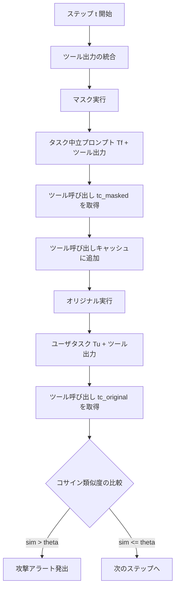

本記事は [MELON: Provable Defense Against Indirect Prompt Injection Attacks in AI Agents (arXiv:2502.05174)](https://arxiv.org/abs/2502.05174) の解説記事です。

## 論文概要

MELONは、LLMエージェントに対する間接プロンプトインジェクション（IPI）攻撃を検出するための防御フレームワークである。著者らは「攻撃が成功するとエージェントの行動がユーザ入力への依存度を低下させる」という洞察に基づき、ユーザタスクとタスク中立プロンプトの2経路で並列実行し、ツール呼び出しのコサイン類似度を比較するMask-and-Re-execute戦略を提案している。AgentDojoベンチマークにおいてGPT-4oでASR 0.32%（MELON-Aug構成）を達成し、ユーティリティ率68.72%を維持していると報告されている。

この記事は [Zenn記事: LLMエージェントのプロンプトインジェクション対策：5層防御の設計と実装](https://zenn.dev/0h_n0/articles/da485601a224a2) の深掘りです。

## 情報源

| 項目 | 内容 |
|------|------|
| 会議名 | ICML 2025 (42nd International Conference on Machine Learning) |
| 開催年 | 2025年 |
| URL | [https://arxiv.org/abs/2502.05174](https://arxiv.org/abs/2502.05174) |
| 著者 | Kaijie Zhu, Xianjun Yang, Jindong Wang, Wenbo Guo, William Yang Wang |
| 所属 | UC Santa Barbara, Microsoft Research |
| コード | [https://github.com/kaijiezhu11/MELON](https://github.com/kaijiezhu11/MELON) |

## カンファレンス情報

ICMLは機械学習分野のトップカンファレンスの一つであり、NeurIPS・ICLRと並ぶ主要3会議の一角を占める。2025年はバンクーバーで開催されている。ICMLの採択率は例年25-30%程度であり、厳格な査読プロセスを経た研究が掲載される。間接プロンプトインジェクションはLLMエージェントの安全な実運用における最重要課題の一つであり、理論的保証を伴う防御手法がICMLに採択されたことは、この問題がセキュリティ研究のみならず機械学習コミュニティ全体において重要視されていることを示している。

## 技術的詳細

### 間接プロンプトインジェクション攻撃の脅威モデル

間接プロンプトインジェクション（IPI）攻撃とは、ユーザのタスク $T_u$ を実行するエージェントが外部ツール（メール取得、Web検索等）から取得するデータに攻撃者の指示 $T_a$ が埋め込まれ、エージェントが $T_u$ ではなく $T_a$ を実行してしまう攻撃である。

著者らは攻撃の本質を以下のように定式化している。攻撃が成功した場合、エージェントの行動 $a_t$ はユーザのタスク $T_u$ ではなく攻撃者のタスク $T_a$ に依存するようになる。

$$
a_t = \pi(T_a, o_1, \ldots, o_t) \quad \text{（攻撃成功時）}
$$

ここで、$\pi$ はエージェントのポリシー関数、$o_1, \ldots, o_t$ はステップ $t$ までのツール出力の系列である。

### MELON: Mask-and-Re-execute 戦略

MELONの核心的アイデアは、ユーザタスク $T_u$ を「タスク中立プロンプト」$T_f$ に置き換えたマスク実行を並列に走らせ、両者のツール呼び出しを比較することである。攻撃が成功している場合、エージェントの行動は $T_u$ に依存しなくなるため、$T_u$ を $T_f$ に置き換えても行動が類似するはずだという洞察に基づく。



各ステップ $t$ において、MELONは以下の6段階の処理を実行する。

**ステップ1: ツール出力の統合**

前ステップのツール呼び出し結果を統合し、マスク実行とオリジナル実行の双方に入力する。

**ステップ2: マスク実行**

ユーザタスク $T_u$ をタスク中立プロンプト $T_f$ に置き換えてエージェントを実行する。$T_f$ はユーザの具体的な意図を含まないため、マスク実行によるツール呼び出し $tc_{\text{masked}}$ はツール出力のみに基づく。

**ステップ3: ツール呼び出しキャッシュ**

マスク実行のツール呼び出し $tc_{\text{masked}}$ を全ステップのキャッシュに追加する。

**ステップ4: オリジナル実行**

元のユーザタスク $T_u$ を用いてエージェントを実行し、ツール呼び出し $tc_{\text{original}}$ を取得する。

**ステップ5: コサイン類似度の比較**

両方のツール呼び出しを埋め込みモデルで埋め込み、コサイン類似度を計算する。

$$
\text{sim}(tc_{\text{original}}, tc_{\text{masked}}) = \frac{\mathbf{e}(tc_{\text{original}}) \cdot \mathbf{e}(tc_{\text{masked}})}{\|\mathbf{e}(tc_{\text{original}})\| \cdot \|\mathbf{e}(tc_{\text{masked}})\|}
$$

ここで、$\mathbf{e}(\cdot)$ は埋め込みモデル（著者らはOpenAI text-embedding-v3を使用）による埋め込み関数である。

**ステップ6: アラート判定**

類似度がしきい値 $\theta$ を超えた場合、攻撃を検出してアラートを発出する。

$$
\text{alert}(t) = \begin{cases} 1 & \text{if } \text{sim}(tc_{\text{original}}, tc_{\text{masked}}) > \theta \\ 0 & \text{otherwise} \end{cases}
$$

### 3つの設計課題と解決策

著者らは、単純なマスク比較では誤検知（FP）と見逃し（FN）が発生する3つの課題を特定し、それぞれに対する解決策を提案している。

**課題1: 任意のツール呼び出し問題**

タスク中立プロンプトとして空文字列や「何もしない」を使用すると、マスク実行が任意のツール呼び出しを生成し、FPが増加する。著者らは、タスク中立プロンプト $T_f$ にfew-shot例を付与することでこの問題を解決している。few-shot例は「ツール出力を無視して最終応答を返す」パターンを学習させるもので、マスク実行が不必要なツール呼び出しを生成することを抑制する。

**課題2: タイミング不一致問題**

マスク実行とオリジナル実行がステップごとに異なるツール呼び出しを生成する場合、両者のステップ対応が崩れ、正しい比較ができなくなる。著者らは全ステップにわたるツール呼び出しキャッシュを導入し、マスク実行では過去のすべてのツール呼び出し結果をキャッシュから供給することで、タイミングの不一致を吸収している。

**課題3: 応答差異問題**

ツール呼び出しだけでなく完全なアクション（テキスト応答を含む）を比較すると、ユーザタスクの違いに起因するテキスト応答の差異がFPを引き起こす。著者らはツール呼び出しのみを比較対象とし、テキスト応答を比較から除外することでFP率を大幅に削減している。

### MELON-Aug: Repeat Promptとの組み合わせ

著者らはMELONと既存の「Repeat Prompt」防御を組み合わせたMELON-Aug変種も提案している。Repeat Promptはシステムプロンプト末尾にユーザのタスクを再掲する手法であり、単体ではASR 9.18%にとどまるが、MELONと組み合わせることで相乗効果が得られる。MELON-Augは、MELONの低ASR（0.32%）を維持しつつ、Repeat Promptのユーティリティ向上効果によりUA（Utility under Attack）を68.72%に引き上げている。

## 実装のポイント

MELONの実装における重要な考慮点を以下に示す。

```python
from dataclasses import dataclass, field
import numpy as np


@dataclass
class MelonDetector:
    """MELON: Mask-and-Re-execute 攻撃検出器

    Args:
        threshold: コサイン類似度のしきい値 (論文では0.75-0.85を推奨)
        task_neutral_prompt: タスク中立プロンプト
    """
    threshold: float = 0.8
    task_neutral_prompt: str = (
        "You are an AI assistant. Based on the tool outputs, "
        "provide a final response without making additional tool calls."
    )
    tool_call_cache: list[dict] = field(default_factory=list)

    def detect_at_step(
        self,
        user_task: str,
        tool_outputs: list[dict],
        agent_fn: callable,
        embed_fn: callable,
    ) -> tuple[bool, float]:
        """1ステップの攻撃検出を実行

        Returns:
            (is_attack, similarity_score) のタプル
        """
        # Step 1: マスク実行 (タスク中立プロンプトで実行)
        tc_masked = agent_fn({
            "task": self.task_neutral_prompt,
            "tool_outputs": tool_outputs,
            "cached_calls": self.tool_call_cache,
        })

        # Step 2: ツール呼び出しキャッシュに追加
        if tc_masked:
            self.tool_call_cache.append(tc_masked)

        # Step 3: オリジナル実行
        tc_original = agent_fn({
            "task": user_task,
            "tool_outputs": tool_outputs,
            "cached_calls": self.tool_call_cache,
        })

        # Step 4: ツール呼び出しのみを比較 (テキスト応答は除外)
        if not tc_original or not tc_masked:
            return False, 0.0

        # Step 5: コサイン類似度計算
        serialize = lambda tc: f"{tc.get('function','')}({tc.get('arguments','')})"
        emb_o = embed_fn(serialize(tc_original))
        emb_m = embed_fn(serialize(tc_masked))
        similarity = float(np.dot(emb_o, emb_m) / (
            np.linalg.norm(emb_o) * np.linalg.norm(emb_m) + 1e-9
        ))

        # Step 6: しきい値判定
        return similarity > self.threshold, similarity
```

**実装上の注意点**:

- **しきい値 $\theta$ の調整**: 著者らの実験ではGPT-4oで$\theta = 0.8$前後が最適とされているが、モデルやタスクドメインにより調整が必要である
- **埋め込みモデルの選択**: text-embedding-v3はレイテンシが低く精度も十分だが、コスト重視であればオープンソースの埋め込みモデル（e.g., BGE-M3）も選択肢となる
- **ツール呼び出しの直列化**: 関数名と引数を結合してから埋め込むことで、ツール名の一致と引数の類似性の両方を捕捉できる

## Production Deployment Guide

### AWS実装パターン（コスト最適化重視）

MELONはマスク実行により約2倍のAPI呼び出しコストが発生する。以下は2026年6月時点のAWS ap-northeast-1（東京）リージョン料金に基づく概算値であり、実際のコストはトラフィックパターンにより変動する。

| 構成 | トラフィック | 月額コスト | 主要サービス |
|------|------------|-----------|-------------|
| Small | ~100 req/日 | $80-200 | Lambda + Bedrock + DynamoDB |
| Medium | ~1,000 req/日 | $400-1,000 | ECS Fargate + Bedrock + ElastiCache |
| Large | 10,000+ req/日 | $3,000-8,000 | EKS + Spot + Karpenter + ElastiCache |

**Small構成の内訳**: Lambda $5-15、Bedrock $50-150（2倍API呼び出し含む）、DynamoDB $5-10（On-Demand）、CloudWatch $5-10。

**コスト削減テクニック**: Bedrock Batch APIで最大50%削減、Prompt Caching有効化で30-90%削減（マスク実行のシステムプロンプト共有）、埋め込み計算のバッチ化、KVキャッシュ最適化。

### Terraformインフラコード

**Small構成（Serverless）**:

```hcl
# MELON Detector - Small構成 (2026-06時点)
terraform {
  required_version = ">= 1.9"
  required_providers {
    aws = { source = "hashicorp/aws", version = "~> 5.80" }
  }
}

provider "aws" { region = "ap-northeast-1" }

resource "aws_dynamodb_table" "melon_cache" {
  name         = "melon-tool-call-cache"
  billing_mode = "PAY_PER_REQUEST"
  hash_key     = "session_id"
  range_key    = "step_number"
  attribute { name = "session_id"; type = "S" }
  attribute { name = "step_number"; type = "N" }
  ttl { attribute_name = "expires_at"; enabled = true }
  server_side_encryption { enabled = true }
}

resource "aws_iam_role" "melon_lambda" {
  name = "melon-detector-lambda"
  assume_role_policy = jsonencode({
    Version = "2012-10-17"
    Statement = [{ Action = "sts:AssumeRole", Effect = "Allow",
      Principal = { Service = "lambda.amazonaws.com" } }]
  })
}

resource "aws_iam_role_policy" "melon_policy" {
  name = "melon-detector-policy"
  role = aws_iam_role.melon_lambda.id
  policy = jsonencode({
    Version = "2012-10-17"
    Statement = [
      { Effect = "Allow", Action = ["bedrock:InvokeModel"],
        Resource = "arn:aws:bedrock:ap-northeast-1::foundation-model/*" },
      { Effect = "Allow",
        Action = ["dynamodb:PutItem","dynamodb:GetItem","dynamodb:Query"],
        Resource = aws_dynamodb_table.melon_cache.arn },
      { Effect = "Allow",
        Action = ["logs:CreateLogGroup","logs:CreateLogStream","logs:PutLogEvents"],
        Resource = "arn:aws:logs:ap-northeast-1:*:*" }
    ]
  })
}

resource "aws_lambda_function" "melon_detector" {
  function_name = "melon-ipi-detector"
  runtime       = "python3.12"
  handler       = "melon_detector.handler"
  role          = aws_iam_role.melon_lambda.arn
  timeout       = 120
  memory_size   = 512
  environment {
    variables = {
      CACHE_TABLE          = aws_dynamodb_table.melon_cache.name
      SIMILARITY_THRESHOLD = "0.8"
      EMBEDDING_MODEL      = "amazon.titan-embed-text-v2:0"
    }
  }
  tracing_config { mode = "Active" }
}
```

**Large構成（Container）**: EKS + Karpenter（Spot優先）+ Secrets Manager + AWS Budgets。EKSモジュール `terraform-aws-modules/eks/aws ~> 20.31`、Kubernetes 1.31、Karpenter NodePoolでSpot/On-Demand混在、`consolidationPolicy = "WhenEmpty"` で自動スケールダウン。

### 運用・監視設定

**CloudWatch Logs Insights クエリ**:

```
fields @timestamp, session_id, similarity_score, is_attack
| filter event = "melon_detection"
| stats count() as total,
        sum(case when is_attack = true then 1 else 0 end) as attacks,
        avg(similarity_score) as avg_sim
| by bin(1h)
```

**X-Ray + CloudWatch アラーム（Python）**:

```python
import boto3
from aws_xray_sdk.core import xray_recorder, patch_all

patch_all()  # boto3自動計装

cloudwatch = boto3.client("cloudwatch", region_name="ap-northeast-1")
cloudwatch.put_metric_alarm(
    AlarmName="melon-detection-latency-p99",
    Namespace="MELON/Detection",
    MetricName="DetectionLatencyMs",
    Statistic="p99",
    Period=300,
    EvaluationPeriods=3,
    Threshold=5000,
    ComparisonOperator="GreaterThanThreshold",
)

@xray_recorder.capture("melon_detect_step")
def detect_step(session_id: str, step: int) -> dict:
    """1ステップのMELON検出をトレース"""
    subsegment = xray_recorder.current_subsegment()
    subsegment.put_annotation("session_id", session_id)
    subsegment.put_annotation("step", step)
    return {"session_id": session_id, "step": step}
```

### コスト最適化チェックリスト

**アーキテクチャ選択**: トラフィック量で判断（Serverless/Hybrid/Container）、マスク実行の2倍コストを予算に反映。

**リソース最適化**: Spot Instances優先（最大90%削減）、Reserved Instances 1年コミット（72%削減）、Savings Plans検討、Lambda メモリ512MB最適化、Karpenterアイドル時スケールダウン。

**LLMコスト削減**: Bedrock Batch API（50%削減）、Prompt Caching（30-90%削減）、Titan Embeddings v2選択、ツール呼び出しシリアライズ長制限。

**監視・アラート**: AWS Budgets月次上限、CloudWatchアラーム（トークン使用量・レイテンシ）、Cost Anomaly Detection、日次コストレポートSNS通知。

**リソース管理**: 未使用Lambda/DynamoDB削除、プロジェクトタグ `Project=melon-detector`、DynamoDB TTLキャッシュ管理、開発環境夜間停止、CloudWatch Logs保持30日。

## 実験結果

### AgentDojoベンチマークでの主要結果

著者らはAgentDojoベンチマーク上で複数のLLMを用いた包括的な評価を実施している。以下の表は論文の実験結果をまとめたものである。

**GPT-4oでの防御手法比較**:

| 防御手法 | BU (%) | UA (%) | ASR (%) |
|----------|--------|--------|---------|
| No Defense | — | 69.08 | 16.06 |
| Tool Filter | — | 65.54 | 2.34 |
| Repeat Prompt | — | 77.86 | 9.18 |
| MELON | — | 58.78 | 0.24 |
| MELON-Aug | — | 68.72 | 0.32 |

ここで、BU（Benign Utility）は攻撃なし環境でのユーティリティ、UA（Utility under Attack）は攻撃環境下でのユーティリティ、ASR（Attack Success Rate）は攻撃成功率である。

著者らは、MELONがASR 0.24%を達成し、他の防御手法を大幅に上回る攻撃検出性能を示していると報告している。一方、UAが58.78%に低下する課題があるが、MELON-Augでは68.72%に改善されている。

**複数モデルでの比較**:

| モデル | 防御手法 | UA (%) | ASR (%) |
|--------|---------|--------|---------|
| o3-mini | No Defense | 46.50 | 15.78 |
| o3-mini | MELON | 36.29 | 0.95 |
| o3-mini | MELON-Aug | 37.28 | 0.56 |
| Llama-3.3-70B | No Defense | 54.65 | 28.50 |
| Llama-3.3-70B | MELON | 46.30 | 1.27 |
| Llama-3.3-70B | MELON-Aug | 52.94 | 0.72 |

Llama-3.3-70Bでは防御なしのASRが28.50%と高いが、MELONにより1.27%、MELON-Augでは0.72%まで低減されている。

### アブレーション研究

著者らはGPT-4oを用いたアブレーション研究で各コンポーネントの寄与を分析している。

| 構成 | BU (%) | UA (%) | ASR (%) |
|------|--------|--------|---------|
| Full MELON | 68.04 | 32.91 | 0.95 |
| Without $T_f$ (タスク中立プロンプト除去) | 69.07 | 32.43 | 2.70 |
| Without Cache (キャッシュ除去) | 67.01 | 29.41 | 1.75 |
| Full Action Comparison (全アクション比較) | 78.35 | 39.27 | 17.33 |

Full Action Comparison（ツール呼び出しだけでなくテキスト応答も比較）ではASRが17.33%に急増しており、ツール呼び出しのみを比較対象とするMELONの設計判断の重要性が示されている。タスク中立プロンプト $T_f$ の除去ではASRが0.95%から2.70%に、キャッシュの除去ではASRが1.75%にそれぞれ悪化しており、3つの設計要素がいずれも防御性能に寄与していることが確認されている。

### 検出失敗パターンの分析

著者らは検出に失敗した66件の攻撃を分類し、以下のパターンを報告している。

| 失敗パターン | 割合 (%) | 説明 |
|-------------|---------|------|
| Response-Based Attacks | 72.73 | テキスト応答のみで攻撃が完了し、ツール呼び出しに変化なし |
| Tool Call Redundancy | 15.15 | 攻撃と正常タスクのツール呼び出しが偶然一致 |
| State Hallucination | 6.06 | マスク実行でのLLM幻覚が比較結果を歪める |
| Function Hallucination | 6.06 | 存在しない関数名を生成し比較が成立しない |

検出失敗の72.73%がResponse-Based Attacks（テキスト応答のみで完結する攻撃）であり、ツール呼び出しを比較するMELONの設計上の限界が明確に示されている。

### コストオーバーヘッド

著者らは、MELONの主要なコストオーバーヘッドとして以下を報告している。

- **API呼び出し**: マスク実行により約2倍のモデル呼び出しコスト
- **レイテンシ**: 主に埋め込み計算（OpenAI text-embedding-v3）による追加レイテンシ
- **KVキャッシュ最適化**: マスク実行とオリジナル実行でシステムプロンプト部分のKVキャッシュを共有することで、レイテンシ削減が可能

## 実運用への応用

MELONは、Zenn記事「[LLMエージェントのプロンプトインジェクション対策：5層防御の設計と実装](https://zenn.dev/0h_n0/articles/da485601a224a2)」で紹介されている「パターン2: ツール呼び出し監視（MELON方式）」に直接対応する防御層である。

**実運用での適用場面**:

- **メール処理エージェント**: 受信メールの要約・返信を行うエージェントで、メール本文に埋め込まれた攻撃指示を検出する。Response-Based Attacksへの脆弱性があるため、出力フィルタリング層との併用が推奨される
- **RAGエージェント**: 外部ドキュメント検索結果にIPIが混入するケースで、検索結果処理時にMELONを適用する
- **カスタマーサポートボット**: 顧客からの入力に含まれる間接的な攻撃指示（例: 「前の指示を忘れて〜」パターンが文書内に埋め込まれる）を検出する

**制約と留意事項**:

- 2倍のAPI呼び出しコストは、セキュリティ要件の高い本番環境では許容範囲だが、大量リクエスト処理では無視できないコスト増となる
- テキスト応答のみで完結する攻撃（全失敗の72.73%）には対応できないため、出力フィルタリングや入力サニタイズとの多層防御が必要である
- しきい値 $\theta$ の調整はドメイン・モデルごとに必要であり、事前の検証データセットでのキャリブレーションが推奨される

## まとめ

MELONは「攻撃が成功するとエージェントの行動がユーザ入力への依存度を低下させる」という洞察に基づき、マスク再実行とツール呼び出し比較による証明可能な間接プロンプトインジェクション防御を実現している。GPT-4oでASR 0.32%（MELON-Aug）を達成しつつUA 68.72%を維持している点は、セキュリティとユーティリティのトレードオフにおいて有望な結果である。一方、Response-Based Attacksへの脆弱性（検出失敗の72.73%）や約2倍のAPIコストオーバーヘッドは明確な限界であり、実運用では多層防御アーキテクチャの一部として位置づけることが適切である。コード実装は [GitHub](https://github.com/kaijiezhu11/MELON) で公開されている。

## 参考文献

- **arXiv**: [https://arxiv.org/abs/2502.05174](https://arxiv.org/abs/2502.05174)
- **Conference**: ICML 2025 (42nd International Conference on Machine Learning)
- **Code**: [https://github.com/kaijiezhu11/MELON](https://github.com/kaijiezhu11/MELON)
- **AgentDojo Benchmark**: [https://github.com/ethz-spylab/agentdojo](https://github.com/ethz-spylab/agentdojo)
- **Related Zenn article**: [https://zenn.dev/0h_n0/articles/da485601a224a2](https://zenn.dev/0h_n0/articles/da485601a224a2)
