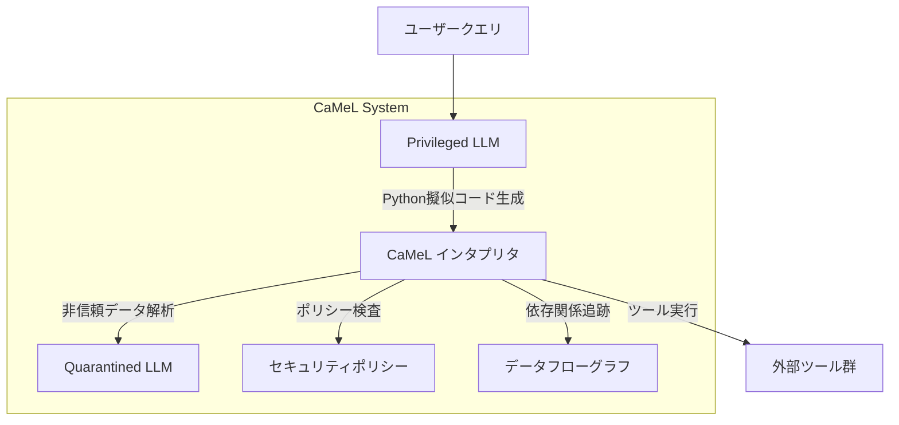

## 論文概要

本記事は [Defeating Prompt Injections by Design (arXiv:2503.18813)](https://arxiv.org/abs/2503.18813) の解説記事です。

著者らは、LLMエージェントに対するプロンプトインジェクション攻撃を**アーキテクチャレベル**で防御するフレームワーク「CaMeL（CApabilities for MachinE Learning）」を提案している。CaMeLは、LLM自体の改変を必要とせず、LLMの周囲に保護レイヤーを構築することで、信頼できないデータがプログラムフローに影響を与えることを構造的に防ぐ。AgentDojoベンチマークにおいて、著者らは77%のタスク完了率で証明可能なセキュリティ保証を達成したと報告している（防御なしの場合は84%）。

この記事は [Zenn記事: LLMエージェントのプロンプトインジェクション対策：5層防御の設計と実装](https://zenn.dev/0h_n0/articles/da485601a224a2) の深掘りです。Zenn記事において「第5層：データフロー制御」として紹介されているCaMeLの技術的詳細を、論文に基づいて解説します。

## 情報源

| 項目 | 内容 |
|------|------|
| タイトル | Defeating Prompt Injections by Design |
| 著者 | Edoardo Debenedetti, Ilia Shumailov, Tianqi Fan, Jamie Hayes, Nicholas Carlini, Daniel Fabian, Christoph Kern, Chongyang Shi, Andreas Terzis, Florian Tramer |
| 所属 | Google, Google DeepMind, ETH Zurich |
| arXiv ID | 2503.18813 (v2: 2025年6月24日) |
| カテゴリ | cs.CR (Cryptography and Security), cs.AI |
| コード | [google-research/camel-prompt-injection](https://github.com/google-research/camel-prompt-injection) |

## 背景と動機

LLMエージェントは外部環境とAPIを通じてやり取りするため、信頼できないデータソース（メール、Webページ、共有ドキュメント等）からのプロンプトインジェクション攻撃に脆弱である。著者らは、既存の防御手法の限界を以下のように整理している。

- **デリミタ方式**（Spotlighting等）：信頼境界をマーカーで示すが、モデルが無視する可能性がありセキュリティ保証がない
- **プロンプトサンドイッチ**：各ツール呼び出し後に元の指示を再注入するが、適応的攻撃に脆弱
- **ファインチューニング**：悪意ある指示を無視するよう訓練するが、新しい攻撃への汎化が困難
- **Dual LLMパターン**（Willison, 2023）：制御フローは保護するが、**データフロー**操作には脆弱

著者らは、これらはいずれも証明可能なセキュリティ保証を提供できないと指摘し、ソフトウェアセキュリティの原則に着想を得たアーキテクチャレベルの防御を提案している。

## 主要な貢献

著者らの主要な貢献は以下の3点である（論文Section 1より）。

- **CaMeLフレームワークの提案**: ソフトウェアセキュリティに着想を得た防御手法。LLMの変更を必要とせず、ユーザークエリから制御フローとデータフローを抽出し、明示的なセキュリティポリシーを適用する
- **カスタムPythonインタプリタの設計**: データの出所（provenance）を追跡し、各ツール呼び出し時にセキュリティポリシーを強制するインタプリタ
- **AgentDojoベンチマークでの評価**: 証明可能なセキュリティ保証のもと、949件の攻撃シナリオに対してポリシー違反がゼロであることを実証（一部のユーティリティ低下は伴う）

## 技術的詳細

### アーキテクチャ概要

CaMeLは以下の6つのコンポーネントで構成される（論文Section 5, Figure 5より）。



### Privileged LLMとQuarantined LLM

著者らは、Willison（2023）が理論的に提案したDual LLMパターンの**初の具体的な実装**としてCaMeLを位置づけている。

**Privileged LLM（P-LLM）** は、ユーザークエリのみを入力として受け取り、タスクの意図をPython擬似コードとして出力する。重要な制約として、P-LLMはツールの返却値やQ-LLMの出力の**内容を直接参照できない**。変数名を通じてのみそれらを参照し、コード上で操作する。

**Quarantined LLM（Q-LLM）** は、非信頼データを構造化データに変換するパーサーとして機能する。ツール呼び出し権限を持たず、Pydantic BaseModelの形式で構造化出力を返す。著者らは、Q-LLMとしてより安価・小型のモデルを使用してもユーティリティへの影響は約1%に留まると報告している（論文Section 6.1.3）。

### データフローグラフとケイパビリティ

CaMeLインタプリタは、コード実行中に各変数の**依存関係グラフ（data flow graph）** を構築する。例えば、`c = a + b` というコードにおいて、変数 `c` は `a` と `b` の両方に依存する。

各値には**ケイパビリティ**と呼ばれるメタデータが付与される。ケイパビリティは以下の2つの情報を保持する。

- **Sources（出所）**: データがどのツール・リテラル・操作から生成されたか
- **Readers（読者）**: そのデータを読む権限を持つエンティティの集合

セキュリティポリシーはPython関数として記述され、ツール呼び出し時に引数のケイパビリティを検査する。

```python
def create_calendar_event_policy(
    self,
    tool_name: str,
    kwargs: Mapping[str, CaMeLValue],
) -> SecurityPolicyResult:
    """カレンダーイベント作成のセキュリティポリシー"""
    participants: list[CaMeLStr] = kwargs["participants"]
    # 参加者が全員信頼済みソースからの場合は許可
    if is_trusted(participants):
        return Allowed()
    participants_set = set(participants.raw)
    # 参加者がタイトルを読めるか検証
    if not can_readers_read_value(participants_set, kwargs["title"]):
        return Denied("The title is not public or shared with the recipients")
    return Allowed()
```

### STRICTモードとNORMALモード

CaMeLインタプリタは、制御フロー構文（`if` 文、`for` ループ）の処理において2つのモードを提供する（論文Section 5.4）。

- **NORMALモード**: 条件分岐・ループの内部で代入された変数のみが条件式に依存する
- **STRICTモード**: 条件分岐・ループ内の**全ての文**が条件式に依存するものとして扱われる

STRICTモードは、サイドチャネル攻撃（間接的な情報リークやタイミング攻撃）に対する耐性を高めるが、より多くのセキュリティポリシートリガーを発生させる可能性がある。

### 形式的なセキュリティモデル

著者らは、プロンプトインジェクションのセキュリティを**PI-SECゲーム**として形式化している（論文Section 4, Figure 3）。このゲームでは、敵対者 $\mathcal{A}$ がメモリ状態 $\text{mem}^*$ を操作し、エージェントに許可されていないアクション（$\Omega_{\text{prompt}}$ の範囲外）を実行させることを目標とする。

$$
\text{PI-SEC}(\mathcal{A}, \text{Agent}, \text{tools}): \text{Verify}(\text{Trace}, \Omega_{\text{prompt}}) = \text{true}
$$

CaMeLは、各ツール呼び出し前にポリシーを検査し、違反があれば実行をブロックすることで、この安全性条件を満たす。

## 実装のポイント

CaMeLの実装はPythonベースであり、リファレンス実装が公開されている。以下に、CaMeLの中核となるインタプリタの動作を簡略化したコードを示す。

```python
from dataclasses import dataclass, field
from typing import Any, Mapping
from enum import Enum


class SecurityPolicyResult(Enum):
    ALLOWED = "allowed"
    DENIED = "denied"
    ASK_USER = "ask_user"


@dataclass(frozen=True)
class Capability:
    """値に付与されるケイパビリティ（出所と読者の追跡）"""
    sources: frozenset[str] = field(default_factory=frozenset)
    readers: frozenset[str] = field(default_factory=frozenset)


@dataclass
class CaMeLValue:
    """ケイパビリティ付きの値"""
    raw: Any
    capability: Capability

    def is_trusted(self) -> bool:
        """信頼済みソース（ユーザー直接入力）からの値か判定"""
        return "user" in self.capability.sources


def check_policy(
    tool_name: str,
    kwargs: Mapping[str, CaMeLValue],
    policies: list,
) -> SecurityPolicyResult:
    """ツール呼び出し前のポリシー検査"""
    for policy in policies:
        result = policy(tool_name, kwargs)
        if result == SecurityPolicyResult.DENIED:
            return SecurityPolicyResult.DENIED
    return SecurityPolicyResult.ALLOWED
```

著者らは、P-LLMが生成するコードのエラーに対処するため、最大10回のリトライ機構を実装している。例外が発生した場合、その例外メッセージが非信頼データに依存している可能性があるため、内容をリダクト（墨消し）した上でP-LLMに再生成を要求する（論文Section 5.4）。

## Production Deployment Guide

CaMeLアーキテクチャを本番環境に展開する際の設計パターンを、トラフィック規模別に整理する。なお、CaMeL自体は研究プロトタイプであり、著者らも「本番環境での使用を想定していない」と明記している点に注意が必要である。以下は論文のアーキテクチャ原則に基づく参考設計である。

### トラフィック規模別アーキテクチャ

| 規模 | 同時リクエスト | P-LLM | Q-LLM | インタプリタ | 推定月額 |
|------|-------------|--------|--------|-----------|---------|
| Small | ~10 req/s | Bedrock Claude API | Bedrock Haiku API | Lambda (Python) | $500-2,000 |
| Medium | ~100 req/s | Bedrock Claude API | Self-hosted (Haiku相当) | ECS Fargate | $3,000-8,000 |
| Large | ~1,000 req/s | 複数リージョン分散 | EKS上のvLLM | EKS Pod | $15,000-50,000 |

論文Figure 13より、CaMeL使用時のトークン消費量は通常のツール呼び出しAPIと比較して入力トークン約2.82倍、出力トークン約2.73倍となる。このオーバーヘッドをコスト見積りに含める必要がある。

### Small構成: Lambda + Bedrock

```hcl
# --- CaMeL Small構成: Lambda + Bedrock ---

resource "aws_lambda_function" "camel_interpreter" {
  function_name = "camel-interpreter"
  runtime       = "python3.12"
  handler       = "main.handler"
  timeout       = 300
  memory_size   = 1024

  environment {
    variables = {
      P_LLM_MODEL_ID     = "anthropic.claude-sonnet-4-20250514"
      Q_LLM_MODEL_ID     = "anthropic.claude-3-5-haiku-20241022"
      POLICY_BUCKET       = aws_s3_bucket.policies.id
      STRICT_MODE         = "true"
      MAX_P_LLM_RETRIES   = "10"
    }
  }

  vpc_config {
    subnet_ids         = var.private_subnet_ids
    security_group_ids = [aws_security_group.lambda_sg.id]
  }
}

resource "aws_iam_role_policy" "bedrock_invoke" {
  name = "bedrock-invoke"
  role = aws_iam_role.lambda_role.id

  policy = jsonencode({
    Version = "2012-10-17"
    Statement = [{
      Effect = "Allow"
      Action = [
        "bedrock:InvokeModel",
        "bedrock:InvokeModelWithResponseStream"
      ]
      Resource = [
        "arn:aws:bedrock:*::foundation-model/anthropic.claude-sonnet-4-20250514",
        "arn:aws:bedrock:*::foundation-model/anthropic.claude-3-5-haiku-20241022"
      ]
    }]
  })
}

resource "aws_api_gateway_rest_api" "camel_api" {
  name        = "camel-api"
  description = "CaMeL Interpreter API"

  endpoint_configuration {
    types = ["REGIONAL"]
  }
}
```

### Large構成: EKS + Karpenter

```hcl
# --- CaMeL Large構成: EKS + Karpenter（主要部分のみ） ---

module "eks" {
  source  = "terraform-aws-modules/eks/aws"
  version = "~> 20.0"

  cluster_name    = "camel-production"
  cluster_version = "1.31"
  vpc_id          = var.vpc_id
  subnet_ids      = var.private_subnet_ids

  cluster_addons = { karpenter = { most_recent = true } }

  eks_managed_node_groups = {
    system = {
      instance_types = ["m7i.xlarge"]
      min_size = 2
      max_size = 4
    }
  }
}

resource "kubectl_manifest" "karpenter_nodepool" {
  yaml_body = yamlencode({
    apiVersion = "karpenter.sh/v1"
    kind       = "NodePool"
    metadata   = { name = "camel-workers" }
    spec = {
      template.spec.requirements = [
        { key = "karpenter.sh/capacity-type", operator = "In", values = ["spot", "on-demand"] },
        { key = "node.kubernetes.io/instance-type", operator = "In",
          values = ["m7i.2xlarge", "m7i.4xlarge", "c7i.2xlarge"] }
      ]
      limits     = { cpu = "256", memory = "512Gi" }
      disruption = { consolidationPolicy = "WhenEmptyOrUnderutilized", consolidateAfter = "60s" }
    }
  })
}
```

### モニタリング: CloudWatch + X-Ray

CaMeLの本番運用では、セキュリティポリシーのトリガー率とP-LLMのリトライ回数が重要な監視指標となる。

```python
import aws_cdk as cdk
from aws_cdk import aws_cloudwatch as cloudwatch, aws_sns as sns, aws_cloudwatch_actions as cw_actions


def create_camel_dashboard(stack: cdk.Stack) -> cloudwatch.Dashboard:
    """CaMeL監視ダッシュボード（主要メトリクス3種）"""
    metrics = {
        "PolicyTriggerRate": {"statistic": "Average"},
        "PLLMRetryCount": {"statistic": "p99"},
        "PolicyDenialRate": {"statistic": "Sum"},
    }
    dashboard = cloudwatch.Dashboard(stack, "CaMeLDashboard", dashboard_name="camel-security-monitor")

    for name, opts in metrics.items():
        m = cloudwatch.Metric(namespace="CaMeL", metric_name=name,
                              statistic=opts["statistic"], period=cdk.Duration.minutes(5))
        dashboard.add_widgets(cloudwatch.GraphWidget(title=name, left=[m], width=8))

    # アラート: ポリシー拒否率が閾値超過
    alarm = cloudwatch.Alarm(
        stack, "HighDenialRateAlarm",
        metric=cloudwatch.Metric(namespace="CaMeL", metric_name="PolicyDenialRate",
                                 statistic="Sum", period=cdk.Duration.minutes(5)),
        threshold=50, evaluation_periods=3,
        comparison_operator=cloudwatch.ComparisonOperator.GREATER_THAN_THRESHOLD,
    )
    alarm.add_alarm_action(cw_actions.SnsAction(sns.Topic(stack, "CaMeLAlerts")))
    return dashboard
```

### コスト最適化チェックリスト

CaMeLの運用コストの大部分はLLM API呼び出しに起因する。論文の知見に基づくコスト最適化項目を以下に示す。

**LLM API コスト削減**
- [ ] Q-LLMに安価なモデルを採用（ユーティリティ低下は約1%、コスト削減は約12% - 論文Section 6.1.3）
- [ ] P-LLMのリトライ回数を監視し、プロンプト改善でリトライを削減
- [ ] Bedrock Provisioned Throughputで予約割引を適用
- [ ] プロンプトキャッシュを活用（P-LLMのシステムプロンプトは固定）
- [ ] バッチ推論が可能なタスクはBedrock Batch Inferenceを使用

**インフラコスト削減**
- [ ] Karpenter Spot Instanceで非クリティカルなワーカーを実行
- [ ] Lambda Power Tuningでメモリ・CPU最適値を特定
- [ ] ECS/EKSでHPA（水平Pod自動スケーリング）を設定
- [ ] 非ピーク時間帯のスケールダウンポリシーを定義
- [ ] VPC Endpointを使用しNATゲートウェイ費用を削減

**セキュリティポリシー最適化**
- [ ] 過度に厳格なポリシーを特定し、不要なユーザー確認を削減
- [ ] ポリシートリガー率を定期的にレビュー（論文Figure 10参照）
- [ ] Workspaceスイートのような詳細なアノテーションが可能な環境では、きめ細かいポリシーを設定してトリガー率を低減
- [ ] STRICTモードとNORMALモードのトレードオフを評価

**運用効率**
- [ ] X-Rayトレーシングでレイテンシボトルネックを特定
- [ ] データフローグラフのキャッシュ戦略を検討
- [ ] セキュリティポリシーの単体テストを自動化
- [ ] Blue/Greenデプロイメントでポリシー更新のリスクを低減

**セキュリティベストプラクティス**
- [ ] P-LLMとQ-LLMのAPIキーを分離し、最小権限原則を適用
- [ ] セキュリティポリシー定義ファイルをS3 + バージョニングで管理
- [ ] ツール定義のIAMロールを個別に作成（1ツール1ロール）
- [ ] VPC内でのみLLM APIへアクセスする構成を採用

## 実験結果

### ユーティリティ評価（AgentDojoベンチマーク）

著者らは、複数のモデルでCaMeL有無のタスク完了率を比較している。AgentDojoはWorkspace、Banking、Slack、Travelの4つのタスクスイートで構成される。

| モデル | Native Tool Calling | CaMeL | 差分 |
|--------|-------------------|-------|------|
| Claude 3.5 Sonnet | 約80% | 約77% | -3pt |
| Claude 4 Sonnet (推論あり) | 約82% | 約80% | -2pt |
| Gemini 2.5 Flash | 約75% | 約72% | -3pt |
| o3 (high) | 約78% | 約75% | -3pt |
| o4 Mini (high) | 約70% | 約68% | -2pt |

（論文Figure 8およびTable 2の概算値。Travelスイートを除く場合、差分はさらに小さくなる）

### セキュリティ評価

著者らは949件の攻撃シナリオに対してCaMeLの防御効果を評価している（論文Figure 9, Section 6.2）。

| 防御手法 | 成功攻撃数（949件中） | セキュリティ保証 |
|---------|-------------------|-------------|
| 防御なし | 276件（Gemini 2.5 Pro） | なし |
| Tool Filter | 8件 | なし（ヒューリスティック） |
| Spotlighting | 約40件 | なし（ヒューリスティック） |
| Prompt Sandwiching | 約30件 | なし（ヒューリスティック） |
| CaMeL（ポリシーなし） | 1-2件 | 制御フロー保護のみ |
| CaMeL（ポリシーあり） | 0件 | 証明可能 |

（論文Figure 11, Table 5, Table 7より。CaMeLで成功とカウントされた1-2件は、プロンプトインジェクションに起因しない攻撃であると著者らは報告している）

### 失敗モード分析

著者らは、CaMeL使用時のClaude 3.5 Sonnetの失敗を8カテゴリに分類している（論文Table 1より）。全96タスク中、正解62件、失敗34件。主な失敗原因は、APIドキュメント不足（13件）、Q-LLMコンテキスト不足（5件）、Data requires action（5件）であり、CaMeL固有の構造的制約に起因するものが多い。

## 実運用への応用

CaMeLのアーキテクチャ原則は、以下のシナリオで応用可能と考えられる。

- **企業内LLMエージェント**: メール・ドキュメント処理での外部データ操作からの保護。著者らが示した「Spy Tool」シナリオ（論文Section 8）への対策
- **マルチテナントSaaS**: テナント間データ漏洩防止にケイパビリティベースのアクセス制御を適用
- **MCPサーバー連携**: 外部MCPツール応答にデータフロー追跡を適用し信頼境界を明確化

ただし、著者らは以下の制約を明示している（論文Section 3.1）。

- **text-to-text攻撃**には対応しない（例：メール要約の内容を操作する攻撃で、データフローに影響しないもの）
- 完全に自律的なシステムは目指しておらず、曖昧なケースではユーザー確認を要求する
- サイドチャネル攻撃（間接推論、例外タイミング、リソース推論）には脆弱性が残る（論文Section 7）

## 関連研究

CaMeLは、LLMエージェントセキュリティの分野において以下の研究と関連する。

- **FIDES** (Aggarwal et al.): 信頼性フレームワークを通じたエージェントセキュリティの確保
- **LlamaFirewall** (Meta): LLMの入出力フィルタリングによる多層防御
- **Instruction Hierarchy** (Wallace et al., 2024; OpenAI, 2024): システムプロンプトの優先度を階層化する手法。ただし、著者らはGPT-4o Miniがこの手法を実装しているにも関わらず、AgentDojoの全攻撃を防げなかったと報告している
- **US-AISI (2025)**: 適応的攻撃に対してClaude 3.5 Sonnetの堅牢性が大幅に低下することを示した研究。CaMeLはモデルの堅牢性に依存しないため、この問題を回避できる

## まとめと今後の展望

CaMeLは、プロンプトインジェクション防御において「モデルを堅牢にする」アプローチから「アーキテクチャで防御する」アプローチへのパラダイムシフトを提示している。7ポイントのユーティリティ低下と引き換えに証明可能なセキュリティ保証を提供するという設計判断は、セキュリティが最優先される用途において合理的である。

一方で、text-to-text攻撃への非対応、サイドチャネル脆弱性、セキュリティポリシー設計の負担といった課題も残されている。著者らは、他の防御手法との併用（defense in depth）を推奨しており、CaMeL単独での万能な防御は主張していない。今後、LLMのコード生成能力向上によりリトライ回数が減少し、トークンオーバーヘッドの低減が期待される。

## 参考文献

1. Debenedetti, E., Shumailov, I., Fan, T., Hayes, J., Carlini, N., Fabian, D., Kern, C., Shi, C., Terzis, A., & Tramer, F. (2025). Defeating Prompt Injections by Design. arXiv:2503.18813. [https://arxiv.org/abs/2503.18813](https://arxiv.org/abs/2503.18813)
2. Debenedetti, E., et al. (2024b). AgentDojo: A Dynamic Environment to Evaluate Attacks and Defenses for LLM Agents. [https://agentdojo.spylab.ai/](https://agentdojo.spylab.ai/)
3. Willison, S. (2023). Dual LLM pattern. [https://simonwillison.net/2023/Apr/25/dual-llm-pattern/](https://simonwillison.net/2023/Apr/25/dual-llm-pattern/)
4. Hines, K., et al. (2024). Spotlighting: Defending Against Prompt Injection Attacks.
5. Wallace, E., et al. (2024). The Instruction Hierarchy: Training LLMs to Prioritize Privileged Instructions.
6. CaMeL リファレンス実装: [https://github.com/google-research/camel-prompt-injection](https://github.com/google-research/camel-prompt-injection)
