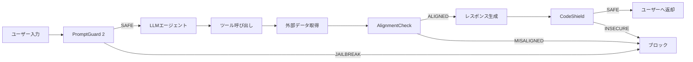
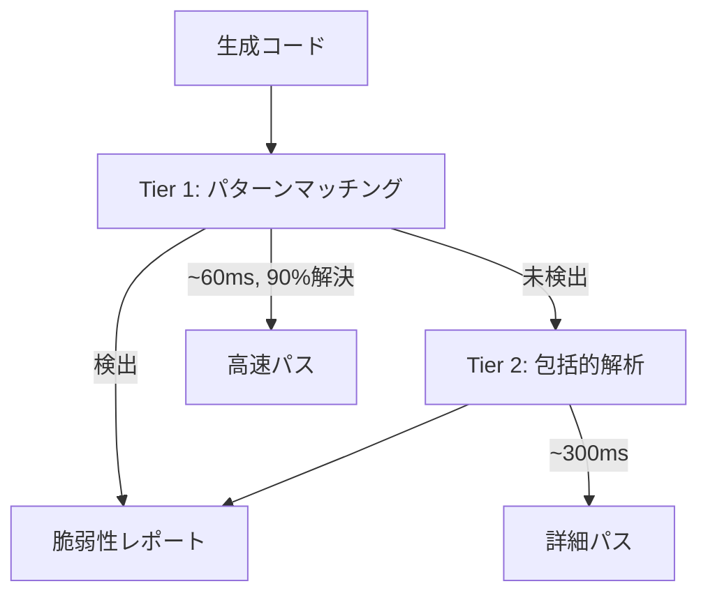
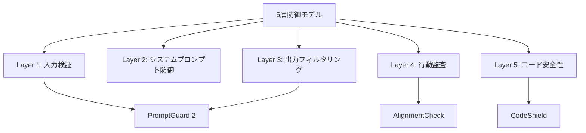

## 論文概要

本記事は [LlamaFirewall: An open source guardrail system for building secure AI agents (arXiv:2505.03574)](https://arxiv.org/abs/2505.03574) の解説記事です。

Chennabasappa et al. (2025) は、LLMエージェントに対するプロンプトインジェクション・間接的なプロンプトインジェクション・安全でないコード生成という3つの脅威に対処するオープンソースのガードレールフレームワーク「LlamaFirewall」を提案している。本システムは、軽量な入力分類器PromptGuard 2、LLMベースの行動監査器AlignmentCheck、静的解析エンジンCodeShieldの3コンポーネントを統合し、AgentDojoベンチマークにおいてAttack Success Rate（ASR）を17.6%から1.75%へ低減させたと報告している。各コンポーネントは独立に利用可能であり、SnortやSigmaのようなルールベースのセキュリティツールに倣ったモジュラー設計を採用している。

この記事は [Zenn記事: LLMエージェントのプロンプトインジェクション対策：5層防御の設計と実装](https://zenn.dev/0h_n0/articles/da485601a224a2) の深掘りです。

## 情報源

- **arXiv ID**: 2505.03574
- **URL**: [https://arxiv.org/abs/2505.03574](https://arxiv.org/abs/2505.03574)
- **著者**: Sahana Chennabasappa, Cyrus Nikolaidis, Daniel Song et al.（Meta、計19名）
- **発表年**: 2025年（arXiv投稿: 2025年5月6日）
- **分野**: cs.CR（暗号とセキュリティ）, cs.AI（人工知能）

## 背景と動機

LLMエージェントの産業応用が急速に拡大する中、エージェントが外部ツール（Web検索、コード実行、API呼び出し等）を通じて実世界に作用する能力を持つことで、セキュリティリスクは従来のLLMアプリケーションとは質的に異なるものとなっている。著者らは、エージェントの脅威を以下の3カテゴリに整理している。

1. **直接プロンプトインジェクション**: ユーザーが直接悪意のあるプロンプトを入力し、ジェイルブレイクを試みる
2. **間接プロンプトインジェクション**: 外部データソース（Webページ、ファイル、API応答等）に埋め込まれた悪意のある命令がエージェントの行動を乗っ取る
3. **安全でないコード生成**: LLMが生成したコードにSQLインジェクションやパストラバーサル等の脆弱性が含まれる

既存の防御手法は各脅威に個別対応する研究が多く、統合的なフレームワークとして実用に供されるものが不足していた。著者らは、ネットワークセキュリティにおけるSnort（IDS）やSigma（検知ルール）に相当する、AIエージェント向けの汎用的かつ拡張可能な防御基盤の必要性を主張している。

## 主要な貢献

- **3層統合フレームワーク**: PromptGuard 2（入力分類）、AlignmentCheck（行動監査）、CodeShield（コード解析）を統一的なインターフェースで提供するオープンソースフレームワークの設計と実装
- **PromptGuard 2の高性能化**: mDeBERTa-baseベースの86Mパラメータモデルで、多言語ジェイルブレイク検出においてAUC 0.98、Recall 97.5%（FPR 1%時）を達成。エネルギーベース損失関数と強化トークナイゼーションにより先行モデルを改善
- **AlignmentCheckによるエージェント行動監査**: LLMの推論能力を活用してエージェントの行動がユーザーの元の指示と整合しているかをChain-of-Thought形式で監査する手法を提案。Llama 4 Maverickを監査モデルとして用いた場合、Recall 80%以上・FPR 4%未満を達成
- **AgentDojoでの統合評価**: 3コンポーネントの組み合わせによりASRを17.6%から1.75%へ90%以上低減。ユーティリティ低下は47.7%から42.7%（5ポイント）に抑制

## 技術的詳細

### 全体アーキテクチャ

LlamaFirewallは、LLMエージェントの処理パイプラインに対して入力段・推論段・出力段の3箇所にガードレールを配置する設計である。各コンポーネントは独立にデプロイ可能であり、組み合わせることで多層防御を実現する。



### PromptGuard 2: 軽量ジェイルブレイク検出

PromptGuard 2は、入力テキストがジェイルブレイク（直接プロンプトインジェクション）またはインジェクション（間接プロンプトインジェクション）であるかを分類する軽量モデルである。著者らはmDeBERTa-base（86Mパラメータ）とDeBERTa-xsmall（22Mパラメータ）の2つのバリアントを提供している。

**エネルギーベース損失関数**: PromptGuard 2はOOD（Out-of-Distribution）検出にエネルギーベースの学習目標を導入している。入力 $\mathbf{x}$ に対するエネルギー関数は以下で定義される。

$$
E(\mathbf{x}) = -T \cdot \log \sum_{i=1}^{K} \exp\left(\frac{f_i(\mathbf{x})}{T}\right)
$$

ここで $f_i(\mathbf{x})$ は分類ヘッドの $i$ 番目のクラスに対するlogit出力、$K$ はクラス数、$T$ は温度パラメータである。学習時にはin-distribution（正常入力）のエネルギーを低く、OOD（攻撃入力）のエネルギーを高くするようにマージン損失を加える。これにより、学習時に見なかった新規の攻撃パターンに対しても頑健な検出が可能となると著者らは報告している。

**強化トークナイゼーション**: 攻撃者がトークナイザの挙動を悪用してフィルタを回避する手法（例: Unicode結合文字の挿入、不可視文字の混入）に対抗するため、正規化ステップをトークナイゼーション前に挿入している。

**性能指標**（論文Table 1, 2より）:

| モデル | パラメータ数 | AUC | Recall@1%FPR | レイテンシ |
|--------|------------|-----|-------------|-----------|
| PromptGuard 2 86M | 86M | 0.98 | 97.5% | 92.4ms |
| PromptGuard 2 22M | 22M | 0.995 | - | 19.3ms |

22Mバリアントは86Mバリアントよりもレイテンシが約5分の1であり、AUCも0.995と高い値を示している。ただし、著者らは22Mモデルの多言語対応能力が86Mモデルに比べて限定的である点を制約として挙げている。

### AlignmentCheck: Chain-of-Thought行動監査

AlignmentCheckは、エージェントがツール呼び出しやアクションを実行する前に、その行動がユーザーの元の指示と整合しているかをLLMで監査するコンポーネントである。間接プロンプトインジェクションによってエージェントの行動が乗っ取られるシナリオに対処する。

**監査プロセス**: AlignmentCheckは以下の3ステップで動作する。

1. **コンテキスト構築**: ユーザーの元のメッセージ、エージェントの行動履歴、次に実行しようとしているアクションを構造化テキストとして整理
2. **Chain-of-Thought推論**: 監査用LLM（Llama 4 Maverick等）が「このアクションはユーザーの元の指示に基づいているか」を段階的に推論
3. **判定出力**: ALIGNED（整合）またはMISALIGNED（不整合）の二値判定を返す

**トレードオフ**: AlignmentCheck単体でのAgentDojoベンチマーク結果は、ASRを17.6%から2.89%へ低減する一方、Utility（タスク達成率）も47.7%から43.1%へ低下している（論文Table 5より）。これは、正常なアクションの一部も保守的に不整合と判定されるためであり、FPR（偽陽性率）4%未満という制約下でのRecall 80%以上は、セキュリティとユーザビリティのバランスとして著者らは妥当と評価している。

**監査モデルの選択**:

| 監査モデル | ASR | Utility |
|-----------|-----|---------|
| Llama 3.3 70B | - | - |
| Llama 4 Maverick | 2.89% | 43.1% |

著者らはLlama 4 Maverickが最良の性能を示したと報告しているが、監査モデル自体が大規模であるため、推論コストとレイテンシのオーバーヘッドが生じる点は考慮が必要である。

### CodeShield: オンライン静的解析

CodeShieldは、LLMが生成したコードに含まれるセキュリティ脆弱性をリアルタイムで検出する静的解析エンジンである。8言語（Python、JavaScript、TypeScript、Java、C、C++、C#、Rust）に対応し、50以上のCWE（Common Weakness Enumeration）をカバーしている。

**2段階解析アーキテクチャ**:



- **Tier 1（パターンマッチング）**: 正規表現ベースの高速スキャン。約60msのレイテンシで脆弱性の90%を検出する
- **Tier 2（包括的解析）**: AST（抽象構文木）ベースの詳細解析。約300msのレイテンシで、Tier 1で見逃された脆弱性を検出する

**性能指標**（論文より）:

| 指標 | 値 |
|------|-----|
| Precision（適合率） | 96% |
| Recall（再現率） | 79% |
| レイテンシ（全体） | 70ms未満 |

Precision 96%は実運用において偽陽性による開発者体験の劣化を抑える上で重要な数値である。一方、Recall 79%は全脆弱性の21%を見逃す可能性があることを意味し、CodeShieldのみではセキュリティの完全な保証はできない点に注意が必要である。

## 実装のポイント

LlamaFirewallはPythonパッケージとして提供されており、各コンポーネントを個別に、または組み合わせて利用できる。以下は基本的な統合パターンの擬似コードである。

```python
from dataclasses import dataclass
from enum import Enum
from typing import Protocol


class Verdict(Enum):
    SAFE = "safe"
    UNSAFE = "unsafe"


@dataclass(frozen=True)
class ScanResult:
    verdict: Verdict
    component: str
    reason: str
    latency_ms: float


class GuardComponent(Protocol):
    """LlamaFirewallの各コンポーネントが実装するプロトコル"""

    def scan(self, text: str) -> ScanResult: ...


def run_firewall_pipeline(
    user_input: str,
    agent_action: str,
    generated_code: str | None,
    guards: list[GuardComponent],
) -> ScanResult:
    """全コンポーネントを直列に実行し、最初のUNSAFE判定で停止する"""
    for guard in guards:
        target = (
            user_input
            if guard.__class__.__name__ == "PromptGuard"
            else agent_action
            if guard.__class__.__name__ == "AlignmentCheck"
            else generated_code or ""
        )
        result = guard.scan(target)
        if result.verdict == Verdict.UNSAFE:
            return result
    return ScanResult(
        verdict=Verdict.SAFE,
        component="pipeline",
        reason="All checks passed",
        latency_ms=0.0,
    )
```

設計上のポイントとして、著者らはfail-closed（判定不能時はブロック）の原則を採用している。PromptGuard 2がタイムアウトした場合やAlignmentCheckの監査モデルが応答しない場合、リクエストは安全側に倒してブロックされる。これはネットワークファイアウォールのデフォルトDenyポリシーと同様の設計思想である。

## Production Deployment Guide

LlamaFirewallの3コンポーネントは計算リソース要件が大きく異なるため、デプロイ構成もコンポーネントごとに最適化する必要がある。PromptGuard 2（22M-86Mパラメータ）はCPUまたは小型GPUで動作可能であり、AlignmentCheck（70B-Maverick規模の監査モデル）はGPUクラスタまたはAPI経由での利用が現実的である。CodeShieldはCPUのみで動作する。

### AWS実装パターン

| 構成 | PromptGuard 2 | AlignmentCheck | CodeShield | 月額概算 |
|------|--------------|----------------|------------|---------|
| Small（~500 req/日） | Lambda + CPU | Bedrock API (Llama 3.3 70B) | Lambda + CPU | $100-300 |
| Medium（~5,000 req/日） | ECS Fargate (CPU) | Bedrock API (Llama 3.3 70B) | ECS Fargate (CPU) | $500-1,500 |
| Large（50,000+ req/日） | ECS on g5.xlarge | SageMaker Endpoint (Llama 4 Maverick) | ECS on CPU | $5,000-15,000 |

> **注意**: 上記コスト試算は2026年6月時点のAWS ap-northeast-1（東京）リージョン料金に基づく概算値です。実際のコストはトラフィックパターン、リージョン、バースト使用量により変動します。最新料金は[AWS料金計算ツール](https://calculator.aws/)で確認してください。

**Small構成の設計意図**: PromptGuard 2の22Mバリアント（19.3msレイテンシ）はLambdaのCPU環境でも実用的な応答速度を維持できる。AlignmentCheckは自前ホスティングのコストが高いため、BedrockのLlama 3.3 70B APIを利用する。CodeShieldは純粋なCPU処理であるためLambdaで十分である。

**Large構成の設計意図**: PromptGuard 2の86Mバリアント（92.4msレイテンシ）をGPU上で動作させることでレイテンシを削減する。AlignmentCheckはLlama 4 MaverickをSageMaker Endpointに専用デプロイし、安定したスループットを確保する。

### Terraformインフラコード

**Small構成（Serverless: Lambda + Bedrock）**

```hcl
# --- Small構成: LlamaFirewall on Lambda + Bedrock ---

terraform {
  required_version = ">= 1.9"
  required_providers {
    aws = { source = "hashicorp/aws", version = "~> 5.80" }
  }
}

provider "aws" {
  region = "ap-northeast-1"
}

# Lambda: PromptGuard 2 (22M) + CodeShield
resource "aws_lambda_function" "prompt_guard" {
  function_name = "llamafirewall-prompt-guard"
  runtime       = "python3.12"
  handler       = "prompt_guard.handler"
  role          = aws_iam_role.firewall_lambda_role.arn
  memory_size   = 1024
  timeout       = 15
  filename      = "prompt_guard_package.zip"

  environment {
    variables = {
      MODEL_VARIANT = "22M"
      THRESHOLD     = "0.5"
    }
  }

  tracing_config {
    mode = "Active"
  }
}

resource "aws_lambda_function" "code_shield" {
  function_name = "llamafirewall-code-shield"
  runtime       = "python3.12"
  handler       = "code_shield.handler"
  role          = aws_iam_role.firewall_lambda_role.arn
  memory_size   = 512
  timeout       = 10
  filename      = "code_shield_package.zip"

  tracing_config {
    mode = "Active"
  }
}

# Lambda: AlignmentCheck (Bedrock API経由)
resource "aws_lambda_function" "alignment_check" {
  function_name = "llamafirewall-alignment-check"
  runtime       = "python3.12"
  handler       = "alignment_check.handler"
  role          = aws_iam_role.firewall_lambda_role.arn
  memory_size   = 256
  timeout       = 60
  filename      = "alignment_check_package.zip"

  environment {
    variables = {
      BEDROCK_MODEL_ID = "meta.llama3-3-70b-instruct-v1:0"
    }
  }

  tracing_config {
    mode = "Active"
  }
}

# IAMロール（最小権限）
resource "aws_iam_role" "firewall_lambda_role" {
  name = "llamafirewall-lambda-role"
  assume_role_policy = jsonencode({
    Version = "2012-10-17"
    Statement = [{
      Action    = "sts:AssumeRole"
      Effect    = "Allow"
      Principal = { Service = "lambda.amazonaws.com" }
    }]
  })
}

resource "aws_iam_role_policy" "firewall_policy" {
  name = "llamafirewall-policy"
  role = aws_iam_role.firewall_lambda_role.id
  policy = jsonencode({
    Version = "2012-10-17"
    Statement = [
      {
        Effect   = "Allow"
        Action   = ["bedrock:InvokeModel"]
        Resource = "arn:aws:bedrock:ap-northeast-1::foundation-model/meta.llama3-3-70b-instruct-v1:0"
      },
      {
        Effect   = "Allow"
        Action   = ["logs:CreateLogGroup", "logs:CreateLogStream", "logs:PutLogEvents"]
        Resource = "arn:aws:logs:ap-northeast-1:*:*"
      }
    ]
  })
}

# CloudWatchアラーム: ブロック率異常検知
resource "aws_cloudwatch_metric_alarm" "high_block_rate" {
  alarm_name          = "llamafirewall-high-block-rate"
  comparison_operator = "GreaterThanThreshold"
  evaluation_periods  = 3
  metric_name         = "BlockedRequests"
  namespace           = "LlamaFirewall"
  period              = 300
  statistic           = "Sum"
  threshold           = 50
  alarm_description   = "Block rate exceeds threshold - possible attack"

  dimensions = {
    Component = "PromptGuard2"
  }
}
```

**Large構成（Container: ECS + SageMaker）**

```hcl
# --- Large構成: ECS + SageMaker Endpoint ---

module "ecs_cluster" {
  source  = "terraform-aws-modules/ecs/aws"
  version = "~> 5.11"

  cluster_name = "llamafirewall-cluster"

  cluster_configuration = {
    execute_command_configuration = {
      logging = "OVERRIDE"
      log_configuration = {
        cloud_watch_log_group_name = "/ecs/llamafirewall"
      }
    }
  }
}

# SageMaker Endpoint: AlignmentCheck用 Llama 4 Maverick
resource "aws_sagemaker_endpoint" "alignment_check" {
  name                 = "llamafirewall-alignment-check"
  endpoint_config_name = aws_sagemaker_endpoint_configuration.alignment_check.name
}

resource "aws_sagemaker_endpoint_configuration" "alignment_check" {
  name = "llamafirewall-alignment-check-config"

  production_variants {
    variant_name           = "primary"
    model_name             = aws_sagemaker_model.llama4_maverick.name
    initial_instance_count = 1
    instance_type          = "ml.g5.48xlarge"
  }
}

# AWS Budgets: 月次予算アラート
resource "aws_budgets_budget" "monthly" {
  name         = "llamafirewall-monthly"
  budget_type  = "COST"
  limit_amount = "15000"
  limit_unit   = "USD"
  time_unit    = "MONTHLY"

  notification {
    comparison_operator       = "GREATER_THAN"
    threshold                 = 80
    threshold_type            = "PERCENTAGE"
    notification_type         = "FORECASTED"
    subscriber_email_addresses = ["alerts@example.com"]
  }
}
```

### 運用・監視設定

**CloudWatch カスタムメトリクス（Python）**

```python
import boto3
from datetime import datetime, timezone


cloudwatch = boto3.client("cloudwatch", region_name="ap-northeast-1")


def publish_firewall_metrics(
    component: str,
    verdict: str,
    latency_ms: float,
) -> None:
    """LlamaFirewallのコンポーネント別メトリクスをCloudWatchに送信"""
    cloudwatch.put_metric_data(
        Namespace="LlamaFirewall",
        MetricData=[
            {
                "MetricName": "BlockedRequests" if verdict == "unsafe" else "PassedRequests",
                "Dimensions": [{"Name": "Component", "Value": component}],
                "Value": 1,
                "Unit": "Count",
                "Timestamp": datetime.now(tz=timezone.utc),
            },
            {
                "MetricName": "Latency",
                "Dimensions": [{"Name": "Component", "Value": component}],
                "Value": latency_ms,
                "Unit": "Milliseconds",
                "Timestamp": datetime.now(tz=timezone.utc),
            },
        ],
    )
```

**CloudWatch Logs Insights: 攻撃パターン分析**

```
fields @timestamp, component, verdict, reason
| filter verdict = "unsafe"
| stats count() as blocked_count by component, bin(1h)
| sort blocked_count desc
```

### コスト最適化チェックリスト

**アーキテクチャ選択**
- [ ] トラフィック量に基づく構成選定（~500/日: Serverless、~5000/日: Hybrid、50000+/日: Container）
- [ ] PromptGuard 2のバリアント選択: 多言語不要なら22M（19.3ms）、必要なら86M（92.4ms）
- [ ] AlignmentCheck: 全リクエストに適用するか、PromptGuard 2がSAFE判定したもののみに適用するか決定

**リソース最適化**
- [ ] PromptGuard 2: CPU推論で十分か、GPU推論が必要かを負荷テストで判定
- [ ] AlignmentCheck: Bedrock API利用（Small/Medium）vs SageMaker専用Endpoint（Large）
- [ ] CodeShield: CPU専用のためGPUインスタンスを割り当てない
- [ ] Lambda: PromptGuard 2用は1024MB（モデルロード要件）、CodeShield用は512MBに最適化
- [ ] Spot Instances: GPU推論ノードをSpot優先（最大70%削減）

**LLMコスト削減**
- [ ] AlignmentCheckの監査モデル選択: Llama 3.3 70B（低コスト）vs Llama 4 Maverick（高精度）
- [ ] リスクベースの段階適用: 低リスクリクエストはPromptGuard 2のみ、高リスクはAlignmentCheckも適用
- [ ] レスポンスキャッシュ: 同一入力パターンへのPromptGuard 2判定結果をキャッシュ
- [ ] Bedrock Batch API: 非リアルタイム処理にはBatch推論（50%コスト削減）

**監視・アラート**
- [ ] AWS Budgets: 月次予算アラート（予測80%で通知）
- [ ] CloudWatch: コンポーネント別レイテンシ・ブロック率の監視
- [ ] Cost Anomaly Detection: AlignmentCheckのBedrock API呼び出しスパイク検知
- [ ] ブロック率ダッシュボード: コンポーネント別・時間帯別のブロック傾向を可視化

**セキュリティ**
- [ ] IAMロール: 各Lambda/ECSタスクに最小権限（Bedrock InvokeModelのみ等）
- [ ] VPCエンドポイント: Bedrock/SageMaker通信をVPC内に閉じる
- [ ] Secrets Manager: モデル設定・閾値をSecrets Managerで管理
- [ ] CloudTrail: 全Bedrock API呼び出しの監査ログ有効化
- [ ] WAF: API Gateway前段にWAFを配置し、DDoS対策
- [ ] 暗号化: S3バケット/CloudWatchログのKMS暗号化

**リソース管理**
- [ ] タグ戦略: Component/Environment/CostCenterタグ必須
- [ ] 未使用SageMaker Endpoint削除（Maverickモデルの固定費は月$3,000以上）
- [ ] 開発環境: AlignmentCheckをモック化してBedrock API呼び出しを回避
- [ ] S3ライフサイクル: 監査ログ90日でGlacier移行

## 実験結果

### AgentDojoベンチマーク

AgentDojoは、LLMエージェントに対するツール利用タスクとインジェクション攻撃を組み合わせたベンチマークである。著者らはこのベンチマークを用いて各コンポーネント単体および組み合わせの効果を評価している（論文Table 5より）。

| 構成 | ASR（攻撃成功率） | Utility（タスク達成率） | ASR削減率 |
|------|-----------------|----------------------|----------|
| ベースライン（防御なし） | 17.6% | 47.7% | - |
| PromptGuard 2 のみ | 7.5% | 47.0% | 57% |
| AlignmentCheck のみ | 2.89% | 43.1% | 84% |
| PromptGuard 2 + AlignmentCheck | 1.75% | 42.7% | 90%以上 |

この結果から以下の傾向が読み取れる。

1. **コンポーネントの相補性**: PromptGuard 2は直接入力段階での攻撃を57%削減し、AlignmentCheckは推論段階での行動乗っ取りを84%削減する。両者を組み合わせることで90%以上のASR削減を達成しており、各コンポーネントが異なる攻撃ベクトルに対処していることが確認できる
2. **Utilityへの影響は限定的**: PromptGuard 2単体ではUtilityの低下は0.7ポイント（47.7%→47.0%）にとどまる。AlignmentCheckの追加によりUtilityは4.6ポイント低下するが、ASRの大幅削減を考慮すると許容範囲と著者らは評価している
3. **残存リスク**: ASR 1.75%は約57回に1回の攻撃が成功することを意味する。完全な防御ではなく、リスク低減ツールとして位置づけるべきである

### PromptGuard 2の検出性能

PromptGuard 2の86Mバリアントは、FPR 1%の制約下でRecall 97.5%を達成している（論文Table 1より）。これは100件の攻撃のうち97.5件を検出し、正常入力100件中1件のみを誤検出する性能である。レイテンシは92.4msであり、リアルタイムアプリケーションでの利用に支障のない水準であると著者らは報告している。

## 実運用への応用

### Zenn記事との関連

関連Zenn記事「LLMエージェントのプロンプトインジェクション対策：5層防御の設計と実装」では、LlamaFirewallを「防御フレームワークの推奨起点」として紹介している。本論文の知見は、Zenn記事で提案されている5層防御モデルの具体的な実装基盤として位置づけられる。



PromptGuard 2はLayer 1（入力検証）とLayer 3（出力フィルタリング）の両方に適用可能であり、AlignmentCheckはLayer 4（行動監査）、CodeShieldはLayer 5（コード安全性）にそれぞれ対応する。Layer 2（システムプロンプト防御）はLlamaFirewallのスコープ外であり、アプリケーション側での実装が必要である。

実運用においては、全リクエストにPromptGuard 2を適用しつつ、高リスクなツール呼び出し（外部API、ファイル操作、コード実行等）に対してのみAlignmentCheckを適用するリスクベースの段階的防御が、コストとセキュリティのバランスとして現実的であると考えられる。

## 関連研究

- **Llama Guard (Inan et al., 2023)**: Metaが提案したLLM出力の安全性分類モデル。LlamaFirewallはLlama Guardと相補的であり、Llama Guardがコンテンツ安全性（有害性）を扱うのに対し、LlamaFirewallはセキュリティ脅威（攻撃検知・防御）に特化している
- **NeMo Guardrails (Rebedea et al., 2023)**: NVIDIAのLLMガードレールフレームワーク。Colangという独自言語で対話フローを定義するアプローチを採用しており、LlamaFirewallのモデルベース検知とは対照的なルールベースの手法である
- **Rebuff (2023)**: プロンプトインジェクション検出に特化したOSSツール。マルチレベル検知を行う点でLlamaFirewallと類似するが、エージェント行動監査やコード解析は含まれていない
- **AgentDojo (Debenedetti et al., 2024)**: LLMエージェントのセキュリティ評価ベンチマーク。LlamaFirewallの評価に使用されたベンチマークであり、ツール利用エージェントに対するインジェクション攻撃の体系的評価を可能にする

## まとめと今後の展望

LlamaFirewallは、LLMエージェントのセキュリティを3つの異なる観点（入力検知・行動監査・コード安全性）から多層的に防御するオープンソースフレームワークであり、AgentDojoベンチマークにおいてASRを90%以上削減することを実証している。モジュラー設計により各コンポーネントを独立にデプロイ・更新できる点は、産業環境での段階的な導入に適している。

一方で、AlignmentCheckの監査に大規模LLMを必要とするコスト・レイテンシ課題、PromptGuard 2の多言語対応の限界（特に22Mバリアント）、CodeShieldのRecall 79%（21%の脆弱性見逃し）は明確な制約である。著者らは今後の方向性として、より小型で高精度な監査モデルの開発、コミュニティ主導の検知ルール共有基盤の構築、マルチモーダル入力への対応を挙げている。LLMエージェントのセキュリティは発展途上の領域であり、LlamaFirewallのようなオープンソースフレームワークの成熟が産業応用の信頼性向上に直結すると考えられる。

## 参考文献

- **arXiv**: [https://arxiv.org/abs/2505.03574](https://arxiv.org/abs/2505.03574)
- **GitHub**: [https://github.com/meta-llama/LlamaFirewall](https://github.com/meta-llama/LlamaFirewall)
- **Related Zenn article**: [https://zenn.dev/0h_n0/articles/da485601a224a2](https://zenn.dev/0h_n0/articles/da485601a224a2)
