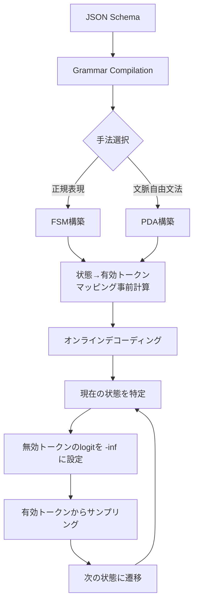

## 論文概要（Abstract）

本記事は [https://arxiv.org/abs/2501.10868](https://arxiv.org/abs/2501.10868) の解説記事です。

JSONSchemaBenchは、LLMの構造化出力（Structured Output）を体系的に評価するベンチマークである。著者らは10,000件の実世界JSONスキーマを収集し、効率（efficiency）・カバレッジ（coverage）・品質（quality）の3次元で制約付きデコーディングフレームワークを評価した。Guidance、Outlines、Llamacpp、XGrammar、OpenAI、Geminiの6フレームワークが対象で、制約付きデコーディングが非制約手法と比較して最大50%の生成高速化を達成する一方、複雑なスキーマへの対応にはフレームワーク間で大きな差があることが報告されている。

この記事は [Zenn記事: Vertex AI Gemini 3.1 Proの1Mコンテキストで契約書レビューの精度とコストを両立する](https://zenn.dev/0h_n0/articles/2d259d1c630072) の深掘りです。

## 情報源

- **arXiv ID**: 2501.10868
- **URL**: [https://arxiv.org/abs/2501.10868](https://arxiv.org/abs/2501.10868)
- **著者**: Saibo Geng, Hudson Cooper, Michal Moskal, et al.
- **発表年**: 2025年（v1: 2025年1月18日、v3: 2025年2月27日）
- **分野**: cs.CL, cs.AI
- **GitHub**: [https://github.com/guidance-ai/jsonschemabench](https://github.com/guidance-ai/jsonschemabench)

## 背景と動機（Background & Motivation）

LLMアプリケーションにおいて、モデル出力を特定の構造（JSON、XML等）に従わせることは実務上の重要課題である。API連携、データ抽出、関数呼び出し（Function Calling）など、下流タスクがJSON形式の入力を期待するケースは多い。しかし、LLMは本質的に自由形式のテキストを生成するため、スキーマ違反や型不一致が頻繁に発生する。

この課題に対し、**制約付きデコーディング（Constrained Decoding）** が主要な解決策として台頭した。デコーディング時にスキーマに違反するトークンをマスクすることで、100%のスキーマ準拠を保証する手法である。OpenAI、Google Geminiなど主要プロバイダも2024-2025年にかけてネイティブ対応を開始した。

しかし、著者らは既存の評価が限定的なスキーマセットに依存しており、フレームワーク間の公平な比較が困難であったと指摘している。スキーマ複雑さの増加に伴う挙動差を体系的に評価するベンチマークが存在しなかったため、JSONSchemaBenchが設計された。

## 主要な貢献（Key Contributions）

- **貢献1**: 10,000件の実世界JSONスキーマからなるベンチマーク「JSONSchemaBench」の構築。GlaiveAI（Function Calling用）、GitHub収集スキーマ（Easy/Medium/Hard）、Kubernetes API定義など10カテゴリで構成
- **貢献2**: 効率・カバレッジ・品質の3次元評価フレームワークの提案。カバレッジを宣言的（Declared）・経験的（Empirical）・真（True）の3段階で定義
- **貢献3**: 6つの主要フレームワーク（Guidance、Outlines、Llamacpp、XGrammar、OpenAI、Gemini）の包括的比較評価
- **貢献4**: MaskBenchの公開。トークンマスク計算のパフォーマンスに特化したサブベンチマーク

## 技術的詳細（Technical Details）

### 制約付きデコーディングの仕組み

制約付きデコーディングは、デコーディング時に無効なトークンをマスクする手法であり、オフラインフェーズとオンラインフェーズに分かれる。



**オフラインフェーズ**では、JSONスキーマを正規表現またはCFGに変換し、FSMまたはPDAを構築する。各状態から遷移可能な有効トークン集合を事前計算し、ビットマスクテーブルに格納する。

**オンラインフェーズ**では、各ステップで無効トークンのlogitを$-\infty$に設定し確率を0にする。

$$
p'(t_i \mid t_{<i}) = \begin{cases} 0 & \text{if } t_i \notin \mathcal{V}_{\text{valid}}(s_i) \\ \frac{p(t_i \mid t_{<i})}{\sum_{t_j \in \mathcal{V}_{\text{valid}}(s_i)} p(t_j \mid t_{<i})} & \text{otherwise} \end{cases}
$$

ここで、
- $t_i$: デコーディングステップ$i$で生成されるトークン
- $t_{<i}$: ステップ$i$より前に生成されたトークン列
- $s_i$: ステップ$i$におけるオートマトンの状態
- $\mathcal{V}_{\text{valid}}(s_i)$: 状態$s_i$で有効なトークンの集合
- $p(t_i \mid t_{<i})$: モデルが出力する元の条件付き確率
- $p'(t_i \mid t_{<i})$: マスク適用後の正規化された確率

### FSMベース vs CFGベースのアプローチ

**FSMベース（Outlines等）**はJSONスキーマを正規表現に変換し、有限状態機械を構築する。フラットなスキーマでは高速に動作するが、再帰的な構造（ネストされたオブジェクト等）を表現できないという制約がある。

**CFGベース（XGrammar、Guidance/llguidance等）**は文脈自由文法を用い、スタックを持つプッシュダウンオートマトン（PDA）を構築する。再帰構造をサポートでき、XGrammarではトークンを**文脈非依存（context-independent）**と**文脈依存（context-dependent）**に分割する最適化を導入している。著者らによると、語彙の約99%は文脈非依存トークンとして事前計算可能であり、実行時にスタック検査が必要な文脈依存トークンは約1%にとどまるとされる。

### 評価指標の定義

**カバレッジの3段階**:

1. **宣言的カバレッジ（Declared Coverage）**: フレームワークがスキーマをエラーなく処理できるかどうか
2. **経験的カバレッジ（Empirical Coverage）**: 実際に生成された出力がスキーマに準拠しているかどうか
3. **真のカバレッジ（True Coverage）**: 制約が JSON Schema仕様に正確に合致しているかどうか

**準拠率（Compliance Rate）**は、宣言的カバレッジと経験的カバレッジの比率として定義される。

$$
\text{Compliance Rate} = \frac{\text{Empirical Coverage}}{\text{Declared Coverage}}
$$

この指標は、フレームワークが「処理できる」と宣言したスキーマのうち、実際に正しい出力を生成できた割合を示す。値が1.0未満の場合、フレームワークがスキーマを受け入れたにもかかわらず不正な出力を生成していることを意味する。

**効率の3指標**:

- **Grammar Compilation Time（GCT）**: スキーマからオートマトンを構築する時間
- **Time to First Token（TTFT）**: 生成開始から最初のトークン出力までの遅延
- **Time per Output Token（TPOT）**: 後続トークン1つあたりの平均生成時間

### アルゴリズム

以下は制約付きデコーディングの中核ロジックの擬似コードである。

```python
import numpy as np


def constrained_decode_step(
    model_logits: np.ndarray,
    valid_token_ids: set[int],
) -> int:
    """制約付きデコーディングの1ステップを実行する

    Args:
        model_logits: モデルが出力する語彙サイズのlogitベクトル
        valid_token_ids: 現在のオートマトン状態で有効なトークンIDの集合

    Returns:
        サンプリングされたトークンID
    """
    # 無効トークンのlogitを -inf に設定
    masked = np.full_like(model_logits, -np.inf)
    for tid in valid_token_ids:
        masked[tid] = model_logits[tid]

    # Softmaxで正規化し、サンプリング
    probs = np.exp(masked - np.max(masked))
    probs /= probs.sum()
    return int(np.random.choice(len(probs), p=probs))
```

## 実装のポイント（Implementation）

論文の知見に基づく実践的なガイダンスを整理する。

**スキーマ設計のベストプラクティス**:
- ネストは2-3段階に抑える。論文のベンチマーク結果によると、ネスト深度が増すほどフレームワーク間のカバレッジ差が拡大する
- フィールド数は30以下が望ましい。論文のスキーマ複雑度分類では、30フィールド以下が「Easy」に分類されており、多くのフレームワークで高いカバレッジが得られる
- 再帰構造を使う場合はCFGベースのエンジン（XGrammar、Guidance等）を選択する

**フレームワーク選択の判断基準**:
- 単純なスキーマ（フラット構造、10フィールド未満）: どのフレームワークでも高いカバレッジが期待できる
- 中程度の複雑さ（ネスト2-3段階、30-100フィールド）: GuidanceまたはXGrammarが適する
- 高複雑度（再帰構造、100フィールド超）: Guidanceが論文中で最も高い経験的カバレッジを示した

**Pydanticとの統合パターン**:

```python
from pydantic import BaseModel, Field


class ContractRisk(BaseModel):
    """契約書リスク条項の構造化抽出モデル

    スキーマ設計のポイント:
    - ネストは2段階以内に制限
    - enumで値域を制約し、制約付きデコーディングの効率を向上
    - descriptionフィールドでモデルにヒントを提供
    """

    clause_id: str = Field(description="条項番号（例: 3.2.1）")
    risk_level: str = Field(description="リスクレベル（high/medium/low）")
    category: str = Field(
        description="リスクカテゴリ（liability/termination/indemnity/ip/confidentiality）"
    )
    summary: str = Field(description="リスク要約（100文字以内）", max_length=100)
    recommendation: str = Field(description="対応推奨事項")
```

**よくある落とし穴**:
- `anyOf`/`oneOf`を多用するとコンパイル時間が指数的に増大する可能性がある。論文ではOutlinesのコンパイル時間が40秒から10分以上に達するケースが報告されている
- APIプロバイダ（OpenAI、Gemini）の構造化出力は、ローカルフレームワークと異なりサーバーサイドで制約処理を行うため、サポートされるスキーマ機能に制限がある

## Production Deployment Guide

構造化出力パイプラインをAWS上でプロダクション環境にデプロイする際のガイドである。

### AWS実装パターン（コスト最適化重視）

**トラフィック量別の推奨構成**:

| 構成 | トラフィック | アーキテクチャ | 月額概算 |
|------|------------|--------------|---------|
| Small | ~100 req/日 | Lambda + Bedrock + DynamoDB | $50-150 |
| Medium | ~1,000 req/日 | ECS Fargate + Bedrock + ElastiCache | $300-800 |
| Large | 10,000+ req/日 | EKS + Spot Instances + Bedrock | $2,000-5,000 |

**Small構成（~100 req/日）**:
- AWS Lambda（メモリ512MB、タイムアウト60秒）でリクエスト処理
- Amazon Bedrock（Claude 3.5 Sonnet / Gemini経由）で構造化出力生成
- DynamoDB（On-Demandモード）でスキーマキャッシュと結果保存
- 月額内訳: Lambda $5、Bedrock $30-100（トークン量依存）、DynamoDB $10、CloudWatch $5

**Medium構成（~1,000 req/日）**:
- ECS Fargate（0.5 vCPU / 1GB RAM x 2タスク）で常駐サービス
- ElastiCache（Redis t3.micro）でスキーマコンパイル結果をキャッシュ
- Bedrock Batch APIで非リアルタイム処理を50%コスト削減
- 月額内訳: ECS $60、Bedrock $200-500、ElastiCache $25、その他 $15-215

**Large構成（10,000+ req/日）**:
- EKS + Karpenter（Spot Instances優先）で自動スケーリング
- Spot Instancesで最大90%のコンピュート費削減
- Prompt Cachingで繰り返しスキーマ指示のトークンコストを30-90%削減
- Reserved Instances（1年コミット）で残りのOn-Demandを最大72%削減

**注意**: 上記はAWS東京リージョン2026年6月時点の概算値であり、トラフィックパターンや選択モデルにより変動する。最新料金はAWS Pricing Calculatorで確認を推奨する。

### Terraformインフラコード

**Small構成（Serverless: Lambda + Bedrock + DynamoDB）**:

```hcl
# コスト最適化: NAT Gateway不使用、On-Demandモード
terraform {
  required_version = ">= 1.9"
  required_providers {
    aws = { source = "hashicorp/aws", version = "~> 5.80" }
  }
}

# IAMロール（最小権限: Bedrock + DynamoDB + CloudWatch Logs のみ）
resource "aws_iam_role" "lambda_structured_output" {
  name = "structured-output-lambda-role"
  assume_role_policy = jsonencode({
    Version = "2012-10-17"
    Statement = [{ Action = "sts:AssumeRole", Effect = "Allow",
      Principal = { Service = "lambda.amazonaws.com" } }]
  })
}

# DynamoDB（On-Demand + KMS暗号化 + TTL）
resource "aws_dynamodb_table" "schema_cache" {
  name         = "structured-output-schema-cache"
  billing_mode = "PAY_PER_REQUEST"
  hash_key     = "schema_hash"
  attribute { name = "schema_hash"; type = "S" }
  server_side_encryption { enabled = true }
  ttl { attribute_name = "expires_at"; enabled = true }
}

# Lambda（X-Ray有効、512MB、60秒タイムアウト）
resource "aws_lambda_function" "structured_output" {
  function_name = "structured-output-handler"
  runtime       = "python3.12"
  handler       = "handler.lambda_handler"
  role          = aws_iam_role.lambda_structured_output.arn
  timeout       = 60
  memory_size   = 512
  filename      = "lambda_package.zip"
  environment {
    variables = {
      SCHEMA_CACHE_TABLE = aws_dynamodb_table.schema_cache.name
      BEDROCK_MODEL_ID   = "anthropic.claude-3-5-sonnet-20241022-v2:0"
    }
  }
  tracing_config { mode = "Active" }
}
```

**Large構成（Container: EKS + Karpenter + Spot）**では、`terraform-aws-modules/eks/aws` v20.31でEKSクラスタ（v1.31）を構築し、KarpenterのNodePoolで`capacity-type: ["spot", "on-demand"]`を指定してSpot優先の自動スケーリングを実現する。`consolidationPolicy: WhenEmptyOrUnderutilized`によりアイドルノードを30秒後に統合し、コストを最小化する。AWS Budgetsで月額$5,000の80%到達時にアラートを設定する。

### 運用・監視設定

**CloudWatch Logs Insights クエリ**（コスト異常検知・レイテンシ分析）:

```
# 1時間あたりのBedrockトークン使用量
fields @timestamp, @message
| filter @message like /input_tokens|output_tokens/
| stats sum(input_tokens) as total_input, sum(output_tokens) as total_output by bin(1h)

# レイテンシ分析（P95, P99）
fields @timestamp, duration_ms
| filter event = "structured_output_generation"
| stats percentile(duration_ms, 95) as p95, percentile(duration_ms, 99) as p99 by bin(1h)
```

**CloudWatch アラーム + X-Ray トレーシング設定**:

```python
import boto3
from aws_xray_sdk.core import patch_all, xray_recorder

patch_all()  # boto3の自動計装


def create_bedrock_token_alarm(sns_topic_arn: str) -> dict:
    """Bedrockトークン使用量スパイク検知アラームを作成する

    Args:
        sns_topic_arn: 通知先SNSトピックのARN

    Returns:
        作成されたアラームのレスポンス
    """
    client = boto3.client("cloudwatch", region_name="ap-northeast-1")
    return client.put_metric_alarm(
        AlarmName="bedrock-token-spike",
        MetricName="InputTokenCount",
        Namespace="AWS/Bedrock",
        Statistic="Sum",
        Period=3600,
        EvaluationPeriods=1,
        Threshold=100000,
        ComparisonOperator="GreaterThanThreshold",
        AlarmActions=[sns_topic_arn],
    )
```

**Cost Explorer日次レポート**: Cost Explorer APIで`Amazon Bedrock`、`AWS Lambda`、`Amazon Elastic Kubernetes Service`のサービス別日次コストを取得し、合計が$100/日を超過した場合にSNS通知を発行する。

### コスト最適化チェックリスト

**アーキテクチャ選択**:
- [ ] トラフィック~100 req/日 → Serverless（Lambda + Bedrock）
- [ ] トラフィック~1,000 req/日 → Hybrid（ECS Fargate + Bedrock）
- [ ] トラフィック10,000+ req/日 → Container（EKS + Spot）

**リソース最適化**:
- [ ] EC2/EKS: Spot Instances優先（最大90%削減）
- [ ] Reserved Instances: 1年コミットで最大72%削減
- [ ] Savings Plans: コンピュート全体で検討
- [ ] Lambda: メモリサイズをPower Tuningで最適化
- [ ] ECS/EKS: Karpenterでアイドル時スケールダウン

**LLMコスト削減**:
- [ ] Bedrock Batch APIで非リアルタイム処理を50%削減
- [ ] Prompt Cachingで繰り返しスキーマ指示のトークンコストを30-90%削減
- [ ] モデル選択ロジック: 単純スキーマにはHaikuクラス、複雑スキーマにはSonnetクラスを使い分け
- [ ] 出力トークン数をスキーマの`maxLength`等で制限

**監視・アラート**:
- [ ] AWS Budgets: 月次予算アラート設定
- [ ] CloudWatchアラーム: トークン使用量スパイク検知
- [ ] Cost Anomaly Detection: ML異常検知有効化
- [ ] 日次コストレポート: Cost Explorer API + SNS通知

**リソース管理**:
- [ ] 未使用リソース: NAT Gateway、Elastic IP等の棚卸し
- [ ] タグ戦略: `project:structured-output`でコスト配賦
- [ ] ライフサイクルポリシー: DynamoDB TTL、S3ライフサイクル設定
- [ ] 開発環境: 夜間・週末のEKSノード停止

## 実験結果（Results）

### カバレッジ評価

論文のTable 4より、各フレームワークの経験的カバレッジ（Empirical Coverage）を示す。値は各データセットで正しいJSON出力を生成できたスキーマの割合である。

| フレームワーク | GlaiveAI-2K | GitHub-Easy | GitHub-Medium | GitHub-Hard |
|--------------|-------------|-------------|---------------|-------------|
| Guidance | 0.96 | 0.86 | - | 0.41 |
| Llamacpp | 0.95 | 0.75 | - | 0.39 |
| OpenAI | 0.89 | 0.29 | - | 0.09 |
| Gemini | 0.86 | 0.07 | - | N/A |

著者らは以下の知見を報告している。Guidanceが8データセット中6データセットで最も高い経験的カバレッジを達成した。スキーマ複雑度が増すとフレームワーク間の差が拡大し、GlaiveAIでは全フレームワーク0.86以上だが、GitHub-Hardでは0.09-0.41まで低下する。APIプロバイダ（OpenAI、Gemini）はローカルフレームワークと比較して複雑なスキーマへの対応が限定的である。

### 効率評価

著者らは制約付きデコーディングが非制約デコーディングと比較して最大50%の生成高速化を達成すると報告している。これはGuidanceの「ガイダンスアクセラレーション（guidance acceleration）」による高速前進（fast-forwarding）機構に起因する。スキーマから決定的に確定できるトークン（例: JSONのキー名や区切り文字）をモデル推論なしに直接出力することで、デコーディングステップ数を削減する。

MaskBenchの結果では、トークンあたりのマスク計算オーバーヘッドは現代のエンジンで50マイクロ秒以下であり、モデル推論の10-50ミリ秒と比較して無視できるレベルとされている。ただし、末尾パーセンタイル（p95, p99）ではフレームワーク間で差が大きく、XGrammarはp95でllguidanceの4倍、p99で11倍遅いと報告されている。

### 品質評価

著者らはGSM8K（数学推論）、Last Letter（文字マッチング）、Shuffle Objects（多肢選択）の3タスクで品質評価を実施した。論文の実験結果によると、制約付きデコーディングは品質を低下させず、むしろ一貫して性能を向上させることが確認されている。GSM8Kのような最小限の構造しか持たないタスクでも最大4%の性能改善が報告されている。これは、出力形式が制約されることでモデルが「構造に沿って考える」効果が生じているためと著者らは分析している。

## 実運用への応用（Practical Applications）

### Zenn記事との関連

Zenn記事「Vertex AI Gemini 3.1 Proの1Mコンテキストで契約書レビューの精度とコストを両立する」では、Pydanticモデルと`response_schema`を使ってリスク条項を構造化抽出する手法が紹介されている。JSONSchemaBenchの知見は、このようなパイプラインの信頼性を以下の観点で評価・改善する際に直接活用できる。

**スキーマ複雑度の最適化**: 論文の結果から、Geminiの構造化出力は単純なスキーマでは0.86のカバレッジを達成するが、複雑なスキーマでは急激に低下する。契約書レビューのPydanticモデル設計ではフラットに近い構造を維持することが重要である。

**品質への影響**: 論文の品質評価では、制約付きデコーディングが推論品質を低下させないことが確認されている。

**プロダクション視点**:
- **スケーリング**: スキーマコンパイル結果をキャッシュすることで、同一スキーマでの繰り返し処理のレイテンシを大幅に削減できる
- **レイテンシ**: 制約付きデコーディングのトークンあたりオーバーヘッドは50マイクロ秒以下であり、LLM推論時間が支配的であるため実用上の影響は小さい
- **コスト効率**: ガイダンスアクセラレーションによるデコーディングステップ削減は、出力トークン課金モデルではコスト削減に直結する
- **信頼性**: Compliance Rateを継続的にモニタリングし、スキーマ変更時のリグレッションを検知する

## 関連研究（Related Work）

- **Deutsch et al. (2019)**: 一般的な制約付き推論の枠組みを提案。JSONSchemaBenchはこの枠組みをJSON Schema特化で発展させた
- **Outlines (Willard & Louf, 2023)**: FSMベースの制約付きデコーディングの先駆的実装。正規表現からFSMを構築するアプローチを確立
- **XGrammar (Dong et al., 2024)**: CFGベースの高速制約デコーディング。vLLMやSGLangのデフォルトバックエンドとして採用
- **LLMStructBench**: プロンプト戦略がモデルサイズより重要であるという知見を報告。Wrong Values（WV）が全設定で支配的なエラータイプであることが示されている

## まとめと今後の展望

JSONSchemaBenchは、LLMの構造化出力を効率・カバレッジ・品質の3次元で評価する初の包括的ベンチマークである。10,000件の実世界スキーマを用いた評価により、以下の実務的示唆が得られている。

- 制約付きデコーディングは品質を犠牲にせず、むしろ改善する傾向がある
- スキーマ複雑度が増すとフレームワーク間の差が顕著になるため、プロダクションでのスキーマ設計が重要である
- CFGベースのエンジン（Guidance、XGrammar）がカバレッジ・効率の両面で優位である

今後の研究方向として、著者らはより複雑なスキーマへの拡張や、制約付きデコーディングとプロンプトエンジニアリングの相互作用の分析を挙げている。

## 参考文献

- **arXiv**: [https://arxiv.org/abs/2501.10868](https://arxiv.org/abs/2501.10868)
- **Code**: [https://github.com/guidance-ai/jsonschemabench](https://github.com/guidance-ai/jsonschemabench)
- **MaskBench**: [https://github.com/guidance-ai/jsonschemabench/tree/main/maskbench](https://github.com/guidance-ai/jsonschemabench/tree/main/maskbench)
- **OpenReview**: [https://openreview.net/forum?id=FKOaJqKoio](https://openreview.net/forum?id=FKOaJqKoio)
- **Related Zenn article**: [https://zenn.dev/0h_n0/articles/2d259d1c630072](https://zenn.dev/0h_n0/articles/2d259d1c630072)
